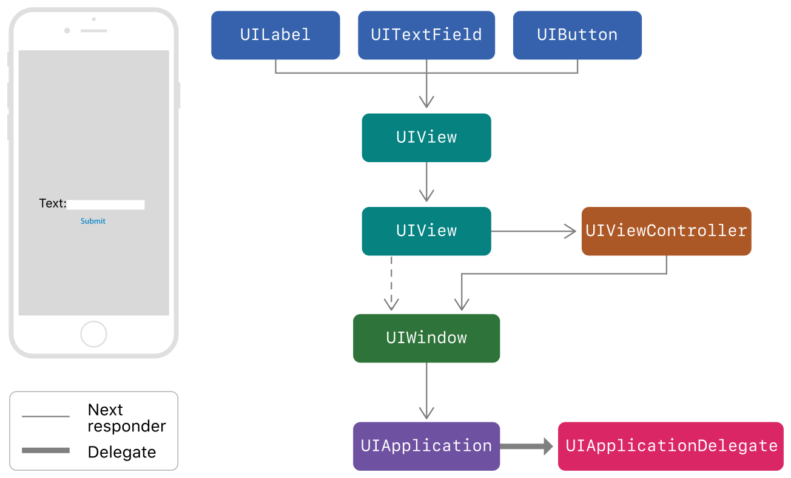
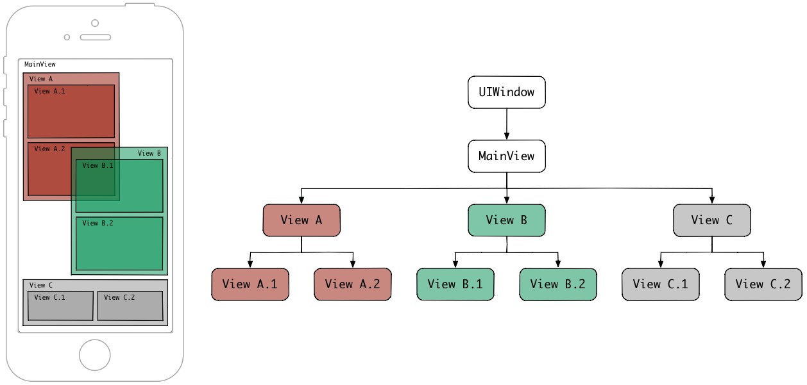
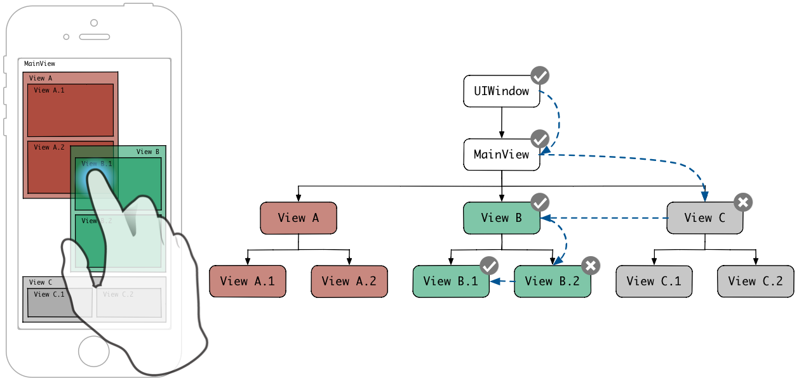
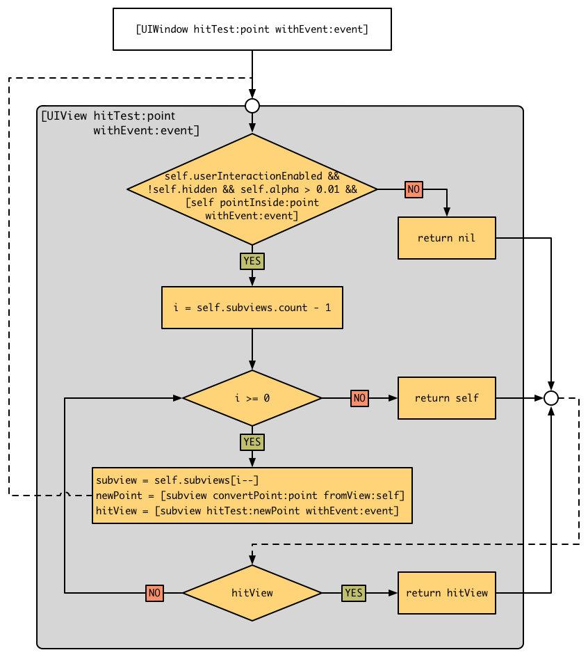
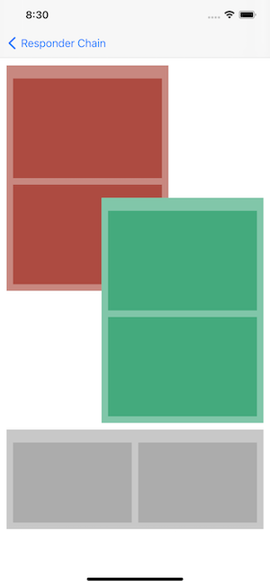
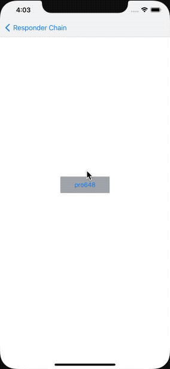
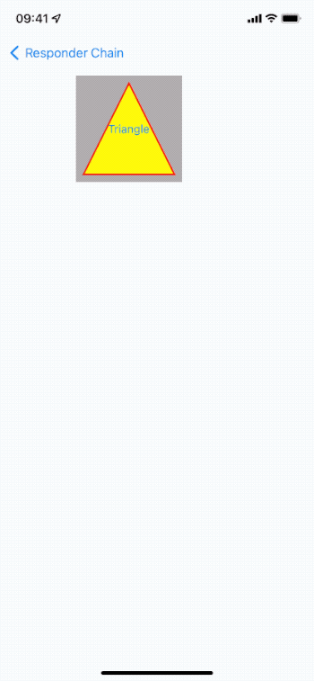

在使用手机的过程中，会产生很多交互事件，如触摸屏幕、摇晃、按下按键、使用耳机操控设备等。这些事件都需要系统去响应并作出处理。这篇文章将介绍系统是如何响应、处理这些事件的。

## 1. UIEvent

`UIEvent`描述用户与 app 的单次交互。

应用可以接收不同类型的*事件（event）*，包括触摸事件（touch events）、运动事件（motion events）、远程控制事件（remote-control events）和按下物理按键事件（press events）。触摸事件是最常见的事件，发送给触摸的视图。运动事件由 UIKit 触发，并与 Core Motion framework 运动事件进行区分。远程控制事件允许 responder 对象接收外部配件的指令（如耳机），以便管理音视频播放。Press events 代表与 game controller、AppleTV remote 或其他有物理按键设备的交互。可以使用`type`和`subtype`属性判断事件类型。

Touch event 对象包含与事件相关的 touch。Touch event 对象包含一个或多个 touch，每个 touch 都由`UITouch`对象表示。当发生触摸事件时，系统将事件路由至合适的响应者，并调用`touchesBegan(_:with:)`方法，responder 提取 touch 中的数据，并作出适当响应。

在多点触摸序列中，向 app 传递更新的触摸数据时，UIKit 会复用`UIEvent`对象。因此，不要持有`UIEvent`对象及其中的数据。如果需要在响应者方法之外使用`UIEvent`、`UITouch`数据，应在响应者方法中处理数据，并复制到自定义的数据结构中。

## 2. UITouch

`UITouch`对象表示屏幕上 touch 的位置、大小、移动和压力。

通过传递给 responder 的`UIEvent`来获取`UITouch`对象，`UITouch`提供以下信息：

- touch 发生的 view 或 window。
- touch 位于 view 或 window 的位置。
- touch 大致半径。
- touch 压力大小（支持 3D Touch 或 Apple Pencil 的设备）。

此外，touch 对象使用`timestamp`属性表示 touch 发生的时间，该时间为[马赫时间](https://github.com/pro648/tips/blob/master/sources/%E5%9B%BE%E5%B1%82%E6%97%B6%E9%97%B4CAMediaTiming.md#2-%E6%97%B6%E9%97%B4%E5%B1%82%E7%BA%A7%E5%85%B3%E7%B3%BB)。另外，`timestamp`记录的是事件发生（.began）、改变（.move）的时间，事件发生与传递可能有delay，使用时需对比前后事件的timestamp，而非UTC时间。

整数类型的`tapCount`属性表示点击屏幕的次数，`UITouch.Phase`属性表示处于began、moved、ended、cancelled等阶段。

Touch 对象会在整个多点触控序列中存在。当处理多点触控序列时，可以引用 touch 对象，直到触控结束才释放。如果需要在多点触控序列外使用，需复制 touch 中的数据到自定义数据结构。

`gestureRecognizers`属性包含了当前处理 touch 的手势识别器。`UIGestureRecognizer`实现了`touchesBegan(_:with:)`、`touchesMoved(_:with)`、`touchesEnded(_:with)`、`touchesCancelled(_:with)`四个方法，但其并不是responder，也不参与响应链。但touch传递给view时，也会传递给view关联的gesture recognizer。如果view的父视图包含手势识别器，也会传递给父视图手势识别器。最终，传递给整个视图层级中的手势识别器。

#### 2.1 Touch与Gesture Recognizer

当touch首次创建并传递给gesture recognizer时，也会传递给hit-test视图，同时调用视图、手势识别器的`touchesBegan(_:with:)`方法。

这样就不会因为gesture recognizer正在分析手势，导致view接收不到事件了。如果所有手势识别器都识别失败，则视图继续接收事件，就像手势识别器不曾存在一样。另外，gesture recognizer和touch是两种不同的机制，有时需要同时处理。例如，屏幕上添加了单击手势、双击手势，`touchesBegan(_:with:)`时还需改变触摸位置颜色，`touchesEnded(_:with:)`和`touchesCancelled(_:with:)`恢复颜色。想要处理这种场景，就需要同时接收touch事件。

如果view的gesture recognizer识别成功，会给view发送`touchesCancelled(_:with:)`消息，随后该view不会再收到该touch事件。修改`cancelsTouchesInView`属性为false可以改变这一特点。如果把view的所有gesture recognizer的`cancelsTouchesInView`都改为false，则view可以接收完整的事件，就像gesture recognizer不存在一样。

Gesture recognizer也可以延迟传递给view的touch事件，且默认开启。`UIGestureRecognizer`的`delaysTouchesEnded`属性默认为true。当touch变为`.end`状态时，会调用gesture recognizer的`touchesEnded(_:with:)`方法。此时，如果因gesture还处于`.possible`状态、touch事件仍在向view传递，则该touch事件不会被传递给view，直到gesture解析完毕手势。如果识别成功，调用view的`touchesCancelled(_:with)`；如果识别失败，调用view的`touchesEnded(_:with:)`。

当处理多点触控时，这样设计的优势就体现出来了。例如双击手势，第一次点击结束，但不足以表明双击手势成功还是失败，手势识别器持有该touch。第二次点击成功后，向view发送`touchesCancelled(_:with:)`。如果view之前已经接收了`touchesEnded(_:with:)`，则不能实现这一点。手势识别器拥有优先识别权。

将gesture recognizer的`delaysTouchesBegin`属性设置为true，可以延迟整个touch事件传递。如果手势识别成功，调用view的`touchesCancelled(_:with:)`方法；如果识别失败，调用view的`touchesBegan(_:with:)`，随后调用`touchesMoved(_:with:)`，但只会收到最后一次`touchesMoved(_:with:)`，因为发送队列中所有touch没有意义。

touch延迟传递后，传递的还是原来的touch、event，`timestamps`还是事件触发的时间，不会因延迟而更新。

> 如果你对gesture recognizer还不了解，可以查看我的另一篇文章：[手势控制：点击、滑动、平移、捏合、旋转、长按、轻扫](https://github.com/pro648/tips/blob/master/sources/%E6%89%8B%E5%8A%BF%E6%8E%A7%E5%88%B6%EF%BC%9A%E7%82%B9%E5%87%BB%E3%80%81%E6%BB%91%E5%8A%A8%E3%80%81%E5%B9%B3%E7%A7%BB%E3%80%81%E6%8D%8F%E5%90%88%E3%80%81%E6%97%8B%E8%BD%AC%E3%80%81%E9%95%BF%E6%8C%89%E3%80%81%E8%BD%BB%E6%89%AB.md)。

## 3. UIResponder

`UIResponder`类抽象了响应和处理事件的接口。

*响应者（responder）对象*（即`UIResponder`的实例）构成了事件处理的骨干。很多对象都继承自`UIResponder`，如`UIApplication`、`UIViewController`、`UIView`(`UIWindow`继承自`UIView`，进而也继承自`UIResponder`)。事件发生时，UIKit调度事件给 responder 处理。

想要处理特定类型事件，responder 必须重写对应方法。例如，想要处理 touch event，responder 需重写以下方法：

- touchesBegan(_:with:)
- touchesMoved(_:with:)
- touchesEnded(_:with:)
- touchesCancelled(_:with:)

在触摸事件中，responder 使用参数中的 event 信息跟踪 touch 变化，并更新 UI。

除了处理事件，responder 还可以转发未处理的事件。如果指定 responder 未处理事件，它会将事件转发给响应链（responder chain）中的 next responder。UIKit 根据规则，动态管理响应链。

Responder 对象除了处理`UIEvent`，还可以通过`inputView`接收自定义输入，系统的键盘就是一种 input view。用户点击屏幕上的`UITextField`或`UITextView`时，它成为 first responder 并显示 input view，默认展示系统键盘。可以创建自定义 input view 赋值给`inputView`属性，当其成为第一响应者时展示。

## 4. 事件传递

当 iPhone 接收到一个事件时，处理过程如下：

1. 通过动作触发事件，唤醒处于睡眠状态的app。

2. 使用 IOKit.framework 将事件封装为 IOHIDEvent 对象。

   > IOKit.framework 是一个系统框架的集合，用来驱动一些系统事件。IOHIDEvent 中的 HID 代表 Human Interface Device。

3. 系统通过 mach port 将 IOHIDEvent 对象转发给 SpringBoard.app。

4. SpringBoard.app 是 iOS 系统桌面 app，只接收按键、触摸、加速、接近传感器等几种 event。SpringBoard.app 找到可以响应这个事件的 app，并通过 mach port 将 IOHIDEvent 对象转发给 app 。

5. app 主线程 RunLoop 接收到 SpringBoard.app 转发的消息，触发对应 mach port 的 source1 回调 __IOHIDEventSystemClientQueueCallback()。

6. Source1 回调内部触发 Source0 回调 __UIApplicationHandleEventQueue()。

7. Source0 回调内部，将 IOHIDEvent 对象转化为`UIEvent`。

8. Source0 回调内部调用 UIApplication 的`sendEvent(_:)`方法，将`UIEvent`发给`UIWindow`。

`UIWindow`接收到事件后，开始传递事件。

## 5. 第一响应者 First Responder

下图显示了包含`UILabel`、`UITextField`、`UIButton`、`UIView`、`UIViewController`、`UIWindow`等视图的事件传递。



如果文本框没有处理 event，UIKit 转发事件给文本框的父视图`UIView`，随后是控制器的根视图、视图控制器、window。如果 window 也没有处理 event，UIKit 转发 event 至 UIApplication。如果 app delegate 是`UIResponder`子类，且未处于 responder chain，则也可能转发给 app delegate。

UIKit 根据事件类型指定第一响应者，事件类型如下：

| 事件类型     | 第一响应者              |
| ------------ | ----------------------- |
| 触摸事件     | 触摸的视图              |
| 按压事件     | 焦点对象                |
| 晃动事件     | 开发者或UIKit指定的对象 |
| 远程控制事件 | 开发者或UIKit指定的对象 |
| 编辑按钮信息 | 开发者或UIKit指定的对象 |

> 与加速计、陀螺仪、磁力仪相关的运动事件，不遵守 responder chain，Core Motion 直接将事件发送给指定对象。

触摸事件传递大致分为以下三个阶段： 

1. 寻找触摸对象 hit-testing。
2. 响应手势 recognize gesture。
3. 触摸事件传递 response chain。

#### 5.1 Hit-testing

Hit-testing 是查找 touch point 是否位于指定视图上的过程。iOS 使用 hit-testing 查找触摸事件最前的视图（即视图数组中 index 最大的视图），hit-testing 使用逆序深度优先遍历算法（reverse pre-order depth-first traversal algorithm）查找视图。

在介绍 hit-testing 如何工作前，先看下从手指触摸屏幕到抬起的单次触摸流程：


如上图所示，每次触摸屏幕的时候都会调用 hit-testing，并且是在视图、gesture recognizer 收到`UIEvent`之前。

Hit-testing 结束后，触摸位置下最前端视图被选为 first responder，它被关联到`UITouch`对象，并且 touch event 的所有阶段都会关联此视图。除了 hit test 视图，添加到 hit test 视图、父视图上的手势，都会关联到`UITouch`对象。最后，hit test 视图开始接受触摸系列事件。

> 即使手指已经滑动到 hit test view 边界之外，到了另一个视图上，hit test view 也会继续接收`UITouch`，直到这次 touch event 序列结束。

像前面说到的，hit-testing 使用逆序深度优先遍历算法（先查找到根视图，然后从高 index 开始遍历子视图）。子视图永远渲染在父视图之上；子视图数组中，兄弟视图（sibling view）中高 index 对象更大概率渲染在低 index 对象之上，多个视图覆盖在一起时，数组中高 index 对象更大概率是最前端视图。因此，逆序深度优先遍历算法可以减少遍历次数。

> 子视图会覆盖部分或全部父视图。父视图使用数组存储子视图，在数组中顺序决定子视图的可见性。如果两个子视图覆盖在一起，后添加子视图覆盖在先添加的子视图之上。

下图显示了视图和对应视图层级树，视图树从左至右反映了视图添加到父视图的顺序。



如上图所示，View A 和 View B，及其子视图 View A.2 和 View B.1覆盖在一起，但由于 View B 的 index 大于 View A，View B 和它的子视图渲染到了 View A 和它的子视图上面。因此，当触摸重叠的 View B.1 区域时，hit-testing 返回 View B.1 视图。

逆序深度优先遍历算法查找过程如下：



`UIWindow`是视图层级结构的根视图，查找时先向`UIWindow`发送`hitTest(_:with:)`消息，该方法会返回包含触摸位置的视图。

下图显示了查找逻辑：



下面代码演示了`hitTest(_:event:)`方法可能的实现方式：

```
    func hitTest(_ point: CGPoint, with event: UIEvent?) -> UIView? {
        // 只有允许用户交互、没有隐藏、可见度大于 0.01 时，才允许接收手势。
        guard isUserInteractionEnabled, !isHidden, alpha > 0.01 else { return nil }
        
        // 点击point不在视图中时，直接返回 nil。
        guard self.point(inside: point, with: event) else {
            return nil
        }
        
        // 逆序遍历子视图
        for subView in subviews.reversed() {
            let convertedPoint = subView.convert(point, from: self)
            let hitTestView = subView.hitTest(convertedPoint, with: event)
            
            // 首个非空子视图即为 first responder
            if let hitView = hitTestView {
                return hitView
            }
        }
        
        // 如果所有子视图都没有响应 hit-testing，则视图本身为 first responder。
        return self
    }
```

使用 runtime 的 method swizzling 交换系统的`hitTest(_:event:)`方法，每次调用时输出当前类，查找到 first responder 时输出 first responder。如下所示：

```
extension UIView{
    public class func initializeMethod() {
        
        // hit-testing
        let originalHitSelector = #selector(UIView.hitTest(_:with:))
        let swizzleHitSelector = #selector(UIView.pr_hitTest(_:with:))
        
        guard let originalHitMethod = class_getInstanceMethod(self, originalHitSelector) else { return }
        guard let swizzleHitMethod = class_getInstanceMethod(self, swizzleHitSelector) else { return }
        
        let didAddHitMethod = class_addMethod(self, originalHitSelector, method_getImplementation(swizzleHitMethod), method_getTypeEncoding(swizzleHitMethod))
        if didAddHitMethod {
            class_replaceMethod(self, swizzleHitSelector, method_getImplementation(originalHitMethod), method_getTypeEncoding(swizzleHitMethod))
        } else {
            method_exchangeImplementations(originalHitMethod, swizzleHitMethod)
        }
        
        // pointInside
        let originalInsideSelector = #selector(UIView.point(inside:with:))
        let swizzleInsideSelector = #selector(UIView.pr_point(inside:with:))
        
        guard let originalInsideMethod = class_getInstanceMethod(self, originalInsideSelector) else { return }
        guard let swizzleInsideMethod = class_getInstanceMethod(self, swizzleInsideSelector) else { return }
        
        let didAddInsideMethod = class_addMethod(self, originalInsideSelector, method_getImplementation(swizzleInsideMethod), method_getTypeEncoding(swizzleInsideMethod))
        if didAddInsideMethod {
            class_replaceMethod(self, swizzleInsideSelector, method_getImplementation(originalInsideMethod), method_getTypeEncoding(swizzleInsideMethod))
        } else {
            method_exchangeImplementations(originalInsideMethod, swizzleInsideMethod)
        }
    }
    
    // 交换系统的hitTest(_:event:)方法，hit-Testing 时可以查看查找顺序。
    @objc public func pr_hitTest(_ point: CGPoint, with event: UIEvent?) -> UIView? {
        print(NSStringFromClass(type(of: self)) + "  " + #function)
        let result = pr_hitTest(point, with: event)
        if result != nil {
            print((NSStringFromClass(type(of: self))) + " pr_hitTesting return:" + NSStringFromClass(type(of: result!)))
        }
        
        return result
    }
    
    @objc public func pr_point(inside point: CGPoint, with event: UIEvent?) -> Bool {
        print(NSStringFromClass(type(of: self)) + " --- pr_pointInside")
        let result = pr_point(inside: point, with: event)
        print(NSStringFromClass(type(of: self)) + " pr_pointInside +++ return: \(result)")
        return result
    }
}
```

> 如果你对 runtime 还不了解，可以查看我的文章：[Runtime从入门到进阶一](https://github.com/pro648/tips/blob/master/sources/Runtime%E4%BB%8E%E5%85%A5%E9%97%A8%E5%88%B0%E8%BF%9B%E9%98%B6%E4%B8%80.md)和[Runtime从入门到进阶二](https://github.com/pro648/tips/blob/master/sources/Runtime%E4%BB%8E%E5%85%A5%E9%97%A8%E5%88%B0%E8%BF%9B%E9%98%B6%E4%BA%8C.md)。

点击 ViewB1:




输出如下：

```
// hit-testing 时会调用point inside。
UIWindow  pr_hitTest(_:with:)
UIWindow --- pr_pointInside
UIWindow pr_pointInside +++ return: true
UITransitionView  pr_hitTest(_:with:)
UITransitionView --- pr_pointInside
UITransitionView pr_pointInside +++ return: true
UIDropShadowView  pr_hitTest(_:with:)
UIDropShadowView --- pr_pointInside
UIDropShadowView pr_pointInside +++ return: true
UILayoutContainerView  pr_hitTest(_:with:)
UILayoutContainerView --- pr_pointInside
UILayoutContainerView pr_pointInside +++ return: true
UINavigationBar  pr_hitTest(_:with:)
UINavigationBar --- pr_pointInside
UINavigationBar pr_pointInside +++ return: false
UINavigationTransitionView  pr_hitTest(_:with:)
UINavigationTransitionView --- pr_pointInside
UINavigationTransitionView pr_pointInside +++ return: true
UIViewControllerWrapperView  pr_hitTest(_:with:)
UIViewControllerWrapperView --- pr_pointInside
UIViewControllerWrapperView pr_pointInside +++ return: true

// UIView、ViewC、ViewB、ViewB2、ViewB1依次调用 hitTest。
UIView  pr_hitTest(_:with:)
UIView --- pr_pointInside
UIView pr_pointInside +++ return: true
ResponderChain.ViewC  pr_hitTest(_:with:)
ResponderChain.ViewC --- pr_pointInside
ResponderChain.ViewC pr_pointInside +++ return: false
ResponderChain.ViewB  pr_hitTest(_:with:)
ResponderChain.ViewB --- pr_pointInside
ResponderChain.ViewB pr_pointInside +++ return: true
ResponderChain.ViewB2  pr_hitTest(_:with:)
ResponderChain.ViewB2 --- pr_pointInside
ResponderChain.ViewB2 pr_pointInside +++ return: false
ResponderChain.ViewB1  pr_hitTest(_:with:)
ResponderChain.ViewB1 --- pr_pointInside
ResponderChain.ViewB1 pr_pointInside +++ return: true
ResponderChain.ViewB1 pr_hitTesting return:ResponderChain.ViewB1
ResponderChain.ViewB pr_hitTesting return:ResponderChain.ViewB1
UIView pr_hitTesting return:ResponderChain.ViewB1
UIViewControllerWrapperView pr_hitTesting return:ResponderChain.ViewB1
UINavigationTransitionView pr_hitTesting return:ResponderChain.ViewB1
UILayoutContainerView pr_hitTesting return:ResponderChain.ViewB1
UIDropShadowView pr_hitTesting return:ResponderChain.ViewB1
UITransitionView pr_hitTesting return:ResponderChain.ViewB1

// 再次执行 hit-Testing
UIWindow pr_hitTesting return:ResponderChain.ViewB1
UIWindow  pr_hitTest(_:with:)
UIWindow --- pr_pointInside
UIWindow pr_pointInside +++ return: true
UITransitionView  pr_hitTest(_:with:)
UITransitionView --- pr_pointInside
UITransitionView pr_pointInside +++ return: true
UIDropShadowView  pr_hitTest(_:with:)
UIDropShadowView --- pr_pointInside
UIDropShadowView pr_pointInside +++ return: true
UILayoutContainerView  pr_hitTest(_:with:)
UILayoutContainerView --- pr_pointInside
UILayoutContainerView pr_pointInside +++ return: true
UINavigationBar  pr_hitTest(_:with:)
UINavigationBar --- pr_pointInside
UINavigationBar pr_pointInside +++ return: false
UINavigationTransitionView  pr_hitTest(_:with:)
UINavigationTransitionView --- pr_pointInside
UINavigationTransitionView pr_pointInside +++ return: true
UIViewControllerWrapperView  pr_hitTest(_:with:)
UIViewControllerWrapperView --- pr_pointInside
UIViewControllerWrapperView pr_pointInside +++ return: true
UIView  pr_hitTest(_:with:)
UIView --- pr_pointInside
UIView pr_pointInside +++ return: true
ResponderChain.ViewC  pr_hitTest(_:with:)
ResponderChain.ViewC --- pr_pointInside
ResponderChain.ViewC pr_pointInside +++ return: false
ResponderChain.ViewB  pr_hitTest(_:with:)
ResponderChain.ViewB --- pr_pointInside
ResponderChain.ViewB pr_pointInside +++ return: true
ResponderChain.ViewB2  pr_hitTest(_:with:)
ResponderChain.ViewB2 --- pr_pointInside
ResponderChain.ViewB2 pr_pointInside +++ return: false
ResponderChain.ViewB1  pr_hitTest(_:with:)
ResponderChain.ViewB1 --- pr_pointInside
ResponderChain.ViewB1 pr_pointInside +++ return: true
ResponderChain.ViewB1 pr_hitTesting return:ResponderChain.ViewB1
ResponderChain.ViewB pr_hitTesting return:ResponderChain.ViewB1
UIView pr_hitTesting return:ResponderChain.ViewB1
UIViewControllerWrapperView pr_hitTesting return:ResponderChain.ViewB1
UINavigationTransitionView pr_hitTesting return:ResponderChain.ViewB1
UILayoutContainerView pr_hitTesting return:ResponderChain.ViewB1
UIDropShadowView pr_hitTesting return:ResponderChain.ViewB1
UITransitionView pr_hitTesting return:ResponderChain.ViewB1
UIWindow pr_hitTesting return:ResponderChain.ViewB1

```

从日志中可以看到，首先是`UIWindow`开始调用 hitTest，然后是导航控制器视图、根视图，之后是ViewC，ViewC返回 false后，开始遍历ViewB，ViewB返回 ture 后，先遍历 ViewB2，ViewB2 返回 false 后才遍历 ViewB1，最终返回 ViewB1。

> 可以看到，一次点击会调用两次`hitTest(_:event:)`，这是因为系统在调用 hit test 时，可能微调点击位置，`hitTest(_:event:)`只是单纯的函数，没有其它副作用。

## 6. 用途

通过重写`hitTest(_:event:)`、`pointInside(point:event:)`方法，可以将事件转发给其它视图处理。

> 由于先执行`hitTest(_:event:)`、后发送 event，重写`hitTest(_:event:)`、`pointInside(point:event:)`方法后，转发的事件是完整事件，即包含`UITouch.Phase.began`、`UITouch.Phase.moved`、`UITouch.Phase.ended`等所有阶段的事件。

#### 6.1 扩大可点击区域

一个常见用途就是扩大可点击区域，使它大于视图`bounds`。下图的按钮大小为 20*20，不太方便点击，可以使用`pointInside(point:event:)`扩大其可点击区域。


为了使其更具有通用性，为`UIButton`增加分类，在分类方法中实现改变可点击区域的功能，这样后续想要使用时，只需调用分类方法即可。

下面使用runtime为分类添加属性的方式，实现扩大`UIButton`可点击区域的功能：

```
// 修改 UIButton 可点击区域

struct AssociateKeys {
    static var topKey: UInt8 = 0
    static var leftKey: UInt8 = 1
    static var bottomKey: UInt8 = 2
    static var rightKey: UInt8 = 3
}

protocol HitTestSlopProtocol {
    func expand(edgeInset hitTestSlop: UIEdgeInsets)
}

extension UIButton: HitTestSlopProtocol {
    func expand(edgeInset hitTestSlop: UIEdgeInsets) {
        objc_setAssociatedObject(self, &AssociateKeys.topKey, hitTestSlop.top, objc_AssociationPolicy.OBJC_ASSOCIATION_RETAIN_NONATOMIC)
        objc_setAssociatedObject(self, &AssociateKeys.leftKey, hitTestSlop.left, objc_AssociationPolicy.OBJC_ASSOCIATION_RETAIN_NONATOMIC)
        objc_setAssociatedObject(self, &AssociateKeys.bottomKey, hitTestSlop.bottom, objc_AssociationPolicy.OBJC_ASSOCIATION_RETAIN_NONATOMIC)
        objc_setAssociatedObject(self, &AssociateKeys.rightKey, hitTestSlop.right, objc_AssociationPolicy.OBJC_ASSOCIATION_RETAIN_NONATOMIC)
    }

    private func slop() -> UIEdgeInsets {
        guard let topValue = objc_getAssociatedObject(self, &AssociateKeys.topKey) as? CGFloat,
              let leftValue = objc_getAssociatedObject(self, &AssociateKeys.leftKey) as? CGFloat,
              let bottomValue = objc_getAssociatedObject(self, &AssociateKeys.bottomKey) as? CGFloat,
              let rightValue = objc_getAssociatedObject(self, &AssociateKeys.rightKey) as? CGFloat else { return .zero}
        
        return UIEdgeInsets(top: topValue, left: leftValue, bottom: bottomValue, right: rightValue)
    }
    
    open override func point(inside point: CGPoint, with event: UIEvent?) -> Bool {
        let insets = slop()
        
        if insets == .zero {
            // Safer to use UIView's point(inside:with:) if we can.
            return super.point(inside: point, with: event)
        } else {
            return bounds.inset(by: insets).contains(point)
        }
    }
}
```

后续想要改变可点击区域时，只需调用`expand(edgeInset:)`方法即可：

```
        button.expand(edgeInset: UIEdgeInsets(top: -30, left: -30, bottom: -30, right: -30))
```

点击 button 之外，也可以触发 button 事件，如下所示：



> 通过重写`hitTest(_:event:)`，可以实现 tabbar 中部突出部分响应手势的需求。与上面实现有些类似，但不必写成分类。

#### 6.2 事件集中处理

假设视图控制器中有一个 table view，cell 上有两个按钮 firstButton、secondButton，点击按钮、cell本身都会触发事件。以前我们一般直接处理事件，或使用delegate、closure等回调给视图控制器处理，现在我们可以使用 nextResponder 将所有响应都传递到控制器处理，这样代码逻辑会更清晰，业务逻辑也变得更简单。

```
extension UIResponder {
    
    /// 将事件转发给下一 responder
    /// - Parameters:
    ///   - event: 事件名称
    ///   - userInfo: 事件附带的额外信息
    @objc func routerEvent(with event: String, userInfo: [String:String]) {
        print(NSStringFromClass(type(of: self)) + "  " + #function)
        
        self.next?.routerEvent(with: event, userInfo: userInfo)
    }
}

    // Cell 按钮的点击事件
    @objc private func firstButtonTapped(_: UIButton) {
        print(NSStringFromClass(type(of: self)) + "  " + #function)
        
        // 路由给控制器处理
        routerEvent(with: "firstButton", userInfo: [:])
    }
    
    @objc private func secondButtonTapped(_: UIButton) {
        print(NSStringFromClass(type(of: self)) + "  " + #function)
        
        routerEvent(with: "secondButton", userInfo: [:])
    }
    
extension RouterEventVC {
    // 统一处理所有事件
    override func routerEvent(with event: String, userInfo: [String : String]) {
        if event == "firstButton" {
            print("firstButton Clicked")
        } else if event == "secondButton" {
            print("secondButton Clicked")
        } else {
            print("Something else Clicked")
        }
    }
}
```

这样就可以将点击firstButton、secondButton的响应方法集中在 RouterEventVC 中处理。点击 firstButton 时，触发`routerEvent(with: "firstButton", userInfo: [:])`方法，此时将事件转发给`UITableViewCell`；由于 cell 没有处理事件，cell 将事件转发给`UITableView`处理；由于`UITableView`没有处理事件，table view 将事件转发给 RouterEventVC 的根视图`UIView`；由于`UIView`没有处理事件，它将事件转发给 RouterEventVC，RouterEventVC 已经处理了事件，不再进行转发。最后，也就由视图控制器统一处理。

#### 6.3 可点击区域为三角形

如果在矩形视图中绘制了一个三角形，点击三角形外的矩形区域也可响应。这是因为hit test不了解绘制内容，以及绘制内容是否透明等。

如果知道内容是如何绘制的，可以创建出边界`CGPath`，通过`contains(_:using:transform:)`查看point是否在path内。如下所示：

```
    override func hitTest(_ point: CGPoint, with event: UIEvent?) -> UIView? {
        guard let result = super.hitTest(point, with: event) else { return nil}
        
        if result != self {
            return result
        }
        
        if bezierPath.contains(point) {
            return result
        } else {
            return nil
        }
    }
```

`bezierPath`是绘制三角形的path。运行后如下所示：



可以看到，只有点击三角形内区域时，才会触发`UIButton`的touch up inside。

#### 6.4 动画过程中可响应手势

使用`UIView`的类方法添加的动画，动画过程中视图不可交互。因为用户看到的是presentation layer，而视图所处位置是model layer。

开启了`.allowUserInteraction`后，动画过程中用户点击看到的视图并不会响应，而点击目标位置会出发视图的响应事件。因此，`UIView`类方法的视图动画默认禁用了交互。

如果想要点击动画视图，可以hit-test presentation layer。如下所示：

```
    override func hitTest(_ point: CGPoint, with event: UIEvent?) -> UIView? {
        let presentationLayer = layer.presentation()
        let superPoint = convert(point, to: superview)
        guard let prespt = superview?.layer.convert(superPoint, to: presentationLayer) else {
            return super.hitTest(point, with: event)
        }

        let hitView = super.hitTest(prespt, with: event)
        return hitView
    }
```

虽然，上述方法可以实现点击动画视图，但视图会独享touch事件。例如，动画视图是`UIButton`，button动画过程中可以点击，也会高亮，但不会触发button的action，但可以通过给button添加手势解决该问题。

iOS 10中新增加的`UIViewPropertyAnimator`默认开启了`isUserInteractionEnabled`，即视图动画过程中可交互。property animator会hit-test动画视图的presentation layer，动画的视图也不会独享touch事件。下面使用property animator给button添加平移动画：

```
        let propertyAnimator = UIViewPropertyAnimator(duration: 10, curve: .linear) {
            self.button.center = goal
        }
        propertyAnimator.startAnimation()
```

借助`UIViewPropertyAnimator`，视图动画可以由用户中断、恢复。如果你还不了解`UIViewPropertyAnimator`，可以查看我的另一篇文章：[UIViewPropertyAnimator的使用](https://github.com/pro648/tips/blob/master/sources/UIViewPropertyAnimator%E7%9A%84%E4%BD%BF%E7%94%A8.md)。

#### 6.5 UIGestureRecognizer与UIControl

当视图已经能处理的手势与手势识别器手势相同时会产生冲突，如`UIControl`，特别是gesture recognizer添加到了`UIControl`的父视图。`UIControl`并不会阻塞父视图的手势识别器识别手势，即使`UIControl`自身能够处理该touch事件。例如，window的根视图添加了`UITapGestureRecognizer`，根视图上还添加了`UIButton`，点击button时点击手势会响应吗？

`UIView`的实例方法`gestureRecognizerShouldBegin(_:)`解决了该问题。该方法的参数为`UIGestureRecognizer`类型，通过判断手势识别器类型、是否属于当前视图决定是否禁用该手势识别器。`UIButton`重写该方法时，为`UITapGestureRecognizer`返回`false`禁用点击手势。`UIKit`中`UISlider`、`UISwitch`等控件均重写了`gestureRecognizerShouldBegin(_:)`方法。

另外，还可以通过实现`UIGestureRecognizerDelegate`协议，解决手势冲突问题。

## 总结

事件响应链和传递链完全相反。最有机会处理事件的就是通过事件传递找到的 first responder；如果 first responder 没有进行处理，就会沿着事件响应链传递给*下一个响应者 next responder*，一直追溯到最上层的 UIApplication。若都没有进行处理，就丢弃事件。

Demo名称：ResponderChain  
源码地址：<https://github.com/pro648/BasicDemos-iOS/tree/master/ResponderChain>

参考资料：

1. [Hit-Testing in iOS](http://smnh.me/hit-testing-in-ios/)

2. [Using Responders and the Responder Chain to Handle Events](https://developer.apple.com/documentation/uikit/touches_presses_and_gestures/using_responders_and_the_responder_chain_to_handle_events)

3. [hitTest:withEvent: called twice?](https://lists.apple.com/archives/cocoa-dev/2014/Feb/msg00118.html)

4. [Stored Properties In Swift Extensions](https://marcosantadev.com/stored-properties-swift-extensions/)

5. [iOS 中的事件响应与处理](https://blog.boolchow.com/2018/03/25/iOS-Event-Response/)

6. [事件响应机制](https://yeziahehe.com/2020/01/19/responder_chain/)

7. [iOS事件传递及响应链](https://limeng99.club/learning/2019/12/30/iOS%E4%BA%8B%E4%BB%B6%E4%BC%A0%E9%80%92%E5%8F%8A%E5%93%8D%E5%BA%94%E9%93%BE.html)

8. [iOS响应链](https://xiaozhuanlan.com/topic/8796435021)

   