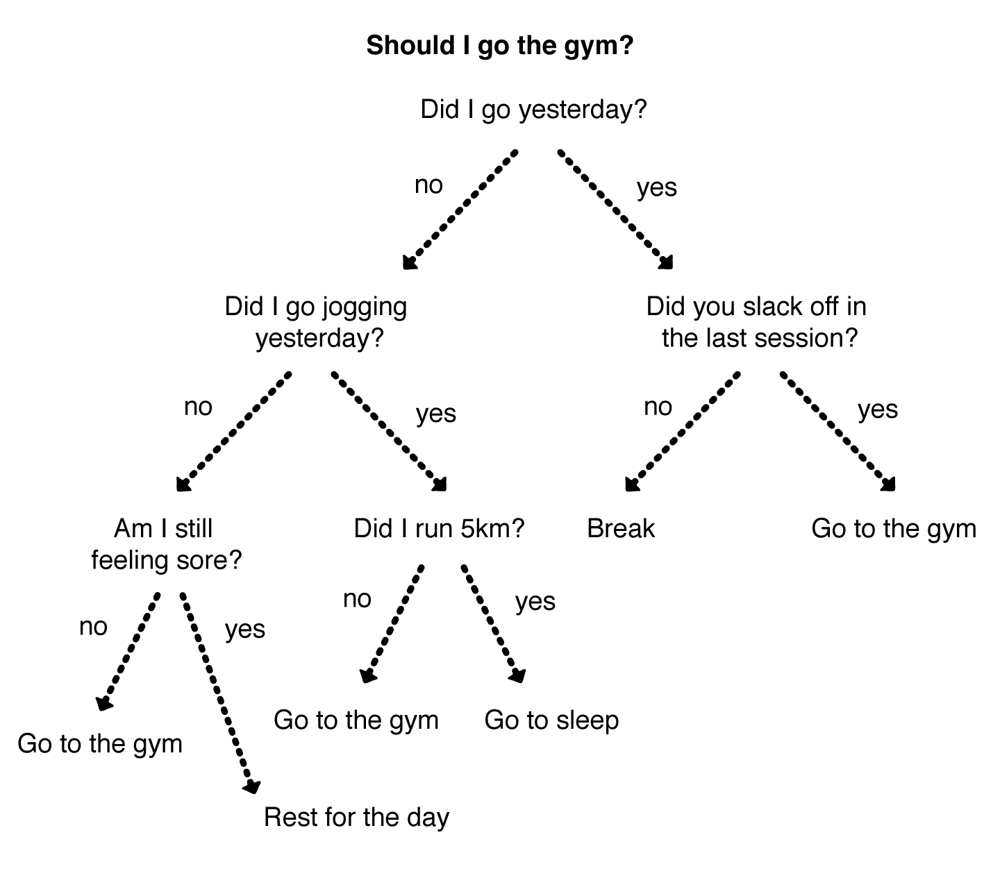
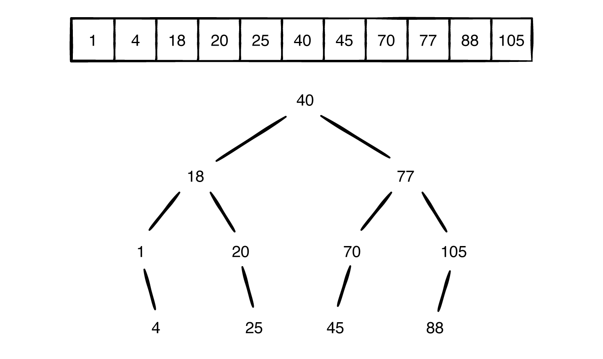
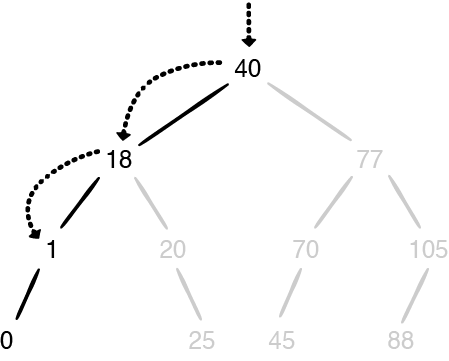
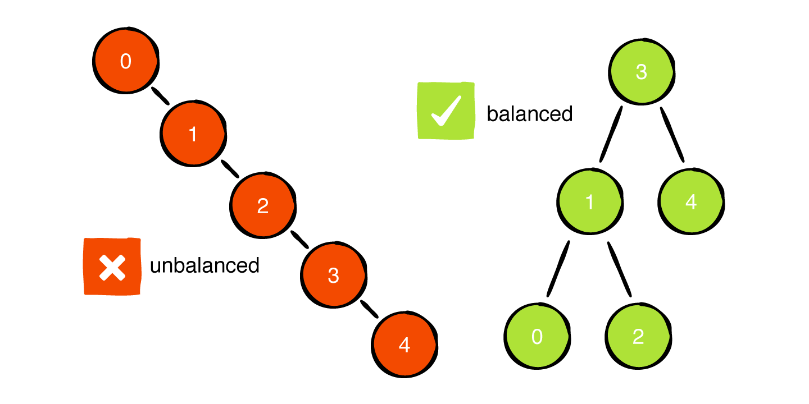
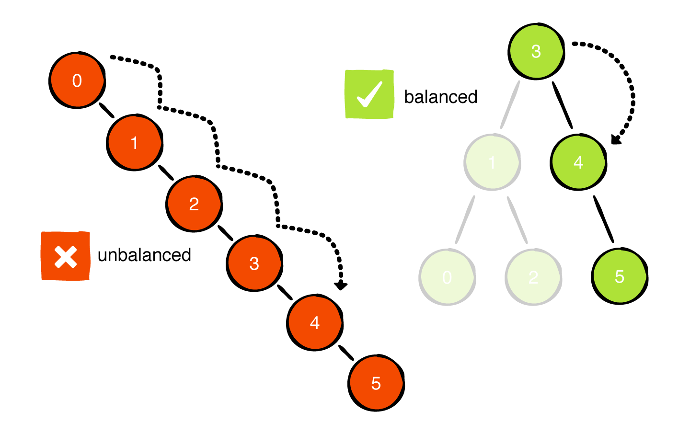
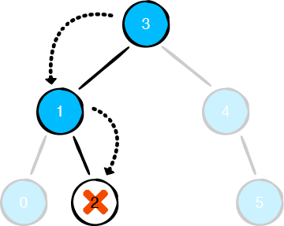
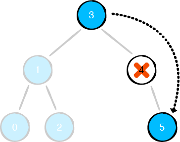
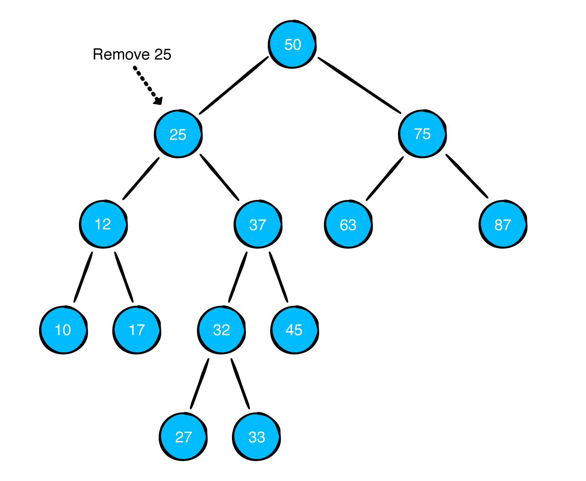
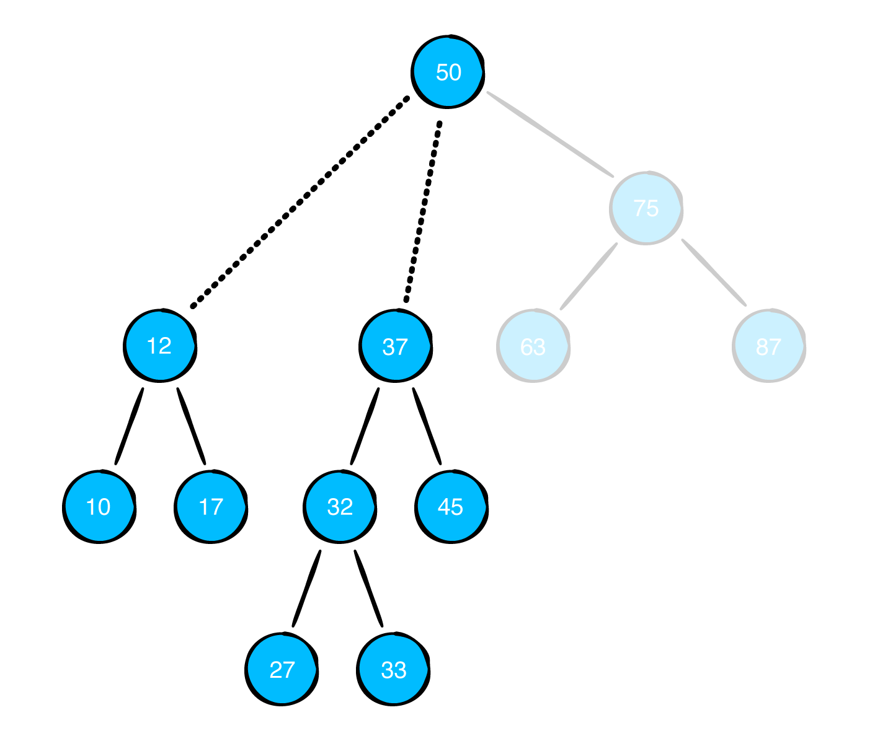
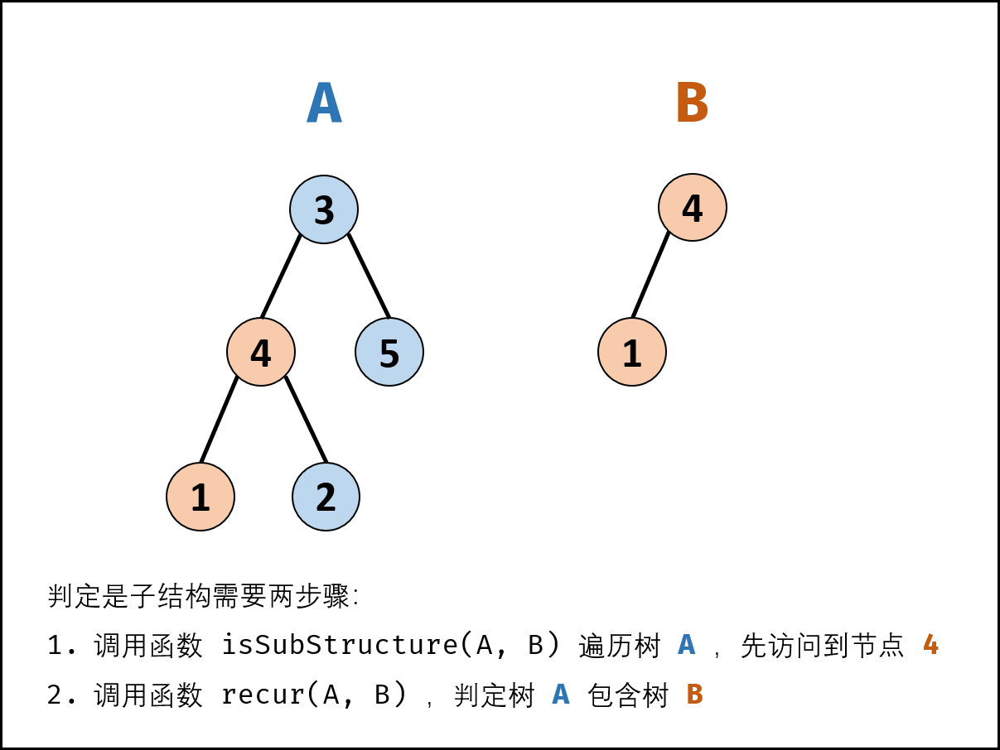

二叉搜索树（Binary Search Tree，简称BST）也称为二叉查找树、有序二叉树（Ordered Binary Tree），或排序二叉树（Sorted Binary Tree）。二叉搜索树是一颗空树，或具有以下性质的二叉树：

- 如果任意节点的左子树不为空，则左子树上所有节点的值小于它的根节点的值。
- 如果任意节点的右子树不为空，则右子树上所有节点的值均大于或等于它的根节点的值。
- 任意节点的左、右子树也分别为二叉搜索树。

二叉查找树相比于其他数据结构，优势在于查找、插入、删除的时间复杂度低，为`O(log n)`，比数组、链表等线性表快很多。二叉查找树是基础性数据结构，用于构建更为基础的数据结构，如集合、多重集、关联数组等。

请看以下决策树，选择一方时，放弃了另一方的所有可能性，从而将问题减半。



一旦做出决定，选择了一个分支，就放弃了另一个分支，这样可以减少一半的选择。

这篇文章将介绍 BST 相对于数组的优势，并实现一个二叉搜索树。

## 1. 数组 VS 二叉搜索树

为了说明 BST 的性能优势，将分析搜索、删除、添加常见操作，并与数组的这些操作进行对比。

集合如下：



#### 1.1 查找

要查找无序数组元素，只能从开始位置一个一个比较。


这就是为什么`array.contains(_:)`操作的复杂度为`O(n)`。

二叉查找树查找过程如下：


搜索算法访问每个节点时，都可以做出以下假设：

- 如果要查找的值小于当前节点的值，它必定在当前节点的左子树。
- 如果要查找的值大于当前节点的值，它必定在当前节点的右子树。

借助 BST 的上述规则，你可以避免对比每一个元素，每次做出选择时将范围缩小一半。因此，二叉搜索树查找复杂度为`O(log n)`。

#### 1.2 插入

二叉搜索树在插入方面的性能与查找类似。假设你要将0插入数组：


向数组插入元素就像插队，所有插入点后面的元素都要后移，以便为插入点提供空间。上图向index为零位置插入元素，所有元素都需后移一位。向数组插入元素复杂度为`O(n)`。

向二叉搜索树插入元素如下：



借助 BST，只需查找三次就可以定位到插入点，无需移动其他元素。BST 插入元素复杂度为`O(log n)`。

#### 1.3 移除

与插入类似，移除数组的元素也可能触发移动其它元素。


与排队情景类似，中间有人离开，后面所有人都需要前移填补空隙。

下面是 BST 中移除元素：


当要移除的元素有子节点时，情况会复杂些，但其复杂度依然是`O(log n)`。

Binary Search Tree大量减少了查找、插入、移除元素的操作步骤，下面将实现一个二叉搜索树。

## 2. 实现二叉搜索树 Binary Search Tree

创建一个 playground，导入上一篇文章[二叉树 Binary Tree](https://github.com/pro648/tips/blob/master/sources/%E4%BA%8C%E5%8F%89%E6%A0%91%20Binary%20Tree.md)创建的二叉树[BinaryNode](https://github.com/pro648/BasicDemos-iOS/blob/master/BinaryTree/BinaryTree.playground/Sources/BinaryNode.swift)。并创建`BinarySearchTree.swift`文件，其代码如下：

```
public struct BinarySearchTree<Element: Comparable> {
    public private(set) var root: BinaryNode<Element>?
    
    public init() {}
}

extension BinarySearchTree: CustomStringConvertible {
    public var description: String {
        guard let root = root else { return "empty tree" }
        return String(describing: root)
    }
}
```

二叉搜索树只接受可比较（comparable）的值。

#### 2.1 插入

根据 BST 规则，节点左子树值必须小于当前节点值，节点右子树值必须大于等于当前节点的值。实现插入方法时必须遵守这一规则。

添加以下插入方法：

```
    /// 插入元素
    public mutating func insert(_ value: Element) {
        root = insert(from: root, value: value)
    }
    
    private func insert(from node: BinaryNode<Element>?, value: Element) -> BinaryNode<Element> {
        // 如果节点为nil，则找到了插入点，返回节点，结束递归。
        guard let node = node else { return BinaryNode(value: value) }
        
        // Element 遵守 Comparable，比较值大小。
        if value < node.value { // 值小于当前节点，继续与左子树比较。
            node.leftChild = insert(from: node.leftChild, value: value)
        } else {    // 大于等于当前节点值，继续与右子树比较。
            node.rightChild = insert(from: node.rightChild, value: value)
        }
        
        return node
    }
```

在 playground page 添加以下代码：

```
example(of: "building a BST") {
    var bst = BinarySearchTree<Int>()
    for i in 0..<5 {
        bst.insert(i)
    }
    print(bst)
}
```

输出如下：

```
--- Example of building a BST ---
   ┌──4
  ┌──3
  │ └──nil
 ┌──2
 │ └──nil
┌──1
│ └──nil
0
└──nil
```

该树遵守了二叉搜索树规则，但并不平衡。不平衡的树性能开销会变大，使用二叉搜索树时始终希望树尽可能平衡。



不平衡的二叉树很影响性能。例如，插入5时间复杂度会变为`O(n)`。



你可以创建自平衡的树，具体细节将在下一篇文章[AVL树](https://github.com/pro648/tips/blob/master/sources/AVL%E6%A0%91.md)中介绍。目前，避免创建不平衡的二叉搜索树即可。

在 playground page 中添加以下代码：

```
var exampleTree: BinarySearchTree<Int> {
    var bst = BinarySearchTree<Int>()
    bst.insert(3)
    bst.insert(1)
    bst.insert(4)
    bst.insert(0)
    bst.insert(2)
    bst.insert(5)
    return bst
}

example(of: "building a BST") {
    print(exampleTree)
}
```

输出如下：

```
--- Example of building a BST ---
 ┌──5
┌──4
│ └──nil
3
│ ┌──2
└──1
 └──0
```

#### 2.2 查找

可以使用遍历二叉树的方式查找 BST 中的节点，但其复杂度为`O(n)`，与在数组中查找无异。

可以借助 BST 自身的规则，避免无尽的比较。方法如下：

```
    /// 查找
    public func contains(_ value: Element) -> Bool {
        var current = root
        
        // 只要节点不为空，继续查找。
        while let node = current {
            if node.value == value {    // 值相等时返回 true。
                return true
            }
            
            // 根据值大小，决定与左子树还是右子树比较。
            if value < node.value {
                current = node.leftChild
            } else {
                current = node.rightChild
            }
        }
        
        return false
    }
```

平衡二叉树查找复杂度为`O(log n)`。

#### 2.3 移除

移除元素要相对复杂些，需分多种情况单独处理：

###### 2.3.1 移除叶子节点

移除叶子节点很简单，只需分离叶子节点：



###### 2.3.2 移除度为一的节点

移除度为一的节点时，需将子节点重新链接到整个树。



###### 2.3.3 移除度为二的节点

假设有以下二叉搜索树，想要移除25节点：



如果直接移除，会进入以下困境：



有两个子树需要链接到父节点，但父节点已经有一个子树。

想要解决这个问题，可以执行一个交换。使用要移除节点右子树的最小值（即右子树最左侧节点）覆盖当前节点的值，这样可以确保二叉搜索树依然是二叉搜索树。因为新节点是右子树最小值，右子树其他节点值都会大于该节点。因为新节点来自于右子树，它会比左子树所有节点值大。

交换后，只需移除被交换的节点即可，其是叶子节点，与移除叶子节点操作相同。

###### 2.3.4 实现移除

使用以下方法实现移除：

```
    public mutating func remove(_ value: Element) {
        root = remove(node: root, value: value)
    }
    
    private func remove(node: BinaryNode<Element>?, value: Element) -> BinaryNode<Element>? {
        guard let node = node else { return nil }
        
        if value == node.value {
            // 叶子节点直接返回nil，即移除。
            if node.leftChild == nil && node.rightChild == nil {
                return nil
            }
            
            // 度为一的节点，左子树为nil，返回右子树。
            if node.leftChild == nil {
                return node.rightChild
            }
            
            // 度为一的节点，右子树为nil，返回左子树。
            if node.rightChild == nil {
                return node.leftChild
            }
            
            // 度为二的节点。
            node.value = node.rightChild!.min.value
            node.rightChild = remove(node: node.rightChild, value: node.value)
            
        } else if value < node.value {
            node.leftChild = remove(node: node.leftChild, value: value)
        } else {
            node.rightChild = remove(node: node.rightChild, value: value)
        }
        
        return node
    }
    
private extension BinaryNode {
    var min: BinaryNode {
        leftChild?.min ?? self
    }
}
```

该方法也使用递归查找要移除的node，与`insert`类似。使用`min`递归查找子树最小值节点。

使用以下方法测试移除：

```
example(of: "removing a node") {
    var tree = exampleTree
    print("Tree before removal:")
    print(tree)
    tree.remove(3)
    print("Tree after removing root:")
    print(tree)
}
```

输出如下：

```
--- Example of removing a node ---
Tree before removal:
 ┌──5
┌──4
│ └──nil
3
│ ┌──2
└──1
 └──0

Tree after removing root:
┌──5
4
│ ┌──2
└──1
 └──0
```

## 3. 算法题

#### 3.1 判断二叉树是否是二叉搜索树

根据前面介绍，二叉搜索树有以下规则：

- 如果该二叉树左子树不为空，则左子树上所有节点的值小于它的根节点的值；
- 如果该二叉树右子树不为空，则右子树上所有节点的值大于、等于它的根节点的值。
- 它的左右子树也是二叉搜索树。

因此，可以设计一个递归函数`isBST(tree, min, max)`来递归判断，该函数以`tree`为根的子树，子树所有节点值是否都在(min, max)范围内。如果不满足，直接返回；如果满足，继续递归检查它的左右子树，都满足时才是一棵二叉搜索树。

根据二叉搜索树的性质，递归调用左子树时，需要把上限改为`tree.value`。递归调用右子树时，需要把下限改为`tree.value`。

算法如下：

```
extension BinaryNode where Element: Comparable {
    var isBinarySearchTree: Bool {
        isBST(self, min: nil, max: nil)
    }
    
    private func isBST(_ tree: BinaryNode<Element>?, min: Element?, max: Element?) -> Bool {
        guard let tree = tree else {
            return true
        }
        
        if let min = min, tree.value <= min {
            return false
        } else if let max = max, tree.value > max {
            return false
        }
        
        return isBST(tree.leftChild, min: min, max: tree.value) && isBST(tree.rightChild, min: tree.value, max: max)
    }
}
```

在递归调用时，二叉树的每个节点最多被访问一次。因此时间复杂度为`O(n)`。递归函数在递归过程中，需要为每一层递归函数分配栈空间，所以这里需要额外的空间，且该空间取决于递归的深度，即二叉树的高度。最坏情况下二叉树退化为[链表](https://github.com/pro648/tips/blob/master/sources/链表%20LinkedList.md)，树的高度为n，递归最深达到n层。因此，最坏情况下空间复杂度为`O(n)`。

> [中序遍历](https://github.com/pro648/tips/blob/master/sources/%E4%BA%8C%E5%8F%89%E6%A0%91%20Binary%20Tree.md#21-%E4%B8%AD%E5%BA%8F%E9%81%8D%E5%8E%86-in-order-traversal)先遍历左子树，后遍历当前节点，最后遍历右子树。因此，二叉搜索树中序遍历得到的值一定是升序的。因此，也可以借助中序遍历检查当前节点值是否大于前一个中序遍历到的节点值，来检查其是否为二叉搜索树，具体实现可以点击[这里](https://leetcode-cn.com/problems/validate-binary-search-tree/solution/yan-zheng-er-cha-sou-suo-shu-by-leetcode-solution/)查看。

#### 3.2 相同的树

给定两个二叉树，编写一个函数来检验其是否相同。

当且仅当两个二叉树结构完全相同，对应节点的值相同，才认为两个二叉树相同。因此，可以通过搜索的方式判断两个二叉树是否相同。

如果两个二叉树都不为空，那么首先判断其根节点值是否相同，若不相同则两个二叉树一定不同；若相同，则继续递归判断它的左右子树是否相同。

```
extension BinarySearchTree: Equatable {
    public static func ==(lhs: BinarySearchTree, rhs: BinarySearchTree) -> Bool {
        isEqual(lhs.root, rhs.root)
    }
    
    private static func isEqual<Element: Equatable>( _ node1: BinaryNode<Element>?, _ node2: BinaryNode<Element>?) -> Bool {
        guard let leftNode = node1, let rightNode = node2 else { return node1 == nil && node2 == nil }
        
        return leftNode.value == rightNode.value && isEqual(leftNode.leftChild, rightNode.leftChild) && isEqual(leftNode.rightChild, rightNode.rightChild)
    }
}
```

该算法时间复杂度为`O(min(m,n))`。其中，m、n为二叉树的节点数。对两个二叉树进行深度优先搜索时，只有当二叉树节点都不为空时，才会访问该节点。因此，最终访问节点数不会超过较小二叉树节点数。

该算法空间复杂度为`O(min(m,n))`。其中，m、n为二叉树节点数。空间复杂度取决于递归调用的层数，递归调用的层数不会超过较小二叉树的最大高度。最坏情况下，二叉树的高度等于节点数。

>也可以使用[广度优先](https://github.com/pro648/tips/blob/master/sources/%E6%A0%91%20Tree%20%E5%9F%BA%E6%9C%AC%E4%BF%A1%E6%81%AF%E5%8F%8A%E5%AE%9E%E7%8E%B0.md#32-%E5%B1%82%E5%BA%8F%E9%81%8D%E5%8E%86)遍历两个二叉树是否相同。使用两个队列分别存储两个二叉树节点，每次各取出一个节点进行比较，具体实现可以点击[这里](https://leetcode-cn.com/problems/same-tree/solution/xiang-tong-de-shu-by-leetcode-solution/)查看。

#### 3.3 树的子结构

输入两棵二叉树A和B，判断B是不是A的子结构。空树不是任何一个树的子结构。

B是A的子结构，即A中有出现和B结构、值相同的子树。

如下面树A：

```
     3
    / \
   4   5
  / \
 1   2
```

树B：

```
   4 
  /
 1
```

上面的树B是树A的子结构。

如果树B是树A的子结构，则B的根节点可能是树A的任意节点。因此，判断树B是否是树A的子结构，需以下两步：

1. 先序遍历树A中的每个节点，是否包含树B的根节点。
2. 判断树A中查找到的节点是否包含树B。



> 树A的根节点计作节点a，树b的根节点计作节点b。

算法如下：

```
    public static func isSubStructure(_ a: BinaryNode?, _ b: BinaryNode?) -> Bool {
        // 树a、b为空时，直接返回false。
        guard let a = a, let b = b else {
            return false
        }
        
        // 满足以下三种情况之一即可
        return recur(a, b) || isSubStructure(a.leftChild, b) || isSubStructure(a.rightChild, b)
    }

    private static func recur(_ a: BinaryNode?, _ b: BinaryNode?) -> Bool {
        // b为空时匹配完成，返回true。
        guard let b = b else { return true }
        // a 为空，或a、b值不相等，匹配失败。
        guard let a = a, a.value == b.value else { return false }
        
        // 继续匹配子树
        return recur(a.leftChild, b.leftChild) && recur(a.rightChild, b.rightChild)
    }
```

树的子结构算法时间复杂度为`O(mn)`，m、n为树a、b的节点数量。前序遍历树a占用`o(m)`，调用`recur(a, b)`占用`O(n)`。空间复杂度为`O(m)`。

## 总结

二叉搜索树处理有序数据非常高效，其元素必须可比较。BST 插入、删除、查找时间复杂度都是`O(log n)`，但树不平衡的话其性能会变差，最差变为`O(n)`。下一篇文章[AVL树](https://github.com/pro648/tips/blob/master/sources/AVL%E6%A0%91.md)将会介绍一种平衡树。

数据结构和算法相关问题有时不易理解，你可以借助可视化网站查看其操作过程：

- [VISUALGO](https://visualgo.net/zh) 提供了链表、哈希表、二叉搜索树、排序、图等多种数据结构和算法的可视化演示。
- [小码哥在线工具](https://www.520it.com/binarytrees/)提供了二叉树、二叉搜索树、AVL树、红黑树、二叉堆工具。
- [Data Structure Visualizations](https://www.cs.usfca.edu/~galles/visualization/Algorithms.html)以动画的形式提供了更多数据结构和算法的执行过程。

Demo名称：BinarySearchTree  
源码地址：<https://github.com/pro648/BasicDemos-iOS/tree/master/BinarySearchTree>

