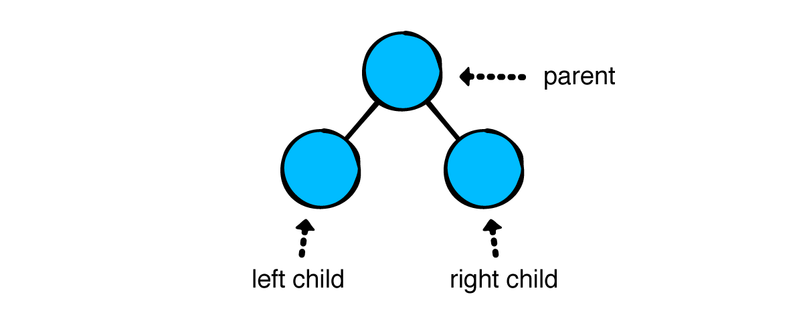
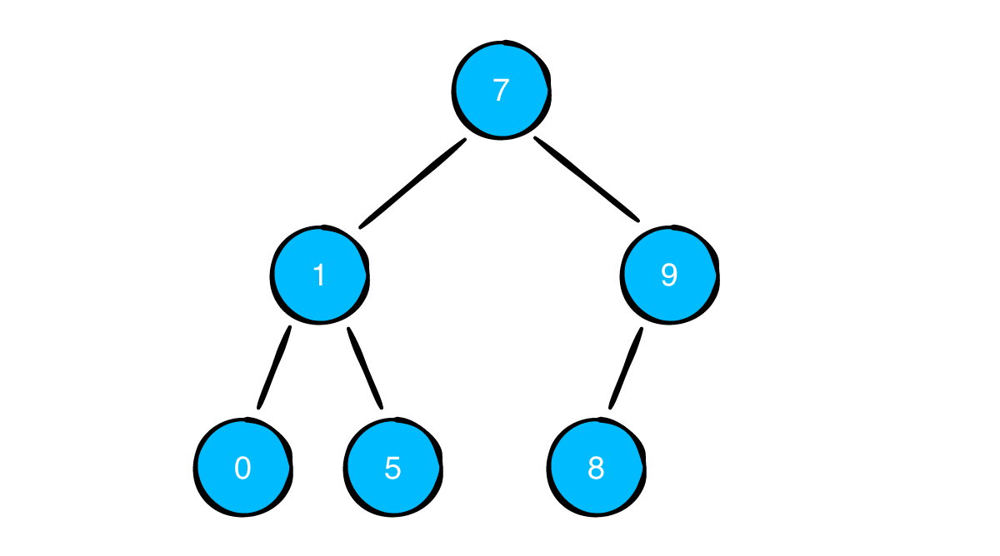
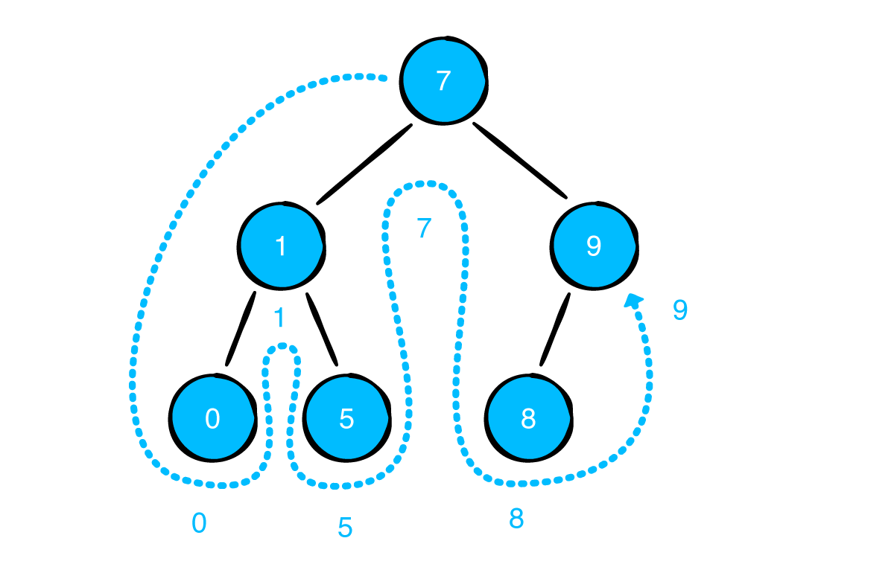
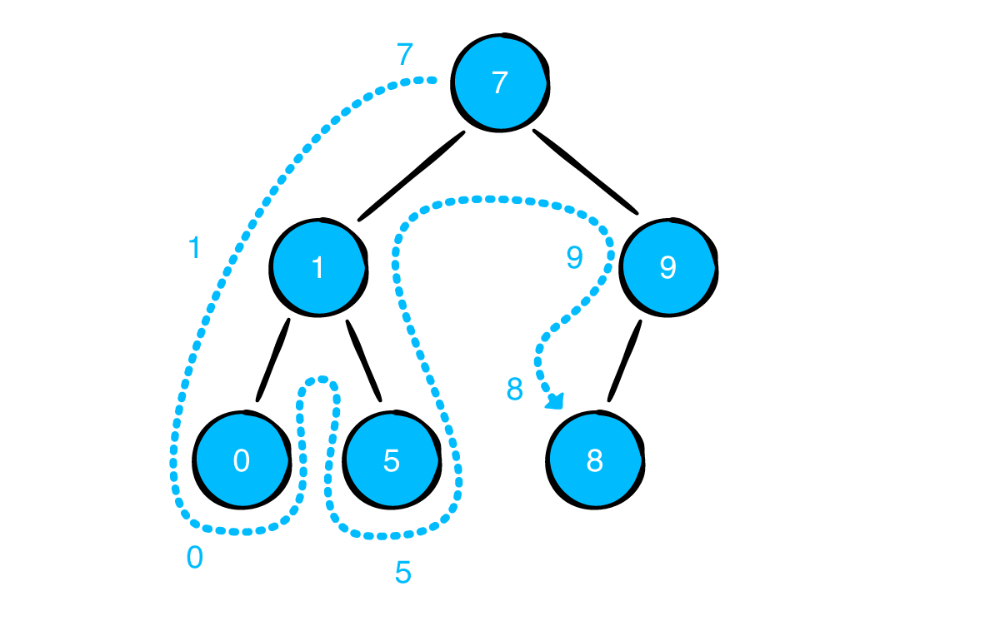
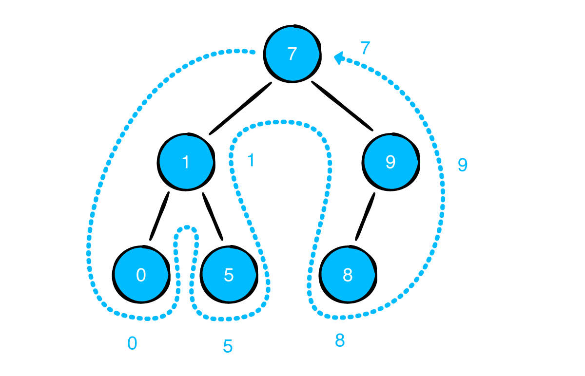
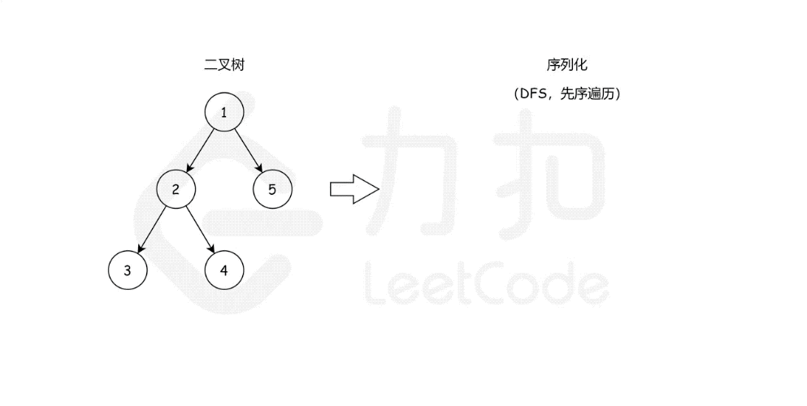

上一篇文章[树 Tree 基本信息及实现](https://github.com/pro648/tips/blob/master/sources/%E6%A0%91%20Tree%20%E5%9F%BA%E6%9C%AC%E4%BF%A1%E6%81%AF%E5%8F%8A%E5%AE%9E%E7%8E%B0.md)介绍了 Tree 的基本信息，一个节点可以有多个子节点。二叉树（Binary Tree）每个节点至多有两个子节点，被称为左子树（left）、右子树（right）。



二叉树是很多树结构和算法的基础。这篇文章将实现一个二叉树，并介绍三种常见的遍历算法。

## 1. 实现一个二叉树

在 playground 中添加一个文件，名称为`BinaryNode.swift`。其中代码如下：

```
public class BinaryNode<Element> {
    public var value: Element
    public var leftChild: BinaryNode?
    public var rightChild: BinaryNode?
    
    public init(value: Element) {
        self.value = value
    }
}
```

在 playground page 添加以下代码：

```
var tree: BinaryNode<Int> = {
    let zero = BinaryNode(value: 0)
    let one = BinaryNode(value: 1)
    let five = BinaryNode(value: 5)
    let seven = BinaryNode(value: 7)
    let eight = BinaryNode(value: 8)
    let nine = BinaryNode(value: 9)
    
    seven.leftChild = one
    one.leftChild = zero
    one.rightChild = five
    seven.rightChild = nine
    nine.leftChild = eight
    
    return seven
}()
```

上述代码定义的 binary tree 如下所示：



> 建立树数据结构模型对理解树非常有帮助。为此，实现了二叉树`description`方法，以便在控制台可视化二叉树。你可以在[源码](https://github.com/pro648/BasicDemos-iOS/blob/master/BinaryTree/BinaryTree.playground/Sources/BinaryNode.swift#L13-L32)中获取其具体实现。

打印二叉树后，控制台输出如下：

```
--- Example of tree diagram ---
 ┌──nil
┌──9
│ └──8
7
│ ┌──5
└──1
 └──0
```

## 2. 遍历算法

[树 Tree 基本信息及实现](https://github.com/pro648/tips/blob/master/sources/%E6%A0%91%20Tree%20%E5%9F%BA%E6%9C%AC%E4%BF%A1%E6%81%AF%E5%8F%8A%E5%AE%9E%E7%8E%B0.md)介绍了层序遍历，对该算法稍作调整，即可用于二叉树。这里不会重新实现层序遍历，而是介绍中序、前序、后续三种遍历算法。

#### 2.1 中序遍历 In-order traversal

中序遍历从根节点开始，按照以下顺序遍历：

- 如果当前节点有左子树，先递归访问左子树。
- 访问当前节点。
- 如果当前节点有右子树，递归访问右子树。

下图是中序遍历顺序示意图：



使用中序遍历上述二叉树时，节点按照升序顺序输出。如果节点按照一定规则排布，in-order traversal 会以升序顺序访问节点，下一篇文章[二叉搜索树](https://github.com/pro648/tips/blob/master/sources/%E4%BA%8C%E5%8F%89%E6%90%9C%E7%B4%A2%E6%A0%91%20Binary%20Search%20Tree.md)将会介绍这些内容。

添加以下中序遍历代码：

```
    /// 中序遍历
    public func traversalInOrder(visit: (Element) -> Void) {
        leftChild?.traversalInOrder(visit: visit)
        visit(value)
        rightChild?.traversalInOrder(visit: visit)
    }
```

先查找到最左节点，再访问其值，最后遍历最右节点。

使用以下代码进行中序遍历：

```
example(of: "in-order traversal") {
    tree.traversalInOrder(visit: {
        print($0)
    })
}
```

控制台输出如下：

```
--- Example of in-order traversal ---
0
1
5
7
8
9
```

#### 2.2 前序遍历 Pre-order traversal

前序遍历先访问当前节点，再递归访问左子树、右子树。



前序遍历算法如下：

```
    /// 前序遍历
    public func traversalPreOrder(visit: (Element) -> Void) {
        visit(value)
        leftChild?.traversalPreOrder(visit: visit)
        rightChild?.traversalPreOrder(visit: visit)
    }
```

运行后输出如下：

```
--- Example of pre-order traversal ---
7
1
0
5
9
8
```

#### 2.3 后续遍历 Post-order traversal

后续遍历先递归遍历左子树、右子树，最后访问当前节点。



也就是先访问子节点，后访问自身。根节点永远是最后访问的节点。

后序遍历算法如下：

```
    /// 后序遍历
    public func traversalPostOrder(visit: (Element) -> Void) {
        leftChild?.traversalPostOrder(visit: visit)
        rightChild?.traversalPostOrder(visit: visit)
        visit(value)
    }
```

使用后序遍历控制台输出如下：

```
--- Example of post-order traversal ---
0
5
1
8
9
7
```

二叉树的前序遍历、中序遍历、后序遍历时间复杂度、空间复杂度都是`O(n)`。二叉树通过在插入时增加一些规则，可以使中序遍历按照升序输出。下一篇文章[二叉搜索树](https://github.com/pro648/tips/blob/master/sources/%E4%BA%8C%E5%8F%89%E6%90%9C%E7%B4%A2%E6%A0%91%20Binary%20Search%20Tree.md)将更进一步介绍这些内容。

## 3. 二叉树算法题

#### 3.1 二叉树高度

给定一个二叉树，计算它的高度。

二叉树的高度为根节点到最远叶子节点的距离。如果只有一个节点，则高度为零。因为它既是根节点，又是叶子节点。

算法如下：

```
func height<T>(of node: BinaryNode<T>?) -> Int {
    guard let node = node else { return -1 }
    
    return 1 + max(height(of: node.leftChild), height(of: node.rightChild))
}
```

#### 3.2 二叉树的序列化与反序列化

序列化是将一个数据结构或者对象转换为连续比特位的操作，进而可以将转换后的数据存储在文件、内存中，同时可通过网络传输到其他计算机。通过相反的方式（即反序列化）可以得到原数据。

常用序列化的地方就是 JSON 转换。你的任务就是将二叉树序列化为数组，并将数组反序列化为之前的二叉树。

二叉树的序列化本质上是对其值进行编码，更重要的是对其结构进行编码。通过遍历树来进行序列化，有两种遍历策略：

- 广度优先（Breadth First Traversal，简写为 BFT）：按照层次的顺序从上到下遍历所有节点。
- 深度优先（Depth First Traversal，简写为 DFT）：从根节点开始，一直延伸到某个叶子节点，然后回到根节点，再遍历另一个分支。根据其相对顺序，可以将 DFT 进一步分为：
  - 前序遍历
  - 中序遍历
  - 后序遍历

假设有以下二叉树：

```
    1
   / \
  2   5
 / \
3   4
```

使用前序遍历的方式序列化该二叉树，如下所示：



从根节点`1`开始，然后跳到根节点的左子树`2`，然后跳到`2`的左子树`3`，然后查看`3`的左右子树是否存在，然后跳到`2`的右子树`4`。最终。序列化数组为`[1, 2, 3, nil, nil, 4, nil, nil, 5, nil, nil]`。

即序列化二叉树时，遇到空节点序列为为`nil`，否则继续递归序列化。

###### 3.2.1 先序遍历

为`BinaryNode`添加以下方法：

```
    /// 前序遍历二叉树，会遍历空节点。
    public func traversePreOrder(visit: (Element?) -> Void) {
        visit(value)
        if let leftChild = leftChild {
            leftChild.traversePreOrder(visit: visit)
        } else {
            visit(nil)
        }
        
        if let rightChild = rightChild {
            rightChild.traversePreOrder(visit: visit)
        } else {
            visit(nil)
        }
    }
```

上述方法遍历节点的每一个 node，所以它的时间复杂度是`O(n)`。

###### 3.2.2 序列化

序列化时访问每一个节点，并将其添加到数组。数组元素为`T?`类型，因为其可能为`nil`。序列化方法如下：

```
/// 序列化二叉树
func serialize<T>(_ node: BinaryNode<T>) -> [T?] {
    var array: [T?] = []
    node.traversePreOrder(visit: {
        array.append($0)
    })
    return array
}
```

该算法时间复杂度为`O(n)`。由于需要创建一个数组容纳所有元素，该算法空间复杂度为`O(n)`。

###### 3.2.3 反序列化

序列化时使用前序遍历，将值放入数组。反序列化时将值从数组中取出，重新组装为二叉树。

反序列化算法如下：

```
/// 反序列化
func deserialize<T>(_ array: inout [T?]) -> BinaryNode<T>? {
    // value 为空时表示节点没有子树，递归结束。
    guard let value = array.removeFirst() else { return nil }
    
    // 使用 value 创建节点，并设置左子树、右子树。
    let node = BinaryNode(value: value)
    node.leftChild = deserialize(&array)
    node.rightChild = deserialize(&array)
    return node
}
```

`inout`表示可以在函数内修改数组元素，这样允许递归调用时修改数组，并获得修改后的数组。

对二叉树先序列化，再反序列化后，打印二叉树。如下所示：

```
print(tree)
var array = serialize(tree)
if let node = deserialize(&array) {
    print(node)
}
```

控制台输出如下：

```
 ┌──nil
┌──9
│ └──8
7
│ ┌──5
└──1
 └──0

 ┌──nil
┌──9
│ └──8
7
│ ┌──5
└──1
 └──0
```

经序列化、反序列化操作后，二叉树没有发生变化。

由于每次移除数组元素都调用了`removeFirst()`，反序列化算法时间复杂度为`O(n²)`。

可以在反序列化开始前先反转数组，需要移除元素时，使用`removeLast()`即可。由于`removeLast()`的复杂度为`O(1)`，可以让整个算法时间复杂度降低到`O(n)`。由于需要反转数组，它的空间复杂度为`O(n)`。

> 你可以自行优化下反序列化，如果遇到问题，可以在文章底部获取源码查看。

## 总结

二叉树是很多重要数据结构的基础。例如，二叉搜索树（Binary Search Tree，简写为 BST）和平衡二叉树（AVL）。前序遍历、中序遍历、后序遍历不仅对二叉树很重要，处理其它类型树时也会频繁使用。

Demo名称：BinaryTree  
源码地址：<https://github.com/pro648/BasicDemos-iOS/tree/master/BinaryTree>


