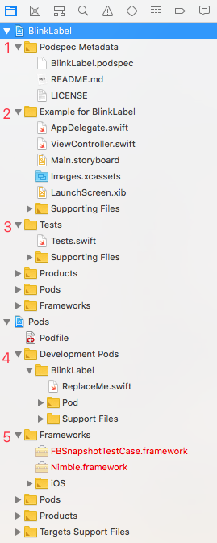
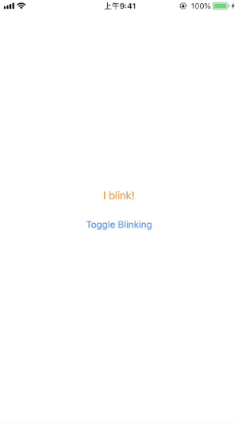

CocoaPods是Swift和Objective-C项目依赖管理器，使用CocoaPods可以优雅的扩展你的项目。尽管在iOS、macOS项目中使用CocoaPods是非常常见的，但创建pod却很少见。通过这篇文章，你将学会如何创建pod，以及优质pod都有哪些共同点。

## 1. 安装CocoaPods

必须安装CocoaPods才可以创建pod。CocoaPods作为Ruby的gem由RubyGems提供。在命令行执行以下命令安装或更新CocoaPods：

```
$ sudo gem install cocoapods
```

> 使用系统自带的Ruby安装CocoaPods时，需要使用`sudo`权限。这篇文章使用CocoaPods 1.5.3版本。如果对CocoaPods不熟悉，建议先阅读[CocoaPods的安装与使用](https://github.com/pro648/tips/wiki/CocoaPods%E7%9A%84%E5%AE%89%E8%A3%85%E4%B8%8E%E4%BD%BF%E7%94%A8)这篇文章。

## 2. 创建pod

创建pod步骤如下：

1. 使用`pod lib create NAME`命令为pod创建目录结构和相关模版文件。
2. 更新pod的元数据(metadata)，如版本信息、source、license等。
3. 添加代码。包括添加代码到pod和example project。
4. 使pod公开可用。

目前，CocoaPods有超过四万八千个库，用于超过三百万个应用程序。人们把各种各样的东西制作为pod使用，这里有一些关于pod的建议：

- 工具(utility code)：你是否对执行字符串有一套特定方法？是否有自己写的用来执行特定动画的子类？像这样特定实用程序代码会是很好的pod，其一般与其他代码库相分离。
- 第三方软件包(third party packages)：你是否封装了一些第三方API？是否需要在app中集成其他应用的钩子(hook)？如身份验证。你的网站是否提供了一些API，供其他应用程序整合使用。pod可以轻松解决以上所有问题。
- UI组件(UI Components)：你是否创建了一个平滑的UI小部件？其他用户通过包含一个pod依赖关系，能够为应用程序轻松添加一个复杂、令人愉快的UI组件。
- 项目组件化时大多使用CocoaPods做依赖管理。

这篇文章将创建一个闪烁的`UILabel`，名称为BlinkLabel。

pod lib 命令在创建pod时有以下作用：

- `pod lib lint NAME`：验证你创建的pod是否符合规范，是否可以通过CocoaPods使用。
- `pod lib create NAME`：创建标准目录结构、模板文件。`pod lib create NAME`不是创建pod的唯一方法，但它是最简洁的方法。

打开Terminal，定位到想要创建pod目录，执行以下命令：

```
$ cd ~/Desktop
$ pod lib create BlinkLabel
```

> `pod lib create NAME`使用默认模版，如果想使用其他模版，可以添加--template-url=URL参数。

输入上面命令后，终端会询问你以下问题：

1. What platform do you want to use?? [ iOS / macOS ]，选择iOS，直接回车默认选择第一个。

2. What language do you want to use?? [ Swift / ObjC ]，选择Swift。CocoaPods会把你的库设置为framework。

3. Would you like to include a demo application with your library? [ Yes / No ]，选择Yes。如果你想要包含一个示例工程，或计划在app中测试你的库，这里需要选择Yes，以便模板文件为你的库创建Xcode工程。也就是如果你计划为pod添加截图，这里需要选择Yes。

4. Which testing frameworks will you use? [ Quick / None ]，选择Quick。提交库到CocoaPods前应当进行测试。CocoaPods推荐使用其附带的测试framework，而非Apple的XCTest。在Objective-C中，可以选择Specta/Expecta或Kiwi，其区别如下：

   - Specta/Expecta：通过不同podspecs的模块化方法。
   - Kiwi：是对Stubs/Mocks/Expections的一种一体化方法。

   CocoaPods已经在MyLib-Tests.pch文件中添加了所有必要的包含和设置，因此不必将它们包含在每个文件中。

5. Would you like to do view based testing? [ Yes / No ]，选择Yes。根据你建立的仓库，你可能会发现基于快照的测试是验证视图不同部分不同操作的最佳方法，这里建议使用`FBSnapShotTestCase`。如果你使用的是Specta/Expecta，那么其会包含一个pod来改进语法。

6. What is your class prefix?如果你选择的语言是ObjC，其最后会要求提供类前缀。

设置完毕后，Xcode会打开新创建的工程，以便你在刚创建的pod上工作。其Project Navigator目录如下：



1. 可以修改Podspec的元数据。
2. 这是一个demo库。
3. 这是你之前选择的测试framework。
4. 在这里修改pod库代码。
5. Pod用到的框架。

在开始下一步工作前，先查看下pod目录结构：

```
$ cd ~/Desktop
$ tree BlinkLabel -L 2
BlinkLabel
├── BlinkLabel
│   ├── Assets		# 资源文件
│   └── Classes		# 类文件
├── BlinkLabel.podspec
├── Example		# demo和测试包
│   ├── BlinkLabel
│   ├── BlinkLabel.xcodeproj
│   ├── BlinkLabel.xcworkspace
│   ├── Podfile		# demo app的依赖文件
│   ├── Podfile.lock
│   ├── Pods
│   └── Tests
├── LICENSE		# 开源协议，默认MIT License
├── README.md		# markdown格式的README
└── _Pods.xcodeproj -> Example/Pods/Pods.xcodeproj	#为项目提供Carthage支持的符号链接(symlink)。

10 directories, 5 files
```

使用`pod lib create NAME`命令创建pod时，会使用git进行版本管理。还会生成以下文件：

- .travis.yml ：持续集成服务Travis CI配置文件。

- BlinkLabel.podspec ：仓库的Podspec。Podspec或Spec用来描述pod库的版本信息，包括源代码网址，应当使用的文件，以及其他metadata。随着版本迭代，一个pod会有很多spec。你可以手动创建podspec，也可以使用`pod spec create NAME`命令创建，还可以使用`pod lib create NAME`命令一次创建整个目录结构。

在Xcode中打开BlinkLabel.podspec文件，可以看到CocoaPods已经使用模板填充了其内容。使用`pod lib lint NAME`命令可以验证.podspec文件是否符合规范。

在命令行输入以下命令：

```
$ cd ~/Desktop/BlinkLabel
$ pod lib lint BlinkLabel.podspec
```

输出如下：

```
-> BlinkLabel (0.1.0)
    - WARN  | summary: The summary is not meaningful.
    - WARN  | url: The URL (https://github.com/pro648/BlinkLabel) is not reachable.
    - WARN  | [iOS] swift: The validator used Swift 3.2 by default because no Swift version was specified. To specify a Swift version during validation, add the `swift_version` attribute in your podspec. Note that usage of the `--swift-version` parameter or a `.swift-version` file is now deprecated.

[!] BlinkLabel did not pass validation, due to 3 warnings (but you can use `--allow-warnings` to ignore them).
You can use the `--no-clean` option to inspect any issue.
```

可以看到在.podspec文件中，有三处需要修改：

- 修改summary，以便使其有意义。
- 主页url不可用。
- 验证时没有指明swift版本。

下面是修改.podspec文件的建议：

- s.summary：A subclass on UILabel that provides a blink.
- 在GitHub创建名称为BlinkLabel的仓库。
- 在.podspec文件添加s.swift_version = '4.0'。

再次运行`pod lib lint BlinkLabel`命令，这次提示*The description is shorter than the summary.*，修改s.description为*This CocoaPods provides the ability to use a UILabel that may be started and stopped blinking.*

运行以下命令，推送本地仓库到GitHub：

```
$ git add .
$ git commit -m "Initial Commit"
$ git remote add origin https://github.com/pro648/BlinkLabel
$ git push -u origin master:master
```

> 如果你对分布式版本控制系统git还不熟悉，可以查看[教你系统学习Git](https://github.com/pro648/tips/wiki/%E6%95%99%E4%BD%A0%E7%B3%BB%E7%BB%9F%E5%AD%A6%E4%B9%A0Git)一文。

到目前为止，如果操作正确，其应当通过验证：

```
$ pod lib lint BlinkLabel.podspec

 -> BlinkLabel (0.1.0)

BlinkLabel passed validation.
```

## 3. 为pod添加代码

现在，pod外壳已经创建好了，但其还没有任何功能。CocoaPods创建的工程可以同时为pod和example project编写代码。

首先，删除Pods/Development Pods/BlinkLabel下的ReplaceMe.swift文件，并在此目录下创建一个名称为`BlinkLabel`，父类为`UILabel`，语言为Swift的文件。更新BlinkLabel.swift文件内容如下：

```
public class BlinkLabel: UILabel {
    public func startBlinking() {
        UIView.animate(withDuration: 0.3, delay: 0.0, options: .repeat, animations: {
            self.alpha = 0
        }, completion: nil)
    }
    
    public func stopBlinking() {
        alpha = 1
        layer.removeAllAnimations()
    }
}
```

刚刚，你为你的第一个pod添加了闪烁功能。该子类提供了一个使`UILabel`闪烁的方法，一个使`UILabel`停止blink的方法。

为了让其他用户更容易理解BlinkLabel的功能，为example project添加一些示例代码。打开BlinkLabel/Example for BlinkLabel/ViewController.swift文件，更新其内容如下：

```
import UIKit
import BlinkLabel

class ViewController: UIViewController {
    
    var isBlinking = false
    let blinkLabel = BlinkLabel()
    
    override func viewDidLoad() {
        super.viewDidLoad()
        
        isBlinking = true
        
        // Setup the BlinkLabel.
        blinkLabel.text = "I blink!"
        blinkLabel.font = UIFont.preferredFont(forTextStyle: .body)
        blinkLabel.textColor = .orange
        blinkLabel.startBlinking()
        view.addSubview(blinkLabel)
        
        // Create a UIButton to toggle the blinking.
        let toggleButton = UIButton.init(type: .system)
        toggleButton.setTitle("Toggle Blinking", for:.normal)
        toggleButton.addTarget(self, action: #selector(toggleBlinking), for: .touchUpInside)
        view.addSubview(toggleButton)
        
        // Create a UIStackView to layout blinkLabel and toggleButton.
        let stackView = UIStackView.init(arrangedSubviews: [blinkLabel, toggleButton])
        stackView.axis = .vertical
        stackView.alignment = .center
        stackView.spacing = 20
        view.addSubview(stackView)
        
        // Layout out stackView.
        stackView.translatesAutoresizingMaskIntoConstraints = false
        stackView.centerXAnchor.constraint(equalTo: self.view.centerXAnchor).isActive = true
        stackView.centerYAnchor.constraint(equalTo: self.view.centerYAnchor).isActive = true
    }
    
    @objc func toggleBlinking() {
        if isBlinking {
            blinkLabel.stopBlinking()
        } else {
            blinkLabel.startBlinking()
        }
        isBlinking = !isBlinking
    }
}
```

这时，Xcode会发出错误警告，提示*No such module 'BlinkLabel'*，这是因为BlinkLabel pod还没有install到example project。

打开命令行，在BlinkLabel的根目录执行以下操作：

```
$ cd Example
$ pod install
Analyzing dependencies
Fetching podspec for `BlinkLabel` from `../`
Downloading dependencies
Installing BlinkLabel 0.1.0
Using FBSnapshotTestCase (2.1.4)
Using Nimble (7.0.3)
Using Nimble-Snapshots (6.3.0)
Using Quick (1.2.0)
Generating Pods project
Integrating client project
Sending stats
Pod installation complete! There are 5 dependencies from the Podfile and 5 total pods installed.

[!] Automatically assigning platform `ios` with version `9.3` on target `BlinkLabel_Example` because no platform was specified. Please specify a platform for this target in your Podfile. See `https://guides.cocoapods.org/syntax/podfile.html#platform`.
```

可以看到其提示，没有指定platform，默认使用了ios 9.3。我们还可以手动修改example project中的Podfile文件，添加以下信息：

```
platform:ios, '9.0'
inhibit_all_warnings!
```

再次执行`pod install`命令，上面的提示将不再出现。

选中BlinkLabel-Example target并运行。如下所示：



点击*Toggle Blinking*按钮开始或结束闪烁。

创建pod的最后一步是修改README.md信息。打开BlinkLabel/Podsepc Metadata/README.md文件，可以看到CocoaPods生成的默认说明，增加如何使用pod的说明、截图，使其更有价值。README是进入你的pod首先看到的东西，也是CocoaPods Quality Indexes的要素之一。这里是我的[README]()。

最后，记得提交以上修改到GitHub仓库。

## 4. 提交Pod到Specs仓库

现在，你的本地计算机上运行了功能完备的pod，你还可以将其提交到公开的[Specs](https://github.com/CocoaPods/Specs)仓库，以便他人使用。

Specs是托管在GitHub上的公共仓库，其索引了所有公开pod。你的源代码并不一定要托管在GitHub。例如，将源代码托管在码云。

提交pod到Specs仓库步骤如下：

1. 为最近一次提交添加标签。
2. 使用`pod spec lint NAME`命令验证源代码与.podspec文件配置是否正确。
3. 使用`pod trunk push NAME`命令提交spec到Specs仓库。

> 进行以上操作前，要确保对BlinkLabel的本地更改已添加到git，并推送到了远程仓库。

#### 4.1 添加Tag 

为最近一次提交添加标签：

```
$ git tag -a 0.1.0 -m "version 0.1.0"
$ git push origin 0.1.0
Counting objects: 1, done.
Writing objects: 100% (1/1), 161 bytes | 161.00 KiB/s, done.
Total 1 (delta 0), reused 0 (delta 0)
To https://github.com/pro648/BlinkLabel
 * [new tag]         0.1.0 -> 0.1.0
```

使用tag标记特定提交，标签名称应当与.podspec文件中的s.version匹配。下一步将会验证这一点。

#### 4.2 使用pod spec lint NAME验证

使用`pod spec lint NAME`命令验证源代码与.podspec文件配置是否正确。

```
$ pod spec lint BlinkLabel.podspec

 -> BlinkLabel (0.1.0)

Analyzed 1 podspec.

BlinkLabel.podspec passed validation.
```

`pod lib lint NAME`命令与`pod spec lint NAME`区别如下：

- `pod lib lint NAME`：只在本地lint你的pod，确保用于创建pod配置信息正确，但其不足以验证pod，只有`pod spec lint NAME`可以验证pod。
- `pod spec lint NAME`：会在本地和远程验证pod。如代码托管在GitHub，其会进行lint。如果`pod spec lint NAME`没有返回错误，就可以推送pod到CocoaPods。

#### 4.3 提交spec到Specs仓库

最后，执行以下命令提交spec到Specs仓库。

```
$ pod trunk push BlinkLabel.podspec
```

如果这是你第一次提交spec到Specs仓库，其会出现以下提示：

```
[!] You need to register a session first.
```

这时可以通过以下命令注册账号：

```
$ pod trunk register YOU_EMAIL@example.com 'NAME' --description='macbook'
```

Trunk会向你的邮箱发送邮件，你必须点击邮件中的链接进行验证。

如果你在.podspec文件中添加了不应出现的内容，如密码、身份信息。可以使用`pod trunk delete NAME VERSION`删除指定版本pod，一般不应删除其他用户依赖的版本，删除后的版本将无法再次添加到Specs。如果你只是学习如何添加pod到CocoaPods，或确定没有用户使用你的pod，可以使用`pod trunk deprecate NAME`命令将pod标记为不推荐使用，这样其他用户将无法搜索到你的pod。更多相关内容，可以查看CocoaPods的[Pull Request FAQ #12199](https://github.com/CocoaPods/Specs/pull/12199)。

## 5. 使用私有pod

除了将pod推送到Specs，还可以创建私有pod，便于项目管理。

使用私有pod时，其Podfile文件如下：

```
pod 'BlinkLabel', :path => '~/Desktop/BlinkLabel'
# 或者
pod 'BlinkLabel', :podspec => 'https://github.com/pro648/BlinkLabel/BlinkLabel.podspec'
```

如果使用了多个私有pod，可以修改Podfile文件pod source如下：

```
# 使用默认source时，可以不写Specs source。如果指定了私有.podspec，则必须写明所有source，否则，将查找不到其他开源pod。
source 'https://github.com/CocoaPods/Specs.git'
source 'https://github.com/pro648/BlinkLabel/BlinkLabel.podspec'
```

## 总结

创建pod供他人使用会非常有趣，也是回馈开源社区的好方法。这篇文章向你展示了哪些类型代码适合创建pod，如何创建pod，如何将pod添加到Specs以便其他用户可以使用。另外，你还可以查看[Quality Indexes](https://guides.cocoapods.org/making/quality-indexes.html)，了解哪些因素会影响pod的质量指标。

参考资料：

1. [Creating Your First CocoaPod](https://code.tutsplus.com/tutorials/creating-your-first-cocoapod--cms-24332)

2. [Making a CocoaPod](https://guides.cocoapods.org/making/making-a-cocoapod.html)

3. [What's the difference between 'pod spec lint' and 'pod lib lint'?](https://stackoverflow.com/questions/32304421/whats-the-difference-between-pod-spec-lint-and-pod-lib-lint)

4. ['pod spec lint' fails with Swift 4](https://github.com/CocoaPods/CocoaPods/issues/7057)

   