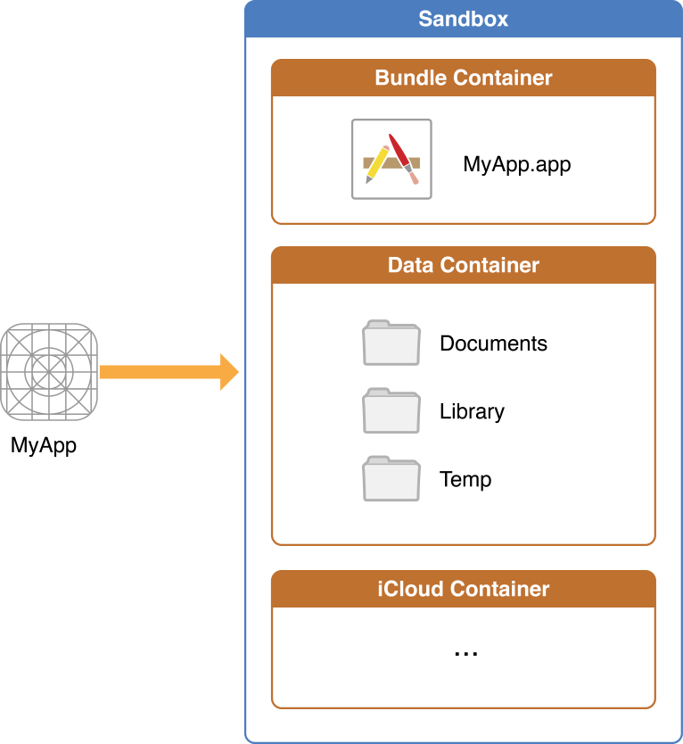

文件系统作为被所有进程使用的基本资源之一，在macOS和iOS中主要用于处理数据文件、应用程序以及与操作系统自身相关的持久存储。

iOS中的文件系统格式为HFS Plus，macOS中的主要格式也是HFS Plus。由于文件数量可以轻易达到数百万，所以文件系统使用目录（directory）建立了一个分层组织。尽管iOS和macOS的基本目录结构类似，但系统在组织应用程序和用户数据的方式上有所不同。在这篇文章中我们只介绍iOS文件系统。

## 1. iOS文件系统的基本介绍

为了安全起见，iOS系统把每个app及其数据都放在各自的沙盒（sandbox）里面，每个app只能访问自己沙盒目录内的文件和数据等。在安装新的app时，安装程序会在沙箱目录中为app创建多个容器目录，每一个容器目录都有特定的用途。如下图所示：



- *Bundle Container*目录包含应用程序包。
- *Data Container*目录包含app和用户的数据，可以进一步分为几个子目录，以便app对数据进行分类。
- 应用程序还可以在运行时请求访问如iCloud容器一类目录。

通常情况下，禁止app在其容器目录之外访问或创建文件。但也有例外，比如app使用API在用户授权的情况下访问系统通讯录、照相机、照片等。

下面表格里列出了一些重要的子目录，并描述了其预期用途。此外，还说明了每个子目录的其他访问限制，并指出了目录内容是否由iTunes和iCloud进行备份。

| 目录                                  | 介绍                                       |
| ----------------------------------- | ---------------------------------------- |
| MyApp.app                           | 这是应用程序的资源包。捆绑（Bundle）是一个目录（也可能是一个文件），它允许相关资源（如可执行代码、本地化资源、图片等）被组合在一起，在某些情况下可以当作一个单独文件看待。 <br> <br> 你不能向此目录写入文件。为防止篡改，在安装时会对捆绑包目录签名，向此文件写入内容会更改签名，导致app无法启动。但是，你可以读取该捆绑包内资源。 <br> <br> iTunes和iCloud不会备份该目录的内容。 |
| `Documents` (`NSDocumentDirectory`) | 此目录用来存储用户生成的内容。用户可以通过文件共享接触到该目录的内容，所以该目录应该只包含你希望向用户公开的内容。 <br> <br> iTunes和iCloud会备份该目录的内容。 |
| `Library` (`NSLibraryDirectory`)    | 该顶级目录用于储存非用户数据文件，一般将文件放在几个标准子目录中。iOS应用一般使用该目录的`Application Support`、`Preferences`、`Caches`子目录，你也可以自定义子目录。 <br> <br> iTunes和iCloud会备份除`Caches`目录外其他目录的内容。 |
| `tmp` (`NSTemporaryDirectory()` )   | 使用此目录用来存储不需要在应用程序启动之间保存的临时文件，app应该在不需要这些文件时，主动删除这些文件。在app没有运行时，系统可能清空该目录的内容。 <br> <br> iTunes和iCloud不会备份该目录的内容。 |

为了更好组织文件系统的层级，你可以在`Documents`、`Library`、`tmp`目录内创建目录。

<a id="function">

为了对目录有更清晰的认识，下面使用代码获取目录。创建*Single View Application*模板的demo，demo名称为*FileManager*。在`viewDidLoad`方法中添加以下代码。

```
- (void)viewDidLoad {
    [super viewDidLoad];
    
    // 1.捆绑包目录
    NSLog(@"bundlePath %@",[NSBundle mainBundle].bundlePath);
    
    // 2.沙盒主目录
    NSString *homeDir = NSHomeDirectory();
    NSLog(@"homeDir %@",homeDir);
    
    // 3.Documents目录
    NSLog(@"Documents url %@",[[NSFileManager defaultManager] URLsForDirectory:NSDocumentDirectory inDomains:NSUserDomainMask].firstObject);
    NSLog(@"Documents pathA %@",NSSearchPathForDirectoriesInDomains(NSDocumentDirectory, NSUserDomainMask, YES).firstObject);
    NSLog(@"Documents pathB %@",[homeDir stringByAppendingPathComponent:@"Documents"]);
    
    // 4.Library目录
    NSLog(@"Library url %@",[[NSFileManager defaultManager] URLsForDirectory:NSLibraryDirectory inDomains:NSUserDomainMask].firstObject);
    NSLog(@"Library pathA %@",NSSearchPathForDirectoriesInDomains(NSLibraryDirectory, NSUserDomainMask, YES).firstObject);
    NSLog(@"Library pathB %@",[homeDir stringByAppendingPathComponent:@"Library"]);
    
    // 5.Caches目录
    NSLog(@"Caches url %@",[[NSFileManager defaultManager] URLsForDirectory:NSCachesDirectory inDomains:NSUserDomainMask].firstObject);
    NSLog(@"Caches path %@",NSSearchPathForDirectoriesInDomains(NSCachesDirectory, NSUserDomainMask, YES).firstObject);
    
    // 6.tep目录
    NSLog(@"tmpA %@",NSTemporaryDirectory());
    NSLog(@"tmpB %@",[homeDir stringByAppendingPathComponent:@"tmp"]);
```

</a>

在上面的代码中，有的使用了多种方法输出目录，比如，有些是使用`NSSearchPathForDirectoriesInDomains()`方法获取，有些是在沙盒主目录后拼接获取。

运行demo，控制台输出如下：

```
// 1.捆绑包目录
bundlePath /Users/ad/Library/Developer/CoreSimulator/Devices/B839573B-A8AD-490A-9B62-0A75813758BA/data/Containers/Bundle/Application/2E075CE6-0AE6-4D00-AB71-95313712ACE3/FileManager&FileHandle.app

// 2.沙盒主目录
homeDir /Users/ad/Library/Developer/CoreSimulator/Devices/B839573B-A8AD-490A-9B62-0A75813758BA/data/Containers/Data/Application/7917C8C6-C48A-4E91-83BA-F5C269E02951

// 3.Documents目录
Documents url file:///Users/ad/Library/Developer/CoreSimulator/Devices/B839573B-A8AD-490A-9B62-0A75813758BA/data/Containers/Data/Application/7917C8C6-C48A-4E91-83BA-F5C269E02951/Documents/
Documents pathA /Users/ad/Library/Developer/CoreSimulator/Devices/B839573B-A8AD-490A-9B62-0A75813758BA/data/Containers/Data/Application/7917C8C6-C48A-4E91-83BA-F5C269E02951/Documents
Documents pathB /Users/ad/Library/Developer/CoreSimulator/Devices/B839573B-A8AD-490A-9B62-0A75813758BA/data/Containers/Data/Application/7917C8C6-C48A-4E91-83BA-F5C269E02951/Documents

// 4.Library目录
Library url file:///Users/ad/Library/Developer/CoreSimulator/Devices/B839573B-A8AD-490A-9B62-0A75813758BA/data/Containers/Data/Application/7917C8C6-C48A-4E91-83BA-F5C269E02951/Library/
Library pathA /Users/ad/Library/Developer/CoreSimulator/Devices/B839573B-A8AD-490A-9B62-0A75813758BA/data/Containers/Data/Application/7917C8C6-C48A-4E91-83BA-F5C269E02951/Library
Library pathB /Users/ad/Library/Developer/CoreSimulator/Devices/B839573B-A8AD-490A-9B62-0A75813758BA/data/Containers/Data/Application/7917C8C6-C48A-4E91-83BA-F5C269E02951/Library

// 5.Caches目录
Caches url file:///Users/ad/Library/Developer/CoreSimulator/Devices/B839573B-A8AD-490A-9B62-0A75813758BA/data/Containers/Data/Application/7917C8C6-C48A-4E91-83BA-F5C269E02951/Library/Caches/
Caches path /Users/ad/Library/Developer/CoreSimulator/Devices/B839573B-A8AD-490A-9B62-0A75813758BA/data/Containers/Data/Application/7917C8C6-C48A-4E91-83BA-F5C269E02951/Library/Caches

// 6.tep目录
tmpA /Users/ad/Library/Developer/CoreSimulator/Devices/B839573B-A8AD-490A-9B62-0A75813758BA/data/Containers/Data/Application/7917C8C6-C48A-4E91-83BA-F5C269E02951/tmp/
tmpB /Users/ad/Library/Developer/CoreSimulator/Devices/B839573B-A8AD-490A-9B62-0A75813758BA/data/Containers/Data/Application/7917C8C6-C48A-4E91-83BA-F5C269E02951/tmp
```

> 在程序中，为避免使用硬编码的路径名，应尽可能地使用方法和函数来获取当前目录路径名、用户主目录及临时文件目录。


## 2. 文件应该放在哪些目录中？

app存储大文件到iTunes和iCloud会减慢备份进程，这些应用也会消耗用户大量备份空间，这会导致用户删除你的app，或禁用该app的备份数据到iCloud功能。为减少同步和备份进程占用太长时间，文件存储要放在合适位置。因此，应该按照以下准则选择文件位置：

1. 将用户数据放入`Documents/`：<br> 用户数据通常包括您可能想要向用户公开的任何文件，这些文件可以由用户创建、导入、删除或编辑。对于绘图应用，用户数据包括用户创建的任何图形文件；对于文本编辑器，包括用户创建的文本文件；对于音视频应用，包括用户下载以便稍后观看或收听的文件。

2. 将应用创建的支持文件放在`Library/Application support/`目录中：<br> 一般，此目录的文件用于支持app运行，同时不应该被用户接触。该目录还可以包括数据文件、配置文件、模板以及从应用程序包中加载资源的修改版本。

3. 可以通过`[NSURL setResourceValue: forKey: error: ]`方法排除不需要备份的文件：<br> iCloud默认会对`Documents/`和`Application Support/`目录内容进行备份，可以通过`[NSURL setResourceValue: forKey: error: ]`方法排除不需要备份的文件，此时key应为`NSURLIsExcludedFromBackupKey`。任何可以被再次创建或下载的文件都必须从备份中排出，这对于大型媒体文件尤为重要。如果你的app需要下载音频或视频，一定要把下载的音视频从备份中排除。

4. 把临时数据放在`tmp/`目录： <br> 临时数据包括任何不需要长时间保留的数据，在不需要这些数据时记得删除它们，以便不再占用用户设备空间。在app未运行时，系统会定期清除这些文件。因此，任何需要长期使用的数据都不能放在`tmp/`目录。

5. 把数据缓存文件放在`Library/Caches/`目录： <br> 数据缓存文件保存时间比临时数据长，但没有`Application Support`持久。一般来说，没有缓存数据程序也可以正常运行，但有了缓存数据可以提高性能。缓存数据包括但不限于数据库缓存文件、可下载文件等。系统可能会删除`Caches/`目录的内容以释放磁盘空间，因此，你的app必须能够根据需要重新创建或下载这些文件。

## 3. 管理文件和目录：NSFileManager

### 3.1 相对路径与绝对路径

路径既可以是相对路径，也可以是绝对路径。相对路径就是相对于当前所在目录的路径名，绝对路径也称完整路径。

绝对路径以斜线`/`开始，在Mac上，桌面目录的完整路径为/users/USERNAME/desktop。这个目录指出了四个目录：/（根目录）、users、USERNAME（用户账户名）和desktop。

> 绝对路径中，只有第一个斜线`/`表示根目录。其他斜线用于分隔路径中的目录列表。

假设桌面上有一个`github`文件，该文件中又有一个`pro648.txt`文件，如果要描述`pro648.txt`这个文件的路径，可以用绝对路径也可以用相对路径：

绝对路径：/users/USERNAME/desktop/github/pro648.txt  
相对路径：github/pro648.txt （当前目录为desktop)  
相对路径：pro648.txt （当前目录为github)

### 3.2 路径的类型

指定文件或目录的首选方法是使用`NSURL`类，虽然`NSString`类有许多与路径创建相关的方法，但`NSURL`类在定位目录和文件上更为强大。对于同时使用网络资源的app，使用`NSURL`类可以同时管理本地文件系统和网络服务器上项目。

对于大多数URL，你可以使用`NSURL`方法将目录和文件名拼接在一起构建URL，拼接时从根目录一直拼接至可以查找到该项目为止，以这种方式构建的URL被称为基于路径的URL。你还可以将路径和文件名连接在一起构建基于字符串的路径，其与基于路径的URL格式略有不同。你还可以创建file reference URL，它使用唯一的ID来标识文件或目录位置。

所有以下目录都是对`Documents`目录下`github.com/pro648`路径的引用。

```
基于路径的URL：file:///Users/ad/Library/Developer/CoreSimulator/Devices/B839573B-A8AD-490A-9B62-0A75813758BA/data/Containers/Data/Application/82635C86-0E64-46CA-8E97-D434651551C2/Documents/github.com/pro648/

File Reference URL：file:///.file/id=16777220.17054390/

基于字符串的路径：/Users/ad/Library/Developer/CoreSimulator/Devices/B839573B-A8AD-490A-9B62-0A75813758BA/data/Containers/Data/Application/82635C86-0E64-46CA-8E97-D434651551C2/Documents/github.com/pro648
```

使用`NSURL`方法创建URL对象，在必要的时候将其转换为*File Reference URL*。`NSFileManager`类一般优先使用基于路径的URL。*File Reference URL*的优点体现在，app运行时如果在同一磁盘移动了文件，*File Reference URL*的唯一ID不变，而其他两种方式在文件移动后路径会失效，必须更新路径。

> 尽管在app运行时，使用*File Reference URL*是安全的，但不能把*File Reference URL*保存下来重复使用，因为系统重启时*File Reference URL*可能改变。如果想要保存下来以便在app下次启动后使用，可以使用`bookmarkDataWithOptions: includingResourceValuesForKeys: relativeToURL: error: `方法创建一个书签。

### 3.3 路径的转换

使用`path`属性可以把`NSURL`类型路径转换为`NSString`类型路径。也可以使用`NSURL`的`fileURLWithPath: `方法将`NSString`类型路径转换为`NSURL`类型路径。

继续在`viewDidLoad`底部添加以下代码。

```
- (void)viewDidLoad {
    ...
    // 创建文件管理器
    NSFileManager *sharedFM = [NSFileManager defaultManager];
    
    // 创建NSURL类型documentsURL路径 转换为NSString类型和fileReferenceURL类型路径
    NSURL *documentsURL = [sharedFM URLsForDirectory:NSDocumentDirectory inDomains:NSUserDomainMask].firstObject;
    NSLog(@"documentsURL:%@",documentsURL);
    NSLog(@"documentsURL convert to path:%@",documentsURL.path);
    NSLog(@"fileReferenceURL:%@",[documentsURL fileReferenceURL]);
    
    // 创建NSString类型libraryPath路径 转换为NSURL类型路径
    NSString *libraryPath = NSSearchPathForDirectoriesInDomains(NSLibraryDirectory, NSUserDomainMask, YES).firstObject;
    NSLog(@"libraryPath:%@",libraryPath);
    NSLog(@"libraryPath convert to url:%@",[NSURL fileURLWithPath:libraryPath]);
}
```

运行后控制台输入如下：

```
// documentsURL
documentsURL:file:///Users/ad/Library/Developer/CoreSimulator/Devices/B839573B-A8AD-490A-9B62-0A75813758BA/data/Containers/Data/Application/F5811251-323E-4D61-A09E-833C8F8A2CA1/Documents/
documentsURL convert to path:/Users/ad/Library/Developer/CoreSimulator/Devices/B839573B-A8AD-490A-9B62-0A75813758BA/data/Containers/Data/Application/F5811251-323E-4D61-A09E-833C8F8A2CA1/Documents
fileReferenceURL:file:///.file/id=16777220.17053305/

// libraryPath
libraryPath:/Users/ad/Library/Developer/CoreSimulator/Devices/B839573B-A8AD-490A-9B62-0A75813758BA/data/Containers/Data/Application/F5811251-323E-4D61-A09E-833C8F8A2CA1/Library
libraryPath convert to url:file:///Users/ad/Library/Developer/CoreSimulator/Devices/B839573B-A8AD-490A-9B62-0A75813758BA/data/Containers/Data/Application/F5811251-323E-4D61-A09E-833C8F8A2CA1/Library/
```

### 3.4 对文件或目录执行基本操作

Foundation框架允许利用文件系统对文件或目录执行基本操作，这些基本操作是由`NSFileManager`类提供的，这个类的方法具有如下功能：

- 创建新文件。
- 从现有文件读取数据。
- 将数据写入文件。
- 重命名文件。
- 删除文件。
- 测试文件是否存在。
- 确定文件的大小和其他属性。
- 复制文件。
- 测试两个文件的内容是否相同。

上面的多数方法也可以对目录进行操作。例如，创建目录、读取目录的内容、删除目录等。

#### 3.4.1 创建目录

当需要在标准目录中定位文件时，首先使用系统框架定位到该目录，之后使用刚生成的URL构建文件路径。

Foundation框架包括多种用于定位到标准目录的方法：

- `NSFileManager`类的`URLsForDirectory: inDomains: `方法返回一个`NSURL`类型的路径，该方法第一个参数为`NSSearchPathDirectory`常量，该常量可以提供主目录、桌面目录和库目录等大多数标准目录的URL。
- `NSSearchPathForDirectoriesInDomains()`函数与`URLsForDirectory: inDomains: `方法类似，不同之处在于返回的路径为`NSString`类型。
- `NSHomeDirectory()`函数返回用户或app的主目录。当app在沙盒内时，主目录指向应用程序的沙盒；否则，主目录指向用户文件系统的主目录。另外，还有一些其他类似方法，可以查看文章[开始](#function)部分的示例代码。

下面代码使用`NSFileManager`类的方法在`Library/Application Support`目录内创建自定义目录。因为这个方法每次都会接触到文件系统，会非常耗费时间。如果需要多次用到该目录，你应该保存返回的URL，而非每次需要时调用该方法。

```
- (NSURL *)applicationDirectory {
    // 1.创建文件管理器
    NSFileManager *sharedFM = [NSFileManager defaultManager];
    
    // 2.查找Application Support目录在主目录路径
    NSArray *possibleURLs = [sharedFM URLsForDirectory:NSApplicationSupportDirectory inDomains:NSUserDomainMask];
    
    NSURL *appSupportDir = nil;
    NSURL *dirPath = nil;
    if (possibleURLs.count > 0) {
        // 3.数组不为空时，使用第一个元素。
        appSupportDir = possibleURLs.firstObject;
    }
    
    // 4.如果存在appSupportDir目录，将应用的bundleIdentifier添加到文件结尾，用于创建自定义目录
    if (appSupportDir) {
        NSString *appBundleID = [[NSBundle mainBundle] bundleIdentifier];
        dirPath = [appSupportDir URLByAppendingPathComponent:appBundleID];
    }
    
    // 5.如果dirPath目录不存在，创建该目录
    NSError *error = nil;
    if (![sharedFM createDirectoryAtURL:dirPath withIntermediateDirectories:YES attributes:nil error:&error]) {
        NSLog(@"Couldn't create dirPath.error %@",error);
        return nil;
    }
    return dirPath;
}
```

上述代码的分步说明如下：

1. 这里创建的文件管理器为共享文件管理器，不能使用代理方法。如果需要使用代理方法，请使用`init`方法创建，并遵守`NSFileManagerDelegate`协议。
2. 查找`Application Support`目录在主目录中的路径，这里的`inDomains: `参数可以指定多个值，此时`possibleURLs`数组将包含多个值，数组内元素顺序与`inDomains: `参数顺序一致。在为iOS编写程序时，`inDomains: `参数应为`NSUserDomainMask`。该参数还可以是`NSLocalDomainMask`、`NSNetworkingDomainMask`、`NSSystemDomainMask`或`NSAllDomainsMask`。
3. 数组不为空时，使用第一个元素。
4. 将`bundleIdentifier`添加到`appSupportDir`创建自定义目录。
5. 如果`dirPath`目录不存在，则创建该目录。`createDirectoryAtURL: withIntermediateDirectories: attributes: error: `方法用于创建目录，`createIntermediates: `参数用于指定在创建目录的过程中，如果父目录不存在，是否创建父目录。参数为`YES`时，自动创建不存在的父目录；参数为`NO`时，如果任何中间父目录不存，则此方法将失败。`attributes: `用于指定新建目录文件属性，包括所有者、创建日期、群组等。如果指定为`nil`，则使用默认属性。如果目录创建成功，方法返回`YES`；如果中间目录创建成功且目标目录已经存在，也返回`YES`；如果遇到错误，返回`NO`。

在`viewDidLoad`方法底部调用上面方法。

```
- (void)viewDidLoad {
    ...
    // 创建目录
    NSURL *bundleIDDir = [self applicationDirectory];
}
```

#### 3.4.2 复制、移动、删除文件和目录

- 使用`NSFileManager`的`copyItemAtURL: toURL: error: `和`copyItemAtPath: toPath: error: `方法可以复制文件或目录。
- 使用`moveItemAtURL: toURL: error: `和`moveItemAtPath: toPath: error: `方法移动文件或目录。
- 使用`removeItemAtURL: error: `和`removeItemAtPath: error: `方法移除文件或目录。

当复制、移动或删除目录时，目录及其所有内容都将受到影响。这里的复制、移动和删除与Finder中的用法一致。在同一卷（volume)上移动文件，并不会产生一个新版本的文件。不同卷之间移动文件效果等同于复制。当复制、移动或删除文件或目录时，当前进程要有进行相应操作的权限。

移动和复制操作可能会耗费很长时间，`NSFileManager`类同步执行这些操作。因此，建议在并发调度队列执行任何此类操作，不要在主线程上执行。

下面的代码展示了如何使用异步复制文件，要复制的文件位于`Library/Application Support/bundleID/Data`目录，`bundleID`为app的真实`bundleIdentifier`，复制后的为备份文件，位于`Library/Application Support/bundleID/Data.backup`目录。如果第一次复制操作失败，该方法检查是否已经存在一个备份文件。如果存在，删除备份文件。最后再次尝试复制，如果再次失败，报告错误。

首先更新`viewDidLoad`，将`applicationDirectory`方法创建的路径作为参数传递给新创建`backupMyApplicationDataWithURL: `方法。

```
- (void)viewDidLoad {
    ...
    // 创建目录
    NSURL *bundleIDDir = [self applicationDirectory];
    
    // 复制目录
    [self backupMyApplicationDataWithURL:bundleIDDir];
}
```

`backupMyApplicationDataWithURL: `方法实现如下：

```
- (void)backupMyApplicationDataWithURL:(NSURL *)bundleIDDir {
    NSFileManager *sharedFM = [NSFileManager defaultManager];
    
    // 1.获得源文件、备份文件路径。如果源文件不存在，则创建源文件。
    NSURL *appDataDir = [bundleIDDir URLByAppendingPathComponent:@"Data"];
    NSURL *backupDir = [appDataDir URLByAppendingPathExtension:@"backup"];
    if (![sharedFM fileExistsAtPath:appDataDir.path]) {
        if (![sharedFM createDirectoryAtURL:appDataDir withIntermediateDirectories:YES attributes:nil error:nil]) {
            NSLog(@"Couldn't create appDataDir");
            return;
        }
    }
    
    // 2.异步执行复制
    dispatch_async(dispatch_get_global_queue(DISPATCH_QUEUE_PRIORITY_DEFAULT, 0), ^{
        // 3.使用init方法初始化文件管理器，以便后面可能用到代理方法。
        NSFileManager *theFM = [[NSFileManager alloc] init];
        NSError *anError;
        
        // 4.尝试复制文件
        if (![theFM copyItemAtURL:appDataDir toURL:backupDir error:&anError]) {
            // 5.如果复制失败，可能是backupDir已经存在，删除旧的backupDir文件
            if ([theFM removeItemAtURL:backupDir error:&anError]) {
                // 6.再次复制，如果失败，终止复制操作。
                if (![theFM copyItemAtURL:appDataDir toURL:backupDir error:&anError]) {
                    NSLog(@"anError:%@",anError);
                }
            }
        }
    });
}
```

这一部分代码很简单，只说一下上面的注释3，这里没有使用共享文件管理器，而是使用`init`初始化的文件管理器，可以和代理方法关联起来，用以接收操作文件的状态通知，方便稍后自定义处理文件。记得遵守`NSFileManagerDelegate`协议。

#### 3.4.3 枚举目录

可以通过枚举该目录获得该目录内容。在枚举目录时，Cocoa支持一次枚举一个文件，或一次枚举整个目录。不管选择何种枚举方式，枚举都会触及大量文件和子目录，会耗费内存和时间，所以枚举目录要谨慎。

###### 每次枚举一个文件：

如果找到特定文件就可以停止枚举，这时推荐使用一次枚举一个文件的方法。逐个文件枚举使用`NSDirectoryEnumerator`类，该类定义了检索项目的方法，`NSDirectoryEnumerator`类是一个抽象类，所以，不直接创建它的实例。使用`NSFileManager`类的`enumeratorAtURL: includePropertiesForKeys: options: errorHandler: `或`enumeratorAtPath: `方法来获取用于枚举的实例。

下面代码展示了如何使用`enumeratorAtURL: includePropertiesForKeys: options: errorHandler: `方法枚举出`bundleIDDir`目录内所有可见子目录。`keys`数组告诉枚举器为每个项目预取、缓存的文件属性信息。枚举时需要接触磁盘，此时缓存此类信息等到再次需要此类信息时就不再需要接触磁盘，可以提高效率。`options: `参数指定枚举不应列出文件包和隐藏文件的内容。`errorHandler: `是返回BOOL值的块，当发生错误时，如果块返回`YES`，则枚举继续进行；当发生错误时，如果块返回`NO`，则停止枚举。

<a id = "method">

```
- (void)enumerateOneFileAtATimeAtURL:(NSURL *)enumerateURL {
    NSArray *keys = [NSArray arrayWithObjects:NSURLIsDirectoryKey, NSURLLocalizedNameKey, nil];
    NSDirectoryEnumerator *enumerator = [[NSFileManager defaultManager] enumeratorAtURL:enumerateURL
                                                             includingPropertiesForKeys:keys
                                                                                options:NSDirectoryEnumerationSkipsSubdirectoryDescendants | NSDirectoryEnumerationSkipsHiddenFiles
                                                                           errorHandler:^BOOL(NSURL * _Nonnull url, NSError * _Nonnull error) {
                                                                               // 1.遇到错误时输出错误，并继续递归。
                                                                               if (error) {
                                                                                   NSLog(@"[error] %@ %@",error, url);
                                                                               }
                                                                               return YES;
                                                                           }];
    for (NSURL *url in enumerator) {
        NSNumber *isDirectory = nil;
        NSError *error;
        if (![url getResourceValue:&isDirectory forKey:NSURLIsDirectoryKey error:&error]) {
            NSLog(@"%@ %@",error, url);
        }
        
        if (isDirectory.boolValue) {
//            // 2.扩展名为backup时，跳过递归。
//            if ([url.pathExtension isEqualToString:@"backup"]) {
//                [enumerator skipDescendants];
//                continue;
//            }
            
            NSString *localizedName = nil;
            if ([url getResourceValue:&localizedName forKey:NSURLLocalizedNameKey error:NULL]) {
                NSLog(@"Directory at %@",localizedName);
            }
        }
    }
}
```

</a>

因为`backupMyApplicationDataWithURL: `方法中的复制目录进程不在主进程，这一方法用到了`backupMyApplicationDataWithURL: `方法中复制的目录，为了避免出现`enumerateOneFileAtATimeAtURL: `方法已经执行完毕，`backupMyApplicationDataWithURL: `方法的复制操作还没有完成的情况，我们在`viewDidLoad`方法中调用`performSelector: withObject: afterDelay: `，代码如下：

```
- (void)viewDidLoad {
    ...
    // 创建目录
    NSURL *bundleIDDir = [self applicationDirectory];
    
    // 复制目录
    [self backupMyApplicationDataWithURL:bundleIDDir];
    
    // 一次枚举一个对象
    [self performSelector:@selector(enumerateOneFileAtATimeAtURL:) withObject:bundleIDDir afterDelay:0.3];
}
```

运行demo，控制台输出如下：

```
Directory at Data
Directory at Data.backup
```

还可以使用`NSDirectoryEnumerator`中声明的`skipDescendants`方法排除你不想要枚举的目录。取消[`enumerateOneFileAtATimeAtURL:`](#method)方法中的注释部分，再次运行app，控制台输出如下：

```
Directory at Data
```

> `skipDescendants`和`skipDescendents`方法效果一致。

###### 一次枚举整个目录：

如果需要查看目录中的每个项目，可以获取项目的快照，并适时对其进行迭代。

使用`NSFileManager`对目录进行批次枚举(batch enumeration)有两种选择：

- 如果只枚举该目录，不深入子目录和程序包(pachage)，使用`contentsOfDirectoryAtURL: includingPropertiesForKeys: options: error: `或`contentsOfDirectoryAtPath: error: `方法。
- 如果要深入到子目录，并只返回子目录，使用`subPathsOfDirectoryAtPath: error: `方法。

下面代码使用`contentsOfDirectoryAtURL: includingPropertiesForKeys: options: error: `方法枚举`bundleIDDir`目录。使用URL方法的优势在于可以同时获取检索对象的文件属性。该方法的`includingPropertiesForKeys: `参数为数组，用于标识要为目录中每个项目预取的文件属性。如果不想要预取文件属性，传入空数组；如果要预取默认文件属性，传入`nil`属性。`options: `参数标识枚举选项，因为这个方法仅执行浅枚举。所以支持选项是`NSDirectoryEnumerationSkipsHiddenFiles`。该示例预取了项目的本地化名称、创建日期和类型信息，并将该信息储存在相应的`NSURL`对象中。最后迭代返回的数组，提取项目创建日期属性，进行相应操作。

```
- (void)enumerateAllAtOnceAtURL:(NSURL *)enumerateURL {
    NSError *error;
    NSArray *properties = [NSArray arrayWithObjects:NSURLLocalizedNameKey, NSURLCreationDateKey, NSURLLocalizedTypeDescriptionKey, nil];
    NSArray *contents = [[NSFileManager defaultManager] contentsOfDirectoryAtURL:enumerateURL
                                                      includingPropertiesForKeys:properties
                                                                         options:NSDirectoryEnumerationSkipsHiddenFiles
                                                                           error:&error];
    if (error) {
        NSLog(@"Couldn't enumerate directory. error:%@",error);
    }
    
    for (NSURL *url in contents) {
        NSDate *yesterday = [NSDate dateWithTimeIntervalSinceNow:(-24*60*60)];
        
        // 1.获取项目的文件属性，使用NSURLCreationDateKey键提取文件创建日期
        NSDictionary *attributes = [[NSFileManager defaultManager] attributesOfItemAtPath:url.path error:nil];
        NSDate *lastModificationDate = [attributes valueForKey:NSURLCreationDateKey];
        
        // 2.如果文件在24小时内创建 输出文件路径到控制台。
        if ([yesterday earlierDate:lastModificationDate] == yesterday) {
            NSLog(@"%@ was modified within the last 24 hours", url);
        }
    }
}
```

最后在`viewDidLoad`底部使用`performSelector: withObject: afterDelay: `方法调用该方法。

```
- (void)viewDidLoad {
    ...
    // 创建目录
    NSURL *bundleIDDir = [self applicationDirectory];
    
    // 复制目录
    [self backupMyApplicationDataWithURL:bundleIDDir];
    
    // 一次枚举一个对象
    [self performSelector:@selector(enumerateOneFileAtATimeAtURL:) withObject:bundleIDDir afterDelay:0.3];
    
    // 一次枚举整个目录
    [self performSelector:@selector(enumerateAllAtOnceAtURL:) withObject:bundleIDDir afterDelay:0.3];
}
```

## 4. 关于性能

如果你的app使用大量文件，则进行相关文件操作的代码性能非常重要。相对于其他类型操作，访问磁盘上的文件是最慢的操作之一。根据文件大小和数量，从磁盘读取文件可能需要几毫秒至几分钟时间。因此，应该确保代码尽可能的高效。

- 如果你的代码从磁盘中读取大量文件，仔细检查是否需要这些文件，如果有些不是立即需要，可以稍后再读取。如果对同一文件进行多次读写，每次读写数据很小，考虑是否把这些读写合并为一次读写。对于相同数据量，一个大的读写操作通常比多个小的读写操作高效。
- 选取操作方法时，尽可能选用基于`NSURL`对象的方法，大部分的`NSURL`类方法一开始就被设计为利用像Grand Central Dispatch这样的技术，不需要做太多工作就可以获得很大性能提升。而`NSString`类方法则不可以。
- 优先选用具有块（block)的方法。在实践中，在块中使用少量代码就可以完成大量工作，因为它不需要你定义和管理用于传输数据的上下文数据结构。还可以在GCD队列中进行调度来执行块，这也可以进一步提高性能。如果你对块不了解，可以查看我的另一篇文章：[Block的用法](https://github.com/pro648/tips/wiki/Block%E7%9A%84%E7%94%A8%E6%B3%95)。
- 重用路径对象。如果已经为文件创建了路径，则以后使用该路径时，重复使用之前创建的路径，不应再次创建。重用这些路径可以节省时间，并最大限度减少应用程序与文件系统的交互。

Demo名称：FileManager  
源码地址：<https://github.com/pro648/BasicDemos-iOS>

参考资料：

1. [File System Programming Guide](https://developer.apple.com/library/content/documentation/FileManagement/Conceptual/FileSystemProgrammingGuide/Introduction/Introduction.html#//apple_ref/doc/uid/TP40010672-CH1-SW1)
2. [NSFile​Manager](http://nshipster.cn/nsfilemanager/)

