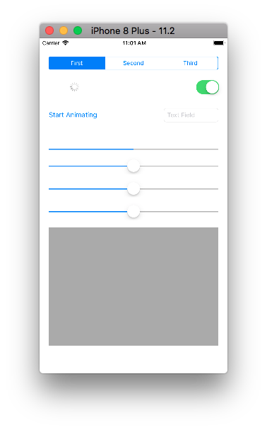

数据持久化就是将文件保存到硬盘，以便下次运行时可以读取或永久保存。iOS提供了以下几种持久化方案：

- NSUserDefaults （偏好设置）
- property list 即Plist （属性列表）
- NSKeyedArchiver NSKeyedUnarchiver（归档、解档）
- text file
- SQL databases
- Core Data

在这个demo中，我们将使用前面四种方法保存数据、恢复数据。

## 1. 创建Demo

在Xcode中创建一个Single View Application模板的应用，创建后在storyboard中添加控件，如下图所示：



segmented control的segments修改为3，其他控件默认属性即可。在ViewController.m接口部分创建如下连接：

```
@property (strong, nonatomic) IBOutlet UISegmentedControl *segments;
@property (strong, nonatomic) IBOutlet UIActivityIndicatorView *spinner;
@property (strong, nonatomic) IBOutlet UIButton *spinningButton;
@property (strong, nonatomic) IBOutlet UISwitch *cSwitch;
@property (strong, nonatomic) IBOutlet UITextField *textField;
@property (strong, nonatomic) IBOutlet UIProgressView *progressBar;
@property (strong, nonatomic) IBOutlet UISlider *slider1;
@property (strong, nonatomic) IBOutlet UISlider *slider2;
@property (strong, nonatomic) IBOutlet UISlider *slider3;
@property (strong, nonatomic) IBOutlet UITextView *textView;
// 声明两个可变词典类型属性，用来保存数据。
@property (strong, nonatomic) NSMutableDictionary *controlState;
@property (strong, nonatomic) NSMutableDictionary *sliderValue;
```

初始化`controlState`、`sliderValue`属性，如下所示：

```
- (NSMutableDictionary *)controlState {
    if (!_controlState) {
        _controlState = [NSMutableDictionary dictionary];
    }
    return _controlState;
}

- (NSMutableDictionary *)sliderValue {
    if (!_sliderValue) {
        _sliderValue = [NSMutableDictionary dictionary];
    }
    return _sliderValue;
}
```

这篇文章会用到很多字符串，用来确定保存、读取key，或路径，在`ViewController.m`文件私有接口后、实现部分前添加以下常量：

```
@end

static NSString * const selectedSegmentKey = @"selectedSegmentKey";
static NSString * const spinnerAnimatingKey = @"spinnerAnimatingKey";
static NSString * const switchEnabledKey = @"SwitchEnabledKey";
static NSString * const progressBarKey = @"progressBarKey";
static NSString * const textFieldKey = @"textFieldKey";
static NSString * const slider1Key = @"slider1Key";
static NSString * const slider2Key = @"slider2Key";
static NSString * const slider3Key = @"slider3Key";
static NSString * const controlStateComponent = @"controlStateComponent";
static NSString * const archivedDataComponent = @"archivedDataComponent";
static NSString * const sliderValueKey = @"sliderValueKey";
static NSString * const textViewComponent = @"textViewComponent";

@implementation ViewController
```

## 2. 使用User Defaults保存设置

- 运行时，NSUserDefaults从用户的默认数据库读取程序设置，NSUserDefaults的缓存避免了每次获取数据都要读取数据库。
- NSUserDefaults可以保存float、double、integer、Boolean、NSURL、NSData、NSString、NSNumber、NSDate、NSArray和NSDictionary类型的数据。
- NSUserDefaults返回的值是不可变的，尽管保存时值是可变的。例如：设定一个可变字符串为MyStringDefault的值，之后用stringForKey:获取到的字符串将不可变。
- NSUserDefaults是线程安全的。
- 任何保存在偏好设置的数据，如没有明确删除会永远保存在这里。所以，不要使用NSUserDefaults保存偏好设置外其他内容。

我们会把segmented control和spinner保存在NSUserDefaults。代码如下：

```
// spinner部分
- (IBAction)toggleSpinner:(id)sender
{
    if (self.spinner.isAnimating)
    {
        [self.spinner stopAnimating];
        [self.spinningButton setTitle:@"Start Animating" forState:UIControlStateNormal];
    }
    else
    {
        [self.spinner startAnimating];
        [self.spinningButton setTitle:@"Stop Animating" forState:UIControlStateNormal];
    }
    // 使用偏好设置保存设置。
    [[NSUserDefaults standardUserDefaults] setBool:[self.spinner isAnimating] forKey:spinnerAnimatingKey];
}

// segmented control部分
- (IBAction)controlValueChanged:(id)sender
{
    if (sender == self.segments)
    {
        // 使用偏好设置保存segment状态。
        NSInteger selectedSegment = ((UISegmentedControl *)sender).selectedSegmentIndex;
        [[NSUserDefaults standardUserDefaults] setInteger:selectedSegment forKey:selectedSegmentKey];
    }
}
```
> `toggleSpinner:`方法是从`spinningButton`拖拽出IBAction事件，`controlValueChanged:`方法是从`cSwitch`、`textField`、`slider1`、`slider2`、`slider3`拖拽出IBAction事件。

## 3. 使用Plist保存数据

- Plist是一个标准的保存文本和设置的方式，Plist的数据可以是XML格式或二进制格式，也可以在这两种格式间转换，
- Plist支持数据类型有NSData、NSDate、NSNumber、NSString、NSArray和NSDictionary，writeToFile:atomically: 方法会自动检测数据类型，如果不是这些类型，会返回false；反之，返回true。

将`cSwitch`、`textField`的数据保存到`constrolState`，如下所示：

```
- (IBAction)controlValueChanged:(id)sender
{
    ...
    else if (sender == self.cSwitch)
    {
        [self.controlState setValue:[NSNumber numberWithBool:self.cSwitch.isOn] forKey:switchEnabledKey];
    }
    else if (sender == self.textField)
    {
        [self.controlState setValue:self.textField.text forKey:textFieldKey];
    }
    
    // 使用plist保存controlState词典。
    NSURL *controlStateURL = [self urlForDocumentDirectoryWithPathComponent:controlStateComponent];
    [self.controlState writeToURL:controlStateURL atomically:YES];
}
```
> 向空数组发送`firstObject`，返回`nil` ，程序不会崩溃；向空数组发送`objectAtIndex:0`，会导致程序崩溃。

这篇文章中，需要多次获取`NSDocumentDirectory`路径，创建了`urlForDocumentDirectoryWithPathComponent:`方法：

 ```
- (NSURL *)urlForDocumentDirectoryWithPathComponent:(NSString *)pathComponent {
    NSURL *documentDirectory = [[NSFileManager defaultManager] URLsForDirectory:NSDocumentDirectory inDomains:NSUserDomainMask].firstObject;
    return [documentDirectory URLByAppendingPathComponent:pathComponent];
}
 ```

使用`NSSearchPathForDirectoriesInDomains`方法可以创建`NSString`类型路径，但应当优先考虑使用`NSURL`类型路径。`NSURL`类在定位目录、文件上更为强大，且可以同时管理网络资源和本地文件系统。想要更全面学习iOS文件系统，可以查看[使用NSFileManager管理文件系统](https://github.com/pro648/tips/wiki/使用NSFileManager管理文件系统)这篇文章。

## 4. 使用Archived Objects归档数据

- 保存的数据是二进制格式。
- 继承时，需要调用 [super encodeWithCoder:encoder]和[super initWithCoder:decoder]方法。
- 必须遵守NSCoding协议，实现下面两个方法。


 ```
 - (void)encodeWithCoder:(NSCoder *)encoder		//归档
  {
    [encoder encodeObject:obj1 forKey:@"obj1Key"];
    [encoder encodeInt:anInt forKey:@"IntValueKey"];
    [encoder encodeFloat:aFloat forKey:@"FloatValueKey"];
  }
-(instancetype)initWithCoder:(NSCoder *)decoder	// 解档
{
    if (!(self = [super init]))
        return nil;
    obj1 = [decoder decodeObjectForKey:@"obj1Key"];
    anInt = [decoder decodeObjectForKey:@"IntValueKey"];
    aFloat = [decoder decodeObjectForKey:@"FloatValueKey"];
}
 ```

在我们这个demo里，没有自定义数据类型，不需要实现上面两个方法。

继续在`controlValueChanged:`中，保存`slider1`、`slider2`和`slider3`值到`sliderValues`，如下所示：

``` 
- (IBAction)controlValueChanged:(id)sender
{
    ...
    else if (sender == self.slider1)
    {
        [self.sliderValue setValue:[NSNumber numberWithFloat:self.slider1.value] forKey:slider1Key];
        
        // Update progress bar with slider
        [self.progressBar setProgress:self.slider1.value];
        [self.controlState setValue:[NSNumber numberWithFloat:self.progressBar.progress] forKey:progressBarKey];
    }
    else if (sender == self.slider2)
        [self.sliderValue setValue:[NSNumber numberWithFloat:self.slider2.value] forKey:slider2Key];
    else if (sender == self.slider3)
        [self.sliderValue setValue:[NSNumber numberWithFloat:self.slider3.value] forKey:slider3Key];
    else
        return ;
    ...
    // 使用归档保存sliderValue词典。
    NSMutableData *data = [NSMutableData data];
    NSKeyedArchiver *archiver = [[NSKeyedArchiver alloc] initForWritingWithMutableData:data];
    [archiver encodeObject:self.sliderValue forKey:sliderValueKey];
    [archiver finishEncoding];
    NSURL *dataURL = [self urlForDocumentDirectoryWithPathComponent:archivedDataComponent];
    if (![data writeToURL:dataURL atomically:YES]) {
        NSLog(@"Couldn't write to dataURL");
    }
}
```
## 5. 保存文本文件
把字符串保存为文本文件很简单。人们可以读取文本文件，并且文本文件是夸平台数据类型，在`textView`保存文本文件需要 遵守`UITextViewDelegate`协议。另外，使用`textField`也需要遵守`UITextFieldDelegate `协议，以便点击return时，可以隐藏键盘。在`ViewController.m` 文件私有接口部分声明遵守`UITextFieldDelegate `和`UITextViewDelegate`协议，并设置代理。更新后如下：

```
// 声明遵守UITextViewDelegate、UITextFieldDelegate协议
@interface ViewController () <UITextViewDelegate, UITextFieldDelegate>

- (void)viewDidLoad {
    [super viewDidLoad];
    
    // 设置代理
    self.textField.delegate = self;
    self.textView.delegate = self;
    
    // 设置textView背景色，textField占位符。
    self.textView.backgroundColor = [UIColor lightGrayColor];
    self.textField.placeholder = @"Text Field";
}

- (void)textViewDidEndEditing:(UITextView *)textView {
    // 编辑完成后，保存文本文件。
    NSString *textViewContents = textView.text;
    NSURL *fileURL = [self urlForDocumentDirectoryWithPathComponent:textViewComponent];
    [textViewContents writeToURL:fileURL atomically:YES encoding:NSUTF8StringEncoding error:nil];
}

-(BOOL)textView:(UITextView *)textView shouldChangeTextInRange:(NSRange)range replacementText:(NSString *)text
{
    if ([text isEqualToString:@"\n"]) {
        [textView resignFirstResponder];
    }
    return true;
}

// 隐藏键盘
- (BOOL)textFieldShouldReturn:(UITextField *)textField {
    if ([textField isFirstResponder]) {
        [textField resignFirstResponder];
    }
    return YES;
}
```

## 7. 恢复数据

每次启动app时，在`viewWillAppear:`内恢复数据。

```
-(void)viewWillAppear:(BOOL)animated
{
    [super viewWillAppear:true];
    
    // 读取偏好设置中segment设置。
    NSInteger selectedSegmentIndex = [[NSUserDefaults standardUserDefaults] integerForKey:selectedSegmentKey];
    self.segments.selectedSegmentIndex = selectedSegmentIndex;
    
    // 恢复偏好设置中spinner状态设置。
    if ([[NSUserDefaults standardUserDefaults] boolForKey:spinnerAnimatingKey] == true)
    {
        [self.spinner startAnimating];
        [self.spinningButton setTitle:@"Stop Animating" forState:UIControlStateNormal];
    }
    else
    {
        [self.spinner stopAnimating];
        [self.spinningButton setTitle:@"Start Animating" forState:UIControlStateNormal];
    }
    
    // 从plist恢复controlState词典。
    NSURL *controlStateURL = [self urlForDocumentDirectoryWithPathComponent:controlStateComponent];
    if (controlStateURL) {
        // 如果url存在，读取保存的数据。
        self.controlState = [NSMutableDictionary dictionaryWithContentsOfURL:controlStateURL];
    }
    if ([[self.controlState allKeys] count] != 0)
    {
        // 如果词典不为空，恢复数据。
        [self.cSwitch setOn:[[self.controlState objectForKey:switchEnabledKey] boolValue]];
        self.progressBar.progress = [[self.controlState objectForKey:progressBarKey] floatValue];
        self.textField.text = [self.controlState objectForKey:textFieldKey];
    }
    
    // 读取归档，恢复sliderValue词典内容。
    NSURL *dataURL = [self urlForDocumentDirectoryWithPathComponent:archivedDataComponent];
    if (dataURL) {
        // 如果url存在，读取保存的数据。
        NSMutableData *data = [[NSMutableData alloc] initWithContentsOfURL:dataURL];
        NSKeyedUnarchiver *unarchiver = [[NSKeyedUnarchiver alloc] initForReadingWithData:data];
        self.sliderValue = [unarchiver decodeObjectForKey:sliderValueKey];
    }
    if (self.sliderValue.allKeys.count != 0)
    {
        // 如果词典不为空，恢复数据。
        self.slider1.value = [[self.sliderValue objectForKey:slider1Key] floatValue];
        self.slider2.value = [[self.sliderValue objectForKey:slider2Key] floatValue];
        self.slider3.value = [[self.sliderValue objectForKey:slider3Key] floatValue];
    }
    
    // 读取文本文件，恢复textView内容。
    NSURL *textViewContentsURL = [self urlForDocumentDirectoryWithPathComponent:textViewComponent];
    if (textViewContentsURL) {
        NSString *textViewContents = [NSString stringWithContentsOfURL:textViewContentsURL encoding:NSUTF8StringEncoding error:nil];
        self.textView.text = textViewContents;
    }
}
```
现在，已经可以通过偏好设置、属性列表、归档解档保存数据、恢复数据。

文件名称：Persistence  
源码地址：<https://github.com/pro648/BasicDemos-iOS>
