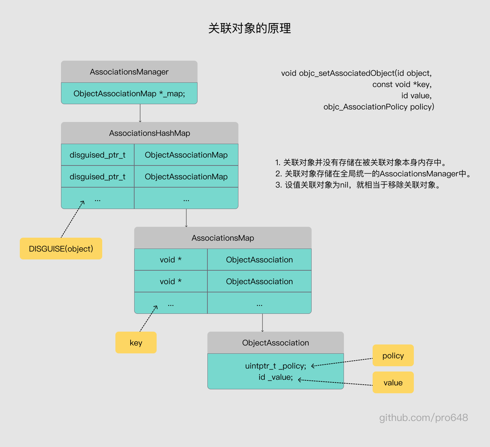

上一篇文章[分类category、load、initialize的本质和源码分析](https://github.com/pro648/tips/blob/master/sources/%E5%88%86%E7%B1%BBcategory%E3%80%81load%E3%80%81initialize%E7%9A%84%E6%9C%AC%E8%B4%A8%E5%92%8C%E6%BA%90%E7%A0%81%E5%88%86%E6%9E%90.md)介绍到，在objc4最新源码[objc4-818.2](https://opensource.apple.com/tarballs/objc4/)中，category结构体如下：

```
struct category_t {
    const char *name;	// 类名
    classref_t cls;
    WrappedPtr<method_list_t, PtrauthStrip> instanceMethods;	// 实例方法列表
    WrappedPtr<method_list_t, PtrauthStrip> classMethods;	// 类方法列表
    struct protocol_list_t *protocols;	// 协议列表
    struct property_list_t *instanceProperties;	// 属性列表
    // Fields below this point are not always present on disk.
    struct property_list_t *_classProperties;

    method_list_t *methodsForMeta(bool isMeta) {
        if (isMeta) return classMethods;
        else return instanceMethods;
    }

    property_list_t *propertiesForMeta(bool isMeta, struct header_info *hi);
    
    protocol_list_t *protocolsForMeta(bool isMeta) {
        if (isMeta) return nullptr;
        else return protocols;
    }
};
```

> 使用[clang](https://github.com/pro648/tips/blob/master/sources/%E5%88%86%E7%B1%BBcategory%E3%80%81load%E3%80%81initialize%E7%9A%84%E6%9C%AC%E8%B4%A8%E5%92%8C%E6%BA%90%E7%A0%81%E5%88%86%E6%9E%90.md#13-%E5%88%86%E7%B1%BB%E7%9A%84%E5%BA%95%E5%B1%82%E7%BB%93%E6%9E%84)命令，将 Objective-C 代码转换成 C++ 后，其结构与源码中的类似。

`category_t`结构体中存储了实例方法列表、类方法列表、协议列表、属性列表，但没有成员变量列表。因此，分类中不能直接添加成员变量，添加的属性只会声明getter、setter方法，不会生成对应的getter、setter实现和成员变量。

因此，想要在分类中实现属性的效果，就需要额外步骤存储成员变量值。

## 1. 分类添加成员变量方案

#### 1.1 使用全局变量存储

分类中没有成员变量，属性不会生成访问器方法的实现。可以通过添加一个全局变量，保存属性值。如下所示：

```
static NSString *_name;

@implementation Child (Test)

- (void)setName:(NSString *)name {
    _name = name;
}

- (NSString *)name {
    return _name;
}

@end
```

使用以下代码验证分类属性存取值：

```
        Child *child1 = [[Child alloc] init];
        child1.name = @"pro648";
        
        Child *child2 = [[Child alloc] init];
        child2.name = @"It's Time";
        
        NSLog(@"child1 name:%@ -- child2 name:%@", child1.name, child2.name);
```

控制台输出如下：

```
child1 name:It's Time -- child2 name:It's Time
```

由于全局变量存储在类中，内存中只有一个类对象，这就导致不同实例对象共用同一个全局变量，不能区分不同实例的值。

#### 1.2 使用全局字典存储

既然使用一个全局变量不能区分不同实例，我们可以添加一个全局字典，以实例作为key，存储其值。这样可以区分不同实例：

```
NSMutableDictionary *nameDict;
#define key [NSString stringWithFormat:@"%p", self]

+ (void)initialize {
    if (self == Child.class) {
        nameDict = [NSMutableDictionary dictionary];
    }
}

- (void)setName:(NSString *)name {
    nameDict[key] = name;
}

- (NSString *)name {
    return nameDict[key];
}
```

由于不同实例要使用同一个字典，这里将字典的初始化放到了`+initialize`方法。在`Child`类首次收到消息时初始化，既确保了延迟加载，也确保了只初始化一份。由于有多个分类时，只会调用一个分类的`+initialize`方法，此时应将其初始化放到`+load`方法。关于`+load`、`+initialize`方法的区别，可以查看[分类category、load、initialize的本质和源码分析](https://github.com/pro648/tips/blob/master/sources/%E5%88%86%E7%B1%BBcategory%E3%80%81load%E3%80%81initialize%E7%9A%84%E6%9C%AC%E8%B4%A8%E5%92%8C%E6%BA%90%E7%A0%81%E5%88%86%E6%9E%90.md)。

执行后控制台打印如下：

```
child1 name:pro648 -- child2 name:It's Time
```

如果有多个属性，就需要添加多个字典，这样会很麻烦。字典会长时间存在，造成内存泄漏。除此之外，字典并非线程安全，多线程存取时会遇到问题。

#### 1.3 关联对象 Associated Object

Objective-C 2.0 中 runtime 增加的 associated object，在运行时可以将任意值关联到指定对象。其主要提供了以下 API：

- objc_setAssociatedObject：为指定对象、使用指定key关联值。值为`nil`时，用于清楚关联对象。
- objc_getAssociatedObject：取出指定对象使用指定key关联的值。
- objc_removeAssociatedObjects：清除指定对象的所有关联对象。主要用于将对象还原为「初始状态」，不应用于从对象中删除关联对象，因为它会删除关联到该对象的所有值。通常，为`objc_setAssociatedObject`传值`nil`以清除关联。

添加关联对象对象、取出关联对象方法如下：

```
// 添加关联对象
objc_setAssociatedObject(id _Nonnull object, const void * _Nonnull key,
                         id _Nullable value, objc_AssociationPolicy policy)
// 取出关联对象
objc_getAssociatedObject(id _Nonnull object, const void * _Nonnull key)
```

可以看到key是`const void * _Nonnull`类型的，也就是地址值，不需要变量值。因此，只定义就可以使用。

添加`int`类型的全局变量`age`，如下所示：

```
// 占4个字节
int age = 0;
```

使用关联对象存、取属性值：

```
- (void)setName:(NSString *)name {
    objc_setAssociatedObject(self, &age, name, OBJC_ASSOCIATION_COPY_NONATOMIC);
}

- (NSString *)name {
    return objc_getAssociatedObject(self, &age);
}
```

###### 1.3.1 key 的几种类型

除了使用`int`类型的全局变量作为 key，还可以使用以下内容作为 key：

- 指针变量：一个指针变量占用8个字节，指针变量声明如下：

  ```
  static const void *NameKey = &NameKey;	// 传 NameKey
  ```

- char：一个char只占用一个字节。

  ```
  static const char NameKey;	// 传 &NameKey
  ```

- 字符串：字符串存储在数据常量区，多个相同字符串地址相同。直接为 key 传递字符串时，就是在传递字符串的地址值。
- @selector()：就是指定字符串地址值。
- `_cmd`：方法默认有两个参数，第一个`(id)self`，第二个`(SEL)_cmd`。因此`@selector()`可以使用`_cmd`替换。

比较之后，最为便捷的还是`@selector()`方式，如下所示：

```
- (void)setName:(NSString *)name {
    objc_setAssociatedObject(self, @selector(name), name, OBJC_ASSOCIATION_COPY_NONATOMIC);
}

- (NSString *)name {
    return objc_getAssociatedObject(self, @selector(name));
}
```

###### 1.3.2 内存管理

`objc_AssociationPolicy`枚举类型决定关联值存储类型。

| objc_AssociationPolicy            | 对应property                 | 描述                         |
| --------------------------------- | ---------------------------- | ---------------------------- |
| OBJC_ASSOCIATION_ASSIGN           | @property(assign)            | 对关联对象弱引用。           |
| OBJC_ASSOCIATION_COPY             | @property(nonatomic, strong) | 对关联对象强引用，非原子性。 |
| OBJC_ASSOCIATION_COPY_NONATOMIC   | @property(nonatomic, copy)   | 复制关联对象，非原子性。     |
| OBJC_ASSOCIATION_RETAIN           | @property(atomic, strong)    | 对关联对象强引用，原子性。   |
| OBJC_ASSOCIATION_RETAIN_NONATOMIC | @property(atomic, copy)      | 复制关联对象，原子性。       |

## 2. 关联对象的本质

RunTime 主要由以下对象实现关联对象技术：

- AssociationsManager
- AssociationsHashMap
- ObjectAssociationMap
- ObjectAssociation

#### 2.1 objc_setAssociatedObject源码

在objc4中搜索`objc_setAssociatedObject()`函数，如下所示：

```
void
objc_setAssociatedObject(id object, const void *key, id value, objc_AssociationPolicy policy)
{
    _object_set_associative_reference(object, key, value, policy);
}
```

其调用了`_object_set_associative_reference()`函数，该函数源码如下：

```
void
_object_set_associative_reference(id object, const void *key, id value, uintptr_t policy)
{
    // This code used to work when nil was passed for object and key. Some code
    // probably relies on that to not crash. Check and handle it explicitly.
    // rdar://problem/44094390
    if (!object && !value) return;

    if (object->getIsa()->forbidsAssociatedObjects())
        _objc_fatal("objc_setAssociatedObject called on instance (%p) of class %s which does not allow associated objects", object, object_getClassName(object));

    // 用object拿到AssociationsHashMap中的key
    DisguisedPtr<objc_object> disguised{(objc_object *)object};
    // 使用传入的policy、value生成association。
    ObjcAssociation association{policy, value};

    // retain the new value (if any) outside the lock.
    association.acquireValue();

    bool isFirstAssociation = false;
    {
        AssociationsManager manager;
        // manager关联了AssociationsHashMap
        AssociationsHashMap &associations(manager.get());

        if (value) {
            // 使用object生成的disguised取出字典数据
            auto refs_result = associations.try_emplace(disguised, ObjectAssociationMap{});
            if (refs_result.second) {
                /* it's the first association we make */
                isFirstAssociation = true;
            }

            /* establish or replace the association */
            // 取出ObjectAssociationMap
            auto &refs = refs_result.first->second;
            
            // 使用key取出ObjectAssociation
            auto result = refs.try_emplace(key, std::move(association));
            if (!result.second) {
                // 交换关联的association
                association.swap(result.first->second);
            }
        } else {
            auto refs_it = associations.find(disguised);
            if (refs_it != associations.end()) {
                auto &refs = refs_it->second;
                auto it = refs.find(key);
                if (it != refs.end()) {
                    association.swap(it->second);
                    // 如果关联对象value是空，就移除关联对象。
                    refs.erase(it);
                    if (refs.size() == 0) {
                        associations.erase(refs_it);

                    }
                }
            }
        }
    }

    // Call setHasAssociatedObjects outside the lock, since this
    // will call the object's _noteAssociatedObjects method if it
    // has one, and this may trigger +initialize which might do
    // arbitrary stuff, including setting more associated objects.
    if (isFirstAssociation)
        object->setHasAssociatedObjects();

    // release the old value (outside of the lock).
    association.releaseHeldValue();
}
```

`AssociationsManager`中关联了`AssociationsHashMap`，使用参数`object`计算出 key `disguised`，利用`disguised`从`AssociationsManager`中取出`ObjectAssociationMap`，利用传入的 key 取出`ObjectAssociation`。之前使用参数`value`、`policy`已经生成了`association`，这里直接与 key 取出的`ObjectAssociation`交换。另外，也可以看到，association 不会引用传进来的 object 对象，只使用其计算出一个值，但引用了传进来的 value。对象释放时，会自动移除关联对象关联的所有值。

如果参数`value`是空的，就移除关联对象。

`AssociationsManager`源码如下：

```
class AssociationsManager {
    using Storage = ExplicitInitDenseMap<DisguisedPtr<objc_object>, ObjectAssociationMap>;
    static Storage _mapStorage;

public:
    AssociationsManager()   { AssociationsManagerLock.lock(); }
    ~AssociationsManager()  { AssociationsManagerLock.unlock(); }

    // AssociationsManager关联了ObjectAssociationMap。
    AssociationsHashMap &get() {
        return _mapStorage.get();
    }

    static void init() {
        _mapStorage.init();
    }
};
```

`ObjectAssociationMap`和`AssociationsHashMap`源码如下：

```
// key是 const void *, value是ObjcAssociation
typedef DenseMap<const void *, ObjcAssociation> ObjectAssociationMap;
// key: DisguisePtr value: ObjectAssociationMap
// 就是value是另一个map
typedef DenseMap<DisguisedPtr<objc_object>, ObjectAssociationMap> AssociationsHashMap;
```

关联对象原理如下图：



#### 2.2 objc_getAssociatedObject源码

RunTime 中的`objc_getAssociatedObject()`函数如下：

```
id
objc_getAssociatedObject(id object, const void *key)
{
    return _object_get_associative_reference(object, key);
}
```

其调用了`_object_get_associative_reference()`函数，`_object_get_associative_reference()`如下：

```
id
_object_get_associative_reference(id object, const void *key)
{
    ObjcAssociation association{};

    {
        AssociationsManager manager;
        // manager关联了AssociationsHashMap
        AssociationsHashMap &associations(manager.get());
        AssociationsHashMap::iterator i = associations.find((objc_object *)object);
        if (i != associations.end()) {
            // 取出ObjectAssociationMap
            ObjectAssociationMap &refs = i->second;
            // 使用参数 key，取出ObjectAssociation
            ObjectAssociationMap::iterator j = refs.find(key);
            if (j != refs.end()) {
                // ObjectAssociation包含要取出的 value 和 policy。
                association = j->second;
                association.retainReturnedValue();
            }
        }
    }

    return association.autoreleaseReturnedValue();
}
```

`objc_getAssociatedObject()`取出关联对象步骤与`objc_setAssociatedObject()`设值关联对象步骤类似，都是使用传入的`object`作为 key，取出`ObjectAssociationMap`，即`ObjectAssociationMap`包含了该实例的所有关联对象。使用参数 key 从`ObjectAssociationMap`中取出`ObjectAssociation`对象。`ObjectAssociation`就是要取出、设值的关联对象。

#### 2.3 objc_removeAssociatedObjects

RunTime 中`objc_removeAssociatedObjects()`函数如下：

```
void objc_removeAssociatedObjects(id object) 
{
    if (object && object->hasAssociatedObjects()) {
        _object_remove_assocations(object, /*deallocating*/false);
    }
}
```

`objc_removeAssociatedObjects()`函数调用了`_object_remove_associations()`函数，如下所示：

```
// Unlike setting/getting an associated reference,
// this function is performance sensitive because of
// raw isa objects (such as OS Objects) that can't track
// whether they have associated objects.
void
_object_remove_assocations(id object, bool deallocating)
{
    ObjectAssociationMap refs{};

    {
        AssociationsManager manager;
        AssociationsHashMap &associations(manager.get());
        AssociationsHashMap::iterator i = associations.find((objc_object *)object);
        if (i != associations.end()) {
            refs.swap(i->second);

            // If we are not deallocating, then SYSTEM_OBJECT associations are preserved.
            bool didReInsert = false;
            if (!deallocating) {
                for (auto &ref: refs) {
                    if (ref.second.policy() & OBJC_ASSOCIATION_SYSTEM_OBJECT) {
                        i->second.insert(ref);
                        didReInsert = true;
                    }
                }
            }
            if (!didReInsert)
                // 移除 AssociationsMap
                associations.erase(i);
        }
    }

    // Associations to be released after the normal ones.
    SmallVector<ObjcAssociation *, 4> laterRefs;

    // release everything (outside of the lock).
    for (auto &i: refs) {
        if (i.second.policy() & OBJC_ASSOCIATION_SYSTEM_OBJECT) {
            // If we are not deallocating, then RELEASE_LATER associations don't get released.
            if (deallocating)
                laterRefs.append(&i.second);
        } else {
            i.second.releaseHeldValue();
        }
    }
    for (auto *later: laterRefs) {
        later->releaseHeldValue();
    }
}
```

`_object_remove_associations()`函数根据`object`对象，查找到`AssociationMap`后直接移除。

## 3. 面试题

#### 3.1 分类可以添加成员变量吗？

分类不能添加成员变量。可以添加属性，但系统只会生成属性getter、setter方法的声明，不会生成其实现，也不会生成属性的成员变量。想要在分类中使用属性，需在getter、setter实现中手动使用关联对象实现。

Demo名称：AssociatedObject  
源码地址：<https://github.com/pro648/BasicDemos-iOS/tree/master/AssociatedObject>

