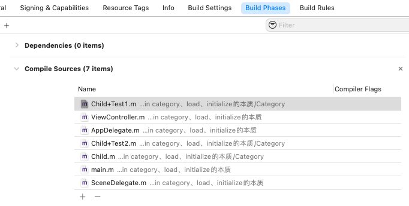

这篇文章介绍分类category、load、initialize的本质，并分析其源码。

## 1. 分类 category

随着需求的演进，类会遇到一些无法处理的情况，应如何扩展已有的类呢？

通常，继承和组合是不错的选择。但 Objective-C 2.0 中，提供的分类category新特性，可以动态的为已有类添加新行为。Category 有以下几个用途：

- 为已有的类添加新行为。此时，无需原来类的源码，也无需继承原来的类。例如，为 Cocoa Touch framework添加分类方法。添加的分类方法会被子类继承，在运行时和原始方法没有区别。
- 把类的实现根据功能划分到不同文件。
- 声明私有方法。

#### 1.1 声明、实现一个分类

分类的声明和类的声明类似，但有以下几点不同：

- 分类名称写在类名称后的圆括号内。
- 不需要说明父类。
- 必须导入分类扩展的类。

为`Child`类添加一个分类，如下所示：

```
#import "Child.h"
NS_ASSUME_NONNULL_BEGIN
@interface Child (Test1)
@property (nonatomic, strong) NSString *title;
- (void)test;
@end
NS_ASSUME_NONNULL_END

#import "Child+Test1.h"
@implementation Child (Test1)
- (void)test {
    NSLog(@"%d %s", __LINE__, __PRETTY_FUNCTION__);
}
- (void)run {
    NSLog(@"%d %s", __LINE__, __PRETTY_FUNCTION__);
}
@end
```

分类文件名称一般为：类名称+分类名称，即`Child+Test1`模式。

> 如果想使用分类为自己的类添加私有方法，可以把分类的声明放到类实现文件的`@implementation`前。

#### 1.2 调用分类方法

在[Runtime从入门到进阶一](https://github.com/pro648/tips/blob/master/sources/Runtime从入门到进阶一.md)中，介绍了runtime的消息发送机制：

调用对象方法时，根据实例对象的isa查找到类对象，在类对象的方法列表中查找方法，找到后直接调用；如果找不到，则根据superclass指针，进入父类查找。找到后直接调用；如果找不到，则继续向父类查找。以此类推，直到找到方法，或抛出`doesNotRecognizeSelector:`异常。

为上面的`Child`类继续添加`Child+Test2`分类，`Child`、`Child+Test1`、`Child+Test2`都实现了`test`方法。使用以下代码调用`test`方法，看最终调用哪个`test`方法。

```
    Child *child = [[Child alloc] init];
    [child test];
```

执行后控制台打印如下：

```
13 -[Child(Test2) test]
```

即调用了分类的`test`方法。事实上，类、分类实现了同一方法时，总是优先调用分类的方法。一个类的多个分类实现了同一方法时，后编译的优先调用，后续会介绍这一现象的本质原因。

类根据 Xcode 中*Build Phases* > *Compile Sources* 文件顺序进行编译，自上而下依次编译：



你可以手动拖动文件，改变其编译顺序。拖动后，再次执行上述代码，看控制台输出是否发生了改变。

#### 1.3 分类的底层结构

分类的方法不是在编译期合并到原来类中的，而是在运行时合并进去的。

使用`clang`命令可以将 Objective-C 的代码转换为 C++，方便查看其底层实现，命令如下：

```
xcrun -sdk iphoneos clang -arch arm64 -rewrite-objc <objc文件名称.m> -o <输出文件名称.cpp>
```

将`Child+Test1.m`转换为`Child+Test1.cpp`文件命令如下：

```
xcrun -sdk iphoneos clang -arch arm64 -rewrite-objc Child+Test1.m -o Child+Test1.cpp
```

生成的`Child+Test1.cpp`文件有三万四千行，滑到底部可以看到 category 的数据结构：

```
struct _category_t {
	const char *name;	// 类名
	struct _class_t *cls;
	const struct _method_list_t *instance_methods;	// 分类对象方法列表
	const struct _method_list_t *class_methods;	// 分类类方法列表
	const struct _protocol_list_t *protocols;	// 分类协议列表
	const struct _prop_list_t *properties;	// 分类属性列表
};
```

继续向下查找，可以看到对象方法列表如下：

```
static struct /*_method_list_t*/ {
	unsigned int entsize;  // sizeof(struct _objc_method)
	unsigned int method_count;
	struct _objc_method method_list[2];
} _OBJC_$_CATEGORY_INSTANCE_METHODS_Child_$_Test1 __attribute__ ((used, section ("__DATA,__objc_const"))) = {
	sizeof(_objc_method),
	2,
	{{(struct objc_selector *)"test", "v16@0:8", (void *)_I_Child_Test1_test},
	{(struct objc_selector *)"run", "v16@0:8", (void *)_I_Child_Test1_run}}
};
```

它包含了`test`和`run`两个方法。

为`Child+Test2`类添加添加`NSCoding`、`NSCoping`协议和其他类方法。再次使用clang命令将其转换为C++。可以看到其中的协议列表、类方法列表增加了相应的内容。如下所示：

```
static struct /*_protocol_list_t*/ {
	long protocol_count;  // Note, this is 32/64 bit
	struct _protocol_t *super_protocols[2];
} _OBJC_CATEGORY_PROTOCOLS_$_Child_$_Test2 __attribute__ ((used, section ("__DATA,__objc_const"))) = {	// 协议
	2,
	&_OBJC_PROTOCOL_NSCoding,
	&_OBJC_PROTOCOL_NSCopying
};
```

#### 1.4 分类category_t结构

这里使用的是objc4最新源码[objc4-818.2](https://opensource.apple.com/tarballs/objc4/)。在源码中，category结构体如下：

```
struct category_t {
    const char *name;	// 类名
    classref_t cls;
    WrappedPtr<method_list_t, PtrauthStrip> instanceMethods;	// 实例方法列表
    WrappedPtr<method_list_t, PtrauthStrip> classMethods;	// 类方法列表
    struct protocol_list_t *protocols;	// 协议列表
    struct property_list_t *instanceProperties;	// 属性列表
    // Fields below this point are not always present on disk.
    struct property_list_t *_classProperties;

    method_list_t *methodsForMeta(bool isMeta) {
        if (isMeta) return classMethods;
        else return instanceMethods;
    }

    property_list_t *propertiesForMeta(bool isMeta, struct header_info *hi);
    
    protocol_list_t *protocolsForMeta(bool isMeta) {
        if (isMeta) return nullptr;
        else return protocols;
    }
};
```

通过源码可以看到，分类中有实例方法列表、类方法列表、协议列表、属性列表，但没有成员变量列表。因此，分类中是不能添加成员变量的。分类中添加的属性并不会自动生成成员变量，只会生成get、set方法的声明，需要开发者自行实现访问器方法。

通过源码看到，category的实例方法、类方法、协议、属性存放在`category_t`结构体中。目前，分类里的信息和类里的信息是分开存储的。

那么是如何合并到原来类中的？

#### 1.5 分类信息合并到类源码

程序一运行，就会把所有类对象、类对象信息、元类等，加载到内存中。

RunTime 的入口在`objc-os.mm`文件的`_objc_init()`方法中：

```
/***********************************************************************
* _objc_init
* Bootstrap initialization. Registers our image notifier with dyld.
* Called by libSystem BEFORE library initialization time
**********************************************************************/

void _objc_init(void)
{
    static bool initialized = false;
    if (initialized) return;
    initialized = true;
    
    // fixme defer initialization until an objc-using image is found?
    environ_init();
    tls_init();
    static_init();
    runtime_init();
    exception_init();
#if __OBJC2__
    cache_t::init();
#endif
    _imp_implementationWithBlock_init();

    // image是模块、镜像，并非图片。
    _dyld_objc_notify_register(&map_images, load_images, unmap_image);

#if __OBJC2__
    didCallDyldNotifyRegister = true;
#endif
}
```

`map_images()`会调用`map_images_nolock()`函数，`map_images_nolock()`会调用`_read_images()`函数，`_read_images()`函数如下：

```
/***********************************************************************
* _read_images
* Perform initial processing of the headers in the linked 
* list beginning with headerList. 
*
* Called by: map_images_nolock
*
* Locking: runtimeLock acquired by map_images
**********************************************************************/
void _read_images(header_info **hList, uint32_t hCount, int totalClasses, int unoptimizedTotalClasses)
{
    // 省略部分...

    // 分类
    // Discover categories. Only do this after the initial category
    // attachment has been done. For categories present at startup,
    // discovery is deferred until the first load_images call after
    // the call to _dyld_objc_notify_register completes. rdar://problem/53119145
    if (didInitialAttachCategories) {
        for (EACH_HEADER) {
            // 加载分类
            load_categories_nolock(hi);
        }
    }

    ts.log("IMAGE TIMES: discover categories");

    // Category discovery MUST BE Late to avoid potential races
    // when other threads call the new category code before
    // this thread finishes its fixups.

    // +load handled by prepare_load_methods()

    // 省略部分...
    }

#undef EACH_HEADER
}
```

这里调用了`load_categories_nolock()`函数：

```
static void load_categories_nolock(header_info *hi) {
    bool hasClassProperties = hi->info()->hasCategoryClassProperties();

    size_t count;
    auto processCatlist = [&](category_t * const *catlist) {
        for (unsigned i = 0; i < count; i++) {
            category_t *cat = catlist[i];
            Class cls = remapClass(cat->cls);
            locstamped_category_t lc{cat, hi};

            if (!cls) {
                // Category's target class is missing (probably weak-linked).
                // Ignore the category.
                if (PrintConnecting) {
                    _objc_inform("CLASS: IGNORING category \?\?\?(%s) %p with "
                                 "missing weak-linked target class",
                                 cat->name, cat);
                }
                continue;
            }

            // Process this category.
            if (cls->isStubClass()) {
                // Stub classes are never realized. Stub classes
                // don't know their metaclass until they're
                // initialized, so we have to add categories with
                // class methods or properties to the stub itself.
                // methodizeClass() will find them and add them to
                // the metaclass as appropriate.
                if (cat->instanceMethods ||
                    cat->protocols ||
                    cat->instanceProperties ||
                    cat->classMethods ||
                    cat->protocols ||
                    (hasClassProperties && cat->_classProperties))
                {
                    objc::unattachedCategories.addForClass(lc, cls);
                }
            } else {
                // First, register the category with its target class.
                // Then, rebuild the class's method lists (etc) if
                // the class is realized.
                // 先向类注册分类，再重建类的方法列表。
                if (cat->instanceMethods ||  cat->protocols
                    ||  cat->instanceProperties)
                {
                    if (cls->isRealized()) {
                        // 附加分类
                        attachCategories(cls, &lc, 1, ATTACH_EXISTING);
                    } else {
                        objc::unattachedCategories.addForClass(lc, cls);
                    }
                }

                if (cat->classMethods  ||  cat->protocols
                    ||  (hasClassProperties && cat->_classProperties))
                {
                    if (cls->ISA()->isRealized()) {
                        // 附加分类
                        attachCategories(cls->ISA(), &lc, 1, ATTACH_EXISTING | ATTACH_METACLASS);
                    } else {
                        objc::unattachedCategories.addForClass(lc, cls->ISA());
                    }
                }
            }
        }
    };

    processCatlist(hi->catlist(&count));
    processCatlist(hi->catlist2(&count));
}
```

其中调用`attachCategories()`函数，将分类的的实例方法、协议、属性、类方法合并到类中。`attachCategories()`函数如下：

```
// Attach method lists and properties and protocols from categories to a class.
// Assumes the categories in cats are all loaded and sorted by load order, 
// oldest categories first.
static void
attachCategories(Class cls, const locstamped_category_t *cats_list, uint32_t cats_count,
                 int flags)
{
    if (slowpath(PrintReplacedMethods)) {
        printReplacements(cls, cats_list, cats_count);
    }
    if (slowpath(PrintConnecting)) {
        _objc_inform("CLASS: attaching %d categories to%s class '%s'%s",
                     cats_count, (flags & ATTACH_EXISTING) ? " existing" : "",
                     cls->nameForLogging(), (flags & ATTACH_METACLASS) ? " (meta)" : "");
    }

    /*
     * Only a few classes have more than 64 categories during launch.
     * This uses a little stack, and avoids malloc.
     *
     * Categories must be added in the proper order, which is back
     * to front. To do that with the chunking, we iterate cats_list
     * from front to back, build up the local buffers backwards,
     * and call attachLists on the chunks. attachLists prepends the
     * lists, so the final result is in the expected order.
     */
    // 分类从后向前添加。
    constexpr uint32_t ATTACH_BUFSIZ = 64;
    // 方法数组
    method_list_t   *mlists[ATTACH_BUFSIZ];
    // 属性数组
    property_list_t *proplists[ATTACH_BUFSIZ];
    // 协议数组
    protocol_list_t *protolists[ATTACH_BUFSIZ];

    uint32_t mcount = 0;
    uint32_t propcount = 0;
    uint32_t protocount = 0;
    bool fromBundle = NO;
    bool isMeta = (flags & ATTACH_METACLASS);
    auto rwe = cls->data()->extAllocIfNeeded();

    for (uint32_t i = 0; i < cats_count; i++) {
        // 取出某个分类
        auto& entry = cats_list[i];

        // 取出对象方法或类方法
        method_list_t *mlist = entry.cat->methodsForMeta(isMeta);
        if (mlist) {
            if (mcount == ATTACH_BUFSIZ) {
                prepareMethodLists(cls, mlists, mcount, NO, fromBundle, __func__);
                rwe->methods.attachLists(mlists, mcount);
                mcount = 0;
            }
            mlists[ATTACH_BUFSIZ - ++mcount] = mlist;
            fromBundle |= entry.hi->isBundle();
        }

        property_list_t *proplist =
            entry.cat->propertiesForMeta(isMeta, entry.hi);
        if (proplist) {
            if (propcount == ATTACH_BUFSIZ) {
                rwe->properties.attachLists(proplists, propcount);
                propcount = 0;
            }
            proplists[ATTACH_BUFSIZ - ++propcount] = proplist;
        }

        protocol_list_t *protolist = entry.cat->protocolsForMeta(isMeta);
        if (protolist) {
            if (protocount == ATTACH_BUFSIZ) {
                rwe->protocols.attachLists(protolists, protocount);
                protocount = 0;
            }
            protolists[ATTACH_BUFSIZ - ++protocount] = protolist;
        }
    }

    if (mcount > 0) {
        prepareMethodLists(cls, mlists + ATTACH_BUFSIZ - mcount, mcount,
                           NO, fromBundle, __func__);
        // 将所有分类的对象方法，附加到类对象的方法列表中。
        rwe->methods.attachLists(mlists + ATTACH_BUFSIZ - mcount, mcount);
        if (flags & ATTACH_EXISTING) {
            flushCaches(cls, __func__, [](Class c){
                // constant caches have been dealt with in prepareMethodLists
                // if the class still is constant here, it's fine to keep
                return !c->cache.isConstantOptimizedCache();
            });
        }
    }

    // 将所有分类的属性，附加到类对象的属性列表中。
    rwe->properties.attachLists(proplists + ATTACH_BUFSIZ - propcount, propcount);

    // 将所有分类的协议，附加到类对象的协议中。
    rwe->protocols.attachLists(protolists + ATTACH_BUFSIZ - protocount, protocount);
}
```

上述函数调用了`attachLists()`函数，`attachLists()`函数如下：

```
    /*
     addedLists是二维数组
     [
        [method_t, method_t]
        [method_t, method_t]
     ]
     
     addedCount是分类数量
     */
    void attachLists(List* const * addedLists, uint32_t addedCount) {
        if (addedCount == 0) return;

        if (hasArray()) {
            // many lists -> many lists
            uint32_t oldCount = array()->count;
            uint32_t newCount = oldCount + addedCount;
            array_t *newArray = (array_t *)malloc(array_t::byteSize(newCount));
            newArray->count = newCount;
            array()->count = newCount;

            for (int i = oldCount - 1; i >= 0; i--)
            // array()->lists是原来的方法列表
                newArray->lists[i + addedCount] = array()->lists[i];
            
            // addedLists是所有分类的方法列表，把分类方法列表放到方法列表前面。
            for (unsigned i = 0; i < addedCount; i++)
                newArray->lists[i] = addedLists[i];
            free(array());
            setArray(newArray);
            validate();
        }
        else if (!list  &&  addedCount == 1) {
            // 0 lists -> 1 list
            list = addedLists[0];
            validate();
        } 
        else {
            // 1 list -> many lists
            Ptr<List> oldList = list;
            uint32_t oldCount = oldList ? 1 : 0;
            uint32_t newCount = oldCount + addedCount;
            setArray((array_t *)malloc(array_t::byteSize(newCount)));
            array()->count = newCount;
            if (oldList) array()->lists[addedCount] = oldList;
            for (unsigned i = 0; i < addedCount; i++)
                array()->lists[i] = addedLists[i];
            validate();
        }
    }
```

可以看到，合并时先将原来类中的方法向后移动，再将分类方法放到方法列表前面。因此，进行方法查找时，先找到分类方法，找到后不再查找，这就形成了分类方法会覆盖类方法的错觉。

事实上，如果分类和原来类都有同样方法时，category附加完成后方法列表会有两个相同的方法，只是分类方法位于列表前面，优先查找到分类方法。

分类的方法列表和类的实例方法一样，最终放在同一个类对象的方法列表，并不会存放在单独的方法列表中。类方法、协议、属性等类似。

## 2. load方法

多数情况下，开发者无需关心 Objective-C 中的类是如何加载进内存的，这一复杂过程由 runtime 的 linker 处理，并且会在你的代码开始执行前处理完成。

多数类无需关心类加载过程，但有时可能需要初始化全局表、用户数据缓存等任务。

Objective-C runtime 提供了`+load`、`+initialize`两个方法，用于解决上述问题。

#### 2.1 介绍

如果实现了`+load`方法，其会在加载类时被调用。`+load`只会调用一次，并且是在调用`main()`函数前调用。如果在可加载的 bundle 实现了`+load`方法，他会在 bundle 加载过程中调用。

因为`+load`被调用的时机太早了，可能产生一些很奇怪的问题。例如，在`+load`方法中使用其他类时，无法确定其他类是否已经加载了；C++ 中的 static initializer 此阶段还没有执行，如果你依赖了其中的方法会导致闪退。但 framework 中的类已经加载完毕，你可以使用 framework 中的类。父类已经加载完成，可以安全使用。

#### 2.2 使用

通过代码验证一下`+load`方法的调用。

创建`Person`类，继承自`NSObject`，创建`Person`的两个分类`Person+Test1`、`Person+Test2`。创建继承自`Person`的`Student`类，创建`Student`的两个分类`Student+Test1`、`Student+Test2`。所有类、分类都实现`+load`方法，如下所示：

```
+ (void)load {
    NSLog(@"%d %s", __LINE__, __PRETTY_FUNCTION__);
}
```

多次执行后，控制台总是先打印`Person`的`+load`方法，后打印`Student`的`+load`方法，最后根据编译顺序打印分类`+load`方法。拖动*Build Phases* > *Compile Sources*文件顺序，可以修改编译顺序。

#### 2.3 源码分析

RunTime 入口函数`_objc_init()`的`load_images()`函数开始调用`+load`方法。

```
void
load_images(const char *path __unused, const struct mach_header *mh)
{
    if (!didInitialAttachCategories && didCallDyldNotifyRegister) {
        didInitialAttachCategories = true;
        loadAllCategories();
    }

    // Return without taking locks if there are no +load methods here.
    if (!hasLoadMethods((const headerType *)mh)) return;

    recursive_mutex_locker_t lock(loadMethodLock);

    // Discover load methods
    {
        mutex_locker_t lock2(runtimeLock);
        // 先调用
        prepare_load_methods((const headerType *)mh);
    }

    // Call +load methods (without runtimeLock - re-entrant)
    // 后调用
    call_load_methods();
}
```

`call_load_methods()`函数先调用父类的`+load`，等父类的`+load`结束后才会调用分类的`+load`方法。如下所示：

```
/***********************************************************************
* call_load_methods
* Call all pending class and category +load methods.
* Class +load methods are called superclass-first. 
* Category +load methods are not called until after the parent class's +load.
* 
* This method must be RE-ENTRANT, because a +load could trigger 
* more image mapping. In addition, the superclass-first ordering 
* must be preserved in the face of re-entrant calls. Therefore, 
* only the OUTERMOST call of this function will do anything, and 
* that call will handle all loadable classes, even those generated 
* while it was running.
*
* The sequence below preserves +load ordering in the face of 
* image loading during a +load, and make sure that no 
* +load method is forgotten because it was added during 
* a +load call.
* Sequence:
* 1. Repeatedly call class +loads until there aren't any more
* 2. Call category +loads ONCE.
* 3. Run more +loads if:
*    (a) there are more classes to load, OR
*    (b) there are some potential category +loads that have 
*        still never been attempted.
* Category +loads are only run once to ensure "parent class first" 
* ordering, even if a category +load triggers a new loadable class 
* and a new loadable category attached to that class. 
*
* Locking: loadMethodLock must be held by the caller 
*   All other locks must not be held.
**********************************************************************/
void call_load_methods(void)
{
    static bool loading = NO;
    bool more_categories;

    loadMethodLock.assertLocked();

    // Re-entrant calls do nothing; the outermost call will finish the job.
    if (loading) return;
    loading = YES;

    void *pool = objc_autoreleasePoolPush();

    do {
        // 1. Repeatedly call class +loads until there aren't any more
        while (loadable_classes_used > 0) {
            // 先调用class的load方法
            call_class_loads();
        }

        // 2. Call category +loads ONCE
        // 后调用分类的load方法
        more_categories = call_category_loads();

        // 3. Run more +loads if there are classes OR more untried categories
    } while (loadable_classes_used > 0  ||  more_categories);

    objc_autoreleasePoolPop(pool);

    loading = NO;
}
```

`call_class_loads()`函数调用所有挂起类的`+load`方法。如果有新的类变为可加载，并不会调用他们的`+load`方法。找到`+load`方法函数地址后，直接调用。如下所示：

```
/***********************************************************************
* call_class_loads
* Call all pending class +load methods.
* If new classes become loadable, +load is NOT called for them.
*
* Called only by call_load_methods().
**********************************************************************/
static void call_class_loads(void)
{
    int i;
    
    // Detach current loadable list.
    struct loadable_class *classes = loadable_classes;
    int used = loadable_classes_used;
    loadable_classes = nil;
    loadable_classes_allocated = 0;
    loadable_classes_used = 0;
    
    // Call all +loads for the detached list.
    for (i = 0; i < used; i++) {
        Class cls = classes[i].cls;
        // 得到load方法的函数地址
        load_method_t load_method = (load_method_t)classes[i].method;
        if (!cls) continue; 

        if (PrintLoading) {
            _objc_inform("LOAD: +[%s load]\n", cls->nameForLogging());
        }
        // 直接调用load方法
        (*load_method)(cls, @selector(load));
    }
    
    // Destroy the detached list.
    if (classes) free(classes);
}
```

调用分类的`+load`方法与调用类的`+load`方法类似，也是通过函数指针直接指向函数，拿到函数地址，找到函数直接调用。如下所示：

```
/***********************************************************************
* call_category_loads
* Call some pending category +load methods.
* The parent class of the +load-implementing categories has all of 
*   its categories attached, in case some are lazily waiting for +initalize.
* Don't call +load unless the parent class is connected.
* If new categories become loadable, +load is NOT called, and they 
*   are added to the end of the loadable list, and we return TRUE.
* Return FALSE if no new categories became loadable.
*
* Called only by call_load_methods().
**********************************************************************/
static bool call_category_loads(void)
{
    int i, shift;
    bool new_categories_added = NO;
    
    // Detach current loadable list.
    struct loadable_category *cats = loadable_categories;
    int used = loadable_categories_used;
    int allocated = loadable_categories_allocated;
    loadable_categories = nil;
    loadable_categories_allocated = 0;
    loadable_categories_used = 0;

    // Call all +loads for the detached list.
    for (i = 0; i < used; i++) {
        Category cat = cats[i].cat;
        // 获取分类的load方法地址
        load_method_t load_method = (load_method_t)cats[i].method;
        Class cls;
        if (!cat) continue;

        cls = _category_getClass(cat);
        if (cls  &&  cls->isLoadable()) {
            if (PrintLoading) {
                _objc_inform("LOAD: +[%s(%s) load]\n", 
                             cls->nameForLogging(), 
                             _category_getName(cat));
            }
            // 调用分类的load方法
            (*load_method)(cls, @selector(load));
            cats[i].cat = nil;
        }
    }

		// 省略...
}
```

`loadable_class`和`loadable_category`结构体如下：

```
struct loadable_class {
    Class cls;  // may be nil
    IMP method; // 函数实现地址，指向类的load方法。
};

struct loadable_category {
    Category cat;  // may be nil
    IMP method; // 函数实现地址，指向分类的load方法
};
```

> Runtime的消息机制需要通过`isa`指针查找类对象、元类对象，进一步在方法列表中查找方法。`+load`方法的调用不是通过消息机制进行的，而是直接找到函数指针，拿到函数地址，直接调用函数。因此，类、分类同时实现了`+load`方法时，都会被调用。但如果使用`[Person load]`方式调用`+load`方法，则会使用消息机制进行调用。此时，分类的`+load`方法会被优先调用。

通过源码的`call_class_loads()`、`call_category_loads()`函数，可以看到调用类、分类`+load`方法时，都是通过`for`循环`loadable_classes`、`loadable_categories`数组进行的。因此，知道数组的顺序，就可以知道方法调用顺序。

`load_images()`函数在调用`call_load_methods()`函数前调用了`prepare_load_methods()`方法。`prepare_load_methods()`方法会把类、分类添加到相应数组：

```
void prepare_load_methods(const headerType *mhdr)
{
    size_t count, i;

    runtimeLock.assertLocked();

    classref_t const *classlist = 
        _getObjc2NonlazyClassList(mhdr, &count);
    for (i = 0; i < count; i++) {
        // 将类、未加载的父类添加到loadable_classes数组。
        schedule_class_load(remapClass(classlist[i]));
    }

    category_t * const *categorylist = _getObjc2NonlazyCategoryList(mhdr, &count);
    for (i = 0; i < count; i++) {
        category_t *cat = categorylist[i];
        Class cls = remapClass(cat->cls);
        if (!cls) continue;  // category for ignored weak-linked class
        if (cls->isSwiftStable()) {
            _objc_fatal("Swift class extensions and categories on Swift "
                        "classes are not allowed to have +load methods");
        }
        realizeClassWithoutSwift(cls, nil);
        ASSERT(cls->ISA()->isRealized());
        // 将分类添加到loadable_categories数组
        add_category_to_loadable_list(cat);
    }
}
```

`schedule_class_load()`会递归调用，确保先将未加载的父类添加到`loadable_classes`数组。

```
/***********************************************************************
* prepare_load_methods
* Schedule +load for classes in this image, any un-+load-ed 
* superclasses in other images, and any categories in this image.
**********************************************************************/
// Recursively schedule +load for cls and any un-+load-ed superclasses.
// cls must already be connected.
static void schedule_class_load(Class cls)
{
    if (!cls) return;
    ASSERT(cls->isRealized());  // _read_images should realize

    if (cls->data()->flags & RW_LOADED) return;

    // Ensure superclass-first ordering
    // 递归调用，确保先将父类添加到loadable_classes数组。
    schedule_class_load(cls->getSuperclass());

    // 将类cls添加到loadable_classes数组
    add_class_to_loadable_list(cls);
    cls->setInfo(RW_LOADED); 
}
```

如果类实现了`+load`方法，`add_class_to_loadable_list()`函数会将其添加到`loadable_classes`数组，准备加载。

```
/***********************************************************************
* add_class_to_loadable_list
* Class cls has just become connected. Schedule it for +load if
* it implements a +load method.
**********************************************************************/
// 如果类实现了`+load`方法，add_class_to_loadable_list()函数会将其添加到loadable_classes数组，准备加载。
void add_class_to_loadable_list(Class cls)
{
    IMP method;

    loadMethodLock.assertLocked();

    method = cls->getLoadMethod();
    if (!method) return;  // Don't bother if cls has no +load method
    
    if (PrintLoading) {
        _objc_inform("LOAD: class '%s' scheduled for +load", 
                     cls->nameForLogging());
    }
    
    if (loadable_classes_used == loadable_classes_allocated) {
        loadable_classes_allocated = loadable_classes_allocated*2 + 16;
        loadable_classes = (struct loadable_class *)
            realloc(loadable_classes,
                              loadable_classes_allocated *
                              sizeof(struct loadable_class));
    }
    
    loadable_classes[loadable_classes_used].cls = cls;
    loadable_classes[loadable_classes_used].method = method;
    loadable_classes_used++;
}
```

`add_category_to_loadable_list()`函数将分类`+load`方法添加到`loadable_categories`数组：

```
/***********************************************************************
* add_category_to_loadable_list
* Category cat's parent class exists and the category has been attached
* to its class. Schedule this category for +load after its parent class
* becomes connected and has its own +load method called.
**********************************************************************/
// 将分类添加到loadable_categories数组
void add_category_to_loadable_list(Category cat)
{
    IMP method;

    loadMethodLock.assertLocked();

    method = _category_getLoadMethod(cat);

    // Don't bother if cat has no +load method
    if (!method) return;

    if (PrintLoading) {
        _objc_inform("LOAD: category '%s(%s)' scheduled for +load", 
                     _category_getClassName(cat), _category_getName(cat));
    }
    
    if (loadable_categories_used == loadable_categories_allocated) {
        loadable_categories_allocated = loadable_categories_allocated*2 + 16;
        loadable_categories = (struct loadable_category *)
            realloc(loadable_categories,
                              loadable_categories_allocated *
                              sizeof(struct loadable_category));
    }

    loadable_categories[loadable_categories_used].cat = cat;
    loadable_categories[loadable_categories_used].method = method;
    loadable_categories_used++;
}
```

#### 2.4 load方法总结

通过上述源码可以发现，数组的添加顺序决定`+load`方法调用顺序。添加顺序是：

1. 先添加父类。
2. 后添加类。
3. 最后添加分类。如果有多个分类，先编译的先添加，可手动设置编译顺序。

## 3. initialize方法

`+initialize`方法是懒加载的，加载类时不会调用，首次向类发消息时才会调用。因此`+initialize`方法可能不被调用。

将消息发送给类时，runtime先检查是否调用了`+initialize`。如果没有调用，会在发消息之前调用。伪代码如下：

```
    id objc_msgSend(id self, SEL _cmd, ...) {
        if(!self->class->initialized)
            [self->class initialize];
        ...send the message...
    }
```

实际情况可能比上述伪代码复杂些，例如需考虑线程安全，但整体逻辑没有变化。每个类的`+initialize`方法只调用一次，发生在首次向其发送消息时。与`+load`方法类似，如果父类的`+initialize`没有调用过，先调用父类的`+initialize`，再调用该类的`+initialize`方法。

与`+load`方法相比，`+initialize`更为安全。收到消息后才会调用`+initialize`方法，其调用时机取决于消息发送，但肯定会晚于`NSApplicationMain()`函数的调用。

由于调用`+initialize`方法是懒加载的方式进行的，其不适合于注册类。例如，`NSValueTransformer`、`NSURLProtocol`协议的子类不能使用`+initialize`方法向父类注册。因为，父类注册完成才能调用子类，而子类想要在父类注册前添加自身。

`+initialize`适用于上述类型之外的任务。由于其他类已经加载完成，你可以任意调用其他代码。由于使用了懒加载，直到使用类时才执行，不会浪费资源。

#### 3.1 使用

为load部分创建的类添加`+initialize`方法，此外创建继承自`NSObject`的`Dog`、`Cat`类，分别实现`+initialize`方法：

```
+ (void)initialize {
    NSLog(@"%d %s %@", __LINE__, __PRETTY_FUNCTION__, self);
}
```

使用以下代码向类发送消息：

```
    [Dog alloc];
    [Cat alloc];
    [Person alloc];
    [Student alloc];
```

执行后控制台输出如下：

```
13 +[Dog initialize] Dog
13 +[Cat initialize] Cat
17 +[Person(Test2) initialize] Person
17 +[Student(Test2) initialize] Student
```

虽然所有分类、类都实现了`+initialize`方法，但只调用了分类的方法。因此，可以推测`+initialize`的调用依赖消息机制，而非`+load`的找到函数地址直接调用模式。

注释掉`Student`类、分类中的`+initialize`方法，执行后输出如下：

```
13 +[Dog initialize] Dog
13 +[Cat initialize] Cat
17 +[Person(Test2) initialize] Person
17 +[Person(Test2) initialize] Student
```

可以看到`Person+Test2`的`+initialize`方法调用了两次，第一次是`Person`调用，第二次是`Student`调用。因此，当子类没有实现`+initialize`方法时，会查找调用父类方法。与消息机制的查找模式一致。

因此，要避免类的`+initialize`被多次调用，应使用以下方式编写`+initialize`代码：

```
+ (void)initialize {
    if (self == [ClassName self]) {
        NSLog(@"%d %s %@", __LINE__, __PRETTY_FUNCTION__, self);
    }
}
```

如果不添加上述判断，子类没有重写`+initialize`方法会导致父类的该方法被调用多次。即使你的类没有子类，也应添加上述判断，因为 Apple 的 Key-Value-Observing 会[动态创建子类](https://github.com/pro648/tips/blob/master/sources/KVC%E3%80%81KVO%E7%9A%84%E6%9C%AC%E8%B4%A8.md#12-runtime%E5%8A%A8%E6%80%81%E5%88%9B%E5%BB%BAnskvonotifying_xxx%E7%B1%BB)，但不会重写`+initialize`方法。因此，添加观察者后，也会导致`+initialize`被调用多次。

#### 3.2 源码分析

`class_getInstanceMethod()`用来查找实例方法，`class_getClassMethod()`通过调用`class_getInstanceMethod()`来查找类方法：

```
/***********************************************************************
* class_getClassMethod.  Return the class method for the specified
* class and selector.
**********************************************************************/
Method class_getClassMethod(Class cls, SEL sel)
{
    if (!cls  ||  !sel) return nil;

    return class_getInstanceMethod(cls->getMeta(), sel);
}
```

`class_getInstanceMethod()`函数用来搜索方法：

```
/***********************************************************************
* class_getInstanceMethod.  Return the instance method for the
* specified class and selector.
**********************************************************************/
Method class_getInstanceMethod(Class cls, SEL sel)
{
    if (!cls  ||  !sel) return nil;

    // This deliberately avoids +initialize because it historically did so.

    // This implementation is a bit weird because it's the only place that 
    // wants a Method instead of an IMP.

#warning fixme build and search caches
        
    // Search method lists, try method resolver, etc.
    // 搜索方法
    lookUpImpOrForward(nil, sel, cls, LOOKUP_RESOLVER);

#warning fixme build and search caches

    return _class_getMethod(cls, sel);
}
```

`lookUpImpOrForward()`函数调用了`realizeAndInitializeIfNeeded_locked()`函数，`realizeAndInitializeIfNeeded_locked()`函数调用了`realizeAndInitializeIfNeeded_locked()`函数，`realizeAndInitializeIfNeeded_locked()`函数调用了`initializeAndLeaveLocked()`函数，`initializeAndLeaveLocked()`函数调用了`initializeAndMaybeRelock()`函数，`initializeAndMaybeRelock()`函数调用了`initializeNonMetaClass()`函数。

`initializeNonMetaClass()`函数会查看父类是否已经调用过`+initialize`方法，如果父类没有调用过，递归调用，先让父类调用`+initialize`方法。如下所示：

```
/***********************************************************************
* class_initialize.  Send the '+initialize' message on demand to any
* uninitialized class. Force initialization of superclasses first.
**********************************************************************/
void initializeNonMetaClass(Class cls)
{
    ASSERT(!cls->isMetaClass());

    Class supercls;
    bool reallyInitialize = NO;

    // Make sure super is done initializing BEFORE beginning to initialize cls.
    // See note about deadlock above.
    supercls = cls->getSuperclass();
    if (supercls  &&  !supercls->isInitialized()) {
        // 如果父类没有调用过 initialize，递归调用父类的。
        initializeNonMetaClass(supercls);
    }
    
    // Try to atomically set CLS_INITIALIZING.
    SmallVector<_objc_willInitializeClassCallback, 1> localWillInitializeFuncs;
    {
        monitor_locker_t lock(classInitLock);
        if (!cls->isInitialized() && !cls->isInitializing()) {
            cls->setInitializing();
            reallyInitialize = YES;

            // Grab a copy of the will-initialize funcs with the lock held.
            localWillInitializeFuncs.initFrom(willInitializeFuncs);
        }
    }
    
    if (reallyInitialize) {
        // We successfully set the CLS_INITIALIZING bit. Initialize the class.
        
        // Record that we're initializing this class so we can message it.
        _setThisThreadIsInitializingClass(cls);

        if (MultithreadedForkChild) {
            // LOL JK we don't really call +initialize methods after fork().
            performForkChildInitialize(cls, supercls);
            return;
        }
        
        for (auto callback : localWillInitializeFuncs)
            callback.f(callback.context, cls);

        // Send the +initialize message.
        // Note that +initialize is sent to the superclass (again) if 
        // this class doesn't implement +initialize. 2157218
        if (PrintInitializing) {
            _objc_inform("INITIALIZE: thread %p: calling +[%s initialize]",
                         objc_thread_self(), cls->nameForLogging());
        }

        // Exceptions: A +initialize call that throws an exception 
        // is deemed to be a complete and successful +initialize.
        //
        // Only __OBJC2__ adds these handlers. !__OBJC2__ has a
        // bootstrapping problem of this versus CF's call to
        // objc_exception_set_functions().
#if __OBJC2__
        @try
#endif
        {
            // 调用initialize方法。
            callInitialize(cls);

            if (PrintInitializing) {
                _objc_inform("INITIALIZE: thread %p: finished +[%s initialize]",
                             objc_thread_self(), cls->nameForLogging());
            }
        }
#if __OBJC2__
        @catch (...) {
            if (PrintInitializing) {
                _objc_inform("INITIALIZE: thread %p: +[%s initialize] "
                             "threw an exception",
                             objc_thread_self(), cls->nameForLogging());
            }
            @throw;
        }
        // 省略...
}
```

`initializeNonMetaClass()`函数调用了`callInitialize()`函数，`callInitialize()`函数如下所示：

```
// 使用消息机制，调用initialize
void callInitialize(Class cls)
{
    ((void(*)(Class, SEL))objc_msgSend)(cls, @selector(initialize));
    asm("");
}
```

可以看到，`callInitialize`最终使用`objc_msgSend`调用了`@selector(initialize)`。至此，整个调用结束。

Runtime向类发送`initialize`消息是线程安全的，即首个向类发送消息的线程执行`initialize`，其他线程会堵塞等待`initialize`完成。

## 4. 面试题

#### 4.1 Category的实现原理？

Category编译之后底层结构是`struct category_t`，里面存储着分类的对象方法、类方法、属性、协议信息。程序运行的时候，runtime将category的数据合并到类信息中，并且分类信息位于类信息前面。分类方法是后编译的优先调用。

#### 4.2 Category和Class Extension区别是什么？

Class Extension 在编译的时候将数据合并到类信息中。想要添加 Class Extension，必须拥有类的源码。

Category 在运行时将数据合并到类信息中，可以为系统 framework、第三方框架等添加 category。

#### 4.3 Category中有`+load`方法吗？`+load`方法是什么时候调用的？`+load`方法能继承吗？

`Category`中有`+load`方法。

程序加载类、分类的时候调用`+load`方法，在`main`函数之前。

`+load`方法可以继承。调用子类的`+load`方法之前，会先调用父类的`+load`方法。一般不手动调用`+load`方法，而是让系统去调用。如果手动调用`+load`方法，就会按照消息发送机制，通过`isa`指针找到类、元类，之后在方法列表中进行查找。

#### 4.4 load、initialize方法的区别？

- 调用方式：
  - load根据函数地址直接调用。
  - initialize通过`objc_msgSend`调用。
- 调用时机：
  - load是runtime加载类、分类的时候调用，只会调用一次。
  - initialize是类第一次接收消息时调用，每个类只会 initialize 一次，但父类的`+initialize`方法可能会被调用多次。

#### 4.5 load、initialize调用顺序？

- load
  1. 先调用类的load。
     1. 先编译的类，优先调用。
     2. 调用子类load前会先调用父类的load。
  2. 后调用分类的load。
     1. 先编译的分类，优先调用。
- initialize
  1. 先初始化父类。
  2. 后初始化子类。如果子类没有实现`+initialize`方法，最终会调用父类的`+initialize`方法。

## 总结

Objective-C 提供了两种自动配置类的方法，类加载时调用`+load`方法，对于需要让代码运行非常早的情景非常有用。但因为`+load`方法调用太早，其他类可能未加载而产生危险。

`+initialize`方法使用懒加载，首次收到消息时才会调用，适用场景更广泛。

Demo名称：category、load、initialize的本质  
源码地址：<https://github.com/pro648/BasicDemos-iOS/tree/master/category、load、initialize的本质>

参考资料:

1. [Objective-C Class Loading and Initialization](https://www.mikeash.com/pyblog/friday-qa-2009-05-22-objective-c-class-loading-and-initialization.html)
2. [Category](https://developer.apple.com/library/archive/documentation/General/Conceptual/DevPedia-CocoaCore/Category.html)
3. [Customizing Existing Classes](https://developer.apple.com/library/archive/documentation/Cocoa/Conceptual/ProgrammingWithObjectiveC/CustomizingExistingClasses/CustomizingExistingClasses.html#//apple_ref/doc/uid/TP40011210-CH6-SW2)
4. [深入理解Objective-C：Category](https://tech.meituan.com/2015/03/03/diveintocategory.html)

