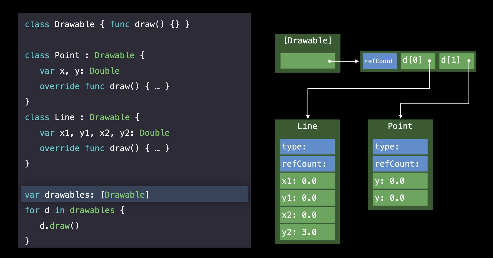
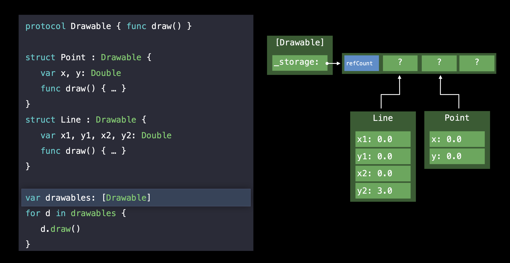
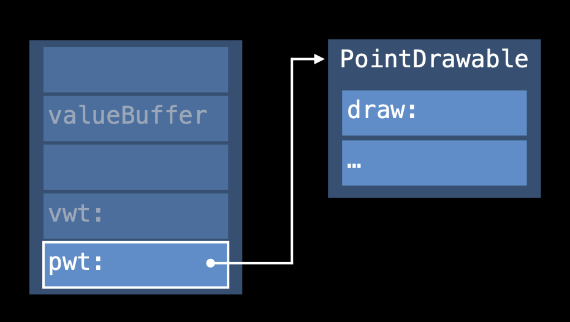
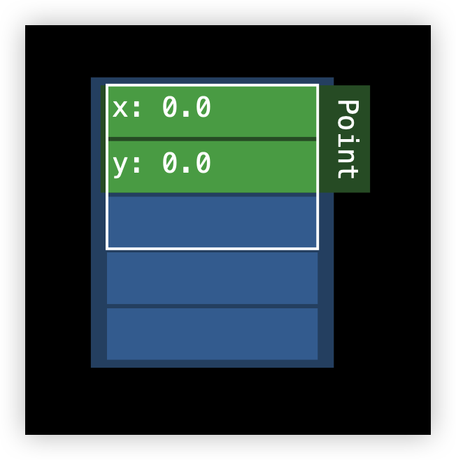
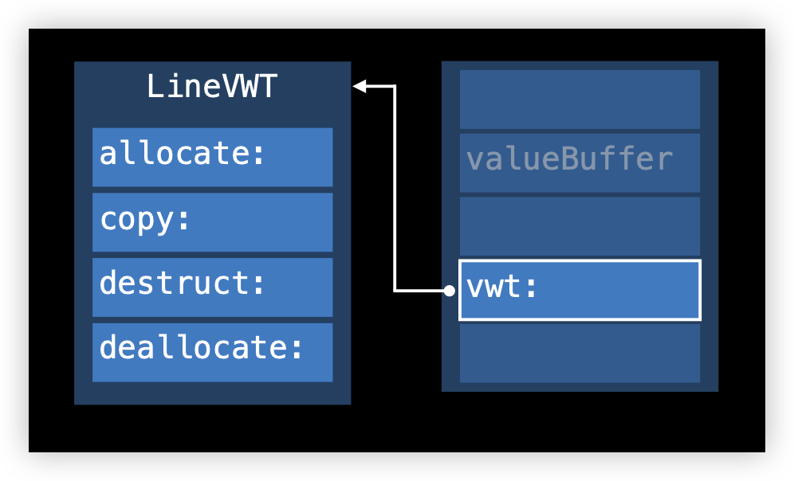
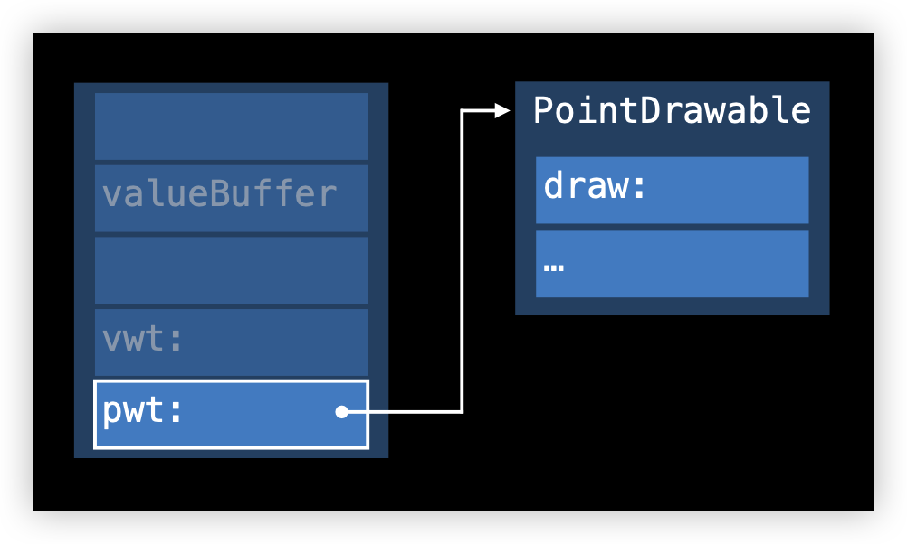

上一篇文章[Swift方法调用](https://github.com/pro648/tips/blob/master/sources/Swift方法调用.md)介绍了Swift的函数派发方式，Swift支持静态派发、虚表派发和消息机制三种派发方式。其中，虚表派发由Swift 面向对象的底层支持。这篇文章是我学习Swift面向协议编程（Protocol oriented programming，简写为POP）、泛型底层实现的记录。

下面两个函数有什么区别？

```
protocol Drivable {
    func drive()
    var numberOfWheels: Int { get }
}

func startTraveling(with transportation: Drivable) { }

func startTraveling<D: Drivable>(with transportation: D) { }
```

上述两个函数`startTraveling`的功能是一样的，没有做任何事情，但背后实现的原理是不同的。这篇文章将介绍其区别。

## 1. 协议类型 Protocol Type

#### 1.1 基于继承的多态 Inheritance-Based Polymorphism

先来看一下面向对象是如何实现多态的：

```
class Drawable {
    func draw() { }
}

class Point: Drawable {
    var x, y: Double
    
    override func draw() { }
    
    init(x: Double, y: Double) {
        self.x = x
        self.y = y
    }
}

class Line: Drawable {
    var x1, y1, x2, y2: Double
    
    override func draw() { }
    
    init(x1: Double, y1: Double, x2: Double, y2: Double) {
        self.x1 = x1
        self.y1 = y1
        self.x2 = x2
        self.y2 = y2
    }
}

let point = Point(x: 1, y: 2)
let line = Line(x1: 1, y1: 2, x2: 3, y2: 4)

var drawables: [Drawable] = [point, line]
for d in drawables {
    d.draw()
    
    print("Pointer size: \(MemoryLayout.size(ofValue: d))")
}
```

在上述代码中，`drawables`是元素类型为`Drawable`的数组，`Drawable`是引用类型，其子类`Point`、`Line`也是引用类型。因此，`drawable`数组元素都是指针、大小固定，数组内存布局也是固定的。



#### 1.2 面向协议的多态

下面看一下面向协议编程是如何多态的：

```
protocol Drawable {
    func draw()
}
struct Point : Drawable {
    var x, y: Double
    func draw() {
        
    }
}
struct Line : Drawable {
    var x1, y1, x2, y2: Double
    func draw() {
        
    }
}

class Square: Drawable {
    var width: Double
    func draw() {
        
    }
    init(width: Double) {
        self.width = width
    }
}

let point = Point(x: 1, y: 2)
let line = Line(x1: 1, y1: 2, x2: 3, y2: 4)
let square = Square(width: 1)

print("point size: \(MemoryLayout.size(ofValue: point))")
print("line size: \(MemoryLayout.size(ofValue: line))")
print("square size: \(MemoryLayout.size(ofValue: square))")

var drawables: [Drawable] = [point, line, square]
for d in drawables {
    d.draw()
    print("d size: \(MemoryLayout.size(ofValue: d))")
}
```

`Point`和`Line`都是值类型，`Square`是是引用类型，其都遵守协议`Drawable`。

运行时`drawables`数组内存布局会是什么样子呢？其可能是遵守协议的`struct`、`class`，类型不同，占用内存也会不同。

运行后打印如下：

```
point size: 16
line size: 32
square size: 8
d size: 40
d size: 40
d size: 40
```

可以看到`drawables`数组元素占用大小为40，`point`、`line`、`square`大小分别为：16、32、8。

`drawables`数组中元素是一种新的数据类型，类型是：Existential Container。



## 2. Existential Container

Existential Container用于管理遵守相同协议的类型，解决不同遵守者内存空间占用大小不同问题。

编译器生成的Existential container占用五个内存单元（也称为词，word），结构如下：

- 前三个内存单元是value buffer
- 第四个内存单元是value witness table的指针
- 最后一个内存单元是protocol witness table的指针



#### 2.1 Value Buffer

Value buffer占用3个词，存储的可能是值，也可能是指针。Smail value（存储空间小于等于24个字节）直接内联存储在value buffer中，large value则在堆区开辟内存，value buffer中只存储堆空间指针。




#### 2.2 Value Witness Table

遵守协议的具体类型可能有所不同，其内存布局也会不同。Value witness table对协议类型的生命周期进行管理，负责具体类型的初始化、拷贝、销毁。



#### 2.3 Protocol Witness Table

Value witness table管理协议类型生命周期，Protocol witness table负责协议类型的方法调用。面向对象编程中，基于继承关系的多态是通过virtual table实现的；面向协议编程中，没有继承关系，因此不能使用virtual table实现基于协议的多态，使用的是protocol witness table。



## 3. 泛型 Generic Type

泛型是Swift最强大的特性之一，可以增强代码的抽象能力，提升代码复用性。

#### 3.1 查看泛型内存

有以下generic结构体：

```
struct WrapperStruct<T> {
    let value: T
}
```

创建两个不同类型的泛型：

```
var v1 = WrapperStruct(value: 42)
var v2 = WrapperStruct(value: (42, 43))
```

使用[Mems](https://github.com/CoderMJLee/Mems)工具dump查看其内存：

```
print("Dump v1: \(Mems.memStr(ofVal: &v1))")
print("Dump v2: \(Mems.memStr(ofVal: &v2))")
```

打印如下：

```
Dump v1: 0x000000000000002a
Dump v2: 0x000000000000002a 0x000000000000002b
```

数据是连续排布的，没有padding。

如果结构体包含多个泛型呢：

```
struct WrapperStruct2<T, U> {
    let value1: T
    let value2: U
}

var v3 = WrapperStruct2(value1: 42, value2: 43)
var v4 = WrapperStruct2(value1: (42, 43), value2: 44)
var v5 = WrapperStruct2(value1: 42, value2: (43, 44))
```

dump查看内存如下：

```
Dump v3: 0x000000000000002a 0x000000000000002b
Dump v4: 0x000000000000002a 0x000000000000002b 0x000000000000002c
Dump v5: 0x000000000000002a 0x000000000000002b 0x000000000000002c
```

尽管编译时数据类型不同，但最后两个内存单元存储的数据是一样的，类型信息取决于如何读区数据。

`Class`类型泛型会因有动态派发、堆内存开辟而不同吗？如下所示：

```
class WrapperClass<T> {
    let value: T
    
    init(_ value: T) {
        self.value = value
    }
}

var v6 = WrapperClass(42)
var v7 = WrapperClass((42, 43))
```

内存数据如下：

```
Dump v6: 0x00000001b9054c28 0x0000000200000003 0x000000000000002a 0x0000000000000000
Dump v7: 0x00000001b9054db8 0x0000000200000003 0x000000000000002a 0x000000000000002b
```

`Class`类型的前八个字节是类型信息（isa），后八个字节是引用计数，再后面内存存储的是属性信息。可以看到尽管都是`WrapperClass`类的实例，但泛型实例的isa不同。最终，泛型特化后的类是一个单独的类。

泛型实例可能占用不同大小的内存，这是泛型的实现方式决定的。但给定的泛型占用内存大小是固定的，运行时不会发生变化。

> Protocol Type部分也可以通过dump内存数据进行分析。

#### 3.2 泛型IR代码

再看一个泛型的例子：

```
func drawACopy<T: Drawable>(local : T) {
    local.draw()
}

let line = Line()
drawACopy(local: line)

let point = Point()
drawACopy(local: point)
```

定义了一个泛型的函数，传入类型需遵守`Drawable`，传入了`Line`、`Point`两种类型的参数。那么泛型如何区分不同的参数类型，不同的类型又是如何管理内存。

参照[Swift方法调用](https://github.com/pro648/tips/blob/master/sources/Swift%E6%96%B9%E6%B3%95%E8%B0%83%E7%94%A8.md)，先使用以下命令

```
swiftc -emit-sil main.swift | xcrun swift-demangle > main.silgen
```

查看上述代码的SIL代码：

```
// main
sil @main : $@convention(c) (Int32, UnsafeMutablePointer<Optional<UnsafeMutablePointer<Int8>>>) -> Int32 {
bb0(%0 : $Int32, %1 : $UnsafeMutablePointer<Optional<UnsafeMutablePointer<Int8>>>):
  alloc_global @main.line : main.Line            // id: %2
  %3 = global_addr @main.line : main.Line : $*Line // users: %8, %7
  %4 = metatype $@thin Line.Type                  // user: %6
  // function_ref Line.init()
  %5 = function_ref @main.Line.init() -> main.Line : $@convention(method) (@thin Line.Type) -> Line // user: %6
  %6 = apply %5(%4) : $@convention(method) (@thin Line.Type) -> Line // user: %7
  store %6 to %3 : $*Line                         // id: %7
  %8 = load %3 : $*Line                           // user: %10
  %9 = alloc_stack $Line                          // users: %10, %13, %12
  store %8 to %9 : $*Line                         // id: %10
  // function_ref drawACopy<A>(local:)
  %11 = function_ref @main.drawACopy<A where A: main.Drawable>(local: A) -> () : $@convention(thin) <τ_0_0 where τ_0_0 : Drawable> (@in_guaranteed τ_0_0) -> () // user: %12
  %12 = apply %11<Line>(%9) : $@convention(thin) <τ_0_0 where τ_0_0 : Drawable> (@in_guaranteed τ_0_0) -> ()
  dealloc_stack %9 : $*Line                       // id: %13
  alloc_global @main.point : main.Point          // id: %14
  %15 = global_addr @main.point : main.Point : $*Point // users: %20, %19
  %16 = metatype $@thin Point.Type                // user: %18
  // function_ref Point.init()
  %17 = function_ref @main.Point.init() -> main.Point : $@convention(method) (@thin Point.Type) -> Point // user: %18
  %18 = apply %17(%16) : $@convention(method) (@thin Point.Type) -> Point // user: %19
  store %18 to %15 : $*Point                      // id: %19
  %20 = load %15 : $*Point                        // user: %22
  %21 = alloc_stack $Point                        // users: %22, %25, %24
  store %20 to %21 : $*Point                      // id: %22
  // function_ref drawACopy<A>(local:)
  %23 = function_ref @main.drawACopy<A where A: main.Drawable>(local: A) -> () : $@convention(thin) <τ_0_0 where τ_0_0 : Drawable> (@in_guaranteed τ_0_0) -> () // user: %24
  %24 = apply %23<Point>(%21) : $@convention(thin) <τ_0_0 where τ_0_0 : Drawable> (@in_guaranteed τ_0_0) -> ()
  dealloc_stack %21 : $*Point                     // id: %25
  %26 = integer_literal $Builtin.Int32, 0         // user: %27
  %27 = struct $Int32 (%26 : $Builtin.Int32)      // user: %28
  return %27 : $Int32                             // id: %28
} // end sil function 'main'
```

SIL中看不出泛型如何调用的，使用

```
swiftc -emit-ir main.swift | xcrun swift-demangle > main.ir
```

命令查看更底层的IR代码：

```
define i32 @main(i32 %0, i8** %1) #0 {
entry:
  %2 = bitcast i8** %1 to i8*
  call swiftcc void @"main.Line.init() -> main.Line"()
  call swiftcc void @"main.drawACopy<A where A: main.Drawable>(local: A) -> ()"(%swift.opaque* noalias nocapture undef, %swift.type* bitcast (i64* getelementptr inbounds (<{ i8**, i64, <{ i32, i32, i32, i32, i32, i32, i32 }>* }>, <{ i8**, i64, <{ i32, i32, i32, i32, i32, i32, i32 }>* }>* @"full type metadata for main.Line", i32 0, i32 1) to %swift.type*), i8** getelementptr inbounds ([2 x i8*], [2 x i8*]* @"protocol witness table for main.Line : main.Drawable in main", i32 0, i32 0))
  call swiftcc void @"main.Point.init() -> main.Point"()
  call swiftcc void @"main.drawACopy<A where A: main.Drawable>(local: A) -> ()"(%swift.opaque* noalias nocapture undef, %swift.type* bitcast (i64* getelementptr inbounds (<{ i8**, i64, <{ i32, i32, i32, i32, i32, i32, i32 }>* }>, <{ i8**, i64, <{ i32, i32, i32, i32, i32, i32, i32 }>* }>* @"full type metadata for main.Point", i32 0, i32 1) to %swift.type*), i8** getelementptr inbounds ([2 x i8*], [2 x i8*]* @"protocol witness table for main.Point : main.Drawable in main", i32 0, i32 0))
  ret i32 0
}
```

可以看到，调用时传入了`full type metadata for main.Line`和`full type metadata for main.Point`。

在IR代码中可以看到：

- 传入了metadata参数
- 从metadata获取value witness
- 进而获取到size、alignment、stride、destory、copy等

#### 3.3 泛型源码

对于泛型传入的不同类型，都可以通过metadata进行类型的确定和内存管理。下面通过[Swift源码](https://github.com/apple/swift)验证一下。

先在`metadata.h`中搜索`valueWitness`：

```
  const ValueWitnessTable *getValueWitnesses() const {
    return asFullMetadata(this)->ValueWitnesses;
  }

  const TypeLayout *getTypeLayout() const {
    return getValueWitnesses()->getTypeLayout();
  }

  void setValueWitnesses(const ValueWitnessTable *table) {
    asFullMetadata(this)->ValueWitnesses = table;
  }
  
  // Define forwarders for value witnesses. These invoke this metadata's value
  // witness table with itself as the 'self' parameter.
  #define WANT_ONLY_REQUIRED_VALUE_WITNESSES
  #define FUNCTION_VALUE_WITNESS(WITNESS, UPPER, RET_TYPE, PARAM_TYPES)    \
    template<typename...A>                                                 \
    _ResultOf<ValueWitnessTypes::WITNESS ## Unsigned>::type                            \
    vw_##WITNESS(A &&...args) const {                                      \
      return getValueWitnesses()->WITNESS(std::forward<A>(args)..., this); \
    }
  #define DATA_VALUE_WITNESS(LOWER, UPPER, TYPE)
  #include "swift/ABI/ValueWitness.def"

  unsigned vw_getEnumTag(const OpaqueValue *value) const {
    return getValueWitnesses()->_asEVWT()->getEnumTag(const_cast<OpaqueValue*>(value), this);
  }
  void vw_destructiveProjectEnumData(OpaqueValue *value) const {
    getValueWitnesses()->_asEVWT()->destructiveProjectEnumData(value, this);
  }
  void vw_destructiveInjectEnumTag(OpaqueValue *value, unsigned tag) const {
    getValueWitnesses()->_asEVWT()->destructiveInjectEnumTag(value, tag, this);
  }

  size_t vw_size() const {
    return getValueWitnesses()->getSize();
  }

  size_t vw_alignment() const {
    return getValueWitnesses()->getAlignment();
  }

  size_t vw_stride() const {
    return getValueWitnesses()->getStride();
  }
```

可以找到`getValueWitness`、`getTypeLayout`函数，以及`size`、`alignment`和`stride`的获取。

下面查看一下`ValueWitnessTable.h`源码：

```
template <typename Runtime> struct TargetValueWitnessTable;
using ValueWitnessTable = TargetValueWitnessTable<InProcess>;
```

可以看到`ValueWitnessTable`是`TargetValueWitnessTable`的别名。

`TargetValueWitnessTable`源码如下：

```
/// A value-witness table.  A value witness table is built around
/// the requirements of some specific type.  The information in
/// a value-witness table is intended to be sufficient to lay out
/// and manipulate values of an arbitrary type.
template <typename Runtime> struct TargetValueWitnessTable {
  // For the meaning of all of these witnesses, consult the comments
  // on their associated typedefs, above.

#define WANT_ONLY_REQUIRED_VALUE_WITNESSES
#define VALUE_WITNESS(LOWER_ID, UPPER_ID) \
  typename TargetValueWitnessTypes<Runtime>::LOWER_ID LOWER_ID;
#define FUNCTION_VALUE_WITNESS(LOWER_ID, UPPER_ID, RET, PARAMS) \
  typename TargetValueWitnessTypes<Runtime>::LOWER_ID LOWER_ID;

#include "swift/ABI/ValueWitness.def"

  using StoredSize = typename Runtime::StoredSize;

  /// Is the external type layout of this type incomplete?
  bool isIncomplete() const {
    return flags.isIncomplete();
  }

  /// Would values of a type with the given layout requirements be
  /// allocated inline?
  static bool isValueInline(bool isBitwiseTakable, StoredSize size,
                            StoredSize alignment) {
    return (isBitwiseTakable && size <= sizeof(TargetValueBuffer<Runtime>) &&
            alignment <= alignof(TargetValueBuffer<Runtime>));
  }

  /// Are values of this type allocated inline?
  bool isValueInline() const {
    return flags.isInlineStorage();
  }

  /// Is this type POD?
  bool isPOD() const {
    return flags.isPOD();
  }

  /// Is this type bitwise-takable?
  bool isBitwiseTakable() const {
    return flags.isBitwiseTakable();
  }

  /// Return the size of this type.  Unlike in C, this has not been
  /// padded up to the alignment; that value is maintained as
  /// 'stride'.
  StoredSize getSize() const {
    return size;
  }

  /// Return the stride of this type.  This is the size rounded up to
  /// be a multiple of the alignment.
  StoredSize getStride() const {
    return stride;
  }

  /// Return the alignment required by this type, in bytes.
  StoredSize getAlignment() const {
    return flags.getAlignment();
  }

  /// The alignment mask of this type.  An offset may be rounded up to
  /// the required alignment by adding this mask and masking by its
  /// bit-negation.
  ///
  /// For example, if the type needs to be 8-byte aligned, the value
  /// of this witness is 0x7.
  StoredSize getAlignmentMask() const {
    return flags.getAlignmentMask();
  }

  /// The number of extra inhabitants, that is, bit patterns that do not form
  /// valid values of the type, in this type's binary representation.
  unsigned getNumExtraInhabitants() const {
    return extraInhabitantCount;
  }

  /// Assert that this value witness table is an enum value witness table
  /// and return it as such.
  ///
  /// This has an awful name because it's supposed to be internal to
  /// this file.  Code outside this file should use LLVM's cast/dyn_cast.
  /// We don't want to use those here because we need to avoid accidentally
  /// introducing ABI dependencies on LLVM structures.
  const TargetEnumValueWitnessTable<Runtime> *_asEVWT() const;

  /// Get the type layout record within this value witness table.
  const TypeLayout *getTypeLayout() const {
    return reinterpret_cast<const TypeLayout *>(&size);
  }

  /// Check whether this metadata is complete.
  bool checkIsComplete() const;

  /// "Publish" the layout of this type to other threads.  All other stores
  /// to the value witness table (including its extended header) should have
  /// happened before this is called.
  void publishLayout(const TypeLayout &layout);
};
```

源码中可以看到很多从`flags`的取值，也有`size`、`stride`、`alignment`的定义。

泛型使用`VWT`管理内存，`VWT`由编译器生成，其存储了如何对该类型进行内存操作。

当泛型类型进行内存操作时，比如拷贝，最终会调用该泛型类型的`VWT`中的内存操作。不同泛型类型，对应不同的操作。

查看`destroy`和`retain`方法发现：

- 对于值类型，copy、move操作会进行内存拷贝，`destroy`操作不进行任何处理。
- 对于引用类型，copy后引用计数加一；move操作会拷贝指针，引用计数不变；`destroy`操作引用计数减一。

#### 3.4 泛型特化 Specialization of Generics

下面通过示例说明编译器对泛型的一个优化技术：泛型特化。

```
func min<T: Comparable>(x: T, y: T) -> T {
    return y < x ? y : x
}

let a: Int = 1
let b: Int = 2
min(a, b)
```

编译器编译时期可以推导出调用`min()`方法的类型。此时，编译器通过泛型特化，进行类型取代，生成如下方法：

```
func min<Int>(x: Int, y: Int) -> Int {
    return y < x ? y :x
}
```

泛型特化会为每种类型生成一个方法。为防止出现代码空间爆炸，编译器会进行代码内联进行优化，从而降低方法数量，提高性能。

想要进行泛型特化，必须满足以下条件：

- 调用方可以进行类型推导。
- 可以查看方法定义。

#### 3.5 全模块优化 Whole Module Optimization

编译器进行类型推导、查看方法定义是能够进行泛型特化的前提，如果调用方和类型是单独编译的，就无法进行类型推导，进而使用泛型特化。为了能够在编译期间提供完整的context，可以通过开启Whole Module Optimization实现。全模块优化是Swift编译器提供的优化机制，Xcode 8默认开启。

## 总结

本文介绍了协议类型、泛型、existential container的实现，基于protocol和generic的函数实现方式是不同的。泛型和编译技术强相关，希望通过这篇文章，能够更好理解协议类型、泛型、existential container。

最后，推荐观看WWDC2016中的Session416 [Understanding Swift Performance](https://developer.apple.com/videos/play/wwdc2016/416/)视频，其介绍了协议类型、泛型、编译优化等。

Demo名称：ProtocolAndGeneric  
源码地址：<https://github.com/pro648/BasicDemos-iOS/tree/master/ProtocolAndGeneric>

参考资料：

1. [Friday Q&A 2014-08-01: Exploring Swift Memory Layout, Part II](https://www.mikeash.com/pyblog/friday-qa-2014-08-01-exploring-swift-memory-layout-part-ii.html)

2. [Understanding Swift Performance](https://developer.apple.com/videos/play/wwdc2016/416/)

3. [Protocols, Generics, and Existential Containers — Wait What?](https://medium.com/@vhart/protocols-generics-and-existential-containers-wait-what-e2e698262ab1)

4. [Models of Generics and Metaprogramming: Go, Rust, Swift, D and More](https://thume.ca/2019/07/14/a-tour-of-metaprogramming-models-for-generics/)

5. [Default Protocol Implementation Inheritance Behaviour - The current situation and what/if anything should be done about it](https://forums.swift.org/t/default-protocol-implementation-inheritance-behaviour-the-current-situation-and-what-if-anything-should-be-done-about-it/28049)

6. [Swift — 泛型（Generics）](https://www.jianshu.com/p/e57a55267bd4)

7. [Swift 性能优化(2)——协议与泛型的实现](http://chuquan.me/2020/02/19/swift-performance-protocol-type-generic-type/)

8. [编程语言是如何实现泛型的](https://www.bmpi.dev/dev/deep-in-program-language/how-to-implement-generics/)

   
