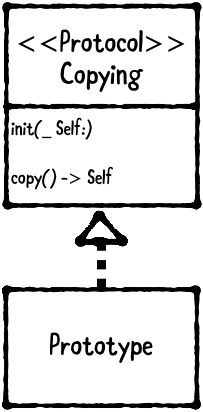

原型模式（Prototype Pattern）属于创建型模式，Prototype 允许我们远离从 client 创建新实例的复杂操作，而采用复制已有对象，被复制的实例就是我们所称的原型。由于从零创建对象可能包含昂贵的操作，复制对象可以节省资源和时间。在需要时可以修改新复制对象的属性。

Prototype pattern 包含以下两部分：



1. Copying：该协议声明了`copy()`方法。
2. Prototype：遵守`Copying`协议的 class。

复制分为浅复制（shallow copy）、深复制（deep copy）。

Shallow copy 创建对象时不复制其属性，任何引用类型的属性仍指向原始属性。例如，Swift 的`Array`是 struct 类型，当赋值或复制时，只创建新数组对象，并不会复制数组元素。

Deep copy 创建对象时会复制其所有属性。例如，深复制`Array`时，会同时复制其所有元素。Swift 默认不提供数组的深复制。这篇文章将涉及浅复制、深复制。

> 如果数组的元素仍然是数组，深复制只会复制一层，并不会把里层数组的元素进行复制。想要了解更多，可以查看我的另一篇文章：[深复制、浅复制、copy、mutableCopy](https://github.com/pro648/tips/wiki/%E6%B7%B1%E5%A4%8D%E5%88%B6%E3%80%81%E6%B5%85%E5%A4%8D%E5%88%B6%E3%80%81copy%E3%80%81mutableCopy)

## 何时使用 Prototype Pattern

Prototype pattern 能够使对象自我复制。

原型模式多用于创建复杂的或者耗时的实例。因为这种情况下，复制一个已经存在的实例使程序运行更高效，或者创建值相等，只是名称不一样的同类数据。

`Foundation`框架定义了`NSCopying`协议，但该协议是为 Objective-C 设计的，在 Swift 中效果不佳。虽然仍然可以使用`NSCopying`协议，但需要编写样板代码（boilerplate code）。

在这篇文章中将实现自己`Copying`协议，以此深入学习 prototype。

## 示例

这篇文章中将会创建`Copying`协议、Monster类，Monster类遵守`Copying`协议。创建`Copying.swift`文件并添加以下代码：

```
import Foundation

public protocol Copying: class {
    // 声明 required initializer
    init(_ prototype: Self)
}

extension Copying {
    // 通常不直接调用初始化器，而是调用 copy() 方法
    public func copy() -> Self {
        return type(of: self).init(self)
    }
}
```

首先，声明 required initializer 方法。由于该方法是利用已有实例创建新的实例，因此该方法也被称为 copy initializer。

其次，要复制已遵守`Copying`协议的实例时，通常不直接调用初始化器，而是调用`copy()`方法。因为已经在`Copying`协议内实现了 copy initializer，`copy()`方法将变得非常简单。通过`type(of: self)`方法获取当前对象类型，之后调用 copy initializer，并为 copy initializer 传入当前实例。因此，即使创建了遵守`Copying`协议类的子类，`copy()`方法也能正常运行。

创建`Monster.swift`文件，并添加以下代码：

```
import Foundation

public class Monster: Copying {
    public var health: Int
    public var level: Int
    
    public init(health: Int, level: Int) {
        self.health = health
        self.level = level
    }
    
    public required convenience init(_ monster: Monster) {
        self.init(health: monster.health, level: monster.level)
    }
}
```

为了遵守`Copying`协议，必须将`init(_ prototype:)`声明为 required。但是，同时可以将 designated initializer 标记为`convenience` 。

> 如果想要对数组实现深复制，可以使其元素遵守`Copying`协议，如下：
>
> ```
> extension Array where Element: Copying {
>     public func deepCopy() -> [Element] {
>         return map { $0.copy() }
>     }
> }
> ```
>
> 这样即可实现数组深复制。

创建`EyeballMonster.swift`文件，并添加以下代码：

```
import Foundation

// EyeballMonster 为 Monster 子类，同时添加了 redness 属性。
public class EyeballMonster: Monster {
    public var redness = 0
    
    // 在初始化方法为新增加的属性赋值
    public init(health: Int, level: Int, redness: Int) {
        self.redness = redness
        super.init(health: health, level: level)
    }
    
    public required convenience init(_ prototype: Monster) {
        let eyeballMonster = prototype as! EyeballMonster
        self.init(health: eyeballMonster.health,
                  level: eyeballMonster.level,
                  redness: eyeballMonster.redness)
    }
}
```

除实现`init(health:level:redness)`方法外，还需实现其他 required initializer。该 required initializer 行参为 Monster 类型，随后强转为 EyeballMonster。如果行参为 EyeballMonster 类型，则行参不能为 Monster 的其他子类。

在`ViewController.swift`文件中`ViewDidLoad`方法内添加以下代码：

```
    override func viewDidLoad() {
        super.viewDidLoad()
        // Do any additional setup after loading the view.
        
        // 创建 Monster 的实例，复制后得到 monster2
        let monster = Monster(health: 700, level: 37)
        let monster2 = monster.copy()
        print("Watch out! That monster's level is \(monster2.level)")
    }
```

控制台输出如下：

```
Watch out! That monster's level is 37
```

继续添加以下代码：

```
        // 创建 EyeballMonster 的实例，复制后得到 eyeball2
        let eyeball = EyeballMonster(health: 3002, level: 60, redness: 648)
        let eyeball2 = eyeball.copy()
        print("Eww! Its eyeball redness is \(eyeball2.redness)")
```

这里可以验证是否可以复制 EyeballMonster 对象，控制台输出如下：

```
Eww! Its eyeball redness is 648
```

如果想要从 Monster 创建 EyeballMonster 对象呢？添加以下代码：

```
        let eyeballMonster3 = EyeballMonster(monster)
```

此时，编译器没有报错。但在运行时会抛出异常。这是由于 prototype as! EyeballMonster 的强转导致。

注释掉该行强转代码后，编译器会提示`eyeballMonster`变量没有`redness`属性。事实上，应该禁止 Monster 的子类调用`init(_ monster:)`方法，而应调用`copy()`方法。

可以通过将`init(_ monster:)`方法标记为不可用，避免调用错误。

```
    @available (*, unavailable, message: "Call copy() instead")
    public required convenience init(_ prototype: Monster) {
        ...
    }
```

此时，编译器会在 eyeballMonster3 处出现以下提示：

```
'init(_:)' is unavailable: Call copy() instead
```

如上面示例所示，默认情况下，可以把超类实例传递给子类的 copy initializer。如果可以从超类实例完全初始化子类，则不会出现问题。如果子类添加了任何新属性，则无法从超类实例初始化。

为解决该问题，可以将子类 copy initializer 标记为 unavailable。此时，如果直接调用`init(_:)`方法，编译器会发出警告。虽然此时仍然能调用`copy()`，但通过将子类 copy initializer 标记为 unavailable 已经能够解决大部分情况。

如果此时仍然不能解决你的问题，就需要采取额外措施。例如，向控制台输出错误信息并抛出异常，为子类新添加的属性设置默认值等。

### 总结

以下是 Prototype Pattern 的关键点：

- Prototype pattern 允许对象复制自身，其包括两部分：`Copying`协议和原型（prototype）。
- `Copying`协议声明复制的方法，prototype 遵守`Copying`协议。
- `Foundation`框架提供`NSCopying`协议，但该协议在 Swift 中表现不佳。你可以轻松推出自己的`Copying`协议，而无需依赖`Foundation`或任何框架。
- 创建`Copying`协议的关键在于创建 copy initializer，并实现`init(_ prototype:)`方法。

Demo名称：PrototypePattern  
源码地址：<https://github.com/pro648/BasicDemos-iOS/tree/master/PrototypePattern>

参考资料：

1. [Prototype pattern in Swift](https://medium.com/jeremy-codes/prototype-pattern-in-swift-1b50517d1075)
2. [Prototype Design Pattern](https://www.geeksforgeeks.org/prototype-design-pattern/)

