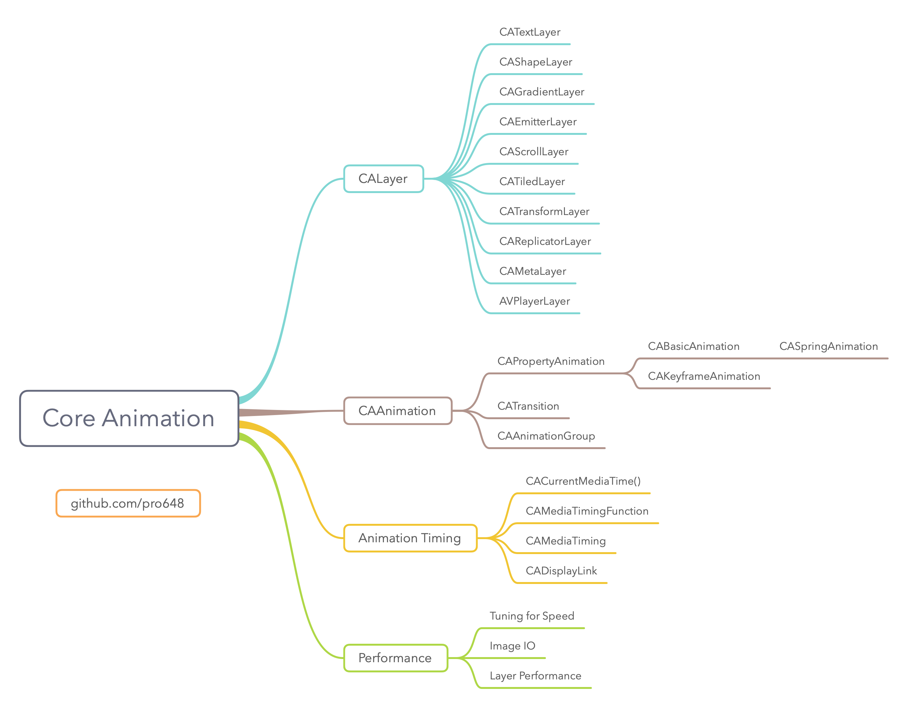
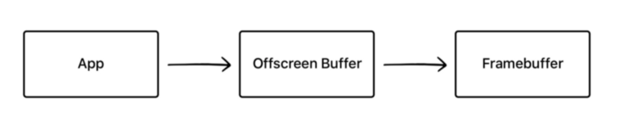
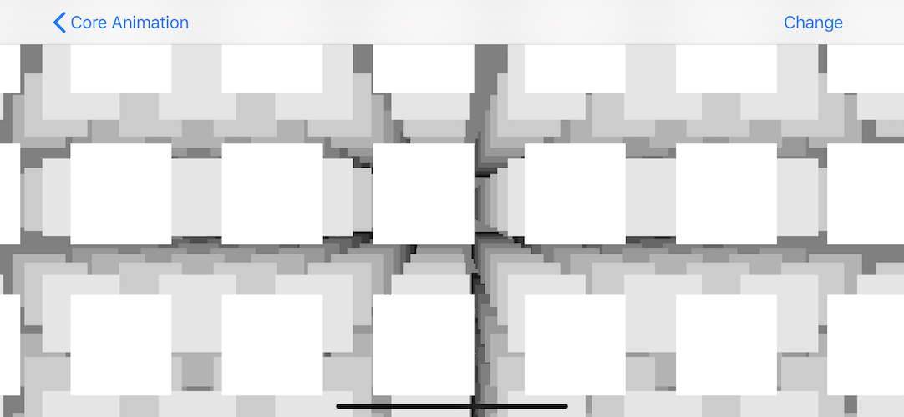
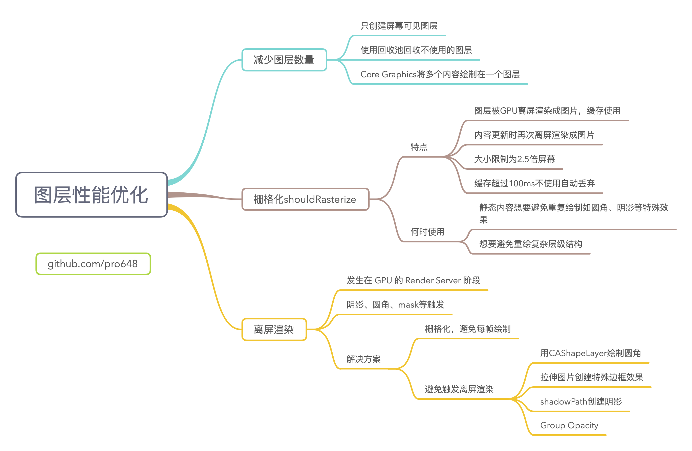

> 这是 Core Animation 的系列文章，介绍了 Core Animation 的用法，以及如何进行性能优化。
>
> 1. [CoreAnimation基本介绍](https://github.com/pro648/tips/blob/master/sources/CoreAnimation%E5%9F%BA%E6%9C%AC%E4%BB%8B%E7%BB%8D.md)
> 2. [CGAffineTransform和CATransform3D](https://github.com/pro648/tips/blob/master/sources/CGAffineTransform%E5%92%8CCATransform3D.md)
> 3. [CALayer及其各种子类](https://github.com/pro648/tips/blob/master/sources/CALayer%E5%8F%8A%E5%85%B6%E5%90%84%E7%A7%8D%E5%AD%90%E7%B1%BB.md)
> 4. [CAAnimation：属性动画CABasicAnimation、CAKeyframeAnimation以及过渡动画、动画组](https://github.com/pro648/tips/blob/master/sources/CAAnimation%EF%BC%9A%E5%B1%9E%E6%80%A7%E5%8A%A8%E7%94%BBCABasicAnimation%E3%80%81CAKeyframeAnimation%E4%BB%A5%E5%8F%8A%E8%BF%87%E6%B8%A1%E5%8A%A8%E7%94%BB%E3%80%81%E5%8A%A8%E7%94%BB%E7%BB%84.md)
> 5. [图层时间CAMediaTiming](https://github.com/pro648/tips/blob/master/sources/%E5%9B%BE%E5%B1%82%E6%97%B6%E9%97%B4CAMediaTiming.md)
> 6. [计时器CADisplayLink](https://github.com/pro648/tips/blob/master/sources/%E8%AE%A1%E6%97%B6%E5%99%A8CADisplayLink.md)
> 7. [影响动画性能的因素及如何使用 Instruments 检测](https://github.com/pro648/tips/blob/master/sources/%E5%BD%B1%E5%93%8D%E5%8A%A8%E7%94%BB%E6%80%A7%E8%83%BD%E7%9A%84%E5%9B%A0%E7%B4%A0%E5%8F%8A%E5%A6%82%E4%BD%95%E4%BD%BF%E7%94%A8%20Instruments%20%E6%A3%80%E6%B5%8B.md)
> 8. [图像IO之图片加载、解码，缓存](https://github.com/pro648/tips/blob/master/sources/%E5%9B%BE%E5%83%8FIO%E4%B9%8B%E5%9B%BE%E7%89%87%E5%8A%A0%E8%BD%BD%E3%80%81%E8%A7%A3%E7%A0%81%EF%BC%8C%E7%BC%93%E5%AD%98.md)
> 9. [图层性能之离屏渲染、栅格化、回收池](https://github.com/pro648/tips/blob/master/sources/%E5%9B%BE%E5%B1%82%E6%80%A7%E8%83%BD%E4%B9%8B%E7%A6%BB%E5%B1%8F%E6%B8%B2%E6%9F%93%E3%80%81%E6%A0%85%E6%A0%BC%E5%8C%96%E3%80%81%E5%9B%9E%E6%94%B6%E6%B1%A0.md)

上一篇文章[图像IO之图片加载、解码，缓存](https://github.com/pro648/tips/blob/master/sources/%E5%9B%BE%E5%83%8FIO%E4%B9%8B%E5%9B%BE%E7%89%87%E5%8A%A0%E8%BD%BD%E3%80%81%E8%A7%A3%E7%A0%81%EF%BC%8C%E7%BC%93%E5%AD%98.md)介绍了如何高效加载、绘制图片，避免影响帧率。这篇文章着重介绍图层树，以实现更好性能。

## 1. 隐式绘制 Inexplicit Drawing

图层的 backing image 可以使用 Core Graphics 绘制，或为`contents`属性赋值图片，或在离屏的`CGContext`提前渲染。之前的文章已经介绍过了这些场景的优化，但还可以通过以下三种方式优化：

- 修改图层属性。
- 使用特殊视图。
- 使用特定图层子类。

应当了解什么情况下使用何种方式，并尽可能避免使用软件绘制。

#### 1.1 栅格化 Rasterization

在之前的文章中，为了解决半透明图层重叠、复杂图层树的性能问题，已经使用过`CALayer`的`shouldRasterize`属性。`shouldRasterize`默认值为 false。

###### 1.1.1 性能特点

- 当被设置为 true 时，图层被 GPU 离屏渲染成图片，图片会被缓存并用来替换图层及其子图层。但首次使用时需时间来生成图片，并占用额外内存。
- 内容更新时，再次离屏渲染图片。
- 缓存大小被限制为2.5倍屏幕大小，
- 缓存超过100ms没有使用会被自动丢弃。

###### 1.1.2 用途

- 静态内容想要避免重复绘制特殊效果，例如圆角、阴影等。因为一旦内容发生变化（如 resize、动画），之前处理得到的缓存就失效了。如果频繁发生变化，就又回到了每一帧都需要离屏渲染的场景，缓存占用的内存只会让性能变得更糟。
- 想要避免重复绘制复杂层级结构。如果有很多子图层，或子图层有复杂显示效果，栅格化性能远高于每帧重绘。

使用 Debug > View Debugging > Rendering > Color Hits Green and Misses Red 检测是否使用了缓存图片。如果缓存的图片需要不断重新生成，该选项会使用红色标记重绘部分。

## 2. 离屏渲染 Offscreen Rendering

在屏幕中显示内容时，需一块至少与屏幕像素数据量一样大的 frame buffer，作为像素数据存储区域，而这也是 GPU 存储渲染结果的地方。如果因某些限制，无法把渲染结果直接写入 frame buffer，需先暂存到单独的一块内存区域，之后再写入 frame buffer，这个过程被称为*离屏渲染 Offscreen Rendering*。

渲染结果先经过了离屏 buffer，再到 frame buffer。如下图所示：



#### 2.1 CPU“离屏渲染”

如果在`UIView`中实现了`draw(_:)`方法，即使函数体内部没有任何代码，系统也会为其分配一块内存，等待 Core Graphics 可能的绘制操作。

Core Graphics、CoreText 的任何绘制方法，都会分配单独内存，不会直接绘制到 frame buffer。因为 CPU 不擅长渲染，我们就会认为需要尽量避免离屏渲染，但根据 Apple 工程师的[说法](https://lobste.rs/s/ckm4uw/performance_minded_take_on_ios_design#c_itdkfh)，CPU 渲染并非真正意义上的离屏渲染。开启 Xcode 中的 Color Offscreen-Rendered Yellow 后，使用`draw(_:)`绘制的区域并不会被标记为黄色，从另一方面也说明了 Xcode 也不认为这属于离屏渲染。

#### 2.2 画家算法

渲染工作主要由独立进程中的 render server 完成。对于每一层 layer，render server 会遵循画家算法，把各层按照深度排序，由深到浅依次输出到 frame buffer，后一次覆盖前一层。


上层会覆盖底层，被遮盖部分像素数据永久丢失。此时不能通过修改当前层的某一部分，让底下的层重新显示出来。

如果能在 frame buffer 之外另开启一块内存，把待处理的 layer 先画上去，然后在这块临时区里执行擦除、修改工作，处理完毕再写回到 frame buffer，得到最终结果。虽然这种方法需要额外空间，但得到了更大的灵活性。

#### 2.3 GPU 离屏渲染

上面提到的 frame buffer 之外的内存，称为离屏 buffer，整个过程就是离屏渲染。对于每一层 layer，我们肯定希望找到单次遍历就能完成渲染的算法，不然就需要申请一块离屏 buffer，借助临时中转区完成一些修改、剪切操作。单独开辟离屏 buffer 是一种很昂贵的操作。

离屏渲染并不意味着软件绘制，但一定是在离屏 context 由 CPU 或 GPU 渲染。以下图层属性会引起离屏渲染：

- `cornerRadius`和`masksToBounds`一起使用。
- `mask`。
- 阴影。

离屏渲染和开启光栅化有些像，但离屏渲染开销并没有光栅化那么大，子图层也不受影响，也不会缓存渲染结果，因此不会产生长期内存开销。太多图层离屏渲染会明显影响性能。

#### 2.4 避免离屏渲染方案

如果图层需要 offscreen rendering，且图层内容没有变化，可以开启光栅化优化图层性能；如果图层需要 offscreen rendering，且图层内容有变化，可以使用`CAShapeLayer`、`contentsCenter`或`shadowPath`实现相似效果，同时避免了离屏渲染。

###### 2.4.1 CAShapeLayer

`cornerRadius`和`masksToBounds`本身不会引起性能问题，只有一起使用时才会引起 offscreen rendering。

有时需要显示圆角矩形并裁减超出边界的子图层，但有时不需要裁减圆角，这时使用`CAShapeLayer`可以避免离屏渲染问题。

使用`UIBezierPath`的`init(roundedRect:byRoundingCorners:cornerRadii:)`创建左上角、右下角圆角的矩形：

```
        let blueLayer = CAShapeLayer()
        blueLayer.bounds = CGRect(x: 0, y: 0, width: 100, height: 100)
        blueLayer.fillColor = UIColor.blue.cgColor
        blueLayer.path = UIBezierPath(roundedRect: CGRect(x: 0, y: 0, width: 100, height: 100), byRoundingCorners: [.topLeft, .bottomRight], cornerRadii: CGSize(width: 10, height: 10)).cgPath
        view.layer.addSublayer(blueLayer)
```

###### 2.4.2 拉伸图片

另一种创建圆角矩形方式是使用圆角图片，赋值给`contents`属性，并结合`contentsCenter`创建可拉伸图片。理论上来说，这种方式渲染速度比`CAShapeLayer`速度快。一个可拉伸图片需要18个三角形（一个图片是由一个3\*3网格渲染而成），一条顺滑曲线需要很多三角形。

```
        let blueLayer = CAShapeLayer()
        blueLayer.bounds = CGRect(x: 0, y: 0, width: 200, height: 200)
        blueLayer.contentsCenter = CGRect(x: 0.5, y: 0.5, width: 0.0, height: 0.0)
        blueLayer.contentsScale = UIScreen.main.scale
        blueLayer.contents = UIImage(named: "Rounded")?.cgImage
        view.layer.addSublayer(blueLayer)
```

拉伸图片可以创建任意边框效果，而无需额外开销。

###### 2.4.3 shadowPath

如果图层是矩形或圆角矩形，不含部分透明、子图层，可以很简单的创建阴影路径，进而简化 Core Animation 绘制阴影的计算工作，也避免了离屏渲染。

如果阴影形状复杂，使用图片作为阴影性能可能更好。

###### 2.4.4 Group Opacity

`allowsGroupOpacity`属性是布尔类型，指示是否允许图层独立于父图层进行合成。

`allowsGroupOpacity`值为`true`、`opacity`值小于1.0时，图层可以独立于父图层进行合成，显示结果更逼真，特别是图层包含不透明组件时，但也更耗费性能。

默认从 bundle 的 Info.plist 文件读取`UIViewGroupOpacity`属性。如果没有读取到，则使用默认值 true。

当`opacity`小于1.0时，会触发离屏渲染。设置为 false 可以避免这一情况。

将一对红色、蓝色图层重叠在一起，设置父图层`opacity`为0.5，并复制一份作为对比。左侧开启 group opacity，右侧关闭。如下所示：

```
        let redLayer1 = CALayer()
        redLayer1.frame = CGRect(x: view.bounds.size.width / 2 - 130, y: 100, width: 100, height: 200)
        redLayer1.backgroundColor = UIColor.red.cgColor
        redLayer1.opacity = 0.5
        redLayer1.allowsGroupOpacity = true
        view.layer.addSublayer(redLayer1)
        
        let blueLayer1 = CALayer()
        blueLayer1.frame = CGRect(x: 0, y: 0, width: 50, height: 100)
        blueLayer1.backgroundColor = UIColor.blue.cgColor
        blueLayer1.opacity = 0.8
        redLayer1.addSublayer(blueLayer1)
        
        // 关闭 group opacity
        let redLayer2 = CALayer()
        redLayer2.frame = CGRect(x: view.bounds.size.width / 2 + 30, y: 100, width: 100, height: 200)
        redLayer2.backgroundColor = UIColor.red.cgColor
        redLayer2.opacity = 0.5
        redLayer2.allowsGroupOpacity = false
        view.layer.addSublayer(redLayer2)
        
        let blueLayer2 = CALayer()
        blueLayer2.frame = CGRect(x: 0, y: 0, width: 50, height: 100)
        blueLayer2.backgroundColor = UIColor.blue.cgColor
        blueLayer2.opacity = 0.8
        redLayer2.addSublayer(blueLayer2)
```

打开 Color Offscreen-Rendered Yellow 后如下：


可以看到左侧开启 group opacity 的图层进行了离屏渲染。

> 如果用不到 group opacity，永远设置为 false。

## 3. 混合和重绘

GPU 每帧可渲染像素数量是有限制的，称为 fill rate。如果由于图层重叠，导致同一位置重绘多次，可能导致掉帧。

GPU 不会绘制完全被其他图层覆盖的像素，但计算图层是否被覆盖会耗费处理器资源。只有在必要的时候才使用透明度。下面方案可以提高性能：

- 设置`backgroundColor`为固定、不透明颜色。
- 设置视图的`opaque`为 true。

图层不透明后，底层图层不会对显示效果有任何作用，避免了混合和重绘。

除非特别需要，应避免图片 alpha 透明度。如果图片显示在固定背景色、静态图之上，且背景色、静态图不会随 foreground 移动，应填充图片背景，避免运行时混合。

使用`UILabel`时，白色或其他纯色背景比透明背景更容易渲染。

通过使用`shouldRasterize`属性，可以把静态图层树压缩为一张图片，无需每帧时混合，避免混合、重绘的开销。

## 4. 减少图层数量

初始化、预处理、打包并使用 IPC 发送到 render server，及转换至 OpenGL/Metal 等都会产生开销，这些限制了屏幕可显示图层数量上限。

上限数量随硬件、图层类型、内容、属性而已，但一般图层数量达到成百上千后，即使图层没进行任何设置也会开始产生性能问题。

#### 4.1 3D 图层矩阵

对图层进行优化前，先确保屏幕上不显示的图层不要初始化、添加到屏幕中。图层可能由于以下原因不显示：

- 位于屏幕、父图层可见区域之外。
- 被其他不透明图层覆盖。
- 完全透明。

Core Animation 可以很好的处理不可见图层，但你的代码能更早（比如创建前）的解决此类问题，进而避免初始化、配置图层的开销。

下面代码创建了滑动的3D图层矩阵，图层只简单设置了颜色。

```
    let width = 10
    let height = 10
    let depth = 10
    let size = 100
    let spacing: CGFloat = 150
    let cameraDistance: CGFloat = 500.0
    
    var scrollView = UIScrollView()
    
    private func test3DMatrixLayer() {
        scrollView.frame = view.bounds
        scrollView.backgroundColor = .gray
        scrollView.contentSize = CGSize(width: spacing * CGFloat(width - 1), height: CGFloat(height - 1) * spacing)
        view.addSubview(scrollView)
        
        var transform = CATransform3DIdentity
        transform.m34 = -1.0 / cameraDistance
        scrollView.layer.sublayerTransform = transform
        
        // Create layers
        for z in 0...(depth-1) {
            for y in 0...height {
                for x in 0...width {
                    // Create layer
                    let layer = CALayer()
                    layer.frame = CGRect(x: 0, y: 0, width: size, height: size)
                    layer.position = CGPoint(x: CGFloat(x) * spacing, y: CGFloat(y) * spacing)
                    layer.zPosition = -CGFloat(z) * spacing
                    
                    // Set background color
                    layer.backgroundColor = UIColor(white: 1-CGFloat(z)*(1.0/CGFloat(depth)), alpha: 1.0).cgColor
                    
                    // Attach to scroll view
                    scrollView.layer.addSublayer(layer)
                }
            }
        }
        
        print("Displayed:\(depth * height * width)")
    }
```

效果如下：



width、height、depth常量控制图层数量。在这个demo中，有10\*10\*10=1000个图层，其中几百个可见。

如果增加width、height常量为100，即共十万个图层，app 性能会立即降下来。但屏幕中可见图层数量并未改变，也就是并未进行额外绘制工作，app 性能下降是由于初始化图层、计算图层位置导致。

> 由于图层是均匀分布在网格中，可以计算出当前显示的图层，也就没有必要初始化、计算不可见图层位置。`UITableView`和`UICollectionView`使用了类似机制，只初始化当前可见的 cell。此外，还会复用出队的cell。

#### 4.2 对象回收 Object Recycling

处理大量视图、图层时，可以通过对象回收减少性能消耗。`UITableViewCell`、`UICollectionViewCell`和`MKMapView`的图钉都用了回收机制。

Object recycling 的机制是创建一个相似对象池，当某个实例不再使用时，添加到回收池；当需要新实例时，从回收池取出，如果回收池没有实例，则直接创建。

使用回收池可以避免创建、销毁对象的开销，并且可以避免为相似实例重复赋值。

使用回收池重构 demo：

```
    let width = 100
    let height = 100
    let depth = 10
    let size: CGFloat = 100.0
    let spacing: CGFloat = 150.0
    let cameraDistance: CGFloat = 500.0
    
    var scrollView = UIScrollView()
    var recyclePool = NSMutableSet()
    
    override func viewWillLayoutSubviews() {
        updateLayers()
    }
    
    // 创建3D图层矩阵
    private func test3DMatrixLayer() {
        scrollView.frame = view.bounds
        scrollView.backgroundColor = .gray
        scrollView.contentSize = CGSize(width: spacing * CGFloat(width - 1), height: CGFloat(height - 1) * spacing)
        scrollView.delegate = self
        view.addSubview(scrollView)
        
        var transform = CATransform3DIdentity
        transform.m34 = -1.0 / cameraDistance
        scrollView.layer.sublayerTransform = transform
    }
    
    // MARK: - 循环使用已创建的图层
    
    private func perspective(_ z: CGFloat) -> CGFloat {
        return cameraDistance / (z + cameraDistance)
    }
    
    func updateLayers() {
        // Calculate clipping bounds
        var bounds = scrollView.bounds
        bounds.origin = scrollView.contentOffset
        bounds = bounds.insetBy(dx: -size/2, dy: -size/2)
        
        // Add existing layers to pool
        recyclePool.addObjects(from: scrollView.layer.sublayers ?? [])
        
        // Disable animation
        CATransaction.begin()
        CATransaction.setDisableActions(true)
        
        // Create layers
        var recycled = 0
        var visibleLayers = [CALayer]()
        for z in (0...(depth-1)).reversed() {
            // Increase bounds size to compensate for perspective
            var adjusted = bounds
            adjusted.size.width /= perspective(CGFloat(z)*spacing)
            adjusted.size.height /= perspective(CGFloat(z)*spacing)
            adjusted.origin.x -= (adjusted.size.height - bounds.size.width) / 2
            adjusted.origin.y -= (adjusted.size.height - bounds.size.height) / 2
            
            for y in 0...height {
                // Check if vertically outside visible rect
                
                if CGFloat(y) * spacing < adjusted.origin.y || CGFloat(y)*spacing >= adjusted.origin.y + adjusted.size.height {
                    continue
                }
                
                for x in 0...width {
                    // Check if horizontally outside visible rect
                    if CGFloat(x)*spacing < adjusted.origin.x || CGFloat(x) * spacing >= adjusted.origin.x + adjusted.size.width {
                        continue
                    }
                    
                    // Recycle layer if available
                    var layer = recyclePool.anyObject() as? CALayer
                    if layer != nil {
                        recycled += 1
                        recyclePool.remove(layer)
                    } else {
                        // Otherwise create a new one
                        layer = CALayer()
                        layer?.frame = CGRect(x: 0, y: 0, width: size, height: size)
                    }
                    
                    // Set position
                    layer?.position = CGPoint(x: CGFloat(x)*spacing, y: CGFloat(y)*spacing)
                    layer?.zPosition = -CGFloat(z)*spacing
                    
                    // Set background color
                    layer?.backgroundColor = UIColor(white: 1-CGFloat(z)*(1.0/CGFloat(depth)), alpha: 1).cgColor
                    
                    // Attach to scroll view
                    visibleLayers.append(layer!)
                }
            }
        }
        
        // Update layers
        scrollView.layer.sublayers = visibleLayers
        
        print("Displayed:\(visibleLayers.count)/\(depth*height*width)")
    }

extension LayerPerformanceViewController: UIScrollViewDelegate {
    func scrollViewDidScroll(_ scrollView: UIScrollView) {
        updateLayers()
    }
}
```

这个示例中只有一种类型图层对象，系统框架使用标志符区分不同回收池。

使用回收池之前，每次都初始化图层，无需使用`CATransaction`禁用动画。开启回收后，对象可能是被回收的，修改图层属性会触发隐式动画，因此需先禁用动画。

#### 4.3 Core Graphics 绘制

除了只创建屏幕中可见图层，还可以进一步减少图层数量。例如，如果使用了多个`UILabel`、`UIImageView`显示静态内容，可以使用`draw(_:)`将整个视图层级绘制到一个视图中。

虽然 GPU 渲染速度比 CPU 快，也无需占用额外内存。但当性能瓶颈是图层数量时，软件绘制通过减少初始化图层数量和图层树层级，也能够提高整体性能。

#### 4.4 render(in:)

虽然有时使用`draw(_:)`手动绘制内容可以提高性能，但要放弃`UIView`的很多便捷性，如 Interface Builder、Auto layout等。

幸运的是不是必须使用`draw(_:)`。当有大量图层时，只有图层添加到了图层树，才会被发送给 render tree，此时才会对渲染产生性能影响。

通过`CALayer`的`render(in:)`方法，可以将图层树绘制到 Core Graphics 的 context，并将结果作为图片输出。`shouldRasterize`栅格化图层时，图层必须添加到图层树中。使用`render(in:)`绘制时图层无需添加到图层树中。

使用`render(in:)`后，图层内容发生改变时需开发者进行处理，而`shouldRasterize`会自动缓存、检查缓存是否失效。但`render(in:)`生成图片后可以减少后续工作，Core Animaiton 无需维护复杂图层树。

## 总结



这篇文章介绍了使用 Core Animation 图层可能遇到的性能瓶颈，如离屏渲染、混合和重绘、图层数量太对。并提供了如下多种解决方案。

- `shouldRasterize`将图层渲染为一张图片，缓存起来使用。
- 使用`CAShapeLayer`、图片创建圆角。

- 使用`shadowPath`创建阴影。
- 尽可能不使用不透明图层。
- 只创建当前屏幕可见图层。
- 添加图层到回收池，避免不必要的创建、释放。
- 使用 Core Graphics 将复杂视图绘制到一个视图中。
- 使用`render(_:)`将图层树绘制为图片。

Demo名称：CoreAnimation  
源码地址：<https://github.com/pro648/BasicDemos-iOS/tree/master/CoreAnimation>

> 上一篇：[图像IO之图片加载、解码，缓存](https://github.com/pro648/tips/blob/master/sources/%E5%9B%BE%E5%83%8FIO%E4%B9%8B%E5%9B%BE%E7%89%87%E5%8A%A0%E8%BD%BD%E3%80%81%E8%A7%A3%E7%A0%81%EF%BC%8C%E7%BC%93%E5%AD%98.md)

参考资料：

1. [关于离屏渲染的深入研究](https://medium.com/@jasonyuh/%E5%85%B3%E4%BA%8E%E7%A6%BB%E5%B1%8F%E6%B8%B2%E6%9F%93%E7%9A%84%E6%B7%B1%E5%85%A5%E7%A0%94%E7%A9%B6-e776f56b3e60)
2. [Advanced Graphics and Animations for iOS Apps](https://devstreaming-cdn.apple.com/videos/wwdc/2014/419xxli6f60a6bs/419/419_advanced_graphics_and_animation_performance.pdf) Presentation Slides
3. [Advanced Graphics and Animations for iOS Apps](https://asciiwwdc.com/2014/sessions/419) Transcript
4. [How to make a UIView's subviews' alpha change according to it's parent's alpha?](https://stackoverflow.com/a/25170022)
5. [A Performance-minded take on iOS design](https://lobste.rs/s/ckm4uw/performance_minded_take_on_ios_design#c_itdkfh)

