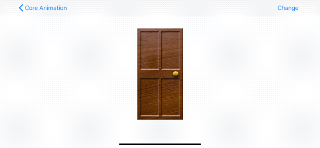
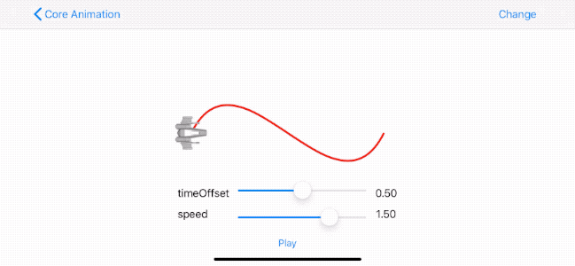
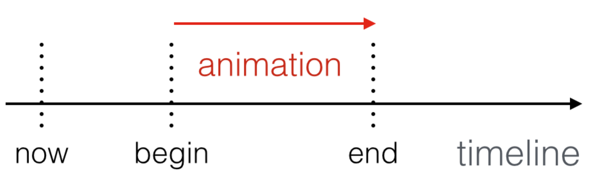
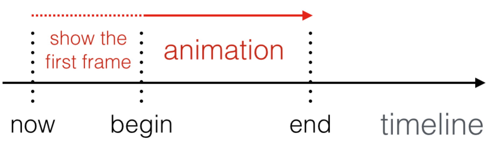
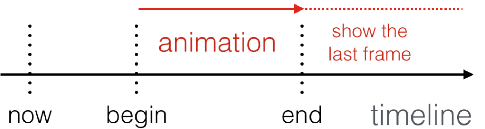
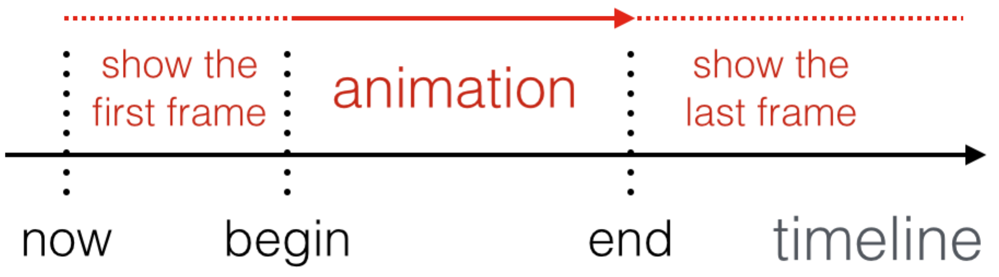

> 这是 Core Animation 的系列文章，介绍了 Core Animation 的用法，以及如何进行性能优化。
>
> 1. [CoreAnimation基本介绍](https://github.com/pro648/tips/blob/master/sources/CoreAnimation%E5%9F%BA%E6%9C%AC%E4%BB%8B%E7%BB%8D.md)
> 2. [CGAffineTransform和CATransform3D](https://github.com/pro648/tips/blob/master/sources/CGAffineTransform%E5%92%8CCATransform3D.md)
> 3. [CALayer及其各种子类](https://github.com/pro648/tips/blob/master/sources/CALayer%E5%8F%8A%E5%85%B6%E5%90%84%E7%A7%8D%E5%AD%90%E7%B1%BB.md)
> 4. [CAAnimation：属性动画CABasicAnimation、CAKeyframeAnimation以及过渡动画、动画组](https://github.com/pro648/tips/blob/master/sources/CAAnimation%EF%BC%9A%E5%B1%9E%E6%80%A7%E5%8A%A8%E7%94%BBCABasicAnimation%E3%80%81CAKeyframeAnimation%E4%BB%A5%E5%8F%8A%E8%BF%87%E6%B8%A1%E5%8A%A8%E7%94%BB%E3%80%81%E5%8A%A8%E7%94%BB%E7%BB%84.md)
> 5. [图层时间CAMediaTiming](https://github.com/pro648/tips/blob/master/sources/%E5%9B%BE%E5%B1%82%E6%97%B6%E9%97%B4CAMediaTiming.md)
> 6. [计时器CADisplayLink](https://github.com/pro648/tips/blob/master/sources/%E8%AE%A1%E6%97%B6%E5%99%A8CADisplayLink.md)
> 7. [影响动画性能的因素及如何使用 Instruments 检测](https://github.com/pro648/tips/blob/master/sources/%E5%BD%B1%E5%93%8D%E5%8A%A8%E7%94%BB%E6%80%A7%E8%83%BD%E7%9A%84%E5%9B%A0%E7%B4%A0%E5%8F%8A%E5%A6%82%E4%BD%95%E4%BD%BF%E7%94%A8%20Instruments%20%E6%A3%80%E6%B5%8B.md)
> 8. [图像IO之图片加载、解码，缓存](https://github.com/pro648/tips/blob/master/sources/%E5%9B%BE%E5%83%8FIO%E4%B9%8B%E5%9B%BE%E7%89%87%E5%8A%A0%E8%BD%BD%E3%80%81%E8%A7%A3%E7%A0%81%EF%BC%8C%E7%BC%93%E5%AD%98.md)
> 9. [图层性能之离屏渲染、栅格化、回收池](https://github.com/pro648/tips/blob/master/sources/%E5%9B%BE%E5%B1%82%E6%80%A7%E8%83%BD%E4%B9%8B%E7%A6%BB%E5%B1%8F%E6%B8%B2%E6%9F%93%E3%80%81%E6%A0%85%E6%A0%BC%E5%8C%96%E3%80%81%E5%9B%9E%E6%94%B6%E6%B1%A0.md)

上一篇文章介绍了使用`CAAnimation`及其子类创建多种类型动画。动画是一段时间的变化，因此时间也是一个至关重要的概念。这一篇文章介绍 Core Animation 中的时间。

## 1. CAMediaTiming 协议

`CAMediaTiming`协议定义了一系列属性，用于管理动画过程中的时间。`CALayer`和`CAAnimation`都遵守`CAMediaTiming`协议，因此，时间可以针对于图层，也可以针对于动画。

#### 1.1 常用属性

- `duration`：是`CFTimeInterval`类型，单位为秒，与`NSTimeInterval`类似。指定动画单次迭代时长。

- `repeatCount`：指定动画重复次数。如果`duration`为2秒，`repeatCount`为3.5次，则动画总时长为7秒。

  `duration`和`repeatCount`属性默认均为0，但不意味着动画时长0秒，播放0次，这里的0表示使用默认值，即0.25秒、1次。

- `repeatDuration`：指定循环时间，而非`repeatCount`的循环次数。
- `autoreverses`：如果为true，则向前播放后后退播放。默认为false。

#### 1.2 使用 repeatDuration 和 autoreverses 实现摆动动画

下面代码实现了无限摆动门的动画。其中，使用`autoreverses`实现自动反转摆动，设置`repeatDuration`为`infinity`实现永不停歇摆动。`repeatCount`和`repeatDuration`可能冲突，同时使用的结果可能是未定义的。

```
    private func swingingDoorUsingAutoreverse() {
        doorLayer.bounds = CGRect(x: 0, y: 0, width: 128, height: 256)
        // 设置锚点为layer左边缘中点
        doorLayer.anchorPoint = CGPoint(x: 0, y: 0.5)
        doorLayer.contents = UIImage(named: "Door")?.cgImage
        view.layer.addSublayer(doorLayer)
        
        // Apply perspective transform
        var perspective = CATransform3DIdentity
        perspective.m34 = -1.0 / 500.0
        view.layer.sublayerTransform = perspective
        
        // Apply swinging animation
        let animation = CABasicAnimation(keyPath: "transform.rotation.y")
        animation.toValue = -.pi/2.0
        animation.duration = 2.0
        animation.repeatDuration = .infinity
        animation.autoreverses = true
        doorLayer.add(animation, forKey: nil)
    }
```

效果如下：



#### 1.3 相对时间

Core Animation 中的时间是相对时间，每个动画有自身的时间概念，可以独立的加速、延时或偏移。

`beginTime`属性指定动画开始之前的延迟时间，动画起点从添加到可见图层开始计算。默认值为0，即添加到可见图层后动画立即开始。

`speed`是时间的倍数，默认为1.0。`speed`减小，动画、图层时间会变慢；`speed`增大，动画、图层时间会变快。如果`speed`为2.0，对于一个`duration`为1秒的动画，实际上0.5秒就会完成。如果为 layer 的`speed`是2.0，则所有添加到该 layer 的速度都会变为二倍。如果动画`speed`是3，layer 的`speed`是0.5，则动画是正常速度的1.5倍。

`timeOffset`指定时间偏移量。`beginTime`延迟动画开始时间，`timeOffset`快进到指定时间。例如，动画时长1秒，`timeOffset`为0.5秒意味着动画从0.5秒开始，执行到结束后再次从0秒执行到0.5秒。

与`beginTime`不同，`timeOffset`不受`speed`影响。例如，动画`duration`时间为1秒，设置`speed`为2.0、`timeOffset`为0.5，此时动画时长变为0.5秒。`timeOffset`让动画从结束位置开始，但仍然会播放一个完整的时长（这里时0.5秒），这个动画仅仅是从结尾开始播放，最终完成了一个循环。

使用下面的示例设置不同的`speed`、`timeOffset`，点击 Play 按钮查看播放效果：

```
    private func createShip() {
        // Create a path
        let centerX = view.bounds.size.width / 2
        let centerY = view.bounds.size.height / 2

        bezierPath.move(to: CGPoint(x: view.bounds.size.width / 2 - 150, y: centerY))
        bezierPath.addCurve(to: CGPoint(x: centerX + 150, y: centerY), controlPoint1: CGPoint(x: centerX - 75, y: centerY - 150), controlPoint2: CGPoint(x: centerX + 75, y: centerY + 150))
        
        // Draw the path using a CAShapeLayer
        let pathLayer = CAShapeLayer()
        pathLayer.path = bezierPath.cgPath
        pathLayer.fillColor = UIColor.clear.cgColor
        pathLayer.strokeColor = UIColor.red.cgColor
        pathLayer.lineWidth = 3.0
        view.layer.addSublayer(pathLayer)
        
        // Add the ship
        shipLayer.bounds = CGRect(x: 0, y: 0, width: 64, height: 64)
        shipLayer.position = CGPoint(x: centerX - 150, y: centerY)
        shipLayer.contents = UIImage(named: "Ship")?.cgImage
        view.layer.addSublayer(shipLayer)
        
        updateSliders()
    }
    
    @IBAction func updateSliders() {
        let timeOffset = timeOffsetSlide.value
        timeOffsetLabel.text = String(format: "%.2f", timeOffset)
        
        let speed = speedSlide.value
        speedLabel.text = String(format: "%.2f", speed)
    }
    
    @IBAction func playButtonTapped(_ sender: Any) {
        // Create the keyframe animation
        let animation = CAKeyframeAnimation(keyPath: "position")
        animation.timeOffset = CFTimeInterval(timeOffsetSlide.value)
        animation.speed = speedSlide.value
        animation.duration = 1.0
        animation.path = bezierPath.cgPath
        animation.rotationMode = .rotateAuto
        animation.isRemovedOnCompletion = true
        shipLayer.add(animation, forKey: nil)
    }
```

效果如下：



#### 1.4 fillMode

`fillMode`属性可以管理动画开始、结束时的表现。

###### 1.4.1 removed

`fillMode`默认值为`CAMediaTimingFillMode.removed`。如果设置了`beginTime`，动画从`beginTime`开始；如果没有设置，则立即开始。动画结束后移除动画。



###### 1.4.2 backwards

无论是否立即执行动画，`CAMediaTimingFillMode.backwards`都会展示动画的第一帧。



###### 1.4.3 forwards

`CAMediaTimingFillMode.forwards`像往常一样播放动画，但将动画的最后一帧保留到屏幕上，直到你移除动画。



###### 1.4.4 both

`CAMediaTimingFillMode.both`是`forwards`和`backwards`的组合，即立即显示动画的第一帧，动画结束后保留最后一帧。



> 如果想保留上一部分动画结束状态，可以设置动画为`forwards`，并设置`isRemovedOnCompletion`为 false。

那我们是否需要使用`fillMode`？是否应该移除动画？应如何更新图层以实现平滑动画？

最重要的一条原则就是：移除动画并尽可能避免使用`fillMode`，除非要实现的效果没有其他方式可以实现。`fillMode`会使UI元素失去交互性，并且图层与model不匹配。一般在添加动画后立即更新图层 model 即可。如果出现动画起始、终止时闪烁，可以尝试添加动画前更新 model。

## 2. 时间层级关系

在第一篇文章[CoreAnimation基本介绍](https://github.com/pro648/tips/blob/master/sources/CoreAnimation%E5%9F%BA%E6%9C%AC%E4%BB%8B%E7%BB%8D.md)中介绍了图层层级结构，动画时间也有类似结构。

每个动画、图层有自身时间概念。调整一个图层的时间会影响其自身及其子类的动画，但不会影响父图层。

#### 2.1 全局时间和本地时间

Core Animation 的全局时间也称为马赫时间（mach time），mach 是iOS、macOS系统内核名称。在同一设备的不同线程、进程中，mach time 相同；不同设备 mach time 不同。mach time 可以作为动画时间参照点。使用以下函数获取马赫时间：

```
        let machTime = CACurrentMediaTime()
```

`CACurrentMediaTime()`具体值无关紧要，真实作用在于为动画时间测量提供了一个相对值。`CACurrentMediaTime()`不能用于更新时钟时间。

每个`CALayer`、`CAAnimation`实例有自身时间概念，是根据父图层、动画层级中的`beginTime`、`timeOffset`和`speed`等属性计算出。就跟转换不同layer间坐标系统一样，`CALayer`也提供了转换不同图层之间的本地时间方法：

- `convertTime:fromLayer:`将 time interval 从指定 layer 转换为接收者时间空间。
- `convertTime:toLayer:`将 time interval 从接收者空间转换为指定 layer 时间空间。

想要同步多个具有不同`speed`、`timeOffset`或`beginTime`的图层时，上述方法会非常有效。

#### 2.1 暂停、回退和快进

动画`speed`被设置为零会暂停动画，但动画被添加到图层后不能修改，因此不能使用`speed`属性暂停运行中的动画。添加`CAAnimation`到 layer 时，复制一份不可变动画对象，因此修改原始动画对进行中的动画没有效果。使用`animation(forKey:)`可以获取进行中的动画，但不能修改获取的动画，修改该动画会导致无法预期的行为。

从图层移除进行中的动画，动画会急速返回动画之前的状态。在动画被移除前，复制 presentation layer 的属性，并赋值给 model layer，动画就会有看起来停止了的效果。

增大主window layer 的`speed`，可以加快整个应用动画速度，达到快进效果。设置`speed`为负值，可以达到回退效果。在模拟器中，勾选 Debug > Slow Animations 后可以开启慢动画，可以用于调试动画效果。

Demo名称：CoreAnimation  
源码地址：<https://github.com/pro648/BasicDemos-iOS/tree/master/CoreAnimation>

> 上一篇：[CAAnimation：属性动画CABasicAnimation、CAKeyframeAnimation以及过渡动画、动画组](https://github.com/pro648/tips/blob/master/sources/CAAnimation%EF%BC%9A%E5%B1%9E%E6%80%A7%E5%8A%A8%E7%94%BBCABasicAnimation%E3%80%81CAKeyframeAnimation%E4%BB%A5%E5%8F%8A%E8%BF%87%E6%B8%A1%E5%8A%A8%E7%94%BB%E3%80%81%E5%8A%A8%E7%94%BB%E7%BB%84.md)
>
> 下一篇：[计时器CADisplayLink](https://github.com/pro648/tips/blob/master/sources/%E8%AE%A1%E6%97%B6%E5%99%A8CADisplayLink.md)

参考资料：

1. [Controlling Animation Timing](http://ronnqvi.st/controlling-animation-timing)

   