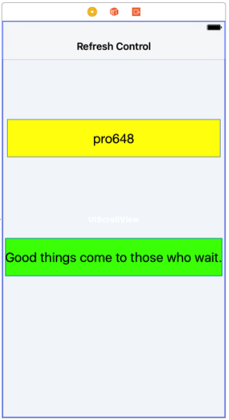
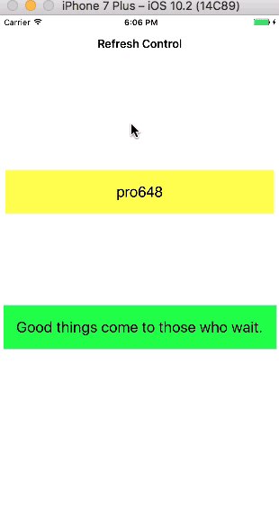

Apple在iOS 6中添加了`UIRefreshControl`，但只能在`UITableViewController`中使用，不能在`UIScrollView`和`UICollectionView`中使用。

## iOS 10 新特性

从iOS 10开始，`UIScrollView`增加了一个`refreshControl`属性，用于把配置好的`UIRefreshControl`赋值给该属性，这样`UIScrollView`就有了下拉刷新功能。和之前在`UITableViewController`中使用一样，不需要设置`UIRefreshControl`的`frame`，只需要配置`UIRefreshControl`。

因为`UITableView`和`UICollectionView`继承自`UIScrollView`，所以`UITableView`和`UICollectionView`也继承了`refreshControl`属性，也就是可以很方便的把刷新控件添加到滚动视图、集合视图和表视图（不再需要表视图控制器）。

> 截止目前，Xcode 8.2.1的*Interface Builder*还没有支持`refreshControl`属性，如果你需要在`UIScrollView`、`UITableView`和`UICollectionView`中使用`UIRefreshControl`只能通过代码添加。通过*Interface Builder*可以为`UITableViewController` 添加刷新控件。

## 滚动视图示例

这个demo使用*Single View Application*模板，打开*storyboard*，在系统创建的`ViewController`上添加一个`UIScrollView`，在`UIScrollView`上添加两个`UILabel`，并在`UILabel`上添加内容。想要实现的功能是，下拉刷新页面时隐藏第二个`UILabel`，再次刷新时显示该`UILabel`。



> 这里只对demo简单描述，如果需要查看详细代码，可以在[我的GitHub](https://github.com/pro648/BasicDemos-iOS/tree/master/RefreshControl)中查看。另外，文章底部也会提供源码地址。

## 创建刷新控件

在`UIScrollView`、`UITableView`和`UICollectionView`中创建刷新控件步骤是一样的。在这个示例中，在`ViewController`的`viewDidLoad`方法中创建并配置`UIRefreshControl`。`scrollView`是连接到*Interface Builder*中的`UIScrollView`的IBOutlet属性。

```
- (void)viewDidLoad
{
    [super viewDidLoad];
    
    // 1 先判断系统版本
    if ([NSProcessInfo.processInfo isOperatingSystemAtLeastVersion:(NSOperatingSystemVersion){10,0,0}])
    {
        // 2 初始化
        UIRefreshControl *refreshControl = [[UIRefreshControl alloc] init];
        
        // 3.1 配置刷新控件
        refreshControl.tintColor = [UIColor brownColor];
        NSDictionary *attributes = @{NSForegroundColorAttributeName : [UIColor redColor]};
        refreshControl.attributedTitle = [[NSAttributedString alloc] initWithString:@"Pull To Refresh" attributes:attributes];
        // 3.2 添加响应事件
        [refreshControl addTarget:self action:@selector(refresh:) forControlEvents:UIControlEventValueChanged];
        
        // 4 把创建的refreshControl赋值给scrollView的refreshControl属性
        self.scrollView.refreshControl = refreshControl;
    }
}
```

注意以下几点：

1. `UIScrollView`从iOS 10开始才有`refreshControl`属性，所以第一步判断当前系统版本。
2. 初始化刷新控件。`UIKit`会自动设置`frame`，不需要手动设定。
3. 3.1 配置刷新控件，可以通过`tintColor`设置进度滚轮指示器颜色，通过`attributedTitle`添加刷新时显示的提示文字。3.2 添加响应事件，当`UIControlEventValueChanged`事件发生时指定响应的动作。
4. 把上面创建、配置的`refreshControl`赋值给`scrollView`的`refreshControl`属性

现在实现动作方法。`available`是在interface部分声明的`BOOL`类型的对象。

```
- (void)refresh:(UIRefreshControl *)sender
{
    self.available = ! self.available;
    self.secondLabel.hidden = self.available;
    
    // 停止刷新
    [sender endRefreshing];
}
```

如果`secondLabel`目前显示，下拉后隐藏，如果目前隐藏，下拉后显示。最后使用`endRefreshing`停止刷新。



Demo名称：RefreshControl  
源码地址：<https://github.com/pro648/BasicDemos-iOS>

参考资料：

1. [Refresh Control Changes in iOS 10](https://useyourloaf.com/blog/refresh-control-changes-in-ios-10/)
2. [What's New in UICollectionView in iOS 10](https://developer.apple.com/videos/play/wwdc2016/219/)

