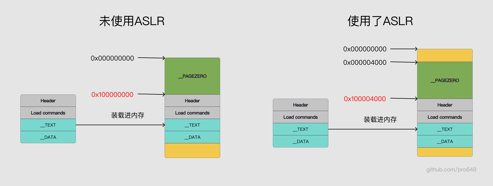

这篇文章将介绍地址空间布局随机化（Address Space layout Randomization，简写为ASLR），以及iOS内核如何为用户空间进程实现ASLR。

## 1. 什么是ASLR

地址空间布局随机化是一种针对缓冲区溢出的安全保护技术。通过对堆、栈、共享库映射等线性区布局的随机化，增加攻击者预测目的地址难度，防止攻击者直接定位攻击代码位置，进而达到阻止溢出攻击的一种技术。

目前，所有操作系统都支持了ASLR，iOS 4.3版本开始支持了ASLR，macOS 10.5为系统库增加了ASLR，macOS 10.7为所有app支持了ASLR。

ASLR通过给整个进程地址添加给定偏移量（offset，或slide），实现这种随机化。

下图是未使用ASLR和使用ASLR的对比：



未使用ASLR时，可执行文件虚拟内存地址为0x00，arm64位中代码段虚拟内存地址为0x100000000，非arm64代码段虚拟内存地址为0x4000。这样攻击者可以轻易计算出特定变量、函数的内存地址。

> Mach-O文件包含Header、Load commands、Data段，Data段包含`__TEXT`、`__DATA`和`__LINKEDIT`segment。如果你对Mach-O还不了解，可以查看我的另一篇文章：[Mach-O可执行文件](https://github.com/pro648/tips/blob/master/sources/Mach-O%E5%8F%AF%E6%89%A7%E8%A1%8C%E6%96%87%E4%BB%B6.md)

使用ASLR后，可执行文件虚拟内存地址为0x4000。每次app启动，都会随机产生偏移，并被添加到可执行文件整体偏移中。这里只是整体偏移，而非搅乱，所以，函数在内存中的相对位置并没有变化。

上图使用ASLR后，地址偏移随机值为0x4000，添加到`__PAGEZERO`段得到的是代码段地址：

0x100000000 + 0x4000 = 0x100004000

每次进程启动，都会随机产生一个偏移量，所以代码段的起始地址会发生变化。攻击者无法获取到特定变量、函数在内存中的地址。这就是ASLR的用途。

进程内整个地址空间都进行了偏移，并没有搅乱。变量、函数内存相对位置并没有改变。这意味着，如果单个变量、函数内存地址泄漏了，则可以轻松计算出进程内其它内容的地址，从而破坏掉ASLR的保护。

漏洞挖掘人员通常依靠内存信息泄漏，来击败ASLR。

## 2. iOS中的ASLR

iOS既为内核态，也为用户态进程实现了ASLR。

- 内核态ASLR：系统重启时，随机产生内核ASLR的偏移值。该值由iBoot引导过程中产生。

- 用户态ASLR：对于用户态的进程，每次进程启动都会产生随机的slide。每个进程都会拥有自己的随机值，该随机值由内核加载二进制过程中创建。

这篇文章只关注用户态的ASLR，特别是内核如何创建的该随机值。

iOS的内核是基于[XNU](https://opensource.apple.com/tarballs/xnu/)的，而XNU是开源的。因此，可以通过查看XNU源码分析iOS内核如何工作的。但iOS的内核并不是XNU直接编译的产物，Apple增加了特定于iOS的代码，且没有开源，但XNU源码一定程度上可以反应iOS内核如何工作的。

XNU源码中`bsd/kern/mach_loader.c`文件内的`load_machfile()`方法负责解析Mach-O可执行文件、创建任务、加载进内存。iOS每次运行app时，内核都会调用`load_machfile()`方法。

`load_machfile()`方法为进程创建了ASLR。`load_machfile()`创建`pmap`和`vm_map`后，就会创建ASLR slide：

```
load_machfile(
	struct image_params     *imgp,
	struct mach_header      *header,
	thread_t                thread,
	vm_map_t                *mapp,
	load_result_t           *result
	)
{
	...

	/*
	 * Compute a random offset for ASLR, and an independent random offset for dyld.
	 */
	if (!(imgp->ip_flags & IMGPF_DISABLE_ASLR)) {
		vm_map_get_max_aslr_slide_section(map, &aslr_section_offset, &aslr_section_size);
		aslr_section_offset = (random() % aslr_section_offset) * aslr_section_size;

		aslr_page_offset = random();
		aslr_page_offset %= vm_map_get_max_aslr_slide_pages(map);
		aslr_page_offset <<= vm_map_page_shift(map);

		dyld_aslr_page_offset = random();
		dyld_aslr_page_offset %= vm_map_get_max_loader_aslr_slide_pages(map);
		dyld_aslr_page_offset <<= vm_map_page_shift(map);

		aslr_page_offset += aslr_section_offset;
	}
```

事实上，其用相同的算法计算出了两个ASLR slide：一个用于进程，一个用于dyld。

1. 调用`random()`生成一个随机数。
2. 修剪随机数，使其不超过允许的最大值。在32位设备上，该值被缩减到一个字节；在64位设备上，被缩减到两个字节。
3. 根据host page大小，向左偏移缩减后的值。

最终得到的就是ASLR slide。示例如下：

1. `random()`产生随机数为`0x3910fb29`。
2. 假设当前是32位设备，`0x3910fb29`会被缩减为`0x29`。
3. `0x29`向左偏移`0x12`。

偏移后的ASLR slide为`0x29000`。

产生偏移值后，`load_machfile()`函数调用`parse_machfile()`函数。`parse_machfile()`函数将Mach-O的segment载进内存、执行代码签名相关工作，最终启动新创建的进程。

使用

```
$ xcrun clang -fpie main.c
```

命令编译以下代码，即可查看ASLR：

```
#include <stdio.h>
#include <string.h>

char *str = "HELLO ASLR";
int main() {
    printf("ptr %p\n", str);
    return 0;
}
```

运行编译后的Mach-O文件`a.out`:

```
$ ./a.out
ptr 0x1018daf9e
$ ./a.out
ptr 0x10c744f9e
$ ./a.out
ptr 0x10eaaff9e
```

`-fpie`标记开启address space layout randomization。事实上，64位设备强制开启了ASLR，即使添加禁用ASLR的标记`-fno-pie`也无法禁用ASLR。

可以看到，多次运行程序，静态`char`指针地址会发生变化。这是因为每次程序运行，都产生了新的随机值。

仔细观看，可以发现地址值最右侧三位并没有变化。结合内核产生随机值的源码，可以知道随机值永远是`0xXX000`。

在Xcode中运行代码，或使用Xcode提供的调试、诊断功能，都会禁用ASLR功能。因此，使用Xcode编译上述代码，调试过程中，其内存地址不会发生改变。

## 3. 函数地址

地址空间布局随机化后，函数内存地址计算方法如下：

VM Address = File Offset + ASLR Offset + __PageZero Size

常见的分析内存布局工具的内存地址都是未使用ASLR的，例如Hopper、IDA。

参考资料：

1. [ASLR & the iOS Kernel — How virtual address spaces are randomised](https://bellis1000.medium.com/aslr-the-ios-kernel-how-virtual-address-spaces-are-randomised-d76d14dc7ebb)
2. [Address Space Layout Randomization (ALSR) on macOS](https://stackoverflow.com/questions/59524144/address-space-layout-randomization-alsr-on-macos)

