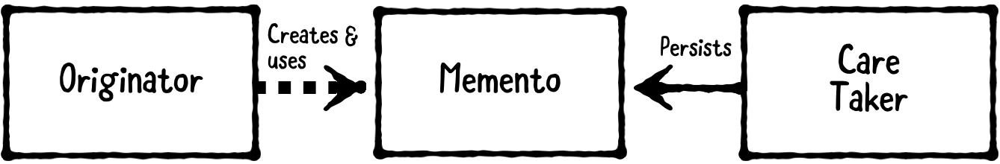

备忘录模式（memento pattern）用于保存对象历史状态，以便后续可以恢复至任一状态。Memento pattern 是二十三种著名的 Gof design patterns 设计模式之一，属于 Behavioral Patterns。Memento pattern 由 Noah Thompson 和 Dr.Drew Clinkenbeard 为惠普产品创建。

Memento pattern 有以下三个部分：



1. Originator：要保存或恢复的对象。
2. Memento：负责存储 originator 对象的内部状态。
3. CareTaker：请求 originator 保存对象，并得到 memento 响应。其负责持久化 memento，或把 memento 提供给 originator 以恢复到指定状态。

虽不是严格要求，但 iOS app 通常使用`Encoder`将 originator 的状态编码为 memento，使用`Decoder`解码 memento 还原给 originator。这允许编码、解码逻辑在 originator 之间复用。例如，`JSONEncoder`和`JSONDecoder`能够把对象编码为 JSON 格式数据，并解码还原。

## 1. Memento pattern 解决了哪些问题

- 对象的内部状态需要保存到外部，以便稍后可以将对象恢复至此状态。
- 不得违反对象的封装（encapsulation）。

问题在于已经封装好的对象，其数据结构隐藏在对象内部，并且不能从对象外部访问。

## 2. Memento pattern 提供了哪些解决方案

使用 originator 负责：

- 保存对象内部状态为 memento
- 使用之前保存的 memento 恢复为之前的状态

只有创建 memento 的 originator 才能够访问该 memento。CareTaker 可以向 originator 请求当前状态的 memento，也可以把 memento 传递给 originator 以便恢复到指定状态。这样就可以在不破坏其封装的前提下实现保存、恢复需求。

例如，可以使用 memento pattern 实现保存游戏进度。其中，originator 是游戏状态（如等级、健康状况、生命值等），memento 是保存的数据，caretaker 是游戏系统。

你也可以保存一个 memento 的数组，代表之前的游戏进度。这样也可以实现IDE或图形软件中的撤销、重做堆栈等功能。

## 3. Demo

在这个示例中将会创建一个简单的游戏系统。

#### 3.1 Originator

首先，定义 originator 部分。在 playground 添加以下代码：

```
import Foundation

// MARK: - Originator
public class Game: Codable {
    
    public class State: Codable {
        public var attempsRemaining: Int = 5
        public var level: Int = 1
        public var score: Int = 0
    }
    public var state = State()
    
    public func rackUpMassivePoints() {
        state.score += 8008
    }
    
    public func monstersEatPlayer() {
        state.attempsRemaining -= 1
    }
}
```

这里定义了一个`Game`对象，其内部状态记录了游戏属性、方法。同时，`Game`和`State`遵守`Codable`。

Apple 在 Swift 4 中增加了`Codable`。任何遵守`Codable`的对象都可以转换为外部存储，或从外部存储读取。本质上，它是一种可以自我保存、恢复的类型。这正是 originator 需要实现的。

由于`Game`和`State`的属性已经遵守`Codable`协议，编译器会自动生成所需协议方法。Swift 提供的`String`、`Int`、`Double`和大部分其他类型均已遵守`Codable`。

事实上，`Codable`是`Encodable`和`Decodable`的别名 typealias：

```
typealias Codable = Decodable & Encodable
```

可编码类型可以通过编码器编码为外部表示。外部表示的类型取决所使用的编码器。`Foundation`提供了几个默认的编码器，包括用于将对象转换为 JSON 格式的`JSONEncoder`。

可解码的类型可以通过解码器从外部表示转换。`Foundation`为解码器提供了解决方案，包括用于从 JSON 数据转换对象的`JSONDecoder`。

#### 3.2 Memento

下一步声明`Memento`，添加以下代码：

```
// MARK: - Memento
typealias GameMemento = Data
```

事实上，不需要声明上述类型。这里只是说明`GameMemento`是要保存的数据。这将由`Encoder`在保存时生成，并由`Decoder`在恢复时使用。

#### 3.3 CareTaker

接下来，需要声明`CareTaker`，如下所示：

```
// MARK: - CareTaker
public class GameSystem {
    public static let decoder = JSONDecoder()
    public static let encoder = JSONEncoder()
    
    // 1
    public static func save<T: Codable>(_ object: T, with title: String) throws {
        do {
            let url = createDocumentURL(withTitle: title)
            let data = try encoder.encode(object)
            try data.write(to: url, options: .atomic)
        } catch (let error) {
            dump(error)
            throw error
        }
    }
    
    // 2
    public static func retrieve<T: Codable>(_ type: T.Type, with title: String) throws -> T {
        let url = createDocumentURL(withTitle: title)
        return try retrieve(T.self, from: url)
    }
    
    public static func retrieve<T: Codable>(_ type: T.Type, from url: URL) throws -> T{
        do {
            let data = try Data(contentsOf: url)
            return try decoder.decode(T.self, from: data)
        } catch (let error) {
            dump(error)
            throw error
        }
    }
    
    public static func createDocumentURL(withTitle title: String) -> URL {
        let fileManager = FileManager.default
        let url = fileManager.urls(for: .documentDirectory, in: .userDomainMask).first!
        return url.appendingPathComponent(title).appendingPathExtension("json")
    }
}
```

1. `save(_:with title:)`封装了保存逻辑。首先，使用`JSONEncoder`编码传入的`game`参数。这一操作可能抛出异常，必须使用`try`关键字修饰。最后，把 data 以 title 名称保存到`.documentDirectory`目录。
2. `retrieve(_:from url:)`封装了恢复逻辑。首先，读取`.documentDirectory`目录中 title 文件，最后使用`JSONDecoder`恢复`Game`对象。读取、恢复任一操作失败，均会抛出异常；读取、恢复操作都成功时，返回恢复的`Game`对象。

#### 3.4 具体应用

在 playground 底部添加以下代码：

```
// MARK: - Example
var game = Game()
game.monstersEatPlayer()
game.rackUpMassivePoints()
```

这里模拟玩游戏，玩家被怪物吃掉后卷土重来，并获得大量积分。

添加以下代码：

```
// Save Game
try? GameSystem.save(game, with: "Best Game Ever")
```

这里玩家把当前进度保存，以便后续继续或者恢复。

当然，玩家仍然可以开始其他关卡游戏。如下所示：

```
// New Game
game = Game()
game.state.score = 200
dump(game)
```

这里创建了一个新的实例，输出`game`对象。控制台输出如下：

```
▿ __lldb_expr_3.Game #0
  ▿ state: __lldb_expr_3.Game.State #1
    - attempsRemaining: 5
    - level: 1
    - score: 200
```

玩家也可以恢复之前保存的`Game`，添加以下代码：

```
// Load Game
game = try! GameSystem.retrieve(Game.self, with: "Best Game Ever")
dump(game)
```

这里加载原来保存的`Game`，并输出`game`对象：

```
▿ __lldb_expr_3.Game #0
  ▿ state: __lldb_expr_3.Game.State #1
    - attempsRemaining: 4
    - level: 1
    - score: 8008
```

> 编码和解码都可能会触发异常，因此，添加、移除`Codable`属性时需要小心。如果解包时使用`try!`，在 app 没有此数据时会触发异常。为解决这个问题，应避免使用`try!`，只在确定存在时使用。

## 总结

以下是 Memento Design Pattern 的关键点：

- Memento pattern 允许保存和恢复对象。其涉及三部分：originator、memento、caretaker。
- Originator是要保存的对象，memento 是保存的状态，caretaker 保存、恢复memento对象。
-  iOS 提供的`Encoder`将 originator 的状态编码为 memento，使用`Decoder`解码 memento 还原给 originator。编码和解码逻辑在 originator 间复用。

Demo名称：MementoPattern  
源码地址：https://github.com/pro648/BasicDemos-iOS/tree/master/MementoPattern

参考资料：

1. [Memento pattern](https://en.wikipedia.org/wiki/Memento_pattern)
2. [Design-Patterns-In-Swift](https://github.com/ochococo/Design-Patterns-In-Swift/blob/master/source/behavioral/memento.swift)