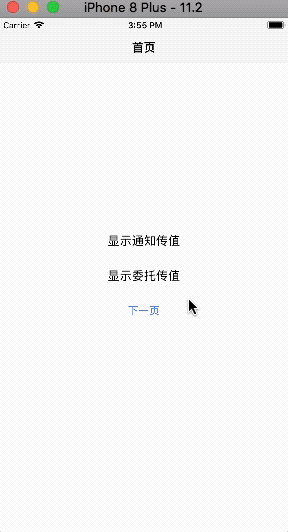

低耦合性是良好程序的特性。低耦合性程序可读性和可维护性比较好。Cocoa中的委托、通知功能可以使低耦合性更易实现，下面结合demo说明如何使用委托、通知进行传值，及委托与通知的区别。

## 1. 委托传值

委托传值在反向传值中使用。使用委托可以让委托和委托对象之间的关系变得清晰，特别是在委托的方法必须实现时。

委托传值步骤如下：

1.1 在`ChildViewController.h`声明协议，协议内方法默认必须实现。如果想选择实现，在方法前用`@optional`标志出来。

```
#import <UIKit/UIKit.h>

@protocol ChildVCDelegate <NSObject>

- (void)didReceiveText:(NSString *)string;

@optional
- (void)receiveTextFailedWithError:(NSError *)error;

@end
```

1.2 在`ChildViewController.h`接口部分创建一个`ChildVCDelegate`类型的实例变量。此时的特性应该使用`weak`，否则会造成循环引用。

```
#import <UIKit/UIKit.h>

@protocol ChildVCDelegate <NSObject>

- (void)didReceiveText:(NSString *)string;

@optional
- (void)receiveTextFailedWithError:(NSError *)error;

@end

@interface ChildViewController : UIViewController

@property (weak, nonatomic) id<ChildVCDelegate> delegate;

@end
```

1.3 在`RootViewController.m`中，使你的类遵守`ChildViewController.h`里声明的`ChildVCDelegate`协议。

```
#import "ViewController.h"
#import "ChildViewController.h"

@interface ViewController () <ChildVCDelegate>

@end
```

1.4 在`RootViewController.m`实现协议方法，将`ChildViewController`的代理委托给当前控制器。

```
@implementation ViewController

// 1
ChildViewController *childVC = [[ChildViewController alloc] init];
childVC.delegate = self;

- (void)didReceiveText:(NSString *)string
{
    
}
```
> 注释1后的代码需要添加到跳转到`ChildViewController`的方法内。如果使用纯代码编程，添加到`presentViewController: animated: completion: `或`showViewController: animated: `方法前；如果使用*storyboard*的*segue*跳转，添加到 `prepareForSegue: sender: `方法内，此时初始化视图控制器应该使用`SecViewController *secVC =segue.destinationViewController;`。
>

1.5 在`ChildViewController.m`实现部分，调用代理方法。为防止运行时出现问题，调用方法前要先判断代理是否实现了调用的方法。

```
// 在某方法内
if ([self.delegate respondsToSelector:@selector(didReceiveText:)])
    {
        [self.delegate didReceiveText:@"pro648"];
    }
```

## 2. 通知传值

`NSNotificationCenter`对象（简称通知中心）提供了广播信息的机制，`NSNotificationCenter`对象实质上是一个通知分发表。对象使用`addObserver: selector: name: object: `或`addObserverForName: object: queue: usingBlock: `方法向通知中心注册以接收通知，每次调用上面的方法都会指定一组通知。因此，对象可以通过多次调用这些方法注册为不同通知的观察者。

每一个运行的Cocoa程序都有一个默认通知中心，一般不需要自己创建。`NSNotificationCenter`对象只能在单个进程中传递通知。如果需要向其他进程发送通知，或从其他进程接收通知，请使用`NSDistributedNotificationCenter`。

### 2.1 添加观察者

要想接收通知，先要在通知中心注册观察者，注册时声明想要观察通知的名称。如果你是在为iPhone应用程序的视图控制器添加观察者，最好写在`viewDidLoad`方法中，这样可以确保视图控制器加载完成时只创建唯一一个观察者用以接收通知。添加观察者方法如下：

```
    [[NSNotificationCenter defaultCenter] addObserver:self
                                             selector:@selector(didReceiveText:)
                                                 name:@"DidReceiveNotification"
                                               object:nil];
```

观察者对象`self`是当前视图控制器，`selector`指明当视图控制器接收到通知时调用的方法，这个方法必须为无返回类型、带有一个参数。如下所示：

```
- (void)didReceiveText:(NSNotification *)notification
```

如果需要获取与通知一起发送的用户信息，可以从`NSNotification`对象中提取，如下：

```
- (void)didReceiveText:(NSNotification *)notification
{
    NSDictionary *userInfo = [notification userInfo];
    NSString *receivedText = [userInfo objectForKey:@"YOUR_KEY"];
    ...
}
```

### 2.2 发送通知

发送通知的方法很简单，如下所示：

```
    NSDictionary *userInfo = [NSDictionary dictionaryWithObject:@"YOUR_OBJECT" forKey:@"YOUR_KEY"];
    
    [[NSNotificationCenter defaultCenter] postNotificationName:@"DidReceiveNotification"
                                                        object:self
                                                      userInfo:userInfo];
```
通知名称一般为字符串常量，`object`可以是任何想要和通知一起发送的对象，但一般为`self`或`nil`，如果需要发送额外信息，可以使用可选的`userInfo`。如果不需要发送额外信息，可以直接把`userInfo`设置为`nil`，或使用`postNotificationName: object: `方法。

### 2.3 移除观察者

从OS X 10.11和iOS 9.0开始，`NSNotificationCenter`将不再向已被释放掉的观察者发送通知，通知中心对观察者是零引用（ zeroing weak reference）。因此，下一次通知中心想要向观察者发送通知时，会检测到观察者已不存在并为我们移除观察者，也就是不再需要手动移除观察者。需要注意的是，如果使用`addObserverForName: object: queue: usingBlock: `方法添加的观察者，或需要支持iOS 8 或更低版本，依旧需要移除观察者，移除方法如下：

```
- (void)dealloc
{
    [[NSNotificationCenter defaultCenter] removeObserver:self
                                                    name:@"DidReceiveNotification"
                                                  object:nil];
}
```

如果要移除所有观察者，可以直接使用`removeObserver: `方法。

## 3. 创建demo

这个demo整体思路是：有三个视图控制器，第一个视图控制器上有两个`UILabel`，一个名称为*下一页*`UIButton`，点击*下一页*按钮进入第二个视图控制器；第二个视图控制器上有一个`UILabel`，一个`UITextField`，两个`UIButton`，在`UITextField`输入文本后，点击*上一页*将`UITextField`的内容使用委托传值到第一个视图控制器并在`UILabel`显示，点击*下一页*进入第三个视图控制器；第三个视图控制器有一个`UITextField`和一个*上一页*按钮，在`UITextField`输入文本后点击*上一页*按钮，使用通知传值到前两个视图控制器，并显示到`UILabel`中。

如下面gif所示：



这里提供一个demo模版，在这个模板上添加代码进行传值练习。

模板名称：`Delegation&Notification模板`    
下载地址：<https://github.com/pro648/BasicDemos-iOS>

## 4. 使用委托传值

4.1 在`SecondViewController.h`接口前面声明协议，用来传值。

```
#import <UIKit/UIKit.h>

@protocol SendTextDelegate <NSObject>

- (void)sendText:(NSString *)string;

@end

@interface SecondViewController : UIViewController

@end
```

4.2 在`SecondViewController.h`中定义一个代理属性。

```
@interface SecondViewController : UIViewController

@property (weak, nonatomic) id<SendTextDelegate> delegate;

@end
```

4.3 在`SecondViewController.m`实现文件中，调用代理方法。这里在点击*上一页*按钮回到首页时调用代理方法，把`self.textField`的内容传给代理。传值前可以先判断代理是否实现了协议的方法，防止运行时出现问题。更新后的代码如下：

```
- (IBAction)backToVC:(UIButton *)sender
{
    // 判断是否实现了协议方法
    if ([self.delegate respondsToSelector:@selector(sendText:)])
    {
        // 代理实现了协议方法，传送TextField内文本给代理
        [self.delegate sendText:self.textField.text];
    }else
    {
        NSLog(@"代理没有实现协议方法，%d, %s",__LINE__, __PRETTY_FUNCTION__);
    }
    
    // 返回ViewController
    [self.navigationController popViewControllerAnimated:YES];
}
```

4.4 进入`ViewController.m`文件，声明遵守`SendTextDelegate`协议。在跳转到`SecondViewController`的方法中设置`SecondViewController`的代理为当前控制器。

```
@interface ViewController () <SendTextDelegate>

- (void)goToSecondVC:(UIButton *)sender
{
    // 跳转到SecondViewController
    SecondViewController *secVC = [[SecondViewController alloc] init];
    
    // 设置secVC的代理为当前控制器
    secVC.delegate = self;
    
    [self.navigationController pushViewController:secVC animated:YES];
}
```

4.5 在`ViewController.m`实现代理方法，并把传来的值显示到`self.deleLabel`中。

```
- (void)sendText:(NSString *)string
{
    self.deleLabel.text = string;
}
```

## 5. 使用通知传值

### 5.1 添加观察者

在`ViewController.m`和`SecondViewController.m`的`viewDidLoad`方法中添加观察者，*name*使用全局变量，接收到通知后，执行被调用的方法，把通知附带的字符串显示在*notiLabel*上。更新后的代码如下：

```
// ViewController.m
extern NSString *NotificationFromThirdVC;

@implementation ViewController

- (void)viewDidLoad {
    ...
    // 添加观察者
    [[NSNotificationCenter defaultCenter] addObserver:self
                                             selector:@selector(didReceiveNotificationMessage:)
                                                 name:NotificationFromThirdVC
                                               object:nil];
}

- (void)didReceiveNotificationMessage:(NSNotification *)notification
{
    if ([[notification name] isEqualToString:NotificationFromThirdVC])
    {
        // 把通知传送的字符串显示到notiLabel
        NSDictionary *dict = [notification userInfo];
        NSString *string = [dict objectForKey:@"TextField"];
        self.notiLabel.text = string;
    }
}

// SecondViewController.m中的代码与ViewController.m中的一样，你可以自己写。如果遇到问题，可以在文章尾部下载源码查看。
```

`SecondViewController.m` 中使用`addObserverForName:object:queue:usingBlock:`方法注册观察者。代码如下：

```
- (void)viewDidLoad
{
    ...
        // 添加观察者
    [[NSNotificationCenter defaultCenter] addObserverForName:NotificationFromThirdVC
                                                      object:nil
                                                       queue:nil
                                                  usingBlock:^(NSNotification * _Nonnull note) {
          if ([note.name isEqualToString:NotificationFromThirdVC]) {
              // 把通知传送的字符串显示到notiLabel。
              NSDictionary *userInfo = [note userInfo];
              self.notiLabel.text = [userInfo valueForKey:@"TextField"];
          }
                                                  }];
}
```


### 5.2 发送通知

首先在`ThirdViewController.m`实现部分前先声明通知名称为全局变量。

```
NSString *NotificationFromThirdVC = @"NotificationFromThirdVCTextField";
```

在`ThirdViewController.m`实现部分，在点击回到上一页按钮时发送通知，把`UITextField`中的字符串做为额外信息发送，更新后代码如下：

```
- (IBAction)backToSecVC:(UIButton *)sender
{
    // 发送通知
    NSString *string = self.textField.text;
    NSDictionary *userInfo = [NSDictionary dictionaryWithObject:string forKey:@"TextField"];
    [[NSNotificationCenter defaultCenter] postNotificationName:NotificationFromThirdVC
                                                        object:nil
                                                      userInfo:userInfo];
    
    // 返回SecondViewController
    [self.navigationController popViewControllerAnimated:YES];
}
```

### 5.3 移除观察者

在`ViewController.m`中添加观察者使用的是`addObserver: selector: name: object:`方法，模拟器是iOS 11，且不计划支持iOS 8或更低版本，`ViewController.m`中添加的观察者不需要移除。

`SecondViewController.m`中添加观察者使用的是`addObserverForName:object:forQueue:usingBlock:`方法，必须手动移除观察者。代码如下：

```
- (void)dealloc {
    // 移除观察者。
    [[NSNotificationCenter defaultCenter] removeObserver:self
                                                    name:NotificationFromThirdVC
                                                  object:nil];
}
```

> 使用通知中心传递信息时，一定要先实例化观察者，再发送通知。例如：*TabBar*上有*VC1*和*VC2*两个视图控制器，运行后先进入*VC1*，如果直接在*VC1*上发送通知，*VC2*上将不能接收到通知，因为此时*VC2*还没有运行，*VC2*的观察者还没有在通知中心注册，所以需要进入*VC1*后再点击进入*VC2*，之后再返回*VC1*发送通知，此时*VC2*就可以接收到通知。

现在，运行demo，如下所示：


## 总结

初看，通知是一种没有缺点的方式来减少类之间的依赖，你甚至不需要向你的类添加一个委托实例变量。现在再来看一下通知的缺点，当你发送通知时，通知中心会同步向所有在通知中心注册的观察者发送信息，直到所有观察者调用他们的注册方法后，发起通知的代码才会再次获得控制。值得注意的是，当你向多个观察者发送通知并且发送通知的代码需要等待完成某些操作时，只有当所有观察者方法被调用并执行完毕时，发送通知的代码才会再次获得控制（观察者方法以一些未指定的顺序一个接一个地调用）。为解决这个问题，一种方法是在不同线程上有额外通知中心，同时使用异步通知，`NSNotificationQueue`允许调用立即返回。这样在大多数情况下会额外增加代码的复杂性。另一种简便方法是使用`performSelector: withObject: afterDelay: `延迟处理通知。

```
- (void)didReceiveNotificationMessage:(NSNotification *)notification
{
    if ([[notification name] isEqualToString:NotificationFromThirdVC])
    {
        // 把通知传送的字符串显示到notiLabel
        NSDictionary *dict = [notification userInfo];
        NSString *string = [dict objectForKey:@"TextField"];
        
        // 延迟处理
        [self performSelector:@selector(DO_YOUR_REAL_WORK) withObject:string afterDelay:0.3];
    }
}
```

这样可以使发布通知的代码更快获得控制。此时观察者方法在同一线程执行。

通知是将信息传播到你无法接触到的多个对象的一种方法，因此，它可以用在视图控制器间传递数据，但一般来说，不要这样做。当你发送一个通知，你不知道哪一个对象会对此做出反应，如果遇到错误将难以追踪，别人维护你的代码也会变的更加困难。

`NSUserDefaults`是用来永久保存用户偏好设置，以便app下次启动时使用。任何保存在此位置的数据如没有明确删除会永远保存在这里。所以最好不要使用`NSUserDefaults`传值。

始终使用代理将信息传回其他控制器，内容视图控制器应该永远不需要知道源视图控制器的类或不是它创建的视图控制器。另外，如果你想获取对象属性的变化，最好使用[Key Value Observing](https://github.com/pro648/tips/wiki/KVC%E5%92%8CKVO%E5%AD%A6%E4%B9%A0%E7%AC%94%E8%AE%B0)。

> 在任何情况下，都不应该让视图控制器发送通知或委托消息。在多数情况下，视图控制器应该更改模型，然后模型通知观察者或委托它已被更改。

文件名称：Delegation&Notification   
源码地址：<https://github.com/pro648/BasicDemos-iOS>

参考资料：

1. [Delegation or Notification](http://useyourloaf.com/blog/delegation-or-notification/)

2. [Unregistering NSNotificationCenter Observers in iOS 9](http://useyourloaf.com/blog/unregistering-nsnotificationcenter-observers-in-ios-9/)

3. [How iOS View Controllers communicate with each other](http://matteomanferdini.com/how-ios-view-controllers-communicate-with-each-other/)

4. [NSNotification & NSNotificationCenter](http://nshipster.cn/nsnotification-and-nsnotificationcenter/)
