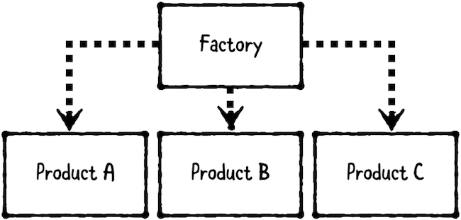

工厂模式（Factory Pattern）属于创建型模式（Creational Pattern），Factory pattern 提供了一种在不暴露创建逻辑的情况下创建对象的方法。包含以下两部分：



1. Factory：创建对象。
2. Products：被创建的对象。

从技术上讲，工厂模式分为简单工厂（Simple Factory）、抽象工厂（Abstract Factory）和其他。几种模式的共同目标是：将创建对象的逻辑封装到自身构造中。

## 1. 何时使用 factory pattern

当想要分离产品创建逻辑，而非让消费者（consumer）直接创建 product 时，使用工厂模式。

当您拥有一组相关对象（例如多态子类，或实现相同协议的多个对象）时，factory pattern 非常有用。例如，可以使用 factory pattern 检查网络响应，并将其转换为具体的 model。

当只有一种产品类型，且需要提供依赖或额外信息才能创建时，工厂模式也非常有用。例如，可以使用 factory pattern 创建一个自动回复求职者的邮件系统，factory pattern 根据候选人被录取、拒绝、邀请面试等状态来生成具体的邮件信息。

## 2. Simple Factory

这一部分将会使用 simple factory 创建一个回复求职者的邮件系统。

先声明`JobApplicant`和`Email`model，代码如下：

```
import Foundation

public struct JobApplicant {
    
    public let name: String
    public let email: String
    public var status: Status
    
    public enum Status {
        case new
        case interview
        case hired
        case rejected
    }
}

public struct Email {
    public let subject: String
    public let messageBody: String
    public let recipientEmail: String
    public let senderEmail: String
}
```

每位求职者有`name`、`email`和四种不同的求职状态。`Email`的`subject`和`messageBody`将根据求职状态而变。

添加以下工厂方法：

```
import Foundation

public struct EmailFactory {
    public let senderEmail: String
    
    public func createEmail(to recipient: JobApplicant) -> Email {
        let subject: String
        let messageBody: String
        
        switch recipient.status {
        case .new:
            subject = "We Received Your Application"
            messageBody = "Thanks for applying for a job here!" + "You should hear from us in 1-3 business days."
            
        case .interview:
            subject = "We Want to Interview You"
            messageBody = "Thanks for your resume,\(recipient.name)!" + "Can you come in for an interview in 30 minutes?"
            
        case .hired:
            subject = "We Want to Hire You"
            messageBody = "Congratulations, \(recipient.name)!" + "We liked your code, and you smelled nice." + "We want to offer you a position! Cha-ching! $$$"
            
        case .rejected:
            subject = "Thanks for Your Application"
            messageBody = "Thank you for applying,\(recipient.name)!" + "We have decided to move forward with other candidates." + "Please remeber to wear pants next time!"
        }
        
        return Email(subject: subject,
                     messageBody: messageBody,
                     recipientEmail: recipient.email,
                     senderEmail: senderEmail)
    }
}
```

在上面的代码中，先创建`EmailFactory` struct，并声明一个 public 属性`senderEmail`。在`EmailFactory`的初始化中会设置该属性。`createEmail(to recipient:)`函数接受一个`JobApplicant`实参，返回`Email`，在`createEmail(to recipient:)`函数内，添加 switch 枚举`status`，根据`status`不同生成不同`subject`和`messageBody`。

现在，邮件模版系统已经构建完成。是时候将该 factory pattern 用于未来的申请人了。添加以下代码：

```
        var pro648 = JobApplicant(name: "pro648",
                                   email: "pro648@example.com",
                                   status: .new)
        let emailFactory = EmailFactory(senderEmail: "about@example.com")
        
        print(emailFactory.createEmail(to: pro648), "\n")
        
        pro648.status = .interview
        print(emailFactory.createEmail(to: pro648), "\n")
        
        pro648.status = .hired
        print(emailFactory.createEmail(to: pro648), "\n")
```

这里创建了`JobApplicant`和`EmailFactory`，使用`emailFactory`实例生成 email。

## 3. Abstract Factory

这一部分将介绍 abstract factory。与简单工厂相比，抽象工厂处理更为复杂的情况。

假设我们要创建 Android 和 iOS 两种类型的按钮，我们先定义一个`AbstractGUIFactory`类，再定义具体的工厂类创建 Android 和 iOS 两种类型的按钮，具体的工厂类实现创建方法。如果需要创建其他类型控件（例如 alert），只需要在具体工厂类中添加创建方法即可。

声明`Button`协议：

```
protocol Button {
    func setTitle(_ title: String) -> Void
    func show() -> Void
}
```

定义`AndroidButton`和`iOSButton`两个类，该类遵守`Button`协议。

```
class AndroidButton: Button {
    private var title: String?
    
    func setTitle(_ title: String) {
        self.title = title
    }
    
    func show() {
        print("Showing Android style button. Title: \(title ?? "Default Title")")
    }
}


class iOSButton: Button {
    private var title: String?
    
    func setTitle(_ title: String) {
        self.title = title
    }
    
    func show() {
        print("Showing iOS style button. Title: \(title ?? "Default Title")")
    }
}
```

创建抽象工厂类`AbstractGUIFactory`，代码如下：

```
protocol AbstractGUIFactory {
    func createButton() -> Button
}
```

创建`AndroidFactory`和`iOSFactory`具体工厂类，如下所示：

```
class AndroidFactory: AbstractGUIFactory {
    func createButton() -> Button {
        return AndroidButton()
    }
}

class iOSFactory: AbstractGUIFactory {
    func createButton() -> Button {
        return iOSButton()
    }
}
```

最后，再创建一个`GUIBuilder`负责创建具体控件：

```
class GUIBuilder {
    private var style: Style
    private var guiFactory: AbstractGUIFactory?
    
    public enum Style {
        case iOS
        case Android
    }
    
    init(style: Style) {
        self.style = style
    }
    
    func initGUIFactory() -> Void {
        if nil != guiFactory {
            return
        }
        
        switch style {
        case .iOS:
            guiFactory = iOSFactory()
        case .Android:
            guiFactory = AndroidFactory()
        }
    }
    
    func buildButton() -> Button {
        initGUIFactory()
        return guiFactory!.createButton()
    }
}
```

下面，使用该工厂方法创建控件:

```
        let androidBuilder = GUIBuilder(style: .Android)
        
        let androidButton = androidBuilder.buildButton()
        androidButton.setTitle("Be together, Not the same.")
        androidButton.show()
        
        let iOSBuilder = GUIBuilder(style: .iOS)
        
        let iOSButton = iOSBuilder.buildButton()
        iOSButton.setTitle("Power is power.")
        iOSButton.show()
```

运行后输出如下：

```
Showing Android style button. Title: Be together, Not the same.
Showing iOS style button. Title: Power is power.
```

当我们想要创建其他控件时，只需要添加控件，在具体工厂方法中增加创建方法即可。例如，想要增加`AndroidAlert`和`iOSAlert`两种类型控件，只需声明两种类型控件，在具体工厂中添加创建方法即可。

```
protocol Alert {
    func setTitle(_ title: String) -> Void
    func show() -> Void
}

// AndroidAlert和iOSAlert均遵守Alert协议。
class AndroidAlert: Alert {
    private var title: String?
    
    func setTitle(_ title: String) {
        self.title = title
    }
    
    func show() {
        print("Showing Android style Alert. Title: \(title ?? "Default Title")")
    }
}

class iOSAlert: Alert {
    private var title: String?
    
    func setTitle(_ title: String) {
        self.title = title
    }
    
    func show() {
        print("Showing iOS style alert. Title: \(title ?? "Default Title")")
    }
}

class AndroidFactory: AbstractGUIFactory {
    ...
    
    // 增加创建 alert 方法
    func createAlert() -> Alert {
        return AndroidAlert()
    }
}

class iOSFactory: AbstractGUIFactory {
    ...
    
    // 增加创建 alert
    func createAlert() -> Alert {
        return iOSAlert()
    }
}

class GUIBuilder {
    ...
    
    // 增加创建alert
    func buildAlert() -> Alert {
        initGUIFactory()
        return guiFactory!.createAlert()
    }
}

        // 具体应用
        let androidAlert = androidBuilder.buildAlert()
        androidAlert.setTitle("github.com/pro648")
        androidAlert.show()
        
        let iOSAlert = iOSBuilder.buildAlert()
        iOSAlert.setTitle("Knowledge is power.")
        iOSAlert.show()
```

并不是所有多态对象都需要 factory pattern。如果对象非常简单，则始终可以将创建逻辑放到 consumer 中（例如，视图控制器）。

如果对象需要连续步骤来创建，[生成器模式（Builder Patter）](https://github.com/pro648/tips/wiki/%E7%94%9F%E6%88%90%E5%99%A8%E6%A8%A1%E5%BC%8F-Builder-Pattern)或许更为合适。

## 总结

以下是 factory design pattern 的关键点：

- Factory 的目标是将创建对象的逻辑隔离到自身构造中。
- 如果您拥有一组相关 product，或在提供更多信息前（例如，接收到 response，或用户输入内容）无法创建对象，则工厂模式非常有用。
- Factory design pattern 添加了一层抽象来创建对象，能够减少重复代码。

通过 factory pattern 可以再次减少视图控制器代码，遵守 Open/closed principle，降低耦合性。

> [工厂模式 Factory Pattern](https://github.com/pro648/tips/wiki/策略模式-Strategy-Pattern) 和 [策略模式 Strategy Pattern](https://github.com/pro648/tips/wiki/策略模式-Strategy-Pattern) 有些相似，区别如下：
>
> - Factory Pattern：是 creational pattern，用于创建特定类型对象。例如，创建狗、猫、老虎等不同类型动物。
> - Strategy Pattern：是 behavioral pattern，以特定方式执行操作。例如，执行走、跑，跳等动作。
>
> 工厂模式和策略模式可以组合使用。例如，有一个创建 business 对象的工厂模式，其根据持久化策略不同选择不同的工厂模式。如果数据保存到本地 XML ，使用 A 策略；如果数据保存到远程数据库，使用 B 策略。
>
> 最为重要的是了解使用设计模式的动机，否则就像在木工店里用锤子切割木材。也就是说，在不适当的上下文中使用设计模式就是在反设计模式，因此请确保了解设计模式的动机。

SimpleFactory 源码地址：<https://github.com/pro648/BasicDemos-iOS/tree/master/SimpleFactory>

AbstractFactory 源码地址：<https://github.com/pro648/BasicDemos-iOS/tree/master/AbstractFactory>

参考资料：

1. [Swift World: Design Patterns — Abstract Factory](https://medium.com/swiftworld/swift-world-design-patterns-abstract-factory-86f39dc7b63f)

2. [Swift simple factory design pattern](https://theswiftdev.com/2018/05/30/swift-simple-factory-design-pattern/)

3. [Design Patterns — Creational Patterns — Factory Pattern in Swift](https://medium.com/swift-programming/design-patterns-creational-patterns-factory-pattern-in-swift-d049af54235b)

4. [AbstractFactory](https://github.com/iamcrypticcoder/DesignPattern/tree/master/swift/AbstractFactory)

5. [What is the difference between Factory and Strategy patterns?](https://stackoverflow.com/questions/616796/what-is-the-difference-between-factory-and-strategy-patterns)

6. [Difference of Strategy Pattern with Factory Method?](https://coderanch.com/t/645933/engineering/Difference-Strategy-Pattern-Factory-Method)

   

