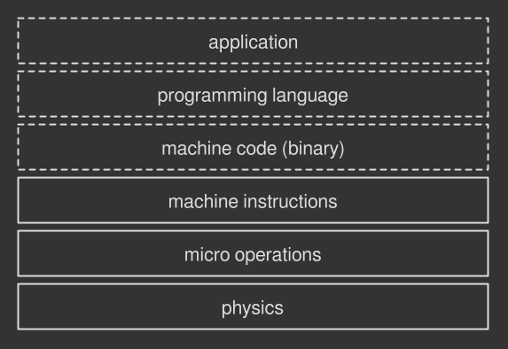
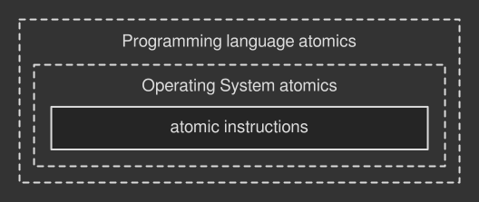
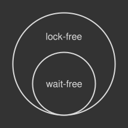

> 这是多线程、并发控制系列文章第三篇，本文内容主要来自[Lock-free multithreading with atomic operations](https://www.internalpointers.com/post/lock-free-multithreading-atomic-operations)，并做了部分补充。
>
> 1. [多线程简述](https://github.com/pro648/tips/wiki/%E5%A4%9A%E7%BA%BF%E7%A8%8B%E7%AE%80%E8%BF%B0)
> 2. [并发控制之线程同步](https://github.com/pro648/tips/wiki/%E5%B9%B6%E5%8F%91%E6%8E%A7%E5%88%B6%E4%B9%8B%E7%BA%BF%E7%A8%8B%E5%90%8C%E6%AD%A5)
> 3. [并发控制之无锁编程](https://github.com/pro648/tips/wiki/%E5%B9%B6%E5%8F%91%E6%8E%A7%E5%88%B6%E4%B9%8B%E6%97%A0%E9%94%81%E7%BC%96%E7%A8%8B)

希腊语中的 atom 表示不可分割，当任务不能再被分割为更小操作时，称为原子的。

原子性是多线程操作中的一个重要属性。由于其不可分割，一个线程执行操作时，其他线程无法进入。例如，当一个线程向共享数据原子写入时，其他线程无法读取到修改一半的数据。相反，当线程以原子方式从共享数据中读取时，将读取到该值在此刻的值。原子性操作不会产生数据竞争风险。

上一篇文章[并发控制之线程同步](https://github.com/pro648/tips/wiki/%E5%B9%B6%E5%8F%91%E6%8E%A7%E5%88%B6%E4%B9%8B%E7%BA%BF%E7%A8%8B%E5%90%8C%E6%AD%A5)介绍了一种常用线程同步工具 synchronization primitive。其与其他工具组合，以提供多线程间共享数据的原子性操作。其仅允许单个线程进入并发任务，其他线程被操作系统休眠，直到第一个线程完成。这种机制被称为堵塞机制。

Blocking mechanism 可以解决大部分问题，快速、可靠，但也存在以下问题：

1. 堵塞线程。休眠的线程不做任何工作，只等待唤醒信号，会浪费宝贵的时间。
2. 挂起应用。持有 synchronization primitive 的线程崩溃会导致该线程永远不能释放，进而等待线程永远等待。
3. 不能控制线程优先级。通常操作系统决定休眠哪个线程，可能导致 priority inversion。即拥有高优先级的线程被低优先级线程抢先。

通常我们不关心这些问题，因为其不会影响程序的正确性。但有时要让所有线程均运行，以充分利用多处理器、多核硬件；或优先级反转太危险，无法忽略。

## 1. 无锁编程 Lock-free Programming

无锁编程（lock-free programming，也称为 lockless programming）可以避免上面提到的1、2、3三个问题，它是一种在多个线程之间安全的共享数据，而无需锁定、解锁的技术。

Lock-free programming 比 synchronization 更为底层、更具有挑战性，但也可以让我们更好的了解计算机的工作方式。

Lock-free programming 依赖原子指令（atomic instruction），原子指令直接由 CPU 执行。原子指令是 lock-free programming 的基础，这篇文章将先介绍原子指令，后介绍如何使用原子指令进行并发控制。

## 2. 原子指令 Atomic Instruction

想一想计算机执行的操作，如屏幕上显示的图片。此类操作由许多小操作组成：读取文件到内存、解码图片、点亮屏幕上的像素等。如果递归地放大这些小任务，也就是将其分解为越来越小的部分，最终将进入不可分割状态。由处理器执行的最小人类可见操作称为机器指令（machine instruction），即直接由硬件执行的命令。



上图中的虚线表示软件，实线表示硬件。

根据 CPU 架构，有些机器指令是原子的（即不可分割、不可打断），有些机器指令不是原子的（处理器在后台执行更多任务，被称为[micro-operation](https://en.wikipedia.org/wiki/Micro-operation)），这篇文章只关注第一种机器指令。Atomic instruction 可以被分为两类：load-store 和 read-modify-write。

#### 2.1 Load-store Atomic Instruction

任何处理器的基础都是：从内存中读取（load）、写入（store）数据。在某些情况下，很多 CPU 架构都能保证这些操作是原子的。例如，x86 架构的处理器支持`MOV`指令，`MOV`指令从内存读取数据，并提供给 CPU。如果读取的数据是[对齐](https://www.ibm.com/support/knowledgecenter/en/SSUFAU_1.0.0/com.ibm.ent.pl1.zos.doc/lr/alnmnt.html)的，则操作是原子的。

#### 2.2 Read-modify-write（RMW）Atomic Instruction

Load-store 不能满足一些复杂操作需求。例如，改变内存中变量的值至少需要三个原子操作，从而使整个操作非原子。Read-modify-write 指令填补了中间空白，使其能够在一个原子操作中进行多个计算。此类中有许多指令，有些 CPU 架构全部实现了这些指令，有些则仅支持其中一部分。

以下是部分指令：

- 检查并设置 test-and-set：将1写入内存区域，并在单个原子步骤中返回原来值。
- Fetch-and-add：对内存位置执行增1操作，并在单个原子步骤返回原来值。
- 比较并交换 compare and swap：简称 CAS，将内存中的值与指定数据进行比较，当数值一样时将内存中的数据替换为新的数据。

上述指令在一个原子步骤中就可以在内存中执行多种操作。这是一个重要的属性，它使 read-modify-write 指令适用于无锁多线程操作。

## 3. 原子指令的三种层级

前面提到的指令都是硬件层级的，需要直接与 CPU 通讯，这种方式显然会使工作变得困难、不可移植，因为不同硬件可能有不同指令名称，甚至有些硬件不支持某些指令。除非正在编写特别底层的代码，否则不太需要直接操控硬件。

在软件层面，许多操作系统提供了自己的原子指令，这样就可以从硬件层面抽离出来。例如，Windows 通过[Interlocked API](https://docs.microsoft.com/en-us/windows/win32/sync/interlocked-variable-access)提供了一组处理变量的原子指令，macOS 通过[OSAtomic.h](https://developer.apple.com/documentation/kernel/osatomic_h?language=objc)头文件提供了同样指令。这样可以脱离具体硬件，但仍受限于系统环境。

执行可移植原子操作的最佳方法是依赖编程语言提供的指令。例如，Java 提供了`java.util.concurrent.atomic`包，C++ 提供了`std::atomic`头文件，Haskell 提供了`Data.Atomics`包。通常，编程语言均支持多线程原子操作。最终，编译器（如果是编译语言）或虚拟机（如果是解释语言）决定选择操作系统 API 或直接调用硬件指令。



上图中的实线表示硬件，虚线表示软件。

GCC（一种C++编译器）通常将 C++ 原子操作和对象直接转换为机器指令。如果指令不能映射到硬件支持的指令，它还会尝试转换为特定操作。即使遇到不支持原子操作的平台，也可以采用堵塞机制。

## 4. 在多线程中使用原子操作

现在看一下如何使用原子操作。考虑修改变量的值，该任务本质上不是原子的。因为它由三个步骤组成：读取、改变、存储。按照以往的模式，可以使用互斥锁实现：

```
mutex = initialize_mutex()
x     = 0

reader_thread()
    mutex.lock()
    print(x)
    mutex.unlock()

writer_thread()
    mutex.lock()
    x++
    mutex.unlock()
```

第一个锁定互斥锁的线程可以继续工作，其他线程遇到该互斥锁必须休眠等待，直到第一个线程工作结束并 release 互斥锁。

Lock-free 模式提供了另一种解决方案：通过原子操作，线程可以自由执行、无需等待。

```
x = 0

reader_thread()
    print(load(x))

writer_thread()
    fetch_and_add(x, 1)
```

这里假设`load()`和`fetch_and_add()`是基于硬件指令的原子操作。不会有线程被堵塞，所有线程都可以同时工作。`load()`确保所有线程都可以读取完整数据，`fetch_and_add()`确保不会有线程破坏数据。

#### 4.1 原子操作的现实应用

上面示例演示了原子操作的重要性，但只支持基本类型，如boolean、char、short、int等。现实应用时需要同步更为复杂的结构，如数组、向量、对象、元素为向量的数组等。如何通过原子操作来保证复杂操作原子性？

Lock-free 编程需要跳出 synchronization primitive 思维范围，无需使用互斥锁、信号量保护共享资源，而是基于原子性构建 lock-free 算法和数据结构，以确保可以多个线程访问共享数据。

例如，`fetch-and-add`操作可用于实现信号量，进而调节线程。所有堵塞机制的同步都是基于原子操作。

目前，有很多成熟的无锁数据结构。例如：[AtomicHashMap](https://github.com/facebook/folly/blob/master/folly/AtomicHashMap.h)、[Boost.Lockfree](https://www.boost.org/doc/libs/1_70_0/doc/html/lockfree.html)、多个生产者和多个消费者的 [FIFO queues](https://github.com/cameron314/concurrentqueue)、[read-copy-update](https://www.youtube.com/watch?v=rxQ5K9lo034)算法和[影子分页 Shadow Paging](https://en.wikipedia.org/wiki/Shadow_paging)等。从零写原子框架非常困难，更不要说不产生问题了。因此，推荐使用成熟的解决方案，不要轻易自己实现。

## 5. 比较并交换 Compare-and-swap

无论是从现有数据结构还是从零编写算法，比较并交换循环（compare-and-swap loop，简称CAS loop）都是无锁编程中常用的策略。CAS loop 基于 compare-and-swap 原子操作，最重要的是支持多个写入者，这是并发算法重要的功能，特别是在复杂系统中。

CAS 循环很有趣，因为其在无锁代码中引入了循环模式，并引入了一些理论概念。

#### 5.1 CAS loop 实战

操作系统、编程语言提供的 CAS loop 函数可能如下所示：

```
boolean compare_and_swap(shared_data, expected_value, new_value);
```

该函数接收 shared_data 的指针，目前的值 expected_value，需要设置的值 new_value。当 shared_data 指针指向的值与 expected_value 值相同时，使用 new_value 替换当前值。

在 CAS loop 中，反复尝试比较并交换，直到操作成功。每次迭代中，都将传入 shared_data 指针、expected_value和 new_value，这是为了应对并发写入线程。如果其他线程改变了共享数据，CAS 函数会失败。

使用 CAS loop 实现 fetch-and-add 算法，如下所示：

```
x = 0

reader_thread()
    print(load(x))

writer_thread()
    temp = load(x)                              // (1)
    while(!compare_and_swap(x, temp, temp + 1)) // (2)
```

(1)读取共享数据，（2）反复尝试交换共享数据的值，直到成功。

#### 5.2 交换范式 The Swapping Paradigm

CAS loop 为无锁算法引入了循环模式。

1. 创建共享数据副本。
2. 修改本地副本。
3. 准备好后，将共享数据与之前创建的本地副本交换，以更新数据。

3是最为关键的一步，交换操作是原子性的。修改操作在 writer 线程执行，只在满足条件时进行交换。这样其他线程只能获取到两种状态的数据：原来数据、更新后数据，不会获取到替换了一半，或损坏的数据。

在 lock-free 算法中，线程只有 atomic swap 时才有联系，大部分时间并不知道彼此的存在。

#### 5.3 更为温和的锁

上面的自旋直到成功（spin until success）策略被很多 lock-free algorithms 所采用，称为自旋锁（spinlock）。线程反复尝试，直到成功。自旋锁是一种更温和的锁，线程持续运行，不会被操作系统置于休眠状态，虽然在这一过程中没有做工作。互斥锁、信号量中使用的常规锁要昂贵很多，因为休眠、唤醒需要在后台进行大量的工作。

#### 5.4 ABA 问题

ABA 问题是无锁结构中常见的一种问题，可表述为：

1. 进程P1读取了一个数值A。
2. P1被挂起（时间片耗尽、中断等），进程P2开始执行。
3. P2修改数值A为数值B，然后又修改回A。
4. P1被唤醒，比较后发现数值A没有变化，程序继续执行。

对于P1来说，数值A没有变化，但实际上A已经被修改过了。

如果算法像上面的一样简单，可以忽略ABA问题。但如果会引起微妙 bug，则需要加以避免。幸运的是目前已有成熟[解决方案](https://en.wikipedia.org/wiki/Compare-and-swap#ABA_problem)。

#### 5.5 CAS loop 可以交换所有数据

CAS loop 通常用指针交换，这也是 compare-and-swap 支持的类型。当需要修改复杂集合时会非常有用，只需创建本地副本，对其进行修改，满足条件时进行交换。这样全局数据将指向本地副本的内存地址，其他线程将看到最新版本内容。

CAS loop 可以同步非原始实体（non primitive entity），然而很难使其正常工作。如果交换之后，仍然有线程读取原来内存地址呢？如何删除之前副本而不产生危险的悬空指针？可以使用支持[垃圾回收garbage collection](https://en.wikipedia.org/wiki/Garbage_collection_(computer_science))的语言，或更高级的[epoch-based memory reclamation](https://aturon.github.io/blog/2015/08/27/epoch/)、[Hazard pointer](https://en.wikipedia.org/wiki/Hazard_pointer)、[引用计数 reference counting](https://en.wikipedia.org/wiki/Reference_counting)。

## 6. Lock-freedom VS Wait-freedom

所有基于原子操作的算法或数据结构都可以分为两类：lock-free 和 wait-free。当评估基于原子操作的程序性能时，这是一个重要的区别。

Lock-free 算法允许所有线程同时工作，尽管某个线程可能处于做无用功的状态。CAS loop 是无锁的完美示例，但 lock-free 算法自旋时可能花费不可预估的时间，特别是多个线程竞争同一资源时。当竞争极其激烈时（假设激烈到极限），lock-free 算法性能可能远远不如堵塞机制算法的性能。

Wait-free 是 lock-free 的子集。Wait-free 算法中，任何线程都可以在有限的几步完成其工作，与其他线程的执行速度、工作负载无关。fetch-and-add 操作属于 wait-free 算法，无需循环、反复尝试，且不可打断。Wait-free 算法具有高容错性，没有线程可以阻止任务执行，不受其他线程失败影响，也不受其他线程速度影响。这些特点适合于构建复杂的[实时计算 real-time computing](https://zh.wikipedia.org/wiki/%E5%AE%9E%E6%97%B6%E8%AE%A1%E7%AE%97)，以实现并发代码结果可预期。



并发最理想的实现是 wait-free，但难以实现。无论是在构建 blocking、lock-free 还是 wait-free 算法，黄金法则都是对代码进行基准测试，并衡量结果。有时，古老的互斥锁胜过其他高级算法，特别是在程序及其复杂时。

## 总结

即使在单核设备上，原子操作对于 lock-free 算法也不可缺少。如果没有原子性，线程事物进行到一半时可能被中断，导致状态不一致。如何考虑到多核、多处理器，就会出现新的问题，如 sequential consistency 和 memory barrier。如果想要用好 lock-free 算法，这些问题不可忽略。

> 上一篇：[并发控制之线程同步](https://github.com/pro648/tips/wiki/%E5%B9%B6%E5%8F%91%E6%8E%A7%E5%88%B6%E4%B9%8B%E7%BA%BF%E7%A8%8B%E5%90%8C%E6%AD%A5)