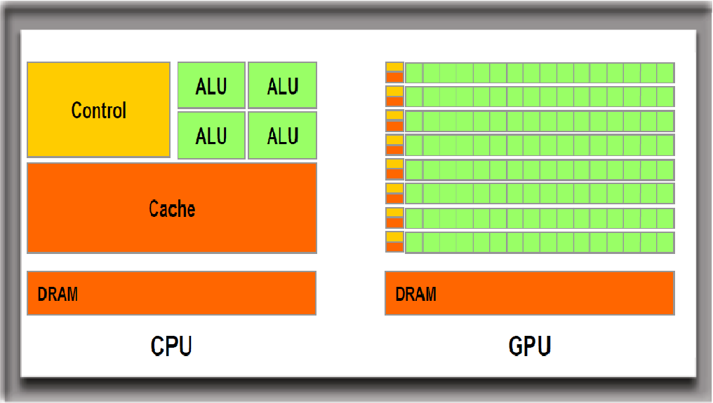
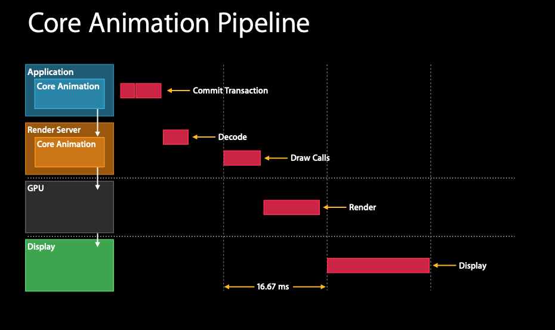
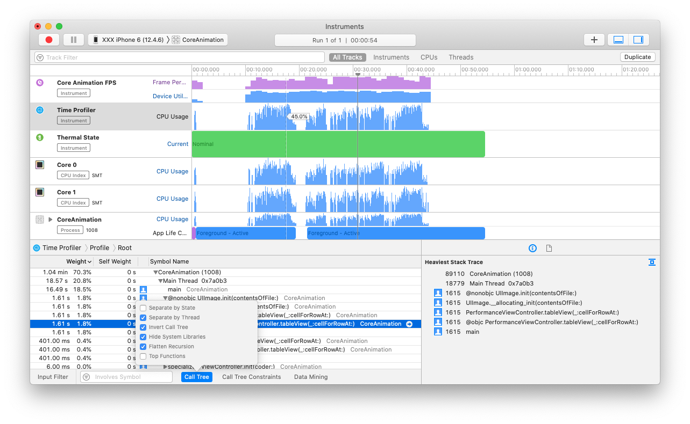
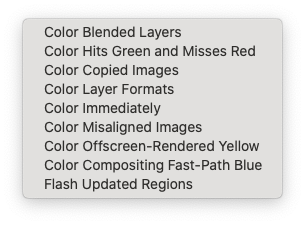
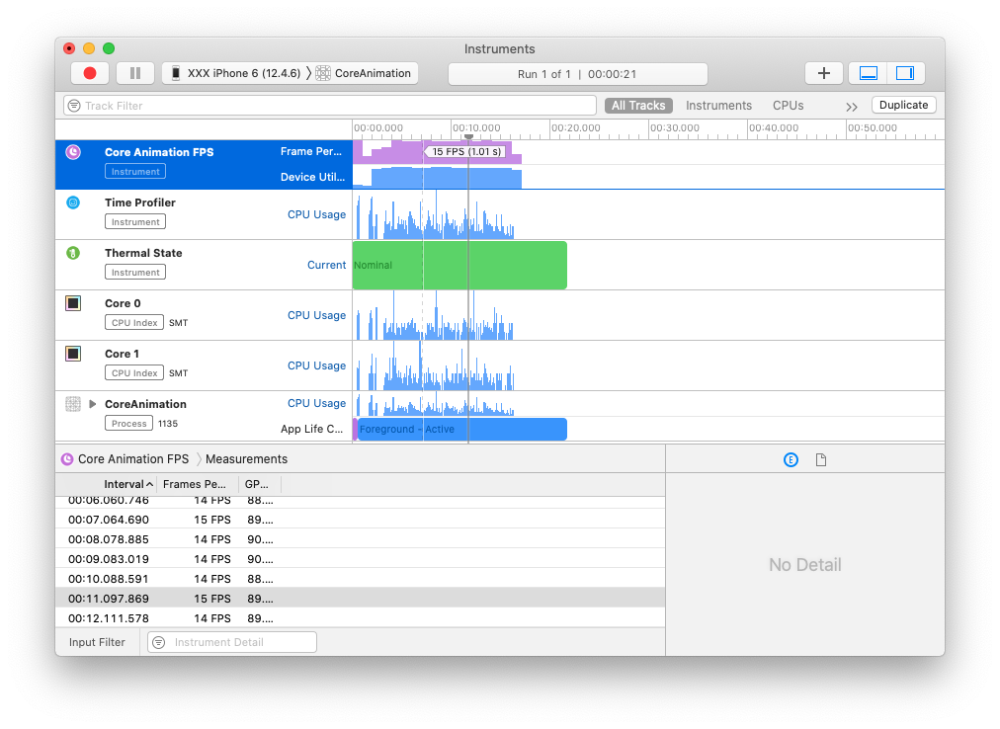
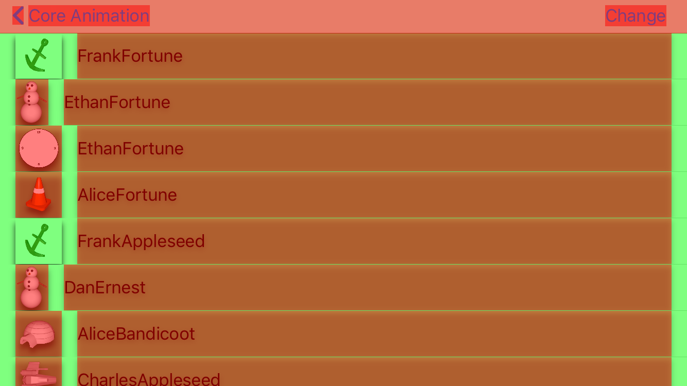
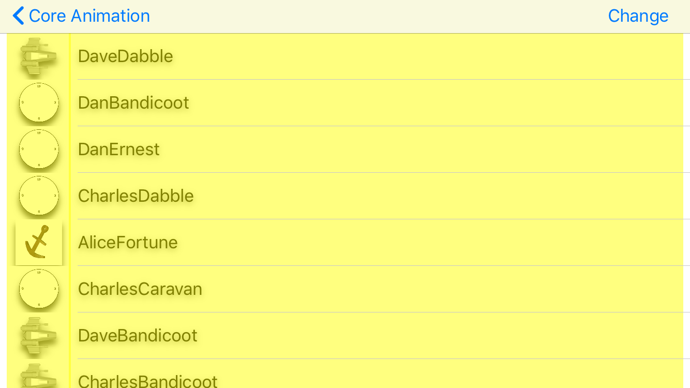
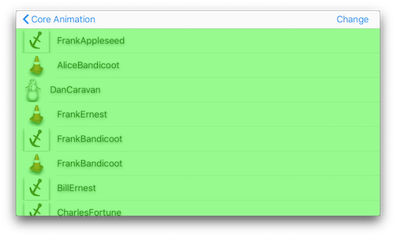
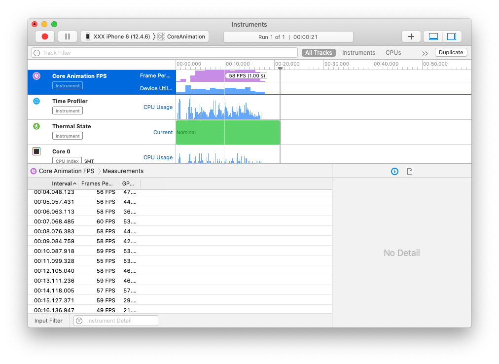

> 这是 Core Animation 的系列文章，介绍了 Core Animation 的用法，以及如何进行性能优化。
>
> 1. [CoreAnimation基本介绍](https://github.com/pro648/tips/blob/master/sources/CoreAnimation%E5%9F%BA%E6%9C%AC%E4%BB%8B%E7%BB%8D.md)
> 2. [CGAffineTransform和CATransform3D](https://github.com/pro648/tips/blob/master/sources/CGAffineTransform%E5%92%8CCATransform3D.md)
> 3. [CALayer及其各种子类](https://github.com/pro648/tips/blob/master/sources/CALayer%E5%8F%8A%E5%85%B6%E5%90%84%E7%A7%8D%E5%AD%90%E7%B1%BB.md)
> 4. [CAAnimation：属性动画CABasicAnimation、CAKeyframeAnimation以及过渡动画、动画组](https://github.com/pro648/tips/blob/master/sources/CAAnimation%EF%BC%9A%E5%B1%9E%E6%80%A7%E5%8A%A8%E7%94%BBCABasicAnimation%E3%80%81CAKeyframeAnimation%E4%BB%A5%E5%8F%8A%E8%BF%87%E6%B8%A1%E5%8A%A8%E7%94%BB%E3%80%81%E5%8A%A8%E7%94%BB%E7%BB%84.md)
> 5. [图层时间CAMediaTiming](https://github.com/pro648/tips/blob/master/sources/%E5%9B%BE%E5%B1%82%E6%97%B6%E9%97%B4CAMediaTiming.md)
> 6. [计时器CADisplayLink](https://github.com/pro648/tips/blob/master/sources/%E8%AE%A1%E6%97%B6%E5%99%A8CADisplayLink.md)
> 7. [影响动画性能的因素及如何使用 Instruments 检测](https://github.com/pro648/tips/blob/master/sources/%E5%BD%B1%E5%93%8D%E5%8A%A8%E7%94%BB%E6%80%A7%E8%83%BD%E7%9A%84%E5%9B%A0%E7%B4%A0%E5%8F%8A%E5%A6%82%E4%BD%95%E4%BD%BF%E7%94%A8%20Instruments%20%E6%A3%80%E6%B5%8B.md)
> 8. [图像IO之图片加载、解码，缓存](https://github.com/pro648/tips/blob/master/sources/%E5%9B%BE%E5%83%8FIO%E4%B9%8B%E5%9B%BE%E7%89%87%E5%8A%A0%E8%BD%BD%E3%80%81%E8%A7%A3%E7%A0%81%EF%BC%8C%E7%BC%93%E5%AD%98.md)
> 9. [图层性能之离屏渲染、栅格化、回收池](https://github.com/pro648/tips/blob/master/sources/%E5%9B%BE%E5%B1%82%E6%80%A7%E8%83%BD%E4%B9%8B%E7%A6%BB%E5%B1%8F%E6%B8%B2%E6%9F%93%E3%80%81%E6%A0%85%E6%A0%BC%E5%8C%96%E3%80%81%E5%9B%9E%E6%94%B6%E6%B1%A0.md)

前面的几篇文章已经介绍了 Core Animation 的动画、图层、时间等，Core Animation 功能和性能都很强大。但如果不清楚核心动画原理，可能会以非常低效的方式使用。

这篇文章介绍可能引起动画性能降低的原因，以及如何避免、修复这些问题。

## 1. CPU VS GPU

渲染和动画涉及到CPU（中央处理器，Central Processing Unit）和GPU（Graphics Processing Unit）。在现代的 iOS 设备中，CPU和GPU都是可编程芯片，即可运行不同软件。但由于历史原因，常称 CPU 执行的工作为软件层面，GPU 为硬件层面。

GPU 最初旨在为计算机图形和视频创建图像，但自2010年以来，GPU 也可用于加速涉及大量数据的计算。

可以将 CPU 视为整个系统的任务负责人，协调各种通用计算任务。GPU 执行较窄领域的更专门的任务（通常是数学任务）。借助并发，GPU 执行任务速度远远高于 CPU。



CPU、GPU 对比如下：

| CPU                  | GPU                  |
| -------------------- | -------------------- |
| 多核                 | 非常多核             |
| 低延迟               | 高通量               |
| 适合串行任务         | 适合并行任务         |
| 可以同时执行多项任务 | 可以同时执行上千任务 |

通常来讲可以在 CPU 中执行所有任务，但对于图像处理 GPU 速度会更快。因为图像处理涉及大量浮点计算，而 GPU 更擅长此类计算。因此，将尽可能多的渲染工作转移给 GPU 处理，但如果将过多任务交由 GPU 处理，也会影响 app 性能。

性能优化就是将任务合理分配给 CPU、GPU。为了实现这一目标，需先了解 Core Animation 如何为 CPU、GPU 分配任务。

#### 1.1 动画阶段

动画和组合图层由单独进程处理，独立于 app 之外，该进程被称为 render tree。

*提交交易 Commit Transaction*时，分为以下四个阶段：

1. 布局 layout：准备 view、layer 层级结构，设置 layer 属性，例如：`frame`、`backgroundColor`、`border`等。
2. 渲染 display：对 layer 的 backing image 进行渲染。渲染会调用`draw(_:)`、`draw(_:in:)`方法。
3. 准备 prepare：Core Animation 准备将 animation data 发送至 render server。图片解码、转换也是在此阶段。
4. 提交 commit：Core Animation 打包所有图层和属性，使用进程间通信（IPC，Inter-Process Communication）发送至 render tree 进行渲染。这个过程是递归的，必须迭代整个视图层级。如果图层树复杂，整个过程会很昂贵。这也是为什么要让图层树尽可能平坦，以确保这一阶段尽可能高效。

上述四个阶段发生在 app 内，在显示到屏幕上前还有额外工作。当打包的 layer 和动画到达 render server 进程时，会被反序列化为图层树，称为 render tree。借助 render tree 为每一帧动画执行以下工作：

5. 为所有图层属性计算中间值，设置 OpenGL/Metal 几何形状执行渲染。

6. 在屏幕上渲染可见的三角形。

所以，共有六个阶段。最后两个阶段在动画过程中不停重复，前五个阶段由 CPU 执行，最后一个阶段由 GPU 执行。你只能控制前两个阶段：布局和绘制，Core Animation 框架内部处理剩余阶段。

动画本身分为三个阶段：

1. 创建动画，更新视图层级。
2. 准备和提交动画。这一阶段会调用`layoutSubviews()`和`drawRect`。
3. 提交视图层级和动画。



在布局和渲染阶段，你可以决定哪些工作交由 CPU、哪些工作交由 GPU。但应如何分配呢？

#### 1.2 GPU 相关操作

GPU 为特定任务进行了优化，采集图片、集合信息，运行变换，应用纹理，混合后输出到屏幕上。GPU 在这些操作上有很大的灵活性，但 Core Animation 并未提供相关接口。除非绕过 Core Animation 直接使用 OpenGL/Metal，否则，可使用硬件加速的的任务非常固定。

从广义上讲，大部分`CALayer`的属性使用 GPU 渲染。例如，背景色、描边色可以使用着色的三角形高效绘制。为`contents`属性设置图片，即使进行了缩放、裁剪，也可以使用纹理三角形高效渲染，无需使用 CPU。

但以下这些操作会降低 GPU 渲染性能：

- 太多几何结构。GPU 可以处理百万级三角板，几何结构一般不会是核心动画的瓶颈，但 layer 需经过预处理后使用 IPC 发送至 render tree。太多图层会引起 CPU 性能瓶颈，进而影响一次可渲染图层数量。
- 重绘(Overdraw)。主要由半透明图层重叠造成，GPU 的填充比率（fill rate，用颜色填充像素的比率）是有限的，所以需避免重绘（同一帧用相同的像素填充多次）。GPU 已经可以应对重绘，即使是 iPhone 3GS，也可以处理2.5的填充率，同时保持60fps。即可以渲染2.5屏内容。新设备重绘能力更为强劲。
- 离屏渲染（Offscreen drawing）。某些效果不能直接向屏幕渲染，而需先在离屏 context 渲染。Offscreen drawing 发生于 GPU 渲染的 render server，此时需要为离屏图片上下文开辟额外内存空间，并进行绘制上下文切换，这些都会降低 GPU 性能。`cornerRadius`、`mask`、阴影、栅格化都会导致 Core Animation 离屏预渲染图层。这并不是说需要禁止使用这些效果，只是使用时需了解其对性能的影响。
- 过大的图片。如果渲染的图片大于 GPU 纹理（texture）支持的最大大小（通常为2048\*2048或4096\*4096，随硬件改变），每次渲染前都需要使用 CPU 进行预处理，这会降低 GPU 性能。

#### 1.3 CPU 相关操作

Core Animation 动画开始前，CPU 已经开始处理相关工作了。这意味着不会影响帧率，但可能导致动画延迟，进而导致界面无响应。

下面这些 CPU 操作均会延迟动画开始时间：

- 计算布局。如果视图层级结构复杂，当显示、修改视图时，会需要一定时间计算布局。
- 视图懒加载。只有在屏幕上显示视图控制器时，系统才会加载所需视图。这样有利于减少内存、降低 app 启动时间，但如果显示到屏幕上前需要处理太多工作，会导致 app 无响应。如果控制器数据来自于本地数据库，控制器来自于 storyboard，或者包含图片等，都会导致磁盘读写，磁盘读写比 CPU 指令慢很多。
- Core Graphics 绘制。如果实现了视图的`draw(_:)`方法，或`CALayerDelegate`协议的`draw(_:in:)`方法，即使不绘制任何内容，也会产生明显性能开销。为了支持绘制内容，Core Animation 必须在内存中开辟与视图同大小的 backing image，绘制完成后使用进程间通信将数据发送给 render server。相对来说，Core Graphics 绘制速度慢，不推荐在性能挑剔场景使用。
- 图片解码 Image decompression。编码的 png、jpeg图片比未编码图片小很多。图片显示到屏幕前，必须先解码。为了减少内存占用，iOS 直到需要显示图片时才对图片进行解码。如果是大图，解码过程可能很耗时。

图层打包发送到 render tree 后，CPU 还需继续处理动画相关工作。为了把图层显示到屏幕，Core Animation 需循环 render tree 中可见图层，并转换为纹理三角板以便 OpenGL/Metal 处理。CPU 必须处理这些转换，因为 GPU 对图层层级结构没有概念。CPU 在这一环节工作量与图层数量成正比，图层多了后 CPU 渲染每一帧的负担都会增加，尽管这些工作在 app 之外的进程执行。

#### 1.4 IO 相关操作

IO（Input/Output，即输入/输出）指通过磁盘、网络接口输入、输出数据。有些动画可能涉及从磁盘读取数据，例如，切换控制器时从磁盘读区 storyboard、nib文件；轮播图片太大时，每次都需要从磁盘读取。

IO 比访问内存慢很多。如果动画过程中涉及 IO，动画性能可能会出现问题。可以借助线程、缓存、预加载技术解决 IO 问题。

## 2. 测量 而非猜测

已经掌握了动画可能出现性能瓶颈的点，但如何解决这些性能瓶颈呢？一般，借助工具测量性能问题出在哪里，而非根据猜测尝试修复。

#### 2.1 在真机测量

进行性能优化时，应在真机测试，而非模拟器。模拟器可以提高开放效率，但并不能准确反映设备性能。

模拟器运行于 Mac 上，Mac 的 CPU 可能比 iOS 设备 CPU 性能高很多。Mac 的 GPU 与 iOS 的有很多不同，Mac 需要使用 CPU 模拟 GPU，导致模拟器中 GPU 相关操作比 CPU 中的慢很多，特别使用了`CAEAGLLayer`时。也就是模拟器中的性能表现和真机可能有很大不同。

测试性能的另一要点就是使用发布版本(Release)，而非调试版（Debug mode）。构建发布版时，编译器会过滤掉调试内容，包括开发者自定义的在 release 版本中移除`print`语句等，我们只关注 release 版本性能，也只需在 release 中测试性能。

最后，尽可能在 app 支持的最旧的设备中测试。有时，Apple 发布的大版本系统更新、硬件发布，相关性能可能发生变化，最好能够在不同设备、不同版本系统中进行测试。

#### 2.2 保持一致的帧率

为了获得平滑动画，动画帧率应与屏幕刷新帧率一致。使用[CADisplayLink](https://github.com/pro648/tips/blob/master/sources/%E8%AE%A1%E6%97%B6%E5%99%A8CADisplayLink.md)可以降低帧率到30fps，但没有办法修改 Core Animaiton 动画的帧率。如果动画达不到60fps，会有帧会被跳过，app 产生卡顿。

眼睛可以分辨出 app 是否有严重掉帧，但不能衡量出严重程度。想要优化性能，需要获得当前帧率数值。Xcode 提供的 Instruments 工具可以检测帧率。

## 3. Instruments 介绍

Instruments 是 Xcode 的检测工具，可以检测应用启动时间、动画、电量消耗、内存泄漏等。

#### 3.1 Time Profiler 模版

使用 Time Profiler 监测 CPU 使用率，可以获知哪个方法占用了大量 CPU 时间。虽然使用大量 CPU 不一定是性能瓶颈，但在动画出现性能问题时，你可能需要判断是否是 CPU 问题导致的。



Time Profiler 的 Call Tree 有一些选项，用于过滤掉不关心的内容。常用选项如下：

- Separate by State：根据 app 生命周期状态分组，可以方便看到 app 各状态下的工作量。
- Separate by Thread：根据方法所在线程进行分组。如果使用了多线程，Separate by thread 可以区分出那个线程导致的问题。
- Invert Call Tree：勾选后，将反转堆栈，先显示底部部分。
- Hide System Libraries：隐藏所有系统框架方法，可以区分出我们的那个方法有性能瓶颈。
- Flatten Recursive：将递归调用合并到一个单个条目中。
- Top Functions：调用函数所用时间，与从该函数调用的函数消耗的时间相累加，有助于找到耗时方法。

#### 3.2 Core Animation 模版

Instruments 的 Core Animation 工具用于监测核心动画性能，可以记录动画帧率

#### 3.3 Xcode Rendering 选项

Xcode 提供的 Rendering 选项，用于辅助调试渲染性能瓶颈。点击Xcode 中的 Debug > View Debugging > Rendering 可以看到所有选项。



- Color Blended Layers：高亮显示屏幕中半透明图层重叠的区域，并根据重叠程度由绿色变为红色。重叠会导致重绘，进而影响 GPU 性能，也是滑动、动画性能下降的常见原因。
- Color Hits Green and Misses Red：开启`shouldRasterize`属性后，layer 绘制会被缓存起来，并被渲染成一张图片。如果缓存的图片需要不断重新生成，该选项会使用红色标记重绘部分，这一部分对性能会有负面影响。
- Color Copied Images：如果图片色彩格式 GPU 不支持，就需要先在 CPU 中转换。Core Animation 就需要复制一份图片，而非传递指针，Color copied Images 使用蓝色标记图片。复制图片对内存消耗很大，应尽可能避免。
- Color Immediatelly：正常情况下，Instruments 的 Core Animation 模版10毫秒更新一次调试色。对于某些特殊情况，你可能想获得调试色的立即更新，但开启 Color Immediately 后可能影响渲染性能、动画帧率，一般无需长期开启。
- Color Misaligned Images：高亮显示被拉伸、压缩，或边界未与像素对齐（即宽高不是整数）的图片。大部分情况下对图片进行压缩、拉伸很正常，但如果错误的把大图作为缩略图使用，可以使用 Color Misaligned Images 检测发现。
- Color Offscreen-Rendered Yellow：使用黄色高亮显示离屏渲染的图层，可以使用`shouldRasterize`、`shadowPath`优化图层。
- Flash Updated Regions：使用黄色高亮显示重绘部分，即任何使用 Core Graphics 重绘的图层。这种绘制速度慢，如果高频重绘会影响应用性能，可以通过使用缓存或其他技术解决。

此外，模拟器 Debug 选项中也提供了部分高亮选项。

## 4. 使用 Instruments 优化性能

在这一部分使用 Instruments 分析、优化应用性能。

Demo 使用`UITableView`展示通讯录。为了模拟真实效果，使用`UIImage(contentsOfFile:)`加载图片，而没有使用会使用缓存的`UIImage(named:)`方法加载头像，还添加了阴影，以便 app 性能更低。

如下所示：

```
/// 使用 Instruments 的 Core Animation 模版监测性能
class PerformanceViewController: BaseViewController {
    
    var items = [Dictionary<String, Any>]()
    var tableView = UITableView(frame: .zero, style: .plain)
    
    override func viewDidLoad() {
        super.viewDidLoad()
        
        var array = [Dictionary<String, Any>]()
        for _ in 0...3000 {
            array.append(["name": self.randomName(), "image": self.randomAvatar()])
        }
        items = array
        
        tableView.backgroundColor = .white
        tableView.dataSource = self
        tableView.register(UITableViewCell.self, forCellReuseIdentifier: "cell")
        view.addSubview(tableView)
        
        tableView.translatesAutoresizingMaskIntoConstraints = false
        tableView.topAnchor.constraint(equalTo: view.topAnchor).isActive = true
        tableView.leadingAnchor.constraint(equalTo: view.leadingAnchor).isActive = true
        tableView.bottomAnchor.constraint(equalTo: view.bottomAnchor).isActive = true
        tableView.trailingAnchor.constraint(equalTo: view.trailingAnchor).isActive = true
    }
    
    private func randomName() -> String {
        let first = ["Alice", "Bill", "Charles", "Dan", "Dave", "Ethan", "Frank"]
        let last = ["Appleseed", "Bandicoot", "Caravan", "Dabble", "Ernest", "Fortune"]
        
        let index1 = arc4random_uniform(UInt32(first.count))
        let index2 = arc4random_uniform(UInt32(last.count))
        
        return String(first[Int(index1)] + last[Int(index2)])
    }
    
    private func randomAvatar() -> String {
        let images = ["Man", "Igloo", "Cone", "Spaceship", "Anchor", "Key"]
        let idx = arc4random_uniform(UInt32(images.count))
        
        return images[Int(idx)]
    }
}

extension PerformanceViewController: UITableViewDataSource {
    func numberOfSections(in tableView: UITableView) -> Int {
        return 1
    }
    
    func tableView(_ tableView: UITableView, numberOfRowsInSection section: Int) -> Int {
        return items.count
    }
    
    func tableView(_ tableView: UITableView, cellForRowAt indexPath: IndexPath) -> UITableViewCell {
        let cell = tableView.dequeueReusableCell(withIdentifier: "cell", for: indexPath) as UITableViewCell
        let dict: Dictionary = items[indexPath.row]
        
        let filePath = Bundle.main.path(forResource: dict["image"] as? String, ofType: "png")
        
        cell.imageView?.image = UIImage(contentsOfFile: filePath ?? "")
        cell.textLabel?.text = dict["name"] as? String
        
        // set image shadow
        cell.imageView?.layer.shadowOffset = CGSize(width: 0, height: 5)
        cell.imageView?.layer.shadowOpacity = 0.75
        cell.clipsToBounds = true
        
        // set text shadow
        cell.textLabel?.backgroundColor = UIColor.clear
        cell.textLabel?.layer.shadowOffset = CGSize(width: 0, height: 2)
        cell.textLabel?.layer.shadowOpacity = 0.5
        
        return cell
    }
}
```

快速滑动 table view，可以明显感受到掉帧。

在 Xcode 中使用 command + I 快捷键 Profile 当前demo，选取 Instruments 中的 Core Animation 模版，分析后如下：



目前，滑动表视图时帧率约14FPS。

开启 Xcode 中的 Color Blended Layers 选项，运行后如下：



红色区域为图层重叠区域。

开启 Color Offscreen-Rendered Yellow 选项：



可以看到 table view 的 cell 是黄色的，这可能是图片和文本添加阴影导致的。去掉文本、图片阴影，黄色区域会消失，app 滑动也会流畅起来。

cell 中头像、姓名文本不会在每一帧刷新时改变，可以使用`shouldRasterize`属性缓存图层，之后使用缓存的图层，直到图层改变需要更新。

更新`tableView(_:cellForRowAt:)`方法，在`return cell`前添加以下代码：

```
        // rasterize
        cell.layer.shouldRasterize = true
        cell.layer.rasterizationScale = UIScreen.main.scale
```

使用`shouldRasterize`后，layer 仍然会进行离屏渲染，但因为开启了*栅格化 rasterization*，Core Animation 会缓存绘制结果，阴影对性能影响也会变小。



使用 Instruments 的 Core Animation 模版分析应用，帧率能达到58帧。与之前相比，性能提升了很多。



## 总结

这一篇文章介绍了 Core Animation 是如何渲染的，以及可能出现性能瓶颈的点，还介绍了使用 Instruments、Xcode 检测性能问题。

Demo名称：CoreAnimation  
源码地址：<https://github.com/pro648/BasicDemos-iOS/tree/master/CoreAnimation>

> 上一篇：[计时器CADisplayLink](https://github.com/pro648/tips/blob/master/sources/%E8%AE%A1%E6%97%B6%E5%99%A8CADisplayLink.md)
>
> 下一篇：[图像IO之图片加载、解码，缓存](https://github.com/pro648/tips/blob/master/sources/%E5%9B%BE%E5%83%8FIO%E4%B9%8B%E5%9B%BE%E7%89%87%E5%8A%A0%E8%BD%BD%E3%80%81%E8%A7%A3%E7%A0%81%EF%BC%8C%E7%BC%93%E5%AD%98.md)

参考资料：

1. [How CPU and GPU Work Together](https://www.omnisci.com/technical-glossary/cpu-vs-gpu)
2. [What’s the Difference Between a CPU and a GPU?](https://blogs.nvidia.com/blog/2009/12/16/whats-the-difference-between-a-cpu-and-a-gpu/)
3. [Instruments Tutorial with Swift: Getting Started](https://www.raywenderlich.com/397-instruments-tutorial-with-swift-getting-started)

   