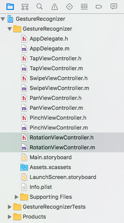
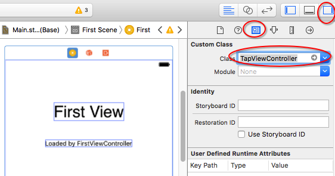
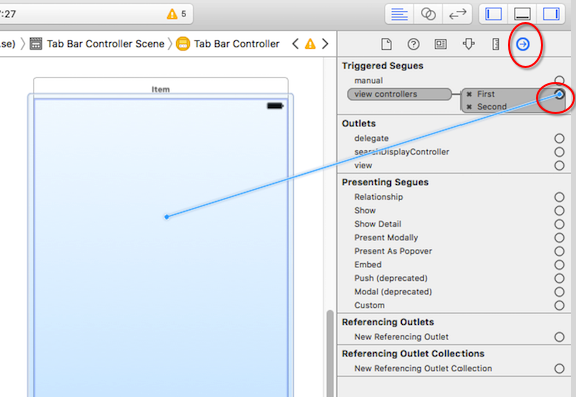
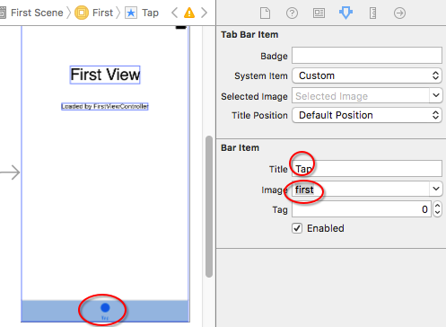
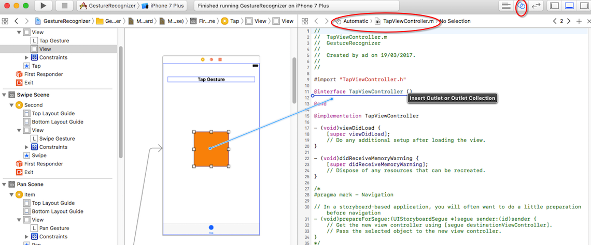
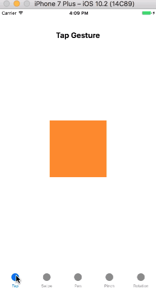
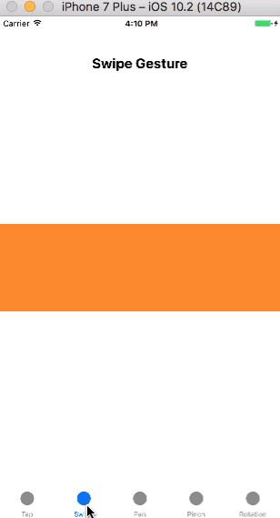
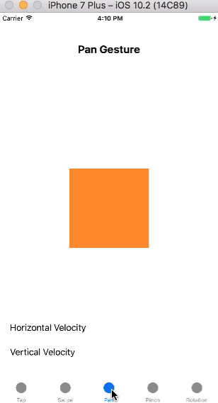
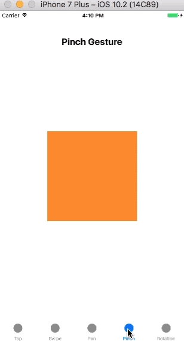
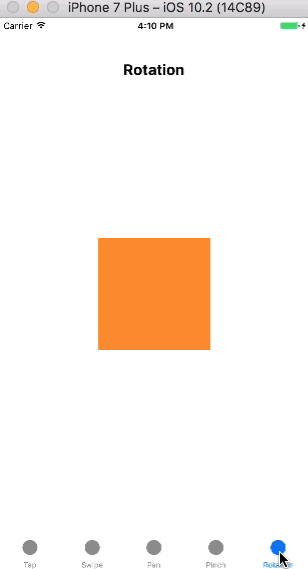

手势识别器（Gesture Recognizer)用于识别触摸序列并触发响应事件。当手势识别器识别到一个手势或手势发生变化时，会触发响应事件。`UIGestureRecognizer`类作为抽象类，不能直接使用。只能使用`UIGestureRecognizer`的子类识别手势，每一个子类识别一个特定的手势。`UIGestureRecognizer`有以下几个子类：

1. `UITapGestureRecognizer`：点击手势识别器，手势可以是一次点击或多次点击，可以是一个手指也可以是多个手指。点击手势是最为常用的手势。
2. `UISwipeGestureRecognizer`：滑动手势识别器，滑动方向可以是上下左右任一方向。滑动手势的典型示例是查看照片的应用程序，我们使用手指从一张照片滑动到另一张照片。
3. `UIPanGestureRecognizer`：平移手势识别器，也称为拖动手势识别器。当用户平移视图时，必须保持一个或多个手指始终按压在视图上。
4. `UIPinchGestureRecognizer`：捏合手势识别器，需要两个手指同时触摸视图。当两个手指靠近时，视图缩小；当两根手指远离时，视图放大。
5. `UIRotationGestureRecognizer`：旋转手势识别器，需要两个手指同时触摸视图。当用户手指彼此相对做圆周运动时，对应视图会以相同的方向和速度旋转。
6. `UILongPressGestureRecognizer`：长按手势识别器，想要成功触发长按手势，需使用一个或多个手指在视图上按压不小于`minimumPressDuration`设定的时长，默认0.5秒，并且长按时手指移动的距离要小于`allowableMovement`设定的距离，默认距离10points。
7. `UIScreenEdgePanGestureRecognizer`：屏幕边缘轻扫手势识别器，继承自`UIPanGestureRecognizer`，前面六个手势识别器均继承自`UIGestureRecognizer`。屏幕边缘轻扫手势识别器只能识别在屏幕边缘附近开始的手势。与滑动手势很像，不同之处在于前者必须从屏幕边缘开始。可以使用屏幕边缘手势来启动视图控制器转换。

上面的这些手势不是离散（discrete）的就是连续（continuous）的。离散的手势识别器从手势开始到结束只向目标发送单个动作消息，例如点击手势、滑动手势。连续手势的手势识别器为每个增量变化发送动作消息，直到多点触摸序列结束，例如平移手势、捏合手势、旋转手势。

> 当touch首次创建并传递给gesture recognizer时，也会传递给hit-test视图，同时调用视图、手势识别器的`touchesBegan(_:with:)`方法。
>
> 这样就不会因为gesture recognizer正在分析手势，导致view接收不到事件了。如果所有手势识别器都识别失败，则视图继续接收事件，就像手势识别器不曾存在一样。另外，gesture recognizer和touch是两种不同的机制，有时需要同时处理。例如，屏幕上添加了单击手势、双击手势，`touchesBegan(_:with:)`时还需改变触摸位置颜色，`touchesEnded(_:with:)`和`touchesCancelled(_:with:)`恢复颜色。想要处理这种场景，就需要同时接收touch事件。
>
> 如果你对事件传递和响应链还不了解，可以查看我的另一篇文章：[事件传递和响应链（Responder Chain）](事件传递和响应链（Responder Chain）)。

一旦检测到有效的手势，手势识别器会触发响应事件。当调用响应方法时，一般会把手势识别器作为参数，以便在处理手势事件需要额外信息时可供使用。把手势识别器作为参数不是必须的，但会是一个良好的编程习惯。

```
- (void)handleTapGesture;
- (void)handleTapGestureWithGestureRecognizer:(UITapGestureRecognizer *)gestureRecognizer;
```

在上面的代码中，如果你需要获取手势在视图控制器中的位置，可以通过参数`gestureRecognizer`调用`locationInView:`方法获取。所以在本教程示例中，所有手势响应方法都会带有参数。

一个手势识别器只能添加到一个视图，一个视图可以添加多个手势识别器。例如，可以为图片视图添加捏合手势和旋转手势，这样你就可以放大、缩小或旋转图片。然而，手势识别器一次只能识别一个手势，它不能把你的手势同时识别为捏合手势和旋转手势。添加到同一视图上的手势识别器都会被添加到该视图的数组中，可以像使用其它数组一样使用该数组，但很少需要这样做。

手势识别器即可以通过界面构建器（Interface Builder）添加，也可以通过代码添加。在这篇文章，我们将使用代码添加。

## 创建demo

这篇文章主要讲解1至5五个手势识别器，6和7两个识别器只做简单介绍。

首先我们会创建`Tabbed Application`模板的应用，设置应用包含五个`tab`，每一个`tab`对应一个单独视图控制器，每一个视图控制器对应一个手势识别器。我们讲解手势识别器的顺序与上面介绍顺序相同，在讲解每一个手势识别器时会添加一个或多个`UIView`，并在对应的视图控制器中添加代码，所以这一个demo会被划分为5个小的示例。

启动Xcode，点击File > New > File…，选择iOS > Application > Tabbed Application模板，点击*Next*；在*Product Name*中填写`GesturesDemo`，点击*Next*；选择文件位置，点击*Create*创建工程。

现在设置用户界面以便稍后可以直接使用手势识别器。点击*Main.storyboard*，可以看到系统自动创建了两个连接到选项卡栏控制器的视图控制器，所以还需要手动添加三个视图控制器。从对象库(Object Library）中拖拽三个视图控制器到界面构建器画布中。

在将视图控制器连接到选项卡栏之前，必须创建必要的视图控制器。首先选中`FirstViewController`和`SecondViewController`类文件（包括.h和.m文件）并删除，在Xcode菜单栏中点击File > New > File... ，从弹出的窗口中选择iOS > Application > Cocoa Touch Class，点击*Next*；在弹出窗口的*Class*文本框内填写`TapViewController`，父类为`UIViewController`，点击*Next*；选择文件位置，点击*Create*创建文件。

重复上面添加`TapViewController`的方法，依次创建名称如下的视图控制器。

- `SwipeViewController`
- `PanViewController`
- `PinchViewController`
- `RotationViewController`

操作完成后，你的项目导航器（Project Navigator）应该和下图一样。



回到界面构建器，打开右上角*Utilities*，选中第一个视图控制器，打开*Utilities*中的*Identify Inspector*，把*Custom Class*中的*Class*设置为我们的第一个视图控制器名称`TapViewController`。



重复以上步骤，为其余四个视图控制器添加自定义类。

下面把所有的视图控制器连接到选项卡栏控制器。首先选中选项卡栏控制器，其次打开*Utilities*中的*Connections Inspector*，在*Triggered Segues*一栏内，点击*view controllers*右侧的圆并拖拽到没有连接到选项卡栏控制器的控制器。重复此步骤，直到所有视图控制器均连接到选项卡栏控制器。



现在，设置视图控制器在选项卡栏的标题。选中选项卡栏，打开*Utilities*中的*Attributes Inspector*，为每一个视图控制器设置对应的选项卡标题，所有的视图控制器的*image*都设置为*first*。



选项卡栏标题依次为：

- Tap
- Swipe
- Pan
- Pinch
- Rotation

最后删除系统自动创建的两个视图控制器上的`UILabel`。现在为每一个视图控制器添加一个`UILabel`用以显示视图控制器的名称。这里使用的是Xcode 8.2.1，模拟器为iphone 7 plus，iOS 10.2，`UILabel`属性如下，如果你是其他版本，`frame`属性可能不同。

- Frame： X=20，Y=57，Width=374，Height=24
- Font：System Bold，20pt
- Alignment：Center

和上面的顺序一样，均是自上而下。标签的内容依次为：

- Tap Gesture
- Swipe Gesture
- Pan Gesture
- Pinch Gesture
- Rotation Gesture

## 1. 点击手势识别器`UITapGestureRecognizer`

现在给`TapViewController`添加一个`UIView`用以学习`UITapGestureRecognizer`，打开*Main.storyboard*，选中`TapViewController`，从对象库中拖拽一个`UIView`到`TapViewController`，`UIView`属性如下：

- Frame: x=132, y=293, Width=150, Height=150
- Background Color: orange

打开Xcode中右上角的*Assistant editor*，从左侧的`TapViewController`的`UILabel`中拖拽IBOutlet到右侧`TapViewController.m`的头文件中，在弹出窗口中*Name*文本框内填写`testView`。



> 在后面我们会多次用到上面的方法为`UIView`创建IBOutlet属性，但不再详细描述过程。

进入`TapViewController.m`，在`viewDidLoad`方法中，我们初始化一个手势识别器，并把它添加到`testView`中。

```
- (void)viewDidLoad
{
    [super viewDidLoad];
    
    // 1.1 初始化手势识别器
    UITapGestureRecognizer *singleGestureRecognizer = [[UITapGestureRecognizer alloc] initWithTarget:self action:@selector(handleSingleTapGesture:)];
    // 1.2 添加手势识别器
    [self.testView addGestureRecognizer:singleGestureRecognizer];
}
```

使用1.1的方法初始化点击手势识别器，`initWithTarget: `的参数一般是`self`，即指定当前视图控制器接收手势识别器发送的消息。`action: `为手势所触发的操作。点击手势识别器默认是一次点击、一个手指点击。使用1.2的方法添加点击手势识别器到`testView`，`addGestureRecognizer: `方法是向视图添加手势识别器的标准方法。

在`TapViewController.m`中实现手势中的`handleSingleTapGesture: `方法，在第一次单击`testView`时，把它的宽放大2倍；第二次点击时，恢复为原来大小。

```
- (void)handleSingleTapGesture:(UITapGestureRecognizer *)tapGestureRecognizer
{
    NSLog(@"Single Tap");
    
    CGFloat newWidth = 150;
    if (self.testView.frame.size.width == 150)
    {
        newWidth = 300;
    }
    
    CGPoint currentCenter = self.testView.center;
    
    self.testView.frame = CGRectMake(self.testView.frame.origin.x, self.testView.frame.origin.y, newWidth, self.testView.frame.size.height);
    self.testView.center = currentCenter;
}
```

现在运行app，点击`Tap Gesture`中的`testView`。第一次点击时，`testView`宽度变为原来二倍，再次点击，恢复为原来大小。



现在为`testView`添加一个双击手势，更新后如下：

```
- (void)viewDidLoad
{
    ...
    // 2.1 初始化双击手势
    UITapGestureRecognizer *doubleTapGestureRecognizer = [[UITapGestureRecognizer alloc] initWithTarget:self action:@selector(handleDoubleTapGesture:)];
    // 2.2 需要两次点击
    doubleTapGestureRecognizer.numberOfTapsRequired = 2;
    // 2.3 添加手势识别器
    [self.testView addGestureRecognizer:doubleTapGestureRecognizer];
    
        
    // 3 单机手势遇到双击手势时只响应双击手势
    [singleGestureRecognizer requireGestureRecognizerToFail:doubleTapGestureRecognizer];
}
```

在上面的代码中，在2.1中初始化一个点击手势，并指定点击手势发生时的动作方法；在2.2中利用`numberOfTapsRequired`属性设定需要点击两次才能触发双击手势；在2.3中，把手势识别器添加到`testView`。现在，`testView`包含两个手势识别器，双击时会被识别为先单机后双击，所以在3中设置当单机手势遇到双击手势时，只响应双击手势。

现在我们实现双击手势中的`handleDoubleTapGesture: `方法。第一次双击时，`testView`长、宽均变为原来二倍，第二次双击时，恢复原来大小。

```
- (void)handleDoubleTapGesture:(UITapGestureRecognizer *)tapGestureRecognizer
{
    NSLog(@"Double Tap");
    
    CGSize newSize = CGSizeMake(150, 150);
    if (self.testView.frame.size.width == 150)
    {
        newSize.width = 300;
        newSize.height = 300;
    }
    
    CGPoint currentCenter = self.testView.center;
    
    self.testView.frame = CGRectMake(self.testView.frame.origin.x, self.testView.frame.origin.y, newSize.width, newSize.height);
    self.testView.center = currentCenter;
}
```

现在运行app，使用一根手指连续两次点击`testView`，可以看到`testView`长宽变为原来二倍，再次双击变为原来大小。最后单机`testView`，和之前一样宽度变为原来二倍。


## 2. 滑动手势识别器`UISwipeGestureRecognizer`

滑动手势可以滑向上下左右的任一方向，但不包括对角线方向，使用`UISwipeGestureRecognizerDirection`类提供的`dircetion`属性指定手势的滑动方向，如果没有设置滑动方向，默认向右侧滑动。每一个手势识别器只能识别一个滑动方向，所以如果需要识别多个方向，需要添加多个手势识别器。另外，滑动手势识别器的动作方法在滑动手势结束那一刻被调用。

滑动手势可快可慢。慢的滑动需要高精度方向，但所需动距离短些；快速滑动需要低精度的方向，但所需滑动距离长些。

在这一部分，使用之前创建的`SwipeViewController`学习滑动手势。在`SwipeViewController`中添加三个`UIView`，每一个视图的宽度等于当前窗口的宽度。第一个视图在视图控制器的中部，第二个和第三个分别放在第一个的左右两侧，第二个和第三个视图我们将不能在视图中看到。我们这里的目标就是把三个视图水平放置，通过滑动手势让隐藏的视图显示。

打开*Main.storyboard*，选中*Swipe Scene*，拖拽三个`UIView`到`SwipeViewController`，设置`UIView`的属性如下。

###### First View

- Frame：x=0, y=304, Width=414, Height=128
- Background Color: orange

###### Second View

- Frame: x=-414, y=304, Width=414, Height=128
- Background Color: red

###### Third View

- Frame:x=414, y=304, Width=414, Height=128
- Background Color: black

为刚添加的`UIView`在`SwipeViewController.m`中添加IBOutlet属性。

```
#import "SwipeViewController.h"

@interface SwipeViewController ()

@property (strong, nonatomic) IBOutlet UIView *viewOrange;
@property (strong, nonatomic) IBOutlet UIView *viewBlack;
@property (strong, nonatomic) IBOutlet UIView *viewRed;

@end
```

进入`viewDidLoad`方法，初始化两个滑动手势识别器，分别对应右滑、左滑，最后添加到中间的`viewOrange`中。

```
- (void)viewDidLoad
{
    [super viewDidLoad];
    
    // 初始化滑动手势识别器 滑动方向为右滑 添加到viewOrange
    UISwipeGestureRecognizer *swipeRightOrange = [[UISwipeGestureRecognizer alloc] initWithTarget:self action:@selector(slideToRightWithGestureRecognizer:)];
    swipeRightOrange.direction = UISwipeGestureRecognizerDirectionRight;
    [self.viewOrange addGestureRecognizer:swipeRightOrange];
    
    // 初始化滑动手势识别器 滑动方向为左滑 添加到viewOrange
    UISwipeGestureRecognizer *swipeLeftOrange = [[UISwipeGestureRecognizer alloc] initWithTarget:self action:@selector(slideToLeftWithGestureRecognizer:)];
    swipeLeftOrange.direction = UISwipeGestureRecognizerDirectionLeft;
    [self.viewOrange addGestureRecognizer:swipeLeftOrange];
}
```

当我们滑动中间`viewOrange`视图时，整个视图包括`viewBlack`和`viewRed`都会一起滑动，所以当一个视图离开视野时，另一个视图出现。下面我们实现右滑手势发生时的动作方法。

```
- (void)slideToRightWithGestureRecognizer:(UISwipeGestureRecognizer *)swipeGestureRecognizer
{
    NSLog(@"Swipe Right");
    
    CGFloat viewWidth = self.view.frame.size.width;
    
    // 右移
    [UIView animateWithDuration:0.5 animations:^{
        self.viewOrange.frame = CGRectOffset(self.viewOrange.frame, viewWidth, 0);
        self.viewBlack.frame = CGRectOffset(self.viewBlack.frame, viewWidth, 0);
        self.viewRed.frame = CGRectOffset(self.viewRed.frame, viewWidth, 0);
    }];
}
```

当我们右滑时，我们希望每个视图右移的距离和当前窗口的宽度一致，使用`animateWithDuration: animations: `方法移动视图会让整个过程变得美观，这里动画移动的快慢取决于动画持续的时间，持续时间越长，动画越慢。

下面实现左滑发生时的动作方法。与实现的右滑动作方法类似，只是这次是左滑，`x`需要左移。

```
- (void)slideToLeftWithGestureRecognizer:(UISwipeGestureRecognizer *)swipeGestureRecognizer
{
    NSLog(@"Swipe Left");
    
    CGFloat viewWidth = self.view.frame.size.width;
    
    // 左移
    [UIView animateWithDuration:0.5 animations:^{
        self.viewOrange.frame = CGRectOffset(self.viewOrange.frame, -viewWidth, 0);
        self.viewBlack.frame = CGRectOffset(self.viewBlack.frame, -viewWidth, 0);
        self.viewRed.frame = CGRectOffset(self.viewRed.frame, -viewWidth, 0);
    }];
}
```

现在运行app，进入*Swipe*选项卡，左滑或右滑，视图会以动画形式移动，但是移动一次后不能再次滑动。因为我们的手势只添加到了中间的`viewOrange`，下面为处于左侧的`viewRed`添加左滑手势识别器，处于右侧的`viewBlack`添加右滑手势识别器。因为三个视图左滑和右滑所需移动的视图一致，所以只需要调用相同方法即可。

```
- (void)viewDidLoad
{
    ...
    // viewRed添加左滑手势识别器
    UISwipeGestureRecognizer *swipeLeftRed = [[UISwipeGestureRecognizer alloc] initWithTarget:self action:@selector(slideToLeftWithGestureRecognizer:)];
    swipeLeftRed.direction = UISwipeGestureRecognizerDirectionLeft;
    [self.viewRed addGestureRecognizer:swipeLeftRed];
    
    // viewBlack添加右滑手势识别器
    UISwipeGestureRecognizer *swipeRightBlack = [[UISwipeGestureRecognizer alloc] initWithTarget:self action:@selector(slideToRightWithGestureRecognizer:)];
    swipeRightBlack.direction = UISwipeGestureRecognizerDirectionRight;
    [self.viewBlack addGestureRecognizer:swipeRightBlack];
}
```

现在运行app，一切正常。



> 因为视图中添加手势识别器发生在runtime，而非compile time，所以每一个手势识别器只能添加到一个视图。如果只创建一个手势识别器，添加到多个视图，手势识别器将不能正常工作。如果你想验证，你可以把`swipeRightOrange`和`swipeLeftOrange`添加到另外两个视图，同时注销另外两个视图之前的手势识别器，运行app，像之前一样滑动视图，你会发现手势无法正常识别。

## 3. 平移手势识别器`UIPanGestureRecognizer`

在这一部分学习平移手势识别器(`UIPanGestureRecognizer`)，或称为拖动手势识别器。这个手势可以使用户按压住视图在窗口内随意拖动，在用户拖动的过程中，必须保持手指一直按压在视图上。使用`UIPanGestureRecognizer`类的`velocityInView: `方法可以获取拖动手势移动的速度。

和以往一样，打开*Main.storyboard*，选中`Pan Scene`，从对象库拖拽一个`UIView`添加到`PanViewController`，设置其属性如下：

- Frame: x=132, y=293, Width=150, Height=150
- Background Color: orange

为刚添加的`UIView`在`PanViewController.m`中创建IBOutlet属性。

```
#import "PanViewController.h"

@interface PanViewController ()

@property (strong, nonatomic) IBOutlet UIView *testView;

@end
```

下面在`viewDidLoad`方法中初始化`UIPanGestureRecognizer`，并添加到`testView`。

```
- (void)viewDidLoad
{
    [super viewDidLoad];
    
    UIPanGestureRecognizer *panGestureRecognizer = [[UIPanGestureRecognizer alloc] initWithTarget:self action:@selector(moveViewWithGestureRecognizer:)];
    [self.testView addGestureRecognizer:panGestureRecognizer];
}
```

我们想要实现的是当手指按住视图后，视图随手指在屏幕上移动，最简单的方法是让视图的中心随手势移动。下面实现`moveViewWithGestureRecognizer: `方法。

```
- (void)moveViewWithGestureRecognizer:(UIPanGestureRecognizer *)panGestureRecognizer
{
    NSLog(@"Pan Tap");
    
    CGPoint touchPoint = [panGestureRecognizer locationInView:self.view];
    
    self.testView.center = touchPoint;
}
```

任何类型的手势识别器都可以使用`locationInview: `方法。这个方法返回用户触摸点的`CGPoint`值。在这个示例中，通过此方法获取拖动过程中手势所在的点，通过把该点设为`testView`的中心来达到拖动效果。另外，在上面代码中可以直接接触到响应手势的视图，但有时可能无法接触到，前面也提到响应方法中的参数可以提供额外信息，所以我们提供一种更为通用的方式，

```
- (void)moveViewWithGestureRecognizer:(UIPanGestureRecognizer *)panGestureRecognizer
{
    ...
//    self.testView.center = touchPoint;
    panGestureRecognizer.view.center = touchPoint;
}
```

> 第一部分的`UITapGestureRecognizer`也可以用此方法，你可以自己尝试修改，如果遇到问题，可以通过文章底部的连接下载这个demo的完整代码查看。

在这一部分的开始，说到可以使用`velocityInView: `方法获取拖动的速度，现在来实现它。

首先，进入*Main.stroyboard*，选中`Pan Scene`，为`PanViewController`添加两个`UILabel`，设置其属性如下：

###### Label #1

- Frame: x=20, y=582, Width=374, Height=21
- Text: Horizontal Velocity

###### Label #2

- Frame: x=20, y=628, Width=374, Height = 21
- Text: Vertical Velocity

稍后将使用这两个标签显示x轴和y轴的速度。在此之前，先为添加的两个`UILabel`创建IBOutlet属性。

```
#import "PanViewController.h"

@interface PanViewController ()

...
@property (strong, nonatomic) IBOutlet UILabel *horizontalVelocityLabel;
@property (strong, nonatomic) IBOutlet UILabel *verticalVelocityLabel;

@end
```

进入`PanViewController.m`,在`moveViewWithGestureRecognizer: `方法中添加一些代码，以便我们能够获得拖动的速度，该速度是一个`CGPoint`类型的值，单位是points每秒，然后我们提取每个轴上的速度并显示到对应的`UILabel`上。

```
- (void)moveViewWithGestureRecognizer:(UIPanGestureRecognizer *)panGestureRecognizer
{
    ...
    // 获取移动速度并显示到标签
    CGPoint velocity = [panGestureRecognizer velocityInView:self.view];
    
    self.horizontalVelocityLabel.text = [NSString stringWithFormat:@"Horizontal Velocity: %.2f points/sec",velocity.x]; // x轴速度
    self.verticalVelocityLabel.text = [NSString stringWithFormat:@"Vertical Velocity: %.2f points/sec",velocity.y]; // y轴速度
}
```

现在运行app，拖动视图，你可以看到移动的速度。



## 4. 捏合手势识别器`UIPinchGestureRecognizer`

捏合手势识别器（`UIPinchGestureRecognizer`）当用户两个手指靠近时缩小视图，两个手指远离时放大视图，最常见的就是浏览照片时对照片捏合缩放，但在这一部分没有使用`UIImageView`，而是在`UIView`上添加`UIPinchGestureRecognizer`，捏合手势识别器必须两个手指同时操作，这一点与前面几个示例不同。

与前面几个示例相同，首先在`Pinch Scene`上添加`UIView`，其属性如下：

- Frame: x=107, y=268, Width=200, Height=200
- Background Color: orange

为刚添加的`UIView`在`PinchViewController.m`中添加IBOutlet属性。

```
#import "PinchViewController.h"

@interface PinchViewController ()

@property (strong, nonatomic) IBOutlet UIView *testView;

@end
```

进入`PinchViewController.m`，在`viewDidLoad`方法中初始化捏合手势识别器，并添加到`testView`。

```
- (void)viewDidLoad
{
    [super viewDidLoad];
    
    UIPinchGestureRecognizer *pinchGestureRecognizer = [[UIPinchGestureRecognizer alloc] initWithTarget:self action:@selector(handlePinchWithGestureRecognizer:)];
    [self.testView addGestureRecognizer:pinchGestureRecognizer];
}
```

在动作方法中，通过改变`scale`来改变`testView`的变换（transform），这样会产生放大或缩小效果。

```
- (void)handlePinchWithGestureRecognizer:(UIPinchGestureRecognizer *)pinchGestureRecognizer
{
    NSLog(@"Pinch Gesture");
    
    pinchGestureRecognizer.view.transform = CGAffineTransformScale(pinchGestureRecognizer.view.transform, pinchGestureRecognizer.scale, pinchGestureRecognizer.scale);
    pinchGestureRecognizer.scale = 1.0;     // 重设scale
}
```

现在运行app，测试捏合手势。在模拟器中可以使用*option*和鼠标左键模拟两个手指触摸屏幕。



## 5. 旋转手势识别器`UIRotationGestureRecognizer`

旋转手势识别器（`UIRotationGestureRecognizer`）与捏合手势类似，都需要两个手指，通过修改`rotation`来改变视图的变换。通常，旋转手势与其他手势组合使用。

打开*Main.storyboard*，选中`Rotation Scene`，从对象库中拖拽一个`UIView`到`RotationViewController`，并设置其属性如下：

- Frame: x=132, y=293, Width=150, Height=150
- Background Color: orange

为刚添加的`UIView`在`RotationViewController.m`中创建IBOutlet属性。

```
#import "RotationViewController.h"

@interface RotationViewController ()

@property (strong, nonatomic) IBOutlet UIView *testView;

@end
```

进入`RotationViewController.m`，在`viewDidLoad`方法中初始化旋转手势识别器，并添加到`testView`。

```
- (void)viewDidLoad {
    [super viewDidLoad];
    
    UIRotationGestureRecognizer *rotationGestureRecognizer = [[UIRotationGestureRecognizer alloc] initWithTarget:self action:@selector(handleRotationWithGestureRecognizer:)];
    [self.testView addGestureRecognizer:rotationGestureRecognizer];
}
```

下面实现动作方法。通过使用`CGAffineTransformRotate`方法改变`testView`转换（transform)的旋转值（rotation），最后记得设置`rotation`属性的初始值。

```
- (void)handleRotationWithGestureRecognizer:(UIRotationGestureRecognizer *)rotationGestureRecognizer
{
    NSLog(@"Rotation Gesture");
    
    rotationGestureRecognizer.view.transform = CGAffineTransformRotate(rotationGestureRecognizer.view.transform, rotationGestureRecognizer.rotation);
    rotationGestureRecognizer.rotation = 0.0;
}
```

运行app，在*Rotation Gesture*界面，用两指以任意时针方向旋转`testView`。



## 6. 长按手势识别器`UILongPressGestureRecognizer`和屏幕边缘轻扫手势识别器`UIScreenEdgePanGestureRecognizer`

长按手势识别器(`UILongPressGestureRecognizer`)和屏幕边缘轻扫手势识别器(`UIScreenEdgePanGestureRecognizer`)只做简单介绍，不在使用代码详细说明。

使用长按手势时用户必须使用一个或多个手指，按压视图一定时间才能触发响应。`UILongPressGestureRecognizer`类包含以下四个属性：

- `minimumPressDuration`:触发长按手势所需按压的最短时间，单位是秒，默认为0.5秒。
- `numberOfTouchesRequired`:触发长按手势所需手指数，默认为1。
- `numberOfTapsRequired`:触发长按手势所需点击数，默认为0。
- `allowableMovement`:手指按压住视图后允许手指移动的最大距离，单位point，默认10 points。

使用长按手势识别器时记得设置上面这些属性。另外，长按手势也是连续的。

屏幕边缘轻扫手势识别器（`UIScreenEdgePanGestureRecognizer`）和滑动手势识别器很像，不同之处在于屏幕边缘轻扫手势必须从屏幕边缘开始。在Safari浏览器上，从屏幕左边缘滑动，可以回到上一页面，导航控制器默认支持这一功能。使用这一功能时，需要使用`edges`属性指定手势开始的边缘，你所指定的边缘应当对应于当前应用程序界面方向，这样才能确保手势始终从用户界面相同位置发生，而不受设备当前方向影响。

> 你可能发现每一个手势的响应方法中都添加了`NSLog`方法，这样可以在动作方法执行时在控制台看到输出。你可以再运行一次app，测试每一个手势，你会发现`UITapGestureRecognizer`、`UISwipeGestureRecognizer`和`UIPanGestureRecognizer`三个手势识别器一个手势执行一次动作方法，它们是离散（discrete）的。`UIPinchGestureRecognizer`和`UIRotationGestureRecognizer`会多次调用动作方法，它们是连续（continuous）的。

看完这篇文章，你会发现`UIGestureRecoginzer`是如此简单。如果需要，可以点击下面连接获取源码。

Demo名称：GestureRecognizer   
源码地址：<https://github.com/pro648/BasicDemos-iOS>

参考资料：

1. [Using Gesture Recognizers to Handle Pinch, Rotate, Pan, Swipe and Tap Gestures](https://www.appcoda.com/ios-gesture-recognizers/)
2. [UIGesture​Recognizer](https://developer.apple.com/reference/uikit/uigesturerecognizer?language=objc)
3. [Can you attach a UIGestureRecognizer to multiple views?](https://stackoverflow.com/questions/4747238/can-you-attach-a-uigesturerecognizer-to-multiple-views)

