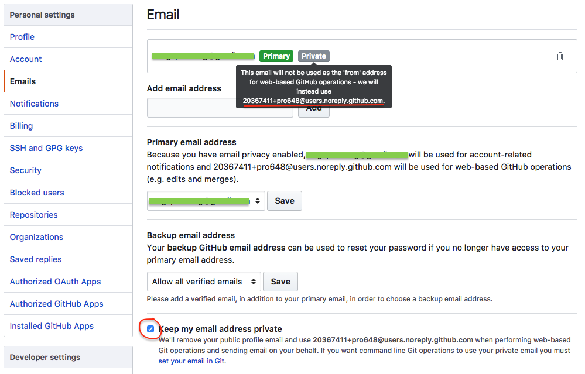
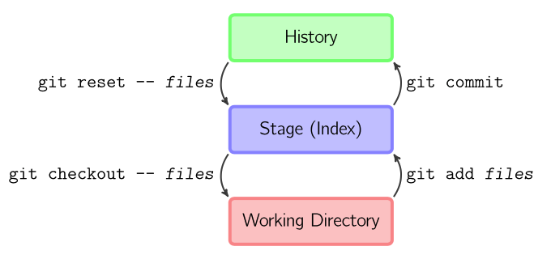
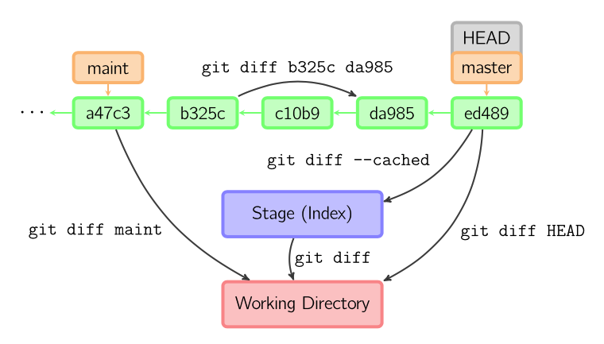
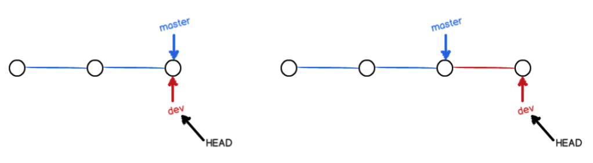
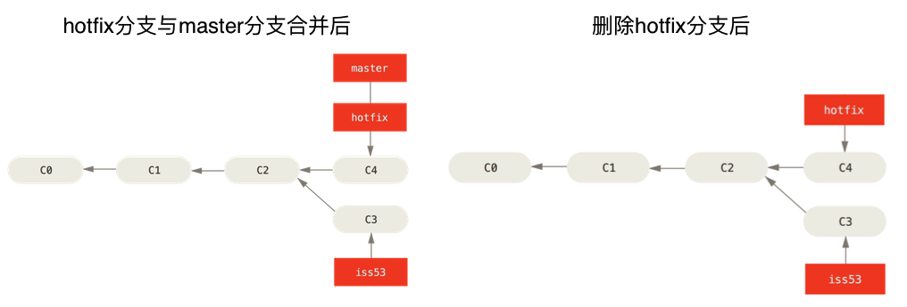
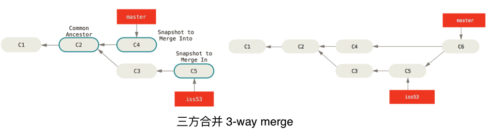
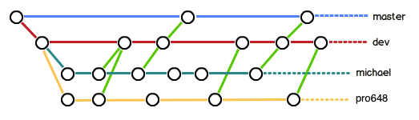
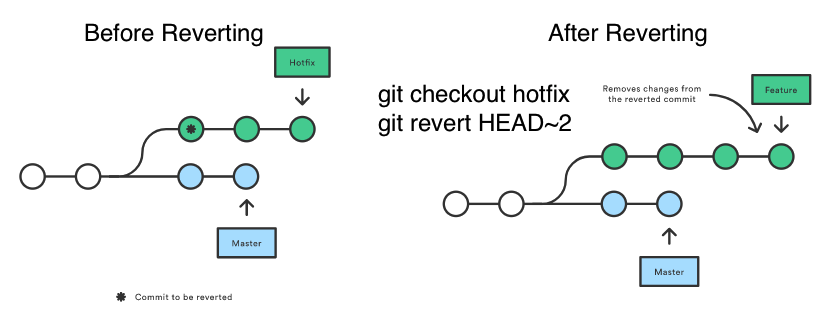
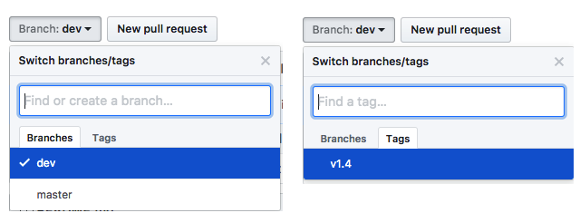
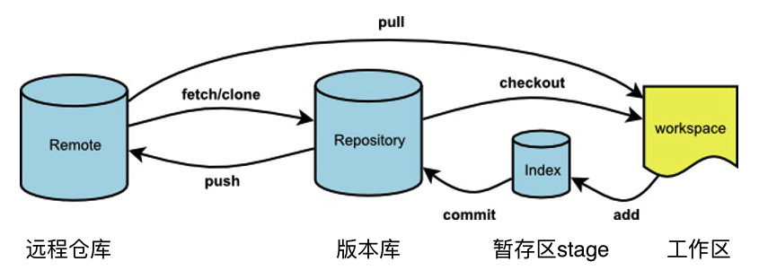

Git是目前最流行的版本管理系统，也是最先进的分布式版本控制系统(distributed version control system）。最初由Linux操作系统内核的创造者Linus Benedict Torvalds在2005年开发。现已有大量软件项目依赖Git进行版本管理，包括开源项目和各种商业软件。在开发者中拥有良好声誉，目前支持绝大多数的操作系统及IDE（Integrated Development Environment）。

相对于集中式版本控制系统中的SVN（Subversion的简写），分布式版本控制系统的Git优势众多。如：Git版本库占用空间小，分支只是各个提交点hash值的集合，几乎不占用空间；每个人的电脑内都有完整的版本库，不需要时刻与中央服务器交互；速度快等。

## 目录：

1. [使用brew安装、更新Git](#1) 
2. [配置Git](#2)
3. [创建版本库](#3)
 - 3.1 [创建本地仓库](#3.1)
 - 3.2 [克隆项目](#3.2)
4. [工作流](#4)
5. [添加文件与提交更新](#5)
 - 5.1 [查看仓库状态](#5.1)
 - 5.2 [查看修改内容](#5.2)
6. [分支](#6)
 - 6.1 [分支的用法](#6.1)
 - 6.2 [创建分支](#6.2)
 - 6.3 [合并分支](#6.3)
 - 6.4 [解决合并冲突](#6.4)
 - 6.5 [分支策略](#6.5)
7. [储藏工作](#7)
8. [同步更改](#8)
 - 8.1 [如何同步更改](#8.1)
     - 8.1.1 [远程分支](#8.1.1)
     - 8.1.2 [取回更新](#8.1.2)
     - 8.1.3 [取回更新同时与本地分支合并](#8.1.3)
     - 8.1.4 [推送更新到远程仓库](#8.1.4)
 - 8.2 [具体应用示例](#8.2)
9. [查阅历史](#9)
10. [撤销修改](#10)
 - 10.1 [撤销对文件的修改](#10.1)
     - 10.1.1 [检出指定`commit`文件](#10.1.1)
     - 10.1.2 [分离状态的HEAD](#10.1.2)
 - 10.2 [撤销暂存的文件](#10.2)
 - 10.3 [Reset使用方法](#10.3)
 - 10.4 [修改最后的提交](#10.4)
 - 10.5 [修改多个提交信息](#10.5)
 - 10.6 [删除未跟踪文件](#10.6)
11. [撤销公共分支上提交](#11)
12. [使用pull request](#12)
13. [标签管理](#13)
 - 13.1 [创建标签](#13.1)
     - 13.1.1 [轻量标签](#13.1.1)
     - 13.1.2 [为历史提交打标签](#13.1.2)
     - 13.1.3 [附注标签](#13.1.3)
 - 13.2 [共享标签](#13.2)
14. [别名alias](#14)
15. [总结](#总结)

<a id="1">

## 1. 使用brew安装、更新Git

</a>

Mac和Linux一般预装了Git，可以通过在terminal中输入下面命令查看Git版本：

```
$ git --version
```

回车后会显示如下信息。如果没有显示，说明你的电脑没有安装Git。

```
git version 2.10.1 (Apple Git-78)
```

一般系统自带的Git版本比较旧，如果想要使用最新版本Git，推荐使用Homebrew安装最新版本的Git，如果你还没有安装Homebrew，只需要在终端（terminal）中输入如下命令：

```
$ /usr/bin/ruby -e "$(curl -fsSL https://raw.githubusercontent.com/Homebrew/install/master/install)"
```

如果已经安装了Homebrew，先更新Homebrew：

```
$ brew update
```

使用brew安装Git：

```
$ brew install git
```

现在，通过`git --version`命令查看Git版本，会发现版本没有变化。在terminal输入如下命令：

```
$ which git
```

执行结果是`/usr/bin/git`，说明默认调用的是系统内置Git。

将默认调用的Git修改为刚才安装的Git：

```
$ brew link --force git
```

退出终端，重新打开终端。输入如下命令：

```
$ git --version
```

输出如下：

```
git version 2.14.2
```

至此，最新版本Git安装成功。此时，在terminal中输入`which git`，输出如下：

```
/usr/local/bin/git
```

如果以后需要更新Homebrew，在terminal输入如下命令：

```
$ brew update
```

如果需要更新Git，在terminal输入如下命令：

```
$ brew upgrade git
```

上面命令如果不写`git`，brew会更新由其安装的所有软件包。也可以将上面的命令合并为一行，如下所示：

```
$ brew update && brew upgrade git
```

> 在安装新版本软件包后，brew默认不会卸载低版本软件包，使用`brew cleanup <软件包名称>`命令可以移除它们，或使用`brew cleanup`一次移除所有低版本软件包。另外，使用`brew cleanup -n`命令可以看到哪些软件包将会被移除。
>
> 如果没有卸载所有版本的安装包，只卸载了最新版，在运行`brew upgrade --all`命令时，Homebrew会将所有软件升级到最新版。如果想要彻底移除软件包，可以使用`brew uninstall <formula> --force`命令。

如果需要在Windows、Linux上安装、更新Git，点击[这里](https://git-scm.com/book/zh/v2/%E8%B5%B7%E6%AD%A5-%E5%AE%89%E8%A3%85-Git)。

<a id="2">

</a>

## 2. 配置Git

配置你的用户名和电子邮件地址是非常必要的，因为每个Git提交都将使用这些信息标记作者、提交者。

查看当前用户名：

```
$ git config --global user.name
```

设置用户名：

```
$ git config --global user.name "YOUR_USERNAME"
```

查看当前电子邮件地址：

```
$ git config --global user.email
```

设置电子邮件地址：

```
$ git config --global user.email "email_address@example.com"
```

上面的配置是全局的（global），因此，只需要配置一次。

有以下三个层级的`git config`：

- 项目层级project`git config user.name "name"`：配置只对当前项目有效，配置信息存储在`.git/config`目录。
- 全局层级global`git config --global user.name "name"`：配置对当前用户的所有项目有效，配置信息存储在`~/.gitconfig`目录。
- 系统层级system`git config --system user.name "name"`：配置对所有用户、所有项目有效，配置信息存储在`/etc/gitconfig`目录。

为了确保你的提交呈现在你的贡献图（contribution graph)中，需要使用GitHub验证的邮件地址进行提交；如果想要保护自己的隐私，可以使用GitHub提供的`no-reply`邮件地址进行提交。使用其它邮件地址进行的提交，将不能显示在你的contributions面板中。通过如下命令查看配置信息：

```
$ git config --global --list
```

可以在Github的*Settings* > *Emails*中查看`no-replay`邮件地址，如下图所示。如果没有显示`no-replay`邮件地址，先取消勾选*Keep my email address private*选项、再次勾选上述选项，`no-reply`邮件地址将会显示。



> 可以通过在commit网址最后添加`.patch`查看该提交的配置信息，[查看示例](https://github.com/pro648/BasicDemos-iOS/commit/23f6fdeb931a1f6f8f596f3411ef34e0e2b088da.patch)。

<a id="3">

</a>

## 3. 创建版本库

版本库（repository）又名仓库，可以简单理解成一个目录，该目录内所有文件都可以由Git管理。Git可以跟踪目录内每个文件的修改、删除，以便任何时刻都可以追踪历史、「还原」历史。

<a id="3.1">

</a>

### 3.1 创建本地仓库

设置当前路径为桌面，在桌面上创建一个名为`LearnGit`的文件夹。命令如下：

```
$ cd ~/Desktop
$ mkdir LearnGit
```

设置当前路径为新建的`LearnGit`目录，并创建本地仓库：

```
$ cd LearnGit
$ git init
Initialized empty Git repository in /Users/ad/Desktop/LearnGit/.git/
```

Git瞬间就建好了仓库，打开`LearnGit`文件夹，可以看到当前目录下多了一个`.git`目录，`.git`目录是用来跟踪管理版本库的。一般，不要手动修改这个目录内的文件，否则可能损坏Git版本库。

上面命令也可以用下面命令行替换：

```
$ git init ~/Desktop/LearnGit
$ cd ~/Desktop/LearnGit
```

<a id="3.2">

</a>

### 3.2 克隆项目

通过上面说到的`git init`命令，可以创建本地仓库。如果远程仓库已经存在，创建仓库的最佳方法是直接克隆远程仓库，这样本地分支与远程分支会建立追踪关系，同步获得远程仓库标签等信息。

```
$ git clone <版本库地址> <本地目录名>
```

如果没有`git clone`命令第二个参数，则克隆得到的仓库与远程仓库同名。

如果是从本地仓库克隆，命令格式为：`git clone /path/to/repository`。

如果是从远端服务器上克隆，命令如下：

```
// 通过ssh
$ git clone username@host:/path/to/repository

// 通过https
$ git clone https:/path/to/repository.git
```

通过`git clone https://github.com/pro648/tips.wiki.git`命令，可以将本文所在仓库clone到你的电脑。

<a id="4">

</a>

## 4. 工作流

本地仓库由Git维护的三颗「树」组成，第一个是工作目录，即工作中看到的文件；第二个是暂存区（Index，Stage），它是预期的下一次提交；最后是History，保存提交历史。



<a id="5">

</a>

## 5. 添加文件与提交更新

在`LearnGit`目录内添加`README.md`文件，并添加如下内容：

```
git is a distributed version control system.
Git is a free software.
```

既可以手动添加上述文件和内容，也可以在终端使用vim添加：

```
vim README.md
```

> 进入vim编辑模式后，可以使用方向键或`h,l,k,j`移动光标，使用`o`在当前行后插入一行，使用`dd`删除当前行，键入`i`进入编辑模式。编辑结束后，按`esc`退出编辑状态，键入`:`进入命令模式，键入`wq`保存并退出，键入`w!`直接退出。

<a id="5.1">

</a>

### 5.1 查看仓库状态

现在，运行`git status`命令查看仓库状态：

```
$ git status
On branch master

No commits yet

Untracked files:
  (use "git add <file>..." to include in what will be committed)

	README.md

nothing added to commit but untracked files present (use "git add" to track)
```

上面显示`README.md`被修改过了，且还未被跟踪，目前暂存区没有需要提交的修改。

通过`git add <file>`可以跟踪文件，并将文件添加至暂存区：

```
$ git add README.md
```

> 通过`git rm <file>`可以移除跟踪的文件。

许多命令会花费一些时间执行，然而中间不会给出任何提示或进度条。一般结束后会出现一个「UserName$」的标记。如果没有出现，那么说明最后一条命令正在执行。如果执行出错或命令有错，会出现提示。

再运行`git status`查看当前仓库状态：

```
$ git status
On branch master

No commits yet

Changes to be committed:
  (use "git rm --cached <file>..." to unstage)

	new file:   README.md

```

上面显示`README.md`在暂存区中，将处于下一次提交的快照中。

提交修改：

```
$ git commit -m "add distributed"
[master (root-commit) d1d8ecf] add distributed
 1 file changed, 2 insertions(+)
 create mode 100644 README.md
```

提交后，使用`git status`命令查看仓库当前状态：

```
$ git status
On branch master
nothing to commit, working tree clean
```

可以看到当前没有需要提交的修改，且工作目录是干净的（working tree clean）。

<a id="5.2">

</a>

### 5.2 查看修改内容

如果`git status`命令的输出对于你来说过于模糊，你想知道具体修改了什么地方，可以使用`git diff`命令。这个命令通常用来回答两个问题：当前做的哪些更新还未暂存？有哪些更新已经暂存还未提交？`git status`通过列出文件名的方式回答了这个问题，`git diff`将通过文件补丁的格式显示文件那些行发送了变化、具体变化是什么。

修改`README.md`文件如下：

```
git is a free distributed version control system.
Git is a free software distributed under the GPL.
```

使用`git diff`命令，查看具体修改了哪些内容：

```
$ git diff README.md
diff --git a/README.md b/README.md
index 8540431..54479c9 100644
--- a/README.md
+++ b/README.md
@@ -1,2 +1,2 @@
 git is a distributed version control system.
-Git is a free software.
+Git is a free software distribted under the GPL.
```

`git diff`比较的是工作目录中文件和暂存区域内文件的差异，也就是修改之后还没有暂存起来的修改。

提交修改和提交新文件步骤一样，第一步是`git add <file>`，第二部是`git commit -m "<distriptive message>"`。这两步可以合并为一步，如下所示：

```
$ git commit -a -m "append GPL"
[master ddc64f2] append GPL
 1 file changed, 1 insertion(+), 1 deletion(-)
```

> `git commit -a -m "<distriptive message>"`只对已跟踪的文件有效，且一次提交所有已修改、未暂存的文件。

有多种方法查看两次提交间的差异。

- `git diff`：工作目录与暂存区差异。如果文件还未被跟踪，则无法查看。
- `git diff HEAD`：工作目录、暂存区与当前分支最近一次提交（HEAD）的差异。
- `git diff --staged`：暂存区与HEAD间差异。在低版本的Git中，使用的是`git diff --cached`命令。
- `git diff <commit>`：当前目录与`commit`快照间差异。

> 如果想要查看具体某个文件的变化，只需要在命令最后添加`-- <file>`即可。其中，`--`用于标记后面是文件名称，不是分支名称。如`git diff --staged -- README.md`命令查看暂存区与HEAD间`README.md`差异。

如下图所示：



<a id="6">

</a>

## 6. 分支

在很多版本控制系统中，创建分支是一个略微低效的过程，因为常常需要创建源代码的副本。而Git的分支则被称为「必杀技特性」，因为使用Git创建分支时，如`dev`分支，Git只是创建了一个指针叫`dev`，指向与`master`相同的提交，再把`HEAD`指向`dev`，就表示当前在`dev`分支上。

在这一过程中，只增加了一个`dev`指针，修改了`HEAD`的指向，工作区文件没有任何变化，所以Git创建分支速度非常快。

从现在开始，对工作目录的修改和提交就是针对`dev`分支了，如提交一次后，`dev`指针往前移动一步，而`master`指针不变。



<a id="6.1">

### 6.1 分支的用法

</a>

列出仓库中所有分支：

```
$ git branch
```

创建一个名为`branch`的分支，但不会自动切换到`branch`分支上：

```
git branch <branch>
```

切换到`branch`分支：

```
git checkout <branch>
```

在当前分支上创建`branch`分支，同时切换到`branch`分支：

```
git checkout -b <branch>
```

删除`branch`分支（这是一个安全操作，Git会阻止删除包含未合并更改的分支）：

```
git branch -d <branch>
```

忽略未合并的更改，强制删除`branch`分支：

```
git branch -D <branch>
```

将当前分支重命名为`branch`：

```
git branch -m <branch>
```

在`current_branch`分支上创建`new_branch`分支，并切换到`new_branch`分支：

```
git checkout -b <new_branch> <current_branch>
```

<a id="6.2">

### 6.2 创建分支

</a>

现在，看一个简单的新建分支、合并分支的例子。

1. 开发app。
2. 为实现一个新的需求，创建一个分支。
3. 在刚创建的分支上开展工作。

正在此时，接到通知需要立即修复一个很严重的bug，你将按照下面方式来处理。

1. 切换到你的线上分支（production branch）。
2. 为这个修补任务新建一个分支，并在其中修复bug。
3. 通过测试后，切换回线上分支，然后合并这个修补分支，最后推送到线上分支。
4. 删除修改bug创建的分支。切换回最初工作的分支上，继续工作。

继续在刚才的仓库中工作。现在，需要解决问题追踪系统中的`#53`问题，需要新建一个分支，并切换到该分支上：

```
$ git checkout -b iss53
Switched to a new branch 'iss53'
```

使用`git branch`查看当前所有分支：

```
$ git branch
* iss53
  master
```

分支前有`*`标记的是当前分支。

现在，就可以在`iss53`分支上进行提交。比如在`README.md`底部添加“Creating a new branch is quick.”字符串并提交：

```
$ vim README.md
$ git commit -a -m "added a new footer [iss53]"
[iss53 0e3cef5] added a new footer [iss53]
 1 file changed, 1 insertion(+)
```

`iss53`分支随着工作的进展向前推进。


有了Git分支的帮助，你只需要在`master`分支上创建一个分支，用于修复bug，最后将该分支合并到`master`分支。

但是，在切换到其它分支前，需要确保当前分支工作目录、暂存区是干净的，否则可能会和你即将检出的分支产生冲突，从而阻止Git切换到该分支。可以通过`git stash`保存进度，也可以用`git commit --amend`修补提交。

在`master`分支上创建一个`hotfix`分支，在该分支上解决问题。

> 当切换分支时，Git会重置工作目录，自动删除、添加、修改文件以确保此时的工作目录和你在该分支最后一次提交时一致。

```
// 在master分支上创建hotfix分支，并切换到hotfix分支。
$ git checkout -b hotfix master
Switched to a new branch 'hotfix'

// 编辑README.md文件。
$ vim README.md

// 查看修改内容。
$ git diff -- README.md
diff --git a/README.md b/README.md
index 54479c9..9ee0b90 100644
--- a/README.md
+++ b/README.md
@@ -1,2 +1,2 @@
-git is a distributed version control system.
+Git is a distributed version control system.
 Git is a free software distribted under the GPL.
$ git commit -a -m "fix bug by github.com/pro648"
[hotfix 2384bc0] fix bug by github.com/pro648
 1 file changed, 1 insertion(+), 1 deletion(-)
```


<a id="6.3">

### 6.3 合并分支

</a>

运行测试、确保修改无误后，使用`git merge`将其合并回`master`分支，以便部署到线上。

```
// 1.切换到master分支。
$ git checkout master
Switched to branch 'master'

// 2.将hotfix分支合并到master分支。
$ git merge hotfix
Updating ddc64f2..2384bc0
Fast-forward
 README.md | 2 +-
 1 file changed, 1 insertion(+), 1 deletion(-)

// 3.删除hotfix分支。
$ git branch -d hotfix
Deleted branch hotfix (was 2384bc0).
```

在注释2合并部分，可以看到快进（Fast-forward）这个词。由于`master`分支指向的提交是`hotfix`分支提交的直接上游，所以，Git只是简单的将指针向前移动。也就是：试图合并两个分支时，如果顺着一个分支走下去，能够到达另一个分支，那么Git在合并两者时，只会简单的将指针向前推进（右移），因为这种合并没有要解决的冲突（conflict），称为快进（fast-forward）。




现在，切换回`iss53`分支，在`README.md`底部添加“Git has a mutable index called stage.“。

```
// 1.切换至iss53分支。
$ git checkout iss53
Switched to branch 'iss53'

// 2.编辑README.md，并添加至暂存区。
$ vim README.md
$ git add .

// 3.查看暂存区中README.md文件修改。
$ git diff --staged README.md
diff --git a/README.md b/README.md
index fcc124d..f736861 100644
--- a/README.md
+++ b/README.md
@@ -1,3 +1,4 @@
 git is a distributed version control system.
 Git is a free software distribted under the GPL.
 Creating a new branch is quick.
+Git has a mutable index called stage.

// 4.提交修改。
$ git commit -m "finished the new footer [iss53]"
[iss53 f81669a] finished the new footer [iss53]
 1 file changed, 1 insertion(+)
```

> `git add <file>`命令中的`file`可以使用`.`代替，即`git add .`用以表示添加所有新建、修改的文件到暂存区。

假设你已经修正了`iss53`问题，现在要把你的工作并入`master`分支。

这里的合并与`hotfix`分支合并类似。首先，检出到你想要并入的分支，然后运行`git merge`命令：

```
// 1.检出master分支。
$ git checkout master
Switched to branch 'master'

// 2.将iss53分支与master分支合并。
$ git merge iss53
Auto-merging README.md
Merge made by the 'recursive' strategy.
 README.md | 2 ++
 1 file changed, 2 insertions(+)

// 3.删除iss53分支。
$ git branch -d iss53
Deleted branch iss53 (was f81669a).
```

这和你之前合并`hotfix`分支有些不同。现在这种情况下，你的分支历史从一个更早的地方开始分叉开来（diverged）。`master`分支所在提交并不是`iss53`分支所在提交的直接祖先，Git需要做一些额外的工作。遇到这种情况Git会使用分支末端所指的快照（`C4`和`C5`）以及这两个分支的祖先（`C2`），做一个三方合并(3-way merge），三方合并的结果是产生一个新的快照并且自动创建一个新的提交指向它，被称为一次合并提交，其特别之处在于它有不止一个父提交。



<a id="6.4">

### 6.4 解决合并冲突

</a>

如果你在两个不同的分支中，对同一个文件的同一个部分进行了不同的修改，Git在合并时将产生冲突（conflict），不能自动合并。

假设，修复bug的`hotfix`分支修改的是第二行的内容，这样合并时就会产生冲突。

```
$ git merge iss53
Auto-merging README.md
CONFLICT (content): Merge conflict in README.md
Automatic merge failed; fix conflicts and then commit the result.
```

此时，Git做了合并，但是没有自动创建一个新的合并提交。Git会暂停下来，等待你去解决合并过程中产生的冲突。

使用`git status`命令查看因包含冲突而处于未合并（unmerged）状态的文件。使用`git diff`查看具体冲突部分。

```
// 1.查看哪些文件产生了合并冲突。
$ git status
On branch master
You have unmerged paths.
  (fix conflicts and run "git commit")
  (use "git merge --abort" to abort the merge)

Unmerged paths:
  (use "git add <file>..." to mark resolution)

	both modified:   README.md

no changes added to commit (use "git add" and/or "git commit -a")

// 2.查看冲突明细。
$ git diff
diff --cc README.md
index 582c321,6630dce..0000000
--- a/README.md
+++ b/README.md
@@@ -1,2 -1,4 +1,8 @@@
  Git is a distributed version control system.
++<<<<<<< HEAD
 +Git is a free software distributed under the GPL.
++=======
+ git is a free software distributed under the GPL.
+ Creating a new branch is quick.
+ Git has a mutable index called stage.
++>>>>>>> iss53
```

打开有冲突文件，手动解决冲突部分，最后记得删除`<<<<<<<`、`=======`、`>>>>>>>`这些行。

解决冲突后，使用`git add`添加文件、`git commit`提交更改。

<a id="6.5">

</a>

<a id="Branch">

### 6.5 分支策略

在实际工作中，许多使用Git的开发者都喜欢用这种方式开展工作，比如仅在`master`分支中保留完全稳定的代码，即已经发布的代码。与此同时，还有一个名为`dev`或`next`的平行分支，专门用于后续的开发，或仅用于稳定性测试。每个人都在自己的分支上工作，工作完成将自己的分支与`dev`分支合并，一旦进入到某种稳定状态，便可以把`dev`分支合并到`master`分支中。

这样，在确保这些特性分支（短期分支，如之前的`iss53`分支）能够通过所有测试，并且不会引入更多错误之后，就可以并入主干分支，等待下一次的发布。



</a>

<a id="7">

</a>

## 7. 储藏工作

你正在项目中进行某些工作（工作目录、暂存区处于一个混乱的状态），接到通知需要切换到其它分支工作，而你不想提交当前分支还未完成的工作。如果工作目录、暂存区有未提交的修改时，不能切换分支，否则，修改会被携带至切换到的分支。这种情况下，就需要使用`git stash`命令储藏（stash）当前分支工作进度，储藏的工作进度随时可以恢复。

> `git stash`命令储藏的工作进度会被保存到一个未完结变更的堆栈中，随时可以重新应用。

临时保存所有已跟踪文件在工作目录、暂存区修改：

```
$ git stash
// 等同于
$ git stash push
```
> Git 2.13.1版本添加了`git stash push`命令，用来替换`git stash save`命令。在2.16版本已不推荐使用`git stash save`命令。

使用`git stash`保存的工作，默认使用下面名称格式：

```
stash@{1}: WIP on master: 74b93dd Initial commit
```

保存更改时，还可以使用更具说明性描述：

```
$ git stash push -m "保存内容的说明"
// 保存内容如下：
stash@{0}: On master: 保存内容的说明
```

临时保存所有文件的更改，包括未跟踪文件更改：

```
$ git stash --include-untracked
// 或者
$ git stash -u
```

列出所有被stash的更改：

```
$ git stash list
```

重新应用`stash@{n}`的储藏（字母`n`表示哪一次储藏，最近一次储藏是`0`）：

```
$ git stash apply stash@{n}
```

重新应用`stash@{n}`的储藏，`--index`选项表示重新应用暂存区的变更。如果不添加该选项，所有修改都被应用到工作目录；使用了该选项，工作目录、暂存区的修改会分别恢复到工作目录、暂存区。如下所示：

```
$ git stash apply stash@{n} --index
```

使用`git stash apply`重新应用的储藏仍然存在于栈上，`git stash drop`命令可以移除指定储藏，默认移除最近一个储藏：

```
$ git stash drop stash@{0}
```

移除所有储藏：

```
$ git stash clear
```

恢复指定stash的同时，移除该stash：

```
$ git stash pop stash@{n}
```

列出指定储藏文件变化：

```
$ git stash show stash@{n}
```

列出指定储藏内容变化：

```
$ git stash show -p stash@{n}
```

使用指定stash创建分支，并删除该stash：

```
$ git stash branch <branchname> stash@{n}
```

> 如果运行`git stash push`的分支已经发生了变化，运行`git stash apply`会因冲突而失败。该命令会以运行`git stash`时HEAD commit为基础，创建<branchname>分支并恢复至储藏时的状态。

> 所有可以附带`stash@{n}`选项的命令，没有附带`stash@{n}`选项时均使用最近一次储藏。

上面的问题都已解决，我们继续在`master`分支工作。如下所示：

```
// 1.查看仓库状态。应该养成开始工作前查看仓库状态的好习惯。
$ git status
On branch master
nothing to commit, working tree clean

// 2.编辑README.md，并查看修改内容。
$ vim README.md
$ git diff -- README.md
diff --git a/README.md b/README.md
index 400697d..70a528e 100644
--- a/README.md
+++ b/README.md
@@ -2,3 +2,4 @@ Git is a distributed version control system.
 Git is a free software distribted under the GPL.
 Creating a new branch is quick.
 Git has a mutable index called stage.
+Git tracks changes of files.
```

根据上面说到的[分支策略](#Branch)，创建一个`dev`分支，用于主要的开发。

```
// 1.创建并切换至dev分支。
$ git checkout -b dev
Switched to a new branch 'dev'

// 2.编辑README.md文件，并查看具体修改。
$ vim README.md
$ git diff -- README.md
diff --git a/README.md b/README.md
index 400697d..81821e3 100644
--- a/README.md
+++ b/README.md
@@ -2,3 +2,4 @@ Git is a distributed version control system.
 Git is a free software distribted under the GPL.
 Creating a new branch is quick.
 Git has a mutable index called stage.
+Git tracks changes.

// 3.提交修改。
$ git commit -a -m "git tracks changes"
[dev 5c10def] git tracks changes
 1 file changed, 1 insertion(+)

// 4.编辑README.md，并查看具体修改。
$ vim README.md
$ git diff -- README.md
diff --git a/README.md b/README.md
index 81821e3..70a528e 100644
--- a/README.md
+++ b/README.md
@@ -2,4 +2,4 @@ Git is a distributed version control system.
 Git is a free software distribted under the GPL.
 Creating a new branch is quick.
 Git has a mutable index called stage.
-Git tracks changes.
+Git tracks changes of files.
```

正在修改`README.md`文件的过程中，你需要切换到`master`分支修复bug，这时就需要使用`git stash`命令储藏工作目录：

```
$ git stash
Saved working directory and index state WIP on dev: 5c10def git tracks changes
```

切换至`master`分支，工作完成后再切换回`dev`分支，恢复之前的储藏。

```
// 1.切换至master分支。
$ git checkout master
Switched to branch 'master'

// 2.编辑README.md，并查看具体修改。
$ vim README.md
$ git diff -- README.md
diff --git a/README.md b/README.md
index 400697d..f30b025 100644
--- a/README.md
+++ b/README.md
@@ -1,4 +1,4 @@
 Git is a distributed version control system.
 Git is a free software distribted under the GPL.
-Creating a new branch is quick.
+Creating a new branch is quick $ simple.
 Git has a mutable index called stage.

// 3.提交修改。
$ git commit -a -m "AND simple"
[master 7374fa0] AND simple
 1 file changed, 1 insertion(+), 1 deletion(-)

// 4.切换到dev分支。
$ git checkout dev
Switched to branch 'dev'

// 5.查看储藏列表。
$ git stash list
stash@{0}: WIP on dev: 5c10def git tracks changes

// 6.应用最近一次stash，并自动删除该储藏。
$ git stash pop
On branch dev
Changes not staged for commit:
  (use "git add <file>..." to update what will be committed)
  (use "git checkout -- <file>..." to discard changes in working directory)

	modified:   README.md

no changes added to commit (use "git add" and/or "git commit -a")
Dropped refs/stash@{0} (ccc0dddda77048b6b9e7f7c7ceb656290a4c3f0a)
```

> 同一个分支，可以多次使用`git stash`进行储藏。

<a id="8">

</a>

## 8. 同步更改

Git是分布式版本控制系统，客户端并不是只提取最新版本的快照，而是把代码仓库完整的镜像下来。因此，任何一处协同工作的服务器发生故障，事后都可以用其它镜像出来的本地仓库恢复。因为每一次同步操作，实际上都是对代码仓库的完整备份。


<a id="8.1">

</a>

### 8.1 如何同步更改

<a id="8.1.1">

</a>

#### 8.1.1 远程分支

列出所有远程主机：

```
$ git remote
```

查看远程主机网址：

```
$ git remote -v
```

查看主机详细信息：

```
$ git remote show <主机名>
```

添加远程主机：

```
$ git remote add <主机名> <网址>
```

删除远程主机：

```
$ git remote rm <主机名>
```

修改远程主机名称：

```
$ git remote rename <原主机名> <新主机名>
```

<a id="8.1.2">

</a>

#### 8.1.2 取回更新

将远程主机的指定分支更新取回本地，忽略分支名则取回所有分支的更新：

```
$ git fetch <远程主机名> <分支名>
```

> `git fetch`命令通常用来查看他人的工作进度，因为取回的代码对你本地的开发代码没有任何影响。要在本地查看所取回的更新，需要使用`git checkout <远程主机名>/<分支名>`形式读取。

`-r`选项用以标记查看远程分支，`-a`选项标记查看所有分支：

```
$ git branch -r
origin/master

$ git branch -a
* master
  remotes/origin/master
```

在取回的远程主机`origin/master`基础上，创建一个新的分支`newBranch`：

```
$ git checkout -b newBranch origin/master
```

在本地分支上合并远程分支：

```
$ git merge origin/master
// 或者
$ git rebase origin/master
```

<a id="8.1.3">

</a>

#### 8.1.3 取回更新同时与本地分支合并

取回指定远程主机的指定分支的更新，再与本地的指定分支合并。如果远程分支与当前分支合并，则本地分支名部分可以省略。如下：

```
$ git pull <远程主机名> <远程分支名>:<本地分支名>
```

> 如果当前分支与远程分支存在追踪关系，则可以省略远程分支名，如：`git pull origin`。
>
> 如果当前只有一个追踪分支，则主机名也可以省略，即：`git pull`。

事实上，上面的取回、合并与下面两个命令效果相同，只是将两个命令合并为一个命令。

```
$ git fetch origin <远程分支名>
$ git merge origin/<远程分支名>
```

如果使用`git clone`创建的仓库，Git会自动在本地分支`master`和远程分支`origin/master`间建立追踪关系（tracking）。

Git也允许手动建立追踪关系：

```
$ git branch --set-upstream-to <远程主机名>/<远程分支名> <本地分支名>
```

如果省略了最后一项的`<本地分支名>`，则默认将当前本地分支与指定远程分支建立追踪关系。

<a id="8.1.4">

</a>

#### 8.1.4 推送更新到远程仓库

`git push`用于将本地分支更新，推送到远程仓库（格式与`git pull`有些像）：

```
$ git push <远程主机名> <本地分支名>:<远程分支名>
```

> 分支推送、拉取顺序是`<来源地>:<目的地>`，所以，`git pull`是`<远程分支>:<本地分支>`；`git push`是`<本地分支>:<远程分支>`。
>
> 如果省略远程分支名，则表示将本地分支推送至与其存在追踪关系的远程分支，如果该远程分支不存在，则会自动创建。即：`git push <远程主机名> <本地分支名>`。
>
> 如果当前分支与远程分支间存在追踪关系，则本地分支和远程分支都可以省略，即`git push <远程主机名>`。
>
> 如果当前分支只有一个追踪分支，则可以忽略掉主机名。即：`git push`。

删除指定远程主机的指定远程分支：

```
$ git push <远程主机名> :<远程分支名>
// 或者
$ git push <远程主机名> --delete <远程分支名>
```

> 推送时省略本地分支名等效于删除指定远程分支，因为这等同于推送一个空的本地分支到远程分支。

`-u`选项表示推送本地更新的同时，指定`origin`为默认主机：

```
$ git push -u origin <本地分支名>:<远程分支名>
```

不带任何参数的`git push`默认只推送当前分支，称为simple方式。此外，还有matching方式，matching方式默认推送所有有追踪关系的本地分支。Git 2.0版本之前，默认使用matching方式，现在默认使用simple方式。如需修改，使用如下命令：

```
$ git config --global push.default matching
$ git config --global push.default simple
```

将本地所有分支推送到远程主机，不考虑是否存在对应远程分支：

```
$ git push --all <远程主机名>
```

强制推送本地更新到远程主机：

```
$ git push --force <远程主机名>
```

如果远程主机版本比本地版本更新，推送时Git会报错，要求先取回更新在本地合并，然后再推送到远程主机。这时，如果你一定要推送，可以使用`--force`选项。使用`--force`选项进行推送时，会导致远程主机上内容被覆盖，应尽量避免使用`--force`选项，除非你特别确定。

<a id="8.2">

</a>

### 8.2 具体应用示例

Git仓库可以分布到不同设备上，不同设备间可以相互同步。每台设备上的版本库都是一样的，没有主次之分。

可以把GitHub当作我们的远程仓库，与本地仓库同步。

在GitHub创建一个名为`LearnGit`的空仓库，与本地`LearnGit`仓库同步。

> 如果你是第一次在terminal里连接GitHub仓库，还需要创建SSH Key，把公钥添加至GitHub，具体方法可以点击[这里](https://help.github.com/articles/connecting-to-github-with-ssh/)查看。

将刚创建的仓库添加为远程主机，并把本地`master`分支推送至远程仓库。在开始这些工作前，先将`dev`分支当前工作目录stash。

```
// 1.储藏工作目录，查看储藏列表。
$ git stash
Saved working directory and index state WIP on dev: 5c10def git tracks changes
$ git stash list
stash@{0}: WIP on dev: 5c10def git tracks changes

// 2.切换至master分支。
$ git checkout master
Switched to branch 'master'

// 3.添加远程主机，查看远程主机网址。
$ git remote add origin https://github.com/pro648/LearnGit
$ git remote -v
origin	https://github.com/pro648/LearnGit (fetch)
origin	https://github.com/pro648/LearnGit (push)

// 4.推送master分支到远程仓库。
$ git push -u origin master:master
Counting objects: 21, done.
Delta compression using up to 4 threads.
Compressing objects: 100% (14/14), done.
Writing objects: 100% (21/21), 1.66 KiB | 848.00 KiB/s, done.
Total 21 (delta 8), reused 0 (delta 0)
remote: Resolving deltas: 100% (8/8), done.
To https://github.com/pro648/LearnGit
 * [new branch]      master -> master
Branch master set up to track remote branch master from origin.
```

注释3中，远程主机的网址应为你自己GitHub仓库地址，否则无法推送。

现在，在GitHub仓库中已经可以看到推送的更新。

> 远程仓库名字`origin`与分支名字`master`一样，在Git中并没有特殊含义。`master`是运行`git init`时默认的起始分支名字，`origin`是运行`git clone`时默认的远程仓库名字。如果使用`git clone -o pro648 <url>`克隆仓库，默认远程分支名字将会是`pro648/master`。

查看后发现，因为行间没有空行，markdown会将所有语句显示为一段，在网页中编辑`README.md`，为每一行后添加一空行。

继续进行下面工作：

```
// 1.查看当前分支。
$ git branch
* dev
  master

// 2.查看储藏列表。并应用第一个储藏。
$ git stash list
stash@{0}: WIP on dev: 5c10def git tracks changes
$ git stash pop stash@{0}
On branch dev
Changes not staged for commit:
  (use "git add <file>..." to update what will be committed)
  (use "git checkout -- <file>..." to discard changes in working directory)

	modified:   README.md

no changes added to commit (use "git add" and/or "git commit -a")
Dropped stash@{0} (a53db95efe7dca21241ae1061244b903c9511f79)

// 3.恢复储藏后，查看修改，并提交。
$ git diff -- README.md
diff --git a/README.md b/README.md
index 81821e3..70a528e 100644
--- a/README.md
+++ b/README.md
@@ -2,4 +2,4 @@ Git is a distributed version control system.
 Git is a free software distribted under the GPL.
 Creating a new branch is quick.
 Git has a mutable index called stage.
-Git tracks changes.
+Git tracks changes of files.
$ git commit -a -m "changes of files"
[dev 4fe42e8] changes of files
 1 file changed, 1 insertion(+), 1 deletion(-)

// 4.切换到master分支，将dev分支合并到master分支。
$ git checkout master
Switched to branch 'master'
Your branch is up-to-date with 'origin/master'.
$ git merge dev
Auto-merging README.md
Merge made by the 'recursive' strategy.
 README.md | 1 +
 1 file changed, 1 insertion(+)

// 5.推送更新到远程仓库。
$ git push
To https://github.com/pro648/LearnGit
 ! [rejected]        master -> master (fetch first)
error: failed to push some refs to 'https://github.com/pro648/LearnGit'
hint: Updates were rejected because the remote contains work that you do
hint: not have locally. This is usually caused by another repository pushing
hint: to the same ref. You may want to first integrate the remote changes
hint: (e.g., 'git pull ...') before pushing again.
hint: See the 'Note about fast-forwards' in 'git push --help' for details.

// 6.取回远程仓库更新并与当前分支合并。
$ git pull
remote: Counting objects: 3, done.
remote: Compressing objects: 100% (2/2), done.
remote: Total 3 (delta 1), reused 0 (delta 0), pack-reused 0
Unpacking objects: 100% (3/3), done.
From https://github.com/pro648/LearnGit
   7374fa0..b5de5ba  master     -> origin/master
Auto-merging README.md
Merge made by the 'recursive' strategy.
 README.md | 3 +++
 1 file changed, 3 insertions(+)

// 7.推送本地分支到远程仓库。
$ git push
Counting objects: 12, done.
Delta compression using up to 4 threads.
Compressing objects: 100% (8/8), done.
Writing objects: 100% (12/12), 1.10 KiB | 1.10 MiB/s, done.
Total 12 (delta 4), reused 0 (delta 0)
remote: Resolving deltas: 100% (4/4), completed with 1 local object.
To https://github.com/pro648/LearnGit
   b5de5ba..b7a99d4  master -> master
```

在注释2部分，当尝试应用储藏时，有一个干净的工作目录，并且尝试将它应用在保存它时所在的分支；但是，一个干净的工作目录和应用在同一分支不是成功应用储藏的充分必要条件。可以在一个分支上保存一个储藏，在其它分支应用该储藏，且应用储藏时，工作目录也可以有修改与未提交的文件。如果有相同修改部分，应用stash时会产生冲突。

在注释5部分，因本地分支与远程仓库最新提交有冲突而推送失败。提示需要先取回更新，与本地分支合并再推送。

<a id="9">

</a>

## 9. 查阅历史

在提交了若干更新，又或者克隆了某个项目之后，你也许会想查看下提交历史，`git log`命令可以简单的完成这项任务。

接下来的例子继续用上面的仓库，你可以运行下面命令获取该项目源代码：

```
$ git clone https://github.com/pro648/LearnGit
```

然后在该项目中运行`git log`，应该会看到下面的输出：

```
$ git log
commit b7a99d458585ca5a005acdf4b00c3f3984acdcd6 (HEAD -> master, origin/master)
Merge: 47e9bcf b5de5ba
Author: pro648 <20367411+pro648@users.noreply.github.com>
Date:   Thu Oct 5 15:04:53 2017 +0800

    Merge branch 'master' of https://github.com/pro648/LearnGit

commit 47e9bcf93c81794872a73db9211d23a06bcf780d
Merge: 7374fa0 4fe42e8
Author: pro648 <20367411+pro648@users.noreply.github.com>
Date:   Thu Oct 5 15:02:58 2017 +0800

    Merge branch 'dev' of files

commit 4fe42e82c129b524cf15a7ec560cad053f61f3da (dev)
Author: pro648 <20367411+pro648@users.noreply.github.com>
Date:   Thu Oct 5 15:02:16 2017 +0800

    changes of files
```

> 不使用任何参数时，`git log`会按照提交时间列出所有提交，最上面显示的是最近的提交。

`--abbrev-commit`选项用于标记出只显示SHA-1的前七个字符，而非所有的40个字符：

```
$ git log --abbrev-commit
commit b7a99d4 (HEAD -> master, origin/master)
Merge: 47e9bcf b5de5ba
Author: pro648 <20367411+pro648@users.noreply.github.com>
Date:   Thu Oct 5 15:04:53 2017 +0800

    Merge branch 'master' of https://github.com/pro648/LearnGit

commit 47e9bcf
Merge: 7374fa0 4fe42e8
Author: pro648 <20367411+pro648@users.noreply.github.com>
Date:   Thu Oct 5 15:02:58 2017 +0800

    Merge branch 'dev' of files
```

`git log`常用选项如下：

| 选项                | 说明                                       |
| ----------------- | ---------------------------------------- |
| `-p`              | 按补丁格式显示更新间差异。                            |
| `--stat`          | 显示每次更新的文件修改统计信息。                         |
| `--name-only`     | 仅在提交信息后显示已修改的文件清单                        |
| `--name-status`   | 显示新增、修改、删除的文件清单                          |
| `--abbrev-commit` | 仅显示SHA-1的前七个字符，而非所有的40个字符                |
| `--relative-date` | 使用较短的相对时间显示，如"2 days ago"、"3 hours ago"。 |
| `--graph`         | 显示ASCII图形显示分支合并历史。                       |
| `--pretty`        | 使用其它格式显示历史提交信息。可用子选项包括`oneline`、`short`、`format`（后跟指定格式）。 |

最后还有一个很实用的`git log`选项是路径（path），用于只查看指定文件的历史提交。如果和其它选项结合使用，需要把路径选项放到最后位置，且路径前用`--`标记。

常用限制`git log`输出的选项如下：

| 选项                   | 说明                                       |
| -------------------- | ---------------------------------------- |
| `-n`                 | 仅显示最近的n条提交。                              |
| `--since`,`--after`  | 仅显示指定时间之后的提交，时间格式可以是`yesterday`、`"2017-10-05"`等。 |
| `--until`,`--before` | 仅显示指定时间之前的提交。                            |
| `--author`           | 仅显示指定作者相关的提交，包括用户名和email，支持[正则表达式](https://github.com/pro648/tips/wiki/%E6%AD%A3%E5%88%99%E8%A1%A8%E8%BE%BE%E5%BC%8FNSRegularExpression)，可以是部分作者信息。 |
| `--committer`        | 仅显示指定提交者相关的提交。                           |
| `--grep`             | 仅显示提交信息中包含指定关键字的提交                       |

> 作者指的是实际作出修改的人，提交者指的是最后将此工作提交到仓库的人。例如：当你为项目发布补丁，其他核心成员将你的补丁并入项目时，你就是作者，那个核心成员就是提交者。

下面命令结合了上面多个选项：

```
$ git log --pretty=oneline --graph --abbrev-commit --author="pro648" --after="2017-10-03" -- README.md
*   b7a99d4 (HEAD -> master, origin/master) Merge branch 'master' of https://github.com/pro648/LearnGit
|\  
| * b5de5ba add blank line
* |   47e9bcf Merge branch 'dev' of files
|\ \  
| |/  
|/|   
| * 4fe42e8 (dev) changes of files
| * 5c10def git tracks changes
* 7374fa0 AND simple
```

上面命令指定用ASCII图形显示SHA-1前七位字符，将每个提交放在一行显示，只显示作者`pro648`的提交，提交时间要在`2017-10-03`之后，只显示与`README.md`相关的提交。

<a id="10">

</a>

## 10. 撤销修改

在这一部分学习几个撤销修改的命令，有些撤销操作是不可逆的，这也是使用Git过程中，会因为操作失误导致工作丢失的几个地方之一。

<a id="10.1">

</a>

### 10.1 撤销对文件的修改

使用`git checkout -- <file>`命令，可以撤销对工作目录文件的修改，将其还原为上次提交时样子。

添加一个`cersei.md`的文件并提交，其内容为*If someone is planning on making our losses their gains, I want to hear it.* 提交后再次编辑`cersei.md`，添加*Everyone who isn't us is an enemy.*文本。

```
$ vim cersei.md
$ git add cersei.md
$ git commit -m "add cersei.md"
[dev 117bd2d] add cersei.md
 1 file changed, 1 insertion(+)
 create mode 100644 cersei.md
$ vim cersei.md
```

添加*Everyone who isn't us is an enemy*文本后，决定撤销这次的添加，`git status`命令告诉了我们如何丢弃工作目录的修改：

```
$ git status
On branch dev
Changes not staged for commit:
  (use "git add <file>..." to update what will be committed)
  (use "git checkout -- <file>..." to discard changes in working directory)

	modified:   cersei.md

no changes added to commit (use "git add" and/or "git commit -a")
```

通过`git status`命令可以获知，使用`git checkout -- <file>`命令可以撤销工作目录的修改。如下所示：

```
$ git checkout -- cersei.md
$ git status
On branch dev
nothing to commit, working tree clean
```

可以看到，已经撤销了修改。

> `git checkout -- <file>`是一个危险的命令，使用该命令撤销的修改不能恢复。

<a id="10.1.1">

</a>

#### 10.1.1 检出指定`commit`文件

`checkout`除了用于切换分支`git checkout <branch>`、舍弃工作目录修改`git checkout -- <file>`，还可以用`commit`中`file`内容替换当前工作目录、暂存区`file`内容。

检出的`file`文件会替换当前工作目录、暂存区`file`文件：

```
$ git checkout <commit> -- <file>
```

当前工作目录如果存在未提交的内容，丢失后无法恢复。

<a id="10.1.2">

</a>

#### 10.1.2 分离状态的HEAD

查看匿名分支，即「分离」的HEAD（detached HEAD）：

```
$ git checkout <commit>
```

> `commit`可以是*标签tag*、远程分支、SHA-1校验和、`master~2`等。该匿名分支工作目录中所有文件和`commit`一致，可以用于查看历史版本。

在HEAD处于分离状态时，提交操作可以正常进行，但不会更新任何已命名分支。切换到其它分支后，将不能引用分离状态时的提交，分离状态上的提交会被丢弃处理。如果想要保存分离状态上的提交，可以在分离HEAD上使用`git checkout -b <new-branch-name>`创建一个分支来保存匿名分支上的提交。

如果已经切换到其它分支，则需要使用`git branch <new-branch-name> <detached-commit>`命令，`<detached-commit>`来自于在匿名分支提交时返回的SHA-1。

下面是示例代码：

```
// 1.切换至f4698bb匿名分支。
$ git checkout f4698bb 
Note: checking out 'f4698bb'.

You are in 'detached HEAD' state. You can look around, make experimental
changes and commit them, and you can discard any commits you make in this
state without impacting any branches by performing another checkout.

If you want to create a new branch to retain commits you create, you may
do so (now or later) by using -b with the checkout command again. Example:

  git checkout -b <new-branch-name>

HEAD is now at f4698bb... revert success

// 2.查看当前分支。
$ git branch
* (HEAD detached at f4698bb)
  master
  dev

// 3.在分离状态编辑文件、提交。
$ vim README.md
$ git commit -a -m "Tywin Lannister"
[detached HEAD 9bc81cb] Tywin Lannister
 1 file changed, 1 insertion(+)

// 4.如果要保存在匿名分支上的提交，可以使用下面任一命令。
$ git checkout -b Tywin
Switched to a new branch 'Tywin'
$ git branch Tywin 702d8a7
```

在注释4部分，如果现在处于匿名分支上，使用`git checkout -b <branch>`创建分支；如果当前已经切换到其它分支，使用`git branch <branch> <匿名提交SHA-1>`创建分支。

<a id="10.2">

</a>

### 10.2 撤销暂存的文件

现在，修改`README.md`和`cersei.md`两个文件，准备将其作为两次独立的修改提交，但意外的输入了`git add .`暂存了它们两个。如何取消期中一个的暂存呢？`git status`命令告诉了我们如何操作：

```
$ vim README.md
$ vim cersei.md
$ git add .
$ git status
On branch dev
Changes to be committed:
  (use "git reset HEAD <file>..." to unstage)

	modified:   README.md
	modified:   cersei.md

```

在*Changes to be committed*下方，提示使用`git reset HEAD <file>`取消暂存。如下所示：

```
$ git reset HEAD -- cersei.md
Unstaged changes after reset:
M	cersei.md
$ git status
On branch dev
Changes to be committed:
  (use "git reset HEAD <file>..." to unstage)

	modified:   README.md

Changes not staged for commit:
  (use "git add <file>..." to update what will be committed)
  (use "git checkout -- <file>..." to discard changes in working directory)

	modified:   cersei.md
```

可以看到`cersei.md`已经是修改未暂存状态了。

最后提交对`README.md`的修改：

```
$ git commit -m "source code management"
[dev d17caa7] source code management
 1 file changed, 1 insertion(+)
```

`reset`做的第一件事情就是移动HEAD所在分支的指向，与改变HEAD自身不同（`checkout`是改变HEAD自身，如切换分支）。

<a id="10.3">

</a>

### 10.3 Reset使用方法

重设暂存区，使其匹配最近一次提交，工作目录不会发生变化：

```
$ git reset
```

从暂存区移除特定文件，不会改变工作目录，不覆盖任何更改：

```
$ git reset -- <file>
```

移动HEAD所指向的分支，使分支指向该提交，而不改变索引和工作目录，即此时的暂存区、工作目录与使用该命令前一致。如下：

```
$ git reset --soft <commit>
```

移动HEAD所指向的分支，使分支指向`commit`，并用`commit`快照的内容更新索引，即撤销`commit`之后所有的提交，同时取消暂存区中这些修改，但这些修改存在于工作目录中。`--mixed`选项是默认选项，可以不标记。如下：

```
$ git reset --mixed <commit>
```

移动HEAD所指向的分支，使分支指向`commit`，并用`commit`快照的内容更新暂存区、工作目录。`--hard`标记是`reset`命令唯一危险的用法，它会强制覆盖工作目录、暂存区中的修改。这也是Git会真正销毁数据的仅有几个操作之一。如下：

```
$ git reset --hard <commit>
```

> 使用`--soft`、`--mixed`、`--hard`标记撤销的提交，可以通过`reflog`命令找回。使用`--hard`标记导致还未提交的修改被覆盖，将无法恢复。

不移动HEAD所在分支的指向，用指定`commit`快照`file`内容更新当前`file`暂存区。

```
$ git reset <commit> -- <file>
```

> `git reset <commit> -- <file>`命令不能使用`--hard`、`--soft`标记，在之前版本中可选用的`--mixed`标记现也已弃用。

下面速查表列出了命令对树的影响。*HEAD*一列中的REF表示该命令移动了HEAD所指向的分支引用，*工作目录*一列中标记为NO的命令会损坏工作目录数据，需要谨慎使用。

|                                   | HEAD | 是否更新暂存区 | 是否更新工作目录 | 工作目录是否安全 |
| --------------------------------- | ---- | ------- | -------- | -------- |
| 提交层面                              |      |         |          |          |
| `git reset --soft <commit>`       | REF  | NO      | NO       | YES      |
| `git reset <commit>`              | REF  | YES     | NO       | YES      |
| `git reset --hard <commit>`       | REF  | YES     | YES      | NO       |
| `git checkout <commit>`           | HEAD | YES     | YES      | YES      |
| 文件层面                              |      |         |          |          |
| `git reset <commit> -- <file>`    | NO   | YES     | NO       | YES      |
| `git checkout <commit> -- <file>` | NO   | YES     | YES      | NO       |

<a id="10.4">

</a>

### 10.4 修改最后的提交

`git commit --amend`是修复最新提交的便捷方式，该命令可以将暂存区的修改和最近一次提交合并到一起，而不是增加一个新的快照；还可以用来编辑上一次提交的信息。但amend不是修改了最近一次提交，而是用一个新的提交替换掉最近一次提交，即该命令会修改最近一次提交的SHA-1校验和。如果已经推送到远程仓库，就不要使用该命令修正它。

现在，我们又想将`README.md`和`cersei.md`的修改合并为一次提交。操作如下：

```
// 1.查看最近两个提交。
$ git log -2
commit c684206118ef356bd8352d28776cc5ca7dee74b0 (HEAD -> dev)
Author: pro648 <20367411+pro648@users.noreply.github.com>
Date:   Sat Oct 14 17:27:17 2017 +0800

    source code management

commit 117bd2d06ac195c18bea8a8057b857f1960eec32
Author: pro648 <20367411+pro648@users.noreply.github.com>
Date:   Sat Oct 14 14:15:15 2017 +0800

    add cersei.md

// 2.添加cersei.md文件到暂存区，将其与最近一个提交合并为一个提交。
$ git add cersei.md
$ git commit --amend 
[dev 5d92e55] source code management, who is an enemy?
 Date: Sat Oct 14 17:27:17 2017 +0800
 2 files changed, 3 insertions(+)

// 3.查看最近两个提交。
$ git log -2
commit 5d92e55ba5c863b27bae059519e24ad52768a392 (HEAD -> dev)
Author: pro648 <20367411+pro648@users.noreply.github.com>
Date:   Sat Oct 14 17:27:17 2017 +0800

    source code management, who is an enemy?

commit 117bd2d06ac195c18bea8a8057b857f1960eec32
Author: pro648 <20367411+pro648@users.noreply.github.com>
Date:   Sat Oct 14 14:15:15 2017 +0800

    add cersei.md
```

可以看到使用`git commit --amend`提交后，`5d92e55b`提交替换掉了`5d92e55b`提交，即第二次提交会替换掉第一次提交。

<a id="10.5">

</a>

### 10.5 修改多个提交信息

为了修改在提交历史中较远的提交，必须使用更复杂的工具。Git并没有改变历史的工具，但可以使用变基工具来变基一系列提交，基于它们原来的HEAD而不是将其移动到另一个新的上面。通过交互式变基工具，可以在任何需要修改提交后停止，然后修改信息、编辑文件。

交互式变基是在`git rebase`后添加`-i`选项得到，在使用交互式变基前，先了解下变基（rebase）。

Rebase作为merge的替代选择，可以象下图这样将`feature`分支并入`master`分支：


Rebase会把整个`feature`分支移动到`master`分支后面。在这个过程中，rebase为`feature`分支上每一个提交创建一个新的提交，重写了`feature`分支的项目历史，并且不会带来合并提交，rebase之后再次merge就可以产生完美的线性提交。

> 因为rebase会重写项目历史，一定不要在公共分支上使用。

使用`git rebase -i <commit>`可以交互式的运行变基，使用时必须指定要重写多久远的历史，即`commit`一项不可省略。这里的`commit`也可以是`HEAD~4`类似的形式。

例如，如果你想要修改最近三次提交，将第二次和第三次合并为一次提交，修改最后一次的提交信息。可以将第三次提交的父提交作为参数传递给`git rebase -i`命令，即`HEAD~2^`、`HEAD~3`或SHA-1值。

变基最近三个提交：

```
$ git rebase -i HEAD~3
```

自动进入编辑器界面：

```
pick 4fe42e8 changes of files
pick 117bd2d add cersei.md
pick 5d92e55 source code management, who is an enemy?

# Rebase 5c10def..5d92e55 onto 5c10def (3 commands)
#
# Commands:
# p, pick = use commit
# r, reword = use commit, but edit the commit message
# e, edit = use commit, but stop for amending
# s, squash = use commit, but meld into previous commit
# f, fixup = like "squash", but discard this commit's log message
# x, exec = run command (the rest of the line) using shell
# d, drop = remove commit
#
# These lines can be re-ordered; they are executed from top to bottom.
#
# If you remove a line here THAT COMMIT WILL BE LOST.
#
# However, if you remove everything, the rebase will be aborted.
#
# Note that empty commits are commented out
```

相对于正常使用的`log`命令，这里显示的提交顺序是相反的，即最上面显示的是最旧的提交。

为了将第二次和第三次提交合并为一次提交，将第二行（第二次提交）前面的`pick`修改为`squash`；为了修改最后一次提交信息，将第三行（最后一次提交）前面的`pick`修改为`reword`。

> 提交前面的pick、reword、edit、squash、fixup、exec、drop命令的用途，可以查看注释部分的说明。

修改后如下：

```
pick 4fe42e8 changes of files
squash 117bd2d add cersei.md
reword 5d92e55 source code management, who is an enemy?
```

保存并退出编辑器，Git将你带回到合并第二次、第三次提交的脚本页，如下所示：

```
# This is a combination of 2 commits.
# This is the 1st commit message:

changes of files

# This is the commit message #2:

add cersei.md

# Please enter the commit message for your changes. Lines starting
# with '#' will be ignored, and an empty message aborts the commit.
#
# Date:      Thu Oct 5 15:02:16 2017 +0800
#
# interactive rebase in progress; onto 5c10def
# Last commands done (2 commands done):
#    pick 4fe42e8 changes of files
#    squash 117bd2d add cersei.md
# Next command to do (1 remaining command):
#    reword 5d92e55 source code management, who is an enemy?
# You are currently rebasing branch 'dev' on '5c10def'.
#
# Changes to be committed:
#       modified:   README.md
#       new file:   cersei.md
#
```

将最后一次的提交信息修改为*change of files, add cersei.md file*。

保存并退出编辑器。Git将你再次带回到列表中最后一次提交，自动进入命令行并提示如下信息：

```
source code management, who is an enemy?

# Please enter the commit message for your changes. Lines starting
# with '#' will be ignored, and an empty message aborts the commit.
#
# interactive rebase in progress; onto 5c10def
# Last commands done (3 commands done):
#    squash 117bd2d add cersei.md
#    reword 5d92e55 source code management, who is an enemy?
# No commands remaining.
# You are currently rebasing branch 'dev' on '5c10def'.
#
# Changes to be committed:
#       modified:   README.md
#       modified:   cersei.md
#
```

将提交信息修改为*source code management, Everyone who isn't us is an enemy.* 保存并退出编辑器，命令行显示如下：

```
$ git rebase -i HEAD~3
[detached HEAD 28b5c05] changes of files, add cersei.md file
 Date: Thu Oct 5 15:02:16 2017 +0800
 2 files changed, 2 insertions(+), 1 deletion(-)
 create mode 100644 cersei.md
[detached HEAD 6ca392f] source code management,Everyone who isn't us is an enemy.
 2 files changed, 3 insertions(+)
Successfully rebased and updated refs/heads/dev.
```

Git将会重复类似步骤，直到完成工作。

查看最近四次提交：

```
$ git log -4 --pretty=oneline --abbrev-commit
6ca392f (HEAD -> dev) source code management,Everyone who isn't us is an enemy.
28b5c05 changes of files, add cersei.md file
5c10def git tracks changes
8ef18fa Merge branch 'iss53'
```

可以看到之前的三次提交合并成了两次提交，提交信息、SHA-1也发生了变化。Rebase会重新提交这次变基范围内的所有提交。

> 目前为止，共有以下三个命令会造成工作丢失：
>
> 1. `git checkout -- <file>`丢弃工作目录中`file`文件的修改。
> 2. `git checkout <commit> -- <file>`：用`commit`快照中`file`文件更新当前工作目录、暂存区中`file`文件。
> 3. `git reset --hard <commit>`：移动HEAD所指向的分支，使分支指向`commit`，并用`commit`快照的内容更新暂存区、工作目录；忽略掉`commit`一项后，自动用HEAD快照内容更新暂存区、工作目录。

<a id="10.6">

</a>

### 10.6 删除未跟踪文件

`git clean`命令从当前目录开始递归删除不受版本控制的文件。若附带了路径参数，则只有对应路径内文件会被清理。

显示哪些文件将被删除：

```
$ git clean -n
// 或
$ git clean --dry-run
```

Git中`clean.requireForec`配置默认为`true`，如果没有设置为`false`，`git clean`命令不会删除任何文件或目录，除非附带了`-f`、`-n`或`-i`参数。除非使用两个`-f`，否则Git不会删除`.git`下子目录内容。删除未跟踪文件：

```
$ git clean -f
// 或
$ git clean --force
```

删除未跟踪目录和文件：

```
$ git clean -d -f
// 或
$ git clean -fd
```

不使用`.gitignore`和$GIT_DIR/info/exclude中的规则，但使用ignore规则中的`-e`参数，删除所有未跟踪文件，包含编译产生的文件。该命令和`git reset`命令组合使用，可以生成一个干净的编译环境。如下：

```
$ git clean -x
```

移除所有被忽略的文件，但保留手动创建的文件，这样有助于从头构建所有内容。如下：

```
$ git clean -X
```

<a id="11">

</a>

## 11. 撤销公共分支上提交

在有多个提交的分支上，revert撤销之前提交的同时会创建一个新的提交，用于记录这次撤销。`git revert <commit>`有可能会重写文件，所以使用revert时工作目录必须是干净的。



继续在`LearnGit`中操作，编辑`cersei.md`文件并提交，其中三次编辑文本分别为：

1. 编辑`README.md`，添加*As a distributed revision control system it is aimed at speed, data integrity, and support for distributed,non-linear workflows.*提交信息为*git is aimed at speed, data integrity, and support for distributed workflows.*
2. 编辑`cersei.md`，添加*The more people you love, the weaker you are.*提交信息与添加内容相同。
3. 编辑`cersei.md`,添加*Nobody cares what your father once told you.*提交信息与编辑内容相同。

编辑完成后，查看文件历史如下：

```
$ git log -4 --pretty=oneline --abbrev-commit
3e8828b (HEAD -> dev) Nobody cares what your father once told you.
0f7dc88 The more people you love, the weaker you are.
e5c0230 git is aimed at speed, data integrity, and support for distributed workflows.
6ca392f source code management,Everyone who isn't us is an enemy.
```

现在，撤销`HEAD~2`修改：

```
$ git revert HEAD~2
```

运行上述命令后，Git会进入编辑器。你可以编辑revert的提交信息。

```
Revert "git is aimed at speed, data integrity, and support for distributed workflows."

This reverts commit e5c023021302dff0b177d29278a9b0337972b63a.

# Please enter the commit message for your changes. Lines starting
# with '#' will be ignored, and an empty message aborts the commit.
#
# On branch dev
# Changes to be committed:
#       modified:   README.md
```

保存并退出编辑器，撤销成功。

```
$ git revert HEAD~2
[dev 346ef0a] Revert "git is aimed at speed, data integrity, and support for distributed workflows."
 1 file changed, 2 deletions(-)
```

查看提交历史和`README.md`文件内容变化。

```
// 1.查看最近五次提交历史。
$ git log -5 --pretty=oneline --abbrev-commit
346ef0a (HEAD -> dev) Revert "git is aimed at speed, data integrity, and support for distributed workflows."
3e8828b Nobody cares what your father once told you.
0f7dc88 The more people you love, the weaker you are.
e5c0230 git is aimed at speed, data integrity, and support for distributed workflows.
6ca392f source code management,Everyone who isn't us is an enemy.

// 2.查看是否撤销成功。
$ git diff 3e8828b 346ef0a
diff --git a/README.md b/README.md
index 86451e2..7141313 100644
--- a/README.md
+++ b/README.md
@@ -4,5 +4,3 @@ Creating a new branch is quick.
 Git has a mutable index called stage.
 Git tracks changes of files.
 Git is primarily used for source code management in software development.
-
-As a distributed revision control system it is aimed at speed, data integrity, and support for distributed,non-linear workflows.
```

与`git reset <commit>`相比，`git revert <commit>`不会改变提交历史，因此，`git revert <commit>`可以用于撤销公共分支上提交，`git reset <commit>`用在私有分支上。

下面表格总结了这些命令的用途。

| 命令             | 作用域     | 常用情景               |
| -------------- | ------- | ------------------ |
| `git reset`    | 提交层面    | 在私有分支上舍弃一些没有推送的更改。 |
| `git reset`    | 文件层面    | 将文件从缓存中移除。         |
| `git checkout` | 提交层面    | 进入匿名分支查看旧版本。       |
| `git checkout` | 文件层面    | 舍弃工作目录中更改。         |
| `git revert`   | 只用于提交层面 | 在公共分支上回滚修改。        |
| `git rebase`   | 只用于提交层面 | 在私有分支上清理本地开发。      |

<a id="12">

</a>

## 12. 使用pull request

GitHub不仅可以作为免费远程仓库，还是一个开源协作社区，既可以参与别人的开源项目，也可以让别人参与你的开源项目。

如果你要参与别人的开源项目，例如要参与这篇文章用到的`LearnGit`仓库，要先Fork<https://github.com/pro648/LearnGit>仓库到自己的账号，然后克隆自己账号下的`LearnGit`仓库，之后就可以编辑、推送。如果你想要让<https://github.com/pro648/LearnGit>仓库接受你的修改，你就可以在GitHub发起一个pull request。

> 一定要克隆自己GitHub中的`LearnGit`仓库，不然你修改完推送的时候，会提示没有权限，无法推送。

<a id="13">

</a>

## 13. 标签管理

像其他版本控制系统（VCS）一样，Git可以给历史中的某一个提交打上*标签tag*，如发布新版本。

<a id="13.1">

</a>

### 13.1 创建标签

Git有两种类型的标签：轻量标签（lightweight）与附注标签（annotated）。

- 轻量标签：就像一个不会发生改变的分支，只是一个特定提交的引用。
- 附注标签：存储在Git数据库中的一个完整对象，包含打标签者的名字、邮件地址、日期时间、标签信息，且可以使用GNU Privacy Guard（GPG）签名与验证。一般，建议创建附注标签。

<a id="13.1.1">

</a>

#### 13.1.1 轻量标签

轻量标签本质上是将提交校验和存储到一个文件中，没有保存任何其他信息，只需要提供标签名字：

```
$ git tag v2.0-lw
$ git tag
v2.0-lw
```

运行`git show <TagName>`，不会看到额外标签信息。`-s`选项用于标记不需要显示这次提交内容变化。如下所示：

```
$ git show -s v2.0-lw
commit 346ef0a722d50f53fcff10135bebf231e6f31516 (HEAD -> dev, tag: v2.0-lw)
Author: pro648 <20367411+pro648@users.noreply.github.com>
Date:   Wed Oct 18 15:31:55 2017 +0800

    Revert "git is aimed at speed, data integrity, and support for distributed workflows."
    
    This reverts commit e5c023021302dff0b177d29278a9b0337972b63a.
```

<a id="13.1.2">

</a>

#### 13.1.2 为历史提交打标签

也可以对过去的提交历史打标签，提交历史如下：

```
$ git log -5 --pretty=oneline 
346ef0a722d50f53fcff10135bebf231e6f31516 (HEAD -> dev, tag: v2.0-lw) Revert "git is aimed at speed, data integrity, and support for distributed workflows."
3e8828b2d45456a7d01c73783900e33171cd6310 Nobody cares what your father once told you.
0f7dc8887bfa5ef718358d5a033206fbc2478dfb The more people you love, the weaker you are.
e5c023021302dff0b177d29278a9b0337972b63a git is aimed at speed, data integrity, and support for distributed workflows.
6ca392fd6c41ea5feac64dde649e1c6646def1c6 source code management,Everyone who isn't us is an enemy.
```

假设，你在*The more people you love, the weaker you are.*提交时忘记打标签，可以使用下面命令弥补：

```
$ git tag v1.4 0f7dc88
$ git tag
v1.4
v2.0-lw
```

<a id="13.1.3">

</a>

#### 13.1.3 附注标签

想要创建附注标签只需要在`git tag`命令中添加`-a`选项即可：

```
$ git tag -a v1.4-rc0 -m "version 1.4-rc0"
$ git tag
v1.4
v1.4-rc0
v2.0-lw
```

`-m`选项指定了存储在标签中的信息。如果没有`-m`选项，Git会运行编辑器要求你输入信息。

`git tag`列出的标签按照字母顺序显示，它们显示的顺序并不重要。如果你的代码仓库有大量标签，你只对1.4系列感兴趣。运行如下命令：

```
$ git tag -l "v1.4*"
v1.4
v1.4-rc0
```

使用`git show <TagName>`可以查看标签信息与对应提交信息：

```
$ git show -s v1.4-rc0
tag v1.4-rc0
Tagger: pro648 <20367411+pro648@users.noreply.github.com>
Date:   Wed Oct 18 17:14:43 2017 +0800

version 1.4-rc0

commit 346ef0a722d50f53fcff10135bebf231e6f31516 (HEAD -> dev, tag: v2.0-lw, tag: v1.4-rc0)
Author: pro648 <20367411+pro648@users.noreply.github.com>
Date:   Wed Oct 18 15:31:55 2017 +0800

    Revert "git is aimed at speed, data integrity, and support for distributed workflows."
    
    This reverts commit e5c023021302dff0b177d29278a9b0337972b63a.
```

可以看到显示了打标签者的信息、日期时间等信息。

<a id="13.2">

</a>

### 13.2 共享标签

默认情况下，`git push`命令并不会传送标签到远程仓库服务器上，必须显式推送到共享服务器上。

现在推送`dev`分支及分支上v1.4到远程仓库：

```
$ git push origin dev:dev v1.4
Counting objects: 19, done.
Delta compression using up to 4 threads.
Compressing objects: 100% (19/19), done.
Writing objects: 100% (19/19), 2.09 KiB | 1.05 MiB/s, done.
Total 19 (delta 6), reused 0 (delta 0)
remote: Resolving deltas: 100% (6/6), done.
To https://github.com/pro648/LearnGit
 * [new branch]      dev -> dev
 * [new tag]         v1.4 -> v1.4
```

GitHub现在显示如下：



如果想要一次性推送所有标签，可以使用带有`--tags`选项的命令。

```
$ git push origin --tags
Counting objects: 1, done.
Writing objects: 100% (1/1), 174 bytes | 174.00 KiB/s, done.
Total 1 (delta 0), reused 0 (delta 0)
To https://github.com/pro648/LearnGit
 * [new tag]         v1.4-rc0 -> v1.4-rc0
 * [new tag]         v2.0-lw -> v2.0-lw
```

现在，当别人从仓库克隆货拉去时，他们也会得到这些标签。

> 标签与分支的不同在于：分支可以来回移动，标签不能移动。

<a id="14">

</a>

## 14. 别名alias

使用Git的*别名aliases*功能可以简化命令输入，不再需要每次输入完整的Git命令。

通过`git config`文件可以轻松为每一个命令设置一个别名，这里有一些例子，你可以尝试：

```
$ git config --global alias.co checkout
$ git config --global alias.br branch
$ git config --global alias.st status
$ git config --global alias.lg 'log --pretty=oneline --abbrev-commit'
$ git config --global alias.unstage 'reset HEAD --'
```

按照上面的命令设置后，下面三组命令每组效果相同。

```
// 1.切换分支。
$ git checkout <branch>
$ git co <branch>

// 2.查看历史提交，每个提交只显示一行信息，显示SHA-1值的简写。
$ git log --pretty=oneline --abbrev-commit
$ git lg

// 3.撤销暂存区修改。
$ git reset HEAD -- <file>
$ git unstage <file>
```

可以使用`git config --global --list`命令查看进行了哪些自定义设置。

<a id="总结">

</a>

## 总结

Git功能极其强大，命令繁多，如被称为核武器级选项filter-branch，可以改写历史中大量提交。如你在自己仓库中提交了一个包含账号密码的`password.md`文件，在推送到中央仓库前你想要从所有地方删除这个文件，可以使用`git filter-branch --tree-filter 'rm -f password.md' HEAD`完成；如果开始工作时忘记运行`git config`设置你的用户名、邮件地址，也可以用该命令来解决，点击[这里](https://git-scm.com/book/zh/v2/Git-%E5%B7%A5%E5%85%B7-%E9%87%8D%E5%86%99%E5%8E%86%E5%8F%B2)查看具体使用方法。需要注意的是`git filter-branch`命令会重写所有提交，切勿在公共分支上使用。

如果遇到问题，不知道要使用哪个命令，可以查看[Pro Git](https://git-scm.com/book/zh/v2)版本控制这本书的目录，或许你会找到答案。

如果忘记命令的用途，在终端键入该命令并添加`--help`选项就可以直接查看对应文档，即`git <命令> --help`。

如果学习中遇到了问题，可以查看这篇文章对应的仓库：<https://github.com/pro648/LearnGit>。

最后，对照下图想一下使用哪些命令实现这些功能。



## 参考资料：

1. [Git教程](https://www.liaoxuefeng.com/wiki/0013739516305929606dd18361248578c67b8067c8c017b000)
2. [git-recipes](https://github.com/geeeeeeeeek/git-recipes/wiki)
3. [Git远程操作详解](http://www.ruanyifeng.com/blog/2014/06/git_remote.html)
4. [How to upgrade Git (Mac OSX)](https://medium.com/@katopz/how-to-upgrade-git-ff00ea12be18)