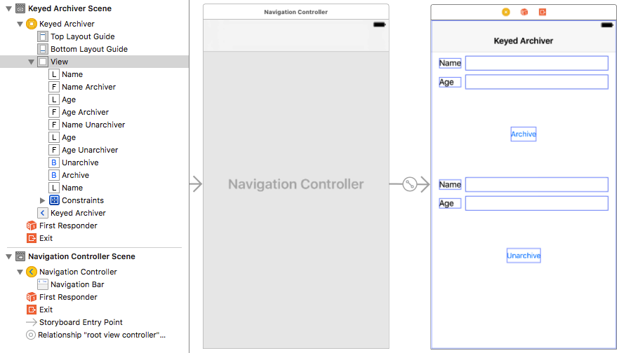
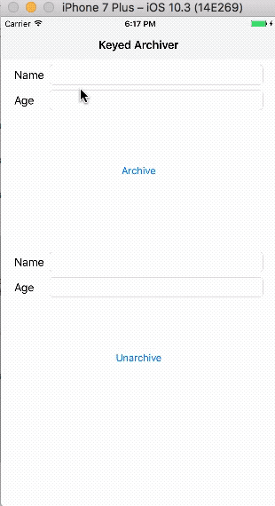

在构建应用程序时，有一个重要的问题是如何在每次启动之间持久化数据，以便重现最后一次关闭应用前的状态。在iOS和OS X上，苹果提供了三种选择：Core Data、属性列表（Property List）和带键值的编码（NSKeyedArchiver）。当涉及到建模、查询、遍历、持久化等复杂的对象图时，Core Data无可替代。但并非所有应用程序都需要查询数据、处理复杂对象图，有时候使用`NSKeyedArchiver`更为简单。

## 1. 使用NSKeyedArchiver

如果要将各种类型的对象存储到文件中，而不仅仅是字符串、数组、字典类型，利用`NSKeyedArchiver`类创建带健（keyed）的档案来完成将非常灵活。

在带健的档案中，会为每个归档对象提供一个名称，即健（key）。根据这个key可以从归档中检索该对象。这样，就可以按照任意顺序将对象写入归档并进行检索。另外，如果向类中添加了新的实例变量或删除了实例变量，程序也可以进行处理。

`NSKeyedArchiver`存储在硬盘上的数据是二进制格式：


你可以通过文本编辑器打开二进制文件，但一般来说没有必要。二进制文件是为计算机而设计，比纯文本文件占用磁盘空间小，并且加载速度也更快。例如，*Interface Builder*通常以二进制格式存储NIB文件。

下面我们结合代码来学习归档与解档：

创建*Single View Application*模板的demo，demo名称为*KeyedArchiver*。在*storyboard*中添加四个`UILabel`、四个`UITextField`和两个`UIButton`。布局如下：



当点击*Archive*按钮时，把*Name*和*Age*对应的文本框内容归档到`/Library/Application Support`内的文件夹。当点击*Unarchiver*按钮时，把刚创建归档程序读入执行程序中，并对应的显示到下面的两个文本框中。

拖拽文本框IBOutlet属性到`ViewController.m`接口部分，拖转两个`UIButton`的IBAction到实现部分，分别命名为`archiver: `、`unarchiver: `。完成后如下：

```
@interface ViewController ()
@property (weak, nonatomic) IBOutlet UITextField *nameArchiver;
@property (weak, nonatomic) IBOutlet UITextField *ageArchiver;
@property (weak, nonatomic) IBOutlet UITextField *nameUnarchiver;
@property (weak, nonatomic) IBOutlet UITextField *ageUnarchiver;

@end
```

```
- (IBAction)archiver:(UIButton *)sender {
    
}

- (IBAction)unarchiver:(UIButton *)sender {
    
}
```

在声明部分添加一个`NSString`类型的`documentsPath`对象，并使用懒加载初始化。该对象为沙盒中`Documents\Application Support\`目录。这样只需要获取一次路径就可以重复使用，有助于提高性能。

```
@interface ViewController ()

...
@property (strong, nonatomic) NSString *documentsPath;

@end
```

```
- (NSString *)documentsPath {
    if (!_documentsPath) {
        NSArray *paths = NSSearchPathForDirectoriesInDomains(NSApplicationSupportDirectory, NSUserDomainMask, YES);
        if (paths.count > 0) {
            _documentsPath = paths.firstObject;
            
            //  如果目录不存在，则创建该目录。
            if (! [[NSFileManager defaultManager] fileExistsAtPath:_documentsPath]) {
                NSError *error;
                // 创建该目录
                if(! [[NSFileManager defaultManager] createDirectoryAtPath:_documentsPath withIntermediateDirectories:YES attributes:nil error:&error])
                {
                    NSLog(@"Failed to create directory. error: %@",error);
                }
            }
        }
    }
    return _documentsPath;
}
```

在初始化`documentsPath`时，使用`NSSearchPathForDirectoriesInDomain()`方法获取`Library/Application Support／`目录，如果目录不存在，则创建该目录。

对于`NSString`、`NSArray`、`NSDictionary`、`NSSet`、`NSDate`、`NSNumber`和`NSData`之类的基本Objective-C类对象，都可以直接使用`NSKeyedArchiver`归档和`NSKeyedUnarchiver`读取归档文件。

更新`archiver: `方法，当点击*Archiver*按钮时对`nameArchiver`和`ageArchiver`中的文本进行归档。

```
- (IBAction)archiver:(UIButton *)sender {
    // A 使用archiveRootObject: toFile: 方法归档
    // 1.修改当前目录为self.documentsPath
    NSFileManager *sharedFM = [NSFileManager defaultManager];
    [sharedFM changeCurrentDirectoryPath:self.documentsPath];

    // 2.归档
    if (![NSKeyedArchiver archiveRootObject:self.nameArchiver.text toFile:@"nameArchiver"]) {
        NSLog(@"Failed to archive nameArchiver");
    }
    if (![NSKeyedArchiver archiveRootObject:self.ageArchiver.text toFile:@"ageArchiver"]) {
        NSLog(@"Failed to archive ageArchiver");
    }
}
```

上述代码分步说明如下：

1. 使用`NSFileManager`修改当前工作目录为`self.documentsPath`。
2. 使用`archiveRootObject: toFile: `方法将文本框中的文本进行归档，该方法返回值为BOOL类型，归档成功返回`YES`，归档失败返回`NO`。这里的`toFile: `参数`@"nameArchiver"`和`@"ageArchiver"`均为相对路径，相对于1中设定的当前路径。

> 这篇文章会多次用到文件系统和`NSFileManager`，如果你还不熟悉，可以查看我的另一篇文章：[使用NSFileManager管理文件系统](https://github.com/pro648/tips/wiki/%E4%BD%BF%E7%94%A8NSFileManager%E7%AE%A1%E7%90%86%E6%96%87%E4%BB%B6%E7%B3%BB%E7%BB%9F)。

再更新`unarchiver: `方法，当点击*Unarchiver*按钮时读取归档文件，并对应地显示到`nameUnarchiver`和`ageUnarchiver`中。

```
- (IBAction)unarchiver:(UIButton *)sender {
    // A 使用unarchiveObjectWithFile: 读取归档
    // 1.获取归档路径
    NSString *nameArchiver = [self.documentsPath stringByAppendingPathComponent:@"nameArchiver"];
    NSString *ageArchiver = [self.documentsPath stringByAppendingPathComponent:@"ageArchiver"];
    
    // 2.读取归档，并将其显示在对应文本框。
    self.nameUnarchiver.text = [NSKeyedUnarchiver unarchiveObjectWithFile:nameArchiver];
    self.ageUnarchiver.text = [NSKeyedUnarchiver unarchiveObjectWithFile:ageArchiver];
}
```

上述代码的分步说明如下：

1. 使用`stringByAppendingPathComponent: `方法获取归档路径，这里也可以使用归档方法中设置当前路径的方法，两种方法效果一样。
2. 使用`NSKeyedUnarchiver`类的`unarchiverObjectWithFile: `方法从路径中读取归档，并赋值给对应文本框。

运行demo，在上面两个`UITextField`中输入文本，点击*Archiver*按钮即可把文本框中的文本归档。点击*Unarchiver*按钮即可读取归档数据，并将其显示到对应文本框。



## 2. 编码方法和解码方法

前面我们说过，对于`NSString`、`NSArray`等基本的Objective-C类对象，都可以直接使用`NSKeyedArchiver`和`NSKeyedUnarchiver`进行归档和解档。而对于其他类型的对象，则必须告知系统如何编码你的对象，以及如何解码。这时你的类必须遵守`NSCoding`协议，该协议只有两个必须实现的方法`encodeWithCoder: `和`initWithCoder: `。

为遵守面向对象的设计原则，被编码、解码的对象负责对其实例变量进行编码和解码。编码器通过调用`encodeWithCoder: `和`initWithCoder: `方法指导对象编码、解码其实例。`encodeWithCoder: `指导对象编码其实例变量至该方法参数中的编码器，该方法可能会被调用多次；`initWithCoder: `指导对象用参数中的数据初始化自身，它会替换任何其他初始化方法，并且每个对象仅发送一次。必须遵守`NSCoding`协议、实现这两个方法，该类才可以对其实例进行编码、解码。

继续上面的demo，添加一个模版为*Cocoa Touch Class*，类名为*Person*，父类为`NSObject`的文件。

在`Person.h`中添加以下属性和方法：

```
@interface Person : NSObject

@property (strong, nonatomic) NSString *name;
@property (assign, nonatomic) NSInteger age;

- (void)setName:(NSString *)name age:(NSInteger)age;

@end
```

在`Person.m`实现`setName: age: `方法。

```
- (void)setName:(NSString *)name age:(NSInteger)age {
    self.name = name;
    self.age = age;
}
```

下面是解码方法和编码方法。

```
// 1.编码方法
- (void)encodeWithCoder:(NSCoder *)aCoder {
    [aCoder encodeObject:self.name forKey:@"PersonName"];
    [aCoder encodeInteger:self.age forKey:@"PersonAge"];
}

// 2.解码方法
- (instancetype)initWithCoder:(NSCoder *)aDecoder {
    if (self = [super init]) {
        self.name = [aDecoder decodeObjectForKey:@"PersonName"];
        self.age = [aDecoder decodeIntegerForKey:@"PersonAge"];
    }
    return self;
}
```

上述代码的分步说明如下：

1. 该程序向编码方法`encodeWithCoder: `传入一个`NSCoder`对象作为参数。由于`Person`类直接继承自`NSObject`，所以无需担心编码继承的实例变量。如果的确担心，并且知道类的父类符合`NSCoding`协议，那么在编码方法开始处添加`[super encodeWithCoder: encoder]`，确保继承的实例变量也被编码。另外，不同类型对象使用不同编码方法。如果编码`NSString`类型对象，使用`encodeObject: forKey: `方法，如果编码`NSInteger`类型对象，使用`encodeInteger: forKey: `方法。这里的键名是任意的，只要跟解码时的一致即可。为防止子类和父类使用相同键而导致冲突，可以像这里定义的一样，制定键名时将类名放在键名前加以区分。
2. 解码过程与编码刚好相反。传递给`initWithCoder: `的参数也是`NSCoder`对象，不用担心这个参数，只要记住它是想要从归档中提取的对象即可。如果担心解码继承的实例变量，且该父类遵守`NSCoding`协议，可以用`self = [super initWithCoder: decoder];`开始解码方法。只要键与编码时相同就可以解码。

进入`ViewController.m`方法，导入`Person.h`，并在接头部分添加以下属性：

```
@interface ViewController ()

...
@property (strong, nonatomic) Person *person;

@end
```

最后记得在`viewDidLoad`方法中初始化该方法。

注释掉`archiver: `方法内代码，并添加以下代码，以便归档`Person`类。

```
- (IBAction)archiver:(UIButton *)sender {
    // B 使用initForWritingWithData: 归档。
    // 1.把当前文本框内文本传送给person。
    [self.person setName:self.nameArchiver.text age:[self.ageArchiver.text integerValue]];
    
    // 2.使用initForWritingWithMutableData: 方法归档内容至mutableData。
    NSMutableData *mutableData = [NSMutableData data];
    NSKeyedArchiver *archiver = [[NSKeyedArchiver alloc] initForWritingWithMutableData:mutableData];
    [archiver encodeObject:self.person forKey:@"person"];
    [archiver finishEncoding];
    
    // 3.把归档写入Library/Application Support/Data目录。
    NSString *filePath = [self.documentsPath stringByAppendingPathComponent:@"Data"];
    if (![mutableData writeToFile:filePath atomically:YES]) {
        NSLog(@"Failed to write file to filePath");
    }
}
```

上述代码的分布说明如下：

1. 把当前文本框内文本传送给`person`。记得在`viewDidLoad
2. 先创建一个空缓冲区，其大小将随着程序执行的需要而扩展。通过`intiForWritingWithMutableData: `方法以指定归档数据的存储空间为`mutableData`，现在可以向`archiver`对象发送编码消息，以便归档对象，这里可以归档多个对象。所有对象都归档后必须向`archiver`发送`finishEncoding`消息。在此之后，就不能编码其他对象了。此时，你预留的`mutableData`区域包含归档对象。
3. 使用`writeToFile: atomically: `方法把归档后的对象写入文件，该方法返回值为BOOL类型，写入成功时返回`YES`；操作失败时返回`NO`。`atomically: `参数为`YES`表示希望首先将文件写入到临时备份中，且一旦成功，将把该备份重命名为指定目录名。这是一种安全措施，可以避免文件在操作过程中因系统崩溃而致使原文件、新文件均损坏。如果参数为`NO`，则会直接在指定目录写入文件。

同样，注释掉`unarchiver: `中原来代码，并添加以下代码读取归档。

```
- (IBAction)unarchiver:(UIButton *)sender {
    ...
    // B 使用initForReadingWithData: 读取归档。
    // 1.从Library/Application Support/Data目录获取归档文件。
    NSString *filePath = [self.documentsPath stringByAppendingPathComponent:@"Data"];
    NSData *data = [NSData dataWithContentsOfFile:filePath];
    
    // 2.使用initForReadingWithData: 读取归档。
    NSKeyedUnarchiver *unarchiver = [[NSKeyedUnarchiver alloc] initForReadingWithData:data];
    self.person = [unarchiver decodeObjectForKey:@"person"];
    [unarchiver finishDecoding];
    
    // 3.把读取到的内容显示到对应文本框。
    self.nameUnarchiver.text = self.person.name;
    self.ageUnarchiver.text = [@(self.person.age) stringValue];
}
```

读取归档时，首先通过`dataWithContentsOfFile: `方法获取归档文件，之后使用`initForReadingWithData: `读取归档，在解码结束时，一定要向`unarchiver`发送`finishDecoding`消息结束解码。最后将读取到的归档内容显示到对应文本框。

运行app，可以像之前一样对文本框内容进行归档、解档。

如果想要了解属性列表及通过代码练习，可以查看这篇文章：[使用偏好设置、属性列表、归档解档保存数据、恢复数据](https://github.com/pro648/tips/wiki/使用偏好设置、属性列表、归档解档保存数据、恢复数据)。

> 你也可以尝试注释掉`Person.m`中的编码方法和解码方法再次运行demo，点击按钮时会在控制台看到出错消息。

你也可以通过添加观察者，在应用程序进入后台时（通知为UIApplicationDidEnterBackgroundNotifiaction)归档文件，这样即使app被终止，数据也不会丢失。你可以自行完成，如果遇到问题，可以通过文章底部网址获取源码查看。

## 3. 使用归档程序复制对象

可以使用归档功能实现深复制，可以将对象归档到一个缓冲区，然后把它从缓冲区解归档，这样就实现了深复制。如下所示：

```
    NSMutableArray *mutableArray = [NSMutableArray arrayWithObjects:[NSMutableString stringWithString:@"one"], [NSMutableString stringWithString:@"two"], nil];
    
    NSData *data = [NSKeyedArchiver archivedDataWithRootObject:mutableArray];
    NSMutableArray *mutableArray2 = [NSKeyedUnarchiver unarchiveObjectWithData:data];
```

如果你对其是否进行了深复制有疑惑，可以通过修改其中一个数组的元素，查看另一个数组内元素是否改变来验证。

> 深入了解深复制、浅复制，查看[深复制、浅复制、copy、mutableCopy](https://github.com/pro648/tips/wiki/深复制、浅复制、copy、mutableCopy)这篇文章。

## 4. 三种归档方法的区别

在这篇文章中使用了`archiveRootObject: toFile: `、`initForWritingWithMutableData: `和`archivedDataWithRootObject: `三种类型归档方法，它们区别如下：

1. `archiveRootObject: toFile: `不能决定如何处理归档的数据，直接被写入了文件。
2. `initForWritingWithMutableData: `归档的数据可以通过网络分发，除此之外还可以把多个对象归档到一个缓冲区。
3. `archivedDataWithRootObject: `这种方法归档的数据可以通过网络分发，非常灵活。

总之，只是方便与灵活的区别。

Demo名称:KeyedArchiver  
源码地址：<https://github.com/pro648/BasicDemos-iOS>

参考资料：

1. [NSCoding / NSKeyed​Archiver](http://nshipster.cn/nscoding/)
2. [Differences with archiveRootObject:toFile: and writeToFile:](https://stackoverflow.com/questions/16077192/differences-with-archiverootobjecttofile-and-writetofile)
3. [Saving Application Data](http://cocoadevcentral.com/articles/000084.php)


