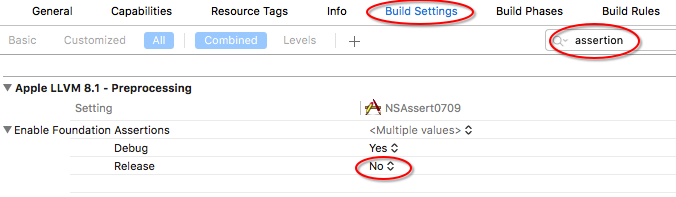

## 1. NSAssert

断言（NSAssert）是一个宏，在开发过程中使用`NSAssert`可以及时发现程序中的问题。

`NSAssert`声明如下：

```
#define NSAssert(condition, desc, ...)
```

- condition：条件表达式。条件成立时，运行后面程序；不成立时，抛出带有`desc`描述的异常信息。
- desc：异常描述，通常为`NSString`类型对象。用于描述条件表达式不成立的错误信息和参数的占位符。
- ...：`desc`字符串中的参数。

假设我们需要判断变量值是否大于5，我们可以用如下代码进行判断。

```
    int i = 6;
    NSAssert(i>5, @"i must bigger than 5");
```

运行后，控制台没有任何输出。

把变量`i`的值改为`2`，如下所示：

```
    int i = 2;
    NSAssert(i>5, @"i must bigger than 5");
```

运行demo，demo会崩溃。在控制台输出如下信息：

```
*** Assertion failure in -[ViewController viewDidLoad], /Users/ad/Library/Mobile Documents/com~apple~CloudDocs/file2016/NSAssert0709/NSAssert0709/ViewController.m:23
*** Terminating app due to uncaught exception 'NSInternalInconsistencyException', reason: 'i must bigger than 5'
```

通过控制台输出的信息，可以得到崩溃发生于：`ViewController`类的`viewDidLoad`方法中，该文件位于/Users/ad/Library/Mobile Documents/com~apple~CloudDocs/file2016/NSAssert0709/NSAssert0709/ViewController.m，导致崩溃的代码位于第23行，崩溃原因为：i must bigger than 5。

使用`NSAssert`时可以对输出信息进行传值。

```
    int i = 2;
    NSAssert1(i>5, @"The real value is %i", i);
```

输出为：

```
*** Assertion failure in -[ViewController viewDidLoad], /Users/ad/Library/Mobile Documents/com~apple~CloudDocs/file2016/NSAssert0709/NSAssert0709/ViewController.m:23
*** Terminating app due to uncaught exception 'NSInternalInconsistencyException', reason: 'The real value is 2'
```

`NSAssert`用于Objective-C，`NSCAssert`用于C语言中。

`NSAssert1`的`desc`带有一个参数，`NSAssert2`的`desc`带有两个参数，……，`NSAssert5`带有五个参数。断言可以带有零至五个参数。

> 也许你会好奇为什么`desc`中不使用`[NSString stringWithFormat:...]`格式，而要有五个`NSAssert`？因为NSAssert()的实现就是一个宏，因此，要处理异常信息中不同数量参数，就要有多个宏，所以就有了`NSAssert(condition, dest)`、`NSAssert1(condition, formatDest, arg1)`、`NSAssert2(condition, formatDest, arg1, arg2)`...`NSAssert5(...)`。
>
> `NSAssert`和`NSLog`都可以在控制台输出，但`NSAssert`输出后程序立即crash，控制台也会输出程序遇到错误的位置等信息，而`NSLog`只用于输出信息。

## 2. NSParameterAssert

如果需要判断传入参数是否符合要求，可以使用`NSParameterAssert`。

```
- (NSString *)processItem:(NSUInteger)index {
    NSParameterAssert(index<self.myArray.count);
    // do something else
}
```

如果传入参数`index`大于`myArray`数组内元素数量，则程序会崩溃。控制它输出如下：

```
*** Assertion failure in -[ViewController processItem:], /Users/ad/Library/Mobile Documents/com~apple~CloudDocs/file2016/NSAssert0709/NSAssert0709/ViewController.m:31
*** Terminating app due to uncaught exception 'NSInternalInconsistencyException', reason: 'Invalid parameter not satisfying: index<self.myArray.count'
```

崩溃信息中会告诉你哪一行代码出错了，崩溃原因是什么。

`NSParameterAssert`用于Objective-C，`NSCParameterAssert`用于C语言中。

## 3. 断言默认只存在于debug版

从Xcode 4.2开始，release版默认关闭了断言。也就是当编译发布版时，任何调用`NSAssert`的地方都被空行替换。所以，不要在`NSAssert`内执行任何有效操作。

如果想要在发布版中使用`NSAssert`，可以在*Build Setting*中的*Enable Foundation Assertions*中修改。



## 4. NSError

`NSError`应该用在不是编程错误所产生的error，如文件未找到一类非致命性错误。你可以把错误信息发送给调用者，调用者会进行处理并继续执行，也可以用[警报控制器](https://github.com/pro648/tips/wiki/UIAlertController%E7%9A%84%E4%BD%BF%E7%94%A8)展现给用户。

## 总结

对来源于系统内部的可靠数据使用断言，即用断言来处理绝不应该发生的情况。不要对外部不可靠数据（如用户输入、文件、网络读取等）使用断言，即对于外部不可靠数据或预期会发生的情况应当使用错误处理。同时要避免把需要执行的代码放到断言中，断言可以看成可执行的注释。

来源于系统外部的数据都是不可信的，需要严格检查（通常是错误处理）才能放行到系统内部，这相当于一个守卫。而对于系统内部的交互（如调用其他方法），如果每次也都要去处理输入的数据，也就相当于系统没有可信的边界，会让代码变的臃肿。事实上，在系统内部传递给方法正确的参数是调用者的责任，调用者应该确保传递给所调用方法的数据是符合要求的。这样就隔离了不可靠的外部环境和可靠的内部环境，降低复杂度。

但在开发阶段，代码极可能存在缺陷，有可能是处理外部数据的逻辑不周全或调用内部方法的代码存在错误，最终造成调用失败。这个时候，断言就可以发挥作用，用来确诊到底哪一部分问题导致程序出错。在清理了所有缺陷后，内外有别的信用体系就建立起来了。等到发行版的时候，这些断言就没有存在的必要了。

单元测试可能是一个更好的方法，但有些情况下（如复杂的算法过程中），我们希望在代码中执行检查，这时断言将更有效。

参考资料：

1. [What is NSAssert1?](https://stackoverflow.com/questions/5496378/what-is-nsassert1)
2. [Objective-C: Assertion vs. Exception vs. Error](https://stackoverflow.com/questions/5009597/objective-c-assertion-vs-exception-vs-error/5010188#5010188)
3. [iOS开发中断言的使用—NSAssert()](http://blog.csdn.net/univcore/article/details/16859263)
