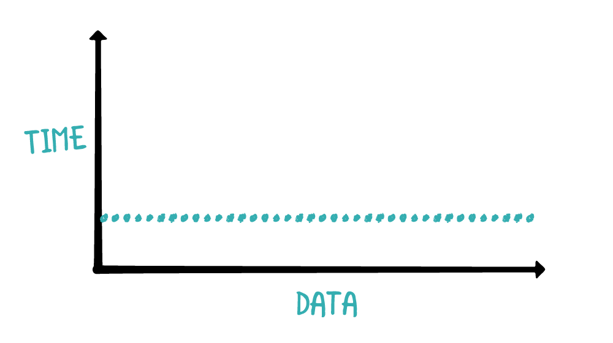
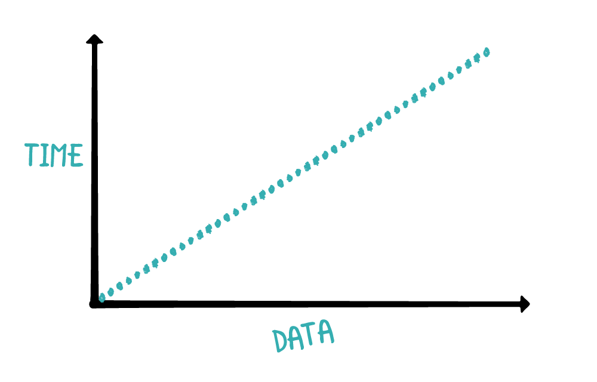
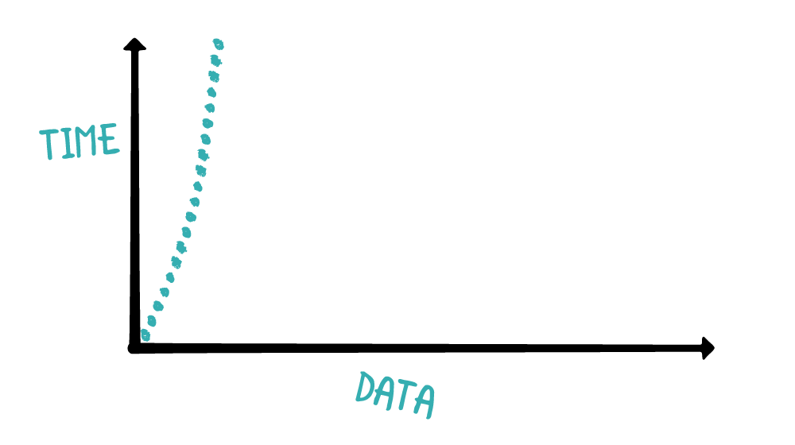
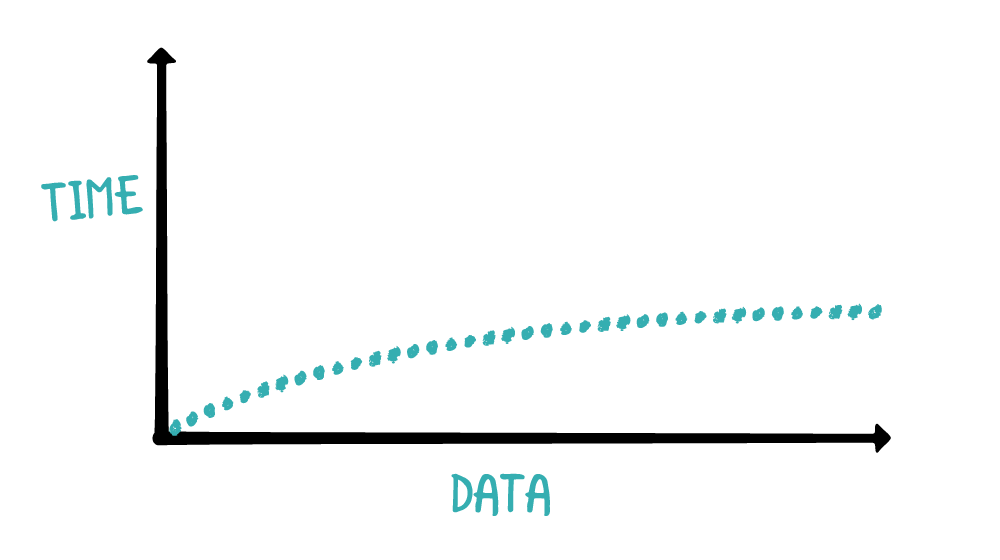
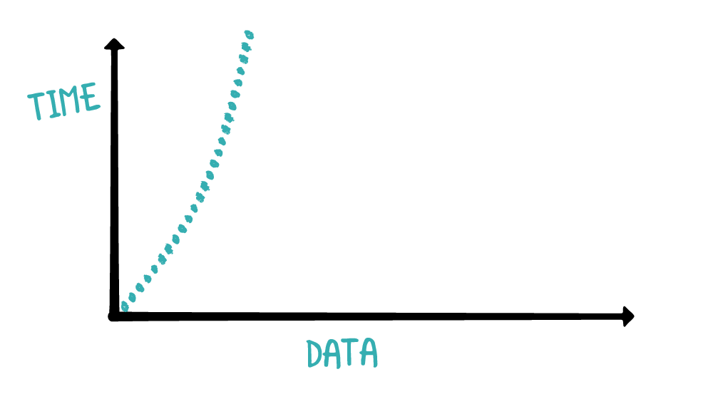

算法（algorithm）本质上是一连串的计算。同一个问题可以使用不同算法解决，但计算过程中消耗的时间和资源可能千差万别。那如何比较不同算法之间的优劣呢？

目前分析算法主要从时间和空间两个维度进行。时间维度就是算法需要消耗的时间，时间复杂度（time complexity）是常用分析单位。空间维度就是算法需要占用的内存空间，空间复杂度（space complexity）是常用分析单位。

因此，分析算法主要从时间复杂度和空间复杂度进行。很多时候二者不可兼得，有时用时间换空间，有时用空间换时间。

## 1. 时间复杂度 Time Complexity

现代硬件性能强大，即使是非常昂贵的算法，数据量小时速度也可能很快。但数据量变大时，时间开销就会明显变大。时间复杂度是随着数据量增加，算法耗费时间的度量单位。

#### 1.1 常数时间 Contant Time

常数时间算法不会随数据量变化而变，时间固定。

查看下面方法：

```
func checkFirst(names: [String]) {
    if let first = names.first {
        print(first)
    } else {
        print("No Names")
    }
}
```

该函数执行所需时间与 names 数组大小无关。无论数组有十个元素，还是一万个元素，该函数都只检查数组第一个元素。

下图是数据量与时间关系图：



数据量变大时，算法所需时间保持不变。

为简便起见，使用大O符号（big O notion）表示各种时间复杂度。常数时间大O符号是`O(1)`。

#### 1.2 线性时间 Linear Time

下面代码打印数组中所有元素：

```
func printNames(names: [String]) {
    for name in names {
        print(name)
    }
}
```

当数组变大时，for 循环次数也会同步增加，这称为线性时间复杂度。



线性时间复杂度是最好理解的。随着数据量增加，耗费时间同步增加，正如上图中斜线。线性时间复杂度的大O符号是`O(n)`。

> 如果是两个循环，外加六个`O(1)`，大O符号是`O(2n+6)`吗？时间复杂度只描述性能曲线，因此，增加一些循环不会改变性能曲线。大O符号会移除所有常量，也就是`O(2n+6)`等于`O(n)`，但优化绝对性能时，不能忽略这些常量。优化后的 GPU 比 CPU 可能快一百倍，但两者的时间复杂度仍然都是`O(n)`。

#### 1.3 平方时间 Quadratic Time

平方时间（Quadratic Time）也称为n的平方，平方时间复杂度算法耗费时间是数据量的平方。参考以下代码：

```
func printNames(names: [String]) {
    for _ in names {
        for name in names {
            print(name)
        }
    }
}
```

如果数组有10个元素，上述函数会把10个元素打印10次，即共打印100次。如果数组有11个元素，就会打印11个元素11次，即共打印121次。数据量变大时，平方时间算法会很快失去控制，所需时间急剧增长。



平方时间的大O符号是`O(n²)`。

> 无论线性时间算法多么低效，当数据量特别大时，线性时间算法永远比平方时间算法速度快，即使对平方时间算法进行了优化。

#### 1.4 对数时间 Logarithmic Time

线性时间复杂度、平方时间复杂度中数据至少使用一次，但有时只需使用输入数据的一部分，这时运行速度会快一些。如有一个有序整数数组，那查找特定值最快的方法是什么？

有一种方法是循环数组，依次比较，这时是线性时间复杂度。如下面这种最直接的比较方法：

```
let numbers = [1, 3, 5, 46, 88, 97, 115, 353]

func navieContains(_ value: Int, in array: [Int]) -> Bool {
    for element in array {
        if element == value {
            return true
        }
    }
    
    return false
}
```

如果查看数字354是否在数组中，上述算法会循环完整数组。由于数组是有序的，可以折半后查找：

```
func navieContaines(_ value: Int, in array: [Int]) -> Bool {
    guard !array.isEmpty else {
        return false
    }
    
    let middleIndex = array.count / 2
    if value < array[middleIndex] {
        for index in 0...middleIndex {
            if array[index] == value {
                return true
            }
        }
    } else {
        for index in middleIndex..<array.count {
            if array[index] == value {
                return true
            }
        }
    }
    
    return false
}
```

上述函数进行了一个很小，但却很有效的优化，只比较数组二分之一的元素。先比较数组中间的元素，如果指定值小于中间元素，则只比较前面二分之一的元素；否则，只比较后面二分之一的元素。

如果重复折半，则会成为二分查找，此时为对数时间复杂度。下图显示了对数时间复杂度数据与时间的关系：



当数据量变大时，对数时间算法所需时间缓慢增加。如果数据量是100，折半后就是50；如果数据量是100000，折半后就是50000，数据量越大折半效果越好。

折半的算法并不复杂，但很有效。对数时间复杂度的大O符号是`O(log n)`。

#### 1.5 准线性时间 Quasilinear Time

另一种常用到的时间复杂度是准线性时间，准线性时间算法比线性时间算法效率低，但比平方时间算法效率高。Swift 中数组的`sorted()`算法就是准线性时间算法。

准线性时间大O符号是`O(n log n)`，是线性和对数时间的多倍。如下图所示：



准线性时间复杂度曲线与平方时间复杂度曲线有些相似，但数据量大时准线性时间算法性能稍好一些。

#### 1.6 其他时间复杂度

前面提到了五种常遇到的时间复杂度，还有一些用来处理复杂问题的复杂度没有涉及到，如多项式时间（polynomial time）、指数时间（exponential time）、阶乘时间（factorial time）等。

时间复杂度是对性能的概述，即不同复杂度性能排名，它无法确切的描述算法速度。因此，复杂度相同的两个算法，一个可能比另一个快很多。数据量小时，时间复杂度可能不是一个精准的衡量标准。

数据集很小时，插入排序之类的平方算法可能比归并排序之类的准线性算法速度更快。这是因为插入排序不需要分配额外内存执行算法，而归并排序则需要为创建的多个数组分配内存。数据量小时，分配内存可能比多处理数据昂贵。

## 2. 空间复杂度 Space Complexity

空间复杂度是对算法运行过程中临时占用存储空间大小的度量。随着数据量变大，程序需要占用的内存空间可能会变得更多，空间复杂度反映的是内存空间增长的趋势。

请看以下代码：

```
func printSorted(_ array: [Int]) {
    let sorted = array.sorted()
    for element in sorted {
        print(element)
    }
}
```

上述方法创建了数组的有序副本，并输出其中元素。为了计算空间复杂度，需分析函数占用了多少内存空间。

`array.sorted()`会创建一个同样大小的数组，它的空间复杂度是`O(n)`。上述方法比较简单，如果方法特别复杂，可能需要减少初始化对象数量、减少内存占用。

可以将上述方法使用以下代码替换：

```
func printSorted(_ array: [Int]) {
    // 1
    guard !array.isEmpty else {
        return
    }
    
    // 2
    var currentCount = 0
    var minValue = Int.min
    
    // 3
    for value in array {
        if value == minValue {
            print(value)
            currentCount += 1
        }
    }
    
    while currentCount < array.count {
        // 4
        var currentValue = array.max()!
        
        for value in array {
            if value < currentValue && value > minValue {
                currentValue = value
            }
        }
        
        // 5
        for value in array {
            if value == currentValue {
                print(value)
                currentCount += 1
            }
        }
        
        // 6
        minValue = currentValue
    }
}
```

上述算法通过多次循环，避免占用太多空间，依次打印出最小值。具体说明如下：

1. 查看数组是否为空。如果为空，停止执行。
2. currentCount 记录打印了多少次，minValue 记录上次打印的数字。
3. 算法先打印出所有与 minValue 匹配的数字，同步更新打印次数 currentCount。
4. 算法使用 while 循环，查找到比 minValue 大的最小值，并存储到 currentValue。
5. 打印出所有与 currentValue 相同的数字，并更新 currentCount。
6. minValue 被设置为 currentValue，下一个循环会查找下一个最小值。

上述算法只初始化几个变量用来跟踪查找进度，因此空间复杂度是`O(1)`。

# 总结

目前，已经介绍了使用大O符号表示算法复杂度，这是最常见的测量方法。

以下是一些时间复杂度、空间复杂度的要点：

- 时间复杂度反映数据量变大时，算法所需时间变化。
- 应了解常数时间、对数时间、线性时间、准线性时间和平方时间，并能够根据成本排序。
- 空间复杂度反映数据量变大时，算法占用内存空间变化。
- 使用大O符号表示空间复杂度、时间复杂度。
- 时间复杂度、空间复杂度反映程序可扩展性，并不能计算算法具体执行时长。
- 数据量很小时，时间复杂度和执行时间可能不相关。例如，插入排序之类的平方算法可能比归并排序之类的准线性算法速度更快。

参考资料：

1. [时间空间复杂度分析「数据结构和算法2」](https://turingplanet.org/2020/02/03/%E3%80%90%E6%95%B0%E6%8D%AE%E7%BB%93%E6%9E%84%E5%92%8C%E7%AE%97%E6%B3%953%E3%80%91/)
2. [时间复杂度](https://zh.wikipedia.org/wiki/%E6%97%B6%E9%97%B4%E5%A4%8D%E6%9D%82%E5%BA%A6)