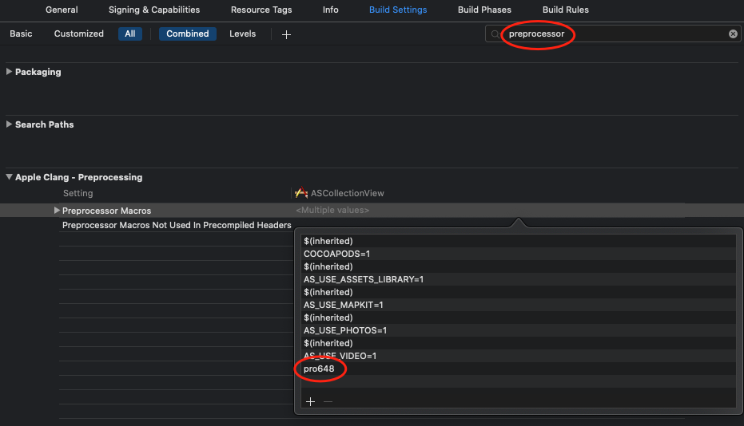

通常，Objective-C 程序的编译从源代码到可执行文件分为三个阶段。第一阶段，预处理程序（preprocessor）的工具扫描开发人员编写的代码，并转换为对编译器友好的格式；第二阶段，编译器从预处理的源代码生成目标代码（通常文件扩展名为 .o 格式）；最后一个阶段，链接器（linker）将所有目标代码模块和库放在一起，解析符号链接（symbol reference）并创建可执行二进制文件（executable binary）。

预处理阶段会搜索开发人员编写的特殊指令（directive），并将其转换为编译器可以处理的代码。每个指令均以 # 开头，用于简化编程任务，并使代码易于阅读和管理。在这篇文章中，将介绍条件编译（conditional compilation）指令。

六个指令可用于控制条件编译。条件编译用于分割仅在满足指定条件时才编译指定程序块，程序块的文本是任意的，并且可以包含预处理程序指令、C 语句等。这些指令可以嵌套使用。条件编译的开头由以下三个指令之一标记：

- `#if`
- `#ifdef`
- `#ifndef`

另外，可选使用下面两个指令之一来放置备用文本块：

- `#else`
- `#elif`

条件编译的末尾最终由下面命令标记：

- `#endif`

如果`#if`、`#ifdef`、`#ifndef`条件为真（非0），则忽略`#else`、`#elif`与`#endif`指令（如果存在）之间的所有行。

如果`#if`、`#ifdef`、`#ifndef`条件为假（0），则忽略`#if`、`#ifdef`、`#ifndef`与`#else`、`#elif`、`#endif`之间的所有行。

## `#if`

`#if`指令语法如下：

```
#if constant-expression newline
```

该指令检查 constant-expression 是否为 true，操作数必须是一个整数表达式，不包含增量（++）、减量（--）、sizeof、指针、地址和强制转换符。

常量表达式中的标志符可以是宏、也可以不是宏，但不能是关键字、枚举常量等。常量表达式还可以包括已定义的预处理运算符。

`#if`中的常量表达式实质为文本替换，并且可以包含之前使用`#define`指令定义的标志符。替换发生在验证表达式之前，替换之后每个预处理都依照令牌词汇形式出现。

> 如果你对`#define`指令不熟悉，可以查看我的另一篇文章：[宏(#define)与常量(const)的使用](https://github.com/pro648/tips/wiki/%E5%AE%8F%28%23define%29%E4%B8%8E%E5%B8%B8%E9%87%8F%28const%29%E7%9A%84%E4%BD%BF%E7%94%A8)。

如果使用未定义标志符，则编译器会将其视为常量零。

## `#ifdef`

`#ifdef`指令语法如下：

```
#ifdef identifier newline
```

该指令检查 identifier 是否已定义。可以通过`#define`命令或命令行定义 identifier，如果该 identifier 稍后未被取消定义（使用`#undef`命令可以取消已定义的宏），则认为已定义。

## `#ifndef`

`#ifndef`指令语法如下：

```
#ifndef identifier newline
```

该指令检查 identifier 是否未定义。

## `#else`

`#else`指令语法如下：

```
#else newline
```

当`#if`、`#ifdef`、`#ifndef`指令验证为 false 时，则`#else`指令界定要编译的可选文本。`#else`指令是可选的。

## `#elif`

`#elif`指令语法如下：

```
#elif constant-expression newline
```

`#elif`指令执行的任务类似于 else if 语句。当`#if`、`#ifdef`、`#ifndef`为 false，且`#elif`为 true 时，编译`#elif`后的代码。`#elif`指令是可选的。

## `#endif`

`#endif`指令语法如下：

```
#endif newline
```

`#endif`指令终止`#if`、`#ifdef`、`#ifndef`、`#else`、`#elif`指令的范围。

`#endif`指令数量根据使用的`#elif`和`#else`而变化。下面两个实例等效：

```
#if false
.
.
#elif true
.
.
#endif

// 等效于

#if false
.
.
#else
#if true
.
.
#endif
#endif
```

## `defined` 操作符

另一种验证宏是否已定义的方法是使用`defined`一元操作符。`defined`操作符有以下两种格式：

```
defined name
defined (name)
```

如果name已定义，则表达式结果为1，否则为0。

`defined`运算符对于使用`#if`指令检查多个宏特别有用。这样可以在一行检查多个宏是否定义，而不必使用多个`#ifdef`或`#ifndef`指令。

```
#ifdef macro1
    NSLog(@"Hello!\n");
#endif
    
#ifndef macro2
    NSLog(@"Hello!\n");
#endif
    
#ifdef macro3
    NSLog(@"Hello!\n");
#endif
```

使用`defined`运算符则可以在单个`#if`指令中执行类似宏检查：

```
#if defined (macro1) || !defined (macro2) || defined (macro3)
    print("Hello!\n")
#endif
```

`defined`指令可以和任意逻辑运算符组合使用，但`defined`指令只能用在`#if`和`#elif`指令的表达式中。

> `#import`也是预处理指令。

如果一个 project 包含多个 target，想要通过预处理程序进行区分，则可以选中 target，修改 Build Settings 中 Preprocessing Macros 实现。如下所示：



参考资料：

1. [ Conditional Compilation (#if, #ifdef, #ifndef, #else, #elif, #endif, and defined)](https://www.cs.auckland.ac.nz/references/unix/digital/AQTLTBTE/DOCU_078.HTM)
2. [Using Objective-C Preprocessor Directives](https://www.techotopia.com/index.php/Using_Objective-C_Preprocessor_Directives#Undefining_a_Definition_with_.23undef)
3. [How can I add an #ifdef DEBUG to Xcode?](https://stackoverflow.com/questions/8257305/how-can-i-add-an-ifdef-debug-to-xcode)