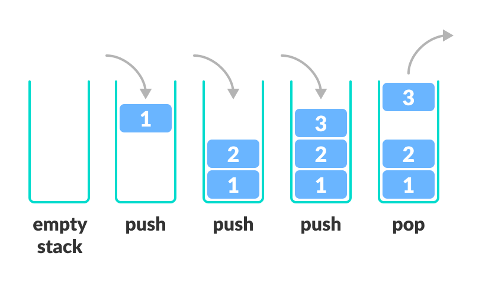
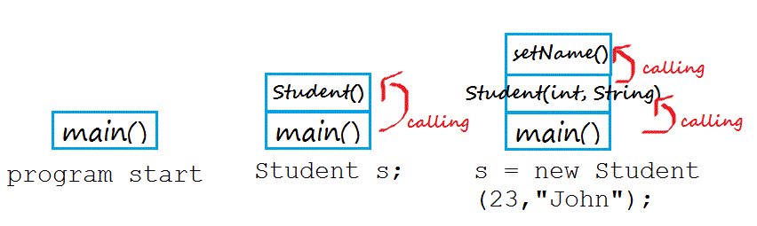

栈（Stack）又称为堆栈、堆叠，它其实有三种含义，适用于不同场合，很容易混淆。这篇文章主要介绍 stack 在数据结构方面的含义。

## 1. 数据结构栈

Stack 是计算机科学中的一种抽象资料类型，是一种有序集合。

Stack 数据结构与物理堆栈相同，添加项目时，将其添加到顶部（top）；移除项目时，始终从顶部移除。


#### 1.1 Stack 操作类型

Stack 非常简单、有效，主要是为了方便访问数据。如果你感觉链表难于理解，那么相对来说 stack 就很容易了。

Stack 只有两个必须实现的操作：

- push：向栈顶部添加元素。
- pop：从栈顶部移除元素。

Stack 只能从同一端添加、移除元素，即先进后出（last in first out，缩写为LIFO），最后添加的元素会最先被移除。

栈在所有编程领域都得到了广泛应用。下面是几个示例：

- iOS 的导航控制器使用 stack 管理视图控制器的入栈、出栈。
- 在架构层面，内存分配使用栈架构。局部变量的内存也是使用栈管理。
- 搜索和征服算法使用栈促进回溯。例如，从迷宫中查找路线。

#### 1.2 Stack 的实现

创建一个 playground，在 Sources 文件夹内创建 Stack.swift 文件，在该文件内添加以下代码：

```
public struct Stack<Element> {
    private var storage: [Element] = []
    
    public init() { }
}

extension Stack: CustomStringConvertible {
    public var description: String {
        """
        ---- top ----
        \(storage.map { "\($0)"}.reversed().joined(separator: "\n"))
        -------------
        """
    }
}
```

这里定义了 Stack 数据存储方式，即数组。使用数组的`append(_:)`、`popLast()`存取数据是恒定时间的操作，可以满足栈的后进先出原则。

遵守`CustomStringConvertible`协议可以让栈内容以可读方式输出。

#### 1.3 push、pop 操作



为 Stack 添加以下操作：

```
    public mutating func push(_ element: Element) {
        storage.append(element)
    }
    
    @discardableResult
    public mutating func pop() -> Element? {
        storage.popLast()
    }
```

在 playground page 添加以下代码：

```
example(of: "Using a stack") {
    var stack = Stack<Int>()
    stack.push(1)
    stack.push(2)
    stack.push(3)
    stack.push(4)
    
    print(stack)
    
    if let poppedValue = stack.pop() {
        assert(4 == poppedValue)
        print("Popped: \(poppedValue)")
    }
}
```

输出如下：

```
--- Example of Using a stack
---- top ----
4
3
2
1
-------------
Popped: 4
```

push、pop 操作时间复杂度都是`O(1)`。

#### 1.4 非必须实现操作

还有一些非必须实现，但实现了会让栈方便使用的操作。在`Stack.swift`中添加以下代码：

```
    public func peek() -> Element? {
        storage.last
    }
    
    public var isEmpty: Bool {
        peek() == nil
    }
```

`peek()`只是查看顶部元素，并不对数据进行操作。

> 你也许会想要不要实现 Swift 中集合相关协议，但栈就是为了限制可以存取数据的方式，遵守类似`Collection`的协议会违背这一原则。

有时需将已有的数组转化为 stack，以保证存取顺序。添加以下初始化方法，直接更新内部存储。如下所示：

```
    public init(_ elements: [Element]) {
        storage = elements
    }
```

在 playground page 添加以下代码：

```
example(of: "Initializing a stack from an array") {
    let array = ["A", "B", "C", "D"]
    var stack = Stack(array)
    print(stack)
    stack.pop()
}
```

上述代码创建的栈元素都是字符串，输出栈后会 pop 掉顶部元素。

#### 1.5 实战

stack 可用于解决字符串中的括号 (  ) 是否匹配。当遇到左括号时，push 进入 stack；遇到右括号时，从 stack pop 一个元素。如果最终 stack 刚好为空，则符号匹配；否则，不匹配。

```
// 查看圆扣号是否匹配
func checkParentheses(_ string: String) -> Bool {
    var stack = Stack<Character>()
    
    for character in string {
        if character == "(" {
            // 遇到左括号，添加到栈。
            stack.push(character)
        } else if character == ")" {
            if stack.isEmpty {
                // 遇到右括号时，如果栈是空的，则不匹配。
                return false
            } else {
                // 不是空的，移除一个元素。
                stack.pop()
            }
        }
    }
    
    // 最终，栈是空的，就刚好匹配；否则，不匹配。
    return stack.isEmpty
}
```

上述算法的时间复杂度是`O(n)`，n是字符串长度。由于使用了 Stack 数据结构，它的空间复杂度也是`O(n)`。

#### 1.6 要点

栈对搜索树至关重要。例如正在迷宫内找出口，可以先把指定点的可选路线左、中、右都加入到栈中，发现一条路线不可行时，只需将其从栈中pop，继续下一条路线即可。

- 栈是后进先出的数据结构。
- 虽然 stack 数据结构简单，但也是一种重要的数据结构。
- Stack 只有两个必备的操作，push 用于添加数据，pop 用于移除数据。

## 2. 代码调用栈

stack 第二种含义是调用栈（call stack），表示函数像堆积木一样存放，以实现层层调用。

下面是一段 Java 代码：

```
class Student{
    int age;              
    String name;      

    public Student(int Age, String Name)
    {
        this.age = Age;
        setName(Name);
    }
    public void setName(String Name)
    {
        this.name = Name;
    }
}

public class Main{
    public static void main(String[] args) {
            Student s;           
            s = new Student(23,"Jonh");
    }
}
```

上述代码运行时，首先调用 main 方法，里面生成一个 Student 实例，于是又调用 Student 构造函数；在构造函数内，又调用 setName 方法。



这三次调用像积木一样堆起来，称作调用栈。程序运行时，总是先完成最上层的调用，然后将它的值回到下一层调用，直到完成整个调用栈返回结果。

## 3. 内存区域栈

stack 的第三种含义是存放数据的一种内存区域。一般，系统会划分出两种不同的内存空间：stack（栈）和heap（堆）。

stack 是有结构的，每个区块按照一定次序存放，明确知道每个区块大小。


heap 是没有结构的，数据任意存放。


参考资料：

1. [Stack的三种含义](http://www.ruanyifeng.com/blog/2013/11/stack.html)
2. [What is a Stack?](https://runestone.academy/runestone/books/published/pythonds/BasicDS/WhatisaStack.html)
3. [Stack Data Structure](https://www.programiz.com/dsa/stack)

