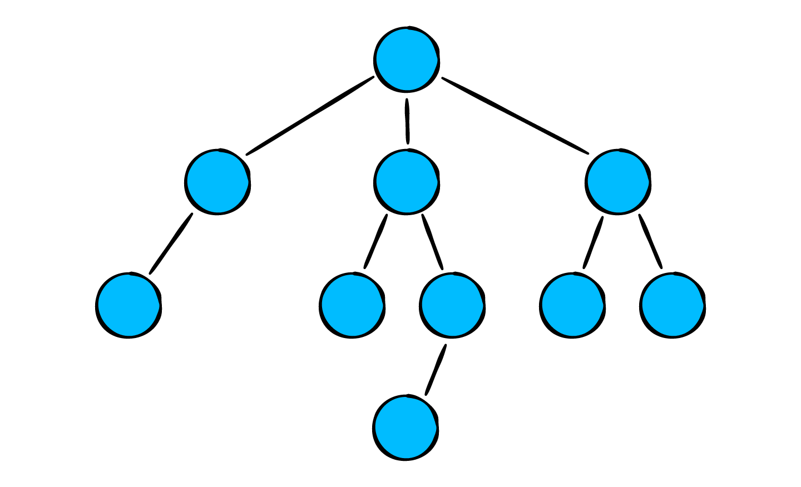
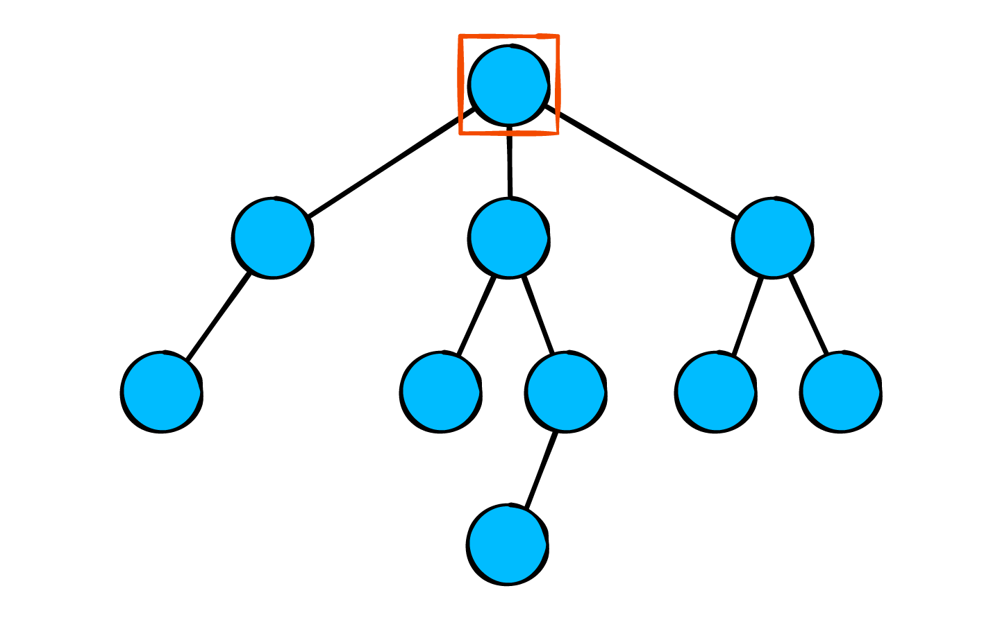
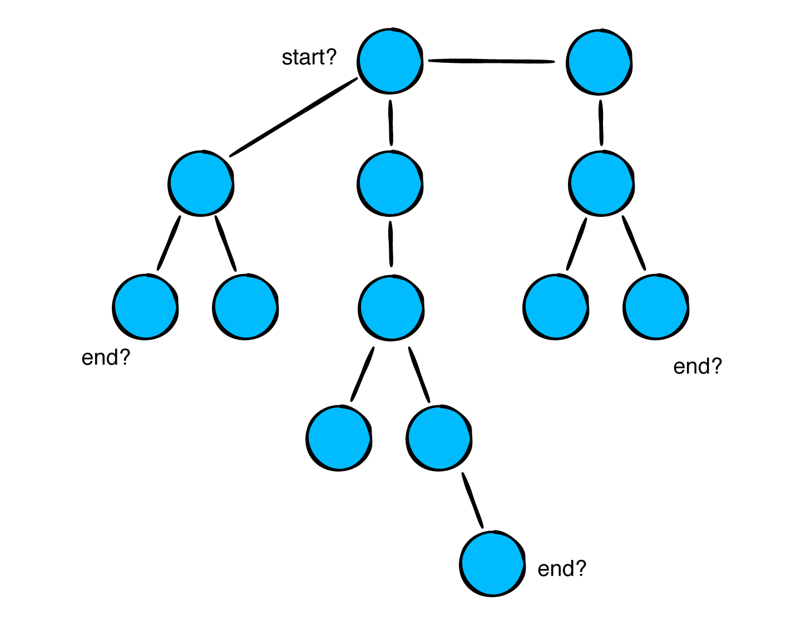
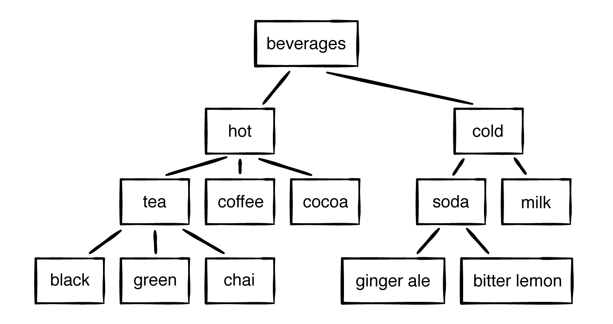
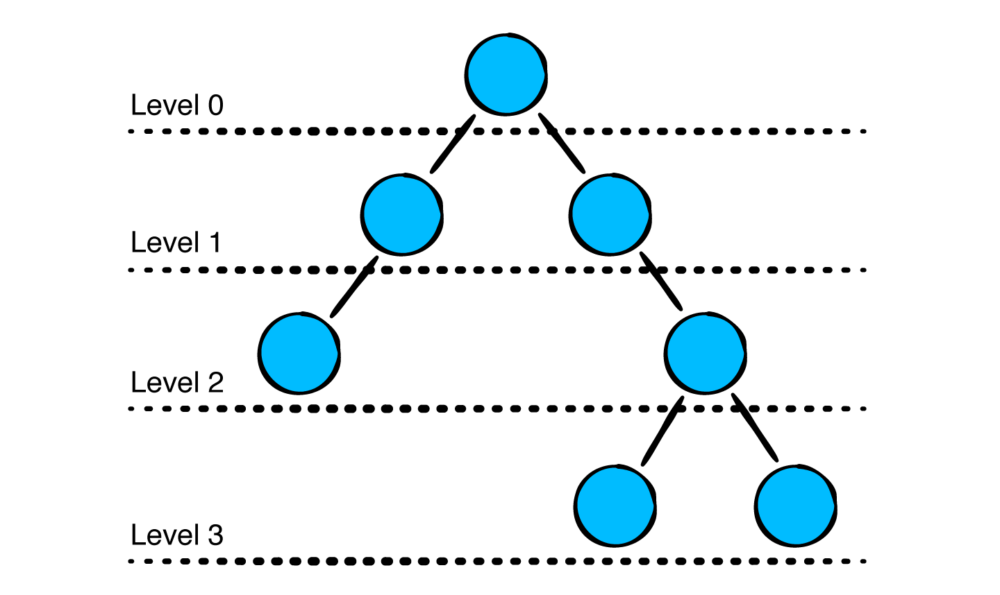

树（Tree）是一种很重要的数据结构，在软件开发的多方面都有使用：

- 表示层级结构。
  - 计算机语言的抽象语法树。
  - 解析人类语言的树。
  - XML 和 HTML 文档对象模型。
  - 处理 JSON 和YAML 文档。
- 快速查找数据。
- 管理有序数据。

树的类型有很多，其有不同的形状和大小。这一篇文章将介绍树的基本信息，以及如何实现树。

## 1. 术语

下面是一些与树相关常见术语。

#### 1.1 节点 Node

与[链表](https://github.com/pro648/tips/blob/master/sources/%E9%93%BE%E8%A1%A8%20LinkedList.md)相似，树也由节点构成。


每个节点包含数据和指向子节点的引用。

#### 1.2 父节点 Parent、子节点 Child

Tree 从顶部向下看，和植物中的树很像，只是方向相反。

每个节点向上都有一个节点（最顶部节点除外），上面的节点称为父节点（parent node）。节点的下面，与其直接相连的称为子节点（child node）。在树中，每个child只有一个parent。


#### 1.3 根节点 Root

树最顶部的节点称为根节点（root），根节点是唯一没有父节点的节点。



#### 1.4 叶子节点 Leaf

如果节点没有子节点，则称为叶子节点（leaf）。


此外，还有以下常用术语：

- 节点的度（degree）：该节点子树的个数称为该节点的度。
- 树的度：所有节点中，度的最大值称为树的度。
- 非叶子节点：度不为零的节点。
- 高度（height）：当前节点到最远叶子节点的路径长，所有树叶的高度为零。
- 深度（depth）：对于任意节点n，n的深度为从根到n的唯一路径长。有些地方认为根深度为0，有些地方认为根深度为1。
- 兄弟节点：具有相同父节点的节点互相称为兄弟节点。
- 节点的层数（level）：从根开始定义，根为第一层，根的子节点为第二层。以此类推。
- 堂兄弟节点：父节点在同一层的节点互为堂兄弟。
- 节点的祖先（ancestor）：从根到该节点所经分支上的所有节点。
- 子孙（descendant）：以某节点为根的子树中任一节点都称为该节点的子孙。
- 森林：由m（m >= 0）棵互不相交的树的集合称为森林。

## 2. 实现

Tree 由 node 构成，这里先创建`TreeNode`类。

创建一个 playground，并在 Sources 中添加`TreeNode.swift`文件，`TreeNode`代码如下：

```
public class TreeNode<T> {
    public var value: T
    public var children: [TreeNode] = []
    
    public init(_ value: T) {
        self.value = value
    }
}
```

每个 node 存储一个值和一个数组，数组里存储着 children。

在`TreeNode`中添加以下代码：

```
    /// 向当前节点添加子节点
    /// - Parameter child: 要添加的子节点
    public func add(_ child: TreeNode) {
        children.append(child)
    }
```

在 playground page 中添加以下代码：

```
example(of: "creating a tree") {
    let beverages = TreeNode("Beverages")
    
    let hot = TreeNode("Hot")
    let cold = TreeNode("Cold")
    
    beverages.add(hot)
    beverages.add(cold)
}
```

树可以很方便的用于层次结构问题。上述代码定义了三个节点，并组织成逻辑层次，其对应于以下结构：


## 3. 遍历算法 Traversal Algorithms

线性表（如数组、链表、[队列](https://github.com/pro648/tips/blob/master/sources/%E9%98%9F%E5%88%97%E7%9A%84%E5%9B%9B%E7%A7%8D%E5%AE%9E%E7%8E%B0%E6%96%B9%E5%BC%8F%EF%BC%9A%E6%95%B0%E7%BB%84%E3%80%81%E5%8F%8C%E5%90%91%E9%93%BE%E8%A1%A8%E3%80%81%E7%8E%AF%E5%BD%A2%E7%BC%93%E5%86%B2%E5%8C%BA%E3%80%81%E6%A0%88.md)）有明确的开始、结束位置，遍历很简单。


与线性表相比，遍历树会变得复杂些。



遍历时左侧节点有优先权吗？深度与优先权有关联吗？在实际应用时，应根据要解决的问题决定遍历策略。不同类型树、不同类型问题，有不同遍历方式。

#### 3.1 深度优先

在`TreeNode.swift`底部添加以下方法：

```
extension TreeNode {
    /// 深度优先遍历
    public func forEachDepthFirst(visit: (TreeNode) -> Void) {
        visit(self)
        children.forEach({
            // 使用递归遍历
            $0.forEachDepthFirst(visit: visit)
        })
    }
}
```

如果不想使用递归，可以使用[栈](https://github.com/pro648/tips/blob/master/sources/%E6%A0%88%20Stack.md)实现。

在 playground page 添加以下代码，检验深度优先遍历：

```
func makeBeverageTree() -> TreeNode<String> {
    let tree = TreeNode("Beverages")
    
    let hot = TreeNode("hot")
    let cold = TreeNode("cold")
    
    let tea = TreeNode("tea")
    let coffee = TreeNode("coffee")
    let chocolate = TreeNode("cocoa")
    
    let blackTea = TreeNode("black")
    let greenTea = TreeNode("green")
    let chaiTea = TreeNode("chai")
    
    let soda = TreeNode("soda")
    let milk = TreeNode("milk")
    
    let gingerAle = TreeNode("ginger ale")
    let bitterLemon = TreeNode("bitter lemon")
    
    tree.add(hot)
    tree.add(cold)
    
    hot.add(tea)
    hot.add(coffee)
    hot.add(chocolate)
    
    cold.add(soda)
    cold.add(milk)
    
    tea.add(blackTea)
    tea.add(greenTea)
    tea.add(chaiTea)
    
    soda.add(gingerAle)
    soda.add(bitterLemon)
    
    return tree
}
```

上述代码创建的树如下：



添加以下代码：

```
example(of: "depth-first traversal") {
    let tree = makeBeverageTree()
    tree.forEachDepthFirst(visit: {
        print($0.value)
    })
}
```

输出如下：

```
--- Example of: depth-first traversal
Beverages
hot
tea
black
green
chai
coffee
cocoa
cold
soda
ginger ale
bitter lemon
milk
```

#### 3.2 层序遍历

层序遍历根据 node depth，先遍历同一层节点。

```
extension TreeNode {
    /// 层序遍历
    public func forEachLevelOrder(visit: (TreeNode) -> Void) {
        visit(self)
        var queue = Queue<TreeNode>()
        children.forEach({
            queue.enqueue($0)
        })
        
        while let node = queue.dequeue() {
            visit(node)
            node.children.forEach{ queue.enqueue($0)}
        }
    }
}
```

这里使用队列而非栈确保节点读取顺序。

> Queue是[队列](https://github.com/pro648/tips/blob/master/sources/%E9%98%9F%E5%88%97%E7%9A%84%E5%9B%9B%E7%A7%8D%E5%AE%9E%E7%8E%B0%E6%96%B9%E5%BC%8F%EF%BC%9A%E6%95%B0%E7%BB%84%E3%80%81%E5%8F%8C%E5%90%91%E9%93%BE%E8%A1%A8%E3%80%81%E7%8E%AF%E5%BD%A2%E7%BC%93%E5%86%B2%E5%8C%BA%E3%80%81%E6%A0%88.md)这篇文章创建的数据结构，你可以在文章底部的源码中获取。

`forEachLevelOrder`函数按照层序遍历：



使用以下代码进行层序遍历：

```
example(of: "level-order traversal") {
    let tree = makeBeverageTree()
    tree.forEachDepthFirst(visit: {
        print($0.value)
    })
}
```

运行后输出如下：

```
--- Example of: level-order traversal
Beverages
hot
cold
tea
coffee
cocoa
soda
milk
black
green
chai
ginger ale
bitter lemon
```

#### 3.3 搜索

前面已经介绍了深度优先、层序遍历两种遍历方式，想要搜索 tree 是否包含指定元素就变得简单了。

```
extension TreeNode where T: Equatable {
    public func search(_ value: T) -> TreeNode? {
        var result: TreeNode?
        forEachDepthFirst { (node) in
            if node.value == value {
                result = node
            }
        }
        return result
    }
}
```

使用以下代码搜索指定值：

```
example(of: "searching for a node") {
    let tree = makeBeverageTree()
    
    if let searchResult1 = tree.search("ginger ale") {
        print("Found node: \(searchResult1.value)")
    }
    
    if let searchResult2 = tree.search("WKD Blue") {
        print(searchResult2.value)
    } else {
        print("Couldn't find WKD Blue")
    }
}
```

运行后控制台输出如下：

```
--- Example of: searching for a node
Found node: ginger ale
Couldn't find WKD Blue
```

深度优先遍历时，如果有多个匹配值，则会取最后一个。

## 4. 树算法题

#### 4.1 同一层节点打印到同一行

根据节点所在层，将同一层节点打印到同一行。如下图：


输出应如下所示：

```
15 
1 17 20 
1 5 0 2 5 7 
```

使用层序遍历可以解决按照层打印的问题，只需判断出何时换行。如下所示：

```
func printEachLevel<T>(for tree: TreeNode<T>) {
  var queue = Queue<TreeNode<T>>()
  var nodesLeftInCurrentLevel = 0
  
  queue.enqueue(tree)
  while !queue.isEmpty {
    nodesLeftInCurrentLevel = queue.count
    // 循环打印一层
    while nodesLeftInCurrentLevel > 0 {
      guard let node = queue.dequeue() else { break }
      print("\(node.value)", terminator: " ")
      node.children.forEach { queue.enqueue($0) }
      nodesLeftInCurrentLevel -= 1
    }
    // 换行
    print()
  }
}
```

使用`nodesLeftInCurrentLevel`记录队列当前元素数量，此时打印队列元素时不打印换行符，直到该层打印结束才换行。

该算法时间复杂度为`O(n)`。由于初始化了队列作为节点的容器，空间复杂度也是`O(n)`。

#### 4.2 为树添加父节点

树的定义中只包含了子节点，删除、旋转等操作时需要用到父节点，应如何为树添加父节点？

可以按照下面方式为树添加一个父节点属性：

```
public class TreeNode<T> {
    public weak var parent: TreeNode?
    ...
}
```

根节点没有父节点，因此这里使用了可选类型。节点对子节点强引用，对父节点需为弱引用，否则会产生循环引用。

## 总结

树有以下这些要点：

- 树与链表有一些相似的地方，但链表只能有一个子节点，树可以有多个子节点。
- 除根节点外，所有节点都只有一个父节点。
- 叶子节点没有子节点。
- 像层序遍历、深度优先遍历算法，适用于所有类型树。但可能因树类型不同，具体实现有所差异。

Demo名称：Tree  
源码地址：<https://github.com/pro648/BasicDemos-iOS/tree/master/Tree>