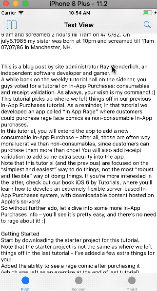
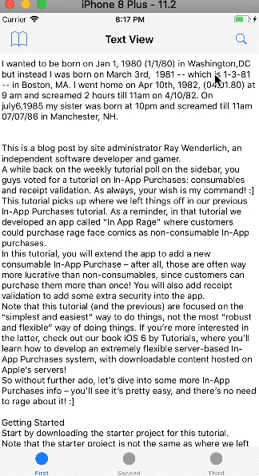
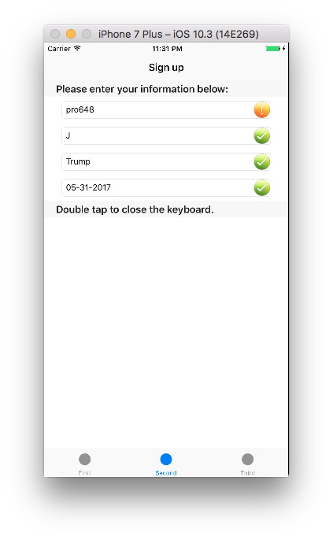
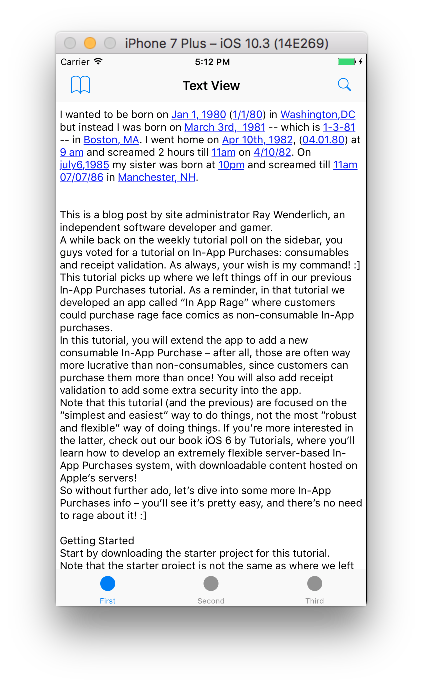

正则表达式又称为正规表示法、规则表达式、常规表示法，英语为Regular Expression，常简写为regex、regexp或RE。正则表达式使用单个字符串来描述，匹配一系列符合某个句法规则的字符串，也就是正则表达式可以用简明的符号来描述大量的可能性。

在文本编辑器中，正则表达式可以用来检索、替换匹配某个模式的文本。如，三个字母后跟三位数字，三个字母后跟冒号。使用这种模式匹配可以验证电话号码、邮箱地址、用户输入文本等内容是否符合格式要求，也可以执行替换等高级操作。

通过这篇文章，你将学会如何使用正则表达式检索符合某个模式的文本、替换文本，检验用户输入内容是否符合格式要求，查找并突出显示文本。

## 1. 基本语法

一个正则表达式通常被称为一个*模式（pattern）*，为用来描述或匹配符合某个句法规则的字符串。例如：`pro648`和`Pro648`这两个字符串都可以由`(p|P)ro648`这个模式描述。大部分正则表达式都有如下结构：

##### 选择

竖直分隔符`|`代表选择。例如`gray|grey`可以匹配*gray*或*grey*。

##### 匹配

*圆括号 ( )*可以用来定义操作符的范围和优先级。例如：`gr(a|e)y`与`gray|grey`相同，`(grand)?father`匹配*father*和*grandfather*。

##### 限定符

限定符用来指定正则表达式的一个给定组件必需要出现多少次才能满足匹配。最常见的数量限定符包括`+`、`?`、`*`。不添加限定符表示出现且只出现一次。

- `+`：代表前面的字符至少出现一次（1次、或多次）。如：`goo+gle`可以匹配*google*、*gooogle*、*goooogle*等，但不匹配*gogle*。
- `?`：代表前面的字符最多出现一次（0次，或1次）。如：`colou?r`可以匹配*color*或*colour*。
- `*`：代表前面的字符可以不出现、出现一次、多次（0次，1次，或多次）。如：`p*ro648`可以匹配*ro648*、*pro648*、*ppro648*、*pppro648*等。

> 在这篇文章会创建一系列Regex，如果你想更直观观察、测试结果，可以使用[在线正则表达式](http://tool.oschina.net/regex)工具。

上述的这些构造子可以自由组合，下面是常用正则表达式符号，

## 2. NSRegularExpression参照表

正则表达式语法很简洁，一般多种符号组合使用。下面是常用正则表达式符号含义汇总表。你可以点击[这里](https://github.com/pro648/tips/wiki/iOS%E6%AD%A3%E5%88%99%E8%A1%A8%E8%BE%BE%E5%BC%8F%E8%AF%AD%E6%B3%95%E5%85%A8%E9%9B%86)收藏这份正则表达式语法含义表。

- 特殊字符

```
* ? + [ ] ( ) { } ^ $ | \ . / 
```

如果需要匹配这些特殊符号，需要在其前面用`\`标志出。

- 元字符

| 字符        | 描述                                       |
| --------- | ---------------------------------------- |
| [pattern] | 匹配pattern中的任一字符。如：[a-z]匹配a-z的任一字符。       |
| .         | 匹配`\n`之外的任何字符。                           |
| ^         | 匹配字符的开始位置。                               |
| $         | 匹配字符的结束位置。                               |
| \         | 将下一个字符标记为一个特殊字符、或一个原义字符、或一个向后引用。如：`n`匹配字符*n*，`\n`匹配一个换行符。序列`\\`匹配\，`\(`匹配( 。 |
| \b        | 匹配单词边界，边界发生在单词(\w)和非单词(\W)字符之间的转换处。如：`ne\b`可以匹配*throne*中的*ne*，但不能匹配*Chinese*中的*ne*，也能匹配`throne!`中的*ne*，因为`!`是非单词。 |
| \B        | 匹配非单词边界。`ne\B`可以匹配*Chinese*中的*ne*，不能匹配*throne*中的*ne*。 |
| \cX       | 匹配control-X字符。如：\cM匹配一个control-M或回车符。X的值必需为a-z或A-Z之一。否则，c将被视为一个原义的`c`字符。 |
| \d        | 匹配一个数字字符，等价于[0-9]。                       |
| \D        | 匹配一个非数字字符，等价于[^0-9]。                     |
| \f        | 匹配一个换页符。                                 |
| \n        | 匹配一个换行符。                                 |
| \s        | 匹配任何空白符，包括空格、制表符、换页符等等。等价于[\t\n\f\r\p{Z}] |
| \S        | 匹配任何非空字符。                                |
| \w        | 匹配包括下划线的任何单词字符。等价于[a-zA-Z0-9]。           |
| \W        | 匹配任何非单词字符。等价于[^a-zA-Z0-9]。               |

- 运算符

| 字符         | 描述                                                         |
| ------------ | ------------------------------------------------------------ |
| \|           | 或，`A\|B`匹配*A*或*B*                                       |
| *            | 匹配零次、或多次，尽可能多的匹配，即贪婪模式(greediness)。如：`zo*`能匹配*z*、*zo*、*zoo*等。`*`等价于`{0,}`。 |
| +            | 一次、或多次，尽可能多的匹配。如：`zo+`能匹配*zo*以及*zoo*，但不能匹配*z*，`+`等价于`{1,}`。 |
| ?            | 匹配零次、一次，优先匹配一次。`(n)?ever`可以匹配*never*以及*ever*。`?`等价于`{0,1}`。 |
| {n}          | 匹配n次。n为非负整数，大括号内不能有空格。如：`o{2}`不能匹配*word*中的*o*，但能匹配*Google*中的两个*o*。 |
| {n,}         | 至少匹配n次，尽可能多的匹配。n为非负整数。`0{2,}`不能匹配*word*中的*o*，但能匹配*gooooogle*中的所有*o* |
| {n,m}        | 至少匹配n次，最多匹配m次，尽可能多的匹配。n和m均为非负整数，且n<=m。 |
| *?           | 匹配零次、或多次。尽可能少的匹配，即懒惰模式(laziness)。     |
| +?           | 匹配一次、或多次，尽可能少的匹配。                           |
| ??           | 匹配零次、或一次，优先匹配零次。                             |
| {n}?         | 匹配n次。                                                    |
| {n,}?        | 至少匹配n次，但不超过整体模式匹配所需。                      |
| {n,m}?       | 匹配n至m次，尽可能少的匹配，但不少于n次。                    |
| *+           | 匹配零次、或多次。第一次遇到时，尽可能多地匹配，即使整体匹配失败，也不回溯，称为*Possessive Match*。点击查看[possessive match和贪婪匹配](https://github.com/pro648/tips/wiki/%E6%AD%A3%E5%88%99%E8%A1%A8%E8%BE%BE%E5%BC%8Fpossessive%E3%80%81greediness%E5%92%8Claziness%E5%8C%BA%E5%88%AB)区别。 |
| ++           | 匹配一次、或多次。*Possessive Match*。                       |
| ?+           | 匹配零次、或一次。*Possessive Match*。                       |
| {n}+         | 匹配n次。                                                    |
| {n,}+        | 至少匹配n次。*Possessive Match*。                            |
| {n,m}+       | 匹配n至m次，*Possessive Match*。                             |
| (pattern)    | 匹配*pattern*，并捕获这一匹配的捕获组，该子字符串用于向后引用。 |
| (?:pattern)  | 匹配*pattern*但不捕获这一匹配的子字符串，也就是说这是一个不捕获匹配，不存储匹配的子字符串用于向后引用，比捕获组高效。 |
| (?=pattern)  | 正向肯定预查（Look-ahead assertion)。在任何匹配pattern的字符串开始处匹配查找字符串。这是一个非获取匹配。如：`Windows(?=7\|8\|8.1\|10)`能匹配*Windows10*中的*Windows*，但不能匹配*Windowsxp*中的*Windows*。预查不消耗字符，也就是在一个匹配发生后，在最后一次匹配之后立即开始下一次匹配的搜索，而不是从包含预查的字符之后开始。 |
| (?!pattern)  | 正向否定预查（ Negative look-ahead assertion)，在任何不匹配pattern的字符串开始处匹配查找字符串。这是一个非获取匹配。如：`Windows(?!7\|8\|8.1\|10)`能匹配*Windowsxp*中的*Windows*，但不能匹配*Windows10*中的*Windows*。预查不消耗字符。 |
| (?<=pattern) | 反向肯定预查（Look-behind assertion)，与正向肯定预查类似，只是方向相反。如：`(?<=7\|8\|8.1\|10)Windows`能匹配*7Windows*中的*Windows*，但不能匹配*xpWindows*中的*Windows*。 |
| (?<!pattern) | 反向否定查询（Negative Look-behind assertion），与正向否定预查类似，只是方向相反。如：`(?<!7\|8\|8.1\|10)Windows`能匹配*xpWindows*中的*Windows*，但不能匹配*7Windows*中的*Windows*。 |

- 其它

| 符号   | 描述                                       |
| ---- | ---------------------------------------- |
| \n   | 向后引用，匹配第n个捕获组。其中，1<= 正整数n <=捕捉组总数。       |
| $n   | n为非负整数，向后引用第n个捕捉组，0<= n <=捕捉组总数。$后没有数字时该符号没有任何特殊含义。 |

- 优先级

在这些运算符同时出现时，按照下面的优先级进行操作。

| 优先级  | 符号                   |
| ---- | -------------------- |
| 最高   | \                    |
| 高    | ( )、(?: )、(?= )、[ ]  |
| 中    | *、+、?、{n}、{n,}、{n,m} |
| 低    | ^、$、中介字符             |
| 最低   | \|                   |

> 如果想要收藏上面的参照表备用，打开[iOS正则表达式语法全集](https://github.com/pro648/tips/wiki/iOS%E6%AD%A3%E5%88%99%E8%A1%A8%E8%BE%BE%E5%BC%8F%E8%AF%AD%E6%B3%95%E5%85%A8%E9%9B%86)网页加入书签。

## 3. 在iOS中使用正则表达式

现在我们已经了解了regex的基本内容，下面开始学习在iOS中如何使用regex。

这篇文章的重点在于regex，这里不再描述其它细节问题，请直接下载[NSRegularExpression模板](https://github.com/pro648/BasicDemos-iOS)文件。下载完成后，在xcode中运行该模板，可以看到这个demo的界面部分已经完成，只剩*Regular Expression*部分。如下所示：



在这个demo里，正则表达式有以下三项用途：

1. 进行文本查找、替换。
2. 验证用户输入文本是否符合格式要求。
3. 自动格式化用户输入文本。

`First`、`Second`和`Third`视图控制器对应实现上述三项功能。

## 4. 查找和替换

在这个demo里，查找和替换功能实现过程如下：

1. `FirstViewController`上有一个仅读的文本`UITextView`，文本视图内包含需要处理的文本。
2. 点击导航栏上的搜索按钮，会以模态形式呈现`SearchViewController` 
3. 在`SearchViewController` 的文本框中输入相关信息，点击`Search`按钮。
4. 此时，app会退出`SearchViewController` ，并在`UITextView`突出显示所有匹配文本。
5. 如果开启了`SearchViewController` 中的`Replace`选项，app会执行查找并替换功能。

点击`FirstViewController` 导航栏上的`Bookmarks`按钮可以突出显示`UITextView`中任何日期、时间和地址。为了简单起见，这里不会包括所有格式的日期、时间和地址。在这篇文章结束前，再来实现这项功能。

想要实现查找功能，首先需要把*pattern*字符串转变为`NSRegularExpression`对象。

进入`FirstViewController.m`，将`regularExpressionWithString: options: ` 中的代码用如下代码替换。

```
// Create a regular expression with given string and options
- (NSRegularExpression *)regularExpressionWithString:(NSString *)string options:(NSDictionary *)options
{
    // Create a regular expression
    BOOL isCaseSensitive = [[options objectForKey:kSearchCaseSensitiveKey] boolValue];
    BOOL isWholeWords = [[options objectForKey:kSearchWholeWordsKey] boolValue];
    
    NSRegularExpressionOptions regexOptions = isCaseSensitive ? 0 : NSRegularExpressionCaseInsensitive;
    NSString *placeHolder = isWholeWords ? @"\\b%@\\b" : @"%@" ;
    NSString *pattern = [NSString stringWithFormat:placeHolder,string];
    
    NSError *error = nil;
    NSRegularExpression *regex = [NSRegularExpression regularExpressionWithPattern:pattern options:regexOptions error:&error];
    if (error) {
        NSLog(@"Could't create regex with given string and options");
    }
    
    return regex;
}
```

通过调用`regularExpressionWithPattern: options: error: `方法把字符串转换为`NSRegularExpression`对象。再此之前，需要注意以下两点：

- 如果*Match Case*开关状态为开启，设置`NSRegularExpressionOptions`的值为`0`，此时，查找会区分字母大小写，即默认区分字母大小写。开关状态为关闭时，设置`NSRegularExpressionOptions`的值为`NSRegularExpressionCaseInsensitive`，此时，查找不区分字母大小写。
- 如果*Whole Words*开关状态为开启，在*pattern*前后添加`\b`用以匹配单词边界，这时查找的会是整个单词。

把字符串转换为`NSRegularExpression`对象后，就可以用来匹配文本。

在`searchAndReplaceText`方法中添加如下代码：

```
// Search for a searchString and replace it with the replacementString in the given text view with search options.
- (void)searchAndReplaceText:(NSString *)string withText:(NSString *)replacement inTextView:(UITextView *)textView options:(NSDictionary *)options{
    // Text before replacement
    NSString *beforeText = textView.text;
    
    // Create a range for it, We do the replacement on the whole range of the text view, not noly a portion of it.
    NSRange range = NSMakeRange(0, beforeText.length);
    
    // Call the convenience method to create a regex for us with the options we have.
    NSRegularExpression *regex = [self regularExpressionWithString:string options:options];
    
    // Call the NSRegularExpression method to do the replacement for us.
    NSString *afterText = [regex stringByReplacingMatchesInString:beforeText options:0 range:range withTemplate:replacement];
    
    // Update UI
    textView.text = afterText;
}
```

首先，获取当前文本视图的内容，得到当前文本的`NSRange`对象。因为也可以对当前文本的部分字符串使用正则表达式，所以这里需要明确指出使用正则表达式的范围。在这里指定范围为整个字符串。

在`stringByReplacingMatchesInString: options: range: withTemplate: `方法内执行替换操作，该方法没有修改原来字符串，直接返回一个替换后的字符串，之后把返回的字符串赋值给`UITextView`，以便更新UI。

修改`searchText: inTextView: options: `方法如下：

```
- (void)searchText:(NSString *)string inTextView:(UITextView *)textView options:(NSDictionary *)options{
    // 1.Range of visible text
    NSRange visibleRange = [self visibleRangeOfTextView:textView];
    
    // 2.Get a mutable sub-range of attributed string of the text view that is visible.
    NSMutableAttributedString *visibleAttributedText = [textView.attributedText attributedSubstringFromRange:visibleRange].mutableCopy;
    
    // Get the string of the attributed text.
    NSString *visibleText = visibleAttributedText.string;
    
    // 3.Create a new range for the visible text. This is different from visibleRange. visibleRange is a portion of all textView that is visible, but visibleTextRange is only for visibleText, so it starts at 0 and its length is the length of visibleText.
    NSRange visibleTextRange = NSMakeRange(0, visibleText.length);
    
    // 4.Call the convenient method to create a regex for us with the options we have.
    NSRegularExpression *regex = [self regularExpressionWithString:string options:options];
    
    // 5.Find matches
    NSArray *matches = [regex matchesInString:visibleText options:NSMatchingReportCompletion range:visibleTextRange];
    
    // 6.Iterate through the matches and highlights them.
    for (NSTextCheckingResult *result in matches) {
        NSRange matchRange = result.range;
        [visibleAttributedText addAttribute:NSBackgroundColorAttributeName value:[UIColor yellowColor] range:matchRange];
    }
    
    // 7.Replace the range of the attributed string that we just highlighted. First, create a CFRange from the NSRange of the visible range.
    CFRange visibleRange_CF = CFRangeMake(visibleRange.location, visibleRange.length);
    
    // Get a mutable copy of the attributed text of the text view.
    NSMutableAttributedString *textViewAttributedString = self.textView.attributedText.mutableCopy;
    
    // Replace the visible range.
    CFAttributedStringReplaceAttributedString((__bridge CFMutableAttributedStringRef)textViewAttributedString, visibleRange_CF, (__bridge CFAttributedStringRef)(visibleAttributedText));
    
    // 8.Update UI.
    textView.attributedText = textViewAttributedString;
}
```

以下是上述代码的分步说明：

1. 只对当前屏幕显示文本进行查找、替换，会比一次查找、替换整个`UITextView`上文本高效很多。`visibleRangeOfTextView: `方法会返回当前`UITextView`上可见文本的`NSRange`。
2. 获取文本视图可见部分属性的字符串，会在下面使用到。
3. 为可见文本创建`NSRange`类型的`visibleTextRange`对象，第一步创建的`visibleRange`确定文本视图的哪一部分可见，但`visibleTextRange`仅用于提取到的可见文本的子字符串，因此，开始位置为`0`，长度为`visibleText`的长度。这个是需要传入正则表达式引擎的范围。
4. 根据提供的`options`，调用`regularExpressionWithString: options: `方法创建*regex*。
5. 把所有匹配的文本保存到`matches`数组，该数组内的对象都是`NSTextCheckingResult`类型实例对象。
6. 遍历`matches`数组，突出显示匹配的文本。
7. 替换刚刚突出显示的属性字符串。为此，从可见范围的`visibleRange`创建`CFRange`类型的`visibleRange_CF`。获取文本视图中属性文本的可变副本并执行替换。
8. 用突出显示的属性文本替换之前属性文本，用以更新`UITextView`。

> `matchesInString:options:range:`是调用`enumerateMatchesInString:options:range:usingBlock:` 的便捷方法。也就是说，即使你使用`matchesInString:options:range:`方法，系统最后调用的也是`enumerateMatchesInString:options:range:usingBlock:`方法。所以注释5和6可以写为一行代码。

在app中实现搜索、突出显示和渲染属性字符串是一个非常实用的功能，但也会带来性能成本，特别是文本很长时。为了高效实现这些功能，可以只对可见区域执行查找、突出显示等操作。

然而，当你滑动文本视图时，可见区域没有执行查找、突出显示等操作。所以，需要一个在滑动时不断更新UI的机制。为实现该功能，需要实现两个`UIScrollViewDelegate`代理方法，以便在滑动视图时更新文本内容。

在`FirstViewController.m`内添加`scrollViewWillEndDragging: withVelocity: targetContentOffset: `方法和`scrollViewDidEndDecelerating: `方法，代码如下：

```
#pragma mark 
#pragma mark UIScrollViewDelegate

// Called when the user finishes scrolling the content.
- (void)scrollViewWillEndDragging:(UIScrollView *)scrollView withVelocity:(CGPoint)velocity targetContentOffset:(inout CGPoint *)targetContentOffset{
    if (CGPointEqualToPoint(velocity, CGPointZero)) {
        if (self.lastSearchString && self.lastSearchOptions && !self.lastReplacementString) {
            [self searchText:self.lastSearchString inTextView:self.textView options:self.lastSearchOptions];
        }
    }
}

// Called when the scroll view has ended decelerating the scrolling movement.
- (void)scrollViewDidEndDecelerating:(UIScrollView *)scrollView{
    if (self.lastSearchString && self.lastSearchOptions && !self.lastReplacementString) {
        [self searchText:self.lastSearchString inTextView:self.textView options:self.lastSearchOptions];
    }
}
```

现在，滑动文本视图时，匹配的文本会自动突出显示。

运行demo，在`searchTextField`中输入要查找的字符串*pattern*，按照需要设置其它选项，点击*Search*按钮进行查找，匹配项显示如下。



滑动文本视图，可以看到字符串*you*和*your*均以黄色突出显示。你可自行测试查找替换功能是否可用。

## 5. 数据验证

很多app中都会有提供用户输入文本的文本框，如账户名、手机号码、email地址等。一般会对这些输入的文本进行检查，用以确保其符合规范，同时提示用户。

*Regular Expression*对于这种数据验证是完美的，因为他们非常适用于解析字符串模式。

要进行数据验证需要添加数据验证*pattern*，然后使用这些*pattern*验证用户输入的数据。为了方便，这里不区分字母大小写，所以这里的*pattern*只需要处理小写字母的情况。

作为练习，尝试为下面文本字符串写出正则表达式来进行数据验证，不需要处理字母大小写的情况。

- First Name：由一至十个英文字母构成。
- Middle Initial：为一个英文字母。
- Last Name：由英文字母和`'`构成，字符串长度在二至十之间。
- Date of Birth：生日范围在1/1/1990和12/31/2099之间，日期格式应为：dd/mm/yyyy，dd-mm-yyyy或dd.mm.yyyy。

你可以自己写出所需的正则表达式，如果遇到困难，可以查看前面的正则表达式参照表。

进入`SecondViewController.m`，更新后的`viewDidLoad`方法如下：

```
- (void)viewDidLoad {
    ...
    // Array of regex to validate each field.
    self.validations = @[@"^[a-z]{1,10}$",      // First name
                         @"^[a-z]$",            // Middle name
                         @"^[a-z']{2,10}",      // Last name
                         @"^(0[1-9]|1[012])[/.-](0[1-9]|[12][0-9]|3[01])[/.-](19|20)\\d\\d$"       // Date of Birth
                         ];
    ...
}
```

要用正则表达式验证*First Name*，首先从字符串开始匹配，然后匹配字符串范围`a`至`z`，长度在一至十个字符串之间，最后匹配字符串的末尾。

*Middle Name*和*Last Name*的正则表达式和*First Name*类似。只是在*Middle Name*中，不需要指定字符串长度为`{1}`，因为`^[a-z]$`只匹配一个字符。

生日部分比前面的复杂些，先匹配字符串开始，之后是月份部分。在月份部分需要匹配01、02、02...09、10、11、12，月份后面是`/.-`三者之一。后面是日部分，在日部分的捕捉里，需要匹配01、02...29、30、31，日后面是`/.-`三者之一。最后是年部分，在捕捉内匹配`19`或`20`，后面是任意两个数字。最后的的`\d`也可以用`[0-9]`替换。

现在，已经有了*pattern*，可以验证每个文本框中文本了。继续在`SecondViewController.m`中找到`validateString: withPattern: `方法，添加如下代码：

```
- (BOOL)validateString:(NSString *)string withPattern:(NSString *)validatePattern{
    NSError *error = nil;
    NSRegularExpression *regex = [NSRegularExpression regularExpressionWithPattern:validatePattern options:NSRegularExpressionCaseInsensitive error:&error];
    
    NSAssert(regex, @"Unable to create regex");
    
    NSRange matchRange = [regex rangeOfFirstMatchInString:string options:NSMatchingReportProgress range:NSMakeRange(0, string.length)];
    
    BOOL didValidate = NO;
    
    if (matchRange.location != NSNotFound) {
        didValidate = YES;
    }
    
    return didValidate;
}
```

上面代码与`FirstViewController.m`中的类似，通过给定的*pattern*创建*regex*，因为，这里不需要区分字母大小写`options`的参数为`NSRegularExpressionCaseInsensitive`。为了确认匹配，检查`rangeOfFirstmatchInString: options: range: `的结果，因为一些正则表达式可以匹配长度为`0`的字符串，所以让匹配结果与`{NSNotFound, 0}`进行比较是最为可靠的。

> 这也许是检查匹配最高效的方法，因为此调用会在找到第一个匹配时自动退出。如果你需要匹配的总数，可以使用`numberOfMatchesInString: options: range: `方法获取。

这里的数据验证存在一个问题，就是当输入的字符串开头或结尾有空格时，数据验证会失败。遇到这种问题，有两种解决办法，第一种是更新*pattern*，让其包括开头和结尾的空格。第二种是创建一个新的*pattern*用以移除字符串开头和结尾的空格。

这里采用第二种方法，因为这样会让输入的数据简洁，也可以把移除空格的操作单独为一个方法。找到`stringTrimmedForLeadingAndTrailingWhiteFromString: `方法，更新后代码如下：

```
- (NSString *)stringTrimmedForLeadingAndTrailingWhiteSpaceFromString:(NSString *)string{
    NSString *leadingTrailingWhiteSpacePattern = @"(?:^\\s+)|(?:\\s+$)";
    
    NSError *error = nil;
    NSRegularExpression *regex = [NSRegularExpression regularExpressionWithPattern:leadingTrailingWhiteSpacePattern options:NSRegularExpressionCaseInsensitive error:&error];
    if (error) {
        NSLog(@"Unable to create regex.");
    }
    
    NSString *trimmedString = [regex stringByReplacingMatchesInString:string options:NSMatchingReportProgress range:NSMakeRange(0, string.length) withTemplate:@"$1"];
    
    return trimmedString;
}
```

*Pattern*中的`^\s+`匹配所有开头的空格，`\s+$`匹配所有结尾的空格。

替换部分的方法和`FirstViewController.m`中的方法一致，但`withTemplate: `的参数为`@"$1"`。

这是因为括号内的`?:`为非捕捉匹配，也就是匹配的文本不会被保存。`$1`为向后引用，它告诉正则表达式引擎将匹配的文本替换为第一个捕捉组中捕获的内容。由于第一个捕获组是非捕获匹配，因此它是空的。

最后，引擎匹配空格并用空字符替换空格，这样就可以有效移除字符串两端的空格。

运行demo，切换到第二个选项卡。输入完毕内容后，正则表达式会检查输入数据是否符合要求，app会提示是否通过数据验证。



> 如果你对非捕捉、捕捉和向后引用有疑惑，可以对比查看以下表达式：
>
> - *Pattern*为`@”(^\\s+)|(\\s+$)”`，替换文本为`@"BOO"`。
> - *Pattern*为`@”(?:^\\s+)|(\\s+$)”`，替换文本为`@”$1BOO”`。
> - *Pattern*为`@”(?:^\\s+)|(\\s+$)”`，替换文本为`@”$2BOO”`。

## 6. 处理多种格式模式

在上一部分，为了使用正则表达式匹配日期，*pattern*指定了dd-mm-yyyy、dd/mm/yyyy或dd.mm.yyyy三种格式。但如果用户输入的日期格式为dd\mm\yyyy，此时数据验证就会失败。如果想要指定某一种格式需要如何做呢？

在`ThirdViewController.m`，用户会输入[社会保障号码](https://zh.wikipedia.org/wiki/%E7%A4%BE%E6%9C%83%E5%AE%89%E5%85%A8%E8%99%9F%E7%A2%BC)。在美国，社会保障号码有固定格式：xxx-xx-xxxx。由数字`0`至`9`和连接符`-`组成。

为了强制输入的数据符合指定格式，有以下三种方法：

1. 显示默认键盘，截取用户输入的内容。当有无效字符输入时，不显示该无效字符。缺点是：用户输入非法字符时，没有任何反应，用户体验很差。
2. 显示自定义的键盘，只显示符合规范的字符。缺点：工作量太大。
3. 显示数字键盘，截取用户输入的内容，并在指定位置插入连接符`-`。缺点：用户从其它地方复制，在这里直接粘贴时会遇到问题。

这篇文章采用第三种方法，这种方法用户友好，工作量小。利用正则表达式还可以解决从其它地方复制，在这里粘贴的问题。

打开`ThirdViewController.m`，在`textField: shouldChangeCharactersInRange: replacementString: `方法内查看app如何截取用户输入的内容、添加和移除连接符。

你所需要做的所有工作就是添加一个匹配社会保障号码(xxx-xx-xxxx)的*pattern*，该*pattern*由三个数字，后面跟随一个连接符，后面是两个数字，后面跟随一个连接符，最后是四个数字。

> 在实际应用中，社会保障号码有更多格式要求。对于本篇文章，只需要符合xxx-xx-xxxx格式。

在`ThirdViewController.m`的开头部分，替换预定义`kSocialSecurityNumberPattern`如下：

```
#define kSocialSecurityNumberPattern @"^\\d{3}[-]\\d{2}[-]\\d{4}$"
```

上面的`\d`可以用`[0-9]`替换，效果不变。

运行app，切换到第三个选项卡。粘贴社会保障号码或使用数字键盘输入，正则表达式会自动检查内容是否符合规范。


## 7. 处理多个搜索结果

目前尚未实现`FirstViewController`导航栏上书签按钮的功能，当点击书签按钮时，app突出显示所有日期、时间、地址字符串。

进入`FirstViewController.m`，点击书签按钮会执行`findInterestingData: `方法，之后调用帮助方法查找字符串、突出显示。

##### 日期

- 格式为：xx/xx/xx、xx.xx.xx或xx-xx-xx。
- 首先是月份的缩写或完整（如，Jan或January），后面是`1`到`2`位数字，日也可以是`1st 2nd 3rd 10st`等，后面是一个逗号`,`，最后是四位数字。年月日中间可以有零个、一个或多个空格。如，May 31th，2017。

##### 时间

- 只查找简单格式的时间，如`10pm`或`5 am`，一到两位数字，后面是零个或多个空格，最后是大写或小写的`am`或`pm`。

##### 位置

- 大于等于一个字母，后面是逗号`,`，后面是零个或多个空格，后面是两个大写字母。如：*Boston,MA*。

这里使用正则表达式进行匹配、突出显示步骤与第一部分查找、匹配类似，不再叙述。直接替换`FirstViewController.m`的头文件和实现文件中的代码即可。替换后如下：

```
@end

static NSString * const timePattern = @"\\d{1,2}\\s*(am|pm)";
static NSString * const datePattern = @"(\\d{1,2}[-/.]\\d{1,2}[-/.]\\d{1,2})|(Jan(uary)?|Feb(ruary)?|Mar(ch)?|Apr(il)?|May|Jun(e)?|Jul(y)?|Aug(ust)?|Sep(tember)?|Oct(ober)?|Nov(ember)?|Dec(ember)?)\\s*\\d{1,2}(st|nd|rd|th)?+[,]\\s*\\d{4}";
static NSString * const locationPattern = @"[a-zA-Z]+[,]\\s*([A-Z]{2})";

@implementation FirstViewController
```

因为时间和位置的*pattern*都很简单，这里只说一下日期的*pattern*，`datePattern`被`|`分为两部分，这意味着只要匹配前后之一即可。

第一部分为`(\d{1,2}[-/.]\d{1,2}[-/.]\d{1,2})`，即先是一个或两个数字，后面是`-/.`三个符号之一，后面是一个或两个数字，后面是`-/.`三个符号之一，最后是两个数字。

第二部分为`(Jan(uary)?|Feb(ruary)?|Mar(ch)?|Apr(il)?|May|Jun(e)?|Jul(y)?|Aug(ust)?|Sep(tember)?|Oct(ober)?|Nov(ember)?|Dec(ember)?)\\s*\\d{1,2}(st|nd|rd|th)?+[,]\\s*\\d{4}`，其中`(Jan(uary)?|Feb(ruary)?|Mar(ch)?|Apr(il)?|May|Jun(e)?|Jul(y)?|Aug(ust)?|Sep(tember)?|Oct(ober)?|Nov(ember)?|Dec(ember)?)`匹配全写或缩写的月份，后面是零个或多个空格，后面是一到两位数字，后面是可选的`st nd rd th`四个中的一个，后面是逗号`,`，后面是零个或多个空格，后面是四个数字。

正则表达式可以用简明的表达式匹配大量的可能字符串，附带有多重功能。

运行app，点击*First*选项卡中的书签按钮，所有时间、日期和地址均变为蓝色。



`NSRegularExpression`是一个非常有效的工具。事实上，你可能已经用它在用户输入的文本中查找日期、地址、电话号码。`NSDataDetector`是一个`NSRegularExpression`的子类，其中包含*pattern*，用于标识有用信息。`NSRegularExpression`是彻底的、强大的，并且在棘手的界面中有惊人的深度。

Demo名称：RegularExpression  
源码地址：<https://github.com/pro648/BasicDemos-iOS>

参考资料：

1. [NSRegularExpression Tutorial and Cheat Sheet](https://www.raywenderlich.com/30288/nsregularexpression-tutorial-and-cheat-sheet)
2. [正则表达式-维基百科](https://zh.wikipedia.org/wiki/%E6%AD%A3%E5%88%99%E8%A1%A8%E8%BE%BE%E5%BC%8F)
3. [The Stack Overflow Regular Expressions FAQ](https://stackoverflow.com/questions/22937618/reference-what-does-this-regex-mean/22944075#22944075)

