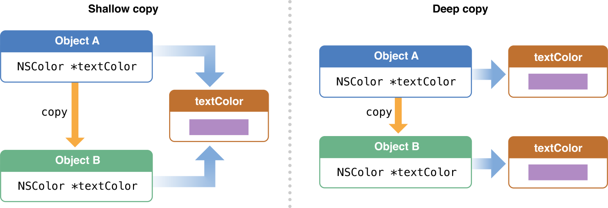
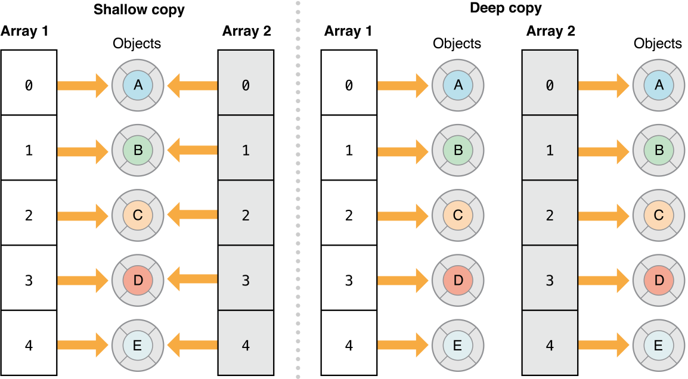
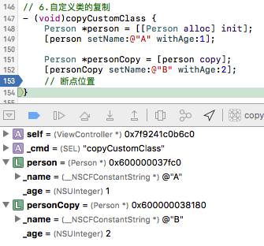
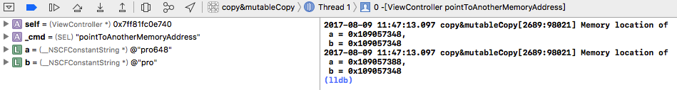

## 1. 属性中`copy`与`strong`特性的区别

在开始学习浅复制（Shallow Copy）、深复制（Deep Copy）之前，先了解下属性中`copy`与`strong`特性的区别。

`copy`特性如下：

- copy：创建一个对象的副本。在创建的那一刻新对象与原始对象内容相同。
- 新的对象引用计数为1，与原始对象引用计数无关，且原始对象引用计数不会改变。
- 使用copy创建的新对象也是强引用，使用完成后需要负责释放该对象。
- `copy`特性可以减少对象对上下文的依赖。新对象、原始对象中任一对象的值改变不会影响另一对象的值。
- 要想设置该对象的特性为`copy`，该对象必须遵守`NSCopying`协议，Foundation类默认实现了`NSCopying`协议，所以只需要为自定义的类实现该协议即可。

`strong`特性如下：

- 创建一个强引用的指针，引用对象引用计数加1。
- `strong`特性表示两个对象内存地址相同（建立一个指针，进行指针拷贝），内容会一直保持相同，直到更改一方内存地址，或将其设置为`nil`。
- 如果有多个对象同时引用一个属性，任一对象对该属性的修改都会影响其他对象获取的值。

> 如果想要对属性中特性进行更全面了解，可以查看 [iOS中定义属性时的atomic、nonatomic、copy、assign、strong、weak等几个特性的区别](https://github.com/pro648/tips/wiki/iOS%E4%B8%AD%E5%AE%9A%E4%B9%89%E5%B1%9E%E6%80%A7%E6%97%B6%E7%9A%84atomic%E3%80%81nonatomic%E3%80%81copy%E3%80%81assign%E3%80%81strong%E3%80%81weak%E7%AD%89%E5%87%A0%E4%B8%AA%E7%89%B9%E6%80%A7%E7%9A%84%E5%8C%BA%E5%88%AB) 这篇文章。

## 2. 浅复制与深复制

对象的拷贝有浅复制和深复制两种方式。浅复制只复制指向对象的指针，并不复制对象本身；深复制是直接复制整个对象到另一块内存中。即浅复制是复制指针，深复制是复制内容。

NSObject提供了`copy`和`mutableCopy` 方法，`copy`复制后对象是不可变对象（immutable），`mutableCopy`复制后的对象是可变对象（mutable），与原始对象是否可变无关。

下面针对非集合类、集合类对象的深复制、浅复制进行说明。

### 2.1 非集合类对象的`copy`与`mutableCopy`

非集合类对象指的是`NSString`、`NSNumber`之类的对象，深复制会复制引用对象的内容，而浅复制只复制引用这些对象的指针。因此，如果对象A被浅复制到对象B，对象B和对象A引用的是同一内存地址的实例变量或属性。



#### 2.1.1 不可变对象的`copy`与`mutableCopy`

创建一个*Single View Application*模板的demo，demo名称为*copy&mutableCopy*。进入`ViewController.m`，在实现部分添加以下方法。

```
// 非容器类 不可变对象
- (void)immutableObject {
    // 1.创建一个string字符串。
    NSString *string = @"github.com/pro648";
    NSString *stringB = string;
    NSString *stringCopy = [string copy];
    NSMutableString *stringMutableCopy = [string mutableCopy];
    
    // 2.输出指针指向的内存地址。
    NSLog(@"Memory location of string = %p",string);
    NSLog(@"Memory location of stringB = %p",stringB);
    NSLog(@"Memory location of stringCopy = %p",stringCopy);
    NSLog(@"Memory location of stringMutableCopy = %p",stringMutableCopy);
}
```

上述代码分步说明如下：

1. 创建一个`string`字符串，之后通过赋值，调用`copy`、`mutableCopy`方法进行复制操作。
2. 通过使用`%p`，输出指针所指向内容的内存地址。

然后在viewDidLoad中调用该方法：

```
- (void)viewDidLoad {
    [super viewDidLoad];
    
    // 1.非容器类 不可变对象
    [self immutableObject];
}
```

运行demo，可以看到控制台输出如下：

```
Memory location of string = 0x1060e6068
Memory location of stringB = 0x1060e6068
Memory location of stringCopy = 0x1060e6068
Memory location of stringMutableCopy = 0x600000072000
```

可以看到，`string`、`stringB`和`stringCopy`内存地址一致，即指向的是同一块内存区域，进行了浅复制操作。而`stringMutableCopy`与另外三个变量内存地址不同，系统为其分配了新内存，即进行了深复制操作。

#### 2.1.2 可变对象的`copy`与`mutableCopy`

继续在实现部分添加以下方法，并记得在`viewDidLoad`中调用。

```
// 2.非容器类 可变对象
- (void)mutableObject {
    // 1.创建一个可变字符串。
    NSMutableString *mString = [NSMutableString stringWithString:@"github.com/pro648"];
    NSString *mStringCopy = [mString copy];
    NSMutableString *mutablemString = [mString copy];
    NSMutableString *mStringMutableCopy = [mString mutableCopy];
    
    // 2.在可变字符串后添加字符串。
    [mString appendString:@"AA"];
    [mutablemString appendString:@"BB"];  // 运行时，这一行会报错。
    [mStringMutableCopy appendString:@"CC"];
    
    // 3.输出指针指向的内存地址。
    NSLog(@"Memory location of \n mString = %p,\n mstringCopy = %p,\n mutablemString = %p,\n mStringMutableCopy = %p",mString, mStringCopy, mutablemString, mStringMutableCopy);
}
```

在上面代码中，注释2部分为可变字符串拼接字符串，运行到为`mutablemString`拼接字符串这一行代码时，程序会崩溃，因为通过`copy`方法获得的字符串是不可变字符串。所以在运行前要注释掉这一行。

运行demo，可以看到控制台输出如下：

```
Memory location of 
 mString = 0x60000007bc00,
 mstringCopy = 0x600000051940,
 mutablemString = 0x6000000517c0,
 mStringMutableCopy = 0x60000007bec0
```

可以看到四个对象内存地址各不相同。所以，这里的`copy`和`mutableCopy`执行的均为深复制。

综合上面两个例子，我们可以得出这样结论：

- 对不可变对象执行`copy`操作，是指针复制，执行`mutableCopy`操作是内容复制。
- 对可变对象执行`copy`操作和`mutableCopy`操作都是内容复制。

用代码表示如下：

```
[immutableObject copy];                 // 浅复制
[immutableObject mutableCopy];          // 深复制
[mutableObject copy];                   // 深复制
[mutableObject mutableCopy];            // 深复制
```

### 2.2 容器类对象的深复制、浅复制

容器类对象指`NSArray`、`NSDictionary`等。容器类对象的深复制、浅复制如下图所示：



对于容器类，需要探讨的是复制后容器内元素的变化，而非容器本身内存地址是否发生了变化。

#### 2.2.1 容器类对象的浅复制

有许多方法可以对集合进行浅复制。当对集合进行浅复制时，将复制原始集合中元素指针到新的集合，即原始集合中元素引用计数加一。

<a id="YES">

在实现部分添加以下方法，并在`viewDidLoad`中调用该方法。

```
// 3.浅复制容器类对象。
- (void)shallowCopyCollections {
    // 1.创建一个不可变数组，数组内元素为可变字符串。
    NSMutableString *red = [NSMutableString stringWithString:@"Red"];
    NSMutableString *green = [NSMutableString stringWithString:@"Green"];
    NSMutableString *blue = [NSMutableString stringWithString:@"Blue"];
    NSArray *myArray1 = [NSArray arrayWithObjects:red, green, blue, nil];
    
    // 2.进行浅复制。
    NSArray *myArray2 = [myArray1 copy];
    NSMutableArray *myMutableArray3 = [myArray1 mutableCopy];
    NSArray *myArray4 = [[NSArray alloc] initWithArray:myArray1];
    
    // 3.修改myArray2的第一个元素。
    NSMutableString *tempString = myArray2.firstObject;
    [tempString appendString:@"Color"];
    
    // 4.输出四个数组内存地址及四个数组内容。
    NSLog(@"Memory location of \n myArray1 = %p, \n myArray2 %p, \n myMutableArray3 %p, \n myArray4 %p",myArray1, myArray2, myMutableArray3, myArray4);
    NSLog(@"Contents of \n myArray1 %@, \n myArray2 %@, \n myMutableArray3 %@, \n myArray4 %@",myArray1, myArray2, myMutableArray3, myArray4);
}
```

</a>

运行demo，可以看到控制台输出如下：

```
Memory location of 
 myArray1 = 0x60800004f240, 
 myArray2 0x60800004f240, 
 myMutableArray3 0x60800004ef40, 
 myArray4 0x60800004f090
Contents of 
 myArray1 (
    RedColor,
    Green,
    Blue
), 
 myArray2 (
    RedColor,
    Green,
    Blue
), 
 myMutableArray3 (
    RedColor,
    Green,
    Blue
), 
 myArray4 (
    RedColor,
    Green,
    Blue
)
```

可以看到`myArray1`和`myArray2`数组内存地址相同，`myMutableArray3`和`myArray4`与其它数组内存地址各不相同。这是因为`mutableCopy`的对象会被分配新的内存，`alloc`会为对象分配新的内存空间。

观察数组内元素，发现修改`myArray2`数组内第一个元素，四个数组第一个元素都发生了改变，所以这里只进行了浅复制。

#### 2.2.2 容器类对象的深复制

有两种方式对容器类对象进行深复制：

- 第一种方法是：使用`initWithArray: copyItems: `类型方法，其中，第二个参数为`YES`。
- 第二种方法是：使用归档、解档。

下面先看如何使用`initWithArray: copyItems: `类型方法。使用该方法进行深复制时，第二个参数为`YES`。如果使用该方法对集合进行深复制，那么集合内每个元素都会收到`copyWithZone: ` 消息，我们平常使用`copy`、`mutableCopy`方法时，系统会把`copy`和`mutableCopy`自动替换为`copyWithZone: `和`mutableCopyWithZone: `。即`copy`和`mutableCopy`只是简便方法。如果集合内元素遵守`NSCopying`协议，元素被复制到新的集合。如果集合内元素不遵守`NSCopying`协议，用这样的方式进行深复制，会在运行时产生错误。

`copyWithZone: ` 产生的是浅复制，所以，这种方法只能产生*一层深复制 one-level-deep copy*，如果集合内元素仍然是集合，则子集合内元素不会被深复制，只对子集合内元素指针进行复制。

> 如果集合内元素为不可变对象，发送`copyWithZone: `消息后进行指针复制，该对象仍然不可变，因此只进行指针复制即可满足需求。
>
> 如果集合内元素为可变对象，发送`copyWithZone: `消息后进行的是内容复制，复制后该元素不可变，此时，完成了一层深复制。

把[上面](#YES)代码注释2部分中，`initWithArray:`修改为`initWithArray:copyItems: `方法，`flag`参数传入`YES`，注释4中输出部分修改为输出数组第一个元素内存地址。更新后如下：

```
// 4.容器类一层深复制
- (void)oneLevelDeepCopy {
    // 1.创建一个不可变数组，数组内元素为可变字符串。
    NSMutableString *red = [NSMutableString stringWithString:@"Red"];
    NSMutableString *green = [NSMutableString stringWithString:@"Green"];
    NSMutableString *blue = [NSMutableString stringWithString:@"Blue"];
    NSArray *myArray1 = [NSArray arrayWithObjects:red, green, blue, nil];
    
    // 2.进行浅复制。
    NSArray *myArray2 = [myArray1 copy];
    NSMutableArray *myMutableArray3 = [myArray1 mutableCopy];
    NSArray *myArray4 = [[NSArray alloc] initWithArray:myArray1 copyItems:YES];
    
    // 3.修改myArray2的第一个元素。
    NSMutableString *tempString = myArray2.firstObject;
    [tempString appendString:@"Color"];
    
    // 4.输出数组内第一个元素内存地址，输出四个数组。
    NSLog(@"Memory location of \n myArray1.firstObject = %p, \n myArray2.firstObject %p, \n myMutableArray3.firstObject %p, \n myArray4.firstObject %p",myArray1.firstObject, myArray2.firstObject, myMutableArray3.firstObject, myArray4.firstObject);
    NSLog(@"Contents of \n myArray1 %@, \n myArray2 %@, \n myMutableArray3 %@, \n myArray4 %@",myArray1, myArray2, myMutableArray3, myArray4);
}
```

运行demo，可以看到控制台输出如下：

```
Memory location of 
 myArray1.firstObject = 0x600000079980, 
 myArray2.firstObject 0x600000079980, 
 myMutableArray3.firstObject 0x600000079980, 
 myArray4.firstObject 0xa000000006465523
Contents of 
 myArray1 (
    RedColor,
    Green,
    Blue
), 
 myArray2 (
    RedColor,
    Green,
    Blue
), 
 myMutableArray3 (
    RedColor,
    Green,
    Blue
), 
 myArray4 (
    Red,
    Green,
    Blue
)
```

可以看到`myArray4`数组内第一个元素与其它数组第一个元素内存地址不同，即进行了一层深复制。

> 这种对集合进行深复制的方法，对其它类型集合也有效。如词典中`initWithDictionary: withItems: `方法。

如果你的数组内元素是另一个数组，想要进行完全深复制，可以使用归档、解归档方法。使用该方法时，归档对象要遵守`NSCoding`协议。如果你对归档不熟悉，可以查看我的另一篇文章：[数据存储之归档解档 NSKeyedArchiver NSKeyedUnarchiver](https://github.com/pro648/tips/wiki/%E6%95%B0%E6%8D%AE%E5%AD%98%E5%82%A8%E4%B9%8B%E5%BD%92%E6%A1%A3%E8%A7%A3%E6%A1%A3-NSKeyedArchiver-NSKeyedUnarchiver)。

下面使用归档、解档的方法进行完全深复制。

```
// 5.使用归档进行完全深复制。
- (void)trueDeepCopy {
    // 1.创建一个可变数组，数组第一个元素是另一个可变数组，第二个元素是另一个不可变数组。
    NSMutableString *hue = [NSMutableString stringWithString:@"hue"];
    NSMutableString *saturation = [NSMutableString stringWithString:@"saturation"];
    NSMutableString *brightness = [NSMutableString stringWithString:@"brightness"];
    NSMutableArray *hsbArray1 = [NSMutableArray arrayWithObjects:hue, saturation, brightness, nil];
    NSArray *hsbArray2 = [NSArray arrayWithObjects:hue, saturation, brightness, nil];
    NSMutableArray *hsbArray3 = [NSMutableArray arrayWithObjects:hsbArray1, hsbArray2, nil];
    
    // 2.通过归档、解档进行完全深复制。
    NSData *dataArea = [NSKeyedArchiver archivedDataWithRootObject:hsbArray3];
    NSMutableArray *hsbArray4 = [NSKeyedUnarchiver unarchiveObjectWithData:dataArea];
    
    // 3.输出hsbArray3和hsbArray4数组第一个元素内存地址。
    NSLog(@"Memory location of \n hsbArray3.firstObject = %p, \n hsbArray4.firstObject = %p",hsbArray3.firstObject, hsbArray4.firstObject);
}
```

上面代码中，可变数组`hsbArray3`第一个元素是可变数组`hsbArray1`，第二个元素是不可变数组`hsbArray2`。

使用归档、读取归档方法深复制后，在控制台输出`hsbArray3`和`hsbArray4`第一个元素内存地址。输出如下：

```
Memory location of 
 hsbArray3.firstObject = 0x60000004b100, 
 hsbArray4.firstObject = 0x60000004b1f0
```

可以看到`hsbArray3`和`hsbArray4`数组内元素内存地址不同，即进行了一层深复制。

在`trueDeepCopy`方法内，继续为`hsbArray4`数组内第一个元素`tempArray1`可变数组添加字符串对象。为`hsbArray4`第二个元素`hsbArray2`数组添加字符串对象。最后输出`hsbArray3`和`hsbArray4`数组内容。

```
// 5.使用归档进行完全深复制。
- (void)trueDeepCopy {
    ...
    // 4.为hsbArray4第一个元素添加字符串。
    NSMutableArray *tempArray1 = hsbArray4.firstObject;
    [tempArray1 addObject:@"hsb"];
    
    // 5.hsbArray4第二个元素是hsbArray2，而hsbArray2是不可变数组，这一步将产生错误。
//    NSMutableArray *tempArray2 = hsbArray4[1];
//    [tempArray2 addObject:@"Color"];
    
    // 6.输出数组内容。
    NSLog(@"Contents of \n hsbArray3 %@, \n hsbArray4 %@",hsbArray3, hsbArray4);
}
```

因为`hsbArray4`第二个元素是`hsbArray2`副本，而`hsbArray2`是不可变数组，这一步将产生错误。注释掉5部分代码后，控制台输出如下：

```
Contents of 
 hsbArray3 (
        (
        hue,
        saturation,
        brightness
    ),
        (
        hue,
        saturation,
        brightness
    )
), 
 hsbArray4 (
        (
        hue,
        saturation,
        brightness,
        hsb
    ),
        (
        hue,
        saturation,
        brightness
    )
)
```

可以看到只有`hsbArray4`数组第一个元素内对象发生了改变，所以，使用归档、读取归档进行的是完全深复制。

复制集合时，该集合、集合内元素的可变性可能会受到影响。每种方法对任意深度集合中对象的可变性有稍微不同的影响。

1. `copyWithZone: `创建对象的*最外层 surface level*不可变，所有更深层次对象的可变性不变。
2. `mutableCopyWithZone: `创建对象的*最外层 surface level*可变，所有更深层次对象的可变性不变。
3. `initWithArray: copyItems: `第二个参数为`NO`，此时，所创建数组最外层可变性与初始化的可变性相同，所有更深层级对象可变性不变。
4. `initWithArray: copyItems: `第二个参数为`YES`，此时，所创建数组最外层可变性与初始化的可变性相同，下一层级是不可变的，所有更深层级对象可变性不变。
5. 归档、解档复制的集合，所有层级的可变性与原始对象相同。

### 2.3 自定义对象的深复制、浅复制

自定义的类需要我们自己实现`NSCopying`、`NSMutableCopying`协议，这样才可以调用`copy`和`mutableCopy`方法。

添加父类为`NSObject`，名称为`Person`的类。进入`Person.h`，添加以下属性和方法，同时让该类遵守`NSCopying`协议。

```
@interface Person : NSObject <NSCopying>

@property (strong, nonatomic) NSString *name;
@property (assign, nonatomic) NSUInteger age;

- (void)setName:(NSString *)name withAge:(NSUInteger)age;

@end
```

`NSCopying`协议只有一个必须实现的`copyWithZone: `方法。进入`Person.m`，实现属性中`setName: withAge: `方法和`copyWithZone: `方法。

```
- (void)setName:(NSString *)name withAge:(NSUInteger)age {
    _name = name;
    _age = age;
}

- (id)copyWithZone:(NSZone *)zone {
    Person *person = [[Person allocWithZone:zone] init];
    [person setName:self.name withAge:self.age];
    return person;
}
```

如果`Person`类会被继承，那么`copyWithZone: `方法将被继承，这时应将上面的

```
Person *person = [[Person allocWithZone:zone] init];
```

替换为

```
id person = [[[self class] allocWithZone: zone] init];
```

这样，可以从该类分配一个新对象，而这个类是`copy`的接收者。例如：如果`Person`类有一个名为`NewPerson`的子类，那么应该在继承的方法中分配了新的`NewPerson`对象，而不是`Person`对象。

如果`Person`类的父类也实现了`NSCopying`协议，那么应该先调用父类的`copy`方法，以复制继承来的实例变量。如果需要实现可变复制，还需要遵守`NSMutableCopying`协议。

进入`ViewController.m`，导入`Person.h`，在实现部分添加以下方法，并在`viewDidLoad`中调用。

```
// 6.自定义类的复制
- (void)copyCustomClass {
    Person *person = [[Person alloc] init];
    [person setName:@"A" withAge:1];
    
    Person *personCopy = [person copy];
    [personCopy setName:@"B" withAge:2];
    // 断点位置
}
```

在`copyCustomClass`方法最后一行设置断点，运行demo，可以看到控制台输出如下图：



通过上图可以看到，`person`和`personCopy`内存地址不同，且`person`和`personCopy`中的`name`和`age`属性的值各不相同。

## 3. 修改指针指向

现在看最后一个示例，在`ViewController.m`的实现部分添加以下方法，并在`viewDidLoad`中调用该方法。

```
// 7.更改指针指向地址
- (void)pointToAnotherMemoryAddress {
    // 1.指针a、b同时指向字符串pro
    NSString *a = @"pro";
    NSString *b = a;
    NSLog(@"Memory location of \n a = %p, \n b = %p", a, b);
    // 断点1位置
    
    // 2.指针a指向字符串pro648
    a = @"pro648";
    NSLog(@"Memory location of \n a = %p, \n b = %p", a, b);
    // 断点2位置
}
```

上述代码分步说明如下：

1. 指针`a`指向字符串`pro`内存地址，`b = a`表示`b`是`a`的浅复制，指针`b	`也指向字符串`pro`内存地址。`NSLog`语句可以说明这一问题。也可以在注释*断点1位置*所在行设置断点，查看指针指向的内容。
2. 修改指针`a`指向字符串`pro648`，此时输出`a`、`b`指针所指的向内存地址。并在*断点2位置*所在行设置断点。运行后可以看到控制台输出如下：



可以看到，`a`、`b`指针指向不同内存地址，`a`指向字符串`pro648`，`b`指向字符串`pro`。

这是因为

```
a = @"pro648";
```

等同于

```
a = [[NSString alloc] initWithString:@"pro648"];
```

`a = @"pro648"`修改了`a`指针指向的内存地址，而`b`指针依然指向之前的内存地址。

> `NSString`与`NSMutableString`的区别主要是：`NSMutableString`对象所指向内存地址中的内容可以被修改，而`NSString`对象所指向内存地址中内容不能被修改，但`NSString`对象不是常量，可以通过为`NSString`对象重新分配一块内存来改变其指向的内容。

## 总结

浅拷贝尽可能少的复制对象，集合的浅拷贝副本只是集合结构的副本，而不是集合内元素的副本。浅拷贝获得的副本与原始集合共享各个元素。

深拷贝复制一切内容。集合的深拷贝会复制集合的结构和元素，但如果集合内元素也是集合，则涉及到一层深拷贝、完全深拷贝。

Demo名称：copy&mutableCopy     
源码地址：<https://github.com/pro648/BasicDemos-iOS>

参考资料：

1. [Copying Collections](https://developer.apple.com/library/content/documentation/Cocoa/Conceptual/Collections/Articles/Copying.html#//apple_ref/doc/uid/TP40010162-SW1)
2. [Object copying](https://developer.apple.com/library/content/documentation/General/Conceptual/DevPedia-CocoaCore/ObjectCopying.html)
3. [Deep Copy and Shallow Copy in Objective C](https://congsun.wordpress.com/2015/06/04/deep-copy-and-shallow-copy/)
4. [What is the difference between a deep copy and a shallow copy?](https://stackoverflow.com/questions/184710/what-is-the-difference-between-a-deep-copy-and-a-shallow-copy)


