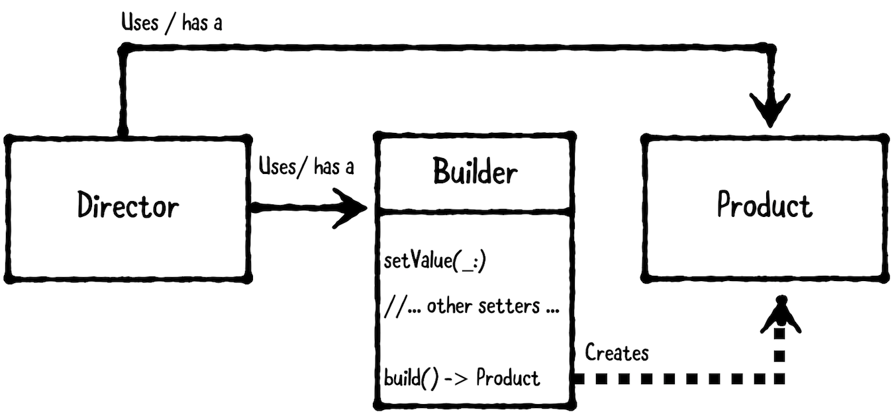

生成器模式（Builder Pattern）又称为建造模式，是 Gang of Four design patterns 中二十三种设计模式之一，属于 creational patterns。

Builder pattern 通过逐步提供输入来创建复杂对象，而不是通过初始化程序预先要求所有输入。生成器模式包含以下三部分：



1. Director：接受输入并与 builder 协调。通常为视图控制器，或视图控制器所使用的帮助程序。
2. Product：要创造的复杂对象。其可以是 struct 或 class，具体取决于所需引用类型。一般为 model，但也可以根据需要改变。
3. Builder：接受输入并负责创建 product。为了方便引用，一般为 class 类型。

## 1. 何时使用 builder pattern

当需要使用一系列操作创建复杂对象时，使用 builder pattern。

当 product 需要多个输入时，生成器模式特别有效。Builder 按照 director 指令顺序，将输入进行抽象创建产品。

例如，我们有一个 Car 类。Car 有很多选项（如，座位数、颜色、GPS等），选项的组合将会产生大量构造函数。因此，我们将创建 builder 类`CarBuilder`，通过向`CarBuilder`一步一步发送选项来构建 Car。下面使用伪代码（pseudocode）实现上述功能：

```
// Product
class Car is
  Can have GPS, trip computer and various numbers of seats.
  Can be a city car, a sports car, or a cabriolet.

// Builder
class CarBuilder is
  method getResult() is
      output:  a Car with the right options
    Construct and return the car.

  method setSeats(number) is
      input:  the number of seats the car may have.
    Tell the builder the number of seats.

  method setCityCar() is
    Make the builder remember that the car is a city car.

  method setCabriolet() is
    Make the builder remember that the car is a cabriolet.

  method setSportsCar() is
    Make the builder remember that the car is a sports car.

  method setTripComputer() is
    Make the builder remember that the car has a trip computer.

  method unsetTripComputer() is
    Make the builder remember that the car does not have a trip computer.

  method setGPS() is
    Make the builder remember that the car has a global positioning system.

  method unsetGPS() is
    Make the builder remember that the car does not have a global positioning system.

// Director
Construct a CarBuilder called carBuilder
carBuilder.setSeats(2)
carBuilder.setSportsCar()
carBuilder.setTripComputer()
carBuilder.unsetGPS()
car := carBuilder.getResult()
```

在上述代码中，Builder 是 CarBuilder，Product 是 Car Model，Director 根据输入协调 builder 制造 car。

### 2. Demo

使用 builder design pattern 实现一个 hamburger builder。Product 是 hamburger 模型，其中包含肉类选择、浇头、调味汁等输入；Director 是掌握制作汉堡技能的员工，或接受用户输入的试图控制器；Builder 接受输入制作 hamburger。

#### 2.1 Product

首先，定义 product，代码如下：

```
// MARK: - Product

// Hamburger 有 Meat、Sauces、Toppings三个属性。制作完成后不可修改成份。
public struct Hamburger {
    public let meat: Meat
    public let sauce: Sauces
    public let toppings: Toppings
}

extension Hamburger: CustomStringConvertible {
    public var description: String {
        return meat.rawValue + " github.com/pro648"
    }
}

// 每个汉堡有且只有一种肉
public enum Meat: String {
    case beef
    case chicken
    case kitten
    case tofu
}

// OptionSet 允许添加多种Sauces
public struct Sauces: OptionSet {
    public static let mayonnaise = Sauces(rawValue: 1 << 0)
    public static let mustard = Sauces(rawValue: 1 << 1)
    public static let ketchup = Sauces(rawValue: 1 << 2)
    public static let secret = Sauces(rawValue: 1 << 3)
    
    public let rawValue: Int
    public init(rawValue: Int) {
        self.rawValue = rawValue
    }
}

public struct Toppings: OptionSet {
    public static let cheese = Toppings(rawValue: 1 << 0)
    public static let lettuce = Toppings(rawValue: 1 << 1)
    public static let pickles = Toppings(rawValue: 1 << 2)
    public static let tomatoes = Toppings(rawValue: 1 << 3)
    
    public let rawValue: Int
    public init(rawValue: Int) {
        self.rawValue = rawValue
    }
}
```

#### 2.2 Builder

```
// MARK: - Builder

public class HamburgerBuilder {
    
    // meat、sauces、toppings 为变量，使用 private(set) 限制为只有 HamburgerBuilder 可以修改。
    public private(set) var meat: Meat = .beef
    public private(set) var sauces: Sauces = []
    public private(set) var toppings: Toppings = []
    private var soldOutMeats: [Meat] = [.kitten]
    
    // 因为 property 使用了 private(set)，必须提供 public 方法修改属性。
    public func addSauces(_ sauce: Sauces) {
        sauces.insert(sauce)
    }
    
    public func removeSauces(_ sauce: Sauces) {
        sauces.remove(sauce)
    }
    
    public func addToppings(_ topping: Toppings) {
        toppings.insert(topping)
    }
    
    public func removeToppings(_ topping: Toppings) {
        toppings.remove(topping)
    }
    
    public func setMeat(_ meat: Meat) throws {
        self.meat = meat
    }
    
    public func build() -> Hamburger {
        return Hamburger(meat: meat, sauce: sauces, toppings: toppings)
    }
}
```

`private(set)`限制必须使用`public`设值方法，这样可以在设值时进行验证，避免设置为不符合规范的值。

例如，在设置`meat`前需要确保该`meat`有货。在原来的属性下添加以下属性：

```
    private var soldOutMeats: [Meat] = [.kitten]
```

当添加已经销售完毕的`meat`时，将会抛出异常，更新后如下：

```
    public func setMeat(_ meat: Meat) throws {
        guard isAvailable(meat) else { throw Error.soldOut }
        self.meat = meat
    }
    
    public func isAvailable(_ meat: Meat) -> Bool {
        return !soldOutMeats.contains(meat)
    }
    
    public enum Error: Swift.Error {
        case soldOut
    }
```

#### 2.3 Director

最后，声明 director。

```
// Director

public class Employee {
    public func createCombol() throws -> Hamburger {
        let builder = HamburgerBuilder()
        try builder.setMeat(.beef)
        builder.addSauces(.secret)
        builder.addToppings([.lettuce, .tomatoes, .pickles])
        return builder.build()
    }
    
    public func createKittenSpecial() throws -> Hamburger {
        let builder = HamburgerBuilder()
        try builder.setMeat(.kitten)
        builder.addSauces(.mustard)
        builder.addToppings([.lettuce, .tomatoes])
        return builder.build()
    }
}
```

现在，Employee 掌握了制作两种 hamburger 方法。

使用下面代码创建 hamburger :

```
        let burgerFlipper = Employee()
        
        guard let combol = try? burgerFlipper.createCombol() else {
            print("Sorry, no beef burgers here...")
            return
        }
        print("Beef burgers " + combol.description)
```

这里创建了`Employee`对象的实例`burgerFlipper`，并创建combol，控制台输出如下：

```
Beef burgersbeef github.com/pro648
```

继续添加以下代码：

```
        guard let kittenBurger = try? burgerFlipper.createKittenSpecial() else {
            print("Sorry, no kitten burgers here...")
            return
        }
        print("Nom nom nom " + kittenBurger.description)
```

这里创建kittenBurger，但由于`kitten`已经售罄，控制台会输出以下信息：

```
Sorry, no kitten burgers here...
```

## 总结

以下是 builder pattern 的关键点：

- Builder pattern 非常适合逐步创建复杂对象，它涉及三个对象：director、product、builder。
- Director 接受输入并与 builder 协调，product 是创建的复杂对象。builder 根据输入步骤创建对象。

如果 product 没有多个输入，或无法一步一步创建，那么生成器模式就不适合使用。相反，考虑提供 convenience initializer 来创建对象。

Demo名称：BuilderPattern  
源码地址：<https://github.com/pro648/BasicDemos-iOS/tree/master/BuilderPattern>

参考资料：

1. [Builder pattern](https://en.wikipedia.org/wiki/Builder_pattern)

2. [Using the builder pattern in Swift](https://www.swiftbysundell.com/posts/using-the-builder-pattern-in-swift)

3. [Swift builder design pattern](https://theswiftdev.com/2018/05/24/swift-builder-design-pattern/)

   