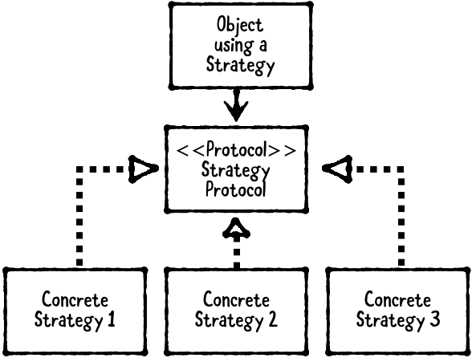
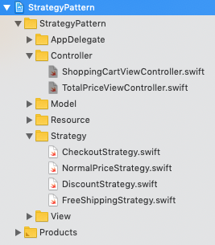
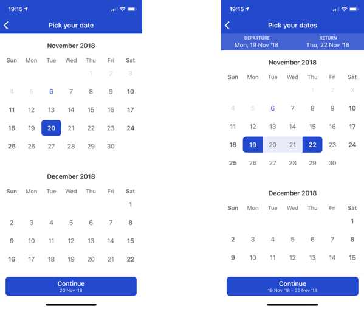

设计模式（design pattern）主要分为以下三种类型：

1. 结构型模式（structural design pattern）：描述对象的构成，以及如何组合对象以形成更大的结构，也就是了解元件间关系，以简化设计。Structural design patter 包含 Model-View-Controller (MVC)、Model-View-ViewModel (MVVM) 和外观模式 (Facade)。
2. 行为型模式（behavioral design pattern）：描述对象间如何通信，以便在进行这些交流活动时增强弹性。Behavioral design pattern 包含 Delegation、Strategy、Observer。
3. 创建型模式（creational design pattern）：处理对象如何创建，根据实际情况使用合适的方式创建对象。基本的对象创建方式可能会导致设计上的问题，或增加设计的复杂度，creational design pattern 通过以某种方式控制对象的创建来解决问题。Creational design pattern 包含 Builder、Singleton 和 Prototype。

## 1. 什么是策略模式

策略模式 strategy pattern 属于 behavioral pattern。Strategy pattern 定义了一系列可互换替代的对象，可以在 runtime 时设置或切换。策略模式包含以下三部分：



- 使用策略模式的对象：通常为视图控制器，也可以是任何有互换替代 (interchangeable) 需求的对象。
- Strategy protocol：每种策略都必须遵守的协议。
- Strategies：遵守 strategy protocol 协议的对象，相互间可互换代替。

## 2. 何时使用策略模式

当有两种或更多可相互代替的行为时，使用策略模式。

Strategy pattern 和 [Delegation pattern](https://github.com/pro648/tips/wiki/委托、通知传值的用法与区别) 很像。均依赖 protocol 而非具体对象以增加灵活性。因此，任何实现了 strategy protocol 的对象在运行时均可作为一种策略。与委托不同的是，strategy pattern 使用一族对象。

Delegate 在运行时固定不变。例如，`UITableView`的`dataSource`和`delegate`设置后不需要改变。Strategy 在运行时可以相互切换。

## 3. Demo

Demo 是购物车结算模块。结算方式有正常价格、九折和免运费三种。


#### 3.1 不使用 strategy pattern

更新`ShoppingCartViewController.swift`文件中`prepare(for:sender:)`方法：

```
    override func prepare(for segue: UIStoryboardSegue, sender: Any?) {
        view.endEditing(false)
        
        if let destinationViewController: DetailViewController = segue.destination as? DetailViewController {
            destinationViewController.bindProperties(itemPrices: itemPrices, checkoutType: .normal)
        }
    }
```

在`TotalPriceViewController.swift`文件添加以下方法：

```
    public func bindProperties(itemPrices: [Int], checkoutType: CheckoutType) {
        switch checkoutType {
        case .normal:
            finalPrice = getFinalPriceWithNormal(itemPrices: itemPrices)
            
        case .discount:
            finalPrice = getFinalPriceWithDiscount(itemPrices: itemPrices)
            
        case .freeShipping:
            finalPrice = getFinalPriceWithFreeShipping(itemPrices: itemPrices)
        }
    }
    
    private func getFinalPriceWithNormal(itemPrices: [Int]) -> Int {
        // do calculation
        
        return 90 + 75 + 20
    }
    
    private func getFinalPriceWithDiscount(itemPrices: [Int]) -> Int {
        // do calculation
        
        return Int((90 + 75) * 0.9) + 20
    }
    
    private func getFinalPriceWithFreeShipping(itemPrices: [Int]) -> Int {
        // do calculation
        
        return 90 + 75
    }
```

上述代码可以根据不同枚举类型计算总价，那为什么要用 strategy pattern ？

Strategy pattern 可以让代码遵守开闭原则 （Open/Closed principle）。在面向对象编程领域中，开闭原则规定「软件中的对象、类、模块和函数等，对于扩展应该是开放的，但对于修改是封闭的」。这意味着，一个对象允许在不改变其源代码的前提下变更它的行为。该特性在产品化的环境中是特别有价值的。在这种环境中，改变源代码需要代码审查、单元测试等以确保产品质量。遵循这种原则的代码在扩展时并不发生变化，因此，无需上述过程。

目前，在`TotalPriceViewController.swift`文件添加了`enum`和所需方法，如果增加了结算方式，就需要更改`TotalPriceViewController.swift`文件中代码。但在`TotalPriceViewController.swift`文件中增加`enum`类型和`switch`，就违背了 Open/Closed principle （open for extension and close for modification) 。同时`TotalPriceViewController`掌握了太多其不必知道的内容，会使代码高度耦合、难以测试。

#### 3.2 使用 strategy pattern

###### 3.2.1 创建 protocol

添加`CheckoutStrategy.swift`文件，定义一项协议。在我们的示例中，该协议只有一个方法。

```
protocol CheckoutStrategy: class {
    func getFinalPrice(with itemPrices:[Int]) -> Int
}
```

###### 3.2.2 创建 strategies

创建三种策略，分别执行正常价格、九折和免运费结算模式：

```
class NormalPriceStrategy: CheckoutStrategy {
    func getFinalPrice(with itemPrices: [Int]) -> Int {
        // do calculation
        
        return 90 + 75 + 20
    }
}

class DiscountStrategy: CheckoutStrategy {
    func getFinalPrice(with itemPrices: [Int]) -> Int {
        // do calculation
        
        return Int((90 + 75) * 0.9) + 20
    }
}

class FreeShippingStrategy: CheckoutStrategy {
    func getFinalPrice(with itemPrices: [Int]) -> Int {
        // do calculation
        
        return 90 + 75
    }
}
```

可以看到，每个类均遵守`CheckoutStrategy`协议，但协议中方法实现方式有所不同，每个类代表一种策略。

###### 3.2.3 使用策略模式的对象

更新`ShoppingCartViewController.swift`文件中`prepare(for:sender:)`方法，使用 strategy pattern 结算：

```
    override func prepare(for segue: UIStoryboardSegue, sender: Any?) {
        view.endEditing(false)
        
        if let destinationViewController: TotalPriceViewController = segue.destination as? TotalPriceViewController {
            destinationViewController.bindProperties(itemPrices: itemPrices, checkoutStrategy: NormalPriceStrategy())
//            destinationViewController.bindProperties(itemPrices: itemPrices, checkoutStrategy: DiscountStrategy())
//            destinationViewController.bindProperties(itemPrices: itemPrices, checkoutStrategy: FreeShippingStrategy())
        }
    }
```

同时在`TotalPriceViewController.swift`文件添加以下方法：

```
    public func bindProperties(itemPrices:[Int], checkoutStrategy: CheckoutStrategy) {
        finalPrice = checkoutStrategy.getFinalPrice(with: itemPrices)
    }
```

最后，project navigator 目录如下：



现在，添加、修改结算模式时，只需要增加遵守`CheckoutStrategy`协议的策略，修改结算策略即可。

## 4. 更多示例

下面示例也适合使用 strategy pattern 。

#### 4.1 选择行程

旅行 app 提供单程、往返两种购票模式。当进入日历时，根据单程、往返来决定采取哪种选择日期策略。例如，如果是往返，则返回日期必须晚于出发日期。



因此，我们有两种选择策略，当打开日历时指定所采用的策略：

```
protocol CalendarSelectionStrategy {
    func calendar(_ calendar: CalendarView, didSelect date: Date)
}

class OneWaySelectionStrategy: CalendarSelectionStrategy {
    func calendar(_ calendar: CalendarView, didSelect date: Date) {
        // One way selection logic
    }
}

class ReturnWaySelectionStrategy: CalendarSelectionStrategy {
    func calendar(_ calendar: CalendarView, didSelect date: Date) {
        // Return selection logic
    }
}

// Use
showCalendar(usingSelectionStrategy: OneWaySelectionStrategy())
```

#### 4.2 表格验证

App 内表格内容有多种文本类型，如文字、数字、密码、手机号码等，每种类型有不同验证方式。我们可以为每种类型定义一种验证策略，这样每个文本框就能知道如何验证其内容是否符合要求。

```
protocol ValidateStrategy {
    func validate() -> Bool
}
```

#### 4.3 更换武器

在游戏中，用户会经常更换武器。武器的触发操作方式是一样的，但每种武器都有自己的射击方式。用户无需用知道具体射击细节，武器本身知道即可。

## 总结

你已经学过了 strategy pattern ，以下是其关键点：

- Strategy pattern 定义了一族可在运行时互换替代的对象。
- Strategy pattern 包含三部分，使用 strategy 的对象，strategy protocol，一族策略。
- Strategy pattern 和 delegation pattern 都使用 protocol，但 strategy pattern 意味着在运行时切换，delegate 通常是固定的。

当用不同的策略做不同的事情时，原来类将变得更简洁。当用 strategy 扩展类时，无需更新采用 strategy 的类，遵守了 Open/Close principle 。

Demo名称：StrategyPattern   
源码地址：<https://github.com/pro648/BasicDemos-iOS/tree/master/StrategyPattern>

参考资料：

1. [Strategy Pattern — Design Pattern in Swift](https://medium.com/@kuanhuachen/strategy-pattern-design-pattern-in-swift-77968e2745e6)
2. [Strategy pattern in Swift](https://medium.com/flawless-app-stories/strategy-pattern-in-swift-1462dbddd9fe)
3. [Design Patterns with Swift: Quick look at a Strategy Pattern](https://brightinventions.pl/blog/quick-look-on-a-strategy-pattern-using-swift/)
4. [Open–closed principle](https://en.wikipedia.org/wiki/Open–closed_principle)