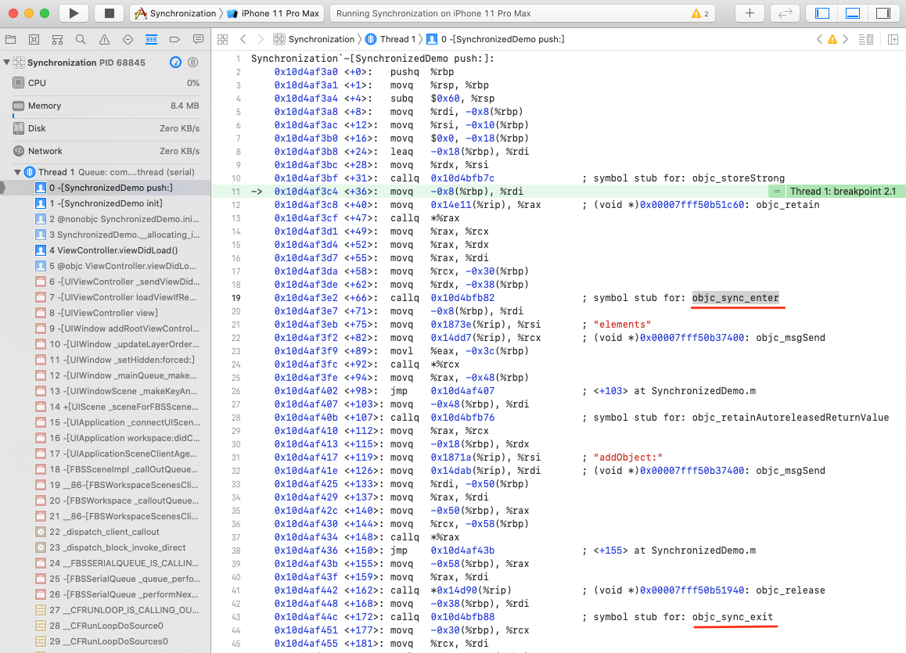

> 这是并发控制方案的系列文章，介绍了各种锁的使用及优缺点。
>
> 1. [自旋锁](https://github.com/pro648/tips/blob/master/sources/%E7%BA%BF%E7%A8%8B%E5%90%8C%E6%AD%A5%E4%B9%8B%E8%87%AA%E6%97%8B%E9%94%81.md)
> 2. [os_unfair_lock](https://github.com/pro648/tips/blob/master/sources/%E7%BA%BF%E7%A8%8B%E5%90%8C%E6%AD%A5%E4%B9%8Bos_unfair_lock.md)
> 3. [互斥锁](https://github.com/pro648/tips/blob/master/sources/%E7%BA%BF%E7%A8%8B%E5%90%8C%E6%AD%A5%E4%B9%8B%E4%BA%92%E6%96%A5%E9%94%81.md)
> 4. [递归锁](https://github.com/pro648/tips/blob/master/sources/%E7%BA%BF%E7%A8%8B%E5%90%8C%E6%AD%A5%E4%B9%8B%E9%80%92%E5%BD%92%E9%94%81.md)
> 5. [条件锁](https://github.com/pro648/tips/blob/master/sources/%E7%BA%BF%E7%A8%8B%E5%90%8C%E6%AD%A5%E4%B9%8B%E6%9D%A1%E4%BB%B6%E9%94%81.md)
> 6. [读写锁](https://github.com/pro648/tips/blob/master/sources/%E7%BA%BF%E7%A8%8B%E5%90%8C%E6%AD%A5%E4%B9%8B%E8%AF%BB%E5%86%99%E9%94%81.md)
> 7. [@synchronized](https://github.com/pro648/tips/blob/master/sources/%E7%BA%BF%E7%A8%8B%E5%90%8C%E6%AD%A5%E4%B9%8B@synchronized.md)
>
> OSSpinLock、os_unfair_lock、pthread_mutex_t、pthread_cond_t、pthread_rwlock_t 是值类型，不是引用类型。这意味着使用 = 会进行复制，使用复制的可能导致闪退。pthread 函数认为其一直处于初始化的内存地址，将其移动到其他内存地址会产生问题。使用copy的OSSpinLock不会崩溃，但会得到一个全新的锁。

> 如果你对线程、进程、串行、并发、并行、锁等概念还不了解，建议先查看以下文章：
>
> - [Grand Central Dispatch的使用](https://github.com/pro648/tips/blob/master/sources/Grand%20Central%20Dispatch%E7%9A%84%E4%BD%BF%E7%94%A8.md)
> - [Operation、OperationQueue的使用](https://github.com/pro648/tips/blob/master/sources/Operation%E3%80%81OperationQueue%E7%9A%84%E4%BD%BF%E7%94%A8.md)
> - [多线程简述](https://github.com/pro648/tips/blob/master/sources/%E5%A4%9A%E7%BA%BF%E7%A8%8B%E7%AE%80%E8%BF%B0.md)
> - [并发控制之线程同步](https://github.com/pro648/tips/blob/master/sources/%E5%B9%B6%E5%8F%91%E6%8E%A7%E5%88%B6%E4%B9%8B%E7%BA%BF%E7%A8%8B%E5%90%8C%E6%AD%A5.md)
> - [并发控制之无锁编程](https://github.com/pro648/tips/blob/master/sources/%E5%B9%B6%E5%8F%91%E6%8E%A7%E5%88%B6%E4%B9%8B%E6%97%A0%E9%94%81%E7%BC%96%E7%A8%8B.md)

Objective-C 语言提供了创建递归锁的简便方式，即`@synchronized`指令。`@synchronized`提供了 recursive lock 提供的功能。例如，阻塞多线程同时访问临界区域，允许同一线程多次加锁访问临界区域。使用`@synchronized`时，无需创建锁、加锁、解锁，只需为`@synchronized`传入非空对象，Objective-C 会将其作为锁令牌使用。

## 1. 如何使用@synchronized

`@synchronized`使用方法如下：

```
- (void)myMethod:(id)anObj {
    @synchronized(anObj) {
        // Everything between the braces is protected by the @synchronized directive.
    }
}
```

传入`@synchronized`的`anObj`作为唯一标记符区分临界区域。如果在两个线程同时执行上述方法，传入不同对象，每个线程都会获取锁并执行；如果在两个线程同时执行上述方法，传入同一对象，则一个线程会获取锁，另一个线程被堵塞，直到第一个线程执行完毕。

> 作为预防措施，`@synchronized`隐式添加了 exception handler。即使抛出异常，handler 也会释放锁。也就是想要使用`@synchronized`，必须启用 Objective-C 的 exception。如果不想承受 exception 的开销，可以使用显式锁。

假设添加元素到数组需要实现线程安全：

```
@interface SynchronizedDemo ()

@property (nonatomic, strong) NSMutableArray *elements;
@property (nonatomic, strong) NSLock *lock;

@end

@implementation SynchronizedDemo

- (instancetype)init
{
    self = [super init];
    if (self) {
        self.elements = [NSMutableArray array];
        self.lock = [[NSLock alloc] init];
    }
    return self;
}

- (void)push:(NSString *)element {
    [self.lock lock];
    
    [self.elements addObject:element];
    
    [self.lock unlock];
}
```

上述`push:`方法先加锁、后添加元素，最后解锁。即使多线程同时调用`push:`方法，数组添加元素的方法同一时间也只会在一个线程执行。

使用`@synchronized`保护临界区域方法如下：

```
- (void)push:(NSString *)element {
    @synchronized (self) {
        [self.elements addObject:element];
    }
}
```

`@synchronized`block效果与`[self.lock lock]`、`[self.lock unlock]`一致。可以把`self`当作`NSLock`，左大括号标记加锁位置，右大括号标记解锁位置。`@synchronized`不用担心忘记 unlock。

可以为`@synchronized`传入任何 Objective-C 对象。因此，在上述示例中可以使用`@synchronized(element)`代替`@synchronized(self)`，效果一致。

> 你可以将前面文章的锁更换为`@synchronized`，如果遇到问题，可以从文末链接下载源码查看。

## 2. @synchronized 原理

在`@synchronized (self) `添加断点，运行至断点位置选择 Xcode 菜单栏的Debug > Debug Workflow > Always Show Disassembly，可以看到其汇编代码如下：



本质上，`@synchronized`开始结束位置分别调用`objc_sync_enter`和`objc_sync_exit`。

Runtime 源码中[objc-sync.mm](https://opensource.apple.com/source/objc4/objc4-781/runtime/objc-sync.mm.auto.html)文件包含了`objc_sync_enter`、`objc_sync_exit`的实现。

```
// Begin synchronizing on 'obj'. 
// Allocates recursive mutex associated with 'obj' if needed.
// Returns OBJC_SYNC_SUCCESS once lock is acquired.  
int objc_sync_enter(id obj)
{
    int result = OBJC_SYNC_SUCCESS;

    if (obj) {
        SyncData* data = id2data(obj, ACQUIRE);
        ASSERT(data);
        data->mutex.lock();
    } else {
        // @synchronized(nil) does nothing
        if (DebugNilSync) {
            _objc_inform("NIL SYNC DEBUG: @synchronized(nil); set a breakpoint on objc_sync_nil to debug");
        }
        objc_sync_nil();
    }

    return result;
}

// End synchronizing on 'obj'. 
// Returns OBJC_SYNC_SUCCESS or OBJC_SYNC_NOT_OWNING_THREAD_ERROR
int objc_sync_exit(id obj)
{
    int result = OBJC_SYNC_SUCCESS;
    
    if (obj) {
        SyncData* data = id2data(obj, RELEASE); 
        if (!data) {
            result = OBJC_SYNC_NOT_OWNING_THREAD_ERROR;
        } else {
            bool okay = data->mutex.tryUnlock();
            if (!okay) {
                result = OBJC_SYNC_NOT_OWNING_THREAD_ERROR;
            }
        }
    } else {
        // @synchronized(nil) does nothing
    }
	

    return result;
}
```

`objc_sync_enter`通过传入的对象初始化递归锁。如果参数为`nil`，`@synchronized(nil)`调用`objc_sync_nil()`，最终什么也不执行。

下面是`SyncData`的结构：

```
typedef struct alignas(CacheLineSize) SyncData {
    struct SyncData* nextData;
    DisguisedPtr<objc_object> object;
    int32_t threadCount;  // number of THREADS using this block
    recursive_mutex_t mutex;
} SyncData;

typedef struct {
    SyncData *data;
    unsigned int lockCount;  // number of times THIS THREAD locked this block
} SyncCacheItem;

typedef struct SyncCache {
    unsigned int allocated;
    unsigned int used;
    SyncCacheItem list[0];
} SyncCache;

/*
  Fast cache: two fixed pthread keys store a single SyncCacheItem. 
  This avoids malloc of the SyncCache for threads that only synchronize 
  a single object at a time.
  SYNC_DATA_DIRECT_KEY  == SyncCacheItem.data
  SYNC_COUNT_DIRECT_KEY == SyncCacheItem.lockCount
 */

struct SyncList {
    SyncData *data;
    spinlock_t lock;

    constexpr SyncList() : data(nil), lock(fork_unsafe_lock) { }
};

// Use multiple parallel lists to decrease contention among unrelated objects.
#define LOCK_FOR_OBJ(obj) sDataLists[obj].lock
#define LIST_FOR_OBJ(obj) sDataLists[obj].data
static StripedMap<SyncList> sDataLists;
```

`struct SyncData`结构体包含`@synchronized()`传入的参数 object，互斥锁`recursive_mutex_t`，指向下一个`SyncData`对象的指针`nextData`。还包括表示使用当前 block 线程数的`threadCount`。

`struct SyncList`包含`SyncData`和自旋锁`spinlock_t`，可以将`SyncData`作为 list 的 node，每个`SyncList`包含指向链表头的 node，`spinlock_t`用于阻止多线程并行修改损坏链表数据。由于多数情况下，任一时间只有几个锁在用，而非大量锁，因此该表被实现为链表而非哈希表。为了进一步优化性能，采用了多个链表，根据内存地址将对象映射到不同链表，这样可以减少`@synchronized`对象间竞争。

当调用`objc_sync_enter(obj)`时，使用obj的内存地址查找`SyncData`并加锁，当调用`objc_sync_exit`时，查找`SyncData`并解锁。

为避免弱引用的开销，Apple 对锁使用了引用计数。当计数为0时，锁可用于其他对象。使用完毕的锁不会销毁，而是进行复用。

## 3. @synchronized 性能

Apple 的实现方式智能且快速，但与显式使用锁相比，仍然会不可避免的产生一些额外开销，`@synchronized`性能也因此相对低一些。特别是以下这几方面：

- 对象可能被分配到同一个链表，此时仍然会发生竞争。
- 根据对象查找锁时，需要使用自旋锁加锁、解锁。
- 在链表查找锁时，需要进行额外工作。
- 每次加锁、解锁都要按照递归锁进行操作，即使这里不会进行递归。

Demo名称：Synchronization  
源码地址：<https://github.com/pro648/BasicDemos-iOS/tree/master/Synchronization>

> 上一篇：[线程同步之读写锁](https://github.com/pro648/tips/blob/master/sources/%E7%BA%BF%E7%A8%8B%E5%90%8C%E6%AD%A5%E4%B9%8B%E8%AF%BB%E5%86%99%E9%94%81.md)

参考资料：

1. [More than you want to know about @synchronized](http://rykap.com/objective-c/2015/05/09/synchronized/)
2. [Locks, Thread Safety, and Swift](https://www.mikeash.com/pyblog/friday-qa-2015-02-06-locks-thread-safety-and-swift.html)
3. [Let's Build @synchronized](https://www.mikeash.com/pyblog/friday-qa-2015-02-20-lets-build-synchronized.html)
4. [Using the @synchronized Directive](https://developer.apple.com/library/archive/documentation/Cocoa/Conceptual/Multithreading/ThreadSafety/ThreadSafety.html#//apple_ref/doc/uid/10000057i-CH8-SW3)

