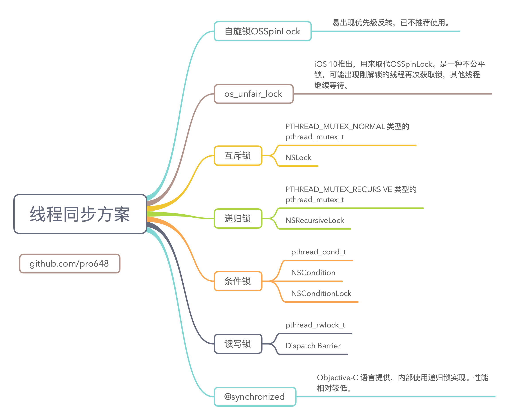

> 这是并发控制方案的系列文章，介绍了各种锁的使用及优缺点。
>
> 1. [自旋锁](https://github.com/pro648/tips/blob/master/sources/%E7%BA%BF%E7%A8%8B%E5%90%8C%E6%AD%A5%E4%B9%8B%E8%87%AA%E6%97%8B%E9%94%81.md)
> 2. [os_unfair_lock](https://github.com/pro648/tips/blob/master/sources/%E7%BA%BF%E7%A8%8B%E5%90%8C%E6%AD%A5%E4%B9%8Bos_unfair_lock.md)
> 3. [互斥锁](https://github.com/pro648/tips/blob/master/sources/%E7%BA%BF%E7%A8%8B%E5%90%8C%E6%AD%A5%E4%B9%8B%E4%BA%92%E6%96%A5%E9%94%81.md)
> 4. [递归锁](https://github.com/pro648/tips/blob/master/sources/%E7%BA%BF%E7%A8%8B%E5%90%8C%E6%AD%A5%E4%B9%8B%E9%80%92%E5%BD%92%E9%94%81.md)
> 5. [条件锁](https://github.com/pro648/tips/blob/master/sources/%E7%BA%BF%E7%A8%8B%E5%90%8C%E6%AD%A5%E4%B9%8B%E6%9D%A1%E4%BB%B6%E9%94%81.md)
> 6. [读写锁](https://github.com/pro648/tips/blob/master/sources/%E7%BA%BF%E7%A8%8B%E5%90%8C%E6%AD%A5%E4%B9%8B%E8%AF%BB%E5%86%99%E9%94%81.md)
> 7. [@synchronized](https://github.com/pro648/tips/blob/master/sources/%E7%BA%BF%E7%A8%8B%E5%90%8C%E6%AD%A5%E4%B9%8B@synchronized.md)
>
> OSSpinLock、os_unfair_lock、pthread_mutex_t、pthread_cond_t、pthread_rwlock_t 是值类型，不是引用类型。这意味着使用 = 会进行复制，使用复制的可能导致闪退。pthread 函数认为其一直处于初始化的内存地址，将其移动到其他内存地址会产生问题。使用copy的OSSpinLock不会崩溃，但会得到一个全新的锁。

> 如果你对线程、进程、串行、并发、并行、锁等概念还不了解，建议先查看以下文章：
>
> - [Grand Central Dispatch的使用](https://github.com/pro648/tips/blob/master/sources/Grand%20Central%20Dispatch%E7%9A%84%E4%BD%BF%E7%94%A8.md)
> - [Operation、OperationQueue的使用](https://github.com/pro648/tips/blob/master/sources/Operation%E3%80%81OperationQueue%E7%9A%84%E4%BD%BF%E7%94%A8.md)
> - [多线程简述](https://github.com/pro648/tips/blob/master/sources/%E5%A4%9A%E7%BA%BF%E7%A8%8B%E7%AE%80%E8%BF%B0.md)
> - [并发控制之线程同步](https://github.com/pro648/tips/blob/master/sources/%E5%B9%B6%E5%8F%91%E6%8E%A7%E5%88%B6%E4%B9%8B%E7%BA%BF%E7%A8%8B%E5%90%8C%E6%AD%A5.md)
> - [并发控制之无锁编程](https://github.com/pro648/tips/blob/master/sources/%E5%B9%B6%E5%8F%91%E6%8E%A7%E5%88%B6%E4%B9%8B%E6%97%A0%E9%94%81%E7%BC%96%E7%A8%8B.md)

`os_unfair_lock`是一种底层锁，用于取代`OSSpinLock`，尝试获取已加锁的线程无需忙等，解锁时由内核唤醒。和`OSSpinLock`一样，`os_unfair_lock`也没有加强公平性和顺序。例如，释放锁的线程可能立即再次加锁，而之前等待锁的线程唤醒后没有机会尝试加锁。这样有利于提高性能，但也造成了饥饿（starvation）。

> Starvation 指贪婪线程占用共享资源太长时间，其他线程无法访问共享资源、无法取得进展。例如，某对象的同步方法占用时间过长，并且频繁调用，其他线程尝试调用该方法时会被堵塞，处于 starvation。

存储在锁中的值应被认为是不透明的，并且在实现中定义。其包含线程信息，系统可用于解决优先级反转问题。

## 1. 初始化os_unfair_lock

`os_unfair_lock`结构体包含 unfair lock 数据。

初始化方法如下：

```
    private var moneyLock: os_unfair_lock = os_unfair_lock_s()
    private var ticketLock: os_unfair_lock = os_unfair_lock_s()
```

> 如果在 Objective-C 中使用`os_unfair_lock`，则应导入`#import <os/lock.h>`头文件。

## 2. 加锁os_unfair_lock_lock() os_unfair_lock_trylock()

由于锁的实现依赖锁值和拥有锁进程的地址，因此线程、进程不能通过共享、映射内存地址获取`os_unfair_lock`。

加锁方法如下：

```
        os_unfair_lock_lock(&moneyLock)
```

如果锁已经加锁，`os_unfair_lock_lock()`会休眠，解锁后由内核唤醒。`os_unfair_lock_trylock()`遇到已经加锁的锁，会直接返回 false。不要在循环中调用`os_unfair_lock_trylock()`函数，`os_unfair_lock_lock()`函数已经实现了循环功能。

## 3. 解锁os_unfair_lock_unlock()

必须在加锁的线程调用`os_unfair_lock_unlock()`解锁，从其他线程解锁会产生运行时错误。

解锁方法如下：

```
        os_unfair_lock_unlock(&moneyLock)
```

完整的代码如下：

```
class OSUnfairLockDemo: BaseDemo {
    private var moneyLock: os_unfair_lock = os_unfair_lock_s()
    private var ticketLock: os_unfair_lock = os_unfair_lock_s()
    
    override func drawMoney() {
        os_unfair_lock_lock(&moneyLock)
        
        super.drawMoney()
        
        os_unfair_lock_unlock(&moneyLock)
    }
    
    override func saveMoney() {
        os_unfair_lock_lock(&moneyLock)
        
        super.saveMoney()
        
        os_unfair_lock_unlock(&moneyLock)
    }
    
    override func saleTicket() {
        os_unfair_lock_lock(&ticketLock)
        
        super.saleTicket()
        
        os_unfair_lock_unlock(&ticketLock)
    }
}
```

通常，应优先选择使用高级同步工具。如 pthread、dispatch 等提供的同步方案。

Demo名称：Synchronization  
源码地址：<https://github.com/pro648/BasicDemos-iOS/tree/master/Synchronization>

> 上一篇：[线程同步之自旋锁](https://github.com/pro648/tips/blob/master/sources/%E7%BA%BF%E7%A8%8B%E5%90%8C%E6%AD%A5%E4%B9%8B%E8%87%AA%E6%97%8B%E9%94%81.md)
>
> 下一篇：[线程同步之互斥锁](https://github.com/pro648/tips/blob/master/sources/%E7%BA%BF%E7%A8%8B%E5%90%8C%E6%AD%A5%E4%B9%8B%E4%BA%92%E6%96%A5%E9%94%81.md)

参考资料：

1. [Starvation and Livelock](https://docs.oracle.com/javase/tutorial/essential/concurrency/starvelive.html)
2. [Synchronization](https://developer.apple.com/documentation/os/synchronization?language=objc)

