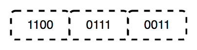
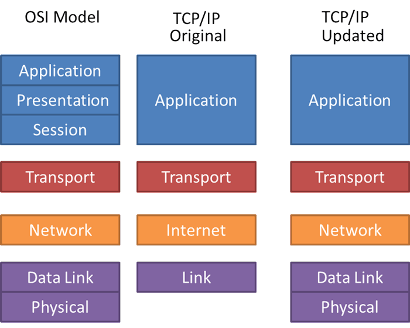
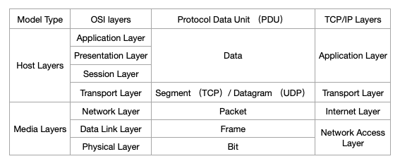

网络开发过程中，经常遇到各种协议，如：TCP、UDP、HTTP、FTP、IP等。这些协议差别很大、用途不同。为了更好理解这些协议，需先掌握网络分层模型。

当前，网络模型存在三种划分方式：

1. 开放式系统互联模型（Open System Interconnection Model，缩写为 OSI model，简称为 OSI 模型）。
2. TCP/IP 四层模型。
3. 五层模型。

如果互联网只有一个协议统筹，某个地方需要改变设计时，就必须把所有部分整体换掉。分层之后只需把变动的层替换掉即可。把各层之间的接口部分规划好之后，每个层内部的设计就能够自由改动了。

层次化之后，设计也变得相对简单了。处于应用层之上的应用，只考虑分配给自己的任务，而不需要弄清楚对方在地球上哪个地方，对方的传输路线是怎样的，是否能确保传输送达等问题。

下面分别介绍各种划分方式。

## 1. OSI 模型

OSI 模型由国际标准化组织在 1984 年提出，试图使各种计算机在世界范围内互联为网络的标准框架。

OSI 模型是一个七层体系结构，每层都有特定功能。七层协同工作，将数据从一个设备传输到另一个设备。

#### 1.1 第一层 物理层 Physical Layer

OSI 参考模型最底层是物理层，物理层负责在设备和物理传输介质之间传输、接收非结构化数据，它将数字 bits 转换为电、无线电或光信号。规范定义了如电压、电压变化时间、物理速率、最大传输距离等。

物理层负责将单个 bits 从一个节点传输到下一个节点。当接收数据时，物理层接收信号、将其转换为0和1，并发送给数据链路层，链路层将 frame 组合为原始状态。

物理层功能如下：

- 比特同步 bit synchronization：物理层通过提供原子钟，实现发送、接收比特同步。
- 比特率控制 bit rate control：物理层定义了传输控制，决定每秒发送数据量。
- 物理拓扑 physical topologies：物理层指定在网络中排列不同设备、节点的方式，如总线、星形或网状拓扑。
- 传输模式 transmission mode：物理层还定义了两个连接的设备间数据传输方式。如：
  - 单工 simplex：数据传输是单向的，一方固定为发送端、另一方固定为接收端。
  - 半双工 half-duplex：数据可以在一个信号载体的两个方向上传输，但不能同时传输。
  - 全双工 duplex：数据可以在两个方向上同时传输，它在能力上相当于两个单工通信的结合。

> 网络层、数据链路层和物理层也称为底层或硬件层。

#### 1.2 第二层 数据链路层 Data Link Layer

数据链路层（Data Link Layer，缩写 DLL）负责节点到节点的消息传递，该层的主要功能是确保在物理层上从一个节点到另一个节点正确传输数据。当数据包到达时，DDL 使用 MAC 地址传输给目标主机。

数据链路层被划分为两个子层：

- 逻辑链路控制 Logical Link Control，简写为 LLC。
- 媒体访问控制 Media Access Control，简写为 MAC。

从网络层接收的数据包（packet）根据网卡（Network Interface Card，缩写为NIC）的帧大小进一步分割。DLL 在发送方、接收方的 header 中封装了 MAC 地址。

通过地址解析协议（Address Resolution Protocol，缩写为ARP），可以获取拥有指定 IP 地址目标主机的 MAC 地址。

数据链路层功能如下：

- 封装成帧 framing：它为发送方提供了一种对接收方有意义的一组比特，其通过将特殊的位模式附加到帧的开头和结尾来实现。
- 物理寻址 physical addressing：创建帧后，data link layer 为每一帧的 header 添加发送方、接收方的 MAC 地址。
- 错误控制 error control：data link layer 的错误控制机制会检测、重发丢失或损坏的帧。
- 流控制 flow control：双方的速率必须保持恒定，否则数据可能会被损坏。Flow control 协调在收到确认之前可发送的数据量。
- 访问控制 access control：多个设备共享一个通信通道时，MAC 子层用于确定给定时间哪个设备可以控制该通道。

> Data link layer 中的数据包称为帧。

#### 1.3 第三层 网络层 Network Layer

网络层用于将数据从一台主机传输到位于不同网络中的另一台主机。它还负责分组路由，即从多条路线中选取路径最短的。Network layer 会把发送者、接收者的 IP 地址放到 header 中。

网络层功能如下：

- 路由 routing：网络层协议决定从源到目的地选取哪条线路。
- 逻辑寻址 logical addressing：为唯一地标识互联网上的每个设备，网络层定义了一种寻址方案。发送者和接收者的 IP 地址由网络层放置到 header 中。

#### 1.4 第四层 传输层 Transport Layer

传输层从网络层获取服务，并向应用层提供服务。Transport layer 提供端到端的消息传递服务，发送成功后返回确认、数据出错后重发的功能。Transport layer 中的数据称为 segments。

###### 1.4.1 发送方

Transport layer 从上层接收格式化数据，对数据进行分片，流量、错误控制，确保正确的数据传输。还会将源、目标主机端口号添加到 header，并将 segment 数据转发给 network layer。

###### 1.4.2 接收方

Transport layer 从 header 读取端口号，并将数据转发给对应 app，还会对分段数据进行排序和重组。

Transport layer 提供以下功能：

- 分段和重组 segmentation and reassembly：传输层从 session layer 接收 message，将 message 分割为更小单位，每个 segment 都关联一个 header。传输层在目标端重组 message。
- 服务点寻址 service point addressing：为了将消息传递给正确的进程，transport layer header 包含 service point addressing 或 port address。

Transport layer 有两个性质不同的协议：

- TCP（Transmission Control Protocol，传输控制协议），面向链接，是 byte stream。
  - 数据按顺序到达。
  - 数据最小错误。
  - 重复数据被丢弃。
  - 丢失、缺失的数据会重发。
  - 流量拥塞控制。
- UDP（User Data Protocol，用户数据报协议），无链接，不可靠。
  - 使用弱校验和算法（weak checksum algorithm）检查错误。
  - 用于对准时性要求高，可靠性要求低的流媒体（音频、视频、Voice over IP 等），或者建立可靠链接消耗太大的简单查询，如 DNS 解析。

> Transport layer 中的数据被称为 segment。Transport layer 由操作系统管理，是 OSI 模型的核心。

#### 1.5 第五层 会话层 Session Layer

会话层负责建立连接，维护会话、认证，并确保安全。

Session layer 功能如下：

- 建立、维护、终止会话。
- 同步：会话层允许进程向数据中添加同步点，用于定位错误，避免数据丢失。
- 对话控制：会话层允许两个系统以半双工或全双工方式互相通信。

#### 1.6 第六层 表示层 Presentation Layer

表示层也称为转换层（translation layer）。在表示层提取应用层的数据，并根据需要转换格式，以便通过网络传输。

表示层功能如下：

- 转换。例如，将 ASCII 转换为 EBCDIC。
- 加密、解密。加密时将数据转换为另一种样式，加密后的数据被称为密文，解密后的数据被称为明文。加密、解密时需要使用对应的 key。
- 压缩：压缩可以减少需传送的数据量。

#### 1.7 第七层 应用层 Application Layer

OSI 模型的最顶层是应用层，应用层是 app 访问网络、向用户显示接收到信息的窗口。

应用层功能如下：

- 网络虚拟终端。
- FTAM-File 传输的访问与管理。
- 邮件服务。
- 目录服务。

## 2. TCP/IP 四层模型

OSI 模型是一个参考/逻辑模型，它旨在通过将通信过程分为更小、更简单的组件来描述通信系统的功能。TCP/IP 是 Transmission Control Protocol/Internet Protocol 协议的缩写，包含以下四层：

1. 网络接口层 Network Interface。
2. 网络层 Internet Layer。
3. 传输层 Transport Layer / Host-to-Host。
4. 应用层 Application Layer。

#### 2.1 第一层 网络接口层 Network Interface

TCP/IP 模型中的 network interface 对应 OSI model 中的 data link 和 physical。网络接口层进行硬件寻址、物理传输数据。

#### 2.2 第二层 网络层 Internet Layer

TCP/IP模型中的网络层与 OSI 模型中的网络层对应，定义了数据逻辑传输的协议。网络层主要协议有：

- 互联网协议（Internet Protocol，缩写为 IP）：根据数据包 header，将其从发送方传递到接收方。IP 有 IPv4 和 IPv6 两个版本。
- 互联网控制消息协议（Internet Control Message Protocol，缩写为 ICMP）：用于 IP 中发送控制消息，用于定位通信中各种问题。
- 地址解析协议（Address Resolution Protocol，缩写为 ARP）：用于获取拥有指定 IP 地址目标主机的 MAC 地址。

#### 2.3 第三层 传输层 Transport Layer

TCP/IP 模型中的 transport layer 对应 OSI 模型中的 transport layer，负责端到端数据传输和错误控制。Transport layer 主要协议有面向连接的 TCP 协议、无链接的 UDP 协议。

#### 2.4 第四层 应用层 Application Layer

TCP/IP 模型中的应用层对应 OSI 模型中的 application layer、presentation layer、session layer 三层。负责节点到节点的通信，并控制用户界面。

应用层协议有：HTTP、HTTPS、FTP、TFTP、Telnet、SSH、SMTP、SNMP、DNS等。

## 3. 五层模型

虽然 OSI 模型由国际标准组织制定，但其实现过于复杂、制定周期过长，在其整套标准推出之前，TCP/IP 模型已经在全球范围内被广泛使用，因此，TCP/IP 模型才是事实上的标准。

TCP/IP 模型定义了应用层、传输层、网际层、网络接口层共四层，但并没有给出接口层的具体实现。因此，通常将网络接口层替换为 OSI 七层模型中的数据链路层和物理层，这就是五层网络模型：

## 4. 传输过程中如何处理数据

在分层系统中，层之间使用不同格式交换数据，被称为协议数据单元（Protocol data unit，缩写为 PDU）。下图显示了不同层之间 PDU：

例如，当用户请求访问网站时，服务器把请求的数据传递给 application layer。此时，从上层至下层各层根据约定执行相应操作，数据通过物理层传递给接收者。接收者收到数据后，从底层向上传输，每层执行相应功能，直到发送给对应 app。

从上层向下层传输过程中，每层会为 PDU 添加 header、footer，用以指导、标记 packet，这个过程称为封装。Header、footer 和 data 共同构成下一层的 PDU。整个过程持续到最底层，即 physical layer 或 network access layer，数据从这一层传输给接收者。接收者处理过程相反，每层根据 header、footer 解封装数据，直到所有数据接收、处理完毕。

## 5. TCP/IP 和 OSI 对故障排除的意义

有了分层概念，当连接失败时更容易检查故障。每一层都为上一层服务，检查时应从底层开始。例如，当计算机无法连接到网络时，应先检查是否接入了网线，或路由器是否连接到了网线，RJ45 引脚是否完好等。

## 总结

尽管仍然经常引用 OSI 模型，但 Internet protocol 组件已经成为网络协议的标准。TCP/IP 简洁的实现方式、相互独立的协议，使其成为现实中的标准。

HTTP 建立连接的过程中需要三次握手，如果你对握手过程不了解，可以查看我的另一篇文章[三次握手、七次握手、四次挥手](https://github.com/pro648/tips/blob/master/sources/%E4%B8%89%E6%AC%A1%E6%8F%A1%E6%89%8B%E3%80%81%E4%B8%83%E6%AC%A1%E6%8F%A1%E6%89%8B%E3%80%81%E5%9B%9B%E6%AC%A1%E6%8C%A5%E6%89%8B.md)。

参考资料：

1. [Layers of OSI Model](https://www.geeksforgeeks.org/layers-of-osi-model/?ref=lbp)

2. [TCP/IP Model](https://www.geeksforgeeks.org/tcp-ip-model/?ref=lbp)

3. [TCP/IP vs. OSI: What’s the Difference Between the Two Models?](https://community.fs.com/blog/tcpip-vs-osi-whats-the-difference-between-the-two-models.html)

4. [TCP/IP vs OSI Model: What's the Difference?](https://www.guru99.com/difference-tcp-ip-vs-osi-model.html)

   