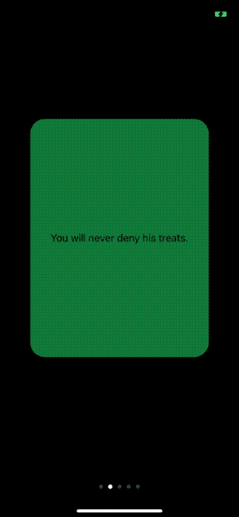
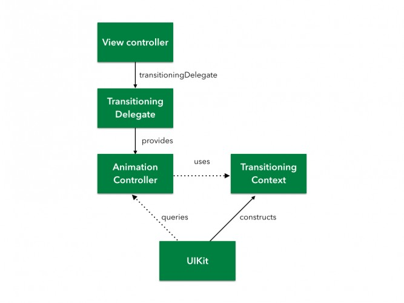
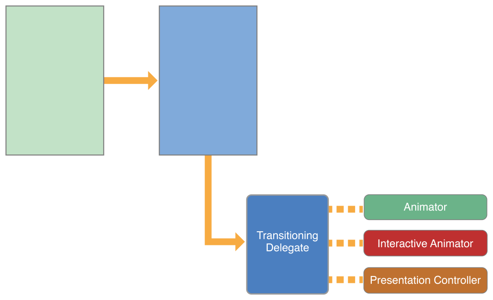
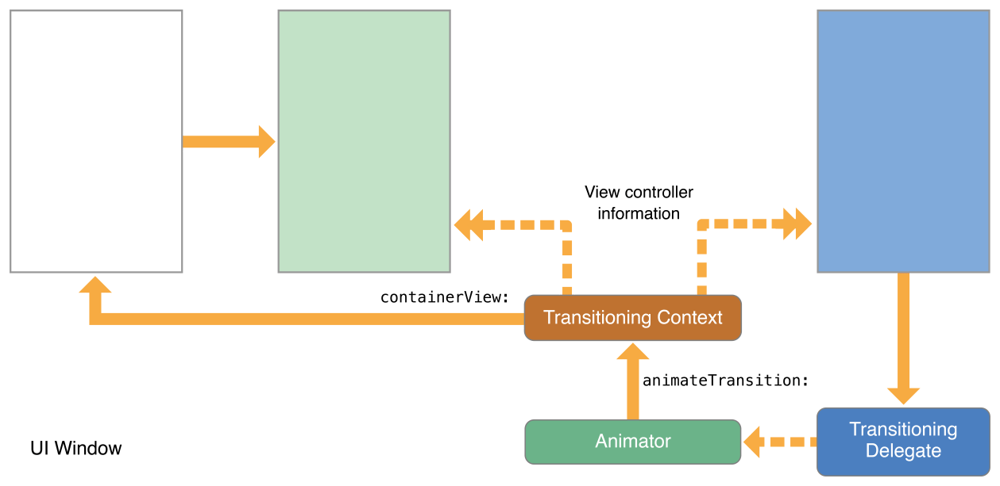
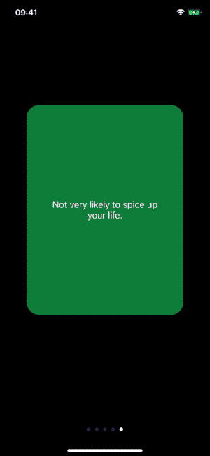
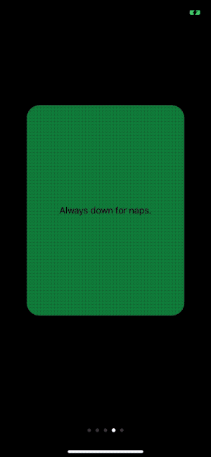
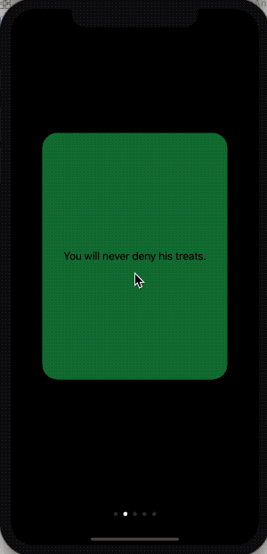

iOS 提供了一些视图控制器转场动画（transition animation），如push、pop、present、dismiss。同时也提供了创建自定义转场动画方法。

这篇文章将介绍`UIViewController`自定义转场动画，涉及内容如下：

- 转场动画的结构。
- 如何使用自定义转场动画present、dismiss视图控制器。
- 如何创建交互式转场动画。

## 1. 创建demo

从[pro648/BasicDemos-iOS/tree/master/TransitionAnimation](https://github.com/pro648/BasicDemos-iOS/tree/master/TransitionAnimation模版)下载demo模版，运行后如下：



Demo 使用`UIPageViewController`显示多个卡片，点击卡片显示动物图片和名称。

目前视图导航部分使用的系统标准转场动画，后续部分会将其替换为自定义转场动画。

> 如果你对视图控制器转场还不了解，可以先查看我的另一篇文章：[View Controller 转场](https://github.com/pro648/tips/blob/master/sources/View%20Controller%20%E8%BD%AC%E5%9C%BA.md)

## 2. 转场相关 API

转场相关 API 由多个协议组成，方便为已有对象添加转场动画。下面图片显示了转场动画 API 主要组成部分：



#### 2.1 The Transitioning Delegate

Transitioning Delegate 是转场动画的起点，是遵守`UIViewControllerTransitioningDelegate`协议的对象。使用 transitioning delegate 为 UIKit 提供以下对象：

- 动画对象（Animator object）：animator object 对象负责创建显示、隐藏视图控制器的视图。Transitioning delegate 可以为 present、dismiss 提供不同的 animator object。animator object 对象需遵守`UIViewControllerAnimatedTransitioning`协议。

- 交互式动画对象（Interactive animator object）：交互式动画对象使用触摸事件、手势，驱动动画的进度。交互式动画对象遵守`UIViewControllerInteractiveTransitioning`协议。

  继承`UIPercentDrivenInteractiveTransition`类是创建交互式动画最简单的方法。使用该类管理 animator object 动画进度。如果不继承自`UIPercentDrivenInteractiveTransition`，创建自己的 interactive animator，则需负责渲染动画的每一帧。

- Presentation controller：管理视图控制器呈现在屏幕上的样式。系统提供了默认呈现样式，你可以使用`UIPresentationController`创建自定义样式。

为视图控制器的`transitioningDelegate`属性赋值后，UIKit 就会使用你提供的自定义动画。如果没有设置，UIKit 使用视图控制器的`modalTransitionStyle`属性指定的动画样式。

下图显示了 transitioning delegate、animator object 和 presented view controller 关系：



#### 2.2 Animator object

Animator object 是一个遵守`UIViewControllerAnimatedTransitioning`协议的对象，负责具体的动画过程。Animator object 的关键是`animateTransition(using:)`方法，在该方法中创建动画。动画过程大致分为以下三个阶段：

- 配置动画参数。
- 使用 [Core Animation](https://github.com/pro648/tips/blob/master/sources/CoreAnimation%E5%9F%BA%E6%9C%AC%E4%BB%8B%E7%BB%8D.md) 或`UIView`等创建动画。
- 清理视图并结束动画。

#### 2.3 Transitioning Context

转场动画开始前，UIKit 创建了 transitioning context 对象。Transitioning context 对象实现了`UIViewControllerContextTransitioning`协议，并存储了动画涉及的视图控制器、视图等，以及是否是交互式动画。

> 构建自定义动画时，永远使用 transitioning context 提供的对象和数据，不要使用自己缓存的对象。转场可能发生于多种情况下，有些情况下动画参数可能发生变化。Transitioning context 可以确保获得正确的动画参数，而你缓存的信息可能会过期。

Animator object 对象从`animateTransition(using:)`方法接收 transitioning context。创建的动画应发生在 container view 上。例如，present 视图控制器时，将其视图作为子视图添加到 container view。Container view  可能是屏幕，也可能是一个普通的视图，但永远用于配置动画。下图显示了 transition context 对象与其他对象的关系：



## 3. 转场流程

#### 3.1 Presentation 转场流程

当 presented view controller 的`transitioningDelegate`属性包含有效对象时，UIKit 使用自定义 animator object 呈现动画。准备动画时，UIKit 调用`animationController(forPresented:presenting:source)`方法获取自定义的 animator object。如果能获取到 animator object，UIKit执行以下步骤：

1. UIKit 调用`interactionControllerForPresentation(using:)`方法，查看是否有交互动画对象。如果返回nil，则不使用交互式动画。

2. UIKit 调用 animator object 的`transitionDuration(using:)`方法，获取动画时长。

3. UIKit 调用相应方法，开始动画：

   - 对于非交互式动画，UIKit 调用 animator object 的 `animateTransition(using:)`方法。
   - 对于交互式动画，UIKit 调用`UIViewControllerInteractiveTransitioning`的`startInteractiveTransition(_:)`方法。

4. UIKit 等待调用`completeTransition(_:)`方法。

   动画结束时，Animator 对象必须调用`completeTransition(_:)`方法，一般在 completion block 内调用。调用该方法后系统才知道动画已经结束，并调用`present(_:animated:completion:)`方法的completion handler，以及 animator 的`animationEnded(_:)`方法。

#### 3.2 自定义 presentation 转场

创建以下动画效果：

- 点击卡片，卡片翻转显示宠物图片。
- 翻转后放大图片至全屏。

###### 3.2.1 创建 animator

Present 视图控制器时，presented view controller 的视图使用动画进入最终位置。其它视图可能也会使用动画一起呈现，但动画的主要部分是 presented view controller 的视图。配置动画的主要步骤是相同的，从 transitioning context 获取所需对象和数据，并创建动画。

配置 present 动画：

- 使用`viewController(forKey:)`和`view(forKey:)`方法获取动画视图控制器、视图。

  > from 是动画开始前显示的，to 是动画结束后显示的。

- 设置 toView 起始位置，设置其他属性的初始值。

- 使用`finalFrame(for:)`方法获取 toView 的终点位置。

- 添加 toView 到 container view。

- 创建动画：

  - 在 animation block 设置 toView 的终点位置，设置其它属性的终点值。
  - 在 completion block，调用`completeTransition(_:)`方法告诉系统动画已经结束，执行其他清理工作。

首先创建 animation controller，其必须遵守`UIViewControllerAnimatedTransitioning`协议。

```
class PresentAnimationController: NSObject, UIViewControllerAnimatedTransitioning {

}
```

动画需要使用卡片`frame`作为起点，添加以下代码存储相关信息：

```
    private let originFrame: CGRect
    
    init(originFrame: CGRect) {
        self.originFrame = originFrame
    }
```

实现`transitionDuration(using:)`方法，指定动画时长。

```
    /// 动画时长
    private let duration: TimeInterval = 0.6
    
    func transitionDuration(using transitionContext: UIViewControllerContextTransitioning?) -> TimeInterval {
        return duration
    }
```

> 开发过程中，可以将 duration 设置长一些，也可以开启 Simulator 的 Debug > Slow Animations。

在`animateTransition(using:)`方法中，设置动画：

```
    func animateTransition(using transitionContext: UIViewControllerContextTransitioning) {
        // 获取被替换的和即将显示的视图控制器，以及转场后视图快照。
        guard let fromVC = transitionContext.viewController(forKey: .from),
            let toVC = transitionContext.viewController(forKey: .to),
            let snapshot = toVC.view.snapshotView(afterScreenUpdates: true) else { return }
        
        // 所有动画发生于 containerView 上，获取 containerView 和最终视图大小。
        let containerView = transitionContext.containerView
        let finalFrame = transitionContext.finalFrame(for: toVC)
        
        // 配置 snapshot frame和其它属性，以刚好覆盖在 card 上。
        snapshot.frame = originFrame
        snapshot.layer.cornerRadius = CardViewController.cardCornerRadius
        snapshot.layer.masksToBounds = true
        
        // containerView 只包含 fromVC 的view，添加toView和snapshot。
        containerView.addSubview(toVC.view)
        containerView.addSubview(snapshot)
        toVC.view.isHidden = true
        
        AnimationHelper.perspectiveTransform(for: containerView)
        snapshot.layer.transform = AnimationHelper.yRotation(.pi/2)
        
        // UIView动画时长必须与转场动画时长一致。
        UIView.animateKeyframes(withDuration: duration, delay: 0, options: .calculationModeCubic, animations: {
            // 绕y轴旋转 fromView 90度，以隐藏 fromView
            UIView.addKeyframe(withRelativeStartTime: 0.0, relativeDuration: 1/3) {
                fromVC.view.layer.transform = AnimationHelper.yRotation(-.pi/2)
            }
            
            // 再次旋转 snapshot，以显示它。
            UIView.addKeyframe(withRelativeStartTime: 1/3, relativeDuration: 1/3) {
                snapshot.layer.transform = AnimationHelper.yRotation(0.0)
            }
            
            // 放大 snapshot 至全屏。
            UIView.addKeyframe(withRelativeStartTime: 2/3, relativeDuration: 1/3) {
                snapshot.frame = finalFrame
                snapshot.layer.cornerRadius = 0
            }
        }) { (_) in
            // snapshot已经是全屏，隐藏snapshot显示出 toView。
            toVC.view.isHidden = false
            snapshot.removeFromSuperview()
            fromVC.view.layer.transform = CATransform3DIdentity
            
            // 调用completeTransition(_:)告诉系统动画已经结束。
            transitionContext.completeTransition(!transitionContext.transitionWasCancelled)
        }
    }
```

如果想直接绘制内容，不使用视图，使用`animateTransition(using:)`方法配置[CADisplayLink](https://github.com/pro648/tips/blob/master/sources/%E8%AE%A1%E6%97%B6%E5%99%A8CADisplayLink.md)。

###### 3.2.2 使用 animator

UIKit 使用视图控制器的`transitioningDelegate`属性指定对象提供的 animator。因此，视图控制器需遵守`UIViewControllerTransitioningDelegate`协议。这这个demo中，`CardViewController`将作为 transitioning delegate。

打开`CardViewController.swift`，添加以下 extension：

```
extension CardViewController: UIViewControllerTransitioningDelegate {
    func animationController(forPresented presented: UIViewController, presenting: UIViewController, source: UIViewController) -> UIViewControllerAnimatedTransitioning? {
        return PresentAnimationController(originFrame: cardView.frame)
    }
}
```

最后，为`CardViewController`的`transitioningDelegate`属性赋值。在`handleTap()`的`present(_:animated:completion:)`方法前添加以下代码：

```
        revealVC.transitioningDelegate = self
```

> 这里是为 presented view controller 的`transitioningDelegate`属性赋值，而非 presenting view controller。

运行后效果如下：



#### 3.3 Dismiss 转场流程

当 dismiss 视图控制器时，UIKit 调用 transitioning delegate 的`animaitonController(forDismissed:)`方法，并执行以下步骤：

1. UIKit 调用`transitioningDelegate`的`interactionControllerForDismissal(using:)`方法，查看是否支持交互式动画。如果该方法返回nil，则不使用交互式动画。

2. UIKit 调用 animator object 的`transitionDuration(using:)`方法，获取动画时长。

3. UIKit 调用相应方法，开始动画：

   - 对于非交互式动画，UIKit 调用 animator object 的 `animateTransition(using:)`方法。
   - 对于交互式动画，UIKit 调用`UIViewControllerInteractiveTransitioning`的`startInteractiveTransition(_:)`方法。

4. UIKit 等待调用`completeTransition(_:)`方法。

   动画结束时，Animator 对象必须调用`completeTransition(_:)`方法，一般在 completion block 内调用。调用该方法后系统才知道动画已经结束，并调用`present(_:animated:completion:)`方法的completion handler，以及 animator 的`animationEnded(_:)`方法。

> 可以看到，present 和 dismiss 转场动画流程很相似，只有获取 animation controller、interaction controller 的方法有所不同。

#### 3.4 自定义 dismiss 转场

这里的 dismiss 转场动画按照呈现动画相反的顺序执行动画。

配置 dismiss 动画：

- 使用`viewController(forKey:)`和`view(forKey:)`方法获取动画视图控制器、视图。

- 计算 fromView 的终点位置。

- 添加 toView 到 container view。

  Present 时，动画结束后会移除 presenting view controller 视图。因此，dismiss 时需先添加视图到 container view。

- 创建动画：

  - 在 animation block，设置 fromView 终点位置，设置其它属性终点值。
  - 在 completion block，从视图层级移除 fromView，调用`completeTransition(_:)`方法告诉系统动画已经结束，执行其他清理工作。

创建`DismissAnimationController.swift`文件，并添加以下代码：

```
class DismissAnimationController: NSObject, UIViewControllerAnimatedTransitioning {
    
    /// 转场结束时动画终点
    private let destinationFrame: CGRect
    private let duration: TimeInterval = 0.6
    
    // 没有交互式
    init(destinationFrame: CGRect) {
        self.destinationFrame = destinationFrame
    }
    
    func transitionDuration(using transitionContext: UIViewControllerContextTransitioning?) -> TimeInterval {
        return duration
    }
    
    func animateTransition(using transitionContext: UIViewControllerContextTransitioning) {
    
    }
}
```

更新`animateTransition(using:)`方法如下：

```
    func animateTransition(using transitionContext: UIViewControllerContextTransitioning) {
        // 这次需要操控 fromView
        guard let fromVC = transitionContext.viewController(forKey: .from),
            let toVC = transitionContext.viewController(forKey: .to),
            let snapshot = fromVC.view.snapshotView(afterScreenUpdates: false) else { return }
        
        snapshot.layer.cornerRadius = CardViewController.cardCornerRadius
        snapshot.layer.masksToBounds = true
        
        // 视图层级需是：toView、fromView、snapshot
        let containerView = transitionContext.containerView
        containerView.insertSubview(toVC.view, at: 0)
        containerView.addSubview(snapshot)
        fromVC.view.isHidden = true
        
        // 先旋转 toView，以便动画开始时不立即显示 toView。
        AnimationHelper.perspectiveTransform(for: containerView)
        toVC.view.layer.transform = AnimationHelper.yRotation(-.pi/2)
        
        UIView.animateKeyframes(withDuration: duration, delay: 0, options: .calculationModeCubic, animations: { // 动画顺序与 present 相反
            UIView.addKeyframe(withRelativeStartTime: 0.0, relativeDuration: 1/3) {
                snapshot.frame = self.destinationFrame
            }
            
            UIView.addKeyframe(withRelativeStartTime: 1/3, relativeDuration: 1/3) {
                snapshot.layer.transform = AnimationHelper.yRotation(.pi/2)
            }
            
            UIView.addKeyframe(withRelativeStartTime: 2/3, relativeDuration: 1/3) {
                toVC.view.layer.transform = AnimationHelper.yRotation(0.0)
            }
        }) { (_) in
            // completeTransition(_:)前，移除所有对视图层级的修改。
            fromVC.view.isHidden = false
            snapshot.removeFromSuperview()
            if transitionContext.transitionWasCancelled {
                toVC.view.removeFromSuperview()
            }
            transitionContext.completeTransition(!transitionContext.transitionWasCancelled)
        }
    }
```

当 dismiss 视图控制器时，`transitioningDelegate`负责提供动画对象。打开`CardViewController.swift`文件，为`UIViewControllerTransitioningDelegate`extension 添加以下方法：

```
    func animationController(forDismissed dismissed: UIViewController) -> UIViewControllerAnimatedTransitioning? {
        // 没有交互的dismiss动画
        guard let _ = dismissed as? RevealViewController else { return nil }
        return DismissAnimationController(destinationFrame: cardView.frame)
    }
```

运行后效果如下：



#### 3.5 交互式转场

为了支持交互式转场，`transitioningDelegate`需提供遵守了`UIViewControllerInteractiveTransitioning`协议的对象。

之前已经实现了转场动画，交互式转场根据手势控制动画进度，而非像播放视频一样让其自然播放。Apple 提供了`UIPercentDrivenInteractiveTransition`类控制动画时间，该类遵守了`UIViewControllerInteractiveTransitioning`协议。

`UIPercentDrivenInteractiveTransition`通过控制已有 animator 对象的时间使动画具有交互性，使用时只需处理交互事件，计算动画进度，并调用`update(_:)`更新动画即可。

可以直接使用`UIPercentDrivenInteractiveTransition`类，或继承后使用。如果继承了该类，在子类的`init`或`startInteractiveTransition(_:)`方法中配置交互手势。此后，使用交互手势计算动画进度，并调用`update(_:)`更新动画。当动画完成时，调用`finish()`；取消动画时，调用`cancel()`。

创建`SwipeInteractionController.swift`文件，并添加以下代码：

```
    var interactionInProgress = false
    private var shouldCompleteTransition = false
    
    /// 交互手势发生的视图控制器
    private weak var viewController: UIViewController!
    
    init(viewController: UIViewController) {
        super.init()
        self.viewController = viewController
        
        prepareGestureRecognizer(in: viewController.view)
    }
```

添加以下手势事件，当手势从屏幕左边缘滑动时触发：

```
    private func prepareGestureRecognizer(in view: UIView) {
        let gestureRecognizer = UIScreenEdgePanGestureRecognizer(target: self, action: #selector(self.handleGesture(_:)))
        gestureRecognizer.edges = .left
        view.addGestureRecognizer(gestureRecognizer)
    }
```

实现`UIScreenEdgePanGestureRecognizer`响应方法，如下所示：

```
    @objc func handleGesture(_ gestureRecognizer: UIScreenEdgePanGestureRecognizer) {
        // 使用局部变量计算滑动进度
        let translation = gestureRecognizer.translation(in: gestureRecognizer.view?.superview)
        guard let gestureView = gestureRecognizer.view else { return }
        let percent = translation.x / gestureView.bounds.size.width
        
        switch gestureRecognizer.state {
        case .began:
            // 手势开始时标记为动画进行中，并调用dismiss(animated:completion:)
            interactionInProgress = true
            viewController.dismiss(animated: true, completion: nil)
            
        case .changed:
            // 更新动画进度
            update(percent)
            
        case .cancelled:
            // 如果动画取消，更新interactionInProgress，并回滚动画。
            cancel()
            interactionInProgress = false
            
        case .ended:
            // 手势结束时，根据当前进度、速度决定结束还是取消动画。
            interactionInProgress = false
            let velocity = gestureRecognizer.velocity(in: gestureView)
            if percent > 0.5 || velocity.x > 0 {
                finish()
            } else {
                cancel()
            }
            
        default:
            break
        }
    }
```

打开`RevealViewController.swift`文件，添加以下属性：

```
    var swipeInteractionController: SwipeInteractionController?
```

在`viewDidLoad()`底部添加以下代码：

```
        swipeInteractionController = SwipeInteractionController(viewController: self)
```

更新`DismissAnimationController`的`init`方法，如下所示：

```
    let interactionController: SwipeInteractionController?
    
    init(destinationFrame: CGRect, interactionController: SwipeInteractionController?) {
        self.destinationFrame = destinationFrame
        self.interactionController = interactionController
    }
```

打开`CardViewController.swift`文件，更新`animationController(forDismissed:)`方法如下：

```
    func animationController(forDismissed dismissed: UIViewController) -> UIViewControllerAnimatedTransitioning? {
        guard let revealVC = dismissed as? RevealViewController else { return nil }
        return DismissAnimationController(destinationFrame: cardView.frame, interactionController: revealVC.swipeInteractionController)
    }
```

UIKit 最终会调用`transitioningDelegate`的`interactionControllerForDismissal(using:)`方法，查找是否有交互式动画。在`UIViewControllerTransitioningDelegate`extension 中增加以下方法：

```
    func interactionControllerForDismissal(using animator: UIViewControllerAnimatedTransitioning) -> UIViewControllerInteractiveTransitioning? {
        guard let dismissAnimator = animator as? DismissAnimationController,
            let interactionController = dismissAnimator.interactionController,
            interactionController.interactionInProgress else { return nil }

        return interactionController
    }
```

上述代码首先检查 animator 是否是`DismissAnimationController`，并确认交互式手势正在进行中。任一条件不满足，则返回nil，即采用非交互式动画。

运行后效果如下：



## 总结

这篇文章只关注了 presentation 和 dismissal 转场，但自定义转场也可以应用于容器控制器：

- 当使用`UINavigationController`时，`UINavigationControllerDelegate`协议的`navigationController(_:animationControllerFor:from:to:)`方法负责提供 animator 对象。
- 当使用了`UITabBarController`时，`UITabBarControllerDelegate`协议的`tabBarController(_:animationControllerForTransitionFrom:to:)`方法负责提供 animator 对象。

想要了解更多动画知识，可以查看我的 [Core Animation](https://github.com/pro648/tips/blob/master/sources/CoreAnimation%E5%9F%BA%E6%9C%AC%E4%BB%8B%E7%BB%8D.md) 系列文章。

Demo名称：TransitionAnimation  
源码地址：<https://github.com/pro648/BasicDemos-iOS/tree/master/TransitionAnimation>

参考资料：

1. [Custom UIViewController Transitions: Getting Started](https://www.raywenderlich.com/322-custom-uiviewcontroller-transitions-getting-started#toc-anchor-008)

2. [iOS custom transition tutorial in Swift](https://theswiftdev.com/ios-custom-transition-tutorial-in-swift/)

3. [Customizing the Transition Animations](https://developer.apple.com/library/archive/featuredarticles/ViewControllerPGforiPhoneOS/CustomizingtheTransitionAnimations.html#//apple_ref/doc/uid/TP40007457-CH16-SW1)

   