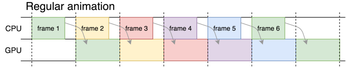
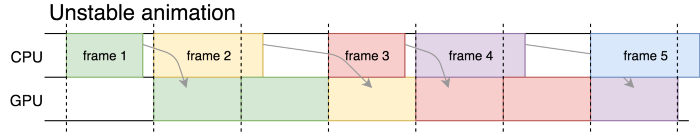
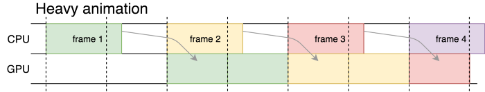

> 这是 Core Animation 的系列文章，介绍了 Core Animation 的用法，以及如何进行性能优化。
>
> 1. [CoreAnimation基本介绍](https://github.com/pro648/tips/blob/master/sources/CoreAnimation%E5%9F%BA%E6%9C%AC%E4%BB%8B%E7%BB%8D.md)
> 2. [CGAffineTransform和CATransform3D](https://github.com/pro648/tips/blob/master/sources/CGAffineTransform%E5%92%8CCATransform3D.md)
> 3. [CALayer及其各种子类](https://github.com/pro648/tips/blob/master/sources/CALayer%E5%8F%8A%E5%85%B6%E5%90%84%E7%A7%8D%E5%AD%90%E7%B1%BB.md)
> 4. [CAAnimation：属性动画CABasicAnimation、CAKeyframeAnimation以及过渡动画、动画组](https://github.com/pro648/tips/blob/master/sources/CAAnimation%EF%BC%9A%E5%B1%9E%E6%80%A7%E5%8A%A8%E7%94%BBCABasicAnimation%E3%80%81CAKeyframeAnimation%E4%BB%A5%E5%8F%8A%E8%BF%87%E6%B8%A1%E5%8A%A8%E7%94%BB%E3%80%81%E5%8A%A8%E7%94%BB%E7%BB%84.md)
> 5. [图层时间CAMediaTiming](https://github.com/pro648/tips/blob/master/sources/%E5%9B%BE%E5%B1%82%E6%97%B6%E9%97%B4CAMediaTiming.md)
> 6. [计时器CADisplayLink](https://github.com/pro648/tips/blob/master/sources/%E8%AE%A1%E6%97%B6%E5%99%A8CADisplayLink.md)
> 7. [影响动画性能的因素及如何使用 Instruments 检测](https://github.com/pro648/tips/blob/master/sources/%E5%BD%B1%E5%93%8D%E5%8A%A8%E7%94%BB%E6%80%A7%E8%83%BD%E7%9A%84%E5%9B%A0%E7%B4%A0%E5%8F%8A%E5%A6%82%E4%BD%95%E4%BD%BF%E7%94%A8%20Instruments%20%E6%A3%80%E6%B5%8B.md)
> 8. [图像IO之图片加载、解码，缓存](https://github.com/pro648/tips/blob/master/sources/%E5%9B%BE%E5%83%8FIO%E4%B9%8B%E5%9B%BE%E7%89%87%E5%8A%A0%E8%BD%BD%E3%80%81%E8%A7%A3%E7%A0%81%EF%BC%8C%E7%BC%93%E5%AD%98.md)
> 9. [图层性能之离屏渲染、栅格化、回收池](https://github.com/pro648/tips/blob/master/sources/%E5%9B%BE%E5%B1%82%E6%80%A7%E8%83%BD%E4%B9%8B%E7%A6%BB%E5%B1%8F%E6%B8%B2%E6%9F%93%E3%80%81%E6%A0%85%E6%A0%BC%E5%8C%96%E3%80%81%E5%9B%9E%E6%94%B6%E6%B1%A0.md)

## 1. 什么是CADisplayLink

`CADisplayLink`常被认为是一种创建平滑动画的高级计时器。这是`CADisplayLink`的一种应用，但不是唯一应用。

在`CADisplayLink`的文档中，其描述如下：

> A timer object that allows your application to synchronize its drawing to the refresh rate of the display.
>
> `CADisplayLink`是一个计时器对象，允许应用将自身的绘制与屏幕的刷新率同步。

`CADisplayLink`与[NSTimer](https://github.com/pro648/tips/blob/master/sources/Timer%E7%9A%84%E4%BD%BF%E7%94%A8.md)和`DispatchSourceTimer`有些相似，根据自身配置定期触发回调：

```
    private func createDisplayLink() {
        let displayLink = CADisplayLink(target: self, selector: #selector(self.linkTriggered(_:)))
        displayLink.add(to: .main, forMode: .default)
    }
    
    @objc private func linkTriggered(_ displaylink: CADisplayLink) {
        print(displaylink.timestamp)
    }
```

> `init(target:selector:)`创建的 display link 会持有 target。

这里并未对 display link 做任何配置，直接添加到主线程的默认mode。你可以将`CADisplayLink`添加到任意线程 run loop 的任意 mode。需要注意的是：手动创建的线程、GCD 提供的后台线程默认没有 Run Loop，需手动启动 run loop。如果你对 run loop 不了解，可以查看我的另一篇文章：[RunLoop从入门到进阶](https://github.com/pro648/tips/blob/master/sources/RunLoop%E4%BB%8E%E5%85%A5%E9%97%A8%E5%88%B0%E8%BF%9B%E9%98%B6.md)。

`CADisplayLink`最大的特点就是与屏幕刷新帧率同步。它的回调由事件触发，而非时间，因此它更像是一个观察者，而非计时器。触发事件是刷新的帧。因此，`CADisplayLink`的回调方法在另一帧渲染后立即被调用。如果设备帧率是60FPS，回调方法不是每16.6ms调用一次（六十分之一秒约等于16.6ms），而是帧更新后调用。因此，有足够的16.6ms用来渲染下一帧。

`Timer`和`DispatchSourceTimer`的触发与帧刷新（frame update）没有关联，具体取决于计时器的启动时间和`tolerance`，触发时可能距离下一帧更新16ms，也可能只有2ms。

## 2. 帧 Frame

iOS 中有多种方式管理 UI。可以使用`UIKit`框架的`UIView`动画更新视图；使用 Core Animation 操纵`CALayer`，执行`CAAnimation`；也可以更进一步使用更为底层的 CoreGraphics 的 context、shape 和 path；如果想更为精细的控制渲染，则可以使用 OpenGL、Metal。当需要使用 Core Graphics、OpenGL、Metal 手动绘制帧时，`CADisplayLink`会非常有用。

屏幕显示内容是由 CPU 和 GPU 协作的结果。CPU 计算帧内容，GPU 显示到屏幕中。CPU 和 GPU 异步协作，当 GPU 显示第一帧内容时，CPU 正在计算第二帧内容。CPU 计算完成前，GPU 没有新内容需要绘制，因此 GPU 会保留上一帧内容在屏幕上。


在上图中，可以看到帧如何切换。分隔每个框的垂直虚线是显示刷新，也是上一帧、下一帧切换点。第一行是 CPU 渲染帧，第二行是 GPU 显示帧。

#### 2.1 流畅动画



上图中的渲染内容很简单，每一帧都可以在一帧时间内渲染完成。在六帧的时间里，渲染了6帧内容，动画非常流畅。

#### 2.2 部分掉帧



在上图中，有些情况下一帧的时间足够渲染内容，有些则不够。当 CPU 没有按时渲染完成内容时，到达下一帧时间时，GPU 会保留上一帧内容在屏幕上。这样会导致有些帧在屏幕上时间超过预期时间，动画产生卡顿、掉帧现象。

#### 2.3 严重掉帧



上图显示了每一帧渲染时间都超过一帧时间，导致每一帧显示时间都大于一帧时间，最终在六帧的时间里只显示了三帧内容。

## 3. 时间相关属性

#### 3.1 timestamp

`timestamp`是`CFTimeInterval`类型，关联值是上一帧渲染时间，也是这一帧计算开始时间。

#### 3.2 targetTimestamp

`targetTimestamp`也是`CFTimeInterval`类型，它是下一帧开始时间。

可以使用`targetTimestamp`取消、暂停长时间执行的进程，以避免执行已经超出执行时间的任务，进而确保整体的流畅性。

在`linkTriggered(_:)`回调方法内计算平方根的和。在每次计算后，比较`CACurrentMediaTime()`和`targetTimestamp`，如果计算平方根时间大于等于`targetTimestamp`，则停止计算。

```
    @objc private func linkTriggered(_ displaylink: CADisplayLink) {
//        print(displaylink.timestamp)
        
        var sqrtSum = 0.0
        for i in 0 ..< Int.max {
            sqrtSum += sqrt(Double(i))
            
            if CACurrentMediaTime() >= displaylink.targetTimestamp {
                print("Break at i = \(i), sqrtSum:\(sqrtSum)")
                break
            }
        }
    }
```

#### 3.3 duration

`duration`是两帧间隔：

```
        duration = displayLink.targetTimestamp - displayLink.timestamp
```

`CADisplayLink`首次回调前，`duration`值是未定义的。

#### 3.4 preferredFramesPerSecond

`preferredFramesPerSecond`默认为0，display link 按照屏幕最大帧率回调。有时可能想要帧率低一些，例如16ms不能完成渲染，这时可通过设置`preferredFramesPerSecond`降低 display link 帧率。

之所以被称为 preferred，是因为 display link 预定义了一些帧率。如果`UIScreen`的`maximumFramesPerSecond`为60，则可以降低帧率为30FPS（每两帧调用一次）、20FPS（每三帧调用一次）、15FPS（每四帧调用一次）等等。设置偏好帧率后，系统尽可能满足偏好设置。例如，设置`preferredFramesPerSecond`为27FPS，系统会将帧率设置为最为接近的30FPS。

可以使用以下代码输出当前实际帧率：

```
        print("Actual frames per second: \(1 / (displaylink.targetTimestamp - displaylink.timestamp))")
```

设置`preferredFramesPerSecond`小于设备最大帧率后，`duration`并不会随之改变。`duration`是帧之间间隔，并非回调间隔。如果想要计算回调间隔，使用以下代码：

```
        displaylink.targetTimestamp - displaylink.timestamp
```

## 4. 销毁 CADisplayLink

有两种控制`CADisplayLink`生命周期的方式，一种是暂停，一种是销毁：

```
        displayLink.isPaused = true
        displayLink.invalidate()
```

`isPaused`默认为 false。设置为 true 后，不再向 target 发送通知。`isPaused`是线程安全的。

`invalidate()`会将 display link 从所有 run loop 移除，run loop 也会释放 display link，display link 同时会释放 target。`invalidate()`是线程安全的，即可以在 display link 外的线程执行。

不再使用 display link 时，需显式销毁。即使在回调中没有执行任何工作，一秒回调60次也会占用 CPU 时间，消耗设备电量。

可以使用`remove(from:forMode:)`方法将指定 display link 从指定 mode 移除。如果移除后 display link 没有关联到任何 mode，run loop 会释放掉 display link。

## 5. 哪种情况下使用 CADisplayLink

`CADisplayLink`是将 model 连接到 UI 的一种方式。

#### 5.1 设备

大部分 iPhone 都是60Hz，iPad pro 是120Hz。因此，`maximumFramesPerSecond`是一个变量，不应作为常量60使用。应忽略设备硬件，使用时获取`UIScreen`的`maximumFramesPerSecond`，或`CADisplayLink`的属性。

```
        print("maximumFramesPerSecond:\(UIScreen.main.maximumFramesPerSecond)")
```

#### 5.2 Model

在处理复杂模型时，`CADisplayLink`会很有用。例如，处理游戏、视频的复杂模型，同时添加滤镜、快速变动的状态。如果内容提供者数据变动极快，如每秒100、200次，可以使用`CADisplayLink`降低到30、60 fps等。在涉及电脉冲的医学或物理测量领域，这是很常见的情况。

#### 5.3 UI

使用`CADisplayLink`时需格外注意，它带来的危害可能大于收益。

很多时候不需要与刷新率一致的精准度，有很多更高性能的实现方式。例如：UIView-animation、`CAAnimation`、`UIKitDynamics`。`CADisplayLink`每秒回调多次，即使回调中并没有执行任何工作，也会占用 CPU 时间和损耗电池电量。

如果需要立即处理状态变化，即使毫秒级延迟也会产生影响，这时请使用`CADisplayLink`。但你可能不需要120fps、60fps的帧率，记得使用`preferredFramesPerSecond`设置合适帧率。

Demo名称：CoreAnimation  
源码地址：<https://github.com/pro648/BasicDemos-iOS/tree/master/CoreAnimation>

> 上一篇：[图层时间CAMediaTiming](https://github.com/pro648/tips/blob/master/sources/%E5%9B%BE%E5%B1%82%E6%97%B6%E9%97%B4CAMediaTiming.md)
>
> 下一篇：[影响动画性能的因素及如何使用 Instruments 检测](https://github.com/pro648/tips/blob/master/sources/%E5%BD%B1%E5%93%8D%E5%8A%A8%E7%94%BB%E6%80%A7%E8%83%BD%E7%9A%84%E5%9B%A0%E7%B4%A0%E5%8F%8A%E5%A6%82%E4%BD%95%E4%BD%BF%E7%94%A8%20Instruments%20%E6%A3%80%E6%B5%8B.md)

参考资料：

1. [CADisplayLink](https://developer.apple.com/documentation/quartzcore/cadisplaylink)
2. [CADisplayLink and its applications](https://medium.com/@dmitryivanov_54099/cadisplaylink-and-its-applications-bfafb760d738)