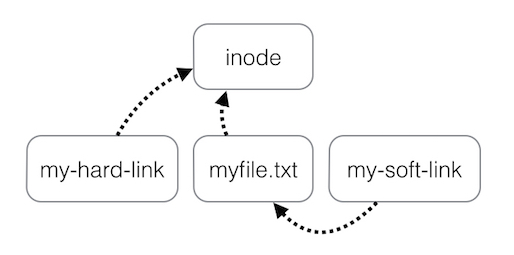

在文件系统中文件由两部分组成：数据部分（data part）和名称部分（filename part）。

## 1. 硬链接Hard Link

数据部分被称为inode，其包含文件权限、数据存储位置。

```
                               .---------------> ! data ! ! data ! etc
                              /                  +------+ !------+
        ! permbits, etc ! data addresses !
        +------------inode---------------+
```

文件名称部分包含文件名和关联的节点索引号。

```
                         .--------------> ! permbits, etc ! addresses !
                        /                 +---------inode-------------+
        ! filename ! inode # !
        +--------------------+
```

不同的文件可以关联同一个inode节点，这些文件被称为硬链接（hard link）。

## 2. 软链接Soft Link

```
        ! filename ! inode # !
        +--------------------+
                        \
                         >--------------> ! permbits, etc ! addresses !
                        /                 +---------inode-------------+
        ! othername ! inode # !
        +---------------------+
```

还有一种特殊的文件，其数据部分存储了另一个文件的路径。操作系统可以识别到数据部分是另一个文件的路径，其会将针对文件的`open`、`read`、`write`操作转发给原始文件，这种文件被称为软链接（soft link，也称为symbolic link、symlink）。

```
        ! filename ! inode # !
        +--------------------+
                        \
                         .-------> ! permbits, etc ! addresses !
                                   +---------inode-------------+
                                                      /
                                                     /
                                                    /
    .----------------------------------------------'
   ( 
    '-->  !"/path/to/some/other/file"! 
          +---------data-------------+
                  /                      }
    .~ ~ ~ ~ ~ ~ ~                       }-- (redirected at open() time)
   (                                     }
    '~~> ! filename ! inode # !
         +--------------------+
                         \
                          '------------> ! permbits, etc ! addresses !
                                         +---------inode-------------+
                                                            /
                                                           /
     .----------------------------------------------------'
    (
     '->  ! data !  ! data ! etc.
          +------+  +------+
```

## 3. 目录 Directory

多个文件名称部分被存储到了另一个特殊的文件中，这个特殊的文件称为目录（directory）。目录是包含了其它文件名称的数组。

目录创建后，初始创建两个特殊文件`.`和`..`。`.`文件的名称部分是目录文件inode。`.`是当前目录的硬链接。

`..`文件是容纳当前目录文件的inode，`..`是指向当前目录直接父级的硬链接。

## 4. 创建hard link、symbolic link

`In`命令用于创建hard link、soft link，`mkdir`命令用于创建目录。

硬链接的两个文件必须在同一个文件系统，源文件必须存在；软链接的两个文件可以位于不同的文件系统，源文件可以不存在。另一方面，软链接访问文件时会有额外的I/O，数据部分会占用额外的存储空间。即各有千秋。

首先创建一个空的目录，然后使用命令行创建一个文件：

```
$ mkdir link
$ cd link
$ ls -lia
total 0
31701336 drwxr-xr-x@ 2 ad  staff   64  5  9 22:55 .
28909795 drwxr-xr-x  5 ad  staff  160  5  9 22:55 ..
$ echo "This is a file" >basic.file
$ ls -lia
total 8
31701336 drwxr-xr-x@ 3 ad  staff   96  5  9 22:58 .
28909795 drwxr-xr-x  5 ad  staff  160  5  9 22:55 ..
31701384 -rw-r--r--@ 1 ad  staff   15  5  9 22:58 basic.file
$ cat basic.file
This is a file
```

下面创建`basic.file`文件的hardlink：

```
$ ln basic.file hardlink.file
$ ls -lia
total 16
31701336 drwxr-xr-x@ 4 ad  staff  128  5  9 23:00 .
28909795 drwxr-xr-x  5 ad  staff  160  5  9 22:55 ..
31701384 -rw-r--r--@ 2 ad  staff   15  5  9 22:58 basic.file
31701384 -rw-r--r--@ 2 ad  staff   15  5  9 22:58 hardlink.file
$ cat hardlink.file
This is a file
```

可以发现：

- hardlink.file和basic.file文件共享31701384 inode。
- hardlink.file和basic.file文件内容一样。

给basic.file文件所有用户追加写权限：

```
$ chmod a+w basic.file
$ ls -lia
total 16
31701336 drwxr-xr-x@ 4 ad  staff  128  5  9 23:00 .
28909795 drwxr-xr-x  5 ad  staff  160  5  9 22:55 ..
31701384 -rw-rw-rw-@ 2 ad  staff   15  5  9 22:58 basic.file
31701384 -rw-rw-rw-@ 2 ad  staff   15  5  9 22:58 hardlink.file
```

可以看到hardlink.file的权限也发生了变化。basic.file和hardlink.file共享相同的inode和数据，有不同的名称。

下面创建一个softlink：

```
$ ln -s basic.file softlink.file
$ ls -lia
total 16
31701336 drwxr-xr-x@ 5 ad  staff  160  5  9 23:13 .
28909795 drwxr-xr-x  5 ad  staff  160  5  9 22:55 ..
31701384 -rw-rw-rw-@ 2 ad  staff   15  5  9 22:58 basic.file
31701384 -rw-rw-rw-@ 2 ad  staff   15  5  9 22:58 hardlink.file
31701701 lrwxr-xr-x@ 1 ad  staff   10  5  9 23:13 softlink.file -> basic.file
$ cat softlink.file
This is a file
```

尽管softlink.file文件与basic.file文件内容一样，但inode不同，也没有继承相同文件权限。

如果删除basic.file：

```
$ rm basic.file
$ ls -lia
total 8
31701336 drwxr-xr-x@ 4 ad  staff  128  5  9 23:24 .
28909795 drwxr-xr-x  5 ad  staff  160  5  9 22:55 ..
31701384 -rw-rw-rw-@ 1 ad  staff   15  5  9 22:58 hardlink.file
31701701 lrwxr-xr-x@ 1 ad  staff   10  5  9 23:13 softlink.file -> basic.file
$ cat softlink.file
cat: softlink.file: No such file or directory
$ cat hardlink.file
This is a file
```

删除文件后就无法访问softlink.file的内容，但可以继续访问hardlink.file文件内容。

删除原始文件后，hardlink.file内容不会消失；删除softlink后，原始文件也不会消失。

## 5. hardlink的进一步说明

当删除文件时，文件的数据部分并不会立即删除，直到所有指向该inode的文件名都被删除后才会删除。inode中有引用计数，标记指向当前inode的filename数量。删除一个指向该inode的filename，计数减一。当计数为零时，删除inode和关联的数据。

同时，计数也标记了文件被打开但未关闭的次数。文件打开后不关闭会有一些初期不明显的影响，此时仍然可以删除filename，但数据部分占用的空间不会被释放。

例如，`var/log/messages`占用的空间越来越大时，可以使用如下命令删除日志文件，释放占用磁盘：

```
$ rm /var/log/messages
$ touch /var/log/messages
```

删除后可用空间并没有恢复。这是因为虽然删除了filename部分，但仍有进程在读取文件数据，操作系统不会删除数据，直到进程close文件。为了彻底删除文件占用空间，可以使用下面命令结束`syslogd.pid`进程访问的的文件，并重新打开：

```
$ kill -SIGHUP 'cat /var/run/syslogd.pid'
```

参考资料：

1. [The difference between hard and soft links](https://linuxgazette.net/105/pitcher.html)
2. [What is the difference between a symbolic link and a hard link?](https://stackoverflow.com/questions/185899/what-is-the-difference-between-a-symbolic-link-and-a-hard-link)

