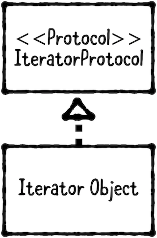

迭代器模式（Iterator Pattern）属于行为型模式。Iterator pattern 提供了循环集合的标准方法。

Iterator pattern 包含以下两部分：



1. IteratorProtocol：Swift 中的`IterableProtocol`协议定义了一个可以使用 for in 循环迭代的类型。
2. Iterator Object：想要进行迭代的对象。一般，Iterator object 不直接遵守`IteratorProtocol`协议，而是遵守`Sequence`协议。`Sequence`协议遵守`IteratorProtocol`协议。通过遵守`Sequence`协议可以直接获得许多高级函数，例如，`map`、`filter`等。

> 如果你对该协议不了解，可以查看[IterableProtocol](https://developer.apple.com/documentation/swift/iteratorprotocol)、[Sequence](https://developer.apple.com/documentation/swift/sequence)文档。

在这篇文章中，将创建自定义 struct。该对象遵守`Sequence`协议，并使用`Sequence`协议中方法进行排序。

## 何时使用 Iterator Pattern

当拥有一组有序对象的类或结构，并且希望使用 for in 循环使其可迭代时，请使用迭代器模式。

## 示例

这篇文章将会创建 Queue 对象。Queue 是一个列表，只能从尾部插入对象，从头部移除对象。这样可以确保第一个入队的对象也是第一个出队的对象，先进先出（first come, first serve）。

创建`Queue.swift`文件，并添加以下代码：

```
import Foundation

public struct Queue<T> {
    // 数组元素可以为任意类型。
    private var array: [T?] = []
    
    // Queue 的头部是数组第一个元素
    private var head = 0
    
    // 确认数组是否为空
    public var isEmpty: Bool {
        return count == 0
    }
    
    // Queue 内对象数量
    public var count: Int {
        return array.count - head
    }
    
    // 添加对象到 Queue
    public mutating func enqueue(_ element: T) {
        array.append(element)
    }
    
    // 从 Queue 队列移除对象
    public mutating func dequeue() -> T? {
        guard head < array.count,
            let element = array[head] else {
                return nil
        }
        
        array[head] = nil
        head += 1
        
        let percentage = Double(head)/Double(array.count)
        
        if array.count > 50,
            percentage > 0.25 {
            array.removeFirst(head)
            head = 0
        }
        
        return element
    }
}
```

在上述代码中，`enqueue()`方法用于添加对象到 Queue；`dequeue()`方法用于从 Queue 队列移除对象。

创建`Ticket.swift`文件，并添加以下代码：

```
import Foundation

public struct Ticket {
    var description: String
    var priority: PriorityType
    
    enum PriorityType {
        case low
        case medium
        case high
    }
    
    init(description: String, priority: PriorityType) {
        self.description = description
        self.priority = priority
    }
}
```

进入`ViewController.swift`文件，在`viewDidLoad()`方法内添加以下代码：

```
    override func viewDidLoad() {
        super.viewDidLoad()
        // Do any additional setup after loading the view.
        
        // 初始化 Queue 对象，并添加四个对象。
        var queue = Queue<Ticket>()
        queue.enqueue(Ticket(description: "Wireframe Tinder for dogs app", priority: .low))
        queue.enqueue(Ticket(description: "Set up 4k monitor for Josh", priority: .medium))
        queue.enqueue(Ticket(description: "There is smoke coming out of my laptop", priority: .high))
        queue.enqueue(Ticket(description: "Put googly eyes on the Roomba", priority: .low))
        
        // 可以看到 dequeue 的是第一个添加的对象
        let element = queue.dequeue()
        print((element?.description ?? "No Description") + "\n")
    }
```

在实际应用中，肯定希望能够按照优先级对 Ticket 进行排序。根据现在的情况，只能编写多个 if 语句进行排序。使用 Swift 内置的排序函数能够节省大量时间。

如果现在尝试使用 for in 、`sorted()`进行排序，编译器会报错。因为使用这些方法前需要先遵守`Sequence`协议。为`Queue`添加以下 extension：

```
extension Queue: Sequence {
    public func makeIterator() -> IndexingIterator<ArraySlice<T?>> {
        // 只枚举非空对象
        let nonEmptyValues = array[head ..< array.count]
        return nonEmptyValues.makeIterator()
    }
}
```

遵守`Sequence`协议时，有两点需要注意：

- 第一点为关联类型（associated type），也就是迭代器（Iterator）。在上述代码中，associated type 为`IndexingIterator`。如果集合没有声明自定义迭代器，则默认使用`IndexingIterator`。
- 第二点为`Iterator`协议，其为`makeIterator`函数不可缺少的。`Iterator`协议为 class 、struct 构造迭代器。

在`ViewController.swift`文件中`viewDidLoad()`方法内添加以下代码：

```
    override func viewDidLoad() {
        ...
        
        // 枚举 queue 并输出
        print("List of Tickets in queue:")
        for ticket in queue {
            print(ticket?.description ?? "No Description")
        }
    }
```

输出如下：

```
List of Tickets in queue:
Set up 4k monitor for Josh
There is smoke coming out of my laptop
Put googly eyes on the Roomba
```

在使用排序函数前，为`Ticket`添加以下 extension：

```
extension Ticket {
    var sortIndex: Int {
        switch self.priority {
        case .low:
            return 0
        case .medium:
            return 1
        case .high:
            return 2
        }
    }
}
```

为优先级设置数字能够简化排序，排序时将使用`sortIndex`做为依据。在`ViewController.swift`文件中`viewDidLoad()`方法内添加以下代码：

```
    override func viewDidLoad() {
        ...
        
        // 进行排序
        let sortedTickets = queue.sorted {
            $0!.sortIndex > ($1?.sortIndex)!
        }
        
        // 循环 sortedTickets 数组，将元素添加到 sortedQueue
        var sortedQueue = Queue<Ticket>()
        for ticket in sortedTickets {
            sortedQueue.enqueue(ticket!)
        }
        
        // 输出 sotedQueue 内对象，可以看到 first in, firt out。
        print("\n")
        print("Tickets sorted by priority:")
        for ticket in sortedQueue {
            print(ticket?.description ?? "No Description")
        }
```

如此轻松地对集合进行排序是一项强大的功能。随着集合变大，排序功能将变得更有价值。

## 总结

通过遵守`IteratorProtocol`协议，可以自定义迭代对象的方式。例如，可以只实现一个`next()`方法，在该方法内返回迭代中的下一个对象。通常，极少需要直接遵守`IteratorProtocol`协议。即使需要自定义迭代器，遵守`Sequence`协议也是一个更好的选择。

以下是 Iterator Pattern 的关键点：

- Iterator pattern 提供了使用 for in 语法循环遍历集合的标准方法。
- 自定义对象最好遵守`Sequence`协议，而非直接遵守`IteratorProtocol`协议。
- 通过遵守`Sequence`协议，能够直接获得更为高级的功能（如map、filter等）。

Demo名称：IteratorPattern  
源码地址：<https://github.com/pro648/BasicDemos-iOS/tree/master/IteratorPattern>

参考资料：

1. [Design Patterns in Swift: Iterator Pattern](https://agostini.tech/2018/06/10/design-patterns-in-swift-iterator-pattern/)
2. [Iterator pattern](https://en.wikipedia.org/wiki/Iterator_pattern)
3. [IteratorProtocol](https://developer.apple.com/documentation/swift/iteratorprotocol)
4. [Sequence](https://developer.apple.com/documentation/swift/sequence)

