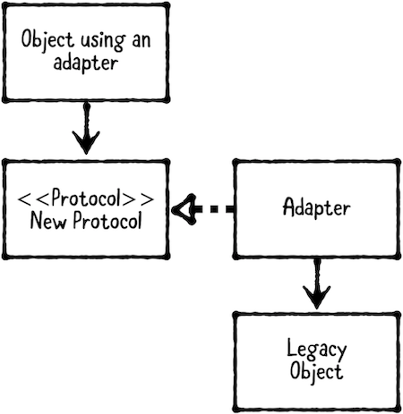

适配器模式（Adapter Pattern）属于行为型模式（Behavioral Pattern），适配器模式也称为包装（Wrapper）。Adapter pattern 将类接口转换为客户端期望的其他类型接口，让接口不兼容的类一起工作。此模式可以帮助重新利用已有的类。

Adapter pattern 涉及以下四个组成部分：



1. Object using an adapter：使用适配器的对象，即依赖新协议的对象。
2. New protocol：需要使用的协议。
3. Legacy object：声明协议前已经存在，无法直接修改该对象接口。
4. Adapter：遵守 New protocol，并将调用传递给 legacy object。

iPhone 7 、 iPhone 7 Plus 及更新版本没有3.5mm耳机插孔，如果想要将3.5mm耳机插入闪电端口，则需要一个一端为3.5mm插孔，一端为lighting插孔的适配器。

## 何时使用 Adapter Pattern

有些类、模块和函数不能被修改，特别是当其来自于第三方库。此时，可以使用 adapter design pattern 适配这些对象。

## 示例

在这一示例中，将适配第三方授权登录，以使其与 app 自身登录服务一起工作。添加以下代码：

```
import Foundation

public class GoogleAuthenticator {
    public func login( email: String,
                       password: String,
                       completion: @escaping (GoogleUser?, Error?) -> Void) {
        // Make networking calls, which return a 'Token'
        let token = "special-token-value"
        let user = GoogleUser(email: email,
                              password: password,
                              token: token)
        completion(user, nil)
    }
}

public struct GoogleUser {
    public var email: String
    public var password: String
    public var token: String
}
```

这里的`GoogleAuthenticator`和`GoogleUser`是第三方的授权登录服务，因此不能修改。实际中的 Google 授权登录会很复杂，这里只是示例。

Google 的授权登录函数返回的字符串作为 token，在后续的 GET 请求中作为 token 传递：

```
https://api.examplegoogleurl.com/items/item123?token=special-token-value
```

下面声明 authentication protocol：

```
import Foundation

public protocol AuthenticationService {
    func login(email: String,
               password: String,
               success:@escaping (User, Token) -> Void,
               failure:@escaping (Error?) -> Void)
}

public struct User {
    public let email: String
    public let password: String
}

public struct Token {
    public let value: String
}
```

该协议需要传递 email、password，成功后返回`User`和`Token`，如果失败，则返回`Error`。

App 使用该协议，而非直接依赖`GoogleAuthenticator`。在 app 支持多种授权登录时，根据用户选择统一调用该协议即可。

适配器有以下两种创建方式：

- 为`GoogleAuthenticator`添加扩展，以遵守`AuthenticationService`协议。
- 创建一个遵守`AuthenticationService`协议的类。

下面使用第二种方式创建适配器：

```
import Foundation

public class GoogleAuthenticatorAdapter: AuthenticationService {
    private var authenticator = GoogleAuthenticator()
    
    public func login(email: String, password: String, success: @escaping (User, Token) -> Void, failure: @escaping (Error?) -> Void) {
        authenticator.login(email: email, password: password) { (googleUser, error) in
            guard let googleUser = googleUser else {
                failure(error)
                return
            }
            
            let user = User(email: googleUser.email, password: googleUser.password)
            let token = Token(value: googleUser.token)
            success(user, token)
        }
    }
}
```

在上述代码中，创建了`GoogleAuthenticatorAdapter`类，其遵守`AuthenticationService`协议，其封装了 token 以便可以在其他类中使用。实现了必须实现的`login(email:password:success:failure)`方法，在该方法内调用 Google 授权登录服务，并通过返回的`GoogleUser`创建`User`和`Token`。

这样封装 token 的好处在于如果 Google 更改了其授权信息结构，只需要在适配器修改即可让 app 恢复工作。

添加以下代码，查看效果：

```
        let authService: AuthenticationService = GoogleAuthenticatorAdapter()
        
        authService.login(email: "user@example.com", password: "password", success: { (user, token) in
            print("Auth succeeded: \(user.email), \(token.value)")
        }) { (error) in
            
            if let error = error {
                print("Auth failed with error: \(error)")
            } else {
                print("Auth failed with error: no error provided")
            }
        }
```

在上述代码中，显式声明`authService`对象为`AuthenticationService`类型，并赋值为`GoogleAuthenticatorAdapter`实例。调用`AuthenticationService`协议中`login(email:success:failure)`方法申请授权。授权成功时，输出email、token；授权失败时，输出错误。

控制台输出如下：

```
Auth succeeded: user@example.com, special-token-value
```

> 如果 app 支持 WeChat、QQ等登录方式，可以轻松适配支持。

协议对于 adapter design pattern 是不可缺的。Protocol 可以确保已经存在的接口按照期望方式工作。直接可以协同工作的类总是优先选择的，但总会出现需要使用适配器的情况。

## 总结

以下是 adapter design pattern 的关键点：

- 在使用无法修改的第三方库时，适配器模式非常有效。可以通过协议让第三方库中方法与工程中自定义类一起工作。
- 既可以通过扩展 legacy object，也可以通过创建新的 adapter class 使用 adapter。
- 适配器模式允许复用已有类，即使其缺少必须的组件，或具有与所需对象不兼容的组件。

在「时间简史」中，史蒂夫霍金说「Intelligence is the ability to adapt to change」，霍金虽然没有在谈论适配器模式，但这种想法是设计模式的一个重要组成部分，即未雨绸缪。

Demo名称：AdapterPattern   
源码地址：https://github.com/pro648/BasicDemos-iOS/tree/master/AdapterPattern

参考资料：

1. [Adapter pattern in Swift 4](https://medium.com/@iamcrypticcoder/adapter-pattern-in-swift-4-d7ee2e71667c)
2. [Adapter pattern](https://en.wikipedia.org/wiki/Adapter_pattern)