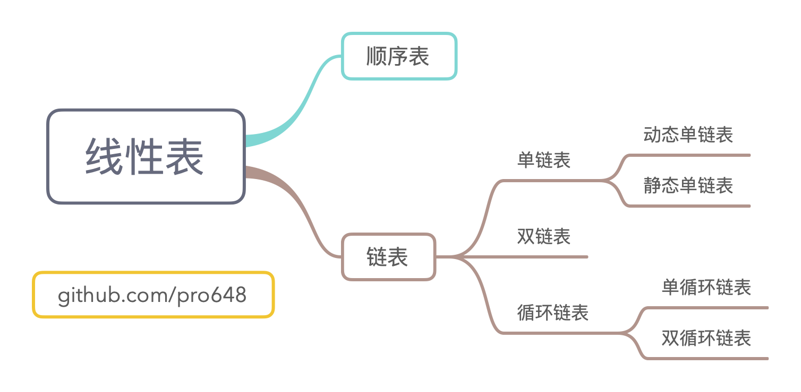
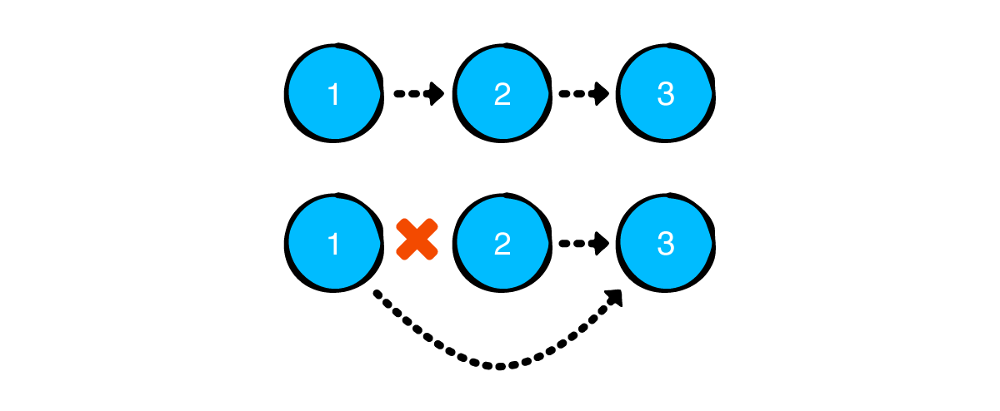
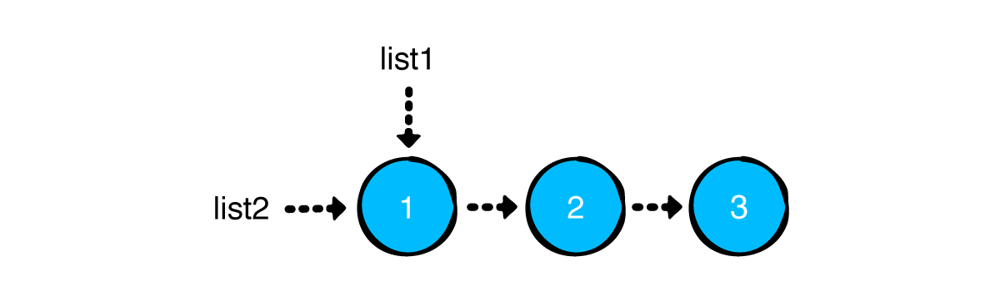
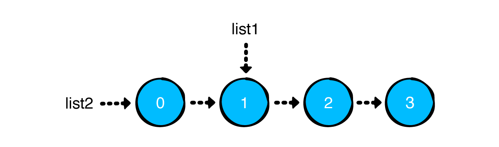
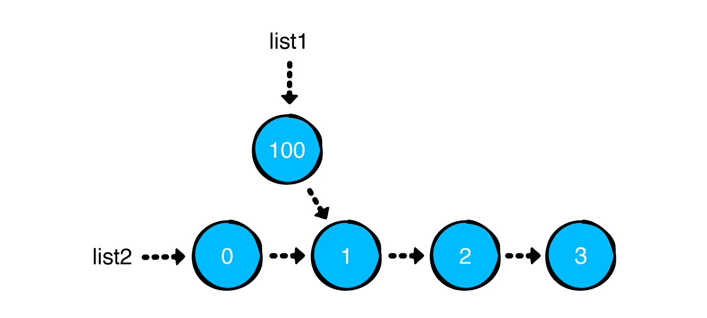
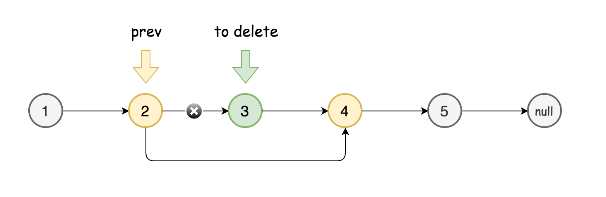
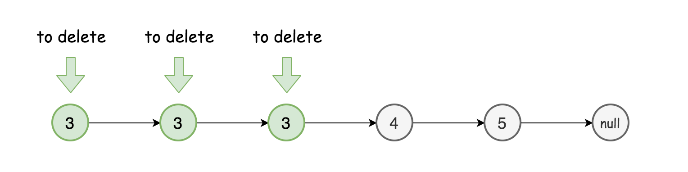

链表（Linked list）是一种常见的基础数据结构，是一种线性表，但并不会按线性的顺序存储数据，而是在一个节点里存储下一个节点的指针。由于无需顺序存储，链表在插入时复杂度可以达到`O(1)`，比顺序表快很多，但是查找一个节点或访问特定编号的节点需`O(n)`的时间，而顺序表相应的时间复杂度分别是`O(logn)`和`O(1)`。

与需在内存中连续存储的线性表（如数组）相比，链表有以下优势：

- 对链表头节点进行添加、移除操作，所需时间为常数。
- 性能稳定。


如上图所示，链表是一个节点链。节点有以下两个用途：

- 保存值。
- 保存下一个节点的指针。

这篇文章将介绍链表的基本特征，手动实现一个链表及其常见操作，并实现 Swift 中的写时拷贝（copy-on-write）技术。最后，还会介绍几道常见的链表算法题。

## 1. 链表分类



线性表（linear list）可以分为顺序表和链表。

顺序表是在计算机内存中以数组的形式保存的线性表，是指用一组地址连续的存储单元依次存储数据元素的线性结构。顺序表和链表有以下几点区别：

- 空间开辟方式：顺序表在存储数据之前开辟足够空间，后期无法改变大小（动态数组除外），链表一次只开辟存储一个节点的内存空间。一次开辟大量空间比多次开辟小量空间性能好。
- 空间利用率：链表每次申请一个节点的空间，且位置随机。这种申请存储空间的方式会有很多空间碎片，一定程度上造成了空间浪费。此外，链表每个节点至少需携带一个指针，增加了空间占用。因此，顺序表空间利用率比链表高。
- 时间复杂度：顺序表可以使用下标直接访问元素，它的时间复杂度为`O(1)`，链表需从头开始，依次遍历，时间复杂度为`O(n)`。顺序表中插入、删除、移动元素，可能涉及大量元素的整体移动，时间复杂度为`O(n)`，链表插入、删除、移动元素，只需改变指针指向，时间复杂度为`O(1)`。

链表可以分为以下几类：

- 单向链表（singly linked list）：是链表中最简单的，它包含两个域，一个信息域和一个指针域，指针指向链表中的下一个节点，最后一个节点的指针指向一个空值。

  

  - 静态单向链表：用数组描述的单向链表，称为静态单向链表。它的内存地址是连续的，需预先分配大小。
  - 动态单向链表：用申请内存的函数动态申请内存，链表长度没有限制，节点内存地址不是连续的，需通过指针来顺序访问。

- 双向链表（doubly linked list）：每个节点有两个连接，一个指向前一节点，另一个指向后一节点。首、尾节点对应的前、后连接指向空值或空列表。

  

- 循环链表（circular linked list）：首节点、尾节点连接在一起。循环链表第一个节点之前就是最后一个节点；反之亦然。

  
  
  - 单向循环链表：它的最后一个节点指针不是 NULL，而改为指向头节点，从而整个链表形成一个环。
  - 双向循环链表：由单向循环链表可以推断出双向循环链表，它的头节点还会指向尾节点。

这篇文章只介绍单向链表。

## 2. 节点 Node

创建 Node.swift 文件，添加以下代码：

```
public class Node<Value> {
    public var value: Value
    public var next: Node?
    
    public init(value: Value, next: Node? = nil) {
        self.value = value
        self.next = next
    }
}

extension Node: CustomStringConvertible {
    public var description: String {
        guard let next = next else { return "\(value)" }
        return "\(value) -> " + String(describing: next) + " "
    }
}
```

在 playground page 添加以下代码：

```
example(of: "creating and linking nodes") {
    let node1 = Node(value: 1)
    let node2 = Node(value: 2)
    let node3 = Node(value: 3)
    
    node1.next = node2
    node2.next = node3
    
    print(node1)
}
```

上述代码创建了三个 node，并链接起来。


控制台输出如下：

```
--- Example of creating and linking nodes ---
1 -> 2 -> 3  
```

使用上述方式创建链表会很麻烦，后续会通过 LinkedList 管理 node。

## 3. 创建链表 LinkedList

创建 LinkedList.swift 文件，并添加以下代码：

```
public struct LinkedList<Value> {
    public var head: Node<Value>?
    public var tail: Node<Value>?
    
    public init() { }
    
    public var isEmpty: Bool {
        head == nil
    }
}

extension LinkedList: CustomStringConvertible {
    public var description: String {
        guard let head = head else { return "Empty list" }
        return String(describing: head)
    }
}
```

Linked list 有头、尾概念，指向链表的第一个和最后一个节点。


## 4. 向链表添加节点

后续会逐步为链表提供管理 node 的接口。先提供添加节点的功能。有以下三种添加节点的方式：

- push：向链表头部添加节点。
- append：向链表尾部添加节点。
- insert(after:)：向指定节点后添加节点。

下面会依次实现上述接口，并分析其性能。

#### 4.1 push 操作

向链表头部添加节点被称为 push 操作。它的实现非常简单：

```
    public mutating func push(_ value: Value) {
        head = Node(value: value, next: head)
        if tail == nil {
            tail = head
        }
    }
```

当向空链表 push 时，新添加的 node 既是 head，也是 tail。

在 playground page 添加以下代码：

```
example(of: "push") {
    var list = LinkedList<Int>()
    list.push(3)
    list.push(2)
    list.push(1)
    
    print(list)
}
```

控制台输出如下：

```
--- Example of push ---
1 -> 2 -> 3  
```

#### 4.2 append 操作

append 是向链表尾部添加节点。

在 LinkedList.swift 文件的`push(value:)`方法下面添加以下代码：

```
    public mutating func append(_ value: Value) {
        guard !isEmpty else {
            push(value)
            return
        }
        
        tail!.next = Node(value: value)
        tail = tail!.next
    }
```

当链表为空时，直接使用 push 添加，这样可以自动处理 head、tail；不为空时，在尾部添加一个 node，并将其设置为 tail。

在 playground page 添加以下代码：

```
example(of: "append") {
    var list = LinkedList<Int>()
    list.append(1)
    list.append(2)
    list.append(3)
    
    print(list)
}
```

输出如下：

```
--- Example of append ---
1 -> 2 -> 3 
```

#### 4.3 insert(after:) 操作

`insert(after:)`向指定位置插入 node，它需要两步操作：

1. 查找到指定 node。
2. 插入 node。

首先，实现查找指定 index 位置 node：

```
    public func node(at index: Int) -> Node<Value>? {
        var currentNode = head
        var currentIndex = 0
        
        while currentNode != nil && currentIndex < index {
            currentNode = currentNode!.next
            currentIndex += 1
        }
        
        return currentNode
    }
```

`node(at:)`函数根据 index 提取 node。由于单向链表只能从 head 开始查找，必须迭代遍历链表。

其次，插入 node：

```
    @discardableResult
    public mutating func insert(_ value: Value, after node: Node<Value>) -> Node<Value> {
        guard tail !== node else {
            append(value)
            return tail!
        }
        
        node.next = Node(value: value, next: node.next)
        return node.next!
    }
```

当要插入的 node 是 tail 时，直接调用 append；否则，将新节点插入到指定位置。

在 playground page 添加以下代码：

```
example(of: "inserting at a particular index") {
    var list = LinkedList<Int>()
    list.push(3)
    list.push(2)
    list.push(1)
    
    print("Before inserting: \(list)")
    var middleNode = list.node(at: 1)!
    for _ in 1...4 {
        middleNode = list.insert(-1, after: middleNode)
    }
    print("After inserting: \(list)")
}
```

控制台输出如下：

```
--- Example of inserting at a particular index ---
Before inserting: 1 -> 2 -> 3  
After inserting: 1 -> 2 -> -1 -> -1 -> -1 -> -1 -> 3  
```

#### 4.4 时间复杂度

目前，已经实现了三种添加 node、一种查找指定 index 的 node 方法。下面是其时间复杂度：

|            | push(value:) | append(value:) | insert(after:)     | node(at:)           |
| ---------- | ------------ | -------------- | ------------------ | ------------------- |
| 用途       | 向头部添加   | 向尾部拼接     | 向指定 node 后添加 | 返回指定index处node |
| 时间复杂度 | O(1)         | O(1)           | O(1)               | O(n)，n 是 index。  |

## 5. 移除链表的节点

移除链表节点主要有以下三种操作：

- pop：移除头部节点。
- removeLast：移除尾部节点。
- remove(at:)：移除任意位置节点。

#### 5.1 pop 操作

移除头部节点常称为 pop。pop 与 push 一样简单。

在 LinkedList 添加以下代码：

```
    @discardableResult
    public mutating func pop() -> Value? {
        defer {
            head = head?.next
            if isEmpty {
                tail = nil
            }
        }
        return head?.value
    }
```

pop 会返回被移除的节点。由于链表可能是空的，返回值为可选类型。通过将 head 向后移动一步，可以将 head 移除。方法执行完毕后，ARC 会自动将原来 head 占用的内存释放掉。如果移除后链表变为空了，则 tail 设置为 nil。

在 playground page 添加以下代码：

```
example(of: "pop") {
    var list = LinkedList<Int>()
    list.push(3)
    list.push(2)
    list.push(1)
    
    print("Before popping list: \(list)")
    let poppedValue = list.pop()
    print("After popping list: \(list)")
    print("Popped value: " + String(describing: poppedValue))
}
```

控制台输出如下：

```
--- Example of pop ---
Before popping list: 1 -> 2 -> 3  
After popping list: 2 -> 3 
Popped value: Optional(1)
```

#### 5.2 removeLast 操作

虽然有指向 tail 的指针，但单向链表只能从 head 向 tail 方向查找，后一个节点并没有指向上一个节点的指针。因此，必须遍历整个链表。

在 LinkedList.swift 添加以下代码：

```
    @discardableResult
    public mutating func removeLast() -> Value? {
        // 如果 head 是nil，则没有可供移除的，直接返回nil。
        guard let head = head else { return nil }
        
        // 如果链表只有一个节点，则removeLast等于pop。pop会自动更新head、tail
        guard head.next != nil else {
            return pop()
        }
        
        // 查找current.next，直到为nil。即current为最后一个。
        var prev = head
        var current = head
        while let next = current.next {
            prev = current
            current = next
        }
        
        // current 是最后一个node，使用 prev 断开链表，更新 tail。
        prev.next = nil
        tail = prev
        return current.value
    }
```

打开 playground page，添加以下代码：

```
example(of: "removing the last node") {
    var list = LinkedList<Int>()
    list.push(3)
    list.push(2)
    list.push(1)
    
    print("Before removing last node: \(list)")
    let removedValue = list.removeLast()
    
    print("After removing last node: \(list)")
    print("Removed value: " + String(describing: removedValue))
}
```

控制台输出如下：

```
--- Example of removing the last node ---
Before removing last node: 1 -> 2 -> 3  
After removing last node: 1 -> 2 
Removed value: Optional(3)
```

移除最后一个节点需遍历整个链表，它的时间复杂度为`O(n)`。

#### 5.3 remove(after:) 操作

`remove(after:)`与`insert(after:)`有些相似，都是先找到指定 node，再进行操作。



在 LinkedList.swift 文件添加以下代码：

```
    @discardableResult
    public mutating func remove(after node: Node<Value>) -> Value? {
        defer { // unlinking 操作在 defer 里执行。
            if node.next === tail { // 如果 node.next 是 tail，更新 tail。
                tail = node
            }
            node.next = node.next?.next
        }
        return node.next?.value
    }
```

打开 playground page，添加以下代码：

```
example(of: "removing a node after a particular node") {
    var list = LinkedList<Int>()
    list.push(3)
    list.push(2)
    list.push(1)
    
    print("Before removing at particular index: \(list)")
    let index = 1
    let node = list.node(at: index - 1)!
    let removedValue = list.remove(after: node)
    
    print("After removing at index \(index): \(list)")
    print("Removed value: " + String(describing: removedValue))
}
```

控制台输出如下：

```
--- Example of removing a node after a particular node ---
Before removing at particular index: 1 -> 2 -> 3  
After removing at index 1: 1 -> 3 
Removed value: Optional(2)
```

`remove(after:)`操作时间复杂度是`O(1)`，与`insert(after:)`类似。

#### 5.4 时间复杂度

目前，已经实现了三种移除 node 的方法。下面是其时间复杂度：

|            | pop()        | removeLast() | remove(after:)     |
| ---------- | ------------ | ------------ | ------------------ |
| 用途       | 移除头部节点 | 移除尾部节点 | 移除指定节点后节点 |
| 时间复杂度 | O(1)         | O(n)         | O(1)               |

## 6 值语义和写时拷贝

在 Swift 中，值类型存放在[栈区](https://github.com/pro648/tips/blob/master/sources/%E6%A0%88%20Stack.md)，引用类型存放在堆区，但有些值类型（如字符串、数组），会间接将值保存在堆中，因此，它们是由引用类型支持的值类型。

Swift 中，值类型的拷贝是[深拷贝](https://github.com/pro648/tips/blob/master/sources/%E6%B7%B1%E5%A4%8D%E5%88%B6%E3%80%81%E6%B5%85%E5%A4%8D%E5%88%B6%E3%80%81copy%E3%80%81mutableCopy.md)（deep copy），值语义（value semantics）的新对象和原对象是独立的，当改变新对象的属性，原对象不受影响；反之同理。

引用类型的赋值是浅拷贝（shallow copy），引用语义（reference semantics）的新对象和原对象变量名虽然不同，但其引用是相同的，即指向相同的内存空间。因此，当操作新对象内部数据时，原对象的内部数据也会同步更新，其本质上是两个指针指向同一份数据。

Swift 中的集合是值语义（value semantics），通过写时拷贝（copy-on-write，简称为 COW）技术实现。

在 playground page 添加以下代码：

```
example(of: "array cow") {
    let array1 = [1, 2]
    var array2 = array1
    
    print("array1: \(array1)")
    print("array2: \(array2)")
    
    print("--- After adding 3 to array 2 ---")
    array2.append(3)
    print("array1: \(array1)")
    print("array2: \(array2)")
}
```

执行后输出如下：

```
--- Example of array cow ---
array1: [1, 2]
array2: [1, 2]
--- After adding 3 to array 2 ---
array1: [1, 2]
array2: [1, 2, 3]
```

当向 array2 添加元素时，array1 的元素并未发生变化。这是因为 array2 调用 append 时复制了一份 array1 的数据。


那之前创建的 LinkedList 是否是值语义呢？在 playground page 添加以下代码：

```
example(of: "linked list cow") {
    var list1 = LinkedList<Int>()
    list1.append(1)
    list1.append(2)
    var list2 = list1
    print("List1: \(list1)")
    print("List2: \(list2)")
    
    print("After appending 3 to list2")
    list2.append(3)
    print("List1: \(list1)")
    print("List2: \(list2)")
}
```

执行后控制台输出如下：

```
--- Example of linked list cow ---
List1: 1 -> 2 
List2: 1 -> 2 
After appending 3 to list2
List1: 1 -> 2 -> 3  
List2: 1 -> 2 -> 3  
```

可见 LinkedList 不是值语义，这是因为链表底层存储使用了引用类型。LinkedList 是结构体，应使用值语义，但目前却是引用语义，使用 COW 可以解决这一问题。

使用 COW 实现值语义的策略很简单，就是在改变链表内容前，将链表的存储复制一份，并更新 head、tail。

在 LinkedList.swift 文件中添加以下代码：

```
    private mutating func copyNodes() {
        guard var oldNode = head else {
            return
        }
        
        head = Node(value: oldNode.value)
        var newNode = head
        
        while let nextOldNode = oldNode.next {
            newNode!.next = Node(value: nextOldNode.value)
            newNode = newNode!.next
            
            oldNode = nextOldNode
        }
        
        tail = newNode
    }
```

`copyNodes()`方法会使用新初始化的 node 替换原来 node，组建链表。

为 LinkedList 中使用了 mutating 关键字的方法添加`copyNodes()`调用。共以下六个方法：

- push
- append
- insert(after:)
- pop
- removeLast
- remove(after:)

更新后其会变成值语义，再次执行控制台输出如下：

```
--- Example of linked list cow ---
List1: 1 -> 2 
List2: 1 -> 2 
After appending 3 to list2
List1: 1 -> 2 
List2: 1 -> 2 -> 3  
```

但每次调用`copyNodes()`都会产生`O(n)`时间复杂度的开销，下面会提供进一步的优化方案。

## 7. 优化 COW

有两种方案解决每个 mutating 都会产生`O(n)`开销的问题：

- 只有当大于一个指针指向链表时，才进行复制。
- 共用部分 node，只复制不同部分。

#### 7.1 isKnownUniquelyReferenced

Swift 中的`isKnownUniquelyReferenced`可以查看对象是否只引用了一次，更新复制 LinkedList 代码如下：

```
example(of: "linked list cow") {
    var list1 = LinkedList<Int>()
    list1.append(1)
    list1.append(2)
//    var list2 = list1
    
    // 使用isKnownUniquelyReferenced更新
    print("List1 uniquely referenced: \(isKnownUniquelyReferenced(&list1.head))")
    var list2 = list1
    print("List1 uniquely referenced: \(isKnownUniquelyReferenced(&list1.head))")
    
    print("List1: \(list1)")
    print("List2: \(list2)")
    
    print("After appending 3 to list2")
    list2.append(3)
    print("List1: \(list1)")
    print("List2: \(list2)")
}
```

执行后控制台输出如下：

```
List1 uniquely referenced: true
List1 uniquely referenced: false
```

`isKnownUniquelyReferenced`可以查看对象是否只引用了一次，在`copyNode()`方法开始位置添加以下代码：

```
        // 如果只引用了一次，不要进行复制，
        guard !isKnownUniquelyReferenced(&head) else {
            return
        }
```

更新后，只有存在多个引用时，才会进行复制。

#### 7.2 共享节点

第二种优化方案是共享节点，并不是有多个引用就一定需要复制，共享节点在一定程度上可以避免复制。

请看下面的示例：

```
    var list1 = LinkedList<Int>()
    (1...3).forEach({ list1.append($0) })
    var list2 = list1
```



禁用 cow 后执行以下操作：

```
    list2.push(0)
```



list2 的 push 操作并不会影响 list1，打印 list1、list2：

```
--- Example of sharing nodes ---
List1: 1 -> 2 -> 3  
List2: 0 -> 1 -> 2 -> 3   
```

list1 push 操作也不会影响 list2：

```
    list1.push(100)
```



单向链表头部插入可以避免 COW 的开销。

#### 7.3 开启 COW 时移除节点会产生错误

使用以下代码，查看开启 cow 后移除节点：

```
example(of: "cow remove") {
    var list1 = LinkedList<Int>()
    list1.append(1)
    list1.append(2)
    list1.append(3)
    var list2 = list1
    
    if let node = list2.node(at: 0) {
        list2.remove(after: node)
    }
    print("List1: \(list1)")
    print("List2: \(list2)"）
}
```

执行后控制台输出如下：

```
--- Example of cow remove ---
List1: 1 -> 3 
List2: 1 -> 2 -> 3  
```

可以看到 remove 操作从错误的链表移除了对象。这是因为每个 mutating 操作都会触发复制，`remove(after:)`移除的是复制前的链表。

下面增加一个返回复制后节点方法：

```
    /// 返回复制后的node，用于移除操作。
    private mutating func copyNodes(returningCopyOf node: Node<Value>?) -> Node<Value>? {
        guard !isKnownUniquelyReferenced(&head) else {
            return nil
        }
        guard var oldNode = head else {
            return nil
        }
        
        head = Node(value: oldNode.value)
        var newNode = head
        var nodeCopy: Node<Value>?
        
        while let nextOldNode = oldNode.next {
            if oldNode === node {
                nodeCopy = newNode
            }
            
            newNode!.next = Node(value: nextOldNode.value)
            newNode = newNode!.next
            oldNode = nextOldNode
        }
        
        return nodeCopy
    }
```

`copyNode(node:)`与之前的`copyNode()`有很多相似之处，只是它返回复制后的 node。更新`remve(after:)`如下：

```
    @discardableResult
    public mutating func remove(after node: Node<Value>) -> Value? {
        // 开启 cow 后，使用复制后的node移除不会产生问题。
        guard let node = copyNodes(returningCopyOf: node) else { return nil}
        
        defer { // unlinking 操作在 defer 里执行。
            if node.next === tail { // 如果 node.next 是 tail，更新 tail。
                tail = node
            }
            node.next = node.next?.next
        }
        return node.next?.value
    }
```

目前，移除操作工作正常。

## 8. 链表相关算法题

这一部分介绍五道链表算法题。

#### 8.1 逆序打印链表节点

输入一个链表，从尾到头反归来打印每个节点的值：

```
输入：1->2->3->NULL
打印：3->2->1->NULL
```

使用递归可以很好解决逆序打印问题。递归可以构建[调用堆栈](https://github.com/pro648/tips/blob/master/sources/%E6%A0%88%20Stack.md#2-%E4%BB%A3%E7%A0%81%E8%B0%83%E7%94%A8%E6%A0%88)，只需在调用堆栈展开时调用 print 语句即可。

代码如下：

```
func printInReverse<T>(_ list: LinkedList<T>) {
    printInReverse(list.head)
}

private func printInReverse<T>(_ node: Node<T>?) {
    // node 为nil时，已经递归到了 tail。
    guard let node = node else { return }
    
    print("Before")
    
    // 通过递归构建调用堆栈，
    printInReverse(node.next)
    
    // 只有递归结束后，才会执行下面输出。
    print("After")
    print(node.value)
}

example(of: "printing in reverse") {
    var list = LinkedList<Int>()
    list.push(3)
    list.push(2)
    list.push(1)
    
    print("original list: \(list)")
    print("Printing in reverse:")
    printInReverse(list)
}
```

输出如下：

```
--- Example of printing in reverse ---
original list: 1 -> 2 -> 3  
Printing in reverse:
Before
Before
Before
After
3
After
2
After
1
```

上述方法需遍历每个 node，因此它的时间复杂度为`O(n)`。因为隐式地使用了函数调用堆栈来处理 node，它的空间复杂度同样为`O(n)`。

#### 8.2 查找链表的中间节点

给定一个链表，返回链表的中间节点：

```
输入：1->2->3->NULL
输出：2->3->NULL
```

链表的缺点在于不能通过下标访问对应的元素，因此可以考虑使用两个指针`slow`与`fast`一起遍历链表。`slow`一次走一步，`fast`一次走两步。那么当`fast`到达链表的末尾时，`slow`必然位于中间。

```
func getMiddle<T>(_ list: LinkedList<T>) -> Node<T>? {
    var slow = list.head
    var fast = list.head
    
    // fast 遍历速度是 slow 的二倍，fast 到达终点时，slow 刚好处于中间。
    while let nextFast = fast?.next {
        fast = nextFast.next
        slow = slow?.next
    }
    
    return slow
}

example(of: "getting the middle node") {
    var list = LinkedList<Int>()
    list.push(3)
    list.push(2)
    list.push(1)
    
    print(list)
    
    if let middleNode = getMiddle(list) {
        print(middleNode)
    }
}
```

因为需要遍历链表，它的时间复杂度为`O(n)`。遍历的过程中只需常数空间存放`slow`、`fast`两个指针，它的空间复杂度为`O(1)`。

#### 8.3 反转链表

反转一个单向链表。如下所示：

```
输入: 1->2->3->4->5->NULL
输出: 5->4->3->2->1->NULL
```

在遍历链表时，将当前节点的 next 指针改为指向前一个元素。由于节点没有存储其上一个节点，因此必须事先存储其前一个元素。在更改引用前，还需另一个指针来存储下一个节点。最后，返回新的头引用。

```
extension LinkedList {
    mutating func reverse() {
        // 通过操控 node 的 next，避免创建额外的 node、LinkedList。
        tail = head
        var prev = head
        var current = head?.next
        prev?.next = nil
        
        while current != nil {  // 每次循环时，创建一个新的引用指向下一个节点。循环过程中，让每个节点指向上一个节点。
            let next = current?.next
            current?.next = prev
            prev = current
            current = next
        }
        
        // 循环结束时，设置 head 为 prev。
        head = prev
    }
}

example(of: "reversing a list") {
    var list = LinkedList<Int>()
    list.push(5)
    list.push(4)
    list.push(3)
    list.push(2)
    list.push(1)
    
    print("Original list: \(list)")
    list.reverse()
    print("Reversed list: \(list)")
}
```

因为要循环整个链表，它的时间复杂度是`O(n)`。整个过程无需初始化新的链表、节点，它的空间复杂度是`O(1)`。

#### 8.4 合并两个有序链表

将两个升序链表合并为一个新的升序链表并返回。如下所示：

```
输入：1->2->4, 1->3->4
输出：1->1->2->3->4->4
```

可以用迭代的方法实现上述算法。当两个链表都不是空链表时，比较哪个链表的头节点值更小，将较小值的节点添加到结果里，并将该链表中的节点向后移动一位。

循环终止时，至多一个链表是非空的。由于，输入的两个链表都是有序的，不管哪个链表非空，它都比前面已经合并链表的末尾值大，意味着此时可以直接将非空链表接到合并链表后面，最后返回合并的链表即可。

```
func mergeSorted<T: Comparable>(_ left: LinkedList<T>, _ right: LinkedList<T>) -> LinkedList<T> {
    // 如果一个链表为空，则直接返回另一个链表
    guard !left.isEmpty else {
        return right
    }
    guard !right.isEmpty else {
        return left
    }
    
    var newHead: Node<T>?
    var tail: Node<T>?
    var currentLeft = left.head
    var currentRight = right.head
    
    if let leftNode = currentLeft, let rightNode = currentRight {
        if leftNode.value < rightNode.value {
            newHead = leftNode
            currentLeft = leftNode.next
        } else {
            newHead = rightNode
            currentRight = rightNode.next
        }
        
        tail = newHead
    }
    
    while let leftNode = currentLeft, let rightNode = currentRight {    // 循环会持续到任意链表为空
        // 比较值
        if leftNode.value < rightNode.value {
            tail?.next = leftNode
            currentLeft = leftNode.next
        } else {
            tail?.next = rightNode
            currentRight = rightNode.next
        }
        
        tail = tail?.next
    }
    
    // 把剩余链表拼接上去
    if let leftNodes = currentLeft {
        tail?.next = leftNodes
    }
    if let rightNodes = currentRight {
        tail?.next = rightNodes
    }
    
    // 创建新的链表，设置head、tail。
    var list = LinkedList<T>()
    list.head = newHead
    list.tail = {
        while let next = tail?.next {
            tail = next
        }
        return tail
    }()
    return list
}

example(of: "merging two lists") {
    var list = LinkedList<Int>()
    list.push(5)
    list.push(4)
    list.push(1)
    
    var anotherList = LinkedList<Int>()
    anotherList.push(6)
    anotherList.push(3)
    anotherList.push(2)
    anotherList.push(1)
    
    print("First list: \(list)")
    print("Second list: \(anotherList)")
    
    let mergedList = mergeSorted(list, anotherList)
    print("Merged list: \(mergedList)")
}
```

上述算法的时间复杂度为`O(n+m)`，其中，n和m分别为两个链表的长度。每次循环迭代中，只有一个链表的元素会被放入合并链表中，因此`while`循环次数不会超过两个链表的长度之和。整个过程只需常数空间存放若干变量，因此，它的空间复杂度是`O(1)`。

#### 8.5 删除链表中等于给定值的所有节点

删除链表中等于给定值的所有节点，示例：

```
输入: 6->2->6->3->4->5->6, val = 6
输出: 2->3->4->5
```

如果删除的节点是中间节点，则非常简单：

- 选择要删除节点的前一个节点 prev。
- 将 prev 的 next 设置为要删除的 next。



当要删除的一个或多个节点位于链表头部时，可以先遍历链表，看其头部是否与指定值相等。如果相等，则设置其头部指向下一个节点。



如下所示：

```
extension LinkedList where Value: Equatable {
    mutating func removeAll(_ value: Value) {
        // 先处理 head 的值与指定值相同
        while let head = self.head, head.value == value {
            self.head = head.next
        }
        
        var prev = head
        var current = head?.next
        while let currentNode = current {
            guard currentNode.value != value else { // 如果节点值与要移除值相等，移动指针。
                prev?.next = currentNode.next
                current = prev?.next
                continue
            }
            
            prev = current
            current = current?.next
        }
        
        // tail 可能被移除
        tail = prev
    }
}

example(of: "deleting duplicate nodes") {
    var list = LinkedList<Int>()
    list.push(3)
    list.push(2)
    list.push(2)
    list.push(1)
    list.push(1)
    
    list.removeAll(2)
    print(list)
}
```

因为需要遍历每一个元素，它的时间复杂度是`O(n)`。只需常数空间存放若干变量，因此空间复杂度是`O(1)`。

## 总结

使用链表可以克服数组需预先知道数据大小的缺点，链表结构可以充分利用计算机内存空间，实现内存动态管理，但链表失去了数组随机读取的优点。此外，链表增加了节点的指针域，空间开销比较大。

Demo名称：LinkedList  
源码地址：<https://github.com/pro648/BasicDemos-iOS/tree/master/LinkedList>

参考资料：

1. [链表](https://zh.wikipedia.org/wiki/%E9%93%BE%E8%A1%A8)
2. [Linked Lists](https://www.cs.cmu.edu/~adamchik/15-121/lectures/Linked%20Lists/linked%20lists.html)


