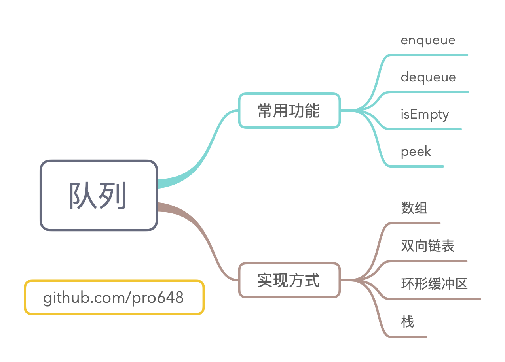

队列（Queue）数据结构是先进先出（FIFO，first-in, first-out）的线性表，先进入队列的元素，最先被移除。队列适用于移除顺序需与添加顺序保持一致的情况。

这篇文章将介绍队列的常用操作，使用多种方式实现队列，并分析其时间复杂度。

## 1. 常用操作

下面是为创建队列所提供的协议：

```
public protocol Queue {
    associatedtype Element
    mutating func enqueue(_ element: Element) -> Bool
    mutating func dequeue() -> Element?
    var isEmpty: Bool { get }
    var peek: Element? { get }
}
```

上述协议定义了队列的核心操作：

- 入队 enqueue：向队列尾部添加元素。操作成功返回 true；反之，返回 false。
- 出队 dequeue：移除队列头部元素，并返回移除的元素。
- isEmpty：检查队列是否为空。
- peek：返回队列头部元素，但并不移除。

队列只能从头部移除、尾部添加，不关心中间元素。如果有其他类型操作，数组可能更能满足你的需要。

下面将介绍四种不同创建队列的方式：

- 数组（Array）
- 双向链表（Doubly linked list）
- 圆形缓冲区（Ring Buffer）
- 使用两个栈（Stack）。

## 2. 使用数组实现队列

Swift 标准库提供了一些高度优化的基本数据结构（如有序的数组），可以使用这些数据结构构建更为高级的数据结构。

这一部分将使用数组创建队列：

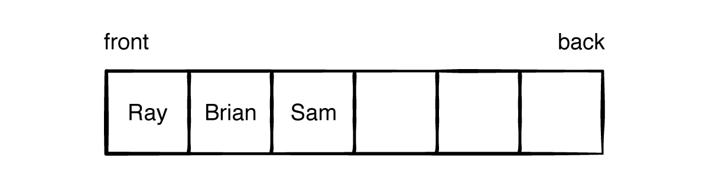

创建 QueueArray.swift 文件，添加以下代码：

```
/// 使用数组实现队列
public struct QueueArray<T>: Queue {
    // 存储使用数组
    private var array: [T] = []
    public init() { }
}
```

这里定义了通用类型结构体，遵守了`Queue`协议。

#### 2.1 队列状态

继续向 QueueArray 添加以下代码：

```
    public var isEmpty: Bool {
        array.isEmpty
    }
    
    public var peek: T? {
        array.first
    }
```

使用数组已有功能可以很方便的查看队列是否为空，查看队列第一个元素。这些操作的复杂度为`O(1)`。

#### 2.2 入队 Enqueue

向队列尾部添加元素只需调用数组的`append()`方法。添加以下代码：

```
    /// 入队元素
    /// - Parameter element: 要入队的元素
    /// - Returns: 入队成功，返回true；入队失败，返回false。
    public mutating func enqueue(_ element: T) -> Bool {
        array.append(element)
        return true
    }
```

入队操作的平均复杂度是`O(1)`。

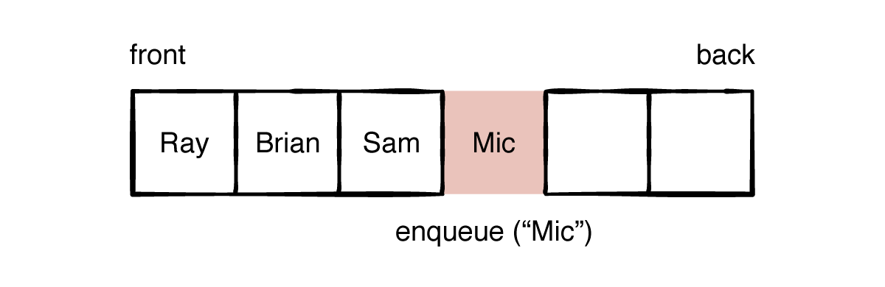

上图中，添加了Mic后还有两个空间。添加两个元素后，数据将被填满。再尝试添加元素时，数据将会扩容。

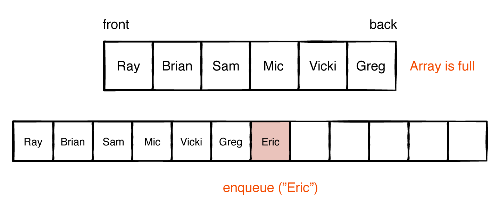

扩容时需要重新分配内存，将数组原来元素复制过来。每次扩容时容量都会翻倍，因此，扩容发生的频率并不高。入队的平均复杂度是`O(1)`，最坏情况复杂度是`O(n)`。

#### 2.3 出队 Dequeue

使用以下代码出队元素：

```
    /// 出队元素
    /// - Returns: 出队的元素。当队列为空时，返回nil。
    public mutating func dequeue() -> T? {
        isEmpty ? nil : array.removeFirst()
    }
```


从数据最前面移除元素是线性时间操作，它需要后面元素前移。出队复杂度是`O(n)`。

#### 2.4 实战

为了方便测试，让 QueueArray 遵守`CustomStringConvertible`协议，代码如下：

```
extension QueueArray: CustomStringConvertible {
    public var description: String {
        String(describing: array)
    }
}
```

使用以下代码对队列进行测试：

```
public func testQueueArray() {
    var queue = QueueArray<String>()
    queue.enqueue("Ray")
    queue.enqueue("Brian")
    queue.enqueue("Eric")
    queue
    queue.dequeue()
    queue
    queue.peek
}
```

根据控制台输出，查看队列表现是否符合预期。

#### 2.5 复杂度

基于数组的队列大部分操作都是常数时间的，只有`dequeue()`的时间复杂度是线性时间。

| 操作    | 平均复杂度 | 最坏情况复杂度 |
| ------- | ---------- | -------------- |
| enqueue | O(1)       | O(n)           |
| dequeue | O(n)       | O(n)           |

使用基于数组的队列非常简单，但也有一些缺陷。从最前面移除元素需移动后面所有元素，性能太低，数据量变大时尤为明显。数组填满时需扩容，且扩容后占用很多空闲空间。随着时间推移，它占用空间可能越来越大。

这些不足可以避免吗？下面看下基于链表的队列。

## 3. 基于双向链表的队列

双向链表与单向链表有些类似，只是结点同时包含了指向上一个结点的指针。

> 由于这篇文章的重点不在双向链表，你可以直接在这里获取[双向链表](https://github.com/pro648/BasicDemos-iOS/blob/master/Queue/Queue.playground/Sources/DoubleLinkedList.swift)的实现。如果你对链表不了解，可以查看我的另一篇文章[链表 LinkedList](https://github.com/pro648/tips/blob/master/sources/%E9%93%BE%E8%A1%A8%20LinkedList.md)。

创建 QueueLinkedList.swift 文件，并添加以下类：

```
public class QueueLinkedList<T>: Queue {
    // 内部存储使用双向链表
    private var list = DoublyLinkedList<T>()
    public init() { }
}
```

#### 3.1 入队 enqueue

使用下面代码向队列添加元素：

```
    /// 入队。
    /// - Parameter element: 要入队的元素
    /// - Returns: 入队成功，返回 true；反之，返回 false。使用基于链表的队列，不会入队失败。
    public func enqueue(_ element: T) -> Bool {
        list.append(element)
        return true
    }
```

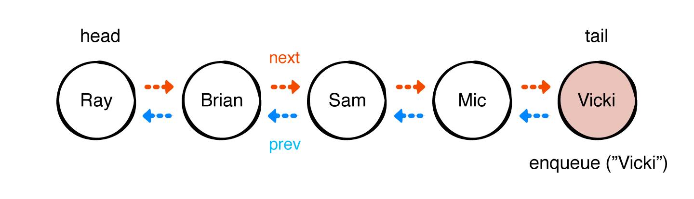

双向链表会更新 tail 节点的上一个、下一个指针，使其指向新添加的节点。由于只需更改指针，复杂度为`O(1)`。

#### 3.2 出队 Dequeue

使用下面代码移除头部元素：

```
    /// 出队，并返回出队的元素。
    /// - Returns: 队列为空时，返回空；反之，返回移除的元素。
    public func dequeue() -> T? {
        guard !list.isEmpty, let element = list.first else {
            return nil
        }
        
        return list.remove(element)
    }
```

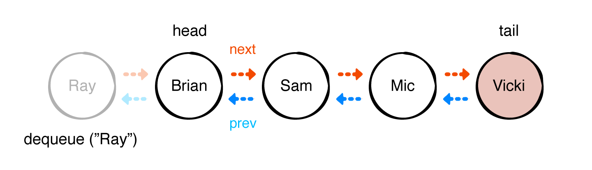

从头部移除元素时只需操作指针，复杂度为`O(1)`。与基于数组的队列相比，无需移动元素，只需更新前面两个节点的`next`和`previous`指针。

#### 3.3 队列状态

与数组类似，借助`DoublyLinkedList`的`peek`、`isEmpty`属性提供队列首部元素、是否为空功能。

```
    public var peek: T? {
        list.first?.value
    }
    
    public var isEmpty: Bool {
        list.isEmpty
    }
```

#### 3.4 实战

使用下面代码检验队列功能：

```
public func testQueueDoublyLinkedList() {
    let queue = QueueLinkedList<String>()
    queue.enqueue("Ray")
    queue.enqueue("Brian")
    queue.enqueue("Eric")
    queue
    queue.dequeue()
    queue
    queue.peek
}
```

这里的输出应与 QueueArray 队列输出相同。

#### 3.5 复杂度

下面是基于双向链表的队列复杂度：

| 操作    | 平均复杂度 | 最坏情况复杂度 |
| ------- | ---------- | -------------- |
| enqueue | O(1)       | O(1)           |
| dequeue | O(1)       | O(1)           |

QueueArray 主要问题是 dequeue 元素为线性时间，而基于双向链表的队列 dequeue 操作为恒定时间，即复杂度为`O(1)`。

上面表格并未体现出基于双向链表队列的缺点。尽管复杂度是`O(1)`，但它带有额外开销。每个元素都需要开辟额外空间存储指向上一个、下一个结点的指针，且每次创建元素时，都需要分配内存。与之相反，基于数组的队列一次开辟大量内存空间，其比多次开辟小空间性能更好。

是否可以避免多次分配内存空间，又保持`O(1)`复杂度？如果队列大小固定，可以使用环形缓冲区（Ring Buffer，也称为圆形缓冲区 circular buffer、圆形队列 circular queue、循环缓冲区 cyclic buffer）实现。例如，玩游戏时，使用基于环形缓冲区的队列记录游戏参与者的次序。

## 4. 基于环形缓冲区的队列

*环形缓冲区 ring buffer*是固定大小的数组。

#### 4.1 Ring Buffer 工作原理

下面介绍如何使用 ring buffer 实现队列。

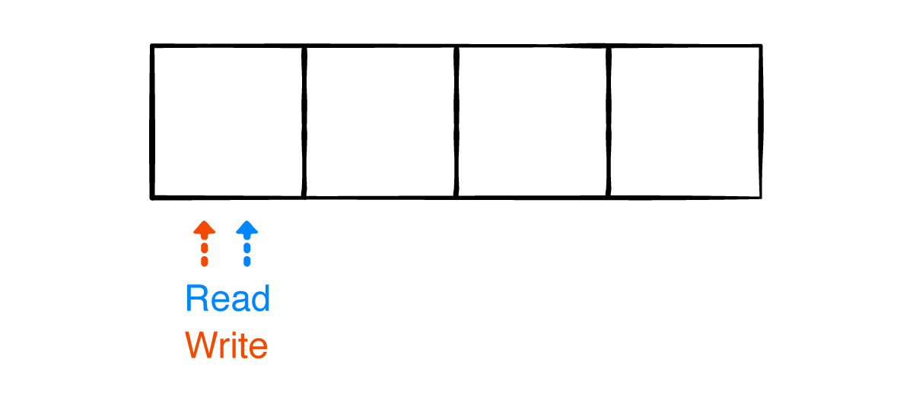

创建大小固定为四的环形缓冲区，它的两个指针用途如下：

- read 指针跟踪 queue 的头部。
- write 指针跟踪下一个可用空间，覆盖掉已经被读取的元素。

enqueue 元素如下：

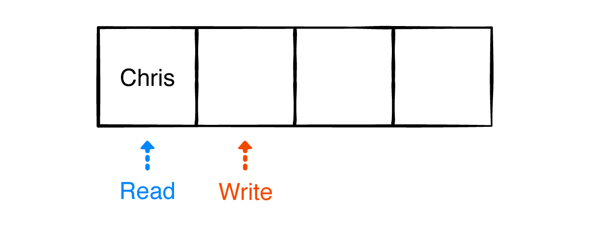

每次入队元素 write 指针加一。继续入队元素：

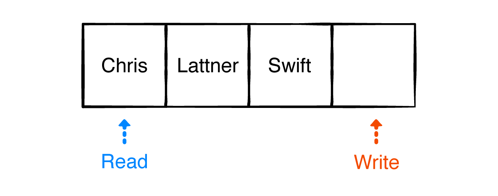

Write 指针在 read 指针前面两步，意味着队列不为空。

下面出队两个元素：

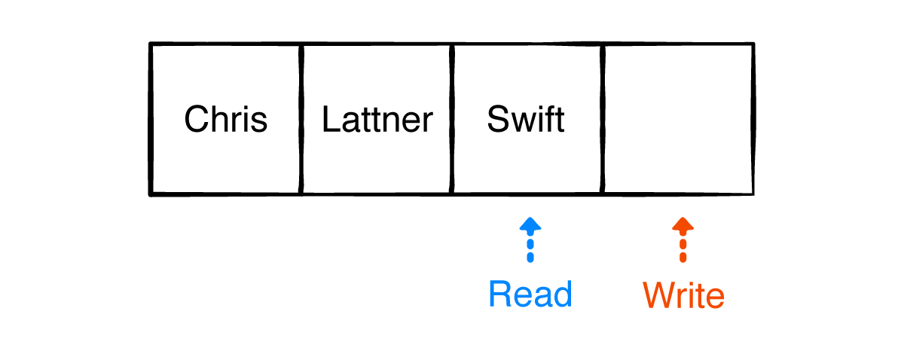

出队就是 read 指针读取 ring buffer 元素。

再次入队元素以填满队列：

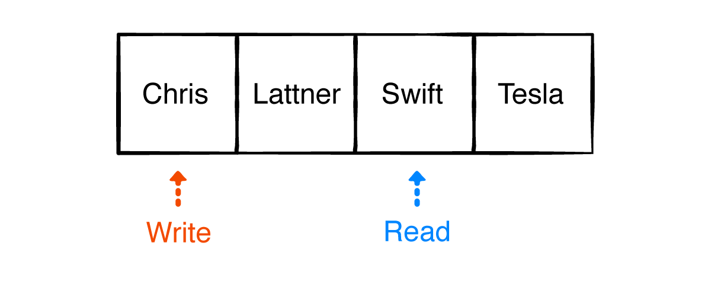

Write 指针到达尾部时，再次从头部开始，这也是这种数据结构为何被称为*环形缓冲区 circular buffer*。

再次 dequeue 两个元素：

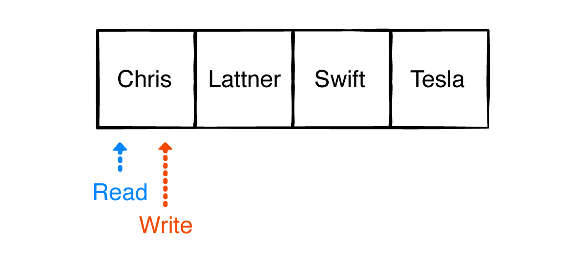

Read 指针也指向了头部，与 write 指针相遇，这时队列为空。

下面是 RingBuffer 的实现：

```
public struct RingBuffer<T> {
    // 使用数组存储
    private var array: [T?]
    private var readIndex = 0
    private var writeIndex = 0
    
    public init(count: Int) {
        array = Array<T?>(repeating: nil, count: count)
    }
    
    public var first: T? {
        array[readIndex]
    }
    
    /// 入队。
    /// - Parameter element: 要入队的原
    /// - Returns: 入队成功时，返回 true；反之，返回 false。当队列满时，入队会失败。
    public mutating func write(_ element: T) -> Bool {
        if !isFull {
            array[writeIndex % array.count] = element
            writeIndex += 1
            return true
        } else {
            return false
        }
    }
    
    /// 出队
    /// - Returns: 队列为空时，返回 nil；反之，返回出队的元素。
    public mutating func read() -> T? {
        if !isEmpty {
            let element = array[readIndex % array.count]
            readIndex += 1
            return element
        } else {
            return nil
        }
    }
    
    private var availableSpaceForReading: Int {
        writeIndex - readIndex
    }
    
    public var isEmpty: Bool {
        availableSpaceForReading == 0
    }
    
    private var availableSpaceForWriting: Int {
        array.count - availableSpaceForReading
    }
    
    public var isFull: Bool {
        availableSpaceForWriting == 0
    }
}

extension RingBuffer: CustomStringConvertible {
    public var description: String {
        let values = (0..<availableSpaceForReading).map {
            String(describing: array[($0 + readIndex) % array.count]!)
        }
        return "[" + values.joined(separator: ", ") + "]"
    }
}
```

在`QueueRingBuffer.swift`文件中添加以下代码：

```
public struct QueueRingBuffer<T>: Queue {
    
    /// 使用环形缓冲区存储
    private var ringBuffer: RingBuffer<T>
    
    /// 初始化队列
    /// - Parameter count: 指定队列的固定大小
    public init(count: Int) {
        ringBuffer = RingBuffer<T>(count: count)
    }
    
    public var isEmpty: Bool {
        ringBuffer.isEmpty
    }
    
    public var peek: T? {
        ringBuffer.first
    }
}
```

为了遵守`Queue`协议，这里也创建了`isEmpty`和`peek`属性。这里并未暴露`RingBuffer`类，而是提供了接口。`isEmpty`和`peek`操作的复杂度都是`O(1)`。

#### 4.2 入队 enqueue

使用以下方法入队元素：

```
    /// 入队
    /// - Parameter element: 要入队的元素
    /// - Returns: 入队成功时，返回 true；反之，返回 false。当队列满时，入队会失败。
    public mutating func enqueue(_ element: T) -> Bool {
        ringBuffer.write(element)
    }
```

直接调用`RingBuffer`的`write(_:)`方法即可。由于 Ring Buffer 有固定大小，需根据入队是否成功返回`true`、`false`。

#### 4.3 出队 dequeue

使用以下方法出队元素：

```
    /// 出队
    /// - Returns: 队列为空时，返回 nil；反之，返回出队的元素。
    public mutating func dequeue() -> T? {
        ringBuffer.read()
    }
```

#### 4.4 实战

使用下面代码检验基于环形缓冲区的队列：

```
public func testQueueRingBuffer() {
    var queue = QueueRingBuffer<String>(count: 3)
    queue.enqueue("Ray")
    queue.enqueue("Brian")
    queue.enqueue("Eric")
    queue
    queue.dequeue()
    queue
    queue.peek
}
```

上面方法输出与使用基于数组、双向链表的队列一致。

#### 4.5 复杂度

基于环形缓冲区的队列复杂度如下：

| 操作    | 平均复杂度 | 最坏情况复杂度 |
| ------- | ---------- | -------------- |
| enqueue | O(1)       | O(1)           |
| dequeue | O(1)       | O(1)           |

基于环形缓冲区队列复杂度与基于双向链表队列复杂度相同，但因为环形缓冲区有固定大小，enqueue 可能失败。

截止目前，分别介绍了基于数组、双向链表、环形缓冲区的队列。下面将介绍一种基于两个堆栈的队列，它在内存读取、存储方面优于双向链表，也无需像环形缓冲区那样有固定大小。

## 5. 基于两个栈的队列

在`QueueStack.swift`文件中添加以下结构体：

```
public struct QueueStack<T> : Queue {
    
    // 使用两个数组存储
    private var leftStack: [T] = []
    private var rightStack: [T] = []
    public init() { }
}
```

基于两个栈的队列整体逻辑很简单，当 enqueue 元素时，进入 Right Stack；当 dequeue 元素时，将 Right Stack 放入 Left Stack，再从 Left Stack pop 元素，这样就满足了先进先出原则。

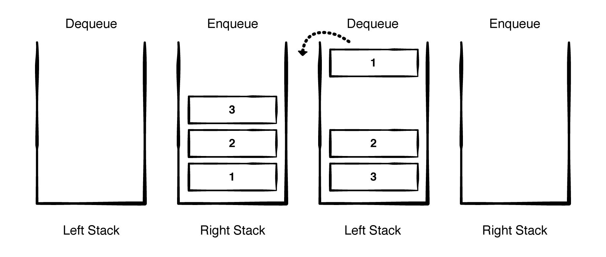

为了遵守`Queue`协议，添加以下属性：

```
    public var isEmpty: Bool {
        // 队列是否为空，只有两个栈都为空时才为空。
        leftStack.isEmpty && rightStack.isEmpty
    }
    
    public var peek: T? {
        // 如果leftStack不为空，返回它的最后一个；如果为空，返回rightStack第一个。
        !leftStack.isEmpty ? leftStack.last : rightStack.first
    }
```

`isEmpty`和`peek`操作复杂度都是`O(1)`。

#### 5.1 入队 enqueue

使用以下方法入队：

```
    public mutating func enqueue(_ element: T) -> Bool {
        // 入队时每次向 rightStack 添加
        rightStack.append(element)
        return true
    }
```

添加元素的复杂度是`O(1)`。

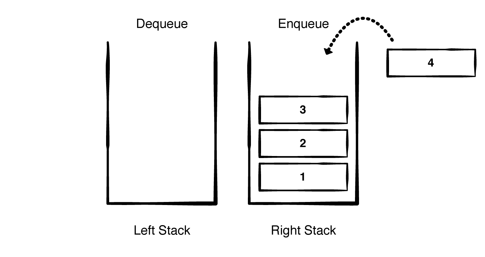

#### 5.2 出队 dequeue

使用下面代码出队元素：

```
    public mutating func dequeue() -> T? {
        if leftStack.isEmpty {  // 如果 leftStack 为空，将rightStack反转后存入leftStack，并清空rightStack。
            leftStack = rightStack.reversed()
            rightStack.removeAll()
        } else {    // leftStack不为空，则移除最后一个元素。
            return leftStack.popLast()
        }
    }
```

只有当 leftStack 为空时，才会将 rightStack 栈内元素反转后移动到 leftStack。

> 虽然反转数组复杂度是`O(n)`，但出队平均复杂度依然是`O(1)`。例如，左右两个栈均有很多元素，只有左侧栈为空时，才会将右侧栈反转后移动到左侧栈，之后继续移除左侧栈元素。反转操作发生频率很低。

#### 5.3 实战

使用下面代码检验基于两个栈实现的队列：

```
public func testQueueStacks() {
    var queue = QueueStack<String>()
    queue.enqueue("Ray")
    queue.enqueue("Brian")
    queue.enqueue("Eric")
    queue
    queue.dequeue()
    queue
    queue.peek
}
```

上面方法输出与使用基于数组、双向链表、圆形缓冲区的队列一致。

#### 5.4 复杂度

基于两个栈队列复杂度如下：

| 操作    | 平均复杂度 | 最坏情况复杂度 |
| ------- | ---------- | -------------- |
| enqueue | O(1)       | O(n)           |
| dequeue | O(1)       | O(n)           |

与基于数组的队列相比，基于两个栈的队列将出队时间复杂度从`O(n)`降低到了`O(1)`。

与基于环形缓冲区的队列相比，基于两个栈的队列没有固定大小。当右侧栈需要反转或容量变满时，它的复杂度是`O(n)`，但这些情况发生的频率并不高。

由于数组内存空间是连续的，首次访问时会添加到缓存，后续读取也会命中缓存。因此，在存取方面基于两个栈的队列，性能优于基于双向链表的队列。如下图所示：

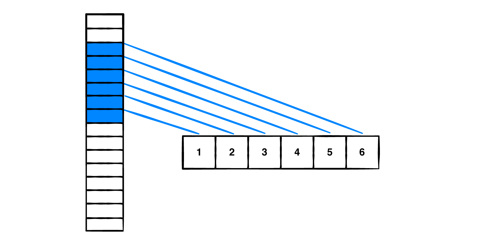

链表元素内存空间并未连续，会增加查找时间：

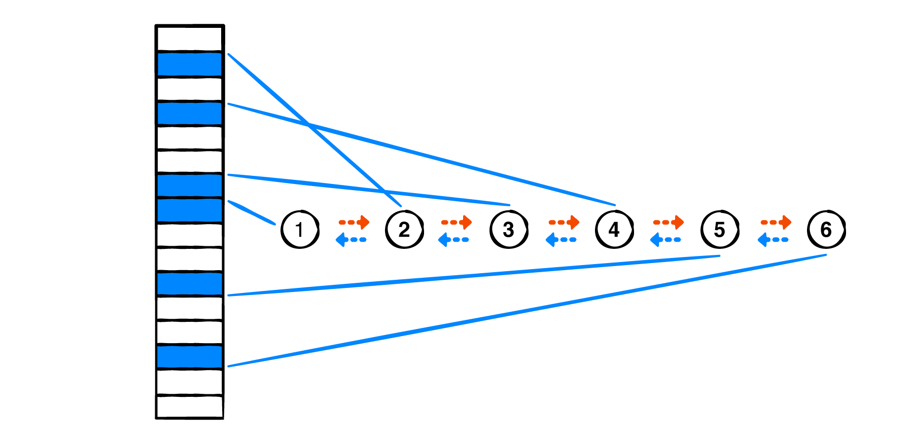

## 6. 队列算法题

这一部分介绍三道队列算法题。

#### 6.1 记录游戏次序

假设你在和朋友玩游戏，但大家都记不住该谁玩了。可以创建一个管理者，记录游戏次序。

队列数据结构适合解决上述问题。

下面是记录次序的协议：

```
protocol BoardGameManager {
    associatedtype Player
    mutating func nextPlayer() -> Player?
}
```

为`QueueLinkedList`添加以下 extension：

```
extension QueueLinkedList: BoardGameManager {
    public typealias Player = T
    
    public func nextPlayer() -> T? {
        // 通过dequeue获取下一个选手，如果获取不到，直接返回空。
        guard let person = dequeue() else { return nil }
        
        // enqueue 同一位选手，会将其添加到尾部。
        enqueue(person)
        return person
    }
}
```

使用以下代码进行测试：

```
var queue = QueueLinkedList<String>()
queue.enqueue("Vincent")
queue.enqueue("Remel")
queue.enqueue("Lukiih")
queue.enqueue("Allison")
print(queue)

print("==== boardgame ====")
queue.nextPlayer()
print(queue)
queue.nextPlayer()
print(queue)
queue.nextPlayer()
print(queue)
queue.nextPlayer()
print(queue)
```

使用不同的实现方式，它的时间复杂度可能不同。上面的算法使用了双向链表，它的时间复杂度是`O(1)`，空间复杂度也是`O(1)`；如果使用基于数据的队列，它的时间复杂度是`O(n)`，空间复杂度是`O(1)`。

#### 6.2 反转队列

实现一个算法，对队列进行反转。

Queue 是先进先出，Stack 是后进先出。可以使用 stack 辅助反转队列，即将 queue 内容插入 stack，再将 stack 元素 pop 后添加到 queue。

如下所示：

```
extension QueueArray {
    func reversed() -> QueueArray {
        // 创建 queue 副本
        var queue = self
        // 创建 stack
        var stack = Stack<T>()
        
        // dequeue queue的所有元素，并添加到 stack。
        while let element = queue.dequeue() {
            stack.push(element)
        }
        
        // 将 stack pop 后添加到 queue。
        while let element = stack.pop() {
            queue.enqueue(element)
        }
        
        return queue
    }
}
```

由于需遍历两次，它的时间复杂度是`O(n)`。

使用以下代码进行测试：

```
var queue = QueueArray<String>()
queue.enqueue("1")
queue.enqueue("8")
queue.enqueue("11")
queue.enqueue("648")

print("before: \(queue)")
print("after: \(queue.reversed())")
```

#### 6.3 双端队列

双端队列（doubled-ended queue，简写为 deque）是一种具有队列和栈性质的抽象数据类型，可以从两端插入、移除双端队列的元素。可以把 deque 认为既是 queue，又是 stack。

下面的`Deque`协议用于辅助创建自定义数据结构，`Direction`枚举用于描述操作针对头部还是尾部。

```
enum Direction {
    case front
    case back
}

protocol Deque {
    associatedtype Element
    var isEmpty:Bool { get }
    func peek(from direction: Direction) -> Element?
    
    mutating func enqueue(_ element: Element, to direction: Direction) -> Bool
    mutating func dequeue(from direction: Direction) -> Element?
}
```

环形缓冲区、栈、数组、双向链表都可用于构建双端队列，这里使用双向链表。

首先创建`DequeDoubleLinkedList`类，如下所示：

```
class DequeDoubleLinkedList<Element>: Deque {
    // 使用双向链表存储
    private var list = DoublyLinkedList<Element>()
    public init() { }
}
```

实现`isEmpty`，其复杂度是`O(1)`。

```
    var isEmpty: Bool {
        list.isEmpty
    }
```

下面实现`peek(from:)`方法，它的复杂度是`O(1)`。

```
    func peek(from direction: Direction) -> Element? {
        // 根据direction决定查看first还是last。
        switch direction {
        case .front:
            return list.first?.value
        
        case .back:
            return list.last?.value
        }
    }
```

下面实现`enqueue(_:)`方法，根据方向添加元素：

```
    func enqueue(_ element: Element, to direction: Direction) -> Bool {
        // 根据direction决定添加方式。
        switch direction {
        case .front:
            // 会将 element 设置为新的头节点
            list.prepend(element)
            
        case .back:
            // 会将 element 设置为新的尾节点
            list.append(element)
        }
        
        return true
    }
```

上面的方法只需更新指针指向，因此它的复杂度是`O(1)`。

下面实现`dequeue(_:)`方法：

```
    func dequeue(from direction: Direction) -> Element? {
        let element: Element?
        
        // 双向链表有指向前、后结点的指针，只需移除指针即可。
        switch direction {
        case .front:
            guard let first = list.first else { return nil }
            element = list.remove(first)
            
        case .back:
            guard let last = list.last else { return nil }
            element = list.remove(last)
        }
        return element
    }
```

与`enqueue(_:)`类似，`dequeue(_:)`的复杂度也是`O(1)`。

使用以下代码验证双端队列：

```
let deque = DequeDoubleLinkedList<Int>()
deque.enqueue(1, to: .back)
deque.enqueue(2, to: .back)
deque.enqueue(3, to: .back)
deque.enqueue(4, to: .back)

print(deque)

deque.enqueue(5, to: .front)

print(deque)

deque.dequeue(from: .back)
deque.dequeue(from: .back)
deque.dequeue(from: .back)
deque.dequeue(from: .front)
deque.dequeue(from: .front)
deque.dequeue(from: .front)

print(deque)
```

## 总结

- 队列是先进先出。
- enqueue 将元素添加到尾部。
- dequeue 移除队列头部元素。
- 数组的元素分布在连续内存块中；链表的元素随机分布，缓存命中率低。
- 环形缓冲区适合固定大小的队列。
- 使用两个栈可以将`dequeue(_:)`平均复杂度降低到`O(1)`，并且在查找方面优于双向链表。

Demo名称：Queue  
源码地址：<https://github.com/pro648/BasicDemos-iOS/tree/master/Queue>