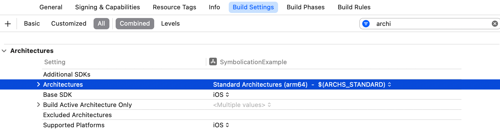
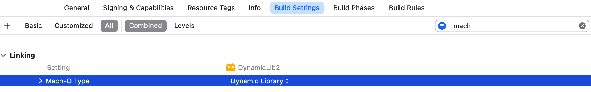
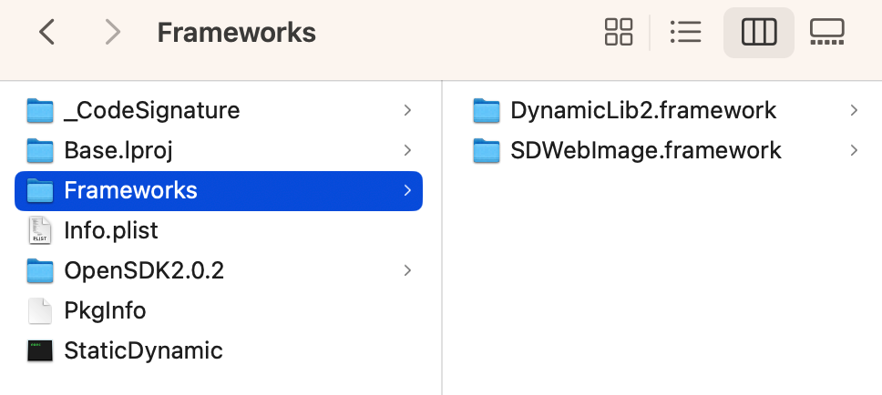
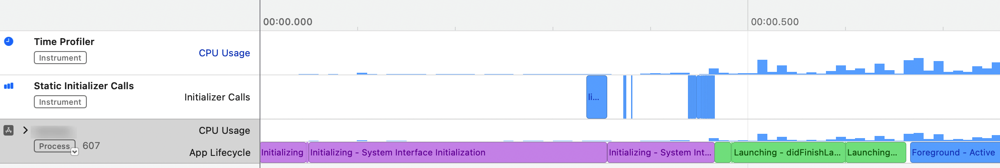

在任何平台上构建app，都需要处理系统框架、打包自己代码、使用第三方代码等。这篇文章将介绍以下内容：

- 什么是库（library）、framework、链接（link）、动态链接、静态链接。
- iOS、macOS链接的区别。
- 静态链接、动态链接对可执行文件大小、启动速度的影响。

## 1. Library

Library是计算机程序使用的非易失性资源集合，包含源代码。iOS、macOS上大部分library都会包含源码，支持一种或多种架构。Library可以被静态链接，称为静态库（static library）；也可以被动态链接，称为动态库（dynamic library）。

静态库命名格式通常为`lib*.a`，动态库命名格式为`*.dylib`。

## 2. CPU架构

所有需要使用该library的平台，都需要编译该CPU架构的二进制文件。

目前，macOS支持以下两种架构：

- `x86_64`：Intel的64位架构。发布于2005年至2021年的Mac都是该架构CPU。
- `arm64`：2020年后发布的Apple Silicon Mac都是该架构。

iOS模拟器运行在macOS上，因此使用所运行Mac上CPU架构。

iOS支持以下架构：

- `armv6`：发布于2009年前的iOS设备使用`armv6`架构，目前版本iOS SDK已经不支持该架构。
- `armv7`：32位ARM CPU，A5及以下的处理器使用。
- `armv7s`：A6、A6X处理器使用。
- `arm64`：当前在使用的64位架构CPU，iPhone 5s及以后设备使用。

可以在Xcode的Build Settings > Architectures查看当前target支持的架构，Xcode 14.2默认是Standard Architectures(ARM64)，可以通过Excluded Architectures移除对特定架构的支持。



## 3. Framework

Framework是一个包，可以包含预编译代码、字符串文件、图片、storyboard等。如果还包含其它framework，则称为umbrella framework。Apple的framework被组织成bundle，有约定的文件夹结构。在代码中可以通过`Bundle`类访问，在文件系统中也可以直接查看内容。


framework扩展名为`.framework`。

#### 3.1 静态framework

静态framework嵌入了静态库，必须静态链接。

#### 3.2 动态framework

动态framework嵌入了动态库，需要动态链接。

> 可以在Build Settings中修改framework类型，Linking -> Mach-O Type，如图所示：
>
> 

#### 3.3 Umbrella framework

Framework内包含了其它framework。Apple官方并不推荐使用这种方式。

## 4. 链接 Linking

链接器是一个应用程序，将一个或多个目标文件（object file）组合成一个可执行文件、库文件，或另一个object file。

通常，链接阶段在汇编阶段之后。尽管其并不相同，且由单独的模块执行，但这两阶段统称为编译或构建。

点击Xcode中Show the Report navigator可以查看Build Log，其包含每个target的编译流程，编译流程包含多个阶段，如：Create directory Headers、Write all-product-headers.yaml、Copy、Compile、Link、Sign等。展开Link日志，可以看到`Ld`命令。

#### 4.1 动态链接

许多操作系统环境允许动态链接，延迟符号绑定直到运行程序。动态链接意味着一个模块依赖另一个模块，其依赖在运行时解析。系统framework都是采用这种方式。例如，构建的app使用了`UIKit`，但二进制可执行文件只会引用`UIKit`，不会包含符号。系统会提供一个版本的`UIKit`，使用`dyld`加载。该版本的`UIKit`被当前设备上所有app共享，是操作系统的一部分。

如果引用的符号不存在，尝试解析时会导致crash，iOS、macOS上不太常见这种情况，但Windows中经常遇到`msvcrt.dll was not found`crash。

#### 4.2 静态链接

静态链接是链接器复制app使用的所有模块到可执行文件中。其优势是链接器可以只复制用到的符号，并且app启动时不需要动态绑定，启动速度更快，缺点的可执行文件大，初始内存占用多。

## 5. iOS、macOS上静态链接和动态链接

iOS、macOS上的静态链接与其它平台一样，都是链接器拷贝所需符号到二进制文件中。

#### 5.1 macOS上的动态链接

macOS上的动态链接与其它平台类似，操作系统开辟了共享动态链接库。开发者也可以提供自身的动态库，并在app间共享。

#### 5.2 iOS上的动态链接

在iOS上，所有系统模块都是动态链接的，例如：`Foundation`、`MapKit`、`UIKit`、`CoreGraphics`等。

这意味着这些动态库被该设备上所有app共享，操作系统嵌入了一个版本的动态库。

在iOS平台上，开发者无法安装一个动态库，在不同app间共享，即使使用了相同签名。这是因为app只能在自身的沙盒运行，不能访问其它位置文件。app与扩展间可以共享动态库。

因此，iOS上使用动态库时，必须嵌入包内。

#### 5.3 嵌入模块 Embed modules in the app binary

开启嵌入后，即代表允许编译阶段`Embed Frameworks`，其会将模块拷贝到二进制中，最终打包出的二进制文件内`Frameworks`文件夹中包含嵌入的framework。




#### 5.4 如何判断library、framework是静态还是动态

使用`file`命令查看二进制是静态的，还是动态的。

静态库常以ar archive标记，如下是微信SDK的静态库文件：

```
$ file libWeChatSDK.a
libWeChatSDK.a: Mach-O universal binary with 4 architectures: [arm_v7:current ar archive] [i386] [x86_64] [arm64]
libWeChatSDK.a (for architecture armv7):	current ar archive
libWeChatSDK.a (for architecture i386):	current ar archive
libWeChatSDK.a (for architecture x86_64):	current ar archive
libWeChatSDK.a (for architecture arm64):	current ar archive
```

动态库常以dynamically linked标记：

```
$ file SDWebImage
SDWebImage: Mach-O 64-bit dynamically linked shared library arm64
```

> Podfile文件中的`use_frameworks!`后添加linkage可以设定链接方式，`:static`或`:dynamic`。

## 6. 动态库、静态库对比

启动时长和内存占用是衡量app性能的两大指标。减小app可执行文件大小和启动内存占用，可以让app启动速度更快。使用动态库可以减小可执行文件大小，动态库在使用时才加载，这样可以进一步减少启动时长、内存占用。

App大部分功能是在可执行文件中实现的。使用static linker链接库时，库中代码会被拷贝到可执行文件中。Static linker将源码、库代码链接成一个可执行文件，app启动时一次载入内存。成为可执行文件一部分的library，称为静态库。静态库是object file的集合。

App启动后，可执行文件的机器码载进app进程的地址空间。链接太多静态库会导致可执行文件变大，下图展示了使用静态库函数后app内存占用。可执行文件过大会导致启动时间变长、内存占用大问题。静态库更新后，app必须重新打包才可以使用更新的功能。


更优的方案是调用时才将代码载入内存，可以是启动时，也可以是运行时。拥有这种灵活性的被称为动态库。动态库不会被链接进可执行文件，而是调用时加载。

下图展示了动态库如何节省内存占用：


下面从可执行文件大小、对app启动的影响、安全性、独立部署四个方面对比动态库、静态库。

1. 可执行文件大小
   - 静态库的可执行文件大。使用静态库时，链接器会将静态库代码拷贝到可执行文件中，静态库成为可执行文件的一部分。
   - 动态库的可执行文件小。在启动时或运行时，将动态库代码加载到内存，动态库不会成为可执行文件的一部分，因此，使用动态库的可执行文件较小。

2. 启动耗时
   - 静态链接启动速度快。所有符号都在同一个模块内，没有符号绑定的耗时，启动速度快。但二进制文件太大，启动时占用内存也会多，太多的page fault也会增加启动耗时。
   - 动态链接启动慢，尤其在iOS中。Apple在WWDC中推荐iOS app最多使用六个动态库，macOS没有说明。这一推荐值随硬件性能变化而变。
3. 安全性（运行时是否会查找不到符号）
   - 静态链接是安全的。因为编译时会将静态库符号拷贝到可执行文件中，不会出现查找不到符号。
   - 有风险。尽管编译器会进行验证，但可能由于开发忘记嵌入而导致Library not loaded ... Reason: image not found。macOS中app之间可以共享动态库，可能因为动态库版本差异导致找不到符号。
4. 独立部署
   - 静态库不支持独立部署。所有内容都在一个二进制文件中提供，无法仅部署部分依赖。
   - 动态库：
     - iOS禁止部署单独库、框架。
     - 如果模块安装到了共享位置，macOS支持部署单独的库、框架。

## 7. 何时使用动态链接

#### 7.1 macOS中共享代码

动态链接的库与app的主可执行文件在app bundle中分开存储，且应用启动时必须由动态链接器加载。Apple官方的所有框架都以动态方式链接，以便在进程间共享代码，系统升级后app自动获得功能升级。同样，也可以使用动态框架在app和扩展之间共享代码。在iOS中，即使app由同一开发者签名，也无法在单独app之间共享动态框架；在macOS中，可以把框架安装到共享位置，这样不同app之间可以共享。

> 可以通过在Podfile中明确指定链接类型来强制以静态方式链接所有框架。
>
> ```
> use_frameworks! :linkage => :static
> ```
>
> CocoaPods不支持单独设置依赖为静态、动态，具体可以查看这里：[use_frameworks! for only some pods](https://github.com/CocoaPods/CocoaPods/issues/3839)。如果你需要组合使用静态库、动态库，可以查看这篇文章：[Mixing static and dynamic linking in CocoaPods](https://medium.com/microsoft-mobile-engineering/mixing-static-and-dynamic-linking-in-cocoapods-83b6d4252c59)

#### 7.2 多个静态库依赖同一个模块

假设模块`Common`被app内多个模块使用，FeatureA -> Common，FeatureB -> Common。如果FeatureA、FeatureB、Common都是静态库，编译app时控制台会出现报错：*duplicate symbol MY_COMMON_SYMBOL in ... FeatureA and ... FeatureB*。这是因为静态链接时，FeatureA、FeatureB二进制都会包含Common的符号。运行时，动态链接器无法确定应该链接哪个符号。

这时，将Common改为动态库，FeatureA、FeatureB都只引用Common符号，运行时才进行解析即可。

## 8. 动态库对启动速度的影响

#### 8.1 热启与冷启

App启动时长受启动前设备状况影响。例如，在iOS中返回主屏幕后再立即打开app是进入最快的方式，其是恢复原来状态。如果系统判断到需要重启，一般称为热启（warm launch）。

相反，如果用户玩了占用内存很高的游戏，再次进入你的app时，app启动速度可能变慢。在iOS中，内存优先分配给前台app，后台app占用内存可能被驱逐。App依赖的framework、守护进程内存也可能被驱逐，这时app启动也需要将依赖的库、守护进程载进内存。这种场景、或手机重启后的启动称为冷启（cold launch）。

实际使用中，你的用户即会遇到热启，也会遇到冷启。因此，测试启动时长时需要在不同的设备进行。

#### 8.2 对启动时长的影响

WWDC2016 406 Optimizing App Startup Time中介绍了动态库为何会影响启动速度，并建议动态库不要超过6个。目前该视频在Apple官网已经无法观看，[Reducing your app’s launch time](https://developer.apple.com/documentation/xcode/reducing-your-app-s-launch-time/)也介绍了动态库的影响，但没有提及动态库数量限制。

低版本的Xcode添加环境参数`DYLD_PRINT_STATISTICS`可以打印启动过程各阶段耗时，最新版本的Xcode 14.2已经不支持`DYLD_PRINT_STATISTICS`命令。

Xcode仍然支持以下环境参数：

- DYLD_PRINT_LIBRARIES：打印模块加载日志。
- DYLD_PRINT_APIS：打印调用动态链接器解析符号地址。
- DYLD_PRINT_SEGMENTS：打印动态链接器将动态库中segment映射到app进程地址空间。
- DYLD_PRINT_BINDINGS：打印动态链接器将外部符号与定义绑定。

可以使用Instruments中的App Launch分析启动耗时：



> 关于如何减少启动时长，可以查看这篇文档：[Reducing your app’s launch time](https://developer.apple.com/documentation/xcode/reducing-your-app-s-launch-time/)

## 总结

这篇文章介绍了library、framework，以及其如何链接的。对比了动态库、静态库的优缺点，你需要选择最适合你的方案，并了解选择产生的影响。

参考资料：

1. [Introduction to Static vs Dynamic libraries and frameworks on iOS (and macOS)](https://bpoplauschi.github.io/2021/10/24/Intro-to-static-and-dynamic-libraries-frameworks.html)
2. [use_frameworks!](https://guides.cocoapods.org/syntax/podfile.html#use_frameworks_bang)
3. [Advanced Static vs Dynamic libraries and frameworks on iOS (and macOS)](https://bpoplauschi.github.io/2021/10/25/Advanced-static-vs-dynamic-libraries-and-frameworks.html)
4. [Logging Dynamic Loader Events](https://developer.apple.com/library/archive/documentation/DeveloperTools/Conceptual/DynamicLibraries/100-Articles/LoggingDynamicLoaderEvents.html)
5. [Reducing your app’s launch time](https://developer.apple.com/documentation/xcode/reducing-your-app-s-launch-time/)
6. [Overview of Dynamic Libraries](https://developer.apple.com/library/archive/documentation/DeveloperTools/Conceptual/DynamicLibraries/100-Articles/OverviewOfDynamicLibraries.html#//apple_ref/doc/uid/TP40001873-SW1)
7. [iOS app size for static libraries vs dynamic frameworks](https://stackoverflow.com/questions/51524281/ios-app-size-for-static-libraries-vs-dynamic-frameworks)
8. [58 同城 App 性能治理实践-iOS 启动时间优化](https://mp.weixin.qq.com/s/wkK2UBvuUZW3Pf0Yd_3XTA)

