这篇文章将介绍如何使用`UIVisualEffectView`实现 iOS 系统中各种模糊效果（blur effect）、鲜艳度效果（vibrancy effect），以及模糊效果的原理。

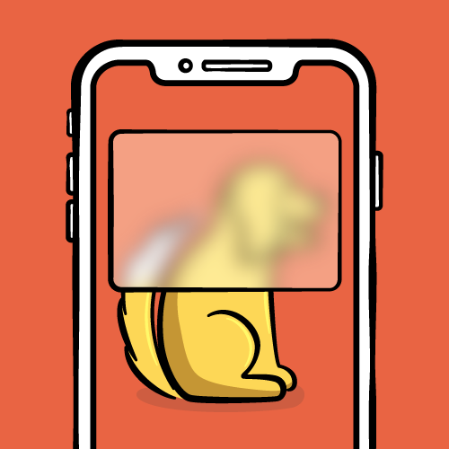

自 iOS 7 设计风格改变后，模糊效果在 app 中越来越常见。合理运用可以改善 app 可用性和外观。

iOS 系统中很多地方使用了模糊效果，最为明显的有控制中心、通知中心。控制中心的模糊显示了当前活跃的app，而非控制中心自身。通知中心没有给整个背景添加模糊，而是为每条通知添加了模糊。这样不仅看起来更美，也让元素更为突出。

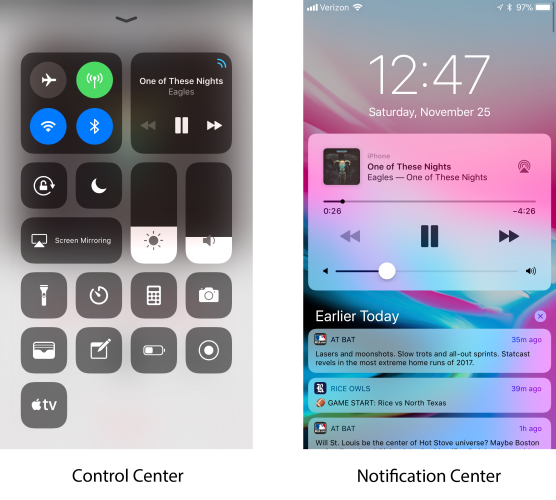

使用`UIVisualEffectView`可以实现上述模糊效果。

## 1. 模糊的原理

模糊起始于图像。要实现模糊，需对每一像素执行模糊算法。最终，得到原始图像的均匀模糊版本。模糊算法的样式、复杂度各不相同，这里介绍一种常见的模糊算法：高斯模糊（gaussian blur）。

高斯模糊将正态分布用于图像处理。本质上，它是一种数据平滑技术（data smoothing），适用于多个场合，图像处理恰好提供了一个直观的应用实例。

#### 1.1 高斯模糊原理

模糊可以理解成每一个像素都取周边像素的平均值。

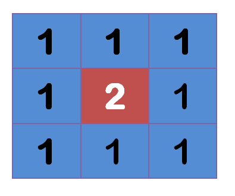

上图中，2是中间点，周边都是1。中间点取周围点的平均值，就会变成1。如下图所示：

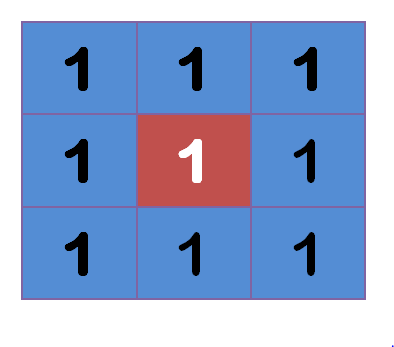

在数值上，这是一种平滑化。在图像上，就相当于产生模糊效果，中间点失去细节。


计算平均值时，取值范围越大，模糊效果越强烈。

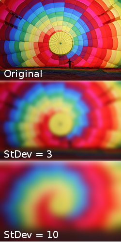

上面分别是原图、模糊半径3像素、10像素的效果。模糊半径越大，图像就越模糊。从数值角度看，就是数值越平滑。

> 通常，模糊半径越大，处理图片所需资源越多。iOS 为了避免主线程拥堵，会将尽可能多的任务移交给 GPU 处理。

既然每个点都要取周边像素的平均值，那应如何分配权重呢？如果简单平均，显然不尽合理。因为图像都是连续的，越靠近的点关系越紧密；反之则疏远。因此，加权平均更合理，距离越近的点权重越大，距离越远的点权重越小。

正态分布就是一种可取的权重分配模式。

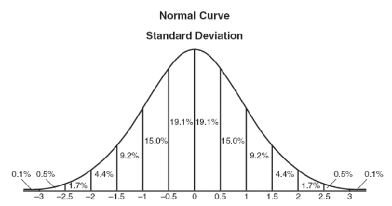

正态分布是一维的，图像是二维的，因此我们需要二维的正态分布。

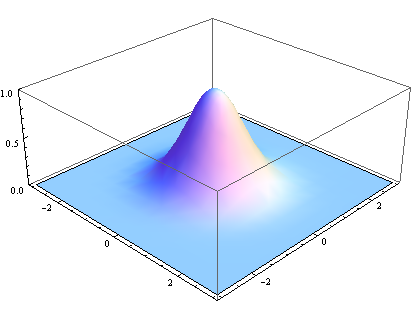

正态分布的密度函数叫做高斯函数，可以根据高斯函数计算每个点的权重，然后根据每个点的权重计算高斯模糊值。对所有点重复这个过程，就得到了高斯模糊后的图像。如果原图是彩色图像，可以对RGB三个通道分别做高斯模糊。

## 2. 模糊效果

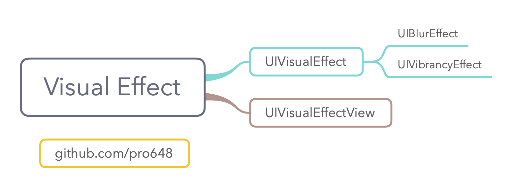

这里使用[WebKit](https://github.com/pro648/tips/blob/master/sources/WebKit%E7%9A%84%E4%BD%BF%E7%94%A8.md)浏览网页，点击皇冠时在底部弹出一个视图，为弹出的视图添加模糊效果。这样后续滑动 webview 时可以看到滚动的模糊效果。

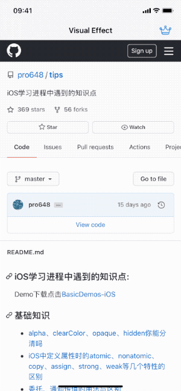

#### 2.1 UIBlurEffect

`UIBlurEffect`继承自`UIVisualEffect`，导航栏、通知中心、控制中心的模糊效果都由`UIBlurEffect`提供。

下面为`bottomView`添加模糊效果：

```
        // 选用 dark 类型 blur
        let blurEffect = UIBlurEffect(style: .dark)
        // blur effect 需要添加到 UIVisualEffectView
        let blurView = UIVisualEffectView(effect: blurEffect)
        bottomView.addSubview(blurView)
        
        blurView.translatesAutoresizingMaskIntoConstraints = false
        NSLayoutConstraint.activate([
            blurView.heightAnchor.constraint(equalTo: bottomView.heightAnchor),
            blurView.widthAnchor.constraint(equalTo: bottomView.widthAnchor),
        ])
        
        // 子视图不能直接添加到blurView，只能添加到contentView。
        blurView.contentView.addSubview(houseLabel)
        houseLabel.translatesAutoresizingMaskIntoConstraints = false
        NSLayoutConstraint.activate([
            houseLabel.centerXAnchor.constraint(equalTo: blurView.centerXAnchor),
            houseLabel.centerYAnchor.constraint(equalTo: blurView.centerYAnchor),
        ])
```

`UIBlurEffect.Style`有以下这些类型：

- extraLight：视图比底层视图颜色浅。
- light：视图与底层视图亮度类似。
- dark：视图比底层视图颜色深。
- extraDark：视图比底层视图颜色更深。
- regular：自适应用户界面。
- prominent：根据背景色自动使内容更加突出。

> 此外，iOS 13 中还添加了一些自适应浅色、深色的模糊效果，如systemUltraThinMaterialLight、systemChromeMaterialDark等。

`UIVisualEffectView`继承自`UIView`，需将`UIVisualEffectView`添加到要添加模糊效果的视图，视图层级中其它子视图需添加到`UIVisualEffectView`的`contentView`中，直接添加到`UIVisualEffectView`会导致闪退。

运行后效果如下：

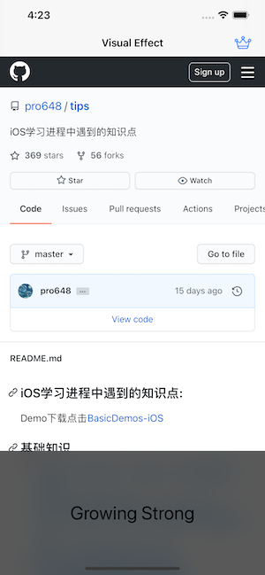

#### 2.2 UIVibrancyEffect

`UIVibrancyEffect`继承自`UIVisualEffect`。`UIVibrancyEffect`与`UIVisualEffectView`组合使用，可以让内容颜色更鲜艳。

下图显示了`UIVibrancyEffect`让文本、图标更易识别：

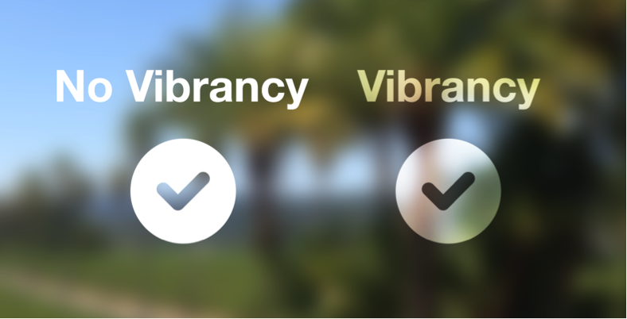

使用以下代码添加`UIVibrancyEffect`效果：

```
        // 使用之前的blurEffect创建UIVibrancyEffect
        let vibrancyEffect = UIVibrancyEffect(blurEffect: blurEffect)
        let vibrancyView = UIVisualEffectView(effect: vibrancyEffect)
        // UIVibrancyEffect 必须添加到配置了UIBlurEffect的UIVisualEffectView的contentView上，否则不会有效果。
        blurView.contentView.addSubview(vibrancyView)

        vibrancyView.translatesAutoresizingMaskIntoConstraints = false
        NSLayoutConstraint.activate([
            vibrancyView.heightAnchor.constraint(equalTo: blurView.heightAnchor),
            vibrancyView.widthAnchor.constraint(equalTo: blurView.widthAnchor),
            vibrancyView.centerXAnchor.constraint(equalTo: blurView.centerXAnchor),
            vibrancyView.centerYAnchor.constraint(equalTo: blurView.centerYAnchor),
        ])
        
        // 将文本添加到 UIVibrancyEffect 视图的contentView上。添加到vibrancyView上的所有控件都会具有 vibrancy effect。
        vibrancyView.contentView.addSubview(houseLabel)
        houseLabel.translatesAutoresizingMaskIntoConstraints = false
        NSLayoutConstraint.activate([
            houseLabel.centerXAnchor.constraint(equalTo: vibrancyView.centerXAnchor),
            houseLabel.centerYAnchor.constraint(equalTo: vibrancyView.centerYAnchor),
        ])
```

将`houseLabel`添加到`vibrancyView`前，需先注释掉将其添加到`blurView`的代码：

```
        blurView.contentView.addSubview(houseLabel)
        houseLabel.translatesAutoresizingMaskIntoConstraints = false
        NSLayoutConstraint.activate([
            houseLabel.centerXAnchor.constraint(equalTo: blurView.centerXAnchor),
            houseLabel.centerYAnchor.constraint(equalTo: blurView.centerYAnchor),
        ])
```

运行后如下：

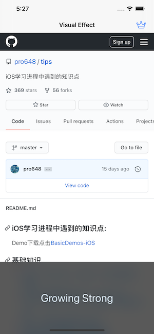

#### 2.3 UIVisualEffectView

使用`UIVisualEffectView`时，不能直接向其添加子视图，子视图需添加到其`contentView`。

###### 2.3.1 alpha

应避免设置`alpha`小于1。半透明视图会导致视图、子视图[离屏渲染](https://github.com/pro648/tips/blob/master/sources/%E5%9B%BE%E5%B1%82%E6%80%A7%E8%83%BD%E4%B9%8B%E7%A6%BB%E5%B1%8F%E6%B8%B2%E6%9F%93%E3%80%81%E6%A0%85%E6%A0%BC%E5%8C%96%E3%80%81%E5%9B%9E%E6%94%B6%E6%B1%A0.md#2-%E7%A6%BB%E5%B1%8F%E6%B8%B2%E6%9F%93-offscreen-rendering)，进而影响性能。`UIVisualEffectView`或其父视图alpha小于1会导致模糊效果显示错误，甚至没有模糊效果。

###### 2.3.2 mask

为`UIVisualEffectView`设置mask后，visual effect view 会将`mask`转发给它的内部视图，包括`contentView`。也可以直接为`contentView`添加 mask。为`UIVisualEffectView`的父视图设置 mask 会导致特效失效，且会抛出异常。

2.3.3 截屏

`UIVisualEffectView`的许多特效都需要包含该视图的 window 支持。尝试只截取`UIVisualEffectView`会导致截屏不包含任何特效。截取包含`UIVisualEffectView`特效的视图层级时，必须截取包含特效的整个`UIWindow`或`UIScreen`。

## 3. 降低透明度

使用模糊效果时，需考虑用户在系统设置中开启了「降低透明度」时怎么办？

进入系统设置 > 辅助功能 > 显示与文字大小 > 降低透明度，开启降低透明度。返回app后，再次弹出底部视图，效果如下：

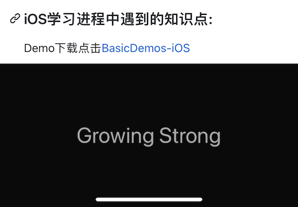

开启「降低透明度」后，模糊效果会消失。使用`UIAccessibility.isReduceTransparencyEnabled`方法可以查看当前是否开启了「降低透明度」。

在设置透明效果前添加以下代码，即如果开启了「降低透明度」，就不使用模糊效果。

```
        // 系统开启了「降低透明度」
        guard !UIAccessibility.isReduceTransparencyEnabled else {
            bottomView.backgroundColor = .lightGray
            bottomView.addSubview(houseLabel)
            houseLabel.translatesAutoresizingMaskIntoConstraints = false
            NSLayoutConstraint.activate([
                houseLabel.centerXAnchor.constraint(equalTo: bottomView.centerXAnchor),
                houseLabel.centerYAnchor.constraint(equalTo: bottomView.centerYAnchor),
            ])
            return
        }
```

运行app后，开启「降低透明度」后app也可以正常显示了。

Demo名称：VisualEffectView  
源码地址：<https://github.com/pro648/BasicDemos-iOS/tree/master/VisualEffectView>

参考资料：

1. [高斯模糊的算法](https://www.ruanyifeng.com/blog/2012/11/gaussian_blur.html)
2. [UIVisualEffectView Tutorial: Getting Started](https://www.raywenderlich.com/167-uivisualeffectview-tutorial-getting-started)

